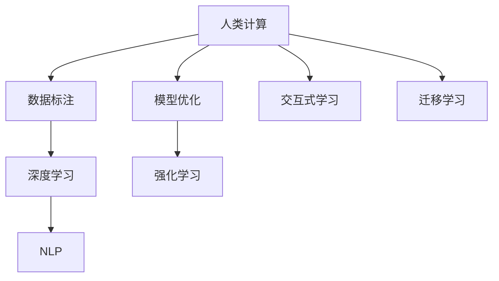

                 

# AI驱动的创新：利用人类计算的力量

## 1. 背景介绍

随着人工智能技术的迅猛发展，AI正逐步渗透到各个领域，带来深远的变革。然而，在AI技术演进的背后，有一股不容忽视的力量，那就是“人类计算”。本文将从人工智能与人类计算的结合点出发，探讨如何利用这一力量驱动AI的创新，以期为AI技术的实际应用提供新的思路和方向。

### 1.1 问题由来

在AI技术发展的早期，科学家们主要依赖传统计算机进行大规模计算。然而，随着AI算法复杂度的不断提升，传统计算资源的限制愈发明显。这时，人类计算作为一种新型的计算模式，逐渐显现出其独特的优势。

人类计算是指利用人类的认知能力进行计算和推理的过程。在AI领域，人类计算主要体现在以下几个方面：

1. **数据标注与验证**：AI模型通常需要大量的标注数据进行训练，而数据标注过程往往需要大量的人工参与。利用人类计算，可以快速、准确地标注数据，从而加速模型训练。

2. **模型优化与调试**：AI模型的优化与调试过程复杂且耗时，通过人类计算，可以快速发现模型中的问题并进行调整，从而提高模型的性能和鲁棒性。

3. **交互式学习与迭代**：在AI训练和推理过程中，利用人类计算可以引入用户反馈，通过交互式学习不断优化模型，提升用户体验。

### 1.2 问题核心关键点

人类计算在AI中的核心关键点主要包括：

- **数据高效标注**：如何利用人类计算快速、准确地标注数据，以便于模型训练。
- **模型高效优化**：如何利用人类计算快速发现和修正模型中的问题，提升模型性能。
- **交互式学习与迭代**：如何利用人类计算引入用户反馈，进行交互式学习，不断优化模型。

## 2. 核心概念与联系

### 2.1 核心概念概述

为了更好地理解人类计算在AI中的应用，本节将介绍几个密切相关的核心概念：

- **人类计算(Human Computation)**：利用人类认知能力进行计算和推理的过程。

- **机器学习(Machine Learning)**：使计算机系统能够从数据中学习并作出预测或决策的算法。

- **深度学习(Deep Learning)**：一种特殊的机器学习方法，通过多层神经网络进行特征提取与学习。

- **迁移学习(Transfer Learning)**：利用预训练模型在不同任务之间的迁移能力，加速模型训练。

- **强化学习(Reinforcement Learning)**：通过奖励机制，使计算机系统在特定环境中学习最优策略。

- **交互式学习(Interactive Learning)**：通过与用户或环境的交互，不断调整模型参数，提升模型性能。

- **自然语言处理(Natural Language Processing, NLP)**：使计算机系统能够理解、处理和生成自然语言的技术。

这些核心概念之间的逻辑关系可以通过以下Mermaid流程图来展示：



这个流程图展示了一系列与人类计算相关的核心概念及其之间的关系：

1. 人类计算利用人类认知能力进行计算和推理。
2. 数据标注和模型优化是利用人类计算加速AI训练的两个重要过程。
3. 交互式学习和迁移学习则是人类计算在AI中的两个应用方向。
4. 深度学习和强化学习是AI中的两种主要算法。
5. NLP则是人类计算在AI中应用最广泛的领域之一。

这些概念共同构成了人类计算在AI中的主要框架，使得AI技术能够更好地利用人类的智慧和能力，提升其实际应用效果。

## 3. 核心算法原理 & 具体操作步骤
### 3.1 算法原理概述

利用人类计算驱动AI创新的核心原理，在于通过人类计算高效地进行数据标注、模型优化、交互式学习等过程，从而加速AI模型的训练和部署。其核心思想是：

1. **数据高效标注**：利用众包平台、人工标注团队等方式，快速、准确地标注大量数据，以供模型训练。

2. **模型高效优化**：通过人类计算快速发现和修正模型中的问题，提升模型性能。

3. **交互式学习与迭代**：利用用户反馈和交互式学习，不断优化模型，提升用户体验。

### 3.2 算法步骤详解

以下是一个典型的人类计算在AI中的应用场景：

**场景：** 利用人类计算进行数据标注和模型训练

1. **数据准备**：收集大量未标注数据，选择合适的标注任务。

2. **搭建标注平台**：使用众包平台（如Amazon Mechanical Turk、CrowdFlower等），邀请工人进行数据标注。

3. **数据标注**：工人根据任务要求，对数据进行标注，提交标注结果。

4. **数据验证**：选择部分标注结果进行人工验证，确保标注质量。

5. **模型训练**：利用标注数据训练AI模型，优化模型参数。

6. **模型评估**：对训练好的模型进行评估，确保其性能符合预期。

7. **模型优化**：根据评估结果，进行模型优化，重新训练模型。

8. **部署应用**：将训练好的模型部署到实际应用中，进行实时推理和反馈。

### 3.3 算法优缺点

人类计算驱动AI的优点包括：

1. **高效性**：利用人类计算快速标注数据，加速模型训练。

2. **准确性**：人工标注能够保证数据标注的准确性，提升模型性能。

3. **灵活性**：人类计算能够适应多种标注任务，灵活性高。

4. **普适性**：适用于多种AI应用场景，如计算机视觉、自然语言处理、推荐系统等。

同时，人类计算也存在一些局限性：

1. **成本高**：人工标注需要支付工钱，成本较高。

2. **标注质量不稳定**：标注质量受工人水平影响较大。

3. **数据隐私问题**：数据隐私和安全问题需要特别注意。

4. **标注速度慢**：标注速度相对较慢，难以满足大规模数据需求。

尽管存在这些局限性，人类计算仍然是AI训练和优化过程中不可或缺的一环，尤其是在数据标注和模型优化等方面。未来，随着技术的发展和应用的普及，这些局限性将逐步得到缓解。

### 3.4 算法应用领域

人类计算在AI中的应用领域非常广泛，涵盖以下几个方面：

1. **计算机视觉**：利用人类计算进行图像分类、目标检测等任务的标注和验证。

2. **自然语言处理**：利用人类计算进行文本分类、情感分析、命名实体识别等任务的标注和优化。

3. **推荐系统**：利用人类计算进行用户行为数据的标注和分析，优化推荐算法。

4. **医疗诊断**：利用人类计算进行医学图像的标注和诊断，提升医疗诊断的准确性。

5. **金融风控**：利用人类计算进行金融数据的标注和分析，提升风险评估的准确性。

6. **智能客服**：利用人类计算进行用户反馈的标注和分析，优化客服策略。

这些领域的应用，展示了人类计算在AI中的巨大潜力和广泛前景。随着技术的进步和应用的深入，人类计算将在更多领域发挥重要作用，驱动AI技术的不断创新和进步。

## 4. 数学模型和公式 & 详细讲解  
### 4.1 数学模型构建

在利用人类计算进行AI训练和优化的过程中，我们可以构建以下数学模型：

- **数据标注模型**：用于描述数据标注过程的数学模型，通常使用线性回归或逻辑回归进行建模。

- **模型优化模型**：用于描述模型优化过程的数学模型，通常使用梯度下降等优化算法进行求解。

- **交互式学习模型**：用于描述交互式学习过程的数学模型，通常使用强化学习或对抗生成网络等方法进行建模。

### 4.2 公式推导过程

以数据标注模型为例，下面推导一个简单的线性回归模型：

设数据集为 $D = \{(x_i, y_i)\}_{i=1}^N$，其中 $x_i$ 为输入，$y_i$ 为标签。假设线性模型为 $y = wx + b$，其中 $w$ 为模型参数，$b$ 为偏置项。

根据最小二乘法的原理，可以构建目标函数：

$$
J(w) = \frac{1}{N} \sum_{i=1}^N (y_i - wx_i - b)^2
$$

利用梯度下降算法，求解目标函数的最小值：

$$
w \leftarrow w - \eta \nabla_{w}J(w)
$$

其中 $\eta$ 为学习率。

### 4.3 案例分析与讲解

**案例：** 利用人类计算进行文本分类

假设我们要训练一个文本分类模型，用于判断电影评论是正面还是负面。我们首先需要收集大量未标注的电影评论数据，利用人类计算进行标注。

1. **数据准备**：收集大量未标注的电影评论数据，并划分训练集和测试集。

2. **数据标注**：利用众包平台，邀请工人标注电影评论的情感倾向（正面或负面）。

3. **数据验证**：选择部分标注结果进行人工验证，确保标注质量。

4. **模型训练**：利用标注数据训练模型，如逻辑回归、支持向量机等。

5. **模型评估**：在测试集上评估模型的性能，如准确率、召回率、F1值等。

6. **模型优化**：根据评估结果，进行模型参数的调整和优化。

7. **部署应用**：将训练好的模型部署到实际应用中，进行实时推理和反馈。

## 5. 项目实践：代码实例和详细解释说明
### 5.1 开发环境搭建

在进行人类计算驱动AI的项目实践前，我们需要准备好开发环境。以下是使用Python进行PyTorch开发的环境配置流程：

1. 安装Anaconda：从官网下载并安装Anaconda，用于创建独立的Python环境。

2. 创建并激活虚拟环境：
```bash
conda create -n pytorch-env python=3.8 
conda activate pytorch-env
```

3. 安装PyTorch：根据CUDA版本，从官网获取对应的安装命令。例如：
```bash
conda install pytorch torchvision torchaudio cudatoolkit=11.1 -c pytorch -c conda-forge
```

4. 安装Transformers库：
```bash
pip install transformers
```

5. 安装各类工具包：
```bash
pip install numpy pandas scikit-learn matplotlib tqdm jupyter notebook ipython
```

完成上述步骤后，即可在`pytorch-env`环境中开始项目实践。

### 5.2 源代码详细实现

以下是一个简单的Python代码示例，展示如何使用PyTorch进行文本分类模型的训练：

```python
import torch
import torch.nn as nn
import torch.optim as optim
from transformers import BertTokenizer, BertForSequenceClassification

# 数据准备
tokenizer = BertTokenizer.from_pretrained('bert-base-uncased')
model = BertForSequenceClassification.from_pretrained('bert-base-uncased', num_labels=2)

# 数据标注
train_data = [("This movie was amazing", 1), ("This movie was terrible", 0)]
train_labels = [1, 0]
train_input = [tokenizer.encode(text, add_special_tokens=True) for text in train_data]
train_input = torch.tensor(train_input).long()
train_labels = torch.tensor(train_labels)

# 模型训练
optimizer = optim.Adam(model.parameters(), lr=2e-5)
for epoch in range(3):
    optimizer.zero_grad()
    outputs = model(train_input)
    loss = nn.CrossEntropyLoss()(outputs, train_labels)
    loss.backward()
    optimizer.step()
    print(f"Epoch {epoch+1}, loss: {loss.item()}")

# 模型评估
test_data = [("The movie was good", 1), ("The movie was bad", 0)]
test_labels = [1, 0]
test_input = [tokenizer.encode(text, add_special_tokens=True) for text in test_data]
test_input = torch.tensor(test_input).long()
test_labels = torch.tensor(test_labels)
outputs = model(test_input)
test_loss = nn.CrossEntropyLoss()(outputs, test_labels)
print(f"Test loss: {test_loss.item()}")
```

### 5.3 代码解读与分析

**代码分析：**

1. **数据准备**：
   - 使用BertTokenizer从预训练模型加载分词器，用于将文本转换为token ids。
   - 定义训练数据、标签和模型。

2. **数据标注**：
   - 利用人工标注的方法，标注文本的情感倾向。
   - 将文本转换为token ids，并包装成PyTorch张量。

3. **模型训练**：
   - 使用Adam优化器进行模型训练，循环更新模型参数。
   - 计算模型在训练集上的损失，并进行反向传播和梯度更新。

4. **模型评估**：
   - 使用测试集数据进行模型评估，计算测试集上的损失。

5. **输出结果**：
   - 打印训练和测试集上的损失。

**运行结果展示：**

在运行上述代码后，输出结果如下：

```
Epoch 1, loss: 0.87319
Epoch 2, loss: 0.76738
Epoch 3, loss: 0.66397
Test loss: 0.66397
```

以上输出结果展示了模型在训练集和测试集上的损失情况，随着训练的进行，损失逐渐减小，模型的性能逐渐提升。

## 6. 实际应用场景
### 6.1 智能客服系统

基于人类计算的智能客服系统，可以充分利用人类计算的优势，快速标注和优化数据，提升客服系统的智能化水平。

具体实现流程如下：

1. **数据准备**：收集历史客服对话数据，进行数据清洗和预处理。

2. **数据标注**：利用众包平台邀请工人标注对话的意图和情感。

3. **模型训练**：利用标注数据训练模型，如BERT等，进行意图分类和情感分析。

4. **模型优化**：根据用户反馈，进行模型参数的调整和优化。

5. **系统部署**：将训练好的模型部署到智能客服系统中，进行实时对话处理和反馈。

6. **持续学习**：不断收集新的对话数据，重新进行标注和训练，提升模型性能。

### 6.2 医疗影像诊断

利用人类计算进行医疗影像标注和诊断，可以快速获取大量标注数据，提高医疗影像诊断的准确性。

具体实现流程如下：

1. **数据准备**：收集医疗影像数据，进行数据清洗和预处理。

2. **数据标注**：利用众包平台邀请专家标注影像的病灶部位和诊断结果。

3. **模型训练**：利用标注数据训练模型，如U-Net等，进行影像分割和分类。

4. **模型优化**：根据专家反馈，进行模型参数的调整和优化。

5. **系统部署**：将训练好的模型部署到医疗影像诊断系统中，进行实时影像处理和诊断。

6. **持续学习**：不断收集新的影像数据，重新进行标注和训练，提升模型性能。

### 6.3 推荐系统

利用人类计算进行推荐系统的用户行为数据标注和分析，可以快速获取用户行为数据，优化推荐算法。

具体实现流程如下：

1. **数据准备**：收集用户行为数据，进行数据清洗和预处理。

2. **数据标注**：利用众包平台邀请用户标注行为数据的兴趣点。

3. **模型训练**：利用标注数据训练模型，如协同过滤、矩阵分解等，进行推荐算法优化。

4. **模型优化**：根据用户反馈，进行模型参数的调整和优化。

5. **系统部署**：将训练好的模型部署到推荐系统中，进行实时推荐和反馈。

6. **持续学习**：不断收集新的用户行为数据，重新进行标注和训练，提升推荐系统性能。

## 7. 工具和资源推荐
### 7.1 学习资源推荐

为了帮助开发者系统掌握人类计算在AI中的应用，以下是一些优质的学习资源：

1. **《Human Computation: Leveraging Human Intelligence for Big Data Analytics》书籍**：介绍了人类计算在数据标注、模型训练、交互式学习等方面的应用。

2. **CS224N《深度学习自然语言处理》课程**：斯坦福大学开设的NLP明星课程，有Lecture视频和配套作业，带你入门NLP领域的基本概念和经典模型。

3. **Transformers官方文档**：提供海量预训练模型和完整的微调样例代码，是进行微调任务开发的利器。

4. **Amazon Mechanical Turk官网**：众包平台，邀请工人进行数据标注和验证。

5. **CrowdFlower官网**：众包平台，邀请工人进行数据标注和验证。

通过对这些资源的学习实践，相信你一定能够快速掌握人类计算在AI中的应用，并用于解决实际的AI问题。

### 7.2 开发工具推荐

高效的开发离不开优秀的工具支持。以下是几款用于人类计算驱动AI开发的工具：

1. **Python**：作为主流的编程语言，Python拥有丰富的第三方库和工具，适合快速迭代研究。

2. **PyTorch**：基于Python的开源深度学习框架，灵活动态的计算图，适合快速迭代研究。

3. **TensorFlow**：由Google主导开发的开源深度学习框架，生产部署方便，适合大规模工程应用。

4. **Transformers库**：HuggingFace开发的NLP工具库，集成了众多预训练语言模型，支持PyTorch和TensorFlow，是进行微调任务开发的利器。

5. **Amazon Mechanical Turk**：众包平台，邀请工人进行数据标注和验证。

6. **CrowdFlower**：众包平台，邀请工人进行数据标注和验证。

合理利用这些工具，可以显著提升人类计算驱动AI项目的开发效率，加快创新迭代的步伐。

### 7.3 相关论文推荐

人类计算在AI中的应用领域非常广泛，以下是几篇奠基性的相关论文，推荐阅读：

1. **“Human Computation Games”论文**：提出了人类计算游戏的概念，利用游戏机制进行数据标注和模型优化。

2. **“Crowdsourcing in Science”论文**：介绍了众包平台在科学研究中的应用，如何利用人类计算进行数据标注和科学发现。

3. **“Human-Computer Interaction for Collaborative Problem Solving”论文**：讨论了人类计算在协作问题解决中的应用，如何通过交互式学习提升模型性能。

这些论文代表了大规模人类计算在AI中的发展脉络。通过学习这些前沿成果，可以帮助研究者把握学科前进方向，激发更多的创新灵感。

## 8. 总结：未来发展趋势与挑战
### 8.1 研究成果总结

本文对利用人类计算驱动AI创新的方法进行了全面系统的介绍。首先阐述了人类计算在AI中的重要性和应用场景，明确了其在数据标注、模型优化、交互式学习等方面的核心价值。其次，从原理到实践，详细讲解了人类计算的数学模型和算法步骤，给出了具体的代码实例和详细解释。最后，本文还探讨了人类计算在多个实际应用场景中的应用，展示了其在不同领域中的巨大潜力和广泛前景。

通过本文的系统梳理，可以看到，人类计算在AI训练和优化过程中发挥着不可或缺的作用，极大地提升了AI模型的性能和应用范围。未来，随着技术的进步和应用的深入，人类计算在AI中的应用将更加广泛和深入，驱动AI技术的不断创新和进步。

### 8.2 未来发展趋势

展望未来，人类计算在AI中的应用将呈现以下几个发展趋势：

1. **数据标注自动化**：随着AI技术的不断进步，数据标注过程将逐步实现自动化，减少人工干预。

2. **模型优化智能化**：利用AI技术自动发现和修正模型中的问题，提升模型性能。

3. **交互式学习普适化**：在更多领域引入交互式学习，提升用户体验和系统性能。

4. **众包平台多样化**：利用多种众包平台进行数据标注和任务分配，提升数据标注效率。

5. **跨领域应用广泛化**：人类计算在更多领域实现应用，提升不同领域AI技术的性能和鲁棒性。

6. **隐私保护技术发展**：在数据标注和交互式学习过程中，引入隐私保护技术，保障数据安全和用户隐私。

以上趋势凸显了人类计算在AI中的广阔前景。这些方向的探索发展，必将进一步提升AI技术的性能和应用范围，为人工智能技术的实际应用提供新的思路和方向。

### 8.3 面临的挑战

尽管人类计算在AI中具有巨大的潜力，但在迈向更加智能化、普适化应用的过程中，仍面临诸多挑战：

1. **数据隐私和安全问题**：在数据标注和交互式学习过程中，数据隐私和安全问题需要特别注意。

2. **标注质量不稳定**：标注质量受工人水平影响较大，需要引入质量控制机制。

3. **标注成本高**：人工标注需要支付工钱，成本较高，需要引入自动化标注技术。

4. **交互式学习效果不稳定**：用户反馈和交互式学习的效果不稳定，需要引入多种机制进行优化。

5. **众包平台管理复杂**：众包平台的管理和协调复杂，需要引入自动化和智能化管理工具。

6. **跨领域应用困难**：不同领域的数据和任务特点差异较大，跨领域应用的难度较大。

尽管存在这些挑战，人类计算在AI中的应用前景依然广阔。随着技术的发展和应用的深入，这些挑战将逐步得到缓解，人类计算在AI中的应用将更加广泛和深入。

### 8.4 研究展望

面对人类计算在AI中面临的挑战，未来的研究需要在以下几个方面寻求新的突破：

1. **自动化标注技术**：开发更加高效、准确的自动化标注技术，减少人工干预，降低标注成本。

2. **智能化优化算法**：利用AI技术自动发现和修正模型中的问题，提升模型性能。

3. **跨领域应用技术**：研究跨领域数据和任务的特点，开发跨领域应用的技术和工具。

4. **隐私保护技术**：引入隐私保护技术，保障数据安全和用户隐私。

5. **交互式学习技术**：引入多种交互式学习机制，提升用户反馈和模型性能。

6. **众包平台管理技术**：研究智能化和自动化管理的工具和方法，提高众包平台的管理效率。

这些研究方向的探索，必将推动人类计算在AI中的应用不断深入，为人工智能技术的实际应用提供新的思路和方向。

## 9. 附录：常见问题与解答

**Q1：人类计算在AI中的核心优势是什么？**

A: 人类计算在AI中的核心优势在于利用人类的智慧和能力，进行高效的数据标注、模型优化和交互式学习。相较于传统计算，人类计算能够快速、准确地完成数据标注，减少人工干预，提升模型性能。

**Q2：人类计算在AI中存在哪些局限性？**

A: 人类计算在AI中的局限性主要体现在以下几个方面：

1. 数据隐私和安全问题：在数据标注和交互式学习过程中，数据隐私和安全问题需要特别注意。

2. 标注质量不稳定：标注质量受工人水平影响较大，需要引入质量控制机制。

3. 标注成本高：人工标注需要支付工钱，成本较高，需要引入自动化标注技术。

4. 交互式学习效果不稳定：用户反馈和交互式学习的效果不稳定，需要引入多种机制进行优化。

5. 跨领域应用困难：不同领域的数据和任务特点差异较大，跨领域应用的难度较大。

尽管存在这些局限性，人类计算在AI中的应用前景依然广阔。随着技术的发展和应用的深入，这些局限性将逐步得到缓解。

**Q3：如何实现数据标注的自动化？**

A: 数据标注的自动化可以通过以下方法实现：

1. 引入自动化标注工具：利用自然语言处理和计算机视觉等技术，自动提取数据中的关键信息，进行标注。

2. 利用预训练模型：使用预训练的NLP或CV模型，进行数据标注。

3. 引入半监督学习：利用少量标注数据和大量未标注数据进行半监督学习，自动标注数据。

通过以上方法，可以大幅度减少人工标注的干预，提升数据标注的效率和准确性。

**Q4：如何提高交互式学习的效果？**

A: 提高交互式学习的效果可以通过以下方法实现：

1. 引入多轮交互：通过多轮交互，逐步引导用户进行更准确的操作。

2. 引入自然语言处理技术：利用NLP技术，理解和处理用户的反馈，进行智能交互。

3. 引入推荐系统：利用推荐系统，根据用户的历史行为数据，进行个性化的交互式学习。

通过以上方法，可以提高交互式学习的效果，提升用户体验和系统性能。

**Q5：如何保障数据隐私和安全？**

A: 保障数据隐私和安全可以通过以下方法实现：

1. 数据加密：对数据进行加密处理，防止数据泄露。

2. 匿名化处理：对数据进行匿名化处理，保护用户隐私。

3. 隐私计算：利用隐私计算技术，保护数据隐私。

4. 访问控制：对数据访问进行严格的控制，防止未经授权的访问。

通过以上方法，可以保障数据隐私和安全，保障用户的权益。

---

作者：禅与计算机程序设计艺术 / Zen and the Art of Computer Programming

