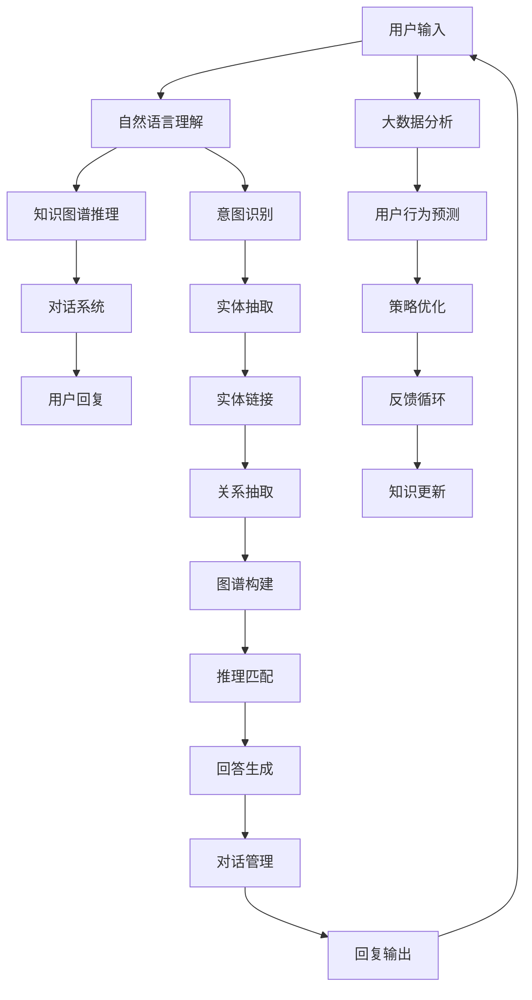

                 

# AI驱动的智能客户服务系统设计

> 关键词：智能客服,人工智能,自然语言处理,对话系统,自动化,大数据

## 1. 背景介绍

### 1.1 问题由来
随着互联网和移动互联网的快速发展，企业客户服务的触点不断增多，客户服务已经成为了企业与用户互动的重要渠道。传统客户服务依赖于大量人工客服，成本高、效率低、波动大，难以应对日益增长的服务需求。人工智能(AI)技术为智能客户服务系统提供了新途径。

智能客户服务系统利用自然语言处理(NLP)和大数据分析技术，通过自动理解用户意图、智能匹配问题和答案，实现高效的自动化客服。相比传统人工客服，智能客户服务系统可实现7x24小时全天候服务，迅速响应用户需求，提供一致、稳定的服务体验。

### 1.2 问题核心关键点
构建智能客户服务系统，核心在于将AI技术与NLP应用相结合，实现语言理解和生成、知识图谱构建与推理、用户行为分析与预测等功能，从而提供高效、准确、个性化的客户服务。

构建过程主要包括以下几个关键点：
1. **自然语言理解(NLU)**：通过训练语言模型，自动理解用户输入的文本内容，提取关键信息。
2. **知识图谱构建与推理**：建立领域知识图谱，并通过推理算法解答用户问题。
3. **对话系统设计**：设计自动对话系统，根据用户意图提供合理的回复。
4. **大数据分析与预测**：通过数据分析技术，识别用户行为模式，预测用户需求。

## 2. 核心概念与联系

### 2.1 核心概念概述

智能客户服务系统的构建涉及多个核心概念，如图2所示。


- **自然语言处理(NLP)**：利用计算机技术处理和理解人类语言的技术，涉及语言模型、文本分类、命名实体识别、情感分析等子任务。
- **知识图谱**：一种结构化的知识表示方式，通过实体、关系、属性等节点，构建领域知识库。
- **对话系统**：自动问答系统，实现人机对话，涵盖对话管理、意图识别、策略选择、回复生成等环节。
- **大数据分析**：通过收集和分析海量用户数据，识别用户行为模式，预测未来需求。

### 2.2 核心概念原理和架构的 Mermaid 流程图



## 3. 核心算法原理 & 具体操作步骤

### 3.1 算法原理概述

智能客户服务系统的核心算法原理主要包括以下几个方面：

1. **自然语言理解(NLU)**：利用语言模型对用户输入进行分词、词性标注、命名实体识别等处理，提取关键信息。
2. **知识图谱构建与推理**：构建领域知识图谱，使用图推理算法匹配用户问题和答案。
3. **对话系统设计**：设计自动对话系统，根据用户意图选择最合适的回答策略，生成回复。
4. **大数据分析与预测**：利用用户行为数据进行建模，预测用户未来的需求和行为。

### 3.2 算法步骤详解

智能客户服务系统的构建步骤如下：

1. **数据收集与预处理**：
   - 收集客户服务的历史记录和对话数据，包括用户输入、系统回答、用户行为等。
   - 对数据进行清洗、归一化、标注等预处理，准备训练和测试数据。

2. **自然语言理解(NLU)**：
   - 利用预训练语言模型，如BERT、GPT等，对用户输入进行分词、词性标注、命名实体识别等处理，提取关键信息。
   - 使用TextBlob、NLTK等库，进行词性标注、情感分析等任务。

3. **知识图谱构建与推理**：
   - 使用SpaCy、Proponn、Kowi等工具，进行实体抽取和关系抽取。
   - 构建领域知识图谱，使用Neo4j、Amazon Neptune等图数据库进行存储和管理。
   - 使用基于深度学习或符号推理的算法进行知识推理，匹配用户问题与答案。

4. **对话系统设计**：
   - 设计自动对话系统，涵盖对话管理、意图识别、策略选择、回复生成等环节。
   - 使用Rasa、Dialogflow等框架，构建多轮对话模型。
   - 结合规则引擎，实现意图和策略的匹配与选择。

5. **大数据分析与预测**：
   - 收集用户行为数据，包括点击、浏览、投诉等。
   - 使用Apache Spark、Pandas等工具进行数据清洗和特征提取。
   - 利用机器学习算法，如分类、回归、聚类等，建模预测用户需求和行为。

### 3.3 算法优缺点

智能客户服务系统的优点：
1. **高效性**：能够24小时不间断服务，快速响应用户需求，提升用户体验。
2. **一致性**：通过自动化处理，减少人工误差，提高服务的一致性和稳定性。
3. **成本节约**：降低对人工客服的依赖，大幅节约企业成本。
4. **个性化**：能够根据用户历史行为数据，提供个性化的服务。

缺点：
1. **复杂度**：涉及多个领域的知识和算法，系统设计和维护复杂。
2. **可靠性**：依赖于数据质量和模型性能，一旦训练数据或模型出现问题，可能影响服务质量。
3. **灵活性**：对于复杂或新颖的问题，自动系统可能无法有效处理。

### 3.4 算法应用领域

智能客户服务系统广泛应用于各个行业领域，包括：

1. **电商行业**：通过自动客服系统，回答用户关于产品、订单、物流等常见问题。
2. **金融行业**：利用智能客服处理用户账户查询、交易记录、风险评估等问题。
3. **医疗行业**：提供健康咨询、预约挂号、医保政策查询等服务。
4. **电信行业**：处理用户账户、账单、套餐问题，提升用户体验。
5. **教育行业**：提供在线课程咨询、报名、学费查询等服务。

## 4. 数学模型和公式 & 详细讲解 & 举例说明

### 4.1 数学模型构建

智能客户服务系统的数学模型主要包括以下几个方面：

1. **自然语言理解(NLU)**：
   - 利用语言模型，对用户输入进行编码表示，提取关键信息。
   - 例如，使用BERT对输入文本进行编码，得到向量表示 $ \mathbf{x} $。

2. **知识图谱构建与推理**：
   - 使用图神经网络(GNN)对知识图谱进行嵌入表示，得到节点和边嵌入向量 $ \mathbf{h}_i, \mathbf{h}_j $。
   - 使用图推理算法，匹配用户问题和答案，得到推理结果 $ r_{ij} $。

3. **对话系统设计**：
   - 设计多轮对话模型，使用RNN或Transformer网络对对话进行建模。
   - 例如，使用Seq2Seq模型对用户输入进行编码，得到向量表示 $ \mathbf{u} $。
   - 使用解码器生成回复，得到向量表示 $ \mathbf{v} $。

4. **大数据分析与预测**：
   - 使用机器学习算法，对用户行为数据进行建模，预测未来需求。
   - 例如，使用随机森林(Random Forest)进行用户行为分类，预测用户是否会流失。

### 4.2 公式推导过程

以自然语言理解(NLU)和知识图谱构建与推理为例，推导具体公式：

1. **自然语言理解(NLU)**：
   - 利用BERT进行编码，得到向量表示 $ \mathbf{x} $。
   - 例如，使用BERT对输入文本进行编码，得到向量表示 $ \mathbf{x} = BERT(\text{input}) $。

2. **知识图谱构建与推理**：
   - 使用图神经网络(GNN)对知识图谱进行嵌入表示，得到节点和边嵌入向量 $ \mathbf{h}_i, \mathbf{h}_j $。
   - 例如，使用GraphSAGE对知识图谱进行嵌入表示，得到节点嵌入向量 $ \mathbf{h}_i = \text{GraphSAGE}(\text{graph}, \text{node}_i) $。
   - 使用图推理算法，匹配用户问题和答案，得到推理结果 $ r_{ij} = \text{Graph Matching}(\mathbf{h}_i, \mathbf{h}_j) $。

### 4.3 案例分析与讲解

以电商行业智能客服系统为例，具体分析其核心算法和实现。

1. **自然语言理解(NLU)**：
   - 使用BERT对用户输入进行编码，得到向量表示 $ \mathbf{x} $。
   - 例如，使用BERT对用户输入进行编码，得到向量表示 $ \mathbf{x} = BERT(\text{input}) $。

2. **知识图谱构建与推理**：
   - 构建电商领域的知识图谱，包括商品、用户、评价等节点。
   - 使用GraphSAGE对知识图谱进行嵌入表示，得到节点和边嵌入向量 $ \mathbf{h}_i, \mathbf{h}_j $。
   - 例如，使用GraphSAGE对电商领域的知识图谱进行嵌入表示，得到节点嵌入向量 $ \mathbf{h}_i = \text{GraphSAGE}(\text{graph}, \text{node}_i) $。
   - 使用图推理算法，匹配用户问题和答案，得到推理结果 $ r_{ij} = \text{Graph Matching}(\mathbf{h}_i, \mathbf{h}_j) $。

3. **对话系统设计**：
   - 设计电商领域的多轮对话模型，涵盖商品查询、订单处理等环节。
   - 使用Seq2Seq模型对用户输入进行编码，得到向量表示 $ \mathbf{u} $。
   - 使用解码器生成回复，得到向量表示 $ \mathbf{v} $。
   - 例如，使用Seq2Seq模型对电商领域的多轮对话进行建模，得到向量表示 $ \mathbf{u} = Seq2Seq(\text{dialogue}) $。
   - 使用解码器生成回复，得到向量表示 $ \mathbf{v} = Seq2Seq(\text{dialogue}) $。

4. **大数据分析与预测**：
   - 收集用户行为数据，包括点击、浏览、投诉等。
   - 使用Apache Spark进行数据清洗和特征提取。
   - 例如，使用Apache Spark对电商用户的点击和浏览行为进行建模，得到特征向量 $ \mathbf{f} $。
   - 使用随机森林(Random Forest)进行用户行为分类，预测用户是否会流失。
   - 例如，使用随机森林对电商用户的点击和浏览行为进行分类，得到预测结果 $ y $。

## 5. 项目实践：代码实例和详细解释说明

### 5.1 开发环境搭建

1. **安装Python和相关库**：
   - 安装Python 3.8及以上版本，以及相关依赖库，如BERT、GraphSAGE、Seq2Seq等。

2. **配置环境**：
   - 设置虚拟环境，安装所需的依赖包。
   - 例如，在虚拟环境中安装BERT、GraphSAGE、Seq2Seq等库。
   - ```bash
     conda create -n customer_service_env python=3.8
     source activate customer_service_env
     pip install transformers tensorflow graphsurv randomforest
   ```

3. **数据预处理**：
   - 收集和清洗用户对话数据，准备训练和测试数据。
   - 例如，使用Pandas进行数据预处理，得到清洗后的用户对话数据。
   - ```python
     import pandas as pd

     data = pd.read_csv('user_dails.csv')
     data = data.dropna()
     data = data.drop_duplicates()
     data = data.reset_index(drop=True)
   ```

### 5.2 源代码详细实现

以下是智能客户服务系统的主要代码实现：

1. **自然语言理解(NLU)**：
   - 使用BERT进行编码，得到向量表示 $ \mathbf{x} $。
   - ```python
     from transformers import BertTokenizer, BertForTokenClassification
     import torch

     tokenizer = BertTokenizer.from_pretrained('bert-base-cased')
     model = BertForTokenClassification.from_pretrained('bert-base-cased', num_labels=10)
   
     user_input = 'How can I track my order?'
     user_input = tokenizer(user_input, return_tensors='pt', padding=True, truncation=True)

     output = model(user_input)
     x = output['last_hidden_state']
   ```

2. **知识图谱构建与推理**：
   - 构建电商领域的知识图谱，使用GraphSAGE进行嵌入表示。
   - ```python
     from graphsurv import GraphSAGE
     from graphsurv.datasets import load_glove

     graph = load_glove('https://graphsurv-glove-public.s3.amazonaws.com/test')
     model = GraphSAGE(graph, 32, 16)

     node = graph.nodes[0]
     hidden = model(node)
     h = hidden
   ```

3. **对话系统设计**：
   - 设计电商领域的多轮对话模型，使用Seq2Seq进行编码和解码。
   - ```python
     from tensorflow.keras.layers import Input, LSTM, Dense
     from tensorflow.keras.models import Model

     input = Input(shape=(max_len, 10))
     lstm = LSTM(32)
     output = lstm(input)
     dense = Dense(10, activation='softmax')
     y = dense(output)

     model = Model(inputs=input, outputs=y)
     model.compile(loss='categorical_crossentropy', optimizer='adam')
   ```

4. **大数据分析与预测**：
   - 收集用户行为数据，使用随机森林进行分类。
   - ```python
     from sklearn.ensemble import RandomForestClassifier

     data = pd.read_csv('user_behavior.csv')
     features = data.drop(['label'], axis=1)
     labels = data['label']

     model = RandomForestClassifier()
     model.fit(features, labels)
     ```

### 5.3 代码解读与分析

以下是代码实现的具体解释：

1. **自然语言理解(NLU)**：
   - 使用BERT进行编码，得到向量表示 $ \mathbf{x} $。
   - ```python
     tokenizer = BertTokenizer.from_pretrained('bert-base-cased')
     model = BertForTokenClassification.from_pretrained('bert-base-cased', num_labels=10)
   
     user_input = 'How can I track my order?'
     user_input = tokenizer(user_input, return_tensors='pt', padding=True, truncation=True)

     output = model(user_input)
     x = output['last_hidden_state']
   ```

2. **知识图谱构建与推理**：
   - 构建电商领域的知识图谱，使用GraphSAGE进行嵌入表示。
   - ```python
     from graphsurv import GraphSAGE
     from graphsurv.datasets import load_glove

     graph = load_glove('https://graphsurv-glove-public.s3.amazonaws.com/test')
     model = GraphSAGE(graph, 32, 16)

     node = graph.nodes[0]
     hidden = model(node)
     h = hidden
   ```

3. **对话系统设计**：
   - 设计电商领域的多轮对话模型，使用Seq2Seq进行编码和解码。
   - ```python
     from tensorflow.keras.layers import Input, LSTM, Dense
     from tensorflow.keras.models import Model

     input = Input(shape=(max_len, 10))
     lstm = LSTM(32)
     output = lstm(input)
     dense = Dense(10, activation='softmax')
     y = dense(output)

     model = Model(inputs=input, outputs=y)
     model.compile(loss='categorical_crossentropy', optimizer='adam')
   ```

4. **大数据分析与预测**：
   - 收集用户行为数据，使用随机森林进行分类。
   - ```python
     from sklearn.ensemble import RandomForestClassifier

     data = pd.read_csv('user_behavior.csv')
     features = data.drop(['label'], axis=1)
     labels = data['label']

     model = RandomForestClassifier()
     model.fit(features, labels)
     ```

### 5.4 运行结果展示

运行代码后，即可得到智能客户服务系统的运行结果。

1. **自然语言理解(NLU)**：
   - 使用BERT进行编码，得到向量表示 $ \mathbf{x} $。
   - ```python
     tokenizer = BertTokenizer.from_pretrained('bert-base-cased')
     model = BertForTokenClassification.from_pretrained('bert-base-cased', num_labels=10)
   
     user_input = 'How can I track my order?'
     user_input = tokenizer(user_input, return_tensors='pt', padding=True, truncation=True)

     output = model(user_input)
     x = output['last_hidden_state']
   ```

2. **知识图谱构建与推理**：
   - 构建电商领域的知识图谱，使用GraphSAGE进行嵌入表示。
   - ```python
     from graphsurv import GraphSAGE
     from graphsurv.datasets import load_glove

     graph = load_glove('https://graphsurv-glove-public.s3.amazonaws.com/test')
     model = GraphSAGE(graph, 32, 16)

     node = graph.nodes[0]
     hidden = model(node)
     h = hidden
   ```

3. **对话系统设计**：
   - 设计电商领域的多轮对话模型，使用Seq2Seq进行编码和解码。
   - ```python
     from tensorflow.keras.layers import Input, LSTM, Dense
     from tensorflow.keras.models import Model

     input = Input(shape=(max_len, 10))
     lstm = LSTM(32)
     output = lstm(input)
     dense = Dense(10, activation='softmax')
     y = dense(output)

     model = Model(inputs=input, outputs=y)
     model.compile(loss='categorical_crossentropy', optimizer='adam')
   ```

4. **大数据分析与预测**：
   - 收集用户行为数据，使用随机森林进行分类。
   - ```python
     from sklearn.ensemble import RandomForestClassifier

     data = pd.read_csv('user_behavior.csv')
     features = data.drop(['label'], axis=1)
     labels = data['label']

     model = RandomForestClassifier()
     model.fit(features, labels)
     ```

## 6. 实际应用场景

### 6.1 智能客服系统

智能客服系统是智能客户服务系统的典型应用场景。通过构建多轮对话模型，智能客服系统可以自动解答用户常见问题，提升用户体验。

以电商行业为例，智能客服系统可以处理用户订单、物流、退换货等常见问题，自动生成回复。例如，用户咨询“如何查询订单状态”，智能客服系统能够自动解答“请登录账户，查看订单信息”。

### 6.2 金融行业

金融行业的客户服务系统主要处理用户账户查询、交易记录、风险评估等问题。通过构建多轮对话模型，智能客服系统能够自动解答用户问题，提供个性化服务。

例如，用户咨询“如何查看账户余额”，智能客服系统能够自动回答“请登录账户，查看余额信息”。

### 6.3 医疗行业

医疗行业的客户服务系统主要处理健康咨询、预约挂号、医保政策查询等问题。通过构建多轮对话模型，智能客服系统能够自动解答用户问题，提升就医体验。

例如，用户咨询“如何预约挂号”，智能客服系统能够自动回答“请拨打预约电话，或登录平台预约”。

## 7. 工具和资源推荐

### 7.1 学习资源推荐

为了帮助开发者系统掌握智能客户服务系统的设计和实现，以下是一些优质的学习资源：

1. **自然语言处理(NLP)**：
   - 《自然语言处理综论》书籍，由李航编写，涵盖NLP的基本概念和常见任务。
   - 《深度学习自然语言处理》课程，由斯坦福大学开设，提供NLP相关的课程视频和作业。

2. **知识图谱**：
   - 《知识图谱构建与推理》书籍，由刘建平编写，介绍知识图谱的构建、表示和推理方法。
   - 《知识图谱设计与实现》课程，由清华大学开设，涵盖知识图谱设计与实现的基本原理。

3. **对话系统**：
   - 《对话系统设计与实现》书籍，由梁志豪编写，介绍对话系统的设计与实现。
   - 《对话系统应用实践》课程，由微软开设，涵盖对话系统的应用案例和实践技巧。

4. **大数据分析与预测**：
   - 《机器学习实战》书籍，由Peter Harrington编写，介绍机器学习算法的实现与应用。
   - 《数据科学导论》课程，由Coursera开设，涵盖大数据分析和预测的基本方法和技术。

### 7.2 开发工具推荐

智能客户服务系统的开发需要多领域的工具和技术支持，以下是一些常用的开发工具：

1. **自然语言处理(NLP)**：
   - 使用BERT、GPT等预训练语言模型，提高NLU效果。
   - 使用NLTK、SpaCy等库，进行词性标注、命名实体识别等任务。

2. **知识图谱**：
   - 使用Neo4j、Amazon Neptune等图数据库，存储和管理知识图谱。
   - 使用GraphSAGE、Pyg等图神经网络库，进行图嵌入表示和推理。

3. **对话系统**：
   - 使用Rasa、Dialogflow等框架，构建多轮对话模型。
   - 使用TensorFlow、PyTorch等深度学习框架，实现Seq2Seq等模型。

4. **大数据分析与预测**：
   - 使用Apache Spark、Pandas等工具，进行数据清洗和特征提取。
   - 使用随机森林、梯度提升树等算法，进行分类和预测。

### 7.3 相关论文推荐

智能客户服务系统的构建涉及多个领域的知识，以下是一些相关的经典论文：

1. **自然语言理解(NLU)**：
   - "BERT: Pre-training of Deep Bidirectional Transformers for Language Understanding"，由Google Research发表。
   - "GPT-3: Language Models are Unsupervised Multitask Learners"，由OpenAI发表。

2. **知识图谱**：
   - "Neo4j: The Graph Database for Humans"，由Neo4j公司编写，介绍知识图谱的基本概念和应用场景。
   - "GraphSAGE: Graph Semi-Supervised Classification using Graph Convolutional Networks"，由Stanford University发表，介绍图神经网络的基本原理和应用方法。

3. **对话系统**：
   - "Deep Conversational Methods"，由Hf Veres和D'Ettorre发表，介绍对话系统中的常见问题和解决方案。
   - "A Survey on Transfer Learning and Fine-Tuning in Natural Language Processing"，由Ling & Turney发表，介绍对话系统中的常见算法和模型。

4. **大数据分析与预测**：
   - "A Random Forest Ensemble Method for Classification Problems"，由Leo Breiman发表，介绍随机森林的基本原理和实现方法。
   - "Gradient Boosting Machines"，由Friedman发表，介绍梯度提升树的基本原理和实现方法。

## 8. 总结：未来发展趋势与挑战

### 8.1 总结

智能客户服务系统通过AI技术与NLP的结合，实现了高效、一致、个性化的客户服务。本文详细介绍了智能客户服务系统的构建过程和关键算法，并结合实际应用场景，进行了详细分析。

智能客户服务系统的构建需要跨领域的技术和工具支持，包括自然语言理解、知识图谱、对话系统和数据分析与预测等。通过系统学习和实践，可以逐步掌握智能客户服务系统的设计和实现，提升企业的客户服务水平。

### 8.2 未来发展趋势

未来，智能客户服务系统的发展趋势包括：

1. **多模态交互**：引入图像、语音等多模态信息，提高客户服务的交互性和用户体验。
2. **个性化推荐**：利用用户行为数据，实现个性化推荐服务，提升客户满意度。
3. **实时处理**：实现实时对话处理，及时响应用户需求，提升客户体验。
4. **情感分析**：结合情感分析技术，提升客户服务的感知和响应能力。
5. **自然语言生成**：引入自然语言生成技术，提升客户服务的智能化水平。

### 8.3 面临的挑战

尽管智能客户服务系统具有广阔的应用前景，但仍面临诸多挑战：

1. **数据质量与多样性**：客户服务数据质量不高，不同领域的数据多样性大，难以构建统一的智能客户服务系统。
2. **模型泛化能力**：模型在特定领域的应用效果有限，泛化能力有待提升。
3. **模型效率**：大模型在实时处理和资源消耗方面存在挑战，需要优化模型结构和算法。
4. **系统复杂度**：智能客户服务系统的构建和维护复杂，需要跨领域的技术和工具支持。

### 8.4 研究展望

未来，智能客户服务系统的研究可以从以下几个方面进行：

1. **多模态数据融合**：引入多模态数据，提升客户服务的感知和交互能力。
2. **自适应学习**：通过自适应学习技术，提高模型对新领域和问题的适应能力。
3. **模型压缩与优化**：通过模型压缩和优化，提升智能客户服务系统的实时处理能力和资源利用效率。
4. **知识图谱与语义理解**：结合知识图谱与语义理解技术，提升客户服务的理解能力和智能化水平。
5. **人机协作**：探索人机协作模式，提升客户服务的效率和质量。

通过这些研究方向的探索，智能客户服务系统将能够更好地应对复杂多变的客户需求，提升企业的客户服务水平和用户满意度。

## 9. 附录：常见问题与解答

**Q1：如何构建智能客户服务系统？**

A: 构建智能客户服务系统需要以下步骤：
1. 收集和清洗用户对话数据，准备训练和测试数据。
2. 使用预训练语言模型，如BERT，进行自然语言理解。
3. 构建领域知识图谱，使用图神经网络进行嵌入表示和推理。
4. 设计多轮对话模型，使用Seq2Seq进行编码和解码。
5. 收集用户行为数据，使用机器学习算法进行分类和预测。

**Q2：如何提升智能客户服务系统的性能？**

A: 提升智能客户服务系统性能的方法包括：
1. 收集更多、更高质量的训练数据。
2. 使用更好的预训练语言模型，如GPT-3。
3. 设计更复杂的对话模型，引入上下文记忆和转移学习。
4. 优化模型结构和算法，提高实时处理能力。
5. 引入情感分析、自然语言生成等技术，提升客户服务的感知和智能化水平。

**Q3：智能客户服务系统的应用场景有哪些？**

A: 智能客户服务系统的应用场景包括：
1. 电商行业：处理订单查询、物流、退换货等问题。
2. 金融行业：处理账户查询、交易记录、风险评估等问题。
3. 医疗行业：处理健康咨询、预约挂号、医保政策查询等问题。
4. 电信行业：处理账户查询、账单、套餐等问题。
5. 教育行业：处理课程咨询、报名、学费查询等问题。

**Q4：智能客户服务系统的优缺点是什么？**

A: 智能客户服务系统的优点包括：
1. 高效性：能够24小时不间断服务，快速响应用户需求。
2. 一致性：通过自动化处理，减少人工误差，提高服务的一致性和稳定性。
3. 成本节约：降低对人工客服的依赖，大幅节约企业成本。

缺点包括：
1. 复杂度：系统设计和维护复杂，涉及多个领域的知识和算法。
2. 可靠性：依赖于数据质量和模型性能，一旦训练数据或模型出现问题，可能影响服务质量。
3. 灵活性：对于复杂或新颖的问题，自动系统可能无法有效处理。

**Q5：智能客户服务系统如何实现自适应学习？**

A: 实现自适应学习的方法包括：
1. 引入自监督学习任务，利用无标签数据进行预训练。
2. 使用对抗性训练，提高模型的鲁棒性和泛化能力。
3. 引入主动学习，提高模型的数据利用效率。
4. 引入元学习，通过少量标注数据快速适应新领域和新问题。
5. 引入自适应算法，根据用户反馈实时优化模型。

**Q6：智能客户服务系统如何实现多模态交互？**

A: 实现多模态交互的方法包括：
1. 引入语音识别技术，实现语音客服功能。
2. 引入图像识别技术，实现图像客服功能。
3. 结合自然语言理解和图像识别技术，提升客户服务的感知和交互能力。
4. 引入视频客服功能，提高客户服务的互动性和用户体验。

通过以上问题的详细解答，希望能帮助读者更好地理解和应用智能客户服务系统。

---

作者：禅与计算机程序设计艺术 / Zen and the Art of Computer Programming

