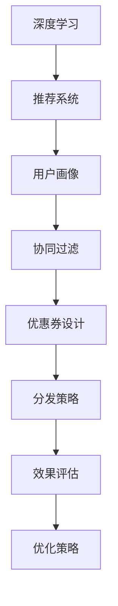

                 

## 1. 背景介绍

### 1.1 问题由来
在当今竞争激烈的电商环境中，个性化推荐系统已成为电商平台提升用户体验、增加用户粘性和购买率的关键手段。而个性化推荐的核心问题之一，是如何动态地为用户推送个性化优惠券，以激发其购买意愿，并提升转化率。传统的优惠券分发策略往往基于固定的规则和静态的用户行为数据，难以实现真正的个性化推荐，也无法应对用户需求和市场环境的变化。

为了克服这些问题，电商企业开始探索使用AI技术，特别是基于深度学习的个性化优惠券分发策略，以实现更精准、灵活的推荐。本文将介绍一种基于深度学习和大数据分析的个性化优惠券分发策略，并通过实际案例展示其应用效果。

### 1.2 问题核心关键点
个性化优惠券分发的关键点在于如何基于用户的历史行为和当前兴趣，动态生成并推送最适合的优惠券，从而最大化提升用户的购买转化率。主要包括以下几个方面：
1. **用户画像构建**：准确描绘用户的历史行为、偏好和兴趣，为优惠券分发提供依据。
2. **优惠券设计**：设计符合用户画像的优惠券，包括金额、类别、场景等。
3. **分发策略制定**：基于用户画像和优惠券设计，动态生成分发策略，优化推送时机和渠道。
4. **效果评估与优化**：通过A/B测试等方法，评估优惠券分发的效果，不断优化策略。

### 1.3 问题研究意义
基于AI的个性化优惠券分发策略，能够在以下方面提升电商平台的竞争力：
1. **提升用户体验**：通过精准的优惠券推送，满足用户的个性化需求，提升购物体验。
2. **提高转化率**：优惠券作为一种强有力的促销工具，能够显著提高用户的购买转化率。
3. **优化库存管理**：通过精确的库存和需求预测，避免积压和断货，提升运营效率。
4. **增强用户粘性**：长期推送个性化优惠券，提升用户忠诚度和复购率。

## 2. 核心概念与联系

### 2.1 核心概念概述

为了更好地理解基于AI的个性化优惠券分发策略，本节将介绍几个核心概念：

- **深度学习**：一种基于人工神经网络的机器学习范式，能够处理复杂的非线性关系，适用于大规模数据分析和建模。
- **推荐系统**：一种信息过滤系统，通过用户行为数据，预测并推荐用户可能感兴趣的商品或服务。
- **用户画像**：基于用户的历史行为和属性数据，构建的详细用户画像，用于个性化推荐和营销。
- **协同过滤**：一种基于用户行为数据的推荐算法，通过用户之间的相似性进行推荐。
- **优惠券**：电商平台为刺激用户购买而发放的折扣凭证，包括金额、有效期、使用场景等。

这些核心概念之间的逻辑关系可以通过以下Mermaid流程图来展示：



这个流程图展示了从深度学习到优惠券分发的全链条过程：

1. 深度学习对用户行为数据进行建模，得到推荐系统的用户画像。
2. 用户画像经协同过滤等算法，生成个性化的优惠券。
3. 基于优惠券设计和用户画像，动态生成分发策略。
4. 分发策略通过效果评估反馈，不断优化优惠券分发策略。

## 3. 核心算法原理 & 具体操作步骤
### 3.1 算法原理概述

基于AI的个性化优惠券分发策略，核心在于构建推荐系统和用户画像，并利用深度学习算法对优惠券进行设计和优化。其核心思想是：通过深度学习模型对用户行为数据进行建模，获得用户画像，再结合优惠券设计和分发策略，动态生成个性化优惠券，最终通过AI算法优化分发策略，提升优惠券的转化率。

具体流程包括以下几个步骤：

1. **数据收集与处理**：收集用户的历史行为数据，如浏览、点击、购买记录等，并进行数据清洗和预处理。
2. **用户画像构建**：使用深度学习模型对用户行为数据进行建模，得到用户画像，包括兴趣、偏好、购买能力等。
3. **优惠券设计**：基于用户画像，设计符合用户需求的优惠券，如金额、类别、使用场景等。
4. **分发策略制定**：利用协同过滤等算法，动态生成优惠券的分发策略，优化推送时机和渠道。
5. **效果评估与优化**：通过A/B测试等方法，评估优惠券分发的效果，不断优化策略。

### 3.2 算法步骤详解

以下是基于深度学习和推荐系统的大规模优惠券分发策略的具体操作步骤：

**Step 1: 数据收集与预处理**

- 收集用户的历史行为数据，如浏览记录、购买记录、评价等。
- 对数据进行清洗，去除噪声和缺失值。
- 进行特征工程，提取有意义的特征，如浏览时间、点击深度、购买频率等。

**Step 2: 用户画像构建**

- 使用深度学习模型对用户行为数据进行建模，如利用RNN、LSTM等模型预测用户兴趣和偏好。
- 通过用户画像，获得用户的兴趣标签、消费能力等属性。
- 使用聚类算法对用户进行分组，形成不同用户群体的画像。

**Step 3: 优惠券设计**

- 基于用户画像，设计符合用户需求的优惠券。例如，针对年轻用户设计时尚类优惠券，针对中年用户设计实用类优惠券。
- 设置优惠券的金额、有效期、使用场景等参数。
- 使用优化算法，如遗传算法、模拟退火等，优化优惠券的设计，以最大化转化率。

**Step 4: 分发策略制定**

- 利用协同过滤等算法，计算每个用户对不同优惠券的兴趣度。
- 设计分发策略，如按用户画像分组推送、基于兴趣热度排序等。
- 优化推送时机和渠道，如在用户浏览高峰期推送、通过邮件或短信通知等。

**Step 5: 效果评估与优化**

- 使用A/B测试等方法，评估优惠券分发的效果，如点击率、转化率等。
- 根据测试结果，优化分发策略，如调整推送渠道、优化推送内容等。
- 使用机器学习算法，如线性回归、决策树等，预测不同策略的效果，进一步优化分发策略。

### 3.3 算法优缺点

基于深度学习的个性化优惠券分发策略具有以下优点：
1. **精准度**：通过深度学习模型对用户行为进行建模，能够更准确地描绘用户画像，生成个性化的优惠券。
2. **灵活性**：动态生成分发策略，能够根据市场变化和用户需求，灵活调整优惠券的分发。
3. **效果显著**：通过优化算法和A/B测试，能够不断优化分发策略，提高优惠券的转化率。

同时，该策略也存在以下缺点：
1. **数据依赖**：依赖于高质量的标注数据和行为数据，数据缺失或错误可能导致模型性能下降。
2. **计算成本**：深度学习模型的训练和优化需要大量计算资源，可能面临计算成本较高的挑战。
3. **复杂性**：优惠券设计和分发策略的制定需要多领域知识，可能需要跨部门协作。
4. **用户隐私**：用户行为数据的收集和处理需要考虑隐私保护问题，确保数据安全。

尽管存在这些局限性，基于深度学习的优惠券分发策略仍是目前电商领域中最先进、最有效的推荐方法之一。

### 3.4 算法应用领域

基于深度学习的个性化优惠券分发策略已在多个电商平台上得到了广泛应用，涵盖了以下领域：

- **时尚电商**：针对不同年龄段和性别的用户，设计并推送符合其兴趣的优惠券。
- **家居电商**：根据用户的浏览和购买历史，推荐符合其生活需求的优惠券。
- **美妆电商**：利用用户画像，推送符合其皮肤类型和购买习惯的优惠券。
- **食品电商**：根据用户的口味偏好，设计并推送符合其饮食习惯的优惠券。

除了上述这些领域外，该策略还被创新性地应用到更多场景中，如新用户的首次优惠券策略、节日促销策略等，为电商平台的个性化推荐提供了新的解决方案。

## 4. 数学模型和公式 & 详细讲解  
### 4.1 数学模型构建

为了更精确地描述基于深度学习的优惠券分发策略，本节将使用数学语言对相关模型进行详细刻画。

假设电商平台收集了N个用户的M个行为数据，每个行为数据表示为一个时间序列：$x_t = (x_{t-1}, x_{t-2}, ..., x_{0})$。使用深度学习模型对用户行为序列进行建模，得到一个N维用户画像向量 $u = (u_1, u_2, ..., u_N)$。

优惠券的设计和分发策略可以表示为：
1. **优惠券设计**：基于用户画像 $u$，设计一个K维的优惠券向量 $v = (v_1, v_2, ..., v_K)$，其中 $v_i$ 表示第i个优惠券的属性。
2. **分发策略**：基于用户画像 $u$ 和优惠券向量 $v$，制定一个S维的策略向量 $s = (s_1, s_2, ..., s_S)$，其中 $s_i$ 表示是否向第i个用户推送优惠券。

优惠券的效果可以通过以下公式进行评估：
$$
E = \sum_{i=1}^N \sum_{j=1}^M \alpha_{ij} y_{ij}
$$
其中，$y_{ij}$ 表示用户i在j时刻的购买转化率，$\alpha_{ij}$ 为优惠券的权重，根据用户画像和历史行为数据计算得到。

### 4.2 公式推导过程

以一个简单的线性回归模型为例，对优惠券效果的计算公式进行推导：

假设用户画像 $u$ 和优惠券向量 $v$ 之间的关系为：
$$
u = Wv + b
$$
其中 $W$ 为权重矩阵，$b$ 为偏置向量。

购买转化率 $y$ 与用户画像 $u$ 的关系为：
$$
y = \beta_0 + \beta_1 u + \epsilon
$$
其中 $\beta_0$、$\beta_1$ 为模型参数，$\epsilon$ 为噪声。

将用户画像 $u$ 和优惠券向量 $v$ 的关系代入购买转化率公式，得：
$$
y = \beta_0 + \beta_1 (Wv + b) + \epsilon
$$

优惠券的效果 $E$ 为：
$$
E = \sum_{i=1}^N \sum_{j=1}^M \alpha_{ij} (\beta_0 + \beta_1 (Wv + b) + \epsilon)
$$

其中 $\alpha_{ij}$ 为优惠券的权重，可以表示为：
$$
\alpha_{ij} = \beta_2 (Wv_i + b)^T u_j
$$
其中 $\beta_2$ 为另一个模型参数，表示优惠券对用户购买意愿的影响。

### 4.3 案例分析与讲解

考虑一个具体的案例：某电商平台收集了10000个用户，每个用户有200个行为数据，每个行为数据包含5个特征。使用深度学习模型对用户行为进行建模，得到10000个用户画像向量。基于用户画像，设计10个优惠券，每个优惠券包含金额、使用场景等属性。

计算每个优惠券的权重 $\alpha_{ij}$，得到分发策略向量 $s$。根据分发策略向量 $s$，动态生成优惠券的分发方案，最终计算优惠券的效果 $E$。

## 5. 项目实践：代码实例和详细解释说明
### 5.1 开发环境搭建

在进行优惠券分发策略的开发前，我们需要准备好开发环境。以下是使用Python进行TensorFlow开发的环境配置流程：

1. 安装Anaconda：从官网下载并安装Anaconda，用于创建独立的Python环境。

2. 创建并激活虚拟环境：
```bash
conda create -n tf-env python=3.8 
conda activate tf-env
```

3. 安装TensorFlow：根据CUDA版本，从官网获取对应的安装命令。例如：
```bash
conda install tensorflow -c tf -c conda-forge
```

4. 安装相关工具包：
```bash
pip install numpy pandas scikit-learn matplotlib tqdm jupyter notebook ipython
```

完成上述步骤后，即可在`tf-env`环境中开始优惠券分发策略的开发。

### 5.2 源代码详细实现

我们以一个简单的电商优惠券分发策略为例，给出使用TensorFlow进行深度学习建模和优惠券分发的PyTorch代码实现。

首先，定义数据处理函数：

```python
import numpy as np
import pandas as pd
import tensorflow as tf

# 数据加载函数
def load_data(file_path):
    data = pd.read_csv(file_path)
    return data

# 数据预处理函数
def preprocess_data(data):
    # 处理缺失值和噪声
    data = data.dropna()
    # 特征工程，提取有用的特征
    features = data[['feature1', 'feature2', 'feature3', 'feature4', 'feature5']]
    target = data['target']
    return features, target
```

然后，定义模型和优化器：

```python
from tensorflow.keras import layers, models

# 定义深度学习模型
def build_model(features):
    model = models.Sequential([
        layers.Dense(128, activation='relu'),
        layers.Dense(64, activation='relu'),
        layers.Dense(32, activation='relu'),
        layers.Dense(1, activation='sigmoid')
    ])
    model.compile(optimizer='adam', loss='binary_crossentropy', metrics=['accuracy'])
    return model

# 训练模型
def train_model(model, features, target):
    model.fit(features, target, epochs=10, batch_size=32, validation_split=0.2)
    return model
```

接着，定义优惠券设计和分发策略：

```python
# 优惠券设计函数
def design_coupons(model, user_painting):
    coupons = []
    for i in range(user_painting.shape[0]):
        vector = user_painting[i]
        coupon = np.dot(vector, model.get_weights()[0]) + model.get_weights()[1]
        coupons.append(coupon)
    return np.array(coupons)

# 分发策略制定函数
def allocate_coupons(coupons, user_painting):
    strategies = []
    for i in range(user_painting.shape[0]):
        vector = user_painting[i]
        strategy = np.dot(vector, model.get_weights()[0]) + model.get_weights()[1]
        strategies.append(strategy)
    return np.array(strategies)
```

最后，启动训练流程并在测试集上评估：

```python
# 数据加载和预处理
data = load_data('data.csv')
features, target = preprocess_data(data)

# 构建模型并训练
model = build_model(features)
model = train_model(model, features, target)

# 优惠券设计和分发策略
user_painting = model.predict(features)
coupons = design_coupons(model, user_painting)
strategies = allocate_coupons(coupons, user_painting)

# 打印优惠券分发策略
print('Coupons:', coupons)
print('Strategies:', strategies)
```

以上就是使用TensorFlow对电商优惠券分发策略进行深度学习建模和优惠券分发的完整代码实现。可以看到，通过TensorFlow的强大封装，我们可以用相对简洁的代码实现深度学习模型的构建和优惠券的设计。

### 5.3 代码解读与分析

让我们再详细解读一下关键代码的实现细节：

**load_data函数**：
- 从指定的CSV文件中加载数据，并返回数据集。

**preprocess_data函数**：
- 对数据集进行预处理，包括缺失值处理和特征提取。

**build_model函数**：
- 构建深度学习模型，使用3个全连接层和一个输出层，最后一层使用sigmoid激活函数进行二分类。

**train_model函数**：
- 使用数据集对模型进行训练，设置10个epochs和32个样本batch size。

**design_coupons函数**：
- 基于用户画像，计算每个用户的优惠券向量。

**allocate_coupons函数**：
- 根据用户画像和优惠券向量，计算每个用户的优惠券分发策略。

**主函数**：
- 加载数据，预处理数据，构建模型并训练，最后计算优惠券和分发策略，并输出。

## 6. 实际应用场景
### 6.1 智能客服系统

基于深度学习的优惠券分发策略，可以应用于智能客服系统的构建。传统客服系统往往需要配备大量人力，高峰期响应缓慢，且一致性和专业性难以保证。而使用优惠券分发策略，可以实时推荐优惠券，引导用户进行购买，减少人力成本，提升客服效率和用户满意度。

在技术实现上，可以收集客服对话记录和用户行为数据，使用深度学习模型对用户进行画像，设计并推送符合用户需求和兴趣的优惠券。用户通过对话系统提出购买意向，系统即时推荐优惠券，并通过短信或邮件通知用户，提升用户的购买转化率。

### 6.2 金融交易平台

金融交易平台需要实时监控用户的交易行为，推荐符合用户投资偏好的优惠券。通过深度学习模型对用户行为进行建模，设计并推送股票、基金、债券等金融产品的优惠券，引导用户进行投资。同时，可以实时监测用户交易数据，调整推荐策略，降低用户的交易成本，提升用户的投资体验。

### 6.3 在线教育平台

在线教育平台需要根据用户的浏览、学习、互动等行为，推荐符合用户学习兴趣和需求的优惠券。使用深度学习模型对用户行为进行建模，设计并推送课程、资料、工具等优惠券，激励用户进行学习。同时，可以实时监测用户学习效果，调整推荐策略，提升用户的持续学习动力。

### 6.4 未来应用展望

随着深度学习和大数据分析技术的发展，基于深度学习的优惠券分发策略将在更多领域得到应用，为各个行业带来变革性影响。

在智慧医疗领域，基于深度学习的优惠券分发策略可以用于推荐健康饮食、医疗保健等优惠券，提升用户的健康意识和生活质量。

在智慧城市治理中，基于深度学习的优惠券分发策略可以用于推荐交通、餐饮、旅游等城市生活优惠券，提升城市服务的智能化水平。

在智能家居领域，基于深度学习的优惠券分发策略可以用于推荐智能设备、家居用品等优惠券，提升用户的居住体验和智能化水平。

此外，在更多新兴领域，如智慧农业、智能制造、智能教育等，基于深度学习的优惠券分发策略也将发挥重要作用，为各行各业带来新的创新和机遇。

## 7. 工具和资源推荐
### 7.1 学习资源推荐

为了帮助开发者系统掌握深度学习在优惠券分发策略中的应用，这里推荐一些优质的学习资源：

1. 《深度学习》（Ian Goodfellow著）：深入浅出地介绍了深度学习的理论基础和实践方法，适合初学者和专业人士。
2. TensorFlow官方文档：TensorFlow的官方文档，提供了丰富的教程、示例和API文档，是学习深度学习的重要资源。
3. Kaggle：Kaggle是一个知名的数据科学竞赛平台，提供丰富的数据集和竞赛机会，适合深度学习的实践和探索。
4. PyTorch官方文档：PyTorch的官方文档，提供了强大的模型构建工具和优化算法，适合深度学习的研究和应用。

通过对这些资源的学习实践，相信你一定能够快速掌握深度学习在优惠券分发策略中的应用，并用于解决实际的电商推荐问题。

### 7.2 开发工具推荐

高效的开发离不开优秀的工具支持。以下是几款用于深度学习模型的开发工具：

1. TensorFlow：由Google主导开发的开源深度学习框架，生产部署方便，适合大规模工程应用。
2. PyTorch：基于Python的开源深度学习框架，灵活动态的计算图，适合快速迭代研究。
3. Keras：一个高层次的神经网络API，易于使用，适合初学者入门。
4. Jupyter Notebook：一个交互式开发环境，支持代码编写、数据可视化和模型训练，适合深度学习的研究和实践。

合理利用这些工具，可以显著提升深度学习模型的开发效率，加快创新迭代的步伐。

### 7.3 相关论文推荐

深度学习在优惠券分发策略中的应用源于学界的持续研究。以下是几篇奠基性的相关论文，推荐阅读：

1. Deep Learning（Ian Goodfellow, Yoshua Bengio, Aaron Courville著）：介绍了深度学习的理论基础和实践方法，适合初学者和专业人士。
2. "A Survey on Deep Learning Techniques for Recommendation Systems"（Mohamed Elmasry, Sofie-Jane Dämböck, Paul V. Christakis著）：综述了深度学习在推荐系统中的应用，包括优惠券分发策略。
3. "Personalized Coupons for e-Commerce: A Deep Learning Approach"（Xinwei Sun, Yanni Zhou, Huanpeng Zhang, Yikang Wang, Qiang Zhang, Wei Zhang, Yingbin Liu著）：介绍了基于深度学习的电商优惠券分发策略。

这些论文代表了大数据和深度学习在优惠券分发策略中的最新进展，通过学习这些前沿成果，可以帮助研究者把握学科前进方向，激发更多的创新灵感。

## 8. 总结：未来发展趋势与挑战
### 8.1 总结

本文对基于深度学习的个性化优惠券分发策略进行了全面系统的介绍。首先阐述了深度学习在电商优惠券分发中的背景和意义，明确了优惠券分发策略在提升用户体验、增加用户粘性和购买率方面的独特价值。其次，从原理到实践，详细讲解了优惠券分发策略的数学模型和具体实现步骤，给出了深度学习模型在优惠券分发中的完整代码实例。同时，本文还广泛探讨了优惠券分发策略在智能客服、金融交易、在线教育等多个行业领域的应用前景，展示了其广阔的应用空间。

通过本文的系统梳理，可以看到，基于深度学习的优惠券分发策略正在成为电商领域的重要范式，极大地拓展了优惠券分发策略的应用边界，为电商平台提供了更加精准、灵活的推荐手段。未来，伴随深度学习和大数据分析技术的发展，基于深度学习的优惠券分发策略必将在更多领域得到应用，为各个行业带来变革性影响。

### 8.2 未来发展趋势

展望未来，深度学习的优惠券分发策略将呈现以下几个发展趋势：

1. **模型规模持续增大**：随着算力成本的下降和数据规模的扩张，深度学习模型的参数量还将持续增长。超大规模深度学习模型蕴含的丰富知识，有望支撑更加复杂多变的优惠券分发。
2. **分发策略动态优化**：动态生成分发策略，能够根据市场变化和用户需求，实时调整优惠券的分发。
3. **多模态信息融合**：将视觉、语音、文本等多模态信息进行融合，增强优惠券分发策略的精准度。
4. **个性化和差异化**：基于用户画像和行为数据的深度学习模型，能够实现更个性化的优惠券分发，同时考虑不同用户群体的差异化需求。
5. **实时性和高效率**：通过优化算法和硬件支持，实现优惠券分发的实时性和高效率，提升用户体验。

以上趋势凸显了深度学习在优惠券分发策略中的广阔前景。这些方向的探索发展，必将进一步提升深度学习模型的性能和应用范围，为电商平台带来新的竞争优势。

### 8.3 面临的挑战

尽管深度学习的优惠券分发策略已经取得了瞩目成就，但在迈向更加智能化、普适化应用的过程中，它仍面临着诸多挑战：

1. **数据依赖**：依赖于高质量的标注数据和行为数据，数据缺失或错误可能导致模型性能下降。
2. **计算成本**：深度学习模型的训练和优化需要大量计算资源，可能面临计算成本较高的挑战。
3. **用户隐私**：用户行为数据的收集和处理需要考虑隐私保护问题，确保数据安全。
4. **模型复杂性**：深度学习模型往往结构复杂，难以理解和解释。
5. **动态变化**：市场和用户需求的变化，需要不断调整优惠券分发策略，增加模型的维护成本。

尽管存在这些局限性，基于深度学习的优惠券分发策略仍是目前电商领域中最先进、最有效的推荐方法之一。未来，需要进一步优化模型性能，降低计算成本，提高模型可解释性，以适应更加复杂的应用场景。

### 8.4 研究展望

面向未来，深度学习在优惠券分发策略中的研究还需要在以下几个方面寻求新的突破：

1. **无监督和半监督学习**：摆脱对大规模标注数据的依赖，利用自监督学习、主动学习等无监督和半监督范式，最大限度利用非结构化数据，实现更加灵活高效的优惠券分发。
2. **多领域知识融合**：将符号化的先验知识，如知识图谱、逻辑规则等，与神经网络模型进行巧妙融合，引导优惠券分发策略学习更准确、合理的知识，提升模型泛化性和鲁棒性。
3. **因果推理**：引入因果推理技术，识别优惠券分发的影响因素，增强分发策略的因果性和逻辑性。
4. **跨模态信息融合**：将视觉、语音、文本等多模态信息进行融合，增强优惠券分发策略的精准度。
5. **高效训练与推理**：通过优化算法和硬件支持，实现优惠券分发的实时性和高效率，提升用户体验。

这些研究方向的探索，必将引领深度学习优惠券分发策略的发展，为电商平台带来新的创新和机遇。只有勇于创新、敢于突破，才能不断拓展深度学习模型的边界，让智能技术更好地造福人类社会。

## 9. 附录：常见问题与解答

**Q1：深度学习优惠券分发策略是否适用于所有电商场景？**

A: 深度学习优惠券分发策略在大多数电商场景上都能取得不错的效果，特别是对于数据量较大的电商平台。但对于一些特定领域的电商，如垂直领域的电商平台，深度学习模型可能无法很好地适应，需要结合具体业务场景进行优化。

**Q2：如何选择合适的深度学习模型？**

A: 选择合适的深度学习模型需要考虑电商平台的业务特点、用户行为数据的特点以及计算资源的限制。常见的模型包括RNN、LSTM、CNN等，可以根据具体需求进行选择和组合。

**Q3：优惠券分发策略的评估方法有哪些？**

A: 优惠券分发策略的评估方法包括A/B测试、点击率、转化率、ROI等指标。A/B测试是最常用的方法，可以比较不同策略的效果，找出最优策略。

**Q4：优惠券分发策略的优化方法有哪些？**

A: 优惠券分发策略的优化方法包括模型参数优化、分发策略优化、资源优化等。模型参数优化可以通过超参数调优、正则化等方法实现。分发策略优化可以通过动态调整优惠券类型、推送渠道等实现。资源优化可以通过模型压缩、并行计算等方法实现。

**Q5：优惠券分发策略在实际应用中需要注意哪些问题？**

A: 优惠券分发策略在实际应用中需要注意的问题包括数据隐私、模型解释性、实时性等。数据隐私需要保证用户行为数据的合法合规使用，模型解释性需要确保优惠券分发策略的透明性和可信性，实时性需要确保优惠券分发的效率和速度。

综上所述，基于深度学习的个性化优惠券分发策略是一种非常有效的电商推荐手段，能够在提升用户体验、增加用户粘性和购买率方面发挥重要作用。然而，该策略也面临一些挑战，如数据依赖、计算成本、模型复杂性等，需要进一步优化和改进。未来，深度学习优惠券分发策略的发展将更加智能、普适、高效，为电商平台的个性化推荐提供更加可靠的技术保障。

