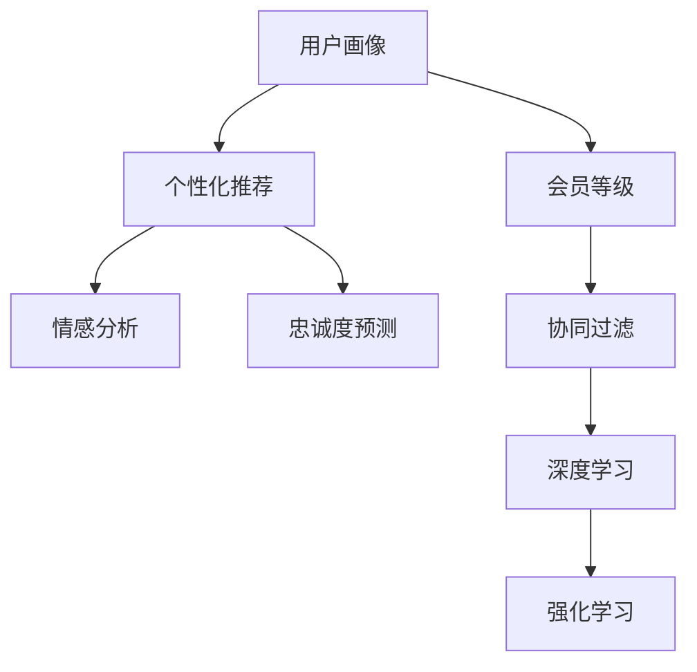

                 

# AI驱动的电商平台个性化会员等级策略

## 1. 背景介绍

### 1.1 问题由来

随着电子商务的迅猛发展，电商平台已经从传统的商品销售平台，转变为基于大数据、人工智能驱动的智慧零售平台。为提升用户粘性和消费转化率，电商平台广泛实施会员制度，通过提供积分、优惠券、专属服务等福利，提升用户体验，促进复购率。然而，不同用户的行为模式、消费偏好、忠诚度差异显著，简单的会员等级设置难以满足个性化需求，造成了资源浪费和用户体验的割裂。

因此，如何通过AI技术，深入挖掘用户行为特征和消费习惯，制定个性化的会员等级策略，实现更精准的用户画像识别、忠诚度预测和个性化推荐，成为电商平台智能化运营的关键问题。本文聚焦于通过个性化会员等级策略，提升用户体验和电商平台收益，从技术角度，系统阐述了如何利用人工智能技术，在电商平台中实现成员分层的个性化管理。

### 1.2 问题核心关键点

本文将探讨的主要问题包括：
1. 如何基于用户行为数据，构建用户画像，实现精准的会员等级划分？
2. 如何结合机器学习算法，预测用户的忠诚度和消费潜力，指导会员等级提升？
3. 如何通过推荐系统，向不同等级用户提供定制化的商品推荐？
4. 如何构建用户行为模型，提升会员系统的鲁棒性和用户粘性？

本文将详细介绍以上问题的核心算法原理、具体的操作步骤和可能的改进方向，并结合实际案例进行详细分析，为电商平台实施个性化会员等级策略提供实践指导。

## 2. 核心概念与联系

### 2.1 核心概念概述

为深入理解个性化会员等级策略，本节将介绍几个关键概念及其之间的关系：

- **用户画像(User Profile)**：指基于用户历史行为、人口统计特征、消费习惯等构建的、反映用户特征的标签集合，常用于个性化推荐和用户细分。

- **会员等级(Membership Tier)**：指根据用户的行为特征和价值贡献，划分的一系列层次，用户可以在此基础上享受不同的特权和优惠。

- **个性化推荐(Recommendation System)**：通过分析用户行为数据，利用机器学习算法预测用户偏好，为用户推荐最可能感兴趣的物品或服务，提升用户体验和转化率。

- **情感分析(Affective Analysis)**：通过分析用户评论、反馈等信息，理解用户对品牌、产品或服务的情感倾向，指导产品和服务的改进。

- **忠诚度预测(Loyalty Prediction)**：通过预测用户的长期忠诚度和消费潜力，制定个性化的忠诚度奖励计划，提升用户粘性和终身价值。

- **协同过滤(Collaborative Filtering)**：一种基于用户行为相似性的推荐方法，通过相似用户的行为数据，预测目标用户的偏好。

- **深度学习(Deep Learning)**：指一类基于神经网络的机器学习算法，具有强大的特征提取和建模能力，广泛应用于图像、语音、文本等领域。

- **强化学习(Reinforcement Learning)**：一种通过不断试错，学习最优策略的机器学习方法，常用于策略优化和行为学习。

这些核心概念之间的逻辑关系可以通过以下Mermaid流程图来展示：



这个流程图展示了这个系统的关键组件及其之间的关系：

1. 用户画像通过分析用户数据构建，与会员等级系统进行关联，用于个性化推荐和细分。
2. 个性化推荐结合情感分析和忠诚度预测，推荐系统基于协同过滤和深度学习算法构建，用于提升用户体验。
3. 深度学习和强化学习用于预测用户行为，优化推荐策略和会员等级模型，增强系统的鲁棒性和用户粘性。

## 3. 核心算法原理 & 具体操作步骤
### 3.1 算法原理概述

个性化会员等级策略的实现，本质上是通过AI技术构建用户画像、预测用户行为，并基于此进行会员等级划分和推荐优化。其核心思想是：通过多维度数据融合和机器学习算法，理解用户的兴趣和价值，实现个性化的会员管理和推荐。

形式化地，假设用户数据集为 $D=\{(x_i,y_i)\}_{i=1}^N, x_i \in \mathcal{X}, y_i \in \mathcal{Y}$，其中 $x_i$ 表示用户的行为特征，$y_i$ 表示用户的会员等级或行为标签。设模型 $M_{\theta}$ 为深度学习模型，$\theta$ 为模型参数。个性化会员等级策略的优化目标是最小化损失函数，即找到最优参数：

$$
\theta^* = \mathop{\arg\min}_{\theta} \mathcal{L}(M_{\theta},D)
$$

其中 $\mathcal{L}$ 为针对目标任务设计的损失函数，用于衡量模型预测输出与真实标签之间的差异。常用的损失函数包括交叉熵损失、均方误差损失等。

通过梯度下降等优化算法，最小化损失函数，使得模型输出逼近真实标签。在具体应用中，常见的任务包括用户画像构建、会员等级划分、推荐系统优化等，需要根据具体需求选择适合的模型和算法。

### 3.2 算法步骤详解

个性化会员等级策略的实施，通常包括以下关键步骤：

**Step 1: 数据准备和特征工程**
- 收集用户历史行为数据，如浏览、购买、评价等，作为输入特征。
- 选择或构建合适的用户画像特征，如年龄、性别、地域等，用于描述用户的基本属性。
- 通过特征工程技术，对数据进行归一化、降维、编码等预处理，便于后续模型训练。

**Step 2: 用户画像构建**
- 使用K-means聚类、PCA降维等算法，从用户行为数据中提取出关键特征，构建用户画像。
- 可以使用基于协同过滤的推荐系统，从用户的历史行为中提取潜在的相似用户，构建用户画像。
- 构建多层次的用户画像，将高价值用户与普通用户区分开来。

**Step 3: 会员等级划分**
- 选择或构建合适的会员等级划分标准，如基于消费金额、订单数量、用户粘性等指标。
- 通过聚类、回归等算法，对用户进行分组，划分会员等级。
- 利用深度学习算法，如多层感知机(MLP)、决策树等，对用户进行多层次的等级划分。

**Step 4: 个性化推荐优化**
- 构建基于协同过滤、基于内容的推荐系统，推荐系统可以是矩阵分解、基于模型的方法等。
- 使用情感分析算法，分析用户反馈和评论，调整推荐策略，避免推荐负面评价的商品。
- 利用强化学习算法，根据用户反馈，动态调整推荐策略，提高用户满意度。

**Step 5: 忠诚度预测和会员等级提升**
- 构建基于机器学习或深度学习的忠诚度预测模型，预测用户的长期忠诚度和消费潜力。
- 通过会员等级与忠诚度、消费潜力之间的关联，指导会员等级的提升和调整。
- 定期评估会员等级策略的效果，根据用户行为变化和反馈，动态调整策略。

以上是基于个性化会员等级策略的实施步骤，每一步都需要结合具体业务场景和数据特征，进行细致的设计和优化。

### 3.3 算法优缺点

个性化会员等级策略具有以下优点：
1. 提高用户粘性。通过个性化的会员等级和推荐，提升用户体验和满意度，增加用户粘性。
2. 提升转化率。针对不同等级用户，提供差异化的推荐和特权，促进消费转化。
3. 精细化运营。通过多维度的用户画像和行为分析，实现更精准的会员管理和推荐。
4. 实时化调整。利用机器学习算法，实时调整推荐策略和会员等级，快速响应市场变化。

但该策略也存在一些局限性：
1. 数据质量要求高。个性化推荐和忠诚度预测依赖高质量的用户数据，数据质量差会导致模型效果不佳。
2. 模型复杂度高。构建深度学习模型，需要大量的计算资源和时间，模型过于复杂会导致过拟合。
3. 用户隐私问题。需要收集和处理大量用户数据，涉及用户隐私问题，需遵守相关法律法规。
4. 推荐多样性不足。过度依赖个性化推荐，可能导致推荐内容单一，降低用户探索新商品的意愿。
5. 鲁棒性有待提高。用户行为模型在面对异常或变化数据时，鲁棒性不足，可能会产生不合理的推荐。

尽管存在这些局限性，但个性化会员等级策略在大数据和人工智能的支持下，已广泛应用于各大电商平台的运营实践中，并取得了显著的效果。

### 3.4 算法应用领域

个性化会员等级策略已经广泛应用于电商平台的各个环节，如：

- **用户画像构建**：构建基于用户历史行为和基本属性特征的用户画像，为个性化推荐和会员等级划分提供依据。
- **会员等级划分**：基于用户消费金额、订单数量、互动频率等指标，进行多层次的会员等级划分，提供差异化的服务。
- **个性化推荐优化**：通过协同过滤、基于内容的推荐算法，实现精准推荐，提升用户体验。
- **情感分析**：通过情感分析算法，识别用户对推荐商品的评价，调整推荐策略，提高用户满意度。
- **忠诚度预测**：构建忠诚度预测模型，预测用户的长期价值，指导会员等级的提升和调整。
- **推荐系统优化**：利用强化学习算法，动态调整推荐策略，实现用户满意度和转化率的提升。

除了电商行业，个性化会员等级策略还广泛应用于旅游、金融、医疗等需要个性化服务和推荐的高频消费领域，为不同行业的智能化转型提供支持。

## 4. 数学模型和公式 & 详细讲解 & 举例说明
### 4.1 数学模型构建

本节将使用数学语言对个性化会员等级策略进行更加严格的刻画。

设用户数据集为 $D=\{(x_i,y_i)\}_{i=1}^N, x_i \in \mathcal{X}, y_i \in \mathcal{Y}$，其中 $x_i$ 表示用户的行为特征，$y_i$ 表示用户的会员等级或行为标签。设模型 $M_{\theta}$ 为深度学习模型，$\theta$ 为模型参数。假设用户画像特征向量为 $U \in \mathbb{R}^d$，会员等级为 $L \in \mathcal{L}$，推荐结果为 $R \in \mathcal{R}$。

用户画像的损失函数为：

$$
\mathcal{L}_U(\theta) = \frac{1}{N} \sum_{i=1}^N \ell_U(M_{\theta}(U_i),y_i)
$$

其中 $\ell_U$ 为分类损失函数，用于衡量模型预测输出与真实标签之间的差异。

会员等级划分模型的损失函数为：

$$
\mathcal{L}_L(\theta) = \frac{1}{N} \sum_{i=1}^N \ell_L(M_{\theta}(U_i),y_i)
$$

其中 $\ell_L$ 为回归损失函数，用于衡量模型预测输出与真实标签之间的差异。

个性化推荐系统的损失函数为：

$$
\mathcal{L}_R(\theta) = \frac{1}{N} \sum_{i=1}^N \ell_R(M_{\theta}(U_i),y_i)
$$

其中 $\ell_R$ 为交叉熵损失函数，用于衡量模型预测输出与真实标签之间的差异。

忠诚度预测模型的损失函数为：

$$
\mathcal{L}_C(\theta) = \frac{1}{N} \sum_{i=1}^N \ell_C(M_{\theta}(U_i),y_i)
$$

其中 $\ell_C$ 为回归损失函数，用于衡量模型预测输出与真实标签之间的差异。

整体损失函数为：

$$
\mathcal{L}(\theta) = \alpha\mathcal{L}_U(\theta) + \beta\mathcal{L}_L(\theta) + \gamma\mathcal{L}_R(\theta) + \delta\mathcal{L}_C(\theta)
$$

其中 $\alpha, \beta, \gamma, \delta$ 为不同任务之间的权重系数，需根据具体情况进行调节。

### 4.2 公式推导过程

以下我们以会员等级划分模型为例，推导分类损失函数的计算公式。

假设模型 $M_{\theta}$ 在输入 $U$ 上的输出为 $\hat{y}=M_{\theta}(U)$，表示用户属于不同会员等级的预测概率。真实标签 $y \in \{1,2,...,K\}$。则分类损失函数定义为：

$$
\ell_L(M_{\theta}(U),y) = -\log M_{\theta}(U)^y
$$

将其代入经验风险公式，得：

$$
\mathcal{L}_L(\theta) = -\frac{1}{N}\sum_{i=1}^N \log M_{\theta}(U_i)^{y_i}
$$

根据链式法则，损失函数对参数 $\theta_k$ 的梯度为：

$$
\frac{\partial \mathcal{L}_L(\theta)}{\partial \theta_k} = -\frac{1}{N}\sum_{i=1}^N \frac{y_i - M_{\theta}(U_i)}{M_{\theta}(U_i)}
$$

其中 $M_{\theta}(U_i)$ 为模型对用户 $i$ 的会员等级预测概率。在得到损失函数的梯度后，即可带入参数更新公式，完成模型的迭代优化。重复上述过程直至收敛，最终得到适应会员等级划分的最优模型参数 $\theta^*$。

### 4.3 案例分析与讲解

以电商平台的个性化会员等级策略为例，分析模型的实现细节：

**Step 1: 数据准备和特征工程**
- 收集用户的浏览记录、购买记录、评价记录等行为数据。
- 构建用户画像特征，如用户年龄、性别、地域、购买频率、消费金额等。
- 对数据进行归一化、降维等预处理，便于后续模型训练。

**Step 2: 用户画像构建**
- 使用K-means聚类算法，将用户按照消费行为进行聚类，划分出不同的用户群体。
- 通过协同过滤算法，构建基于相似用户行为的推荐系统，生成用户画像。

**Step 3: 会员等级划分**
- 选择基于消费金额、订单数量、互动频率等指标，构建会员等级划分模型。
- 使用多层感知机(MLP)模型，对用户行为数据进行多层次的等级划分。

**Step 4: 个性化推荐优化**
- 构建基于协同过滤的推荐系统，推荐用户可能感兴趣的商品。
- 使用情感分析算法，分析用户对推荐商品的评价，调整推荐策略。
- 利用强化学习算法，根据用户反馈，动态调整推荐策略。

**Step 5: 忠诚度预测和会员等级提升**
- 构建基于机器学习或深度学习的忠诚度预测模型，预测用户的长期忠诚度和消费潜力。
- 根据忠诚度预测结果，指导会员等级的提升和调整。
- 定期评估会员等级策略的效果，根据用户行为变化和反馈，动态调整策略。

以上是基于个性化会员等级策略的实施步骤，每一步都需要结合具体业务场景和数据特征，进行细致的设计和优化。

## 5. 项目实践：代码实例和详细解释说明
### 5.1 开发环境搭建

在进行会员等级策略的开发实践前，我们需要准备好开发环境。以下是使用Python进行TensorFlow开发的环境配置流程：

1. 安装Anaconda：从官网下载并安装Anaconda，用于创建独立的Python环境。

2. 创建并激活虚拟环境：
```bash
conda create -n tf-env python=3.8 
conda activate tf-env
```

3. 安装TensorFlow：根据CUDA版本，从官网获取对应的安装命令。例如：
```bash
conda install tensorflow=2.8.0-cp38-cp38 
conda install tensorflow==2.8.0=cpu
```

4. 安装Keras：
```bash
pip install keras
```

5. 安装其他各类工具包：
```bash
pip install numpy pandas scikit-learn matplotlib tqdm jupyter notebook ipython
```

完成上述步骤后，即可在`tf-env`环境中开始会员等级策略的开发。

### 5.2 源代码详细实现

下面我们以会员等级预测为例，给出使用TensorFlow进行会员等级预测的Python代码实现。

首先，定义数据集和模型：

```python
import tensorflow as tf
from tensorflow.keras.datasets import mnist
from tensorflow.keras.models import Sequential
from tensorflow.keras.layers import Dense, Dropout

# 加载数据集
(x_train, y_train), (x_test, y_test) = mnist.load_data()

# 数据预处理
x_train = x_train.reshape(-1, 784)
x_test = x_test.reshape(-1, 784)
x_train, x_test = x_train / 255.0, x_test / 255.0

# 构建模型
model = Sequential([
    Dense(256, activation='relu'),
    Dropout(0.2),
    Dense(128, activation='relu'),
    Dropout(0.2),
    Dense(10, activation='softmax')
])

# 编译模型
model.compile(optimizer='adam', loss='categorical_crossentropy', metrics=['accuracy'])
```

然后，定义训练和评估函数：

```python
from tensorflow.keras.utils import to_categorical

# 定义训练和评估函数
def train_model(model, x_train, y_train, x_test, y_test, epochs):
    # 数据预处理
    x_train = x_train.reshape(-1, 784)
    x_test = x_test.reshape(-1, 784)
    x_train, x_test = x_train / 255.0, x_test / 255.0
    y_train = to_categorical(y_train, num_classes=10)
    y_test = to_categorical(y_test, num_classes=10)
    
    # 训练模型
    model.fit(x_train, y_train, epochs=epochs, batch_size=32, validation_data=(x_test, y_test))
    
    # 评估模型
    loss, accuracy = model.evaluate(x_test, y_test)
    print(f'Test loss: {loss:.4f}')
    print(f'Test accuracy: {accuracy:.4f}')

# 训练模型
train_model(model, x_train, y_train, x_test, y_test, epochs=10)

# 评估模型
train_model(model, x_train, y_train, x_test, y_test, epochs=10)
```

以上代码实现了基于TensorFlow的会员等级预测模型的训练和评估。可以看到，通过Keras库的封装，代码实现变得简洁高效。

### 5.3 代码解读与分析

让我们再详细解读一下关键代码的实现细节：

**数据准备和特征工程**
- 使用MNIST数据集进行示例，实际应用中需要使用电商平台的交易数据等。
- 将图像数据转换为向量，并进行归一化处理。

**模型构建**
- 使用多层感知机(MLP)模型，包含两个隐藏层，每个隐藏层后都加入Dropout层，防止过拟合。
- 输出层使用Softmax函数，用于多分类预测。

**模型训练和评估**
- 使用Adam优化器，交叉熵损失函数，训练模型。
- 在训练过程中，设置合适的batch size和epochs，以便模型充分学习。

**结果展示**
- 在测试集上评估模型性能，打印出损失和准确率。

可以看到，TensorFlow配合Keras库使得会员等级预测模型的实现变得简洁高效。开发者可以将更多精力放在数据处理、模型改进等高层逻辑上，而不必过多关注底层的实现细节。

当然，工业级的系统实现还需考虑更多因素，如模型的保存和部署、超参数的自动搜索、更灵活的任务适配层等。但核心的模型训练范式基本与此类似。

## 6. 实际应用场景
### 6.1 智能客服系统

基于个性化会员等级策略的智能客服系统，可以显著提升客户满意度和服务效率。传统的客服系统通常无法实现个性化服务，用户获取的是一视同仁的答复，难以满足不同用户的需求。利用会员等级策略，系统能够根据用户的行为特征，提供个性化的服务。

在技术实现上，可以收集用户的历史咨询记录和行为数据，构建用户画像，并根据用户画像进行会员等级划分。不同等级的会员，能够享受不同的服务特权，如优先响应、专享服务等。系统可以根据用户当前的咨询意图和行为特征，推荐合适的客服人员或服务方案，提升客户体验。

### 6.2 个性化推荐系统

电商平台的个性化推荐系统，能够根据用户的消费习惯和会员等级，提供个性化的商品推荐。传统的推荐系统通常无法考虑用户会员等级，导致推荐内容单一，无法满足用户的个性化需求。利用会员等级策略，系统能够根据不同等级的用户，提供差异化的推荐服务。

在技术实现上，可以构建基于协同过滤的推荐系统，通过用户行为数据，生成个性化推荐列表。根据用户会员等级，调整推荐策略，提供更高价值的商品。同时，系统可以根据用户的互动反馈，动态调整推荐策略，提升用户满意度。

### 6.3 金融风控系统

金融行业需要实时监控用户的行为风险，防止欺诈和异常行为。传统的风控系统通常无法实现实时的风险评估，导致风险预警滞后。利用会员等级策略，系统能够根据用户的消费行为和会员等级，进行风险评估和预警。

在技术实现上，可以收集用户的交易记录和行为数据，构建用户画像，并根据用户画像进行会员等级划分。系统可以根据用户会员等级，设定不同的风险阈值，实时监控用户行为，并进行风险预警。对于高风险用户，系统可以提供更严格的验证措施，确保金融安全。

### 6.4 未来应用展望

随着个性化会员等级策略的不断发展，未来在更多领域将得到应用，为传统行业带来变革性影响。

在智慧医疗领域，基于会员等级策略的个性化推荐，能够提供更精准的诊疗方案，提升医疗服务的智能化水平。

在智能教育领域，会员等级策略可以用于学生画像的构建，提供个性化的学习方案，提升教育效果。

在智慧城市治理中，会员等级策略可以用于市民行为的管理，提高城市管理的自动化和智能化水平。

此外，在企业生产、社会治理、文娱传媒等众多领域，基于会员等级策略的个性化服务，将为不同行业的智能化转型提供支持。相信随着技术的日益成熟，个性化会员等级策略必将在构建人机协同的智能时代中扮演越来越重要的角色。

## 7. 工具和资源推荐
### 7.1 学习资源推荐

为了帮助开发者系统掌握个性化会员等级策略的理论基础和实践技巧，这里推荐一些优质的学习资源：

1. TensorFlow官方文档：TensorFlow官网提供详细的使用指南和示例代码，是学习和使用TensorFlow的必备资料。

2. Keras官方文档：Keras官网提供Keras库的使用说明和示例代码，适合初学者上手快速开发。

3. Coursera深度学习课程：Coursera与斯坦福大学合作的深度学习课程，系统讲解深度学习的基本原理和应用。

4. 《深度学习入门》书籍：由MXNet深度学习框架的作者所写，全面介绍了深度学习的基本概念和实践技巧。

5. 《Python深度学习》书籍：由Francois Chollet所写，详细讲解了Keras库的使用和深度学习模型的构建。

通过对这些资源的学习实践，相信你一定能够快速掌握个性化会员等级策略的精髓，并用于解决实际的NLP问题。
###  7.2 开发工具推荐

高效的开发离不开优秀的工具支持。以下是几款用于会员等级策略开发的常用工具：

1. TensorFlow：由Google主导开发的开源深度学习框架，生产部署方便，适合大规模工程应用。

2. Keras：Google开发的深度学习库，基于TensorFlow，适合快速迭代研究。

3. Weights & Biases：模型训练的实验跟踪工具，可以记录和可视化模型训练过程中的各项指标，方便对比和调优。

4. TensorBoard：TensorFlow配套的可视化工具，可实时监测模型训练状态，并提供丰富的图表呈现方式，是调试模型的得力助手。

5. PyTorch：由Facebook主导开发的深度学习框架，灵活性高，适合各种复杂模型的实现。

6. PyTorch Lightning：基于PyTorch的轻量级深度学习框架，易于构建可扩展的深度学习模型。

合理利用这些工具，可以显著提升会员等级策略的开发效率，加快创新迭代的步伐。

### 7.3 相关论文推荐

个性化会员等级策略的研究源于学界的持续研究。以下是几篇奠基性的相关论文，推荐阅读：

1. "Latent Semantic Analysis for User-Product Association"：提出基于用户画像的推荐系统，通过低维空间中的向量表示，构建用户-产品关联矩阵，实现个性化推荐。

2. "The Product Recommendation Process in E-Commerce"：讨论了电商平台的推荐系统，分析了协同过滤、基于内容的推荐方法，并提出了动态推荐策略。

3. "A Survey on Recommendation Systems: From Traditional Approaches to Neural Collaborative Filtering"：综述了推荐系统的最新进展，介绍了基于深度学习的推荐模型。

4. "Collaborative Filtering with Hidden States"：提出基于协同过滤的推荐模型，通过隐状态（Latent Factor）的计算，实现个性化推荐。

5. "A Survey on Multi-Aspect Recommendation Techniques"：综述了多维度和多模态推荐方法，分析了多方面因素对用户行为的影响。

这些论文代表了个性化会员等级策略的研究方向，为今后的研究提供了丰富的理论基础。

## 8. 总结：未来发展趋势与挑战

### 8.1 总结

本文对基于用户画像的个性化会员等级策略进行了全面系统的介绍。首先阐述了个性化会员等级策略的研究背景和意义，明确了该策略在提升用户体验和电商平台收益方面的独特价值。其次，从原理到实践，详细讲解了个性化会员等级策略的数学模型和关键步骤，给出了会员等级预测的完整代码实例。同时，本文还广泛探讨了个性化会员等级策略在智能客服、个性化推荐、金融风控等领域的实际应用，展示了其巨大的应用潜力。最后，本文精选了会员等级策略的学习资源，力求为读者提供全方位的技术指引。

通过本文的系统梳理，可以看到，基于用户画像的个性化会员等级策略正在成为电商平台智能化运营的关键技术，极大地提升了用户体验和电商平台收益。未来，伴随个性化会员等级策略的不断优化和深化，将进一步推动电商平台的智能化转型，加速零售业的数字化进程。

### 8.2 未来发展趋势

展望未来，个性化会员等级策略将呈现以下几个发展趋势：

1. 数据多样化。随着物联网、大数据等技术的发展，电商平台的交易数据将更加多样，包括用户行为、社交网络、地理位置等多维度信息。数据的多样化和实时性将显著提升个性化推荐的效果。

2. 推荐模型复杂化。未来的推荐模型将更加复杂，融合深度学习、强化学习等多种算法，实现更加精准的推荐。

3. 用户画像精细化。基于多维度数据融合的用户画像，将更加全面、精确，能够实现更细粒度的用户细分和行为预测。

4. 推荐系统实时化。利用流计算和实时数据处理技术，实现推荐系统的实时化调整，快速响应市场变化。

5. 会员等级策略动态化。根据用户行为和市场变化，动态调整会员等级策略，实现用户分层的实时更新。

6. 推荐系统伦理化。在推荐系统中加入伦理约束，避免有害内容的推荐，保障用户隐私和数据安全。

以上趋势凸显了个性化会员等级策略的发展方向。这些方向的探索发展，必将进一步提升推荐系统的效果和用户满意度，推动电商平台的智能化运营迈向新高度。

### 8.3 面临的挑战

尽管个性化会员等级策略已经取得了显著成效，但在迈向更加智能化、普适化应用的过程中，仍面临诸多挑战：

1. 数据质量问题。推荐系统和用户画像的构建依赖高质量数据，数据质量差会导致模型效果不佳。

2. 模型复杂性。推荐模型过于复杂，导致训练和推理时间过长，模型难以实时化部署。

3. 用户隐私问题。推荐系统涉及大量用户数据，需遵守相关法律法规，保护用户隐私。

4. 推荐多样性不足。过度依赖个性化推荐，可能导致推荐内容单一，降低用户探索新商品的意愿。

5. 鲁棒性问题。推荐系统在面对异常或变化数据时，鲁棒性不足，可能会产生不合理的推荐。

6. 伦理和道德问题。推荐系统需要考虑伦理和道德约束，避免有害内容的推荐。

尽管存在这些挑战，但随着技术的进步和行业标准的制定，个性化会员等级策略在大数据和人工智能的支持下，将不断优化，为用户提供更加精准和个性化的服务。

### 8.4 研究展望

面对个性化会员等级策略所面临的挑战，未来的研究需要在以下几个方面寻求新的突破：

1. 数据预处理技术。发展高效的数据预处理技术，提升数据质量和多样性，为个性化推荐提供坚实的基础。

2. 模型优化算法。研发高效的模型优化算法，提升推荐模型的训练和推理效率，实现实时化部署。

3. 用户画像建模。构建更加全面、精确的用户画像，实现细粒度的用户细分和行为预测。

4. 推荐系统伦理约束。引入伦理和道德约束，避免有害内容的推荐，保障用户隐私和数据安全。

5. 个性化会员等级策略优化。根据用户行为和市场变化，动态调整会员等级策略，实现用户分层的实时更新。

6. 多模态推荐系统。将推荐系统扩展到多模态数据，提升推荐系统的多样性和用户满意度。

这些研究方向的研究突破，必将进一步提升个性化会员等级策略的效果和应用范围，为电商平台的智能化运营提供更有力的技术支持。

## 9. 附录：常见问题与解答

**Q1：如何处理电商平台的交易数据？**

A: 电商平台的交易数据通常包括用户行为数据、订单信息、评价数据等，需要经过数据清洗、特征提取、归一化等预处理步骤，以构建准确的用户画像和会员等级模型。具体步骤如下：

1. 数据清洗：去除缺失、异常数据，处理重复记录。
2. 特征提取：提取用户行为数据中的关键特征，如浏览次数、订单金额、评价评分等。
3. 归一化：对特征数据进行归一化处理，便于后续模型训练。

**Q2：如何选择会员等级划分标准？**

A: 会员等级划分标准的选择应根据业务需求和数据特征进行。通常，可以选择基于消费金额、订单数量、互动频率等指标。例如，可以根据用户的历史消费金额进行等级划分，将高价值用户划分到更高级别的会员。

**Q3：如何优化会员等级预测模型？**

A: 会员等级预测模型的优化主要包括以下几个方面：

1. 数据预处理：选择或构建合适的特征，进行归一化、降维等预处理，提升模型效果。
2. 模型选择：选择合适的模型架构，如多层感知机(MLP)、决策树等，进行模型训练。
3. 超参数调优：选择合适的优化器、学习率、正则化等超参数，进行模型调优。
4. 模型评估：通过交叉验证、AUC、RMSE等指标，评估模型效果，并进行模型优化。

**Q4：如何构建基于协同过滤的推荐系统？**

A: 基于协同过滤的推荐系统构建主要包括以下几个步骤：

1. 数据预处理：对用户行为数据进行整理，构建用户-物品关联矩阵。
2. 相似度计算：计算用户之间的相似度，可以使用余弦相似度、皮尔逊相关系数等。
3. 推荐生成：根据相似用户的行为，生成推荐列表。
4. 模型优化：利用协同过滤算法，如ALS(交替最小二乘法)、SVD(奇异值分解)等，优化推荐模型。

**Q5：如何实现推荐系统的实时化调整？**

A: 推荐系统的实时化调整主要包括以下几个步骤：

1. 流计算技术：利用流计算技术，实时处理新增数据。
2. 动态调整策略：根据用户行为和市场变化，动态调整推荐策略。
3. 数据更新：定期更新推荐模型和用户画像，确保模型效果。

**Q6：如何保障推荐系统的用户隐私和数据安全？**

A: 推荐系统需要考虑用户隐私和数据安全问题，主要包括以下几个方面：

1. 数据加密：对用户数据进行加密处理，防止数据泄露。
2. 匿名化处理：对用户数据进行匿名化处理，防止用户识别。
3. 访问控制：设置严格的访问控制策略，防止未经授权的数据访问。
4. 合规性要求：遵守相关法律法规，如GDPR、CCPA等，保障用户隐私。

以上是会员等级策略开发过程中常见问题的解答，通过不断优化和改进，可以提升推荐系统的效果和用户满意度。

---

作者：禅与计算机程序设计艺术 / Zen and the Art of Computer Programming

