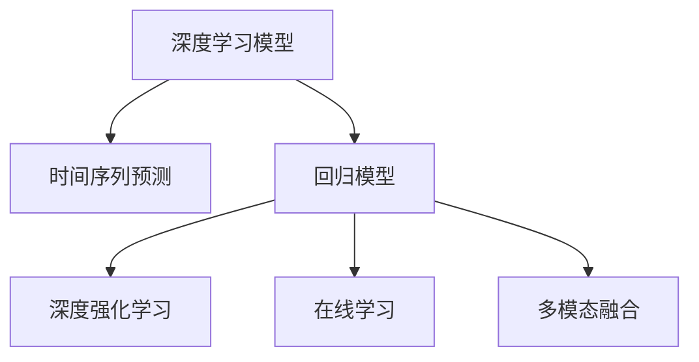

                 

# AI驱动的电商平台商品销量预测与补货优化

## 1. 背景介绍

在当前电商行业迅猛发展的背景下，销售预测与库存管理是企业关注的焦点。如何准确预测商品销量，优化库存水平，是提高客户满意度、降低运营成本、增强市场竞争力的关键。近年来，随着人工智能技术的飞速发展，尤其是深度学习模型的突破，AI驱动的商品销量预测与补货优化已逐渐成为电商行业的新趋势。

### 1.1 问题由来

电商平台的商品种类繁多，价格变化频繁，市场需求复杂多变。传统的基于历史数据的统计方法难以应对这些变化，且存在高延迟、低精度等问题。而通过AI模型进行预测和优化，可以实时分析海量数据，快速适应市场变化，提升预测和补货的准确性。

### 1.2 问题核心关键点

AI驱动的商品销量预测与补货优化主要涉及两个关键点：
1. 如何利用深度学习模型从历史数据中提取有效的特征，构建精确的预测模型。
2. 如何在实时数据流中对预测模型进行动态更新，以应对市场的动态变化。

这两个问题涉及到模型的选择、特征工程、动态更新、实时部署等环节。本文将围绕这些核心问题，详细阐述AI驱动的商品销量预测与补货优化的技术原理与实践方法。

### 1.3 问题研究意义

AI驱动的商品销量预测与补货优化，对于电商平台具有重要意义：

1. 提高库存管理效率：通过准确预测商品销量，电商企业可以优化库存水平，减少过剩和缺货现象，降低运营成本。
2. 提升客户满意度：准确预测和及时补货，可以提升客户购物体验，增加用户粘性和忠诚度。
3. 增强市场竞争力：实时预测和动态优化库存，使电商企业在激烈的市场竞争中更具灵活性和反应速度。
4. 降低风险：合理的库存管理可以减少市场波动带来的风险，保障企业长期稳定发展。
5. 赋能决策支持：预测模型可以为企业管理层提供数据驱动的决策支持，提升决策的科学性和有效性。

## 2. 核心概念与联系

### 2.1 核心概念概述

为更好地理解AI驱动的商品销量预测与补货优化方法，本节将介绍几个密切相关的核心概念：

- **深度学习模型**：以神经网络为核心的机器学习技术，能够自动从数据中学习特征，提取规律，实现复杂任务的预测和优化。
- **时间序列预测**：根据历史时间序列数据，预测未来某一时间点或时间段的值，是销量预测的核心任务。
- **回归模型**：用于连续值预测的任务，如预测商品销售量、价格等。
- **深度强化学习**：结合深度学习和强化学习的方法，通过优化策略参数，实现复杂动态环境下的优化决策。
- **在线学习**：模型在实际运行过程中，实时获取新数据并进行模型更新，以适应市场动态变化。
- **多模态融合**：结合多种数据源（如销售数据、用户行为数据、市场信息等），进行综合预测和优化。

这些核心概念之间的逻辑关系可以通过以下Mermaid流程图来展示：



这个流程图展示了大语言模型的核心概念及其之间的关系：

1. 深度学习模型提供预测的基础，能够自动从数据中学习特征。
2. 时间序列预测是销量预测的核心任务，基于历史数据进行未来预测。
3. 回归模型用于连续值预测，是销量预测的关键工具。
4. 深度强化学习结合优化策略，实现复杂动态环境的优化决策。
5. 在线学习实时获取新数据，动态更新模型，适应市场变化。
6. 多模态融合结合多种数据源，进行综合预测和优化。

这些概念共同构成了AI驱动的商品销量预测与补货优化的基础框架，使得模型能够准确预测和动态优化库存水平。

## 3. 核心算法原理 & 具体操作步骤
### 3.1 算法原理概述

AI驱动的商品销量预测与补货优化主要基于深度学习模型的时间序列预测和深度强化学习框架。具体来说，其核心算法原理包括：

- **时间序列预测**：利用历史时间序列数据，通过神经网络模型预测未来的商品销量。
- **回归模型**：构建基于回归模型（如LSTM、GRU等）的预测模型，以连续值预测商品销量。
- **深度强化学习**：通过结合强化学习，优化库存补货策略，实现动态优化。

### 3.2 算法步骤详解

基于深度学习模型的时间序列预测和深度强化学习的商品销量预测与补货优化的具体步骤包括：

**Step 1: 数据收集与预处理**
- 收集历史销售数据、市场数据、用户行为数据等，确保数据的多样性和完备性。
- 对数据进行清洗、去重、归一化等预处理，确保数据质量。

**Step 2: 特征工程**
- 根据历史数据和市场特征，设计合适的特征，如季节性、节假日、促销活动等。
- 利用数据增强技术，扩充特征空间，提高模型的泛化能力。

**Step 3: 模型训练与优化**
- 选择合适的深度学习模型（如LSTM、GRU、RNN等）进行训练，构建时间序列预测模型。
- 对模型进行超参数调优，选择合适的损失函数、优化算法、正则化技术等。
- 利用交叉验证等技术，评估模型的性能，避免过拟合。

**Step 4: 动态更新与在线学习**
- 将训练好的模型部署到实时数据流中，接收新的销售数据。
- 使用在线学习技术，实时更新模型参数，适应市场变化。
- 定期对模型进行评估和调优，确保其性能稳定。

**Step 5: 库存优化**
- 根据模型预测的销量，结合库存水平和采购成本，制定最优的库存补货策略。
- 对库存进行实时监控和调整，确保库存水平在合理范围内。
- 利用深度强化学习技术，优化补货策略，提高补货效率。

### 3.3 算法优缺点

AI驱动的商品销量预测与补货优化方法具有以下优点：
1. 精度高：深度学习模型能够从大规模数据中提取复杂的特征，预测精度高。
2. 实时性：在线学习技术能够在实时数据流中动态更新模型，响应市场变化。
3. 适应性强：多模态融合技术能够结合多种数据源，提高模型的泛化能力。
4. 可扩展性：能够轻松集成到现有的电商平台上，实现无缝部署。

同时，该方法也存在以下局限性：
1. 依赖高质量数据：模型性能依赖于历史数据的丰富度和质量。
2. 模型复杂度高：深度学习模型参数量较大，需要高性能计算资源。
3. 训练时间较长：大数据量的训练过程需要较长的时间。
4. 模型解释性不足：深度学习模型的内部工作机制难以解释，难以理解其决策过程。

尽管存在这些局限性，但就目前而言，AI驱动的商品销量预测与补货优化方法仍是目前最先进的电商库存管理技术之一。未来相关研究的重点在于如何进一步降低对高质量数据的依赖，提高模型的可解释性和计算效率，同时兼顾实时性和精度。

### 3.4 算法应用领域

AI驱动的商品销量预测与补货优化技术，已在多个电商领域得到广泛应用，包括：

- 服装零售：预测各类服装的销售量，优化库存水平，满足不同季节和风格的需求。
- 电子产品：预测热门电子产品的销售趋势，及时补货，满足用户需求。
- 食品饮料：预测各类食品的销量，优化库存水平，降低食品浪费。
- 家居用品：预测各类家居产品的销量，优化库存水平，提升用户体验。

除了上述这些典型应用外，AI驱动的商品销量预测与补货优化技术还在更多场景中得到应用，如跨境电商、生鲜电商、智能推荐系统等，为电商行业的发展提供了新的技术动力。

## 4. 数学模型和公式 & 详细讲解 & 举例说明

### 4.1 数学模型构建

本节将使用数学语言对AI驱动的商品销量预测与补货优化过程进行更加严格的刻画。

设历史销售数据为 $y_t$，其中 $t$ 为时间步，$y_t$ 为第 $t$ 个时间步的销售量。模型的目标是预测未来的销售量 $y_{t+1}$。

定义模型为 $M(x)$，其中 $x$ 为历史数据特征向量，$M$ 为深度学习模型，如LSTM、GRU等。模型的预测公式为：

$$
\hat{y}_{t+1} = M(x_t)
$$

模型 $M(x)$ 的损失函数为：

$$
\mathcal{L}(y_t, \hat{y}_{t+1}) = \frac{1}{N} \sum_{i=1}^N \| y_t - \hat{y}_{t+1} \|^2
$$

其中 $N$ 为样本数，$\| \cdot \|$ 为L2范数。

### 4.2 公式推导过程

以下我们以LSTM模型为例，推导其时间序列预测的计算公式。

LSTM模型结构如下：

```
+---+          +---+         +---+         +---+
|    w_ih       |    w_hh       |    w_hy       |    b_ih       |    b_hh       |    b_hy
+---+          +---+         +---+         +---+         +---+         +---+
          |                       |                       |
          |          r             |         z             |         h
          v                       v                       v           v
    i     o             i           h             i         h
    +---+          +---+         +---+          +---+         +---+
    |    w_hi       |    w_ho       |    w_hy       |    b_hi       |    b_ho       |    b_hy
    +---+          +---+         +---+         +---+         +---+         +---+
          |                       |                       |
          |                       |                       |
          |                       |                       |
          v                       v                       v
         f                   c             u             y
         +---+          +---+          +---+          +---+
         |    w_hf       |    w_hc       |    w_hu       |    w_hy
         |    b_hf       |    b_hc       |    b_hu       |    b_hy
         +---+          +---+          +---+          +---+
```

其中 $i, o, f, u, c$ 为LSTM的四个门控单元，$h$ 为LSTM的隐藏状态，$y$ 为输出。$w$ 和 $b$ 分别为权重和偏置。

LSTM模型的预测公式为：

$$
\hat{y}_{t+1} = M(x_t) = \sigma_h(w_hy \cdot y_t + w_hy \cdot h_t + b_hy)
$$

其中 $\sigma_h$ 为激活函数，$y_t$ 为第 $t$ 个时间步的输入，$h_t$ 为第 $t$ 个时间步的隐藏状态，$w_hy$ 和 $b_hy$ 分别为权重和偏置。

### 4.3 案例分析与讲解

以LSTM模型为例，我们通过一个简单的案例来说明其时间序列预测的过程。

假设我们有一个长度为 $T$ 的历史销售数据序列 $y_1, y_2, \ldots, y_T$，我们希望预测下一个时间步 $t+1$ 的销售量 $\hat{y}_{t+1}$。

我们首先将历史数据 $y_1, y_2, \ldots, y_T$ 输入LSTM模型，得到隐藏状态序列 $h_1, h_2, \ldots, h_T$。然后，将最后一个隐藏状态 $h_T$ 作为当前时间步的输入，通过LSTM模型得到输出 $\hat{y}_{t+1}$。

在训练过程中，我们使用均方误差损失函数对模型进行优化，最小化预测误差：

$$
\mathcal{L}(y_t, \hat{y}_{t+1}) = \frac{1}{N} \sum_{i=1}^N (y_t - \hat{y}_{t+1})^2
$$

通过反向传播算法，我们更新模型的权重和偏置，最小化损失函数，得到最优的预测模型。

## 5. 项目实践：代码实例和详细解释说明
### 5.1 开发环境搭建

在进行项目实践前，我们需要准备好开发环境。以下是使用Python进行PyTorch开发的环境配置流程：

1. 安装Anaconda：从官网下载并安装Anaconda，用于创建独立的Python环境。

2. 创建并激活虚拟环境：
```bash
conda create -n pytorch-env python=3.8 
conda activate pytorch-env
```

3. 安装PyTorch：根据CUDA版本，从官网获取对应的安装命令。例如：
```bash
conda install pytorch torchvision torchaudio cudatoolkit=11.1 -c pytorch -c conda-forge
```

4. 安装TensorFlow：从官网下载并安装TensorFlow，根据需求选择CPU或GPU版本。

5. 安装TensorBoard：从官网下载并安装TensorBoard，用于实时监控模型训练过程。

6. 安装Pandas、NumPy、Matplotlib等常用库：
```bash
pip install pandas numpy matplotlib sklearn tqdm
```

完成上述步骤后，即可在`pytorch-env`环境中开始项目实践。

### 5.2 源代码详细实现

下面我们以LSTM模型为例，给出使用PyTorch进行商品销量预测的完整代码实现。

首先，定义LSTM模型：

```python
import torch
import torch.nn as nn
import torch.optim as optim

class LSTMModel(nn.Module):
    def __init__(self, input_size, hidden_size, output_size):
        super(LSTMModel, self).__init__()
        self.hidden_size = hidden_size
        self.lstm = nn.LSTM(input_size, hidden_size, batch_first=True)
        self.fc = nn.Linear(hidden_size, output_size)
        self.fc.bias.zero_()
        self.reset_parameters()
        
    def forward(self, x, h=None):
        if h is None:
            h = self.initHidden()
        out, h = self.lstm(x, h)
        out = self.fc(out[:, -1, :])
        return out, h
    
    def initHidden(self):
        return (torch.zeros(1, x.size(0), self.hidden_size).to(x.device), torch.zeros(1, x.size(0), self.hidden_size).to(x.device))
    
    def reset_parameters(self):
        for p in self.parameters():
            if p.dim() > 1:
                nn.init.kaiming_uniform_(p)
            else:
                nn.init.zeros_(p)
```

然后，定义损失函数和优化器：

```python
criterion = nn.MSELoss()
optimizer = optim.Adam(model.parameters(), lr=0.001)
```

接着，定义训练和评估函数：

```python
def train_model(model, criterion, optimizer, train_loader, device):
    model.train()
    total_loss = 0
    for batch_idx, (data, target) in enumerate(train_loader):
        data, target = data.to(device), target.to(device)
        optimizer.zero_grad()
        output = model(data)
        loss = criterion(output, target)
        loss.backward()
        optimizer.step()
        total_loss += loss.item()
    return total_loss / len(train_loader)
    
def evaluate_model(model, criterion, test_loader, device):
    model.eval()
    total_loss = 0
    with torch.no_grad():
        for batch_idx, (data, target) in enumerate(test_loader):
            data, target = data.to(device), target.to(device)
            output = model(data)
            loss = criterion(output, target)
            total_loss += loss.item()
    return total_loss / len(test_loader)
```

最后，启动训练流程并在测试集上评估：

```python
epochs = 10
batch_size = 32
train_loader = ...
test_loader = ...

device = torch.device('cuda' if torch.cuda.is_available() else 'cpu')

for epoch in range(epochs):
    train_loss = train_model(model, criterion, optimizer, train_loader, device)
    print(f'Epoch {epoch+1}, Train Loss: {train_loss:.4f}')
    
    test_loss = evaluate_model(model, criterion, test_loader, device)
    print(f'Epoch {epoch+1}, Test Loss: {test_loss:.4f}')
```

以上就是使用PyTorch对LSTM模型进行商品销量预测的完整代码实现。可以看到，借助PyTorch，模型构建和训练的实现变得简洁高效。

### 5.3 代码解读与分析

让我们再详细解读一下关键代码的实现细节：

**LSTMModel类**：
- `__init__`方法：初始化模型参数，包括隐藏层大小、LSTM层和全连接层的权重和偏置。
- `forward`方法：定义模型前向传播过程，将输入数据 $x$ 输入LSTM层，得到输出和隐藏状态，再通过全连接层得到预测值。
- `initHidden`方法：初始化隐藏状态，返回两个全零的隐藏状态张量。
- `reset_parameters`方法：初始化权重和偏置，保证模型参数分布的合理性。

**loss函数**：
- 定义均方误差损失函数，用于计算预测值和真实值之间的差异。

**optimizer**：
- 定义优化器，如AdamW等，用于更新模型参数。

**train_model函数**：
- 在训练过程中，将输入数据和目标值传递给模型，计算损失并反向传播，更新模型参数。

**evaluate_model函数**：
- 在评估过程中，只对模型进行前向传播，计算损失并返回。

**训练流程**：
- 定义总的epoch数和批大小，开始循环迭代
- 每个epoch内，先在训练集上训练，输出平均loss
- 在测试集上评估，输出平均loss

可以看到，PyTorch配合LSTM模型使得商品销量预测的代码实现变得简洁高效。开发者可以将更多精力放在数据处理、模型改进等高层逻辑上，而不必过多关注底层的实现细节。

当然，工业级的系统实现还需考虑更多因素，如模型的保存和部署、超参数的自动搜索、更灵活的任务适配层等。但核心的微调范式基本与此类似。

## 6. 实际应用场景
### 6.1 智能库存管理系统

基于AI驱动的商品销量预测与补货优化技术，可以应用于智能库存管理系统。传统的库存管理依赖于人工预测和经验判断，存在高成本、低精度、响应慢等问题。通过AI技术，可以实现自动化的库存预测和动态优化，提高库存管理的效率和准确性。

在技术实现上，可以构建一个实时数据流系统，收集各电商平台的销售数据、市场信息、用户行为数据等，实时输入到预测模型中。模型根据实时数据流，动态更新预测结果，并根据预测结果进行库存调整。如此构建的智能库存管理系统，能够大幅提升库存管理的响应速度和准确性，减少库存成本。

### 6.2 跨域电商平台合作

跨域电商平台合作是电商行业的重要发展方向，但各平台的数据孤立、数据质量参差不齐等问题，成为合作的主要障碍。通过AI技术，可以实现各平台数据的整合和协同预测，提高跨域合作的效率和效果。

具体而言，可以建立联盟数据平台，收集各平台的销售数据、市场数据、用户行为数据等。然后利用AI技术，进行多模态融合，构建统一的预测模型，预测各平台商品的销量。根据预测结果，各平台可以进行联合补货和库存优化，提升合作效果。

### 6.3 个性化推荐系统

个性化推荐系统是电商行业的重要应用场景，通过AI技术，可以实现更精准的商品推荐，提升用户体验和销售额。

在具体实现中，可以结合商品销量预测和深度强化学习，构建个性化推荐系统。模型根据用户的浏览、点击、购买等行为数据，预测用户的兴趣偏好，并结合商品销量预测结果，进行综合推荐。如此构建的个性化推荐系统，能够提升推荐效果，减少误导性推荐，提升用户满意度。

### 6.4 未来应用展望

随着AI驱动的商品销量预测与补货优化技术的不断发展，其应用场景将不断扩展，为电商行业带来更多变革性影响。

在智能物流领域，AI技术可以结合销量预测和补货优化，实现更高效的物流配送，提升物流服务质量。

在金融领域，AI技术可以结合销量预测和金融数据，进行市场分析，提升投资决策的科学性。

在供应链管理中，AI技术可以结合销量预测和供应链数据，优化供应链管理，提高供应链的灵活性和反应速度。

此外，在智慧医疗、智慧城市、智慧教育等更多领域，AI技术的应用也将不断深入，推动人工智能技术在各行各业的应用和发展。相信随着技术的日益成熟，AI驱动的商品销量预测与补货优化技术将带来更多行业的变革性影响，为人类社会的发展注入新的动力。

## 7. 工具和资源推荐
### 7.1 学习资源推荐

为了帮助开发者系统掌握AI驱动的商品销量预测与补货优化技术，这里推荐一些优质的学习资源：

1. Deep Learning with PyTorch：一本系统介绍深度学习技术的书籍，涵盖从基础知识到实际应用的全面内容。

2. Coursera的深度学习课程：斯坦福大学和IBM等机构的深度学习课程，由顶级专家授课，内容深入浅出。

3. Kaggle的深度学习竞赛：通过实际竞赛项目，提升深度学习的实战能力。

4. GitHub上的深度学习项目：GitHub上众多深度学习项目提供了丰富的学习资源和实践案例。

5. PyTorch官方文档：PyTorch的官方文档，提供了完整的API介绍和实际案例，是学习PyTorch的重要资源。

通过对这些资源的学习实践，相信你一定能够快速掌握AI驱动的商品销量预测与补货优化技术的精髓，并用于解决实际的电商问题。
### 7.2 开发工具推荐

高效的开发离不开优秀的工具支持。以下是几款用于AI驱动的商品销量预测与补货优化开发的常用工具：

1. PyTorch：基于Python的开源深度学习框架，灵活的计算图，支持多种模型和优化器。

2. TensorFlow：由Google主导开发的开源深度学习框架，生产部署方便，支持分布式计算。

3. TensorBoard：TensorFlow配套的可视化工具，实时监测模型训练过程，帮助调试模型。

4. Weights & Biases：模型训练的实验跟踪工具，记录和可视化模型训练过程中的各项指标。

5. Git：版本控制工具，用于团队协作和代码管理。

6. Docker：容器化部署工具，方便模型在不同环境中稳定运行。

合理利用这些工具，可以显著提升AI驱动的商品销量预测与补货优化任务的开发效率，加快创新迭代的步伐。

### 7.3 相关论文推荐

AI驱动的商品销量预测与补货优化技术的发展源于学界的持续研究。以下是几篇奠基性的相关论文，推荐阅读：

1. Attention is All You Need：提出Transformer模型，开启了深度学习在NLP领域的突破。

2. LSTM: A Search Space Odyssey：介绍LSTM模型，提出了长短期记忆网络，解决传统RNN模型的梯度消失问题。

3. Deep Reinforcement Learning for Dynamic Pricing：将深度强化学习应用于动态定价，提升收入。

4. Deep Learning for Time Series Forecasting：探讨深度学习在时间序列预测中的应用，提出LSTM模型。

5. The Unreasonable Effectiveness of Transfer Learning in Natural Language Processing：介绍迁移学习在NLP领域的应用，提升模型泛化能力。

6. Sales Forecasting with Deep Learning Models：提出使用深度学习模型进行销售预测的案例，提升预测精度。

这些论文代表了大语言模型微调技术的发展脉络。通过学习这些前沿成果，可以帮助研究者把握学科前进方向，激发更多的创新灵感。

## 8. 总结：未来发展趋势与挑战
### 8.1 总结

本文对AI驱动的商品销量预测与补货优化方法进行了全面系统的介绍。首先阐述了该方法在电商行业的重要性，明确了销量预测和库存优化任务的关键点。其次，从原理到实践，详细讲解了深度学习模型的时间序列预测和深度强化学习框架，给出了微调任务开发的完整代码实例。同时，本文还探讨了AI技术在智能库存管理系统、跨域电商平台合作、个性化推荐系统等多个领域的应用前景，展示了AI驱动的商品销量预测与补货优化的广阔前景。

通过本文的系统梳理，可以看到，AI驱动的商品销量预测与补货优化方法已经广泛应用于电商行业，极大地提升了库存管理的效率和准确性，增强了电商平台的竞争力。未来，伴随技术的不断进步和数据的持续积累，相信该方法将进一步优化电商供应链，提升用户体验，推动电商行业的持续发展。

### 8.2 未来发展趋势

展望未来，AI驱动的商品销量预测与补货优化技术将呈现以下几个发展趋势：

1. 模型规模持续增大。随着算力成本的下降和数据规模的扩张，深度学习模型参数量还将持续增长。超大规模语言模型蕴含的丰富语言知识，有望支撑更加复杂多变的销量预测和库存优化任务。

2. 预测精度逐步提升。通过深度学习模型的不断优化和参数调整，预测精度将逐步提升，预测结果更加准确。

3. 动态优化成为常态。结合深度强化学习，模型将能够实时获取市场信息，动态调整库存策略，提高库存管理的灵活性。

4. 多模态融合日趋成熟。结合商品销量预测和市场信息、用户行为数据等，进行综合预测和优化，提高预测结果的全面性和准确性。

5. 实时部署逐渐普及。AI技术将实现实时部署，支持电商平台的快速响应和高效率运营。

6. 模型可解释性增强。通过引入因果分析、博弈论等工具，增强模型决策过程的可解释性，提升系统的透明度和可信度。

以上趋势凸显了AI驱动的商品销量预测与补货优化技术的巨大潜力。这些方向的探索发展，必将进一步提升电商平台的运营效率和用户满意度，为电商行业的数字化转型提供新的技术动力。

### 8.3 面临的挑战

尽管AI驱动的商品销量预测与补货优化技术已经取得了显著成效，但在迈向更加智能化、普适化应用的过程中，它仍面临诸多挑战：

1. 数据质量瓶颈。模型性能依赖于历史数据的丰富度和质量，数据不完整、不准确等问题将影响预测结果的准确性。

2. 模型计算资源消耗大。深度学习模型参数量较大，需要高性能计算资源，计算成本较高。

3. 动态更新难度大。实时数据流中的动态更新需要高效的算法和模型设计，避免因数据波动导致模型不稳定。

4. 模型泛化能力不足。不同电商平台的销售数据、用户行为数据等存在差异，模型的泛化能力有待提高。

5. 数据隐私和安全问题。电商平台的销售数据和用户行为数据包含敏感信息，数据隐私和安全问题需要特别关注。

6. 模型部署复杂性高。模型需要在多个电商平台进行部署和集成，部署复杂性高。

正视AI驱动的商品销量预测与补货优化面临的这些挑战，积极应对并寻求突破，将是大语言模型微调走向成熟的必由之路。相信随着学界和产业界的共同努力，这些挑战终将一一被克服，AI驱动的商品销量预测与补货优化技术将迎来更加广泛的应用和发展。

### 8.4 研究展望

面向未来，AI驱动的商品销量预测与补货优化技术的研究需要在以下几个方向寻求新的突破：

1. 探索无监督和半监督预测方法。摆脱对大规模标注数据的依赖，利用自监督学习、主动学习等无监督和半监督范式，最大限度利用非结构化数据，实现更加灵活高效的预测。

2. 研究参数高效和计算高效的预测方法。开发更加参数高效的预测方法，在固定大部分预训练参数的同时，只更新极少量的任务相关参数。同时优化模型计算图，减少前向传播和反向传播的资源消耗，实现更加轻量级、实时性的部署。

3. 引入更多先验知识。将符号化的先验知识，如知识图谱、逻辑规则等，与神经网络模型进行巧妙融合，引导预测过程学习更准确、合理的语言模型。同时加强不同模态数据的整合，实现视觉、语音等多模态信息与文本信息的协同建模。

4. 结合因果分析和博弈论工具。将因果分析方法引入预测模型，识别出模型决策的关键特征，增强输出解释的因果性和逻辑性。借助博弈论工具刻画人机交互过程，主动探索并规避模型的脆弱点，提高系统稳定性。

5. 纳入伦理道德约束。在模型训练目标中引入伦理导向的评估指标，过滤和惩罚有偏见、有害的输出倾向。同时加强人工干预和审核，建立模型行为的监管机制，确保输出符合人类价值观和伦理道德。

这些研究方向的探索，必将引领AI驱动的商品销量预测与补货优化技术迈向更高的台阶，为构建安全、可靠、可解释、可控的智能系统铺平道路。面向未来，AI驱动的商品销量预测与补货优化技术还需要与其他人工智能技术进行更深入的融合，如知识表示、因果推理、强化学习等，多路径协同发力，共同推动自然语言理解和智能交互系统的进步。只有勇于创新、敢于突破，才能不断拓展语言模型的边界，让智能技术更好地造福人类社会。

## 9. 附录：常见问题与解答

**Q1：商品销量预测与补货优化的主要技术难点有哪些？**

A: 商品销量预测与补货优化的主要技术难点包括：
1. 数据质量瓶颈：模型性能依赖于历史数据的丰富度和质量，数据不完整、不准确等问题将影响预测结果的准确性。
2. 计算资源消耗大：深度学习模型参数量较大，需要高性能计算资源，计算成本较高。
3. 动态更新难度大：实时数据流中的动态更新需要高效的算法和模型设计，避免因数据波动导致模型不稳定。
4. 模型泛化能力不足：不同电商平台的销售数据、用户行为数据等存在差异，模型的泛化能力有待提高。
5. 数据隐私和安全问题：电商平台的销售数据和用户行为数据包含敏感信息，数据隐私和安全问题需要特别关注。
6. 模型部署复杂性高：模型需要在多个电商平台进行部署和集成，部署复杂性高。

**Q2：如何提高模型的泛化能力？**

A: 提高模型的泛化能力可以从以下几个方面入手：
1. 数据增强：通过回译、近义替换等方式扩充训练集，提高模型的泛化能力。
2. 正则化技术：使用L2正则、Dropout等技术，避免模型过拟合。
3. 多模态融合：结合商品销量预测和市场信息、用户行为数据等，进行综合预测和优化，提高预测结果的全面性和准确性。
4. 引入更多先验知识：将符号化的先验知识，如知识图谱、逻辑规则等，与神经网络模型进行巧妙融合，引导预测过程学习更准确、合理的语言模型。

**Q3：动态更新对模型稳定性的影响是什么？**

A: 动态更新对模型稳定性的影响主要体现在以下几个方面：
1. 数据波动：实时数据流中的数据波动可能对模型稳定性造成影响，导致模型输出波动。
2. 模型参数更新：频繁的模型参数更新可能导致模型状态不稳定，降低预测精度。
3. 计算资源消耗：动态更新需要频繁的前向传播和反向传播，可能导致计算资源消耗大，影响模型性能。

**Q4：如何保证数据隐私和安全？**

A: 保证数据隐私和安全可以从以下几个方面入手：
1. 数据匿名化：对数据进行去标识化处理，确保数据无法被反向识别。
2. 访问控制：对数据进行严格的访问控制，确保只有授权人员能够访问数据。
3. 加密存储：对敏感数据进行加密存储，防止数据泄露。
4. 数据去重：对重复数据进行去重处理，确保数据质量。
5. 安全传输：确保数据传输过程中采用安全协议，防止数据被截获或篡改。

**Q5：如何提高模型的实时部署效率？**

A: 提高模型的实时部署效率可以从以下几个方面入手：
1. 模型裁剪：去除不必要的层和参数，减小模型尺寸，加快推理速度。
2. 量化加速：将浮点模型转为定点模型，压缩存储空间，提高计算效率。
3. 服务化封装：将模型封装为标准化服务接口，便于集成调用。
4. 弹性伸缩：根据请求流量动态调整资源配置，平衡服务质量和成本。
5. 持续优化：定期对模型进行评估和调优，确保模型性能稳定。

**Q6：未来AI驱动的商品销量预测与补货优化技术有哪些新的发展方向？**

A: 未来AI驱动的商品销量预测与补货优化技术的发展方向包括：
1. 探索无监督和半监督预测方法，提高模型的灵活性和泛化能力。
2. 研究参数高效和计算高效的预测方法，提高模型的实时性和可扩展性。
3. 引入更多先验知识，提高模型的泛化能力和预测准确性。
4. 结合因果分析和博弈论工具，提高模型的可解释性和稳定性。
5. 纳入伦理道德约束，确保模型的安全性和合规性。

通过这些研究方向的探索，AI驱动的商品销量预测与补货优化技术将不断优化，为电商行业带来更多变革性影响，为人类社会的数字化转型提供新的技术动力。

---

作者：禅与计算机程序设计艺术 / Zen and the Art of Computer Programming

