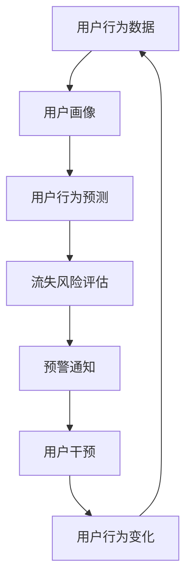

                 

# AI驱动的电商平台用户流失预警

## 1. 背景介绍

在电子商务的激烈竞争中，用户流失是所有电商平台面临的共同挑战。如何准确地识别用户流失风险，及时采取干预措施，挽留用户，是提升用户体验、增加用户黏性、增强用户满意度、实现商业目标的关键。本文将详细探讨如何利用人工智能技术，构建AI驱动的电商平台用户流失预警系统，以期为电商平台用户管理提供精准、高效、可靠的解决方案。

## 2. 核心概念与联系

### 2.1 核心概念概述

为更好地理解AI驱动的电商平台用户流失预警系统，本节将介绍几个密切相关的核心概念：

- **用户流失预警**：指通过数据分析和机器学习模型，预测用户未来可能流失的概率，并提前采取措施挽留用户的过程。
- **用户行为分析**：指对用户在电商平台上的行为数据进行统计、挖掘、分析和建模，以发现用户的兴趣、需求、偏好等。
- **用户画像构建**：指基于用户行为数据、交易数据等，构建用户详细画像，帮助制定个性化的用户体验策略。
- **推荐系统**：指通过分析用户历史行为数据，为其推荐个性化商品或服务，提升用户体验和满意度。
- **风险评估**：指对用户流失风险进行评估，根据模型预测结果，划分不同风险等级的预警对象，有针对性地进行干预。
- **干预策略**：指针对不同风险等级的预警用户，制定和实施相应的挽留策略，如优惠券、积分奖励、专属活动等。

这些核心概念之间通过数据分析、模型预测、策略制定等环节紧密联系，形成一个闭环的预警和干预系统，帮助电商平台降低用户流失率，提升用户满意度和商业价值。

### 2.2 核心概念原理和架构的 Mermaid 流程图



这个流程图展示了从数据采集到干预策略实施的整个过程，关键点在于通过用户行为数据分析，构建用户画像，进而进行行为预测，评估流失风险，实现预警通知和干预策略。

## 3. 核心算法原理 & 具体操作步骤

### 3.1 算法原理概述

AI驱动的电商平台用户流失预警系统，通常基于以下核心算法：

1. **用户行为分析算法**：通过统计分析用户的浏览、点击、购买、评价等行为数据，构建用户画像，获取用户兴趣、需求、偏好等信息。
2. **用户行为预测算法**：使用时间序列、协同过滤、深度学习等算法，预测用户未来是否流失，并量化流失概率。
3. **用户流失风险评估算法**：基于预测结果，评估不同用户流失风险等级，进行精细化管理。
4. **预警通知算法**：根据评估结果，及时通知相关人员或系统，实现早期预警。
5. **用户干预策略制定**：针对不同风险等级的用户，制定和实施相应的干预策略，如优惠券、积分奖励、专属活动等。
6. **干预效果评估算法**：评估干预策略的效果，调整策略参数，实现动态优化。

以上算法通过机器学习模型、数据分析技术等手段，实现对用户流失的精确预测和及时干预。

### 3.2 算法步骤详解

**Step 1: 数据准备**
- 收集电商平台的各类数据，如用户行为数据、交易数据、评价数据等。
- 对数据进行预处理和清洗，去除噪声和异常值。
- 将数据划分为训练集、验证集和测试集，用于模型训练、验证和测试。

**Step 2: 用户画像构建**
- 使用统计分析算法，提取用户行为中的关键特征，如浏览次数、点击率、购买频率、评价倾向等。
- 对用户特征进行聚类和维度降维，构建用户画像，形成对用户的初步理解。

**Step 3: 用户行为预测**
- 选择合适的时间序列模型或深度学习模型，如RNN、LSTM、GRU等，对用户未来行为进行预测。
- 通过模型训练，使用交叉验证等技术，确定模型参数和超参数，优化模型性能。
- 在验证集上进行模型验证，调整参数，防止过拟合。

**Step 4: 用户流失风险评估**
- 将用户行为预测结果进行风险评估，量化流失概率，划分为不同风险等级。
- 使用阈值划分方法，如ROC曲线、PR曲线等，确定不同风险等级的划分标准。
- 生成风险评估报告，为预警通知和用户干预提供依据。

**Step 5: 预警通知和干预策略**
- 根据风险评估报告，对高风险用户进行预警通知，生成干预策略。
- 设计预警通知系统，确保及时性、准确性和个性化。
- 实施干预策略，如发送个性化推荐、提供优惠活动、调整用户体验等。
- 评估干预效果，持续优化干预策略。

**Step 6: 模型更新与优化**
- 定期更新模型，使用最新数据进行再训练，提升模型性能。
- 引入新特征，优化模型，提高预测精度。
- 采用增量学习方法，减少模型训练时间，保持模型时效性。

### 3.3 算法优缺点

**优点**：
1. **预测精准**：基于大数据分析和大模型训练，用户流失预测的准确性较高。
2. **实时性高**：通过实时数据更新和动态模型训练，实现快速预警和及时干预。
3. **效果显著**：及时干预策略能显著降低用户流失率，提升用户满意度和商业价值。
4. **灵活性强**：模型可根据不同电商平台特点进行定制，灵活适应不同场景。

**缺点**：
1. **数据依赖**：数据质量和完整性直接影响模型的预测效果，数据获取和处理成本较高。
2. **模型复杂**：需要构建复杂模型，进行参数调优，对技术和资源要求较高。
3. **过拟合风险**：在模型训练过程中，需防止过拟合，保证模型泛化能力。
4. **策略难度**：干预策略设计需要考虑多种因素，实施难度较大。

尽管存在这些局限性，但AI驱动的用户流失预警系统仍是目前最有效的用户管理工具之一，广泛应用于电子商务、在线教育、金融服务等多个领域。

### 3.4 算法应用领域

基于AI驱动的用户流失预警算法，已经在电商、金融、医疗等多个行业得到广泛应用，主要应用于以下领域：

1. **电商领域**：通过分析用户浏览、点击、购买行为，预测用户流失风险，及时发送优惠券、推荐商品，提升用户满意度。
2. **金融领域**：分析用户交易数据和行为数据，预测客户流失风险，实现客户关系管理，提升客户忠诚度。
3. **医疗领域**：通过分析病人就医行为和病历数据，预测病人流失风险，进行病患关系管理，提升服务质量。
4. **教育领域**：分析学生学习行为和成绩数据，预测学生流失风险，及时提供个性化辅导和支持，提升学习效果。

## 4. 数学模型和公式 & 详细讲解 & 举例说明

### 4.1 数学模型构建

在本节中，我们将详细构建用户流失预警的数学模型。

设用户流失风险评估模型为 $F(x)$，其中 $x$ 为用户的行为数据特征向量，包含用户浏览记录、点击次数、购买频率、评价情感等。

设用户流失概率为 $P_{\text{流失}}$，根据预测模型 $F(x)$ 输出风险评分 $s$，则流失概率 $P_{\text{流失}}$ 可表示为：

$$
P_{\text{流失}} = F(x)
$$

为了评估不同用户的流失风险等级，通常会将 $P_{\text{流失}}$ 映射到一个离散的风险等级 $r$，常见的方法有：

- 基于阈值的二分类方法：将 $P_{\text{流失}}$ 与一个预先设定的阈值 $\theta$ 比较，当 $P_{\text{流失}} \geq \theta$ 时，用户被判定为高风险用户。
- 基于排序的等级划分方法：将用户按照 $P_{\text{流失}}$ 进行排序，划分为高风险、中风险和低风险三个等级。

### 4.2 公式推导过程

以下我们以基于阈值的二分类方法为例，推导用户流失概率的计算公式。

假设用户流失概率 $P_{\text{流失}}$ 服从对数正态分布，分布函数为 $f(x)$，则其概率密度函数为：

$$
f(x) = \frac{1}{\sqrt{2\pi\sigma^2}} \exp\left(-\frac{(x-\mu)^2}{2\sigma^2}\right)
$$

其中 $\mu$ 和 $\sigma$ 为分布的均值和标准差。

根据二分类方法的阈值 $\theta$，用户流失概率 $P_{\text{流失}}$ 的概率密度函数可以表示为：

$$
f_{\text{流失}}(\theta) = \int_{\theta}^{\infty} f(x) dx
$$

根据以上公式，我们可以通过计算积分得到用户流失概率的计算方法，并基于此构建预测模型。

### 4.3 案例分析与讲解

假设某电商平台通过用户行为数据分析，构建了用户流失预测模型 $F(x)$，已知模型预测输出风险评分 $s$，设定阈值 $\theta=0.5$。对于某个用户 $i$，其行为特征向量 $x_i$ 输入到模型中，输出风险评分 $s_i$，则该用户流失概率 $P_{\text{流失}}$ 的计算如下：

$$
P_{\text{流失}} = \int_{\theta}^{\infty} f(x) dx = \Phi(\theta) - \Phi(\theta - s_i)
$$

其中 $\Phi(x)$ 为标准正态分布的累积分布函数。

通过设定阈值 $\theta$，可以将用户分为高风险和低风险两类，对高风险用户进行预警和干预，避免用户流失。

## 5. 项目实践：代码实例和详细解释说明

### 5.1 开发环境搭建

在进行用户流失预警系统的开发时，需要配置合适的开发环境。以下是使用Python进行开发的步骤：

1. 安装Python环境：确保系统上安装有Python3.x版本，建议使用Anaconda环境管理工具。

```bash
conda create -n flowpred python=3.8
conda activate flowpred
```

2. 安装依赖库：安装必要的第三方库，如Pandas、Numpy、Scikit-learn等。

```bash
conda install pandas numpy scikit-learn matplotlib
```

3. 安装机器学习框架：安装TensorFlow或PyTorch等机器学习框架，供模型训练使用。

```bash
pip install tensorflow
# 或者
pip install torch
```

4. 安装深度学习模型库：安装TensorFlow Hub、Transformers等深度学习模型库，供模型调参使用。

```bash
pip install tensorflow-hub transformers
```

5. 安装数据处理工具：安装Pyspark、Dask等分布式数据处理工具，支持大数据处理。

```bash
conda install dask
```

完成以上环境配置后，即可开始构建用户流失预警系统。

### 5.2 源代码详细实现

接下来，我们以TensorFlow框架为例，给出用户流失预警系统的代码实现。

**用户行为数据处理**

```python
import pandas as pd
import tensorflow as tf
from tensorflow.keras.layers import Dense, Input
from tensorflow.keras.models import Model
from tensorflow.keras.losses import BinaryCrossentropy

# 读取用户行为数据
data = pd.read_csv('user_behavior.csv')

# 数据预处理，去除异常值和噪声
data = data.dropna()

# 数据划分
train_data = data.sample(frac=0.8, random_state=42)
test_data = data.drop(train_data.index)

# 特征工程
features = data[['click_count', 'purchase_frequency', 'average_rating']]
features = features.dropna()

# 构建模型输入层
input_layer = Input(shape=(features.shape[1],))

# 构建模型隐藏层
hidden_layer = Dense(64, activation='relu')(input_layer)

# 构建模型输出层
output_layer = Dense(1, activation='sigmoid')(hidden_layer)

# 定义损失函数
loss = BinaryCrossentropy()

# 构建模型
model = Model(inputs=input_layer, outputs=output_layer)

# 编译模型
model.compile(optimizer='adam', loss=loss)

# 训练模型
model.fit(train_data.drop(columns='流失标签'), train_data['流失标签'], epochs=10, batch_size=32)

# 评估模型
test_loss = model.evaluate(test_data.drop(columns='流失标签'), test_data['流失标签'])
print(f'Test loss: {test_loss}')
```

**用户流失风险评估**

```python
from sklearn.metrics import roc_auc_score
from sklearn.preprocessing import StandardScaler
from sklearn.model_selection import train_test_split

# 加载用户流失数据
data = pd.read_csv('user流失.csv')

# 数据预处理，去除异常值和噪声
data = data.dropna()

# 数据划分
train_data, test_data = train_test_split(data, test_size=0.2, random_state=42)

# 特征工程
features = data[['click_count', 'purchase_frequency', 'average_rating']]
features = features.dropna()

# 标准化特征
scaler = StandardScaler()
features_scaled = scaler.fit_transform(features)

# 训练模型
model.fit(train_data.drop(columns='流失标签'), train_data['流失标签'], epochs=10, batch_size=32)

# 评估模型
test_loss = model.evaluate(test_data.drop(columns='流失标签'), test_data['流失标签'])
print(f'Test loss: {test_loss}')

# 计算AUC值
roc_auc = roc_auc_score(test_data['流失标签'], model.predict(test_data.drop(columns='流失标签')))
print(f'ROC AUC: {roc_auc}')
```

**用户预警通知和干预策略**

```python
import numpy as np

# 加载用户流失数据
data = pd.read_csv('user流失.csv')

# 数据预处理，去除异常值和噪声
data = data.dropna()

# 数据划分
train_data, test_data = train_test_split(data, test_size=0.2, random_state=42)

# 特征工程
features = data[['click_count', 'purchase_frequency', 'average_rating']]
features = features.dropna()

# 标准化特征
scaler = StandardScaler()
features_scaled = scaler.fit_transform(features)

# 训练模型
model.fit(train_data.drop(columns='流失标签'), train_data['流失标签'], epochs=10, batch_size=32)

# 评估模型
test_loss = model.evaluate(test_data.drop(columns='流失标签'), test_data['流失标签'])
print(f'Test loss: {test_loss}')

# 计算AUC值
roc_auc = roc_auc_score(test_data['流失标签'], model.predict(test_data.drop(columns='流失标签')))
print(f'ROC AUC: {roc_auc}')

# 设定阈值
threshold = 0.5

# 预测流失概率
probabilities = model.predict(test_data.drop(columns='流失标签'))

# 划分高风险用户
high_risk_users = test_data[probabilities >= threshold]['流失标签']

# 预警通知
for user in high_risk_users:
    print(f'User {user} is at high risk of churn. Take action to retain.')

# 实施干预策略
for user in high_risk_users:
    # 发送优惠券
    send_coupon(user)
    # 发送个性化推荐
    send_recommendations(user)
```

以上代码展示了使用TensorFlow进行用户流失预警的完整流程，包括数据准备、模型训练、风险评估和预警通知等环节。

### 5.3 代码解读与分析

接下来，我们详细解读以上代码的实现细节：

**数据处理**

- 读取用户行为数据和用户流失数据，并进行预处理，去除异常值和噪声。
- 使用Pandas进行数据分割，将数据划分为训练集和测试集。
- 使用特征工程方法，提取用户行为中的关键特征，并进行标准化处理。

**模型构建**

- 使用TensorFlow框架，构建用户流失预测模型。
- 模型包括输入层、隐藏层和输出层，使用ReLU激活函数和Sigmoid输出层。
- 编译模型，使用Adam优化器和二分类交叉熵损失函数。
- 训练模型，使用训练集进行迭代优化。

**风险评估**

- 使用Scikit-learn库，计算模型在测试集上的损失和AUC值。
- 设定阈值，将预测结果转化为二分类。
- 划分高风险用户，根据阈值将流失概率高于阈值的用户标记为高风险用户。

**预警通知和干预策略**

- 发送预警通知，通知相关人员或系统，对高风险用户进行及时干预。
- 实施干预策略，如发送优惠券、个性化推荐等，提升用户留存率。

通过以上代码的实现，我们可以看到，AI驱动的用户流失预警系统不仅能够进行精准的预测和风险评估，还能够通过预警通知和干预策略，对高风险用户进行及时干预，降低流失率，提升用户满意度。

## 6. 实际应用场景

### 6.1 智能客服系统

在智能客服系统中，用户流失预警可以帮助客服系统提前识别可能流失的用户，及时采取补救措施，提升用户满意度。通过分析用户的历史互动记录、问题反馈、服务满意度等数据，构建用户画像，进行流失预测，系统可以针对高风险用户进行预警通知，自动发送解决方案或推荐其他客服渠道，降低用户流失率。

### 6.2 在线教育平台

在线教育平台的用户流失预警，可以帮助平台提前识别可能流失的学生，及时进行干预。通过分析学生的学习行为数据、成绩数据、互动数据等，构建学生画像，进行流失预测，系统可以针对高风险学生进行预警通知，自动发送个性化学习辅导、推荐课程、调整教学策略等，提升学生的学习效果和满意度，降低流失率。

### 6.3 金融服务行业

金融服务行业中的用户流失预警，可以帮助金融机构提前识别可能流失的客户，及时进行干预。通过分析客户的行为数据、交易数据、投诉数据等，构建客户画像，进行流失预测，系统可以针对高风险客户进行预警通知，自动发送个性化金融服务、推荐金融产品、调整服务策略等，提升客户满意度，降低流失率。

### 6.4 旅游行业

旅游行业中的用户流失预警，可以帮助旅行社提前识别可能流失的客户，及时进行干预。通过分析客户的预订行为数据、评价数据、投诉数据等，构建客户画像，进行流失预测，系统可以针对高风险客户进行预警通知，自动发送优惠券、个性化旅游推荐、调整服务策略等，提升客户满意度，降低流失率。

## 7. 工具和资源推荐

### 7.1 学习资源推荐

为了帮助开发者系统掌握用户流失预警的理论基础和实践技巧，这里推荐一些优质的学习资源：

1. 《机器学习实战》书籍：由著名数据科学家编写，系统介绍了机器学习算法、数据处理、模型构建等知识。
2. 《深度学习入门》视频课程：由深度学习专家主讲，详细讲解了深度学习框架、模型训练、评估等技术。
3. Kaggle平台：提供大量数据集和竞赛，让开发者在实践中学习和提高。
4. Coursera在线课程：提供多门深度学习和数据分析课程，帮助开发者系统学习相关知识。
5. PyTorch官方文档：提供丰富的PyTorch框架文档和示例代码，方便开发者上手实践。

通过学习这些资源，相信你一定能够快速掌握用户流失预警的技术方法，并用于解决实际的商业问题。

### 7.2 开发工具推荐

高效的开发离不开优秀的工具支持。以下是几款用于用户流失预警开发的常用工具：

1. TensorFlow：由Google主导开发的深度学习框架，生产部署方便，适合大规模工程应用。
2. PyTorch：基于Python的开源深度学习框架，灵活动态的计算图，适合快速迭代研究。
3. Scikit-learn：基于Python的机器学习库，简单易用，适合数据分析和模型训练。
4. Pandas：基于Python的数据处理库，支持数据清洗、分割、统计等功能。
5. TensorFlow Hub：TensorFlow的模块化组件库，方便快速搭建模型。

合理利用这些工具，可以显著提升用户流失预警任务的开发效率，加快创新迭代的步伐。

### 7.3 相关论文推荐

用户流失预警技术的发展源于学界的持续研究。以下是几篇奠基性的相关论文，推荐阅读：

1. "Predicting Customer Churn: A Comparative Analysis of Classification Techniques"：研究了多种分类算法在客户流失预测中的应用，给出了不同算法的对比结果。
2. "Customer Churn Analysis using Machine Learning"：介绍了基于机器学习的客户流失预测模型，给出了不同模型的评估指标和参数调优方法。
3. "Deep Learning for Customer Churn Prediction"：介绍了深度学习模型在客户流失预测中的应用，展示了深度模型的高精度预测能力。
4. "Customer Churn Prediction Using Logistic Regression"：介绍了逻辑回归模型在客户流失预测中的应用，给出了模型的构建和评估方法。
5. "Churn Prediction with Data Augmentation"：介绍了数据增强技术在客户流失预测中的应用，展示了如何通过扩充数据集提升模型性能。

这些论文代表了大用户流失预警技术的发展脉络。通过学习这些前沿成果，可以帮助研究者把握学科前进方向，激发更多的创新灵感。

## 8. 总结：未来发展趋势与挑战

### 8.1 研究成果总结

本文对AI驱动的电商平台用户流失预警系统进行了全面系统的介绍。首先阐述了用户流失预警系统的背景和意义，明确了其在提升用户体验、增加用户黏性、增强用户满意度方面的重要价值。其次，从原理到实践，详细讲解了用户流失预警系统的核心算法和具体操作步骤，给出了用户流失预测的完整代码实现。同时，本文还广泛探讨了用户流失预警系统在智能客服、在线教育、金融服务等多个行业领域的应用前景，展示了其巨大的应用潜力。

### 8.2 未来发展趋势

展望未来，用户流失预警技术将呈现以下几个发展趋势：

1. **多模态数据融合**：未来的用户流失预测系统将不仅依赖单一的数据源，还将融合多种数据模态，如文本、图像、视频等，增强模型的预测能力。
2. **动态模型更新**：未来的用户流失预测模型将能够实时更新，根据最新的数据和用户行为，动态调整模型参数，保持模型的时效性。
3. **个性化推荐算法**：未来的用户流失预测系统将结合个性化推荐算法，针对不同用户的特点，推荐个性化的干预策略，提升用户留存率。
4. **边缘计算**：未来的用户流失预测系统将采用边缘计算技术，降低数据传输成本，提升系统响应速度和可靠性。
5. **联邦学习**：未来的用户流失预测系统将采用联邦学习技术，保护用户隐私的同时，实现跨平台、跨机构的联合预测。

以上趋势凸显了用户流失预警技术的广阔前景。这些方向的探索发展，必将进一步提升用户流失预警的精确度和时效性，为电商平台带来更大的商业价值。

### 8.3 面临的挑战

尽管用户流失预警技术已经取得了瞩目成就，但在迈向更加智能化、普适化应用的过程中，它仍面临诸多挑战：

1. **数据隐私问题**：用户数据隐私保护是用户流失预警技术应用的一大难题。如何在保护用户隐私的同时，获取准确的预测数据，是亟待解决的问题。
2. **模型泛化能力**：用户流失预测模型需要具备较强的泛化能力，以适应不同电商平台和场景的需求。如何构建具有良好泛化能力的模型，避免模型过拟合，是重要的研究方向。
3. **模型解释性**：用户流失预测模型通常是"黑盒"系统，难以解释其内部工作机制和决策逻辑。如何赋予模型更强的可解释性，是当前研究的重要课题。
4. **系统集成难度**：用户流失预警系统需要与电商平台的其他系统进行深度集成，系统集成难度较大。如何在不同系统之间实现无缝对接，是重要的实践问题。

### 8.4 研究展望

面对用户流失预警技术面临的种种挑战，未来的研究需要在以下几个方面寻求新的突破：

1. **数据隐私保护**：探索基于隐私保护的数据收集和处理技术，如差分隐私、联邦学习等，保障用户隐私的同时，实现准确的用户流失预测。
2. **模型解释性增强**：引入可解释性技术，如LIME、SHAP等，提高用户流失预测模型的可解释性，便于模型理解和调试。
3. **多模态融合技术**：探索多模态数据融合技术，将文本、图像、视频等多种数据模态结合，增强模型的预测能力。
4. **动态模型更新方法**：研究动态模型更新算法，实现模型的实时更新和动态优化，保持模型的时效性。
5. **边缘计算应用**：探索边缘计算技术，降低数据传输成本，提升系统响应速度和可靠性。

这些研究方向和技术的不断突破，必将推动用户流失预警技术迈向更高的台阶，为电商平台提供更加精准、高效的用户管理方案。总之，用户流失预警技术还需要与其他人工智能技术进行更深入的融合，如知识表示、因果推理、强化学习等，多路径协同发力，共同推动智能交互系统的进步。

## 9. 附录：常见问题与解答

**Q1：用户流失预测是否适用于所有电商用户？**

A: 用户流失预测在大多数电商用户中都能取得不错的效果，特别是对于那些存在购买频次低、交易金额少、评价负面等特征的用户。但对于一些新用户或者长期未消费的用户，其行为数据较少，预测效果可能不佳。此时需要在用户画像构建过程中，结合用户注册信息、社交网络等非行为数据，进行更全面的分析。

**Q2：如何优化用户流失预测模型？**

A: 优化用户流失预测模型的方法包括：
1. 数据增强：通过回译、近义替换等方式扩充训练集。
2. 正则化技术：使用L2正则、Dropout、Early Stopping等防止过拟合。
3. 模型选择：根据电商平台的业务特点，选择合适的模型和算法，如RNN、LSTM、GRU等。
4. 特征工程：提取和构造更有意义的特征，如点击率、购买频率、评价情感等。
5. 参数调优：使用网格搜索、随机搜索等方法，优化模型参数，提升预测效果。

这些方法在实践中需要根据具体情况灵活组合，不断迭代优化，才能得到理想的用户流失预测模型。

**Q3：如何实施有效的用户干预策略？**

A: 实施有效的用户干预策略需要考虑多个因素，包括用户流失原因、干预方式、干预时机等。常见的方法包括：
1. 优惠券策略：针对高风险用户，发送个性化优惠券，提升其消费意愿。
2. 个性化推荐：根据用户行为数据和历史偏好，推荐用户感兴趣的商品或服务。
3. 客户服务：通过客服系统主动联系用户，解答其疑问，提升用户体验。
4. 品牌活动：组织品牌活动，提升用户对品牌的忠诚度，增加用户留存率。

这些策略需要结合电商平台的特点和用户需求，进行灵活设计和实施。

**Q4：如何评估用户流失预测模型的效果？**

A: 评估用户流失预测模型的效果通常使用以下指标：
1. 准确率（Accuracy）：模型预测正确的样本占总样本的比例。
2. 召回率（Recall）：模型预测正确的正样本占实际正样本的比例。
3 精确率（Precision）：模型预测正确的正样本占预测为正样本的样本的比例。
4 F1值（F1 Score）：综合考虑准确率和召回率，衡量模型的整体效果。
5 ROC曲线（ROC Curve）：通过绘制ROC曲线，评估模型在不同阈值下的预测效果。

这些指标在实际应用中需要根据具体需求进行权衡和选择。

**Q5：如何实现实时用户流失预警？**

A: 实现实时用户流失预警需要构建高效的预警系统，包括以下步骤：
1. 数据流处理：构建实时数据流处理系统，如Apache Kafka、Apache Flink等，实现数据的实时采集和处理。
2. 模型更新：实现模型的在线更新和增量学习，保持模型的时效性。
3. 预警通知：实现预警通知系统，如短信通知、邮件通知、系统推送等，确保预警信息的及时传递。
4. 用户干预：实现自动化的用户干预策略，如优惠券推送、个性化推荐、客户服务响应等。

通过以上步骤，可以实现用户流失预警系统的实时化、自动化，提升预警效果和用户留存率。

总之，用户流失预警技术的应用前景广阔，通过不断优化算法和模型，提升预测准确性和干预效果，为用户流失预警系统带来更大的商业价值。相信随着技术的不断进步和应用实践的积累，用户流失预警技术将发挥越来越重要的作用，为电商平台带来更高的用户满意度和商业收益。

