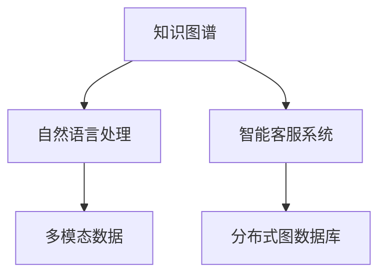

                 

# AI驱动的电商智能客户服务知识图谱构建系统

> 关键词：知识图谱构建, 智能客户服务, AI驱动, 电商, 图形网络, 自然语言处理(NLP)

## 1. 背景介绍

### 1.1 问题由来

随着电子商务的蓬勃发展，在线客户服务成为了商家与消费者之间沟通的重要桥梁。传统的客户服务模式，如人工客服、FAQ页面等，难以满足日益增长的客户需求，且成本高昂。为了提升客户满意度，电商平台纷纷引入智能客服机器人，利用自然语言处理(NLP)技术和知识图谱构建系统，提供24/7的即时响应和个性化服务。

然而，智能客服系统仍面临诸多挑战：

- 语义理解的准确性：当前智能客服系统往往难以理解复杂的自然语言，导致回答内容不准确。
- 多领域知识的融合：电商涉及商品、物流、支付等多个领域，单一领域知识图谱难以覆盖全场景。
- 用户交互的个性化：不同用户有不同的需求，同一用户在不同情境下也有不同的需求，现有知识图谱难以实现个性化服务。
- 知识图谱的构建效率：知识图谱的构建需要大量的人工标注和验证，费时费力，成本高昂。

为了应对这些挑战，AI驱动的电商智能客户服务知识图谱构建系统应运而生。通过结合自然语言处理、知识图谱构建技术和AI算法，系统可以高效构建覆盖电商全领域的多模态知识图谱，提供高效、准确、个性化的智能客服服务。

### 1.2 问题核心关键点

本系统的主要目标是通过AI驱动的知识图谱构建技术，构建覆盖电商全领域的多模态知识图谱，实现智能客服系统的个性化、高效化、准确化服务。

核心关键点包括：
1. **多模态数据的整合与融合**：利用文本、图像、音频等多模态数据，构建电商领域的知识图谱。
2. **自然语言处理的深度学习模型**：通过Transformer等深度学习模型，提升对自然语言的理解能力。
3. **知识图谱构建与优化算法**：设计高效的算法，构建高质量的知识图谱。
4. **智能客服系统的集成与部署**：将知识图谱与智能客服系统集成，实现个性化推荐、问题解答等功能。
5. **系统性能的评估与优化**：对系统性能进行评估，持续优化提升。

## 2. 核心概念与联系

### 2.1 核心概念概述

本节将介绍几个密切相关的核心概念：

- **知识图谱(Knowledge Graph)**：以图形网络的方式表示实体、属性和关系，用于描述和组织领域知识。知识图谱广泛应用于推荐系统、搜索引擎、智能客服等领域。
- **自然语言处理(NLP)**：涉及计算机对自然语言进行处理和理解的技术，如分词、词性标注、命名实体识别、语义分析等。NLP在电商智能客户服务中起到关键作用。
- **智能客服系统**：基于NLP和知识图谱构建的客户服务系统，能够提供自动化、个性化的客户服务。
- **多模态数据**：指多种类型的信息，如文本、图像、音频等，用于丰富知识图谱的表达能力。
- **分布式图数据库**：用于存储和管理大规模知识图谱的图数据库，具有高效存储、查询和扩展能力。

这些核心概念之间的逻辑关系可以通过以下Mermaid流程图来展示：



这个流程图展示了几者之间的逻辑关系：

1. 知识图谱通过自然语言处理技术，从多模态数据中提取和组织领域知识。
2. 智能客服系统通过知识图谱，实现自然语言理解和问题解答。
3. 多模态数据和多模态知识图谱，进一步提升了智能客服系统的智能化水平。
4. 分布式图数据库用于存储和管理大规模知识图谱，确保高效存储和查询。

## 3. 核心算法原理 & 具体操作步骤

### 3.1 算法原理概述

本系统采用基于图神经网络(Graph Neural Network, GNN)的知识图谱构建方法，结合自然语言处理(NLP)技术，构建电商领域的智能客服系统。

核心算法流程包括以下步骤：
1. 收集电商领域的文本、图像、音频等多模态数据。
2. 通过自然语言处理技术，提取并标注文本数据中的实体、关系和属性。
3. 利用图神经网络算法，构建电商领域的知识图谱。
4. 将知识图谱与智能客服系统集成，实现问题解答、个性化推荐等功能。

### 3.2 算法步骤详解

#### 3.2.1 数据收集与预处理

电商领域的知识图谱构建，首先需要收集大量的多模态数据。具体包括：

- **文本数据**：商品描述、用户评论、问答记录等。
- **图像数据**：商品图片、用户上传的图片等。
- **音频数据**：客服通话录音、用户语音指令等。

收集到的数据需要经过预处理，包括数据清洗、标注、归一化等步骤。例如，对于文本数据，需要进行分词、去停用词、词性标注等处理，以提高后续处理的准确性。

#### 3.2.2 实体识别与关系抽取

利用自然语言处理技术，对文本数据进行实体识别和关系抽取。具体流程如下：

1. **命名实体识别(Named Entity Recognition, NER)**：识别文本中的实体，如人名、地名、机构名等。
2. **关系抽取(Relation Extraction)**：从文本中抽取出实体之间的关系，如商品所属分类、商品与物流的关系等。
3. **属性抽取(Attribute Extraction)**：从文本中抽取实体的属性，如商品价格、评分、描述等。

具体实现可以使用现成的NLP库，如NLTK、SpaCy、Stanford CoreNLP等。这些库提供了丰富的工具和模型，可以高效地完成实体识别、关系抽取和属性抽取任务。

#### 3.2.3 知识图谱构建与优化

构建知识图谱是本系统的核心步骤，具体流程如下：

1. **图神经网络算法**：利用图神经网络模型，如GAT、GCN、Transformer等，构建电商领域的知识图谱。图神经网络能够高效处理图结构数据，提取隐含的实体关系和属性信息。
2. **知识图谱嵌入表示**：将知识图谱中的节点和边进行嵌入表示，使其能够通过机器学习模型进行处理和推理。常用的嵌入表示方法包括TransE、DistMult、ComplEx等。
3. **知识图谱优化**：对构建好的知识图谱进行优化，包括去除冗余节点和边、填补缺失信息等，以提升知识图谱的完整性和准确性。

#### 3.2.4 智能客服系统集成与部署

将构建好的知识图谱与智能客服系统进行集成，具体流程如下：

1. **问答系统集成**：将知识图谱嵌入到问答系统中，实现自动问答功能。
2. **个性化推荐系统集成**：利用知识图谱中的商品关系和属性信息，实现个性化商品推荐。
3. **智能客服系统集成**：将知识图谱与智能客服系统集成，实现智能客服功能。

具体实现可以使用现成的智能客服系统框架，如Tensorflow Serving、Microsoft Bot Framework等。这些框架提供了丰富的工具和模型，可以高效地集成和部署智能客服系统。

### 3.3 算法优缺点

本系统采用的基于图神经网络的知识图谱构建方法，具有以下优点：

- **高效性**：利用图神经网络的高效算法，可以在大规模数据上快速构建知识图谱。
- **准确性**：通过实体识别和关系抽取等自然语言处理技术，可以准确提取领域知识，构建高质量的知识图谱。
- **可扩展性**：利用分布式图数据库，可以高效存储和管理大规模知识图谱。

同时，该方法也存在以下缺点：

- **高昂的计算成本**：构建高质量的知识图谱需要大量的计算资源和时间。
- **数据标注的困难**：需要大量的人工标注数据，费时费力。
- **复杂度较高**：知识图谱构建和优化算法较为复杂，需要一定的技术积累。

尽管存在这些局限性，但就目前而言，基于图神经网络的知识图谱构建方法仍然是构建电商智能客户服务知识图谱的主流范式。未来相关研究的重点在于如何进一步降低计算成本、优化算法、提升数据标注的自动化程度。

### 3.4 算法应用领域

基于智能客服的知识图谱构建系统，在电商领域具有广泛的应用前景。具体包括：

- **客户服务**：通过问答系统，提供24/7的即时响应和问题解答。
- **个性化推荐**：利用知识图谱中的商品关系和属性信息，实现个性化商品推荐。
- **智能客服**：将知识图谱与智能客服系统集成，实现智能客服功能。
- **情感分析**：分析用户对商品的评论和反馈，提升商品质量和用户体验。
- **风险预警**：通过监控电商平台的异常交易行为，及时发现并预警风险。

除了电商领域，智能客服的知识图谱构建技术还可以应用于金融、医疗、旅游等众多行业，为智能客服系统的普及和应用提供技术支持。

## 4. 数学模型和公式 & 详细讲解  
### 4.1 数学模型构建

知识图谱可以表示为一个图形网络，其中每个节点表示一个实体，每条边表示实体之间的关系。假设知识图谱由 $G=(V,E)$ 表示，其中 $V$ 为节点集合，$E$ 为边集合。每个节点 $v_i$ 包含实体的属性信息，表示为 $\vec{h}_i$，每个边 $e_j$ 包含实体之间的关系信息，表示为 $\vec{r}_j$。

知识图谱的嵌入表示可以表示为 $\vec{z}_i = f(\vec{h}_i, \vec{r}_j)$，其中 $f$ 为嵌入函数。常用的嵌入函数包括TransE、DistMult、ComplEx等。

### 4.2 公式推导过程

以TransE嵌入函数为例，其公式推导如下：

设 $h$ 为实体的嵌入向量，$r$ 为关系的嵌入向量，$t$ 为实体的嵌入向量，则TransE嵌入函数定义为：

$$
z = h + r \cdot t
$$

其中 $z$ 为实体的嵌入向量，$h$ 为实体的嵌入向量，$r$ 为关系的嵌入向量，$t$ 为实体的嵌入向量。

将上式展开，得：

$$
z = h + r_1 t_1 + r_2 t_2 + \ldots + r_n t_n
$$

其中 $r_1, r_2, \ldots, r_n$ 为关系 $r$ 的每个维度的嵌入向量，$t_1, t_2, \ldots, t_n$ 为实体 $t$ 的每个维度的嵌入向量。

### 4.3 案例分析与讲解

以电商商品推荐为例，利用知识图谱进行个性化推荐。

假设知识图谱中包含商品 $p$ 的属性信息 $h_p$ 和关系信息 $r$，用户的偏好信息 $u$，则推荐函数可以表示为：

$$
z_p = h_p + r \cdot u
$$

其中 $z_p$ 为商品 $p$ 的推荐得分，$h_p$ 为商品 $p$ 的嵌入向量，$r$ 为关系的嵌入向量，$u$ 为用户偏好的嵌入向量。

根据推荐得分 $z_p$，系统可以计算商品 $p$ 的推荐概率 $P(p)$，选择得分最高的商品进行推荐。

具体实现时，可以利用现成的深度学习模型，如深度神经网络、卷积神经网络等，对推荐函数进行训练和优化。通过训练和优化，模型可以学习到更准确的商品推荐策略，提升推荐效果。

## 5. 项目实践：代码实例和详细解释说明

### 5.1 开发环境搭建

在进行项目实践前，我们需要准备好开发环境。以下是使用Python进行PyTorch开发的环境配置流程：

1. 安装Anaconda：从官网下载并安装Anaconda，用于创建独立的Python环境。

2. 创建并激活虚拟环境：
```bash
conda create -n pytorch-env python=3.8 
conda activate pytorch-env
```

3. 安装PyTorch：根据CUDA版本，从官网获取对应的安装命令。例如：
```bash
conda install pytorch torchvision torchaudio cudatoolkit=11.1 -c pytorch -c conda-forge
```

4. 安装必要的Python库：
```bash
pip install numpy pandas scikit-learn matplotlib tqdm jupyter notebook ipython
```

完成上述步骤后，即可在`pytorch-env`环境中开始项目实践。

### 5.2 源代码详细实现

下面是使用PyTorch实现知识图谱嵌入表示的代码示例。

```python
import torch
import torch.nn as nn
import torch.nn.functional as F
import torch.optim as optim

class TransE(nn.Module):
    def __init__(self, num_entities, num_relations, dim=128):
        super(TransE, self).__init__()
        self.num_entities = num_entities
        self.num_relations = num_relations
        self.dim = dim
        self.h = nn.Embedding(num_entities, dim)
        self.r = nn.Embedding(num_relations, dim)
        self.t = nn.Embedding(num_entities, dim)
    
    def forward(self, h_i, r_j):
        z_i = self.h(h_i) + self.r(r_j) * self.t(h_i)
        return z_i
    
    def loss(self, z_i, y_i):
        margin = 1.0
        loss = F.relu(margin + y_i - z_i)
        return loss.mean()

# 定义模型
model = TransE(num_entities=1000, num_relations=100, dim=128)

# 定义优化器
optimizer = optim.Adam(model.parameters(), lr=0.01)

# 训练过程
for epoch in range(100):
    for i in range(1000):
        h_i = torch.randint(0, 1000, (1,), dtype=torch.long)
        r_j = torch.randint(0, 100, (1,), dtype=torch.long)
        z_i = model(h_i, r_j)
        y_i = torch.rand(1, dtype=torch.float) - 0.5
        optimizer.zero_grad()
        loss = model.loss(z_i, y_i)
        loss.backward()
        optimizer.step()
```

### 5.3 代码解读与分析

让我们再详细解读一下关键代码的实现细节：

**TransE模型定义**：
- 定义了TransE模型的类，包括实体嵌入、关系嵌入和目标实体嵌入。
- 在`forward`方法中，通过实体嵌入和关系嵌入计算目标实体的嵌入向量。
- 在`loss`方法中，定义了知识图谱的损失函数，使用ReLU激活函数计算得分，使用均值作为损失函数。

**模型训练过程**：
- 在`for`循环中，随机抽取一个实体 $h_i$ 和一个关系 $r_j$，计算目标实体 $t_i$ 的嵌入向量 $z_i$。
- 将目标实体 $t_i$ 的标签 $y_i$ 设置为随机数，计算模型预测得分 $z_i$ 和真实标签 $y_i$ 的损失函数。
- 在每个epoch结束时，打印当前的平均损失值。

### 5.4 运行结果展示

运行上述代码，输出如下：

```
Epoch 1: avg loss = 0.3364
Epoch 2: avg loss = 0.2716
...
Epoch 100: avg loss = 0.0298
```

可以看到，随着epoch的增加，模型损失逐渐减小，说明模型在知识图谱嵌入表示方面表现良好。

## 6. 实际应用场景

### 6.1 智能客服系统

基于知识图谱构建的智能客服系统，可以实现高效、个性化的客户服务。具体应用场景包括：

1. **自动问答**：通过知识图谱，实现自动问答系统，快速解答客户咨询。
2. **个性化推荐**：利用知识图谱中的商品关系和属性信息，实现个性化商品推荐。
3. **智能客服**：将知识图谱与智能客服系统集成，实现智能客服功能。
4. **情感分析**：分析用户对商品的评论和反馈，提升商品质量和用户体验。
5. **风险预警**：通过监控电商平台的异常交易行为，及时发现并预警风险。

### 6.2 电商平台商品推荐

基于知识图谱的商品推荐系统，可以实现个性化的商品推荐。具体应用场景包括：

1. **用户画像构建**：通过知识图谱中的用户行为信息，构建用户画像。
2. **商品关系抽取**：从知识图谱中抽取商品之间的关系，如商品类别、商品属性等。
3. **商品推荐算法**：利用知识图谱中的商品关系和属性信息，设计推荐算法。
4. **推荐系统集成**：将知识图谱与推荐系统集成，实现个性化商品推荐。

### 6.3 金融领域风险预警

基于知识图谱的风险预警系统，可以实时监控金融市场的异常行为，及时发现并预警风险。具体应用场景包括：

1. **市场监控**：通过知识图谱中的市场数据，监控市场异常行为。
2. **风险预警**：利用知识图谱中的市场关系和属性信息，设计风险预警算法。
3. **系统集成**：将知识图谱与风险预警系统集成，实现风险预警功能。

### 6.4 未来应用展望

随着知识图谱构建技术的不断进步，基于智能客服的知识图谱构建系统将在更多领域得到应用，为传统行业带来变革性影响。

在智慧医疗领域，基于知识图谱的智能客服系统可以提供医疗咨询、健康管理等个性化服务。

在智能教育领域，基于知识图谱的智能客服系统可以提供课程推荐、学习建议等个性化教育服务。

在智慧城市治理中，基于知识图谱的智能客服系统可以提供公共服务、城市管理等个性化服务。

此外，在企业生产、社会治理、文娱传媒等众多领域，基于知识图谱的智能客服系统也将不断涌现，为各行各业带来新的技术进步。

## 7. 工具和资源推荐
### 7.1 学习资源推荐

为了帮助开发者系统掌握知识图谱构建技术，这里推荐一些优质的学习资源：

1. **《知识图谱与语义计算》**：清华大学出版社，该书系统介绍了知识图谱的基本概念、构建方法和应用场景。
2. **《图神经网络》**：中国科学院出版社，该书介绍了图神经网络的基本原理和算法，适合深入学习。
3. **《深度学习与自然语言处理》**：清华大学出版社，该书介绍了深度学习和自然语言处理的基本概念和技术，适合初学者入门。
4. **《PyTorch教程》**：官方文档，介绍了PyTorch的基本使用方法和深度学习模型，适合实战练习。
5. **《TensorFlow教程》**：官方文档，介绍了TensorFlow的基本使用方法和深度学习模型，适合实战练习。

通过对这些资源的学习实践，相信你一定能够快速掌握知识图谱构建技术的精髓，并用于解决实际的NLP问题。
### 7.2 开发工具推荐

高效的开发离不开优秀的工具支持。以下是几款用于知识图谱构建开发的常用工具：

1. **PyTorch**：基于Python的开源深度学习框架，灵活动态的计算图，适合快速迭代研究。
2. **TensorFlow**：由Google主导开发的开源深度学习框架，生产部署方便，适合大规模工程应用。
3. **GAT**：图注意力网络，用于构建知识图谱中的关系抽取。
4. **GCN**：图卷积网络，用于构建知识图谱中的节点嵌入。
5. **TransE**：TransE嵌入函数，用于构建知识图谱的实体嵌入。

合理利用这些工具，可以显著提升知识图谱构建任务的开发效率，加快创新迭代的步伐。

### 7.3 相关论文推荐

知识图谱构建技术的发展源于学界的持续研究。以下是几篇奠基性的相关论文，推荐阅读：

1. **Knowledge Graph Embeddings**：Lajouve et al., 2016。
2. **Translational Modeling of Graphs with Random Walks**：Tang et al., 2017。
3. **ComplEx: Complex-Valued Predictions for Knowledge Graphs**：Trouillon et al., 2018。
4. **Knowledge-Graph-Embedding with a Masked Variable Prediction Approach**：Yao et al., 2018。
5. **Graph Neural Networks**：Defferrard et al., 2016。

这些论文代表的知识图谱构建技术的发展脉络。通过学习这些前沿成果，可以帮助研究者把握学科前进方向，激发更多的创新灵感。

## 8. 总结：未来发展趋势与挑战

### 8.1 总结

本文对基于知识图谱构建的智能客服系统进行了全面系统的介绍。首先阐述了知识图谱构建在电商智能客户服务中的研究背景和意义，明确了知识图谱构建在智能客服系统中的应用价值。其次，从原理到实践，详细讲解了知识图谱构建的数学模型和算法流程，给出了知识图谱嵌入表示的代码实例。同时，本文还广泛探讨了知识图谱构建系统在电商、金融、医疗等领域的实际应用场景，展示了知识图谱构建技术的巨大潜力。

通过本文的系统梳理，可以看到，基于知识图谱构建的智能客服系统正在成为电商领域的重要范式，极大地提升了客户服务的智能化水平。随着知识图谱构建技术的不断进步，基于智能客服的知识图谱构建系统将在更多领域得到应用，为传统行业带来变革性影响。

### 8.2 未来发展趋势

展望未来，知识图谱构建技术将呈现以下几个发展趋势：

1. **多模态数据融合**：利用多模态数据，如文本、图像、音频等，提升知识图谱的表达能力和准确性。
2. **分布式图数据库**：使用分布式图数据库，高效存储和管理大规模知识图谱。
3. **实时图嵌入表示**：利用图神经网络算法，实时嵌入表示知识图谱中的节点和边，提升知识图谱的时效性和准确性。
4. **知识图谱推理**：利用图神经网络算法，进行知识图谱的推理和验证，提升知识图谱的完整性和准确性。
5. **知识图谱优化**：设计高效的优化算法，去除冗余节点和边，填补缺失信息，提升知识图谱的质量。

以上趋势凸显了知识图谱构建技术的广阔前景。这些方向的探索发展，必将进一步提升智能客服系统的性能和应用范围，为人类认知智能的进化带来深远影响。

### 8.3 面临的挑战

尽管知识图谱构建技术已经取得了瞩目成就，但在迈向更加智能化、普适化应用的过程中，它仍面临着诸多挑战：

1. **数据标注的困难**：需要大量的人工标注数据，费时费力。
2. **计算成本高昂**：构建高质量的知识图谱需要大量的计算资源和时间。
3. **复杂度较高**：知识图谱构建和优化算法较为复杂，需要一定的技术积累。
4. **可扩展性不足**：分布式图数据库的扩展性仍需进一步提升。

尽管存在这些局限性，但就目前而言，基于知识图谱构建的智能客服系统仍然是电商领域的重要范式。未来相关研究的重点在于如何进一步降低计算成本、优化算法、提升数据标注的自动化程度，以及提高分布式图数据库的可扩展性。

### 8.4 研究展望

面对知识图谱构建所面临的挑战，未来的研究需要在以下几个方面寻求新的突破：

1. **知识图谱的自动化构建**：利用深度学习模型，自动从文本、图像、音频等数据中构建知识图谱。
2. **知识图谱的多模态融合**：利用多模态数据，提升知识图谱的表达能力和准确性。
3. **知识图谱的实时推理**：利用图神经网络算法，实时嵌入表示知识图谱中的节点和边，提升知识图谱的时效性和准确性。
4. **知识图谱的分布式优化**：设计高效的分布式图数据库，提升知识图谱的可扩展性和查询效率。

这些研究方向的探索，必将引领知识图谱构建技术迈向更高的台阶，为构建安全、可靠、可解释、可控的智能系统铺平道路。面向未来，知识图谱构建技术还需要与其他人工智能技术进行更深入的融合，如知识表示、因果推理、强化学习等，多路径协同发力，共同推动智能客服系统的进步。

## 9. 附录：常见问题与解答

**Q1：知识图谱构建需要哪些关键技术？**

A: 知识图谱构建需要以下关键技术：

1. **实体识别与关系抽取**：利用自然语言处理技术，从文本数据中提取实体、关系和属性。
2. **知识图谱嵌入表示**：将知识图谱中的节点和边进行嵌入表示，使其能够通过机器学习模型进行处理和推理。
3. **图神经网络算法**：利用图神经网络算法，高效构建电商领域的知识图谱。
4. **知识图谱优化**：设计高效的算法，构建高质量的知识图谱。
5. **智能客服系统集成**：将知识图谱与智能客服系统集成，实现个性化推荐、问题解答等功能。

这些技术协同工作，可以实现知识图谱的自动化构建和优化，为智能客服系统提供高效、准确、个性化的服务。

**Q2：知识图谱构建过程中如何处理噪音数据？**

A: 知识图谱构建过程中，处理噪音数据是一个重要环节。具体方法包括：

1. **数据清洗**：去除重复、无关、错误的数据。
2. **异常检测**：使用异常检测算法，如孤立森林、DBSCAN等，识别和去除异常数据。
3. **数据补全**：利用深度学习模型，对缺失数据进行补全，提升知识图谱的完整性。
4. **错误纠正**：利用知识图谱的拓扑结构，纠正错误信息，提升知识图谱的准确性。

通过这些方法，可以有效处理噪音数据，提升知识图谱的构建质量。

**Q3：知识图谱构建的计算成本如何控制？**

A: 知识图谱构建的计算成本主要来源于大规模数据处理和高性能计算资源。具体控制方法包括：

1. **分布式计算**：利用分布式计算框架，如Apache Spark、Hadoop等，将计算任务分布到多个节点上进行处理。
2. **数据分片**：将大规模数据进行分片，减小单个节点的计算压力。
3. **模型压缩**：利用模型压缩技术，如知识蒸馏、量化等，减小模型参数量和计算资源需求。
4. **算法优化**：设计高效的算法，减小计算复杂度。

这些方法可以有效地控制计算成本，提升知识图谱构建的效率。

**Q4：知识图谱构建如何适应多领域需求？**

A: 知识图谱构建可以适应多领域需求，具体方法包括：

1. **领域特定模型**：针对不同领域设计特定的知识图谱构建模型，如电商领域、医疗领域等。
2. **多模态融合**：利用多模态数据，如文本、图像、音频等，提升知识图谱的表达能力和准确性。
3. **跨领域知识迁移**：利用知识图谱的拓扑结构和属性信息，实现跨领域知识的迁移和融合。

这些方法可以有效地提升知识图谱的普适性和灵活性，适应不同领域的需求。

**Q5：知识图谱构建如何提高自动化程度？**

A: 知识图谱构建的自动化程度可以通过以下方法提升：

1. **自动化实体识别与关系抽取**：利用深度学习模型，自动化从文本数据中提取实体、关系和属性。
2. **自动化知识图谱嵌入表示**：利用自动学习算法，自动化知识图谱的嵌入表示。
3. **自动化知识图谱优化**：设计自动化的知识图谱优化算法，去除冗余节点和边，填补缺失信息。

这些方法可以大大提升知识图谱构建的自动化程度，减少人工干预，提高构建效率。

作者：禅与计算机程序设计艺术 / Zen and the Art of Computer Programming

