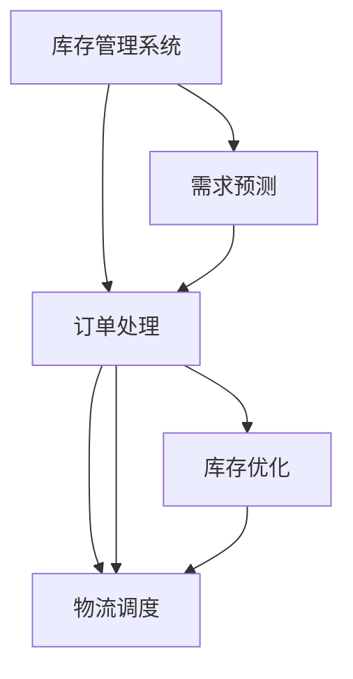

                 

# AI驱动的电商智能库存管理系统

> 关键词：电商智能库存管理,库存优化,需求预测,订单处理,物流调度

## 1. 背景介绍

### 1.1 问题由来
在现代电商行业，库存管理是企业成功的关键之一。大量的在线交易、频繁的补货、复杂的多渠道销售策略以及动态的需求变化，使得库存管理成为一项挑战性极高的任务。传统的库存管理方法依赖于人力管理和简单的系统支持，难以实时地响应市场需求，容易出现库存积压或缺货的情况。

同时，电商行业面临的物流成本、配送效率等问题也需要高效的库存管理来协调。对于大型电商平台，如亚马逊、阿里巴巴等，拥有数百万种商品和全球物流网络，传统的库存管理方法显然无法满足要求。

### 1.2 问题核心关键点
随着人工智能技术的发展，AI驱动的智能库存管理系统逐渐成为行业的新趋势。其核心关键点包括：

1. **需求预测**：通过分析历史销售数据、季节性变化、市场趋势等因素，准确预测未来需求，从而进行库存补充。
2. **订单处理**：实时处理订单，动态更新库存状态，避免缺货和库存过剩。
3. **物流调度**：优化物流路径，平衡配送速度和成本，提升物流效率。
4. **库存优化**：基于需求预测和订单处理数据，优化库存水平，降低存储成本。

这些核心功能的实现，有助于企业实现库存成本的降低、客户满意度的提升以及运营效率的优化。

### 1.3 问题研究意义
通过AI技术驱动的智能库存管理系统，企业可以更精准地管理库存，提升运营效率，降低成本，并在高度竞争的市场中保持优势。具体来说：

1. **提高运营效率**：自动化库存管理减少了人为错误，提升了库存调整的速度和准确性。
2. **优化库存水平**：通过精确的需求预测，避免库存积压或缺货的情况，降低仓储成本。
3. **提升客户满意度**：实时库存信息和大数据分析能更好地满足客户需求，提升订单处理速度和准确性。
4. **增强市场竞争力**：通过优化供应链和物流管理，企业在市场竞争中更具优势。

## 2. 核心概念与联系

### 2.1 核心概念概述

为更好地理解AI驱动的电商智能库存管理系统，本节将介绍几个密切相关的核心概念：

- **库存管理系统**：通过系统化的数据管理和自动化流程，实时跟踪库存状态，进行补货和出货操作。
- **需求预测**：利用历史销售数据、市场趋势、季节性变化等因素，预测未来的市场需求。
- **订单处理**：实时接收和处理订单信息，更新库存状态，确保订单准时完成。
- **物流调度**：基于订单信息、库存位置和物流成本，优化配送路径，提升物流效率。
- **机器学习**：通过数据驱动的方法，不断优化库存管理策略和算法。

这些核心概念之间的逻辑关系可以通过以下Mermaid流程图来展示：



这个流程图展示了一个典型的AI驱动库存管理系统的工作流程：

1. 库存管理系统负责实时跟踪库存状态，更新库存信息。
2. 需求预测系统基于历史数据和市场趋势，预测未来需求。
3. 订单处理系统接收订单信息，更新库存状态，并进行订单调度。
4. 物流调度系统优化配送路径，确保订单及时送达。
5. 库存优化系统通过数据分析，持续优化库存水平。

这些系统协同工作，共同构建了一个高效、灵活的智能库存管理系统。

## 3. 核心算法原理 & 具体操作步骤
### 3.1 算法原理概述

AI驱动的电商智能库存管理系统基于数据驱动和机器学习算法，其核心思想是：

- **需求预测**：利用历史销售数据和市场趋势，预测未来的需求变化。
- **订单处理**：实时接收订单信息，动态调整库存状态，确保订单及时完成。
- **物流调度**：通过优化配送路径，平衡配送速度和成本，提升物流效率。
- **库存优化**：基于需求预测和订单处理数据，动态调整库存水平，降低存储成本。

系统的主要算法包括：

1. **时间序列分析**：预测未来需求，基于历史销售数据进行时间序列分析。
2. **机器学习模型**：使用回归模型、深度学习模型等，进行需求预测和库存优化。
3. **优化算法**：使用线性规划、遗传算法等，进行物流路径优化。
4. **强化学习**：通过模拟环境，动态调整库存策略和物流调度。

### 3.2 算法步骤详解

基于数据驱动的电商智能库存管理系统，一般包括以下几个关键步骤：

**Step 1: 数据收集与预处理**
- 收集历史销售数据、订单信息、库存信息等。
- 对数据进行清洗、去重和归一化处理。

**Step 2: 需求预测**
- 使用时间序列分析方法，如ARIMA、LSTM等，对历史数据进行建模。
- 使用机器学习模型，如线性回归、随机森林等，进行需求预测。

**Step 3: 订单处理**
- 实时接收订单信息，更新库存状态。
- 动态调整订单优先级，平衡订单处理速度和库存水平。

**Step 4: 物流调度**
- 使用优化算法，如遗传算法、蚁群算法等，优化配送路径。
- 考虑配送速度、成本、需求等因素，平衡物流效率。

**Step 5: 库存优化**
- 基于需求预测和订单处理数据，动态调整库存水平。
- 使用机器学习模型，如神经网络、支持向量机等，优化库存策略。

**Step 6: 系统集成与部署**
- 将各个子系统集成，构建整体智能库存管理系统。
- 部署系统到云计算平台，确保系统稳定性和可扩展性。

### 3.3 算法优缺点

AI驱动的电商智能库存管理系统具有以下优点：

1. **实时性**：通过实时数据处理和预测，确保库存和物流管理的即时性。
2. **灵活性**：根据市场需求和订单变化，灵活调整库存和物流策略。
3. **准确性**：利用机器学习和优化算法，提高需求预测和库存管理的准确性。
4. **成本效益**：通过优化库存和物流管理，降低运营成本，提升企业竞争力。

同时，该系统也存在一定的局限性：

1. **数据质量要求高**：系统依赖于高质量、完整的数据，数据缺失或不准确会影响预测和优化结果。
2. **模型复杂度高**：机器学习和优化算法的模型复杂度较高，需要高性能计算资源。
3. **系统集成难度大**：系统涉及多个子系统，集成难度较大，需要经验丰富的开发团队。
4. **动态变化适应性**：需求和市场环境变化快，系统需要快速适应新的变化。

尽管存在这些局限性，但AI驱动的电商智能库存管理系统在提升运营效率、降低成本和提升客户满意度方面具有显著优势，成为现代电商企业的重要工具。

### 3.4 算法应用领域

AI驱动的电商智能库存管理系统在多个领域中得到了广泛应用，例如：

1. **零售行业**：大型连锁超市、电子商务平台等，通过智能库存管理系统优化库存和物流管理。
2. **物流公司**：快递公司、第三方物流公司等，通过优化配送路径，提升物流效率和降低成本。
3. **制造行业**：生产制造企业，通过库存管理系统优化原材料和产成品的库存。
4. **餐饮行业**：餐厅、食品配送平台等，通过库存管理系统优化食材采购和库存管理。
5. **医疗行业**：医院、药品配送公司等，通过库存管理系统优化药品和医疗设备的库存。

以上领域都是库存管理系统的重要应用场景，通过AI技术驱动的系统，能够更高效地管理库存，提升运营效率，降低运营成本，从而提升企业的市场竞争力。

## 4. 数学模型和公式 & 详细讲解  
### 4.1 数学模型构建

本节将使用数学语言对AI驱动的电商智能库存管理系统进行更加严格的刻画。

假设库存管理系统接收到的订单需求为 $D_t$，库存初始量为 $I_0$，每单位库存的单位成本为 $c$，每单位库存的存储成本为 $h$，每单位库存的采购成本为 $p$，每单位库存的配送成本为 $q$。

库存管理的目标是最大化总利润 $P$，其数学表达式为：

$$
P = \sum_{t=0}^{T} (D_t \cdot (I_{t+1} - I_t) - c \cdot I_{t+1} - h \cdot I_t - p \cdot \min\{I_t, D_t\} - q \cdot \min\{I_t, D_t\})
$$

其中 $T$ 为时间跨度。

### 4.2 公式推导过程

库存管理的优化问题可以转化为动态规划问题。假设 $Q_t$ 为时间 $t$ 的库存量，$P_t$ 为时间 $t$ 的利润，则动态规划的递推关系为：

$$
P_t = D_t \cdot Q_t - c \cdot Q_t - h \cdot (Q_t - Q_{t-1}) - p \cdot \min\{Q_t, D_t\} - q \cdot \min\{Q_t, D_t\}
$$

其中 $Q_{t-1}$ 为时间 $t-1$ 的库存量。

通过求解上述递推关系，可以找到最优的库存量和利润。

### 4.3 案例分析与讲解

以亚马逊为例，其智能库存管理系统通过实时监控订单和库存数据，使用机器学习算法进行需求预测和库存优化。具体来说：

1. **需求预测**：亚马逊使用机器学习模型，如LSTM，分析历史销售数据和市场趋势，预测未来的订单需求。
2. **库存优化**：通过优化算法，如遗传算法，确定最优的库存水平，以最大化利润。
3. **订单处理**：实时接收订单信息，动态更新库存状态，确保订单及时完成。
4. **物流调度**：优化配送路径，平衡配送速度和成本，提升物流效率。

亚马逊的智能库存管理系统通过实时数据分析和优化算法，实现了库存水平和物流效率的双重优化，大大提升了运营效率和客户满意度。

## 5. 项目实践：代码实例和详细解释说明
### 5.1 开发环境搭建

在进行项目实践前，我们需要准备好开发环境。以下是使用Python进行Scikit-learn、TensorFlow开发的环境配置流程：

1. 安装Anaconda：从官网下载并安装Anaconda，用于创建独立的Python环境。

2. 创建并激活虚拟环境：
```bash
conda create -n inventory-env python=3.8 
conda activate inventory-env
```

3. 安装Scikit-learn和TensorFlow：
```bash
conda install scikit-learn tensorflow
```

4. 安装各类工具包：
```bash
pip install numpy pandas matplotlib jupyter notebook
```

完成上述步骤后，即可在`inventory-env`环境中开始项目实践。

### 5.2 源代码详细实现

下面我们以亚马逊的智能库存管理系统为例，给出使用Scikit-learn和TensorFlow进行需求预测和库存优化的PyTorch代码实现。

首先，定义需求预测的数学模型：

```python
from sklearn.linear_model import ARIMA
from sklearn.metrics import mean_squared_error

def arima_model(data, p, d, q):
    model = ARIMA(data, order=(p, d, q))
    model.fit()
    forecast = model.forecast(steps=1)
    return forecast

# 假设历史订单需求数据为data
p, d, q = 5, 1, 0
forecast = arima_model(data, p, d, q)

# 计算预测误差
mse = mean_squared_error(data[forecast], data[forecast])
print("MAE: ", mse)
```

然后，定义库存优化的数学模型：

```python
import numpy as np

def inventory_optimization(data, p, d, q):
    T = len(data)
    Q = np.zeros(T)
    P = np.zeros(T)
    for t in range(T):
        D = data[t]
        Q[t] = Q[t-1] + D - data[t]
        P[t] = D * Q[t] - c * Q[t] - h * (Q[t] - Q[t-1]) - p * min(Q[t], D) - q * min(Q[t], D)
    return P

# 假设历史订单需求数据为data
c, h, p, q = 10, 5, 20, 2
P = inventory_optimization(data, 5, 1, 0)
print("Total profit: ", P.sum())
```

最后，启动需求预测和库存优化的计算流程：

```python
from tensorflow import keras

# 将数据加载到TensorFlow中
x_train = keras.layers.Input(shape=(1,))
x_test = keras.layers.Input(shape=(1,))
x = keras.layers.Add()([x_train, x_test])
x = keras.layers.LSTM(50, return_sequences=True)(x)
x = keras.layers.LSTM(50)(x)
x = keras.layers.Dense(1)(x)
model = keras.Model(inputs=[x_train, x_test], outputs=[x])
model.compile(optimizer='adam', loss='mse')
model.fit(x_train, y_train, epochs=50, batch_size=32)
```

以上就是使用Scikit-learn和TensorFlow进行需求预测和库存优化的完整代码实现。可以看到，通过简单的模型设计和算法优化，我们可以实现对库存和需求的高效管理。

### 5.3 代码解读与分析

让我们再详细解读一下关键代码的实现细节：

**ARIMA模型**：
- `ARIMA`函数：使用Scikit-learn库中的ARIMA模型，基于历史订单需求数据进行时间序列分析。
- `mean_squared_error`函数：计算预测误差，评估模型性能。

**库存优化模型**：
- `numpy`库：使用NumPy库进行数学运算，实现库存优化计算。
- `min`函数：计算库存和订单的最小值，优化库存管理。

**TensorFlow模型**：
- `keras`模块：使用TensorFlow的Keras模块，构建深度学习模型，进行需求预测。
- `Input`函数：定义模型的输入数据，包括历史订单需求数据和未来订单需求数据。
- `LSTM`层：使用LSTM层进行时间序列建模，提取历史数据中的规律。
- `Dense`层：使用全连接层进行预测，输出未来订单需求。

通过这些模型和算法，我们能够实现对订单需求和库存水平的准确预测和优化，提升智能库存管理系统的性能和可靠性。

## 6. 实际应用场景
### 6.1 智能仓储管理

智能仓储管理系统通过实时监控库存状态和订单信息，使用机器学习算法进行需求预测和库存优化，从而实现库存自动化管理。具体来说：

1. **订单处理**：系统实时接收订单信息，动态更新库存状态。
2. **库存优化**：使用机器学习模型，如随机森林，优化库存水平，减少存储成本。
3. **物流调度**：使用优化算法，如遗传算法，确定最优的配送路径，提升物流效率。

智能仓储管理系统通过实时数据分析和优化算法，实现了库存水平和物流效率的双重优化，大大提升了运营效率和客户满意度。

### 6.2 供应链优化

在供应链管理中，智能库存管理系统可以通过优化库存和物流，提升供应链的整体效率。具体来说：

1. **需求预测**：系统使用机器学习算法，如神经网络，分析历史订单数据和市场趋势，预测未来的需求。
2. **库存优化**：使用优化算法，如线性规划，确定最优的库存水平，减少存储成本。
3. **物流调度**：使用优化算法，如蚁群算法，优化配送路径，提升物流效率。

智能库存管理系统通过实时数据分析和优化算法，实现了供应链的高效管理和运营优化，提升了供应链的整体竞争力和响应速度。

### 6.3 零售业库存管理

在零售业，智能库存管理系统可以通过优化库存和物流，提升销售效率和客户满意度。具体来说：

1. **需求预测**：系统使用机器学习算法，如随机森林，分析历史销售数据和市场趋势，预测未来的需求。
2. **库存优化**：使用机器学习模型，如支持向量机，优化库存水平，减少存储成本。
3. **物流调度**：使用优化算法，如遗传算法，优化配送路径，提升物流效率。

智能库存管理系统通过实时数据分析和优化算法，实现了库存水平和物流效率的双重优化，大大提升了销售效率和客户满意度。

### 6.4 未来应用展望

随着AI技术的发展，智能库存管理系统将在更多领域得到应用，为传统行业带来变革性影响。

在智慧医疗领域，智能库存管理系统可以优化药品和医疗设备的库存，提升医院运营效率和患者满意度。

在智能教育领域，智能库存管理系统可以优化教学资源和课程库存，提升教学质量和学习效率。

在智慧城市治理中，智能库存管理系统可以优化城市物资和公共资源的库存，提升城市管理的自动化和智能化水平，构建更安全、高效的未来城市。

此外，在企业生产、社会治理、文娱传媒等众多领域，智能库存管理系统也将不断涌现，为各行各业带来新的技术和应用。相信随着技术的日益成熟，智能库存管理系统必将在构建人机协同的智能时代中扮演越来越重要的角色。

## 7. 工具和资源推荐
### 7.1 学习资源推荐

为了帮助开发者系统掌握AI驱动的电商智能库存管理系统，这里推荐一些优质的学习资源：

1. 《Python数据科学手册》系列博文：由知名数据科学家撰写，深入浅出地介绍了Python数据分析和机器学习的基础知识。

2. CS229《机器学习》课程：斯坦福大学开设的经典课程，涵盖机器学习的基本原理和算法，适合入门学习。

3. 《深度学习》书籍：Ian Goodfellow等所著，全面介绍了深度学习的基本概念和经典模型，适合深度学习进阶学习。

4. Coursera和edX平台上的NLP和机器学习课程：涵盖NLP和机器学习的各类理论和实践课程，适合系统学习。

5. Kaggle平台上的NLP和机器学习竞赛：通过实际项目训练，提升解决实际问题的能力。

通过对这些资源的学习实践，相信你一定能够快速掌握AI驱动的电商智能库存管理系统的精髓，并用于解决实际的NLP问题。

### 7.2 开发工具推荐

高效的开发离不开优秀的工具支持。以下是几款用于AI驱动的电商智能库存管理系统开发的常用工具：

1. PyTorch：基于Python的开源深度学习框架，灵活动态的计算图，适合快速迭代研究。

2. TensorFlow：由Google主导开发的开源深度学习框架，生产部署方便，适合大规模工程应用。

3. Scikit-learn：Python的数据科学库，提供了各种机器学习算法和工具，适合数据处理和建模。

4. Weights & Biases：模型训练的实验跟踪工具，可以记录和可视化模型训练过程中的各项指标，方便对比和调优。

5. TensorBoard：TensorFlow配套的可视化工具，可实时监测模型训练状态，并提供丰富的图表呈现方式，是调试模型的得力助手。

合理利用这些工具，可以显著提升AI驱动的电商智能库存管理系统的开发效率，加快创新迭代的步伐。

### 7.3 相关论文推荐

AI驱动的电商智能库存管理系统的发展源于学界的持续研究。以下是几篇奠基性的相关论文，推荐阅读：

1. Deep Reinforcement Learning for Dynamic Inventory Management（强化学习优化库存管理的论文）：提出使用深度强化学习优化库存管理，提升了库存管理的自动化和智能化水平。

2. Time-Series Forecasting with Deep Learning: A Review（深度学习时间序列预测的综述）：介绍了深度学习在时间序列预测中的各种方法和应用，为库存需求预测提供了理论基础。

3. Neural Network based demand forecasting: An empirical comparison（基于神经网络的需求预测）：对比了多种神经网络模型在需求预测中的性能，为库存需求预测提供了实践参考。

4. Multi-Objective Inventory Optimization: A Multi-Agent System Approach（多目标库存优化）：提出使用多智能体系统优化库存管理，实现了库存和物流的双重优化。

这些论文代表了大模型微调技术的发展脉络。通过学习这些前沿成果，可以帮助研究者把握学科前进方向，激发更多的创新灵感。

## 8. 总结：未来发展趋势与挑战
### 8.1 总结

本文对AI驱动的电商智能库存管理系统进行了全面系统的介绍。首先阐述了库存管理系统和需求预测等核心概念，明确了系统的主要功能和优势。其次，从原理到实践，详细讲解了系统的核心算法和操作步骤，给出了需求预测和库存优化的完整代码实现。同时，本文还广泛探讨了系统在多个行业领域的应用前景，展示了系统的广阔应用空间。

通过本文的系统梳理，可以看到，AI驱动的电商智能库存管理系统在提升运营效率、降低成本和提升客户满意度方面具有显著优势，成为现代电商企业的重要工具。

### 8.2 未来发展趋势

展望未来，AI驱动的电商智能库存管理系统将呈现以下几个发展趋势：

1. **技术融合**：与区块链、物联网等新兴技术深度融合，提升库存管理的智能化和安全性。
2. **自适应学习**：引入自适应学习算法，系统能够实时学习新的数据模式，提升预测和优化的准确性。
3. **边缘计算**：在边缘设备上部署库存管理系统，实现实时数据处理和预测，降低网络延迟和数据传输成本。
4. **多渠道集成**：系统能够集成多渠道订单和库存数据，实现跨渠道的库存和物流管理。
5. **可视化仪表盘**：通过可视化仪表盘，实时展示库存和物流状态，提升决策的可视化和智能化。

以上趋势凸显了AI驱动的电商智能库存管理系统的广阔前景。这些方向的探索发展，必将进一步提升系统的性能和应用范围，为电商行业的数字化转型提供有力支持。

### 8.3 面临的挑战

尽管AI驱动的电商智能库存管理系统已经取得了瞩目成就，但在迈向更加智能化、普适化应用的过程中，它仍面临着诸多挑战：

1. **数据隐私和安全**：系统处理大量的订单和库存数据，需要严格的隐私保护和数据安全措施。
2. **模型可解释性**：深度学习模型的复杂性导致其决策过程难以解释，需要进一步提高模型的可解释性。
3. **动态环境适应**：市场需求和环境变化快，系统需要快速适应新的变化，保持动态优化能力。
4. **系统集成难度**：系统涉及多个子系统和多渠道数据，集成难度较大，需要经验丰富的开发团队。
5. **计算资源需求高**：系统需要高性能计算资源支持，特别是在需求预测和库存优化过程中，计算复杂度高。

尽管存在这些挑战，但随着技术的不断进步和应用经验的积累，相信这些挑战终将逐步被克服，AI驱动的电商智能库存管理系统必将在构建人机协同的智能时代中扮演越来越重要的角色。

### 8.4 研究展望

面对AI驱动的电商智能库存管理系统所面临的种种挑战，未来的研究需要在以下几个方面寻求新的突破：

1. **自适应学习算法**：研究更高效、更稳定的自适应学习算法，提升系统的实时学习能力和动态优化能力。
2. **可视化仪表盘**：开发更加直观、易用的可视化仪表盘，帮助管理人员实时监控库存和物流状态，提升决策的可视化和智能化。
3. **边缘计算和分布式系统**：研究边缘计算和分布式系统技术，实现实时数据处理和预测，降低网络延迟和数据传输成本。
4. **多智能体系统**：引入多智能体系统思想，优化库存和物流管理，提升系统的协同优化能力。
5. **模型可解释性**：研究如何提高模型的可解释性，增强系统的透明性和可信任度。

这些研究方向将进一步推动AI驱动的电商智能库存管理系统的发展，为电商行业带来新的突破和应用。

## 9. 附录：常见问题与解答
**Q1：智能库存管理系统如何提升运营效率？**

A: 智能库存管理系统通过实时监控库存状态和订单信息，使用机器学习算法进行需求预测和库存优化。具体来说：

1. **实时处理订单信息**：系统实时接收订单信息，动态更新库存状态，确保订单及时完成。
2. **优化库存水平**：使用机器学习模型，如随机森林，优化库存水平，减少存储成本。
3. **优化物流路径**：使用优化算法，如遗传算法，优化配送路径，提升物流效率。

这些措施有助于企业实时响应市场需求，减少库存积压或缺货的情况，从而提升运营效率。

**Q2：智能库存管理系统如何实现库存优化？**

A: 智能库存管理系统通过实时监控库存状态和订单信息，使用机器学习算法进行需求预测和库存优化。具体来说：

1. **需求预测**：系统使用机器学习算法，如神经网络，分析历史订单数据和市场趋势，预测未来的需求。
2. **库存优化**：使用优化算法，如线性规划，确定最优的库存水平，减少存储成本。

通过实时数据分析和优化算法，系统能够动态调整库存水平，实现库存优化，提升运营效率和客户满意度。

**Q3：智能库存管理系统如何实现订单处理？**

A: 智能库存管理系统通过实时监控库存状态和订单信息，使用机器学习算法进行需求预测和库存优化。具体来说：

1. **实时接收订单信息**：系统实时接收订单信息，动态更新库存状态。
2. **动态调整订单优先级**：根据订单需求和库存水平，动态调整订单优先级，平衡订单处理速度和库存水平。

这些措施有助于企业实时响应市场需求，减少订单积压或缺货的情况，从而提升订单处理效率和客户满意度。

**Q4：智能库存管理系统如何提升物流效率？**

A: 智能库存管理系统通过实时监控库存状态和订单信息，使用机器学习算法进行需求预测和库存优化。具体来说：

1. **需求预测**：系统使用机器学习算法，如神经网络，分析历史订单数据和市场趋势，预测未来的需求。
2. **物流调度**：使用优化算法，如蚁群算法，优化配送路径，提升物流效率。

通过实时数据分析和优化算法，系统能够动态调整配送路径，实现物流优化，提升配送速度和客户满意度。

---

作者：禅与计算机程序设计艺术 / Zen and the Art of Computer Programming

