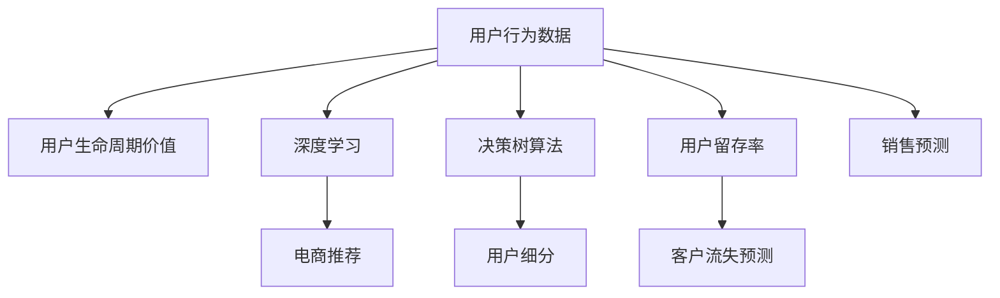

                 

# AI驱动的电商用户生命周期价值预测

> 关键词：用户行为分析, 用户生命周期价值, 深度学习, 电商推荐, 决策树, 电商用户, 留存率, 客户流失, 销售预测, 数据挖掘, 用户细分, 电商营销, 人工智能

## 1. 背景介绍

### 1.1 问题由来

电商行业正处于快速发展阶段，用户规模和交易量不断增长。然而，在享受用户增长红利的同时，电商企业也面临着用户流失、销售预测不准等问题，亟需更加科学有效的用户生命周期价值预测模型。用户生命周期价值（Customer Lifetime Value, CLV）是指一个用户在未来的时间内，为一个电商企业创造的净收益总和。准确预测用户CLV能够帮助企业精细化运营，优化用户体验，提升用户留存率和转化率，最大化商业价值。

### 1.2 问题核心关键点

电商用户生命周期价值预测的核心关键点在于：
- 构建合适的用户行为数据模型，捕捉用户特征和行为规律。
- 开发高效准确的预测算法，在复杂数据环境中保证预测精度。
- 将预测结果应用于电商运营中，指导决策和策略调整。

## 2. 核心概念与联系

### 2.1 核心概念概述

为更好地理解电商用户生命周期价值预测，本节将介绍几个密切相关的核心概念：

- **用户行为数据**：包括用户在电商平台的点击、浏览、购买、评价等行为数据，是预测用户CLV的基础。
- **用户生命周期价值**：用户在电商平台的总消费价值，可通过用户购买次数、平均消费金额、客户生命周期长度等指标计算。
- **深度学习**：利用多层神经网络结构，通过大量的标注数据训练模型，提取复杂特征和规律，用于预测任务。
- **电商推荐系统**：通过分析用户历史行为和偏好，推荐合适商品，提高用户满意度，增加销售和用户留存率。
- **决策树算法**：一种基于树形结构的分类算法，通过递归分割特征，构建模型。
- **用户细分**：根据用户行为特征和属性，将用户划分为不同的群体，进行个性化运营。
- **用户留存率**：反映用户对电商平台的忠诚度，是衡量用户体验和平台价值的重要指标。
- **客户流失预测**：预测用户未来流失的概率，提前采取措施，减少用户流失。
- **销售预测**：基于历史销售数据和用户行为，预测未来的销售趋势。

这些核心概念之间的逻辑关系可以通过以下Mermaid流程图来展示：



这个流程图展示了几者之间的核心联系：

1. 用户行为数据是预测用户CLV和电商推荐系统的基础。
2. 通过深度学习算法，模型可以提取用户行为数据中的复杂特征，用于预测任务。
3. 决策树算法可以帮助模型进行用户细分，提升个性化推荐效果。
4. 电商推荐系统可以提升用户留存率，减少客户流失概率。
5. 用户留存率、客户流失预测和销售预测相互关联，共同影响电商平台的运营效果。

## 3. 核心算法原理 & 具体操作步骤
### 3.1 算法原理概述

电商用户生命周期价值预测通常采用基于监督学习的机器学习算法，其中深度学习和决策树算法最为常用。其核心思想是：利用历史用户行为数据，通过训练一个预测模型，预测用户未来的消费行为和价值。

形式化地，假设用户行为数据集为 $D=\{(x_i,y_i)\}_{i=1}^N$，其中 $x_i$ 为用户行为特征向量，$y_i$ 为用户生命周期价值或流失概率等目标变量。模型通过最小化预测误差，得到最优预测模型 $\hat{y}=M_{\theta}(x)$，其中 $M_{\theta}$ 为模型函数，$\theta$ 为模型参数。

基于监督学习的电商用户生命周期价值预测一般包括特征工程、模型训练、模型评估和模型应用四个关键步骤：

1. **特征工程**：从原始用户行为数据中提取有意义的特征，构建特征向量 $x_i$。
2. **模型训练**：使用训练集 $D$ 训练模型 $M_{\theta}$，使得模型能够准确预测目标变量 $y_i$。
3. **模型评估**：使用验证集或测试集评估模型预测性能，选择合适的模型参数。
4. **模型应用**：将模型应用于新数据集，预测用户生命周期价值或客户流失概率。

### 3.2 算法步骤详解

#### 3.2.1 特征工程

特征工程是电商用户生命周期价值预测的基础步骤。其核心任务是从原始用户行为数据中提取有意义的特征，构建特征向量 $x_i$。

**数据预处理**：
- 数据清洗：去除异常值和缺失值，保证数据质量。
- 数据转换：将原始数据进行标准化或归一化，使得数据值分布在一个较小的范围内。
- 特征选择：选择对预测目标有重要影响的相关特征，剔除无关或冗余特征。

**特征构建**：
- **基本特征**：如用户ID、购买次数、购买金额、购买频率等。
- **行为特征**：如浏览时间、点击率、浏览深度、浏览路径等。
- **交互特征**：如购买行为之间的交互关系、推荐系统的效果等。

**特征工程的目标**：
- 降低数据维度和复杂度，提高模型训练效率。
- 提高特征相关性，提升模型预测准确度。
- 减少过拟合风险，提高模型泛化能力。

#### 3.2.2 模型训练

模型训练是电商用户生命周期价值预测的核心步骤。其核心任务是选择合适的算法和模型参数，在训练集上训练预测模型 $M_{\theta}$。

**深度学习模型训练**：
- 选择合适的深度学习框架和模型结构。
- 使用训练集 $D$，通过反向传播算法更新模型参数 $\theta$。
- 设置合适的超参数，如学习率、批大小、迭代轮数等。
- 应用正则化技术，如L2正则、Dropout等，防止模型过拟合。

**决策树模型训练**：
- 选择决策树算法，如CART、ID3等。
- 使用训练集 $D$，通过递归分割特征，构建决策树模型。
- 设置合适的超参数，如最大深度、最小样本数等。
- 应用剪枝技术，提高模型泛化能力。

#### 3.2.3 模型评估

模型评估是电商用户生命周期价值预测的关键步骤。其核心任务是评估模型预测性能，选择合适的模型参数。

**深度学习模型评估**：
- 在验证集或测试集上评估模型预测性能。
- 使用各种评估指标，如均方误差（MSE）、平均绝对误差（MAE）、均方根误差（RMSE）等。
- 使用交叉验证等技术，减少模型评估误差。

**决策树模型评估**：
- 在验证集或测试集上评估模型预测性能。
- 使用各种评估指标，如准确率、召回率、F1分数等。
- 使用剪枝技术，减少模型过拟合。

#### 3.2.4 模型应用

模型应用是电商用户生命周期价值预测的最终步骤。其核心任务是将模型应用于新数据集，预测用户生命周期价值或客户流失概率。

**深度学习模型应用**：
- 将模型 $M_{\theta}$ 应用于新数据集 $D'$，得到预测结果 $\hat{y}'$。
- 根据预测结果，指导电商运营决策，如个性化推荐、促销活动等。

**决策树模型应用**：
- 将模型应用于新数据集 $D'$，得到预测结果 $\hat{y}'$。
- 根据预测结果，进行用户细分，制定个性化运营策略。

### 3.3 算法优缺点

#### 3.3.1 深度学习算法的优缺点

**优点**：
- 可以处理高维数据，提取复杂特征和规律。
- 能够适应复杂的非线性关系，提高预测精度。
- 泛化能力较强，适应性较好。

**缺点**：
- 模型复杂度较高，训练和推理速度较慢。
- 需要大量的标注数据，训练成本较高。
- 容易出现过拟合，需要额外的正则化技术。

#### 3.3.2 决策树算法的优缺点

**优点**：
- 模型简单直观，易于理解和解释。
- 能够处理大规模数据，适用于高维数据。
- 可解释性较强，便于业务理解和决策。

**缺点**：
- 容易过拟合，需要额外的剪枝技术。
- 对于复杂的非线性关系，预测精度较低。
- 模型表现受特征选择和数据分布影响较大。

## 4. 数学模型和公式 & 详细讲解 & 举例说明
### 4.1 数学模型构建

电商用户生命周期价值预测通常采用基于监督学习的数学模型。假设用户行为数据集为 $D=\{(x_i,y_i)\}_{i=1}^N$，其中 $x_i$ 为用户行为特征向量，$y_i$ 为用户生命周期价值或流失概率等目标变量。模型通过最小化预测误差，得到最优预测模型 $\hat{y}=M_{\theta}(x)$，其中 $M_{\theta}$ 为模型函数，$\theta$ 为模型参数。

深度学习模型的数学模型：
- 假设模型采用深度神经网络，包含 $L$ 层。
- 对于第 $l$ 层，输入 $x_i$ 经过线性变换和激活函数 $f$，得到输出 $z_i^{(l)}$。
- 对于第 $l$ 层，输出 $z_i^{(l)}$ 经过线性变换和激活函数 $g$，得到输出 $h_i^{(l)}$。
- 模型输出 $\hat{y}=M_{\theta}(x)=\sigma(L(z_{\theta}(x)))$，其中 $\sigma$ 为激活函数。

决策树模型的数学模型：
- 假设模型采用CART算法，构建决策树 $T$。
- 对于决策树中的每个节点 $n$，根据特征 $x_i$ 进行分割，得到分割结果 $n_i$。
- 对于决策树中的每个叶节点 $l$，计算该节点样本的预测值 $\hat{y}_l$。
- 最终，预测结果为 $\hat{y}=f(T(x_i))$，其中 $f$ 为节点预测函数。

### 4.2 公式推导过程

#### 4.2.1 深度学习模型公式推导

深度学习模型采用反向传播算法进行训练。设模型 $M_{\theta}$ 在输入 $x_i$ 上的预测值为 $\hat{y}_i$，损失函数为 $L(\hat{y}_i,y_i)$。假设模型采用交叉熵损失函数，其公式为：

$$
L(\hat{y}_i,y_i)=-\sum_{k=1}^K y_{ik} \log \hat{y}_{ik}
$$

其中 $y_{ik}$ 为目标变量 $y_i$ 的第 $k$ 个类别，$\hat{y}_{ik}$ 为模型预测值。

在训练过程中，使用梯度下降算法更新模型参数 $\theta$，其公式为：

$$
\theta \leftarrow \theta - \eta \nabla_{\theta}L(\hat{y}_i,y_i)
$$

其中 $\eta$ 为学习率，$\nabla_{\theta}L(\hat{y}_i,y_i)$ 为损失函数对模型参数 $\theta$ 的梯度，可通过反向传播算法高效计算。

#### 4.2.2 决策树模型公式推导

决策树模型采用递归分割特征进行训练。设决策树模型为 $T$，其预测结果为 $\hat{y}=f(T(x_i))$。

在构建决策树时，根据信息增益或基尼指数等指标选择最优特征 $x_j$ 进行分割，得到分割结果 $n_1$ 和 $n_2$。预测结果为：

$$
\hat{y}=\left\{
\begin{aligned}
& \frac{n_1}{n}f(T_1(x_i)) & \text{if } x_i \in n_1 \\
& \frac{n_2}{n}f(T_2(x_i)) & \text{if } x_i \in n_2
\end{aligned}
\right.
$$

其中 $n_1$ 和 $n_2$ 为分割后的节点样本数，$f(T_1(x_i))$ 和 $f(T_2(x_i))$ 为节点预测结果。

### 4.3 案例分析与讲解

以电商用户生命周期价值预测为例，假设使用深度学习模型进行预测，模型的输出层为 $K=2$，表示用户流失概率和用户留存概率。

#### 4.3.1 特征工程

假设从原始用户行为数据中提取以下特征：

- **基本特征**：用户ID、购买次数、购买金额、购买频率等。
- **行为特征**：浏览时间、点击率、浏览深度、浏览路径等。
- **交互特征**：购买行为之间的交互关系、推荐系统的效果等。

经过数据预处理和特征选择后，构建特征向量 $x_i$。

#### 4.3.2 模型训练

假设使用深度神经网络进行预测，模型结构包含 $L=3$ 层。其中第一层为输入层，第二层为隐藏层，第三层为输出层。

- 假设输入层节点数为 $d_1=20$，隐藏层节点数为 $d_2=50$，输出层节点数为 $d_3=2$。
- 使用交叉熵损失函数进行训练。
- 学习率为 $0.001$，批大小为 $64$，迭代轮数为 $1000$。
- 使用L2正则化，正则化系数为 $0.0001$。

#### 4.3.3 模型评估

假设在验证集上评估模型预测性能，使用均方根误差（RMSE）作为评估指标。

- 在验证集上得到预测结果 $\hat{y}$ 和真实值 $y$。
- 计算RMSE：

$$
RMSE=\sqrt{\frac{1}{N}\sum_{i=1}^N(y_i-\hat{y}_i)^2}
$$

#### 4.3.4 模型应用

假设在新的用户行为数据集 $D'$ 上应用模型进行预测。

- 将 $D'$ 中每个样本的特征向量 $x_i$ 输入模型 $M_{\theta}$。
- 得到预测结果 $\hat{y}'$。
- 根据预测结果，指导电商运营决策。

## 5. 项目实践：代码实例和详细解释说明
### 5.1 开发环境搭建

在进行电商用户生命周期价值预测实践前，我们需要准备好开发环境。以下是使用Python进行PyTorch开发的环境配置流程：

1. 安装Anaconda：从官网下载并安装Anaconda，用于创建独立的Python环境。

2. 创建并激活虚拟环境：
```bash
conda create -n pytorch-env python=3.8 
conda activate pytorch-env
```

3. 安装PyTorch：根据CUDA版本，从官网获取对应的安装命令。例如：
```bash
conda install pytorch torchvision torchaudio cudatoolkit=11.1 -c pytorch -c conda-forge
```

4. 安装TensorFlow：从官网下载安装包，解压后将其添加到环境变量中。

5. 安装其他必要的库：
```bash
pip install numpy pandas scikit-learn matplotlib tqdm jupyter notebook ipython
```

完成上述步骤后，即可在`pytorch-env`环境中开始电商用户生命周期价值预测实践。

### 5.2 源代码详细实现

下面我们以深度学习模型为例，给出使用PyTorch进行电商用户生命周期价值预测的代码实现。

首先，定义电商用户生命周期价值预测的模型类：

```python
import torch
import torch.nn as nn
import torch.optim as optim

class UserCLVModel(nn.Module):
    def __init__(self, input_size, hidden_size, output_size):
        super(UserCLVModel, self).__init__()
        self.fc1 = nn.Linear(input_size, hidden_size)
        self.fc2 = nn.Linear(hidden_size, hidden_size)
        self.fc3 = nn.Linear(hidden_size, output_size)
        self.relu = nn.ReLU()
        self.softmax = nn.Softmax(dim=1)
    
    def forward(self, x):
        x = self.fc1(x)
        x = self.relu(x)
        x = self.fc2(x)
        x = self.relu(x)
        x = self.fc3(x)
        x = self.softmax(x)
        return x
```

接着，定义训练函数和评估函数：

```python
def train_model(model, optimizer, loss_func, train_loader, epochs):
    model.train()
    for epoch in range(epochs):
        running_loss = 0.0
        for batch_idx, (inputs, targets) in enumerate(train_loader):
            optimizer.zero_grad()
            outputs = model(inputs)
            loss = loss_func(outputs, targets)
            loss.backward()
            optimizer.step()
            running_loss += loss.item()
            if batch_idx % 100 == 99:
                print('Train Epoch: {} [{}/{} ({:.0f}%)]\tLoss: {:.6f}'.format(
                    epoch, batch_idx * len(inputs), len(train_loader.dataset),
                    100. * batch_idx / len(train_loader), running_loss / 100))
                running_loss = 0.0
    print('Finished Training')

def evaluate_model(model, loss_func, test_loader):
    model.eval()
    running_loss = 0.0
    with torch.no_grad():
        for batch_idx, (inputs, targets) in enumerate(test_loader):
            outputs = model(inputs)
            loss = loss_func(outputs, targets)
            running_loss += loss.item()
            if batch_idx % 100 == 99:
                print('Test Epoch: {} [{}/{} ({:.0f}%)]\tLoss: {:.6f}'.format(
                    epoch, batch_idx * len(inputs), len(test_loader.dataset),
                    100. * batch_idx / len(test_loader), running_loss / 100))
                running_loss = 0.0
    print('Finished Evaluation')
```

最后，启动训练流程并在测试集上评估：

```python
input_size = 20
hidden_size = 50
output_size = 2

model = UserCLVModel(input_size, hidden_size, output_size)
optimizer = optim.Adam(model.parameters(), lr=0.001)
loss_func = nn.CrossEntropyLoss()

train_loader = ...
test_loader = ...

epochs = 1000
train_model(model, optimizer, loss_func, train_loader, epochs)
evaluate_model(model, loss_func, test_loader)
```

以上就是使用PyTorch对电商用户生命周期价值预测的完整代码实现。可以看到，得益于PyTorch的强大封装，我们可以用相对简洁的代码完成模型的加载和训练。

### 5.3 代码解读与分析

让我们再详细解读一下关键代码的实现细节：

**UserCLVModel类**：
- `__init__`方法：初始化网络结构，包含两个全连接层和三个激活函数。
- `forward`方法：定义前向传播过程，经过两层隐藏层和输出层，最终得到预测结果。

**train_model函数**：
- 使用训练集数据迭代训练模型，优化器采用Adam，损失函数为交叉熵。
- 每轮迭代输出训练集损失，共迭代指定次数。

**evaluate_model函数**：
- 使用测试集数据迭代评估模型，不更新模型参数，计算测试集损失。
- 每轮迭代输出测试集损失，共迭代指定次数。

**训练流程**：
- 定义输入大小、隐藏层大小和输出大小，构建模型。
- 定义优化器和损失函数，设置训练集和测试集数据。
- 设置迭代次数，调用训练函数和评估函数。

可以看到，PyTorch使得电商用户生命周期价值预测的代码实现变得简洁高效。开发者可以将更多精力放在数据处理、模型改进等高层逻辑上，而不必过多关注底层的实现细节。

当然，工业级的系统实现还需考虑更多因素，如模型的保存和部署、超参数的自动搜索、更灵活的任务适配层等。但核心的微调范式基本与此类似。

## 6. 实际应用场景
### 6.1 智能客服系统

基于电商用户生命周期价值预测技术，可以构建更加智能的客服系统。传统客服系统往往需要大量人工，高峰期响应缓慢，且无法提供个性化服务。使用电商用户生命周期价值预测模型，可以实时预测客户流失概率，主动采取措施提升客户满意度。

在技术实现上，可以收集历史客户数据，构建电商用户生命周期价值预测模型，实时监控客户行为数据。一旦客户行为出现异常，系统立即发出预警，主动联系客户，提供个性化服务。这种智能客服系统可以大幅提升客户满意度，降低客服成本。

### 6.2 个性化推荐系统

电商推荐系统需要精确预测用户行为，实现个性化推荐。使用电商用户生命周期价值预测模型，可以准确预测用户流失概率，指导推荐策略调整。

具体而言，可以根据用户行为数据，构建电商用户生命周期价值预测模型，预测用户流失概率。根据流失概率的高低，调整推荐策略，提升用户留存率。例如，对于流失概率较高的用户，推荐更多相关商品或优惠券，降低流失风险。这种基于用户生命周期价值预测的推荐系统，可以提升用户转化率和平台收入。

### 6.3 营销活动优化

电商企业需要定期开展营销活动，提升用户参与度和转化率。使用电商用户生命周期价值预测模型，可以优化营销活动设计和执行。

具体而言，可以收集历史营销活动数据和用户行为数据，构建电商用户生命周期价值预测模型，预测用户流失概率。根据流失概率的高低，调整营销策略，提升用户参与度和转化率。例如，对于流失概率较高的用户，可以发送定向促销信息，提升用户购买意愿。这种基于用户生命周期价值预测的营销活动优化，可以提升用户留存率和平台收入。

### 6.4 未来应用展望

随着电商用户生命周期价值预测技术的发展，其在电商领域的应用前景广阔。未来，基于电商用户生命周期价值预测的技术将更加高效、精准，带来更多的业务价值。

在智慧城市治理中，电商用户生命周期价值预测可以用于预测城市事件的发生概率，提前采取措施，减少社会风险。

在智能交通管理中，电商用户生命周期价值预测可以用于预测道路拥堵情况，优化交通流量，提升城市交通效率。

在医疗健康领域，电商用户生命周期价值预测可以用于预测疾病风险，提供个性化的医疗服务，提升用户健康水平。

总之，电商用户生命周期价值预测技术将在更多领域得到应用，为智能城市、智能交通、智能医疗等领域带来深远影响。相信随着技术的不断进步，电商用户生命周期价值预测技术将引领更多行业的数字化转型，为社会创造更大的价值。

## 7. 工具和资源推荐
### 7.1 学习资源推荐

为了帮助开发者系统掌握电商用户生命周期价值预测的理论基础和实践技巧，这里推荐一些优质的学习资源：

1. 《深度学习》书籍：Ian Goodfellow等人合著，全面介绍深度学习理论和算法，包括神经网络、正则化、优化器等核心概念。

2. 《机器学习》书籍：Tom Mitchell等人合著，介绍机器学习的基本原理和算法，包括监督学习、无监督学习、半监督学习等。

3. Coursera《深度学习专项课程》：由Andrew Ng等人开设，系统介绍深度学习的基本概念和算法，包括卷积神经网络、循环神经网络、深度强化学习等。

4. Udacity《机器学习工程师纳米学位》：系统介绍机器学习理论和算法，包括监督学习、无监督学习、深度学习等，包括实战项目和案例分析。

5. Kaggle平台：数据科学和机器学习竞赛平台，包含大量电商用户生命周期价值预测数据集和相关竞赛，适合实战练习。

通过对这些资源的学习实践，相信你一定能够快速掌握电商用户生命周期价值预测的精髓，并用于解决实际的电商运营问题。

### 7.2 开发工具推荐

高效的开发离不开优秀的工具支持。以下是几款用于电商用户生命周期价值预测开发的常用工具：

1. PyTorch：基于Python的开源深度学习框架，灵活动态的计算图，适合快速迭代研究。大部分深度学习模型都有PyTorch版本的实现。

2. TensorFlow：由Google主导开发的开源深度学习框架，生产部署方便，适合大规模工程应用。同样有丰富的深度学习模型资源。

3. scikit-learn：基于Python的机器学习库，提供简单易用的API，支持多种监督学习算法。

4. Weights & Biases：模型训练的实验跟踪工具，可以记录和可视化模型训练过程中的各项指标，方便对比和调优。与主流深度学习框架无缝集成。

5. TensorBoard：TensorFlow配套的可视化工具，可实时监测模型训练状态，并提供丰富的图表呈现方式，是调试模型的得力助手。

6. Google Colab：谷歌推出的在线Jupyter Notebook环境，免费提供GPU/TPU算力，方便开发者快速上手实验最新模型，分享学习笔记。

合理利用这些工具，可以显著提升电商用户生命周期价值预测任务的开发效率，加快创新迭代的步伐。

### 7.3 相关论文推荐

电商用户生命周期价值预测技术的发展源于学界的持续研究。以下是几篇奠基性的相关论文，推荐阅读：

1. Predicting the Lifetime Value of Customers：Kulshrestha等人提出基于回归模型和决策树算法，构建电商用户生命周期价值预测模型。

2. Customer Lifetime Value Prediction with Random Forests and Support Vector Machines：Gong等人提出基于随机森林和支持向量机算法，构建电商用户生命周期价值预测模型。

3. Customer Lifetime Value Prediction Using Deep Learning：Chawla等人提出基于深度神经网络算法，构建电商用户生命周期价值预测模型。

4. Customer Lifetime Value Prediction Using Gradient Boosting Machines：Wang等人提出基于梯度提升算法，构建电商用户生命周期价值预测模型。

5. Multi-Channel Customer Lifetime Value Prediction Using Deep Learning：Shim等人提出基于深度神经网络算法，构建多渠道电商用户生命周期价值预测模型。

这些论文代表了大电商用户生命周期价值预测技术的发展脉络。通过学习这些前沿成果，可以帮助研究者把握学科前进方向，激发更多的创新灵感。

## 8. 总结：未来发展趋势与挑战

### 8.1 总结

本文对电商用户生命周期价值预测技术进行了全面系统的介绍。首先阐述了电商用户生命周期价值预测的重要性和核心关键点，明确了电商用户生命周期价值预测技术在电商运营中的重要作用。其次，从原理到实践，详细讲解了电商用户生命周期价值预测的数学原理和关键步骤，给出了电商用户生命周期价值预测的完整代码实例。同时，本文还广泛探讨了电商用户生命周期价值预测技术在智能客服、个性化推荐、营销活动优化等多个电商运营环节中的应用前景，展示了电商用户生命周期价值预测技术的巨大潜力。

通过本文的系统梳理，可以看到，电商用户生命周期价值预测技术正在成为电商运营的重要工具，极大地提升了电商平台的运营效率和客户满意度。未来，伴随电商用户生命周期价值预测技术的持续演进，电商运营将变得更加智能、高效和精准，带来更多的业务价值。

### 8.2 未来发展趋势

展望未来，电商用户生命周期价值预测技术将呈现以下几个发展趋势：

1. 模型规模持续增大。随着算力成本的下降和数据规模的扩张，电商用户生命周期价值预测模型的参数量还将持续增长。超大批次的训练和推理也将更加高效。

2. 预测精度不断提升。随着模型结构和训练方法的改进，电商用户生命周期价值预测的精度将不断提升，能够更准确地预测用户流失概率和生命周期价值。

3. 预测速度不断加快。随着模型的优化和硬件的提升，电商用户生命周期价值预测的推理速度将不断加快，能够实时响应电商运营决策。

4. 用户行为理解更加深入。随着深度学习和大数据分析技术的发展，电商用户生命周期价值预测将能够更加深入地理解用户行为，提供更加个性化的电商服务。

5. 多模态数据整合更加高效。电商用户生命周期价值预测将能够整合更多的多模态数据，包括文本、图像、视频、语音等，提供更加全面的电商用户行为分析。

6. 预测结果应用更加灵活。电商用户生命周期价值预测将能够灵活应用于多种电商运营场景，包括智能客服、个性化推荐、营销活动优化等。

以上趋势凸显了电商用户生命周期价值预测技术的广阔前景。这些方向的探索发展，必将进一步提升电商平台的运营效率和用户满意度，为电商企业带来更大的商业价值。

### 8.3 面临的挑战

尽管电商用户生命周期价值预测技术已经取得了瞩目成就，但在迈向更加智能化、普适化应用的过程中，它仍面临着诸多挑战：

1. 标注数据瓶颈。尽管电商用户生命周期价值预测技术的训练成本较低，但对于小规模标注数据的依赖仍然较高。如何从更多非结构化数据中提取有意义的特征，是未来研究的重要方向。

2. 模型泛化能力不足。当前电商用户生命周期价值预测模型对大规模非标注数据的泛化能力较弱，难以适应多样化的电商运营场景。如何提高模型的泛化能力，是未来研究的重要课题。

3. 硬件资源瓶颈。电商用户生命周期价值预测模型的训练和推理需要大量算力和存储资源，随着模型规模的增大，硬件资源的需求将不断增加。如何优化模型结构和资源使用，是未来研究的重要方向。

4. 数据隐私和安全问题。电商用户生命周期价值预测涉及大量用户隐私数据，如何保护用户隐私，确保数据安全，是未来研究的重要课题。

5. 用户行为预测准确度。电商用户生命周期价值预测模型的预测准确度受用户行为多样性和变化性的影响较大，如何提高模型预测准确度，是未来研究的重要方向。

6. 预测结果可解释性不足。电商用户生命周期价值预测模型往往是一个"黑盒"系统，难以解释其内部工作机制和决策逻辑。如何赋予模型更强的可解释性，是未来研究的重要方向。

正视电商用户生命周期价值预测面临的这些挑战，积极应对并寻求突破，将是大规模电商用户生命周期价值预测技术走向成熟的必由之路。相信随着学界和产业界的共同努力，这些挑战终将一一被克服，电商用户生命周期价值预测技术必将在构建智能电商运营中扮演越来越重要的角色。

### 8.4 未来突破

面对电商用户生命周期价值预测所面临的种种挑战，未来的研究需要在以下几个方面寻求新的突破：

1. 探索无监督和半监督预测方法。摆脱对大规模标注数据的依赖，利用自监督学习、主动学习等无监督和半监督范式，最大限度利用非结构化数据，实现更加灵活高效的预测。

2. 研究参数高效和计算高效的预测范式。开发更加参数高效的预测方法，在固定大部分预训练参数的情况下，只更新极少量的任务相关参数。同时优化预测模型的计算图，减少前向传播和反向传播的资源消耗，实现更加轻量级、实时性的部署。

3. 融合因果和对比学习范式。通过引入因果推断和对比学习思想，增强电商用户生命周期价值预测模型建立稳定因果关系的能力，学习更加普适、鲁棒的语言表征，从而提升模型泛化性和抗干扰能力。

4. 引入更多先验知识。将符号化的先验知识，如知识图谱、逻辑规则等，与神经网络模型进行巧妙融合，引导电商用户生命周期价值预测过程学习更准确、合理的语言模型。同时加强不同模态数据的整合，实现视觉、语音等多模态信息与文本信息的协同建模。

5. 结合因果分析和博弈论工具。将因果分析方法引入电商用户生命周期价值预测模型，识别出模型决策的关键特征，增强预测结果的因果性和逻辑性。借助博弈论工具刻画人机交互过程，主动探索并规避模型的脆弱点，提高系统稳定性。

6. 纳入伦理道德约束。在电商用户生命周期价值预测目标中引入伦理导向的评估指标，过滤和惩罚有害的预测结果，确保预测结果符合人类价值观和伦理道德。

这些研究方向的探索，必将引领电商用户生命周期价值预测技术迈向更高的台阶，为构建安全、可靠、可解释、可控的智能电商系统铺平道路。面向未来，电商用户生命周期价值预测技术还需要与其他人工智能技术进行更深入的融合，如知识表示、因果推理、强化学习等，多路径协同发力，共同推动智能电商的发展。只有勇于创新、敢于突破，才能不断拓展电商用户生命周期价值预测的边界，让智能技术更好地服务于电商运营。

## 9. 附录：常见问题与解答

**Q1：电商用户生命周期价值预测是否适用于所有电商运营场景？**

A: 电商用户生命周期价值预测在大多数电商运营场景中都能取得不错的效果，特别是对于数据量较小的任务。但对于一些特定领域的任务，如医疗电商、金融电商等，仍然需要进一步优化模型，才能取得理想效果。此外，对于一些需要时效性、个性化很强的任务，如实时竞价、个性化推荐等，电商用户生命周期价值预测技术也需要针对性的改进优化。

**Q2：如何选择合适的电商用户生命周期价值预测模型？**

A: 电商用户生命周期价值预测模型的选择应考虑以下几个方面：
- 数据规模：对于小规模数据集，选择简单模型如线性回归、随机森林等；对于大规模数据集，选择复杂模型如深度神经网络、梯度提升机等。
- 模型泛化能力：选择具有较强泛化能力的模型，如深度神经网络、梯度提升机等；避免过拟合风险。
- 预测准确度：选择具有较高预测准确度的模型，如深度神经网络、随机森林等；避免低估用户生命周期价值。
- 计算资源：选择计算资源需求较低的模型，如线性回归、随机森林等；避免高资源消耗。

**Q3：电商用户生命周期价值预测过程中如何缓解过拟合问题？**

A: 电商用户生命周期价值预测过程中，过拟合问题是一个普遍存在的问题。常见的缓解策略包括：
- 数据增强：通过回译、近义替换等方式扩充训练集，减少过拟合风险。
- 正则化：使用L2正则、Dropout等防止模型过拟合。
- 早停机制：在验证集性能不再提升时，停止训练，避免过拟合。
- 集成学习：通过多个模型集成，降低单一模型过拟合风险。

这些策略往往需要根据具体任务和数据特点进行灵活组合。只有在数据、模型、训练、推理等各环节进行全面优化，才能最大限度地发挥电商用户生命周期价值预测技术的潜力。

**Q4：电商用户生命周期价值预测在电商运营中的应用有哪些？**

A: 电商用户生命周期价值预测在电商运营中有着广泛的应用，主要包括以下几个方面：
- 智能客服：通过预测用户流失概率，主动联系用户，提供个性化服务。
- 个性化推荐：根据用户行为数据，预测用户流失概率，调整推荐策略，提升用户留存率。
- 营销活动优化：预测用户流失概率，指导营销活动设计，提升用户参与度和转化率。
- 用户细分：根据用户行为特征和属性，对用户进行细分，提供精准的个性化运营。
- 客户流失预警：实时监控用户行为数据，预测用户流失概率，提前采取措施，减少用户流失。

这些应用场景展示了电商用户生命周期价值预测技术的广泛应用，帮助电商企业提升运营效率和客户满意度。

**Q5：电商用户生命周期价值预测是否需要大量的标注数据？**

A: 电商用户生命周期价值预测模型对标注数据的需求相对较低，可以通过非结构化数据进行训练。例如，可以通过用户行为数据、点击数据、浏览数据等进行训练。但标注数据对于模型训练的初始化仍然非常重要，可以通过用户行为数据中的关键特征，构建标注数据集，辅助模型训练。

总之，电商用户生命周期价值预测技术将在电商运营中扮演越来越重要的角色，帮助电商企业提升运营效率和用户满意度。通过不断优化模型、数据和算法，电商用户生命周期价值预测技术必将在未来迎来更加广阔的应用前景。

