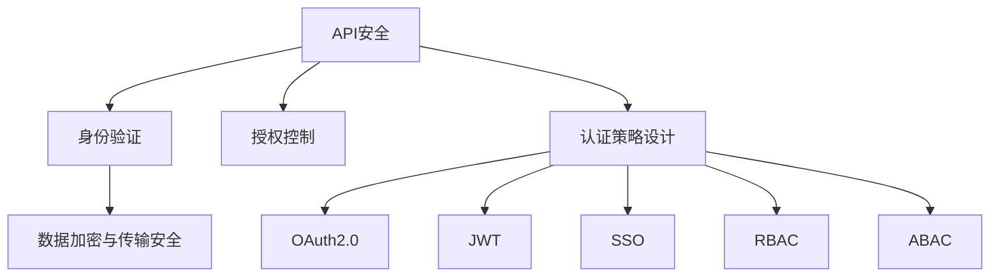

                 

# API 安全和认证机制

在当今数字化时代，API（应用程序接口）已经成为连接不同系统和服务的重要桥梁。然而，随着API的使用越来越广泛，API安全与认证问题也日益凸显。如何设计一个既安全又高效的API认证机制，成为了一个亟待解决的重要课题。本文将系统性地介绍API安全和认证的核心概念、关键原理与操作步骤，以及实际应用场景和未来展望。

## 1. 背景介绍

### 1.1 问题由来
随着微服务的普及和企业级应用的发展，API的规模和复杂度也在不断增加。同时，由于API暴露了系统的接口细节，很容易被攻击者利用进行恶意操作，如数据泄露、拒绝服务攻击、SQL注入等。因此，设计一个安全、高效的API认证机制，对于保护系统安全、提升用户体验具有重要意义。

### 1.2 问题核心关键点
API安全与认证的核心关键点包括：

- 身份验证（Authentication）：确保请求者身份的真实性。
- 授权控制（Authorization）：确保请求者权限的合法性。
- 数据加密与传输安全（Data Encryption and Secure Transmission）：确保数据在传输过程中的安全性。
- 认证策略设计（Authentication Strategy Design）：选择合适的认证机制和算法，以适应不同场景的需求。

## 2. 核心概念与联系

### 2.1 核心概念概述

为更好地理解API安全和认证机制，本节将介绍几个密切相关的核心概念：

- API安全（API Security）：指保护API不受未授权访问、恶意操作、攻击等风险威胁的机制。
- 认证机制（Authentication Mechanism）：用于验证用户身份的技术手段，如OAuth2.0、JWT、SSO等。
- 授权机制（Authorization Mechanism）：用于控制用户权限的技术手段，如RBAC、ABAC等。
- SSL/TLS：一种基于公钥加密技术的数据传输安全协议，用于保护数据在传输过程中的完整性和机密性。
- OAuth2.0：一种常用的授权协议，用于授权第三方应用访问用户资源。
- JWT（JSON Web Token）：一种用于加密和传输信息的开放标准，适用于无状态认证。

这些核心概念之间的逻辑关系可以通过以下Mermaid流程图来展示：



这个流程图展示了大语言模型的核心概念及其之间的关系：

1. API安全通过身份验证和授权控制实现。
2. 数据加密与传输安全是API安全的底层保障。
3. 认证策略设计选择合适的认证和授权机制。

这些概念共同构成了API安全的核心框架，使得API能够抵御各种安全威胁，保证数据的完整性和机密性。通过理解这些核心概念，我们可以更好地把握API认证机制的工作原理和优化方向。

## 3. 核心算法原理 & 具体操作步骤
### 3.1 算法原理概述

API安全和认证机制的核心原理可以概括为：

1. **身份验证**：确认请求者的真实身份，防止未授权访问。
2. **授权控制**：基于用户身份和权限策略，对请求进行访问控制，防止非法操作。
3. **数据加密与传输安全**：使用SSL/TLS协议，确保数据在传输过程中的机密性和完整性。

以下将详细介绍这些核心原理的操作细节。

### 3.2 算法步骤详解

**Step 1: 身份验证**

1. 客户端发送登录请求，包含用户名和密码。
2. 服务器验证用户名和密码，如果验证通过，生成一个随机Token（如JWT），并返回给客户端。
3. 客户端将Token保存在本地，用于后续请求的认证。

**Step 2: 授权控制**

1. 客户端向API发送请求，并将Token包含在请求头中。
2. 服务器对Token进行解析，确认用户的身份和权限。
3. 如果用户有权限访问该API，则返回请求结果；否则拒绝访问。

**Step 3: 数据加密与传输安全**

1. 在API的客户端和服务器之间，使用SSL/TLS协议进行数据传输，确保数据的机密性和完整性。
2. 在数据传输过程中，使用公钥加密和私钥解密的方式，防止中间人攻击。

### 3.3 算法优缺点

API安全和认证机制具有以下优点：

1. 安全性高。通过身份验证和授权控制，可以有效防止未授权访问和非法操作。
2. 灵活性高。支持多种认证机制和授权策略，适用于不同应用场景。
3. 可扩展性高。随着API的扩展，可以通过增加认证和授权机制来扩展API安全框架。

同时，该机制也存在一定的局限性：

1. 认证过程复杂。需要通过身份验证和授权控制，增加了系统的复杂性。
2. 性能开销大。特别是在高并发场景下，认证和授权的开销会影响系统性能。
3. 认证信息易泄漏。如果Token被截获，攻击者可以冒充合法用户访问API。

尽管存在这些局限性，但就目前而言，API安全和认证机制仍是保护API安全的最主流范式。未来相关研究的重点在于如何进一步降低认证的开销，提高认证的安全性，同时兼顾可扩展性和性能优化。

### 3.4 算法应用领域

API安全和认证机制在多个领域得到了广泛应用，例如：

- 企业级API：企业内部的API服务，如ERP、CRM、HR系统等。
- 公共API：政府部门、公共服务机构的API，如天气预报、交通管理等。
- 第三方API：第三方服务提供商提供的API，如支付、社交网络、地图服务等。

这些领域对API的安全性和认证机制的要求各不相同，需要根据具体场景进行灵活设计和调整。

## 4. 数学模型和公式 & 详细讲解 & 举例说明

### 4.1 数学模型构建

API安全和认证机制的数学模型主要包括以下几个组成部分：

1. 身份验证模型：用于验证用户身份，常用的算法有OAuth2.0、JWT等。
2. 授权控制模型：用于控制用户权限，常用的算法有RBAC、ABAC等。
3. 数据加密模型：用于加密数据，常用的算法有AES、RSA等。

### 4.2 公式推导过程

以OAuth2.0为例，其核心流程包括以下几个步骤：

1. 用户通过授权服务器向资源服务器请求访问权限。
2. 授权服务器验证用户身份，并要求用户授权。
3. 用户授权后，授权服务器向资源服务器颁发访问令牌（Token）。
4. 客户端持有访问令牌，向资源服务器请求访问资源。
5. 资源服务器验证访问令牌，如果合法，返回请求结果。

使用数学语言，可以将其表示为：

$$
\begin{aligned}
&\text{用户身份验证} \\
&U \in \text{授权服务器} \\
&\text{验证成功} \\
&\text{授权请求} \\
&T = \text{授权服务器生成Token} \\
&\text{客户端持有Token} \\
&\text{资源服务器验证Token} \\
&\text{验证成功} \\
&\text{返回请求结果}
\end{aligned}
$$

其中，$U$表示用户，$T$表示访问令牌。

### 4.3 案例分析与讲解

以OAuth2.0为例，下面对一个实际案例进行分析：

假设一个企业内部有ERP、CRM、HR三个系统，各个系统需要访问其他系统的API接口。

1. 用户登录ERP系统，输入用户名和密码。
2. ERP系统将用户名和密码发送到授权服务器进行验证。
3. 授权服务器验证通过后，生成一个访问令牌，并返回给ERP系统。
4. ERP系统将访问令牌保存下来，后续请求其他系统的API接口时，将令牌包含在请求头中。
5. CRM和HR系统的API服务器接收到请求后，解析请求头中的令牌，验证是否合法。
6. 如果令牌合法，则返回请求结果；否则拒绝访问。

通过这个过程，我们可以看到OAuth2.0如何通过身份验证和授权控制，实现API的安全访问。

## 5. 项目实践：代码实例和详细解释说明

### 5.1 开发环境搭建

在进行API安全和认证机制的实践前，我们需要准备好开发环境。以下是使用Python进行Flask开发的环境配置流程：

1. 安装Anaconda：从官网下载并安装Anaconda，用于创建独立的Python环境。

2. 创建并激活虚拟环境：
```bash
conda create -n flask-env python=3.8 
conda activate flask-env
```

3. 安装Flask：
```bash
pip install Flask
```

4. 安装Flask-Security和Flask-JWT-Extended：
```bash
pip install Flask-Security Flask-JWT-Extended
```

5. 安装相关工具包：
```bash
pip install Flask-SocketIO Flask-SQLAlchemy Flask-RESTful
```

完成上述步骤后，即可在`flask-env`环境中开始实践。

### 5.2 源代码详细实现

下面我们以Flask框架为例，给出OAuth2.0认证机制的PyTorch代码实现。

首先，定义OAuth2.0认证相关的模型：

```python
from flask import Flask, request, jsonify
from flask_security import Security, SQLAlchemyUserDatastore, UserMixin, RoleMixin, login_required
from flask_sqlalchemy import SQLAlchemy
from flask_jwt_extended import JWTManager, jwt_required

app = Flask(__name__)
app.config['SQLALCHEMY_DATABASE_URI'] = 'sqlite:////tmp/test.db'
app.config['SECRET_KEY'] = 'super-secret'
app.config['JWT_SECRET_KEY'] = 'jwt-secret'
app.config['JWT_ACCESS_TOKEN_EXPIRES'] = timedelta(days=1)

db = SQLAlchemy(app)
jwt = JWTManager(app)

class Role(db.Model, RoleMixin):
    id = db.Column(db.Integer(), primary_key=True)
    name = db.Column(db.String(80), unique=True)
    description = db.Column(db.String(255))

class User(db.Model, UserMixin):
    id = db.Column(db.Integer(), primary_key=True)
    email = db.Column(db.String(255), unique=True)
    password = db.Column(db.String(255))
    active = db.Column(db.Boolean())
    roles = db.relationship('Role', secondary=roles_users, backref=db.backref('users', lazy='dynamic'))

user_datastore = SQLAlchemyUserDatastore(db, User, Role)
security = Security(app, user_datastore)

@app.route('/login', methods=['POST'])
def login():
    data = request.get_json()
    email = data.get('email')
    password = data.get('password')
    return jsonify(security.login(email, password))

@app.route('/protected', methods=['GET'])
@login_required
def protected():
    return jsonify({'message': 'Protected endpoint'})

@app.route('/api/protected', methods=['GET'])
@jwt_required
def protected_api():
    return jsonify({'message': 'Protected API endpoint'})

if __name__ == '__main__':
    app.run(debug=True)
```

接着，定义授权策略：

```python
from flask_security import Security, SQLAlchemyUserDatastore, UserMixin, RoleMixin, login_required
from flask_sqlalchemy import SQLAlchemy
from flask_jwt_extended import JWTManager, jwt_required

app = Flask(__name__)
app.config['SQLALCHEMY_DATABASE_URI'] = 'sqlite:////tmp/test.db'
app.config['SECRET_KEY'] = 'super-secret'
app.config['JWT_SECRET_KEY'] = 'jwt-secret'
app.config['JWT_ACCESS_TOKEN_EXPIRES'] = timedelta(days=1)

db = SQLAlchemy(app)
jwt = JWTManager(app)

class Role(db.Model, RoleMixin):
    id = db.Column(db.Integer(), primary_key=True)
    name = db.Column(db.String(80), unique=True)
    description = db.Column(db.String(255))

class User(db.Model, UserMixin):
    id = db.Column(db.Integer(), primary_key=True)
    email = db.Column(db.String(255), unique=True)
    password = db.Column(db.String(255))
    active = db.Column(db.Boolean())
    roles = db.relationship('Role', secondary=roles_users, backref=db.backref('users', lazy='dynamic'))

user_datastore = SQLAlchemyUserDatastore(db, User, Role)
security = Security(app, user_datastore)

@app.route('/login', methods=['POST'])
def login():
    data = request.get_json()
    email = data.get('email')
    password = data.get('password')
    return jsonify(security.login(email, password))

@app.route('/protected', methods=['GET'])
@login_required
def protected():
    return jsonify({'message': 'Protected endpoint'})

@app.route('/api/protected', methods=['GET'])
@jwt_required
def protected_api():
    return jsonify({'message': 'Protected API endpoint'})

if __name__ == '__main__':
    app.run(debug=True)
```

最后，启动Flask应用并测试：

```python
from flask import Flask, request, jsonify
from flask_security import Security, SQLAlchemyUserDatastore, UserMixin, RoleMixin, login_required
from flask_sqlalchemy import SQLAlchemy
from flask_jwt_extended import JWTManager, jwt_required

app = Flask(__name__)
app.config['SQLALCHEMY_DATABASE_URI'] = 'sqlite:////tmp/test.db'
app.config['SECRET_KEY'] = 'super-secret'
app.config['JWT_SECRET_KEY'] = 'jwt-secret'
app.config['JWT_ACCESS_TOKEN_EXPIRES'] = timedelta(days=1)

db = SQLAlchemy(app)
jwt = JWTManager(app)

class Role(db.Model, RoleMixin):
    id = db.Column(db.Integer(), primary_key=True)
    name = db.Column(db.String(80), unique=True)
    description = db.Column(db.String(255))

class User(db.Model, UserMixin):
    id = db.Column(db.Integer(), primary_key=True)
    email = db.Column(db.String(255), unique=True)
    password = db.Column(db.String(255))
    active = db.Column(db.Boolean())
    roles = db.relationship('Role', secondary=roles_users, backref=db.backref('users', lazy='dynamic'))

user_datastore = SQLAlchemyUserDatastore(db, User, Role)
security = Security(app, user_datastore)

@app.route('/login', methods=['POST'])
def login():
    data = request.get_json()
    email = data.get('email')
    password = data.get('password')
    return jsonify(security.login(email, password))

@app.route('/protected', methods=['GET'])
@login_required
def protected():
    return jsonify({'message': 'Protected endpoint'})

@app.route('/api/protected', methods=['GET'])
@jwt_required
def protected_api():
    return jsonify({'message': 'Protected API endpoint'})

if __name__ == '__main__':
    app.run(debug=True)
```

以上就是使用Flask框架进行OAuth2.0认证机制的完整代码实现。可以看到，通过Flask-Security和Flask-JWT-Extended，可以很方便地实现身份验证和授权控制。

### 5.3 代码解读与分析

让我们再详细解读一下关键代码的实现细节：

**OAuth2.0认证流程**：
- 用户登录时，调用`security.login`方法验证用户名和密码。
- 验证通过后，生成一个JWT访问令牌，并返回给客户端。
- 客户端在访问受保护的API接口时，将JWT令牌包含在请求头中。
- API服务器接收到请求后，使用`jwt_required`装饰器验证JWT令牌的有效性。
- 如果JWT令牌合法，则返回请求结果；否则拒绝访问。

**Flask-Security配置**：
- 配置SQLAlchemy数据库，定义用户和角色模型。
- 使用SQLAlchemyUserDatastore定义用户数据存储，并配置Security模块。
- 定义`/login`和`/protected`两个API接口，分别用于用户登录和受保护的API接口访问。
- 使用`@login_required`和`@jwt_required`装饰器分别实现基于用户认证和JWT令牌认证。

**Flask-JWT-Extended配置**：
- 配置JWT Secret Key和JWT Access Token Expires。
- 使用JWTManager定义JWT令牌管理，实现JWT令牌的生成、解析和验证。

**测试流程**：
- 启动Flask应用，访问`/login`接口，输入用户名和密码，获取JWT令牌。
- 使用JWT令牌访问`/protected`和`/api/protected`接口，验证JWT令牌的有效性。
- 如果JWT令牌合法，则返回请求结果；否则返回401 Unauthorized错误。

通过这个代码实例，可以清晰地看到OAuth2.0认证机制的实现流程。Flask框架的简洁和易用性，使得OAuth2.0的实现变得非常容易。

## 6. 实际应用场景
### 6.1 智能客服系统

智能客服系统是API安全的重要应用场景之一。通过OAuth2.0认证机制，智能客服系统能够验证用户身份，防止未授权访问，同时授权不同用户访问不同的客服功能。

具体而言，智能客服系统可以使用OAuth2.0协议，将用户身份信息保存在Token中，每个Token代表不同的用户权限。用户登录后，服务器生成Token，并将Token返回给客户端。客户端在访问智能客服API时，将Token包含在请求头中，服务器解析Token，验证用户的身份和权限，并根据权限控制用户的操作。

### 6.2 医疗信息系统

医疗信息系统是另一个重要的API应用场景。通过OAuth2.0认证机制，医疗信息系统能够确保数据的安全性和机密性，防止未授权访问和数据泄露。

具体而言，医疗信息系统可以使用OAuth2.0协议，将用户身份信息保存在Token中，每个Token代表不同的用户权限。用户登录后，服务器生成Token，并将Token返回给客户端。客户端在访问医疗信息系统API时，将Token包含在请求头中，服务器解析Token，验证用户的身份和权限，并根据权限控制用户的操作。同时，医疗信息系统可以采用SSL/TLS协议，确保数据在传输过程中的安全性。

### 6.3 在线教育平台

在线教育平台也是API安全的重要应用场景之一。通过OAuth2.0认证机制，在线教育平台能够验证用户身份，防止未授权访问，同时授权不同用户访问不同的教育资源。

具体而言，在线教育平台可以使用OAuth2.0协议，将用户身份信息保存在Token中，每个Token代表不同的用户权限。用户登录后，服务器生成Token，并将Token返回给客户端。客户端在访问在线教育平台API时，将Token包含在请求头中，服务器解析Token，验证用户的身份和权限，并根据权限控制用户的操作。同时，在线教育平台可以采用SSL/TLS协议，确保数据在传输过程中的安全性。

## 7. 工具和资源推荐
### 7.1 学习资源推荐

为了帮助开发者系统掌握API安全和认证机制的理论基础和实践技巧，这里推荐一些优质的学习资源：

1. **OAuth2.0官方文档**：OAuth2.0官方文档详细介绍了OAuth2.0协议的各个组成部分和实现细节，是理解OAuth2.0的必备资料。

2. **Flask-Security官方文档**：Flask-Security官方文档介绍了如何使用Flask框架实现OAuth2.0认证机制，提供了丰富的样例和代码示例。

3. **Flask-JWT-Extended官方文档**：Flask-JWT-Extended官方文档介绍了如何使用Flask框架实现JWT认证机制，提供了详细的API和示例。

4. **OAuth2.0实战**：OAuth2.0实战一书系统介绍了OAuth2.0协议的各个组件和实现细节，并提供了丰富的代码示例和案例分析。

5. **API安全与认证机制**：《API安全与认证机制》一书详细介绍了API安全和认证机制的核心概念、关键原理与操作步骤，并提供了丰富的案例分析。

通过对这些资源的学习实践，相信你一定能够快速掌握API安全和认证机制的精髓，并用于解决实际的API安全问题。

### 7.2 开发工具推荐

高效的开发离不开优秀的工具支持。以下是几款用于API安全和认证机制开发的常用工具：

1. **Flask**：Python的开源微框架，适合快速迭代研究。大多数预训练语言模型都有Flask版本的实现。

2. **Django**：Python的开源全栈框架，适合企业级应用开发。

3. **Spring Boot**：Java的开源微框架，适合企业级应用开发。

4. **JWT.io**：在线JWT解码和签名工具，方便开发者调试和测试。

5. **OAuth Playground**：在线OAuth2.0测试工具，方便开发者测试和验证。

6. **Postman**：API开发和测试工具，支持多种API认证机制的测试。

合理利用这些工具，可以显著提升API安全和认证机制的开发效率，加快创新迭代的步伐。

### 7.3 相关论文推荐

API安全和认证机制的研究源于学界的持续研究。以下是几篇奠基性的相关论文，推荐阅读：

1. **OAuth2.0协议**：OAuth2.0协议是当前主流的授权协议，介绍了OAuth2.0的各个组成部分和实现细节。

2. **JWT机制**：JSON Web Token（JWT）是一种基于公钥加密技术的数据传输标准，适用于无状态认证。

3. **RBAC与ABAC模型**：基于角色的访问控制（RBAC）和基于属性的访问控制（ABAC）是两种常见的授权机制，介绍了这两种机制的实现细节。

4. **API安全与认证机制**：《API安全与认证机制》一书详细介绍了API安全和认证机制的核心概念、关键原理与操作步骤，并提供了丰富的案例分析。

这些论文代表了大语言模型微调技术的发展脉络。通过学习这些前沿成果，可以帮助研究者把握学科前进方向，激发更多的创新灵感。

## 8. 总结：未来发展趋势与挑战

### 8.1 总结

本文对API安全和认证机制进行了全面系统的介绍。首先阐述了API安全和认证机制的研究背景和意义，明确了API安全与认证机制在保护系统安全、提升用户体验方面的重要价值。其次，从原理到实践，详细讲解了OAuth2.0、JWT等认证机制的核心流程和实现细节，并给出了基于Flask框架的代码实例。同时，本文还广泛探讨了API安全与认证机制在智能客服、医疗信息系统、在线教育平台等多个行业领域的应用前景，展示了API认证机制的巨大潜力。

通过本文的系统梳理，可以看到，API安全和认证机制正在成为API安全的主流范式，极大地提升了API系统的安全性，保障了数据的安全性和机密性。未来，伴随API安全和认证机制的不断发展，API系统的安全性将进一步提升，保障更多系统和服务的稳定运行。

### 8.2 未来发展趋势

展望未来，API安全和认证机制将呈现以下几个发展趋势：

1. **多认证机制融合**：未来的API安全和认证机制将融合多种认证机制，如OAuth2.0、JWT、SAML等，提升系统的灵活性和安全性。

2. **零信任架构**：零信任架构（Zero Trust Architecture）是一种新的网络安全理念，强调"永不信任、永远验证"，将成为API安全的重要方向。

3. **区块链技术的应用**：区块链技术可以用于分布式认证和授权，增强API系统的安全性。

4. **AI技术的应用**：AI技术可以用于行为分析和异常检测，提升API系统的安全性和自动化程度。

5. **联邦学习和隐私保护**：联邦学习（Federated Learning）和隐私保护技术可以用于提升API系统的隐私性和安全性。

6. **跨平台认证**：未来的API安全和认证机制将支持跨平台认证，如移动应用、桌面应用等，提升系统的通用性和用户体验。

以上趋势凸显了API安全和认证机制的广阔前景。这些方向的探索发展，必将进一步提升API系统的安全性，保障数据的安全性和机密性。

### 8.3 面临的挑战

尽管API安全和认证机制已经取得了显著成果，但在迈向更加智能化、普适化应用的过程中，它仍面临诸多挑战：

1. **认证过程复杂**：认证过程需要验证用户的身份和权限，增加了系统的复杂性。

2. **性能开销大**：特别是在高并发场景下，认证和授权的开销会影响系统性能。

3. **认证信息易泄漏**：如果Token被截获，攻击者可以冒充合法用户访问API。

4. **认证和授权的集成难度大**：不同的认证和授权机制需要集成，增加了系统的复杂性。

5. **跨平台认证难度大**：跨平台认证需要支持多种操作系统和设备，增加了系统的复杂性。

6. **用户隐私保护难度大**：用户数据需要在认证和授权过程中进行传输，如何保护用户隐私是一大挑战。

正视API安全和认证机制面临的这些挑战，积极应对并寻求突破，将是大语言模型微调走向成熟的必由之路。相信随着学界和产业界的共同努力，这些挑战终将一一被克服，API安全和认证机制必将在构建安全、可靠、可控的智能系统中扮演越来越重要的角色。

### 8.4 研究展望

面对API安全和认证机制所面临的种种挑战，未来的研究需要在以下几个方面寻求新的突破：

1. **简化认证流程**：通过引入AI技术，简化认证和授权流程，减少系统复杂性。

2. **提升性能**：优化认证和授权算法，减少系统开销，提升认证效率。

3. **加强隐私保护**：使用区块链和隐私保护技术，保护用户隐私和数据安全。

4. **跨平台认证**：开发跨平台认证机制，提升系统的通用性和用户体验。

5. **联邦学习和联邦认证**：引入联邦学习和联邦认证技术，增强系统的安全性和隐私保护。

6. **零信任架构**：引入零信任架构理念，提升系统的安全性和自动化程度。

这些研究方向的探索，必将引领API安全和认证机制技术迈向更高的台阶，为构建安全、可靠、可控的智能系统铺平道路。面向未来，API安全和认证机制还需要与其他人工智能技术进行更深入的融合，如知识表示、因果推理、强化学习等，多路径协同发力，共同推动自然语言理解和智能交互系统的进步。只有勇于创新、敢于突破，才能不断拓展API系统的边界，让智能技术更好地造福人类社会。

## 9. 附录：常见问题与解答

**Q1：API认证机制有哪些类型？**

A: API认证机制主要包括以下几种类型：

1. **基本认证（Basic Authentication）**：用户名和密码加密后直接包含在请求头中。
2. **OAuth2.0认证**：通过OAuth2.0协议，生成和解析Token。
3. **JWT认证**：使用JWT令牌进行认证。
4. **SSO认证**：单点登录（Single Sign-On）认证，用户只需登录一次，即可访问多个系统。

这些认证机制各有优缺点，需要根据具体场景选择合适的机制。

**Q2：如何防止OAuth2.0 Token泄漏？**

A: 防止OAuth2.0 Token泄漏的常见措施包括：

1. **HTTPS协议**：使用HTTPS协议，确保数据在传输过程中的机密性和完整性。
2. **短效Token**：生成短效Token，每次访问API时重新生成，避免Token被截获。
3. **访问限制**：限制Token的访问次数和有效期，防止Token被滥用。
4. **安全存储**：将Token保存在安全的地方，防止被恶意代码获取。

这些措施可以有效防止OAuth2.0 Token泄漏，保护API的安全性。

**Q3：如何选择合适的认证机制？**

A: 选择合适的认证机制需要考虑以下几个因素：

1. **安全性**：根据API的敏感程度，选择合适的认证机制。
2. **用户体验**：根据用户的访问习惯，选择合适的认证机制。
3. **系统复杂度**：根据系统的复杂度，选择合适的认证机制。
4. **可扩展性**：根据系统的可扩展性，选择合适的认证机制。

常见的认证机制包括OAuth2.0、JWT、SAML等，需要根据具体场景进行选择。

**Q4：JWT令牌是如何生成和解析的？**

A: JWT令牌的生成和解析过程如下：

1. 生成Token时，将用户身份信息、时间戳、签名等信息编码为字符串。
2. 使用公钥加密Token，返回给客户端。
3. 客户端在访问API时，将Token包含在请求头中。
4. 服务器解析Token，验证签名和用户身份信息，如果合法，返回请求结果；否则拒绝访问。

通过这个过程，可以看到JWT令牌的生成和解析过程，可以有效保护用户身份信息。

**Q5：如何防止OAuth2.0认证中的重放攻击？**

A: 防止OAuth2.0认证中的重放攻击的常见措施包括：

1. **短效Token**：生成短效Token，每次访问API时重新生成。
2. **时间戳**：在Token中包含时间戳，防止Token被重放。
3. **CSRF保护**：使用CSRF（跨站请求伪造）保护，防止恶意网站重放Token。

这些措施可以有效防止OAuth2.0认证中的重放攻击，保护API的安全性。

**Q6：OAuth2.0认证和JWT认证的区别是什么？**

A: OAuth2.0认证和JWT认证的主要区别包括：

1. **认证方式**：OAuth2.0认证是通过OAuth2.0协议生成和解析Token，JWT认证是通过JWT令牌生成和解析Token。
2. **安全性**：OAuth2.0认证需要服务器端验证Token，JWT认证只需要客户端验证Token。
3. **适用场景**：OAuth2.0认证适用于需要服务器端验证的场景，JWT认证适用于无状态认证和分布式系统。

这些区别需要根据具体场景选择合适的认证机制。

通过这些常见问题的解答，可以看到API安全和认证机制的复杂性和多样性，需要根据具体场景选择合适的认证机制，并采取相应的安全措施，才能保障API系统的安全性和稳定性。

---

作者：禅与计算机程序设计艺术 / Zen and the Art of Computer Programming

