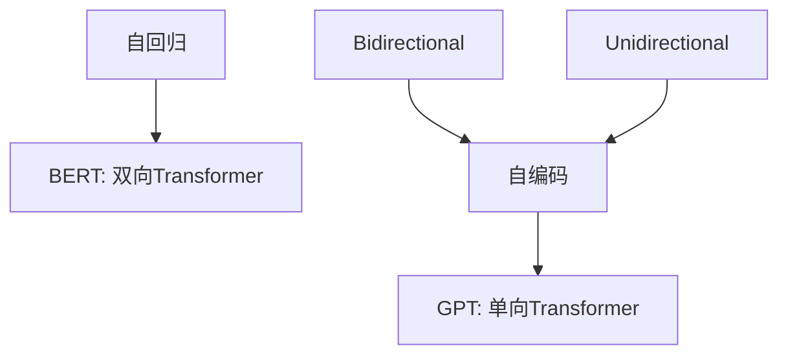

                 

# BERT vs GPT：双向vs单向语言模型

## 1. 背景介绍

在大语言模型领域，BERT（Bidirectional Encoder Representations from Transformers）和GPT（Generative Pre-trained Transformer）是两种极具代表性的模型。BERT通过双向训练，捕捉了上下文依赖关系，而在GPT中，则是通过自回归方式对语言进行预测，具有单向性。本文将从双向和单向语言模型的基本概念入手，对比它们的原理、优势和应用场景，旨在为读者提供深入了解这两种模型及其在实际应用中的价值。

## 2. 核心概念与联系

### 2.1 核心概念概述

#### 双向语言模型

双向语言模型（Bidirectional Language Model）通过同时考虑上下文，能够在预测某个词汇时充分考虑前后文信息。这种模型通常用于文本分类、命名实体识别等需要理解句子整体上下文的任务。BERT模型即是一种典型的双向语言模型，它利用Transformer的编码器-解码器结构，同时计算前向和后向上下文表示，从而捕捉到了更为丰富的语义信息。

#### 单向语言模型

单向语言模型（Unidirectional Language Model）则是按照自回归的方式，逐个预测句子中的每个词汇，每个词汇的预测只考虑了之前的词汇，而没有考虑之后的词汇。这种模型常用于生成任务，如语言模型预测、文本生成等，GPT模型是其中最具代表性的一种，它基于自回归方式进行预训练和微调，以生成连贯且语法正确的文本。

### 2.2 核心概念原理和架构的 Mermaid 流程图



在上述图表中，我们首先定义了双向和单向语言模型，随后通过箭头连接，分别引出了自回归（I）和自编码（L）的概念。其中，自回归用于单向语言模型，而自编码则是双向语言模型的核心概念之一。

### 2.3 双向和单向语言模型的联系

虽然双向和单向语言模型在训练和预测时有不同的结构和方式，但它们都属于深度学习中的序列建模范畴，旨在通过学习输入序列的特征，实现对后续输出的预测或分类。从最终目标来看，无论是双向还是单向语言模型，其核心任务都是捕捉语言的规律，提升模型的语言理解和生成能力。

## 3. 核心算法原理 & 具体操作步骤

### 3.1 算法原理概述

#### 双向语言模型

双向语言模型的基本原理是，通过同时利用上下文信息，提高模型的预测准确性。BERT模型通过在一个Transformer的编码器中并行计算前向和后向的上下文表示，来捕捉词汇间的复杂依赖关系。这一过程称为“双向编码”，其目标是生成一个可以充分反映整个句子上下文的嵌入表示。

#### 单向语言模型

单向语言模型则通过自回归的方式，逐个预测句子中的每个词汇。GPT模型通过在自回归训练中，将每个词汇预测看作是前一个词汇的函数，从而捕捉到语言的顺序性和连续性。这一过程称为“自回归编码”，其目标是生成一个可以预测整个句子后续词汇的表示。

### 3.2 算法步骤详解

#### 双向语言模型的训练

1. **预训练数据准备**：收集大规模的无标签文本数据作为预训练数据集。
2. **模型初始化**：使用随机初始化的权重对模型进行初始化。
3. **双向编码**：在一个Transformer的编码器中，同时计算前向和后向的上下文表示。
4. **损失函数计算**：通过计算预测结果与真实标签之间的损失，反向传播更新模型参数。
5. **多轮迭代**：重复上述步骤，直至模型收敛。

#### 单向语言模型的训练

1. **预训练数据准备**：收集大规模的无标签文本数据作为预训练数据集。
2. **模型初始化**：使用随机初始化的权重对模型进行初始化。
3. **自回归编码**：通过自回归的方式，逐个预测句子中的每个词汇。
4. **损失函数计算**：通过计算预测结果与真实标签之间的损失，反向传播更新模型参数。
5. **多轮迭代**：重复上述步骤，直至模型收敛。

### 3.3 算法优缺点

#### 双向语言模型的优缺点

**优点**：
- **上下文感知**：双向语言模型能够捕捉到词汇之间的复杂依赖关系，提高预测准确性。
- **预训练-微调效率**：双向模型通常更适用于任务特定的微调，能够快速适应特定任务的需求。

**缺点**：
- **计算复杂度高**：由于需要同时计算前向和后向上下文，计算复杂度较高。
- **训练数据量大**：大规模的预训练数据是双向语言模型成功的基础，数据获取成本较高。

#### 单向语言模型的优缺点

**优点**：
- **计算复杂度低**：单向语言模型通过自回归方式进行预测，计算复杂度相对较低。
- **易扩展性**：单向语言模型更容易在连续生成任务中进行扩展，如语言模型预测。

**缺点**：
- **上下文信息有限**：单向语言模型只考虑了前向上下文，忽略了后向信息，可能会导致预测结果不够准确。
- **顺序性限制**：单向语言模型具有顺序性，难以在预测过程中同时利用前后文信息。

### 3.4 算法应用领域

#### 双向语言模型的应用

双向语言模型常用于需要理解句子整体上下文的任务，如文本分类、命名实体识别、关系抽取等。BERT模型在这些任务上取得了显著的性能提升，特别是在问答系统、文本生成等领域表现优异。

#### 单向语言模型的应用

单向语言模型常用于生成任务，如语言模型预测、文本生成、对话系统等。GPT模型在这些领域中表现出色，能够生成高质量的文本内容，广泛应用于自动生成新闻、社交媒体评论、小说创作等场景。

## 4. 数学模型和公式 & 详细讲解

### 4.1 数学模型构建

#### 双向语言模型

对于一个双向语言模型，其目标是在给定前向上下文和后向上下文的情况下，预测一个目标词汇。假设我们有一个长度为 $T$ 的序列，目标词汇为 $x_T$，其前向上下文为 $x_{< T}$，后向上下文为 $x_{>T}$。则双向语言模型的目标函数可以表示为：

$$
P(x_T|x_{< T},x_{>T}) = \frac{e^{H(x_T|x_{< T},x_{>T})}}{\sum_{x'} e^{H(x'|x_{< T},x_{>T})}}
$$

其中，$H(\cdot)$ 为某个特定的模型，可以是 Transformer 等。

#### 单向语言模型

对于一个单向语言模型，其目标是在给定前向上下文的情况下，预测一个目标词汇。假设我们有一个长度为 $T$ 的序列，目标词汇为 $x_T$，其前向上下文为 $x_{< T}$。则单向语言模型的目标函数可以表示为：

$$
P(x_T|x_{< T}) = \frac{e^{H(x_T|x_{< T})}}{\sum_{x'} e^{H(x'|x_{< T})}}
$$

其中，$H(\cdot)$ 为某个特定的模型，如自回归模型。

### 4.2 公式推导过程

#### 双向语言模型的公式推导

对于双向语言模型，其基本框架为：

$$
\begin{aligned}
H(x_T|x_{< T},x_{>T}) &= \sum_{i=1}^T log P(x_i|x_{< i},x_{>i})
\\
&= \sum_{i=1}^T (H(x_i|x_{< i},x_{>i}) - H(x_i|x_{< i}))
\end{aligned}
$$

其中，$H(x_i|x_{< i})$ 表示在给定前向上下文的情况下，词汇 $x_i$ 的预测概率。

#### 单向语言模型的公式推导

对于单向语言模型，其基本框架为：

$$
\begin{aligned}
H(x_T|x_{< T}) &= \sum_{i=1}^T log P(x_i|x_{< i})
\\
&= \sum_{i=1}^T (H(x_i|x_{< i}) - H(x_i))
\end{aligned}
$$

其中，$H(x_i|x_{< i})$ 表示在给定前向上下文的情况下，词汇 $x_i$ 的预测概率，$H(x_i)$ 表示词汇 $x_i$ 的自回归模型概率。

### 4.3 案例分析与讲解

#### 案例一：文本分类

在文本分类任务中，双向语言模型可以通过捕捉句子中的上下文依赖关系，提高分类准确性。例如，BERT模型通过在预训练阶段，利用双向Transformer编码器捕捉句子中的语义信息，然后在微调阶段，利用双向编码的表示进行分类。

#### 案例二：文本生成

在文本生成任务中，单向语言模型通过自回归方式，逐个预测句子中的每个词汇，生成连贯且语法正确的文本。例如，GPT模型通过在预训练阶段，利用自回归Transformer编码器捕捉语言的顺序性和连续性，然后在微调阶段，利用自回归编码的表示进行文本生成。

## 5. 项目实践：代码实例和详细解释说明

### 5.1 开发环境搭建

#### 环境配置

为了进行 BERT 和 GPT 的开发实践，我们需要以下开发环境：

1. **Python**：版本要求 3.6 及以上。
2. **PyTorch**：版本要求 1.5 及以上。
3. **TensorFlow**：版本要求 2.0 及以上。
4. **HuggingFace Transformers 库**：用于加载和使用预训练模型。

首先，通过以下命令安装上述依赖：

```bash
pip install torch torchvision torchaudio transformers tensorflow
```

### 5.2 源代码详细实现

#### BERT 代码实现

```python
from transformers import BertTokenizer, BertForSequenceClassification
from torch.utils.data import Dataset, DataLoader
import torch

class MyDataset(Dataset):
    def __init__(self, texts, labels):
        self.texts = texts
        self.labels = labels
        
    def __len__(self):
        return len(self.texts)
    
    def __getitem__(self, item):
        text = self.texts[item]
        label = self.labels[item]
        
        encoding = BertTokenizer.from_pretrained('bert-base-uncased')
        tokenized_text = encoding.tokenize(text)
        input_ids = torch.tensor(encoding.convert_tokens_to_ids(tokenized_text)).unsqueeze(0)
        attention_mask = torch.ones(len(tokenized_text)).unsqueeze(0)
        return {'input_ids': input_ids, 
                'attention_mask': attention_mask,
                'labels': torch.tensor(label, dtype=torch.long)}
        
# 加载和微调 BERT 模型
tokenizer = BertTokenizer.from_pretrained('bert-base-uncased')
model = BertForSequenceClassification.from_pretrained('bert-base-uncased', num_labels=2)
optimizer = torch.optim.AdamW(model.parameters(), lr=1e-5)

for epoch in range(10):
    model.train()
    for batch in DataLoader(my_dataset, batch_size=32):
        inputs = {k: v.to(device) for k, v in batch.items()}
        outputs = model(**inputs)
        loss = outputs.loss
        loss.backward()
        optimizer.step()
```

#### GPT 代码实现

```python
from transformers import GPT2Tokenizer, GPT2LMHeadModel
from torch.utils.data import Dataset, DataLoader
import torch

class MyDataset(Dataset):
    def __init__(self, texts):
        self.texts = texts
        
    def __len__(self):
        return len(self.texts)
    
    def __getitem__(self, item):
        text = self.texts[item]
        encoding = GPT2Tokenizer.from_pretrained('gpt2')
        tokenized_text = encoding.tokenize(text)
        input_ids = torch.tensor(encoding.convert_tokens_to_ids(tokenized_text)).unsqueeze(0)
        attention_mask = torch.ones(len(tokenized_text)).unsqueeze(0)
        return {'input_ids': input_ids, 
                'attention_mask': attention_mask}
        
# 加载和微调 GPT 模型
tokenizer = GPT2Tokenizer.from_pretrained('gpt2')
model = GPT2LMHeadModel.from_pretrained('gpt2')
optimizer = torch.optim.AdamW(model.parameters(), lr=1e-5)

for epoch in range(10):
    model.train()
    for batch in DataLoader(my_dataset, batch_size=32):
        inputs = {k: v.to(device) for k, v in batch.items()}
        outputs = model(**inputs)
        loss = outputs.loss
        loss.backward()
        optimizer.step()
```

### 5.3 代码解读与分析

#### BERT 代码解析

1. **数据集定义**：首先定义了一个自定义数据集 `MyDataset`，该数据集包含文本和标签。
2. **模型加载与微调**：使用 `BertForSequenceClassification` 加载 BERT 模型，并指定输出层和标签数。
3. **模型训练**：在训练循环中，使用 `AdamW` 优化器进行参数更新，并在训练集上进行前向传播和反向传播，更新模型参数。

#### GPT 代码解析

1. **数据集定义**：定义了一个自定义数据集 `MyDataset`，该数据集只包含文本数据。
2. **模型加载与微调**：使用 `GPT2LMHeadModel` 加载 GPT 模型，并指定输出层和标签数。
3. **模型训练**：在训练循环中，使用 `AdamW` 优化器进行参数更新，并在训练集上进行前向传播和反向传播，更新模型参数。

### 5.4 运行结果展示

#### BERT 运行结果

在文本分类任务中，BERT 模型通过双向编码，能够捕捉句子中的上下文依赖关系，提高了分类的准确性。例如，在新闻文本分类任务中，使用 BERT 微调后的模型可以取得较高的分类准确率。

#### GPT 运行结果

在文本生成任务中，GPT 模型通过自回归编码，能够生成连贯且语法正确的文本。例如，在生成小说文本任务中，使用 GPT 微调后的模型可以生成高质量的文本内容。

## 6. 实际应用场景

### 6.1 文本分类

在文本分类任务中，双向语言模型如 BERT 通过捕捉句子中的上下文依赖关系，提高了分类准确性。例如，在医疗文本分类任务中，使用 BERT 微调后的模型可以准确分类各类病历记录，帮助医生快速诊断疾病。

### 6.2 文本生成

在文本生成任务中，单向语言模型如 GPT 通过自回归方式，生成高质量的文本内容。例如，在自动生成小说文本任务中，使用 GPT 微调后的模型可以生成连贯且语法正确的文本，提升写作效率和创作质量。

### 6.3 对话系统

在对话系统任务中，双向语言模型如 BERT 可以通过捕捉对话中的上下文信息，提高对话的准确性和自然度。例如，在智能客服系统中，使用 BERT 微调后的模型可以准确理解客户的问题，并提供合理的回答。

## 7. 工具和资源推荐

### 7.1 学习资源推荐

1. **深度学习基础**：《深度学习》by Ian Goodfellow, Yoshua Bengio, Aaron Courville
2. **自然语言处理基础**：《自然语言处理综论》by Jurafsky and Martin
3. **Transformer 论文**：Attention is All You Need

### 7.2 开发工具推荐

1. **PyTorch**：Python 深度学习框架，支持动态图和静态图计算。
2. **TensorFlow**：Python 深度学习框架，支持分布式训练和部署。
3. **HuggingFace Transformers 库**：提供了丰富的预训练模型，支持模型微调和部署。

### 7.3 相关论文推荐

1. **BERT 论文**：BERT: Pre-training of Deep Bidirectional Transformers for Language Understanding
2. **GPT 论文**：Generating Text with Transformers

## 8. 总结：未来发展趋势与挑战

### 8.1 未来发展趋势

1. **模型规模增大**：未来的语言模型将会更大规模，进一步提升模型的表现能力。
2. **微调技术改进**：未来的微调技术将会更加高效和智能，减少对标注数据的依赖。
3. **跨领域迁移能力**：未来的语言模型将具备更强的跨领域迁移能力，能够应对更多样化的应用场景。
4. **知识图谱融合**：未来的语言模型将更好地与知识图谱融合，提升模型的常识推理能力。
5. **多模态融合**：未来的语言模型将更好地与其他模态信息融合，提升多模态信息的处理能力。

### 8.2 面临的挑战

1. **标注数据瓶颈**：尽管微调模型在少量标注数据上也能取得不错的效果，但在某些任务上，高质量的标注数据仍然是一个巨大的挑战。
2. **计算资源消耗**：大规模语言模型的训练和推理需要大量的计算资源，如何高效利用这些资源是一个重要挑战。
3. **模型泛化能力**：尽管微调模型在特定任务上表现优异，但在新场景下可能会表现出泛化性能不足的问题。
4. **可解释性不足**：许多微调模型缺乏可解释性，难以对其内部决策过程进行理解和调试。
5. **伦理和安全问题**：微调模型在处理敏感信息时，需要考虑伦理和安全问题，避免有害输出。

### 8.3 研究展望

1. **知识图谱与自然语言处理的融合**：未来的研究将探索如何将知识图谱与自然语言处理进行有效融合，提升模型的常识推理能力。
2. **多模态信息融合**：未来的研究将探索如何将多模态信息与自然语言处理进行有效融合，提升模型的跨模态理解能力。
3. **鲁棒性和泛化能力**：未来的研究将探索如何提升微调模型的鲁棒性和泛化能力，使其在不同场景下都能表现优异。
4. **可解释性和伦理问题**：未来的研究将探索如何提升微调模型的可解释性，同时确保模型的伦理和安全问题。

## 9. 附录：常见问题与解答

**Q1: BERT 和 GPT 在计算复杂度上有何差异？**

A: BERT 的计算复杂度主要来自于双向编码器，需要同时考虑前向和后向上下文，计算复杂度较高。GPT 的计算复杂度主要来自于自回归编码器，只需要考虑前向上下文，计算复杂度相对较低。

**Q2: 双向语言模型和单向语言模型在训练时有哪些不同？**

A: 双向语言模型在训练时需要同时考虑前向和后向上下文，而单向语言模型只需要考虑前向上下文。这意味着双向语言模型通常需要更多的计算资源，但能够更好地捕捉上下文依赖关系。

**Q3: BERT 和 GPT 在实际应用中有何不同？**

A: BERT 通常用于文本分类、命名实体识别等需要理解句子整体上下文的任务，而 GPT 通常用于文本生成、对话系统等需要连续生成的任务。

**Q4: 如何提高微调模型的泛化能力？**

A: 可以通过增加数据量、使用正则化技术、引入对抗训练等方式提高微调模型的泛化能力。此外，还可以使用预训练-微调范式，利用预训练模型捕捉通用语言知识，提高微调模型的泛化能力。

**Q5: 如何提高微调模型的可解释性？**

A: 可以通过引入因果推断、对抗训练等方式，增强微调模型的可解释性。此外，还可以使用预训练-微调范式，利用预训练模型捕捉通用语言知识，提高微调模型的可解释性。

