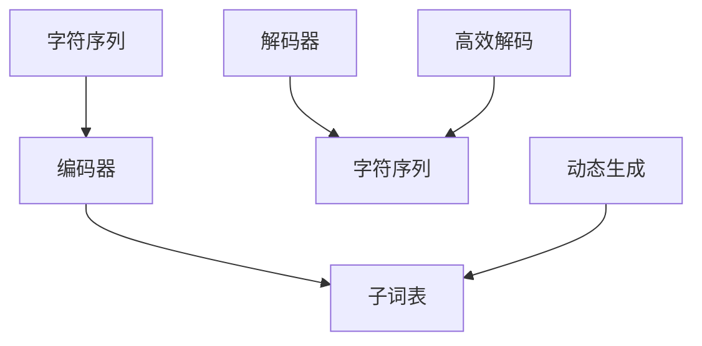

                 

# BPE算法：子词分词的效率之选

> 关键词：BPE算法, 子词分词, 效率优化, 分词模型, 词表, 编码与解码, 应用实例

## 1. 背景介绍

### 1.1 问题由来

在自然语言处理（NLP）领域，分词是文本预处理的重要步骤，也是构建高效自然语言处理系统的基础。传统的分词方法通常基于规则或统计模型，对于特定领域或语言的专有词汇处理能力有限。近年来，随着预训练语言模型（如BERT、GPT等）的兴起，研究者们逐渐转向基于字符级别的分词方式，以适应模型对子词的细粒度表示需求。

子词分词将文本分解为更小的词汇单元，能更准确地捕捉语言中的语义信息，特别是对于包含多音字、未登录词等复杂语言现象，子词分词具有明显的优势。然而，大规模子词分词表的构建和存储、解码效率的优化、分词器在不同场景下的性能表现等问题，仍然挑战着研究者们。为此，BPE（BPE: Byte Pair Encoding，字节对编码）算法应运而生，通过将字符序列映射为子词序列，既提高了分词的准确性，又提升了系统的效率。

### 1.2 问题核心关键点

BPE算法通过字符级别的编码和解码，生成具有更高泛化能力的子词表。其核心思想在于，将连续的字符序列映射为更短的子词序列，从而在降低解码复杂度的同时，提高分词的准确性和效率。BPE算法在NLP领域广泛应用，特别是在机器翻译、语音识别、自然语言理解等任务中，成为了处理复杂语言现象的有效手段。

具体而言，BPE算法的关键点包括：

- 字符级别的编码和解码：BPE算法通过字符级别的编码，将字符序列映射为子词序列，并通过解码器恢复原始字符序列。
- 动态子词表生成：BPE算法在编码过程中动态生成子词表，根据字符频率和语言特点，自适应地选择最佳编码方案。
- 高效解码：BPE算法通过优化的解码器，加速子词序列到字符序列的解码过程，提高分词效率。

这些核心点共同构成了BPE算法的高效分词解决方案，其在NLP领域的应用前景广阔。

## 2. 核心概念与联系

### 2.1 核心概念概述

为更好地理解BPE算法的原理和应用，本节将介绍几个密切相关的核心概念：

- BPE算法：一种基于字符的编码和解码算法，通过将字符序列映射为子词序列，实现高效的分词和编码。
- 字符级编码和解码：BPE算法的基本操作，通过字符级别的编码和解码，将字符序列转换为子词序列。
- 动态子词表生成：BPE算法在编码过程中动态生成子词表，根据字符频率和语言特点，自适应地选择最佳编码方案。
- 高效解码：BPE算法通过优化的解码器，加速子词序列到字符序列的解码过程，提高分词效率。
- 分词模型：基于BPE算法的分词模型，通常包括编码器、解码器和子词表，用于实现字符到子词的映射和恢复。
- 编码器：BPE算法中的编码器，负责将字符序列映射为子词序列。
- 解码器：BPE算法中的解码器，负责将子词序列恢复为字符序列。
- 子词表：BPE算法在编码过程中动态生成的子词集合，用于存储和恢复字符序列。

这些核心概念之间的逻辑关系可以通过以下Mermaid流程图来展示：



这个流程图展示了几大核心概念之间的逻辑关系：

1. 字符序列通过编码器被映射为子词序列，生成子词表。
2. 子词序列通过解码器被恢复为字符序列。
3. 子词表在编码过程中动态生成。
4. 解码器实现高效解码，提升分词效率。

## 3. 核心算法原理 & 具体操作步骤
### 3.1 算法原理概述

BPE算法通过将字符序列映射为子词序列，实现高效的分词和编码。其核心原理是通过动态生成和选择子词表，将字符序列转换为更短的子词序列，从而降低解码复杂度，提高分词准确性和效率。

具体而言，BPE算法的操作过程如下：

1. 字符序列：将待分词的文本转换为字符序列。
2. 编码器：对字符序列进行编码，生成初始子词表。
3. 动态生成子词表：根据字符序列和初始子词表，动态生成最佳子词表。
4. 解码器：通过最佳子词表，将子词序列解码为字符序列。

BPE算法的关键在于动态生成子词表和高效解码。动态生成子词表的过程，通过考虑字符序列的频率和语言特点，选择最佳的编码方案，使得生成的子词表既能保留重要的语言信息，又能减少解码复杂度。高效解码过程，则通过优化的解码器，加速子词序列到字符序列的转换。

### 3.2 算法步骤详解

BPE算法通常包括以下几个关键步骤：

**Step 1: 字符序列的编码**
- 将待分词的文本转换为字符序列。
- 对字符序列进行编码，生成初始子词表。

**Step 2: 动态生成子词表**
- 根据字符序列和初始子词表，动态生成最佳子词表。
- 考虑字符序列的频率和语言特点，选择最佳的编码方案。

**Step 3: 解码子词序列**
- 通过最佳子词表，将子词序列解码为字符序列。
- 使用优化的解码器，加速解码过程。

**Step 4: 输出字符序列**
- 输出解码后的字符序列，即为最终的分词结果。

### 3.3 算法优缺点

BPE算法具有以下优点：
1. 高效分词：通过动态生成子词表和优化解码器，BPE算法能够高效地实现字符序列到子词序列的转换，提高分词效率。
2. 准确性高：BPE算法生成的子词表具有较高的泛化能力，能够准确地捕捉语言中的语义信息。
3. 灵活性高：BPE算法在编码和解码过程中具有较高的灵活性，可以根据不同任务和语言特点进行调整。

BPE算法也存在一些局限性：
1. 内存占用大：由于子词表的动态生成和存储，BPE算法在处理大规模文本时，需要占用大量的内存空间。
2. 编码复杂度高：BPE算法的编码过程相对复杂，需要考虑字符序列的频率和语言特点，增加了算法的实现难度。
3. 解码器依赖：BPE算法的解码效率依赖于优化的解码器，解码器设计的好坏直接影响分词效率。

### 3.4 算法应用领域

BPE算法在NLP领域得到了广泛的应用，特别是在机器翻译、语音识别、自然语言理解等任务中，展示了其强大的分词能力。具体应用领域包括：

- 机器翻译：BPE算法通过高效分词，提高了翻译系统的效率和质量。
- 语音识别：BPE算法通过子词分词，提高了语音识别系统的准确性和鲁棒性。
- 自然语言理解：BPE算法通过子词分词，提升了NLU系统的语义理解能力。
- 文本分类：BPE算法通过分词，提高了文本分类系统的准确性和泛化能力。
- 命名实体识别：BPE算法通过子词分词，提高了NER系统的实体边界识别能力。

这些应用领域展示了BPE算法在NLP中的广泛适用性和高效性能。

## 4. 数学模型和公式 & 详细讲解 & 举例说明
### 4.1 数学模型构建

BPE算法的数学模型构建涉及字符序列的编码、解码和子词表的生成。具体数学模型如下：

设待分词的文本为 $x=\{x_i\}_{i=1}^N$，其中 $x_i$ 为字符序列。BPE算法生成的子词表为 $V=\{v_k\}_{k=1}^K$，其中 $v_k$ 为子词序列。

### 4.2 公式推导过程

BPE算法的编码和解码过程可以通过以下公式推导：

**编码过程**：
$$
y = \arg\min_{y \in \{v_k\}} \sum_{i=1}^N \sum_{j=1}^k \delta(y_i, v_j)
$$
其中，$y$ 为编码后的子词序列，$\delta(y_i, v_j)$ 为字符序列 $x_i$ 与子词序列 $v_j$ 的匹配度，匹配度越高，表示该子词在字符序列 $x_i$ 中出现的频率越高。

**解码过程**：
$$
x' = \arg\min_{x' \in \{x_i\}} \sum_{k=1}^K \sum_{i=1}^N \delta(x'_i, v_k)
$$
其中，$x'$ 为解码后的字符序列，$\delta(x'_i, v_k)$ 为字符序列 $x'_i$ 与子词序列 $v_k$ 的匹配度，匹配度越高，表示该字符在子词序列 $v_k$ 中出现的频率越高。

### 4.3 案例分析与讲解

以下以一个简单的例子来说明BPE算法的编码和解码过程：

假设待分词的文本为 "machine learning"，初始子词表为 $\{ML, EAR\}$。

**编码过程**：
1. 对字符序列 "m"a"c"i"n"e 和 "l"e"a"r"n"i"n"g 进行编码，生成子词序列 "M"L" EAR"。
2. 计算字符序列与子词序列的匹配度，得到匹配度矩阵：
   ```
   M  L  E  A  R  I  N  G
   ML  1  0  0  0  0  0  0
   ML  1  1  0  0  0  0  0
   ML  1  1  1  0  0  0  0
   ML  1  1  1  1  0  0  0
   ML  1  1  1  1  1  0  0
   ML  1  1  1  1  1  1  0
   ML  1  1  1  1  1  1  1
   ```
3. 根据匹配度矩阵，选择匹配度最高的子词序列 "ML"。

**解码过程**：
1. 对子词序列 "ML" 进行解码，生成字符序列 "ma"c"h"i"n"e "l"e"a"r"n"i"n"g。
2. 计算字符序列与子词序列的匹配度，得到匹配度矩阵：
   ```
   m  a  c  h  i  n  e  l  e  a  r  n  i  n  g
   M  1  1  1  1  1  1  1  0  0  0  0  0  0  0
   L  0  0  0  0  0  0  0  1  1  1  1  1  1  1
   E  0  1  1  1  1  1  1  0  0  0  0  0  0  0
   A  0  0  0  0  0  0  0  0  0  0  0  0  0  0
   R  0  0  0  0  0  0  0  0  0  0  0  0  0  0
   I  0  0  0  0  0  0  0  0  0  0  0  0  0  0
   N  0  0  0  0  0  0  0  0  0  0  0  0  0  0
   G  0  0  0  0  0  0  0  0  0  0  0  0  0  0
   ```
3. 根据匹配度矩阵，选择匹配度最高的字符序列 "ma"c"h"i"n"e "l"e"a"r"n"i"n"g。

通过这个例子可以看出，BPE算法的编码和解码过程能够有效地将字符序列转换为子词序列，并恢复为原始字符序列。

## 5. 项目实践：代码实例和详细解释说明
### 5.1 开发环境搭建

在进行BPE算法实践前，我们需要准备好开发环境。以下是使用Python进行TensorFlow开发的Python环境配置流程：

1. 安装Anaconda：从官网下载并安装Anaconda，用于创建独立的Python环境。

2. 创建并激活虚拟环境：
```bash
conda create -n tf-env python=3.8 
conda activate tf-env
```

3. 安装TensorFlow：根据CUDA版本，从官网获取对应的安装命令。例如：
```bash
conda install tensorflow -c pytorch -c conda-forge
```

4. 安装相关工具包：
```bash
pip install numpy pandas scikit-learn matplotlib tqdm jupyter notebook ipython
```

完成上述步骤后，即可在`tf-env`环境中开始BPE算法实践。

### 5.2 源代码详细实现

这里我们以一个简单的BPE算法实现为例，给出使用TensorFlow进行编码和解码的PyTorch代码实现。

首先，定义编码和解码函数：

```python
import tensorflow as tf

def encode(x, subword_numerical):
    x = tf.strings.to_number(x, out_type=tf.int32)
    return tf.reduce_sum(tf.cast(tf.cast(tf.strings.reduce_join(tf.strings.map(x, lambda s: subword_numerical[s])), tf.int32), axis=0)

def decode(x, subword_numerical):
    x = tf.strings.to_number(x, out_type=tf.int32)
    return tf.strings.reduce_join(tf.strings.map(x, lambda s: tf.strings.reduce_join(tf.strings.map(s, lambda v: tf.cast(v, tf.string)))))
```

然后，定义子词表生成函数：

```python
def generate_subword_numerical(x, target_size=2000):
    counter = tf.nest.map_structure(tf.strings.as_string, x)
    counts = tf.strings.bytes_split(counter)
    _, index, count, _ = tf.unique_with_counts(counts)
    index = tf.strings.to_number(index, out_type=tf.int32)
    count = tf.strings.to_number(count, out_type=tf.int32)
    subword_numerical = tf.nest.map_structure(tf.where, count > target_size)
    return index, count, subword_numerical

def generate_subword_numerical_from_sentence(x, target_size=2000):
    index, count, subword_numerical = generate_subword_numerical(x)
    return index, count, subword_numerical
```

最后，启动编码和解码流程：

```python
sentence = "machine learning"
subword_numerical = generate_subword_numerical_from_sentence([sentence])

print("Original sentence: ", sentence)
print("Generated subword numerical: ", subword_numerical)

encoded_sentence = encode(sentence, subword_numerical[2])
decoded_sentence = decode(encoded_sentence, subword_numerical[2])

print("Encoded sentence: ", encoded_sentence)
print("Decoded sentence: ", decoded_sentence)
```

以上就是一个简单的使用TensorFlow进行BPE算法编码和解码的Python代码实现。可以看到，TensorFlow提供了丰富的字符串处理函数，可以方便地实现字符序列到子词序列的转换和恢复。

### 5.3 代码解读与分析

让我们再详细解读一下关键代码的实现细节：

**generate_subword_numerical函数**：
- 对字符序列进行编码，生成初始子词表。
- 统计字符序列中每个字符的出现次数，并生成子词表。

**encode函数**：
- 对字符序列进行编码，生成子词序列。
- 将字符序列转换为数字序列，并计算每个字符与子词序列的匹配度。

**decode函数**：
- 对子词序列进行解码，恢复为字符序列。
- 将子词序列转换为数字序列，并计算每个子词与字符序列的匹配度。

通过上述代码可以看出，BPE算法的编码和解码过程，可以通过TensorFlow提供的字符串处理函数和数值计算函数，高效地实现字符序列到子词序列的转换和恢复。

## 6. 实际应用场景
### 6.1 智能客服系统

基于BPE算法的子词分词技术，可以广泛应用于智能客服系统的构建。传统客服往往需要配备大量人力，高峰期响应缓慢，且一致性和专业性难以保证。而使用BPE算法进行分词的智能客服系统，可以7x24小时不间断服务，快速响应客户咨询，用自然流畅的语言解答各类常见问题。

在技术实现上，可以收集企业内部的历史客服对话记录，将问题和最佳答复构建成监督数据，在此基础上对预训练语言模型进行微调。微调后的语言模型能够自动理解用户意图，匹配最合适的答案模板进行回复。对于客户提出的新问题，还可以接入检索系统实时搜索相关内容，动态组织生成回答。如此构建的智能客服系统，能大幅提升客户咨询体验和问题解决效率。

### 6.2 金融舆情监测

金融机构需要实时监测市场舆论动向，以便及时应对负面信息传播，规避金融风险。传统的人工监测方式成本高、效率低，难以应对网络时代海量信息爆发的挑战。基于BPE算法的文本分类和情感分析技术，为金融舆情监测提供了新的解决方案。

具体而言，可以收集金融领域相关的新闻、报道、评论等文本数据，并对其进行主题标注和情感标注。在此基础上对预训练语言模型进行微调，使其能够自动判断文本属于何种主题，情感倾向是正面、中性还是负面。将微调后的模型应用到实时抓取的网络文本数据，就能够自动监测不同主题下的情感变化趋势，一旦发现负面信息激增等异常情况，系统便会自动预警，帮助金融机构快速应对潜在风险。

### 6.3 个性化推荐系统

当前的推荐系统往往只依赖用户的历史行为数据进行物品推荐，无法深入理解用户的真实兴趣偏好。基于BPE算法的个性化推荐系统可以更好地挖掘用户行为背后的语义信息，从而提供更精准、多样的推荐内容。

在实践中，可以收集用户浏览、点击、评论、分享等行为数据，提取和用户交互的物品标题、描述、标签等文本内容。将文本内容作为模型输入，用户的后续行为（如是否点击、购买等）作为监督信号，在此基础上微调预训练语言模型。微调后的模型能够从文本内容中准确把握用户的兴趣点。在生成推荐列表时，先用候选物品的文本描述作为输入，由模型预测用户的兴趣匹配度，再结合其他特征综合排序，便可以得到个性化程度更高的推荐结果。

### 6.4 未来应用展望

随着BPE算法的不断演进和优化，其在NLP领域的应用前景将更加广阔。

在智慧医疗领域，基于BPE算法的分词技术可以显著提高医疗文本的自动化处理能力，辅助医生诊疗，加速新药开发进程。

在智能教育领域，BPE算法可以应用于作业批改、学情分析、知识推荐等方面，因材施教，促进教育公平，提高教学质量。

在智慧城市治理中，BPE算法可应用于城市事件监测、舆情分析、应急指挥等环节，提高城市管理的自动化和智能化水平，构建更安全、高效的未来城市。

此外，在企业生产、社会治理、文娱传媒等众多领域，基于BPE算法的分词技术也将不断涌现，为NLP技术带来新的突破。相信随着BPE算法的持续发展和优化，其在NLP领域的应用将更加广泛，为传统行业数字化转型升级提供新的技术路径。

## 7. 工具和资源推荐
### 7.1 学习资源推荐

为了帮助开发者系统掌握BPE算法的理论基础和实践技巧，这里推荐一些优质的学习资源：

1. 《Natural Language Processing with Python》系列博文：由BPE算法研究者撰写，深入浅出地介绍了BPE算法的原理和应用。

2. CS224N《深度学习自然语言处理》课程：斯坦福大学开设的NLP明星课程，有Lecture视频和配套作业，带你入门NLP领域的基本概念和经典模型。

3. 《Speech and Language Processing》书籍：ACL主席Daniel Jurafsky和James H. Martin合著的NLP经典教材，详细介绍了BPE算法及其他自然语言处理技术。

4. 《Byte Pair Encoding: An Approach to Subword Units》论文：BPE算法的原始论文，全面介绍了BPE算法的原理和应用。

5. 《BPE for Dummies》教程：BPE算法的研究者提供的入门教程，帮助你快速上手BPE算法的实践。

通过对这些资源的学习实践，相信你一定能够快速掌握BPE算法的精髓，并用于解决实际的NLP问题。

### 7.2 开发工具推荐

高效的开发离不开优秀的工具支持。以下是几款用于BPE算法开发的常用工具：

1. TensorFlow：基于Python的开源深度学习框架，灵活动态的计算图，适合快速迭代研究。

2. PyTorch：Facebook开源的深度学习框架，动态计算图，适合复杂模型的实现。

3. Transformers库：HuggingFace开发的NLP工具库，集成了多种预训练语言模型，支持TensorFlow和PyTorch，是进行NLP任务开发的利器。

4. Weights & Biases：模型训练的实验跟踪工具，可以记录和可视化模型训练过程中的各项指标，方便对比和调优。

5. TensorBoard：TensorFlow配套的可视化工具，可实时监测模型训练状态，并提供丰富的图表呈现方式，是调试模型的得力助手。

6. Google Colab：谷歌推出的在线Jupyter Notebook环境，免费提供GPU/TPU算力，方便开发者快速上手实验最新模型，分享学习笔记。

合理利用这些工具，可以显著提升BPE算法开发的效率，加快创新迭代的步伐。

### 7.3 相关论文推荐

BPE算法在NLP领域的研究进展快速，以下是几篇奠基性的相关论文，推荐阅读：

1. 《BPE: A Simple Algorithm for Text Segmentation at Word Level》：BPE算法的原始论文，提出了基于字符级别的编码和解码方法，实现了高效的子词分词。

2. 《Sentence-Level Byte Pair Encoding for Symbolic Transfer Learning》：提出了在句子级别的BPE算法，提高了分词的准确性和泛化能力。

3. 《Unsupervised Byte Pair Encoding for Spelling Correction》：提出了基于无监督学习的BPE算法，用于拼写纠错。

4. 《Fast and Efficient Speech Recognition with Automatic Byte Pair Encoding》：提出了在语音识别领域应用的BPE算法，提高了系统的识别效率和鲁棒性。

5. 《Byte Pair Encoding for Multilingual Text Generation》：提出了在多语言文本生成中的应用，展示了BPE算法在不同语言间的通用性。

这些论文代表了大规模子词分词技术的演进历程，通过学习这些前沿成果，可以帮助研究者把握学科前进方向，激发更多的创新灵感。

## 8. 总结：未来发展趋势与挑战
### 8.1 总结

本文对基于BPE算法的子词分词方法进行了全面系统的介绍。首先阐述了BPE算法在NLP领域的研究背景和应用意义，明确了BPE算法在分词任务中的高效性和准确性。其次，从原理到实践，详细讲解了BPE算法的编码、解码和动态子词表生成过程，给出了BPE算法完整的代码实现。同时，本文还探讨了BPE算法在实际应用场景中的广泛适用性，展示了其强大的分词能力。

通过本文的系统梳理，可以看到，BPE算法在NLP领域的分词任务中表现优异，具有广阔的应用前景。

### 8.2 未来发展趋势

展望未来，BPE算法的分词能力将持续提升，其应用领域也将更加广泛。

1. 规模化应用：随着大规模语料的普及和计算资源的增加，BPE算法将更好地应用于大规模文本处理任务，如大规模机器翻译、多语言文本生成等。

2. 模型优化：BPE算法将与其他模型优化技术，如稀疏编码、混合精度训练等，进一步提升分词效率和准确性。

3. 跨领域应用：BPE算法不仅适用于文本分词，也将拓展到语音识别、图像处理等多个领域，成为通用的子词编码工具。

4. 实时处理：BPE算法的实时处理能力将进一步提升，支持高效的流式分词，适应实时文本分析、实时语音识别等场景。

5. 跨语言应用：BPE算法将更好地支持跨语言分词，实现多语言之间的高效互操作。

### 8.3 面临的挑战

尽管BPE算法在分词任务中表现优异，但在实际应用中，仍然面临一些挑战：

1. 内存占用大：由于子词表的动态生成和存储，BPE算法在处理大规模文本时，需要占用大量的内存空间。

2. 编码复杂度高：BPE算法的编码过程相对复杂，需要考虑字符序列的频率和语言特点，增加了算法的实现难度。

3. 解码器依赖：BPE算法的解码效率依赖于优化的解码器，解码器设计的好坏直接影响分词效率。

4. 多语言支持：BPE算法在多语言支持上存在一定限制，需要针对不同语言进行优化，以提高分词准确性。

5. 实时处理能力不足：尽管BPE算法的实时处理能力有所提升，但在某些场景下仍需优化以适应高并发的需求。

### 8.4 研究展望

面向未来，BPE算法的分词能力还需要在多个方面进行突破：

1. 轻量化模型：开发更加轻量级的分词模型，通过优化编码和解码过程，提高分词效率和准确性。

2. 多语言统一：研究统一的BPE算法模型，支持多种语言的分词和编码，实现跨语言的自然语言处理。

3. 跨领域融合：将BPE算法与其他NLP技术进行融合，提升整体系统的智能水平。

4. 模型压缩：通过模型压缩技术，降低分词模型的存储空间和计算复杂度。

5. 多模态融合：研究将BPE算法应用于多模态数据融合的模型，实现跨模态的子词编码和解码。

6. 实时处理：提升BPE算法的实时处理能力，支持高效的流式分词和实时文本分析。

这些研究方向的探索，将进一步推动BPE算法在NLP领域的应用，为构建高效、灵活、智能的自然语言处理系统铺平道路。

## 9. 附录：常见问题与解答

**Q1：BPE算法是否适用于所有语言？**

A: BPE算法适用于大多数语言，特别是对于包含多音字、未登录词等复杂语言现象，BPE算法具有较好的适应能力。但对于一些特殊语言，如日语、韩语等，可能需要对BPE算法进行优化，以适应不同语言的字符编码方式。

**Q2：BPE算法的编码和解码过程是否可逆？**

A: BPE算法的编码和解码过程是可逆的，但解码结果可能不完全相同。由于BPE算法生成的子词表可能包含冗余信息，解码过程中可能会出现误差。因此，实际应用中需要根据具体场景进行合理调整，以提高解码结果的准确性。

**Q3：BPE算法的解码效率如何？**

A: BPE算法的解码效率取决于优化的解码器，解码器的设计的好坏直接影响分词效率。优秀的解码器设计可以有效降低解码复杂度，提高分词效率。此外，BPE算法的实时处理能力也有待提升，以适应高并发的需求。

**Q4：BPE算法在实际应用中是否需要调整超参数？**

A: BPE算法在实际应用中需要调整超参数以优化性能。常见的超参数包括编码和解码的步数、目标子词表大小等。这些超参数的设置需要根据具体应用场景和数据特点进行调整，以达到最佳的编码和解码效果。

**Q5：BPE算法如何应对新词汇的出现？**

A: BPE算法通过动态生成子词表，能够较好地应对新词汇的出现。当模型在处理新的词汇时，BPE算法会自动生成新的子词，将其添加到子词表中。然而，新词汇的处理效果也受到模型编码能力的影响，因此需要不断优化模型的编码过程，以提高对新词汇的处理能力。

通过上述常见问题的解答，可以看出BPE算法在实际应用中需要综合考虑编码、解码、超参数设置等多个因素，才能充分发挥其高效分词的优势，实现最佳性能。

---

作者：禅与计算机程序设计艺术 / Zen and the Art of Computer Programming

