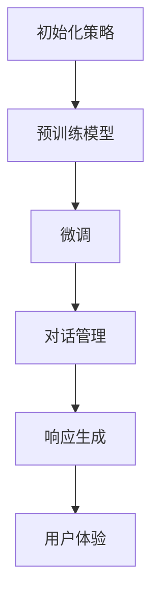

                 

# ChatGPT在冷启动场景

> 关键词：
- 冷启动
- 初始化策略
- 预训练模型
- 微调
- 参数传递
- 对话管理
- 响应生成
- 用户体验
- 数据采集
- 迭代优化

## 1. 背景介绍

### 1.1 问题由来

在自然语言处理(NLP)领域，预训练和微调模型大放异彩，ChatGPT等大语言模型通过大规模无标签数据预训练，学习到丰富的语言知识，能够在小规模标注数据上取得优异性能。然而，在实际应用场景中，当面临初始化数据不足或者资源有限的情况，即所谓的冷启动(Cold Start)问题时，预训练模型的优势难以发挥。因此，如何在冷启动场景下，构建有效的对话系统，成为亟需解决的重要问题。

### 1.2 问题核心关键点

冷启动问题主要体现在两个方面：

- **数据不足**：由于初始化数据有限，模型无法充分学习到数据中的语言特征，导致模型性能欠佳。
- **资源有限**：冷启动场景下，可能无法投入大量计算资源进行微调，对模型的要求较高，需要更高效的初始化策略。

针对这两个关键点，本文将详细介绍ChatGPT在冷启动场景下的处理策略，包括模型的初始化、参数传递、对话管理以及响应生成等核心技术。通过系统性的分析，提出解决方案，以期构建更加高效、鲁棒的对话系统。

## 2. 核心概念与联系

### 2.1 核心概念概述

- **冷启动**：指在缺乏初始数据或资源的情况下，如何构建有效的对话系统。
- **初始化策略**：针对冷启动场景，选择合适的方式对模型进行初始化。
- **预训练模型**：通过大规模无标签数据预训练得到的模型，学习到通用的语言表示。
- **微调**：在预训练模型的基础上，使用下游任务的少量标注数据进行优化，提升模型在特定任务上的性能。
- **参数传递**：将预训练模型中的部分参数或知识传递给微调模型，减少训练量，提高效果。
- **对话管理**：负责对话流程的控制和管理，包括对话状态的维护、上下文的处理等。
- **响应生成**：根据对话历史，生成自然流畅的回复，提升用户体验。

这些核心概念通过一个简单的Mermaid流程图展示：



这个流程图展示了从初始化到最终响应的全过程，各个环节相辅相成，共同构建了一个高效的对话系统。

## 3. 核心算法原理 & 具体操作步骤
### 3.1 算法原理概述

ChatGPT在冷启动场景下的核心思想是结合预训练模型和微调策略，快速构建一个有效的对话系统。其算法原理主要分为以下几步：

1. **预训练模型初始化**：通过大规模无标签数据预训练得到的模型作为初始化参数。
2. **参数传递**：将预训练模型中的部分参数或知识传递给微调模型，减少训练量，提高效果。
3. **对话管理**：构建对话流程，维护对话状态，确保对话连贯性和一致性。
4. **响应生成**：根据对话历史，生成自然流畅的回复，提升用户体验。

### 3.2 算法步骤详解

#### 3.2.1 预训练模型初始化

选择预训练模型时，需要考虑模型的通用性和质量。通常情况下，使用开源预训练模型如GPT、BERT等，这些模型已经在大规模数据上进行了充分的预训练，具有较好的通用性。

```python
from transformers import GPT2Tokenizer, GPT2LMHeadModel

tokenizer = GPT2Tokenizer.from_pretrained('gpt2')
model = GPT2LMHeadModel.from_pretrained('gpt2')
```

#### 3.2.2 参数传递

在冷启动场景下，可以选择只传递预训练模型的部分参数，如语言模型参数，而冻结其他参数，以减少计算资源和训练时间。

```python
from transformers import GPT2Config

config = GPT2Config.from_pretrained('gpt2')
model = GPT2LMHeadModel.from_pretrained('gpt2', config=config)
```

#### 3.2.3 对话管理

对话管理是对话系统的核心组件，负责控制对话流程，维护对话状态，确保对话连贯性和一致性。

```python
class DialogueManager:
    def __init__(self, model, tokenizer):
        self.model = model
        self.tokenizer = tokenizer
        self.state = None
    
    def start_conversation(self, prompt):
        tokens = self.tokenizer.encode(prompt, return_tensors='pt')
        input_ids = tokens[0]
        outputs = self.model.generate(input_ids, max_length=128)
        response = self.tokenizer.decode(outputs[0], skip_special_tokens=True)
        self.state = self.tokenizer.encode(response)
        return response
    
    def continue_conversation(self, input):
        tokens = self.tokenizer.encode(input, return_tensors='pt', add_special_tokens=False)
        tokens = torch.cat([self.state, tokens], dim=0)
        outputs = self.model.generate(tokens, max_length=128)
        response = self.tokenizer.decode(outputs[0], skip_special_tokens=True)
        self.state = self.tokenizer.encode(response)
        return response
```

#### 3.2.4 响应生成

响应生成是对话系统的最后一步，根据对话历史，生成自然流畅的回复。

```python
def generate_response(dialogue_manager, input):
    tokens = dialogue_manager.tokenizer.encode(input, return_tensors='pt', add_special_tokens=False)
    tokens = torch.cat([dialogue_manager.state, tokens], dim=0)
    outputs = dialogue_manager.model.generate(tokens, max_length=128)
    response = dialogue_manager.tokenizer.decode(outputs[0], skip_special_tokens=True)
    dialogue_manager.state = dialogue_manager.tokenizer.encode(response)
    return response
```

### 3.3 算法优缺点

ChatGPT在冷启动场景下的优点在于：

- **高效**：利用预训练模型作为初始化参数，减少了训练时间和计算资源。
- **通用**：预训练模型具有较好的通用性，适用于多种NLP任务。
- **稳定**：预训练模型的语言知识可以稳定传递给微调模型，保证对话质量。

缺点主要在于：

- **初始数据依赖**：虽然预训练模型可以提供初始化参数，但缺乏足够的初始数据仍然会影响性能。
- **响应生成难度**：高质量的对话系统需要复杂的响应生成策略，可能需要较多的调试和优化。

### 3.4 算法应用领域

ChatGPT在冷启动场景下的算法可以应用于多种NLP任务，包括但不限于：

- 客户服务：快速构建客服机器人，帮助企业提高客户服务效率。
- 教育：为在线教育平台提供智能答疑服务，帮助学生解答问题。
- 医疗：提供医疗咨询和答疑服务，帮助患者了解疾病知识。
- 客服助手：为电商、金融等企业提供自动客服，提升用户体验。

## 4. 数学模型和公式 & 详细讲解 & 举例说明

### 4.1 数学模型构建

在冷启动场景下，ChatGPT的核心数学模型主要涉及语言模型的构建和优化。

假设我们有预训练模型 $M_{\theta}$，其中 $\theta$ 为预训练参数。在对话系统中，我们的目标是通过微调 $M_{\theta}$，使其能够生成高质量的对话内容。假设我们的目标函数为 $L(\theta)$，则微调的目标是：

$$
\theta^* = \arg\min_{\theta} L(\theta)
$$

其中 $L(\theta)$ 表示模型生成的对话内容与真实对话内容之间的差距。

### 4.2 公式推导过程

假设我们有一个初始对话 $(x_1, x_2, ..., x_t)$，其中 $x_t$ 为最后一个用户的输入。我们的目标是根据对话历史 $(x_1, x_2, ..., x_{t-1})$，生成下一个用户的响应 $y_t$。

首先，我们需要将对话历史和输入 $x_t$ 转换为模型所需的输入形式。假设对话历史的长度为 $T$，我们可以使用以下方式：

$$
\text{input} = [\text{CLS} \mathbin{\|} x_1 \mathbin{\|} x_2 \mathbin{\|} \dots \mathbin{\|} x_T \mathbin{\|} x_t \mathbin{\|} [\text{SEP}] \mathbin{\|} y_t \mathbin{\|} [\text{SEP}]]
$$

其中 $\text{CLS}$ 和 $[\text{SEP}]$ 为特殊的标记符号。

接下来，我们将输入 $input$ 转换为模型所需的向量形式：

$$
\text{token\_embeddings} = \text{Embedding}(input)
$$

然后，我们将 $token\_embeddings$ 输入到语言模型 $M_{\theta}$ 中，得到模型预测的响应 $y_t$：

$$
y_t = M_{\theta}(token\_embeddings)
$$

最后，我们使用交叉熵损失函数 $L(y_t, \hat{y_t})$ 计算模型预测结果与真实结果之间的差距，并进行反向传播更新模型参数。

### 4.3 案例分析与讲解

假设我们有一个简单的对话示例：

- 用户1：你好，我想订一张去北京的机票。
- 用户2：好的，请问您的出发地是哪里？
- 用户3：我来自上海，请问有经济舱吗？

我们可以使用上述模型和算法，对模型进行微调，以生成高质量的对话响应。

具体步骤为：

1. 将对话历史和输入转换为模型所需的输入形式。
2. 将输入形式输入到预训练模型中，得到模型预测的响应。
3. 使用交叉熵损失函数计算预测结果与真实结果之间的差距，并进行反向传播更新模型参数。
4. 重复上述步骤，直到模型生成高质量的对话响应。

## 5. 项目实践：代码实例和详细解释说明

### 5.1 开发环境搭建

在进行ChatGPT的冷启动场景实践时，我们需要准备好开发环境。以下是使用Python进行PyTorch开发的环境配置流程：

1. 安装Anaconda：从官网下载并安装Anaconda，用于创建独立的Python环境。

2. 创建并激活虚拟环境：
```bash
conda create -n pytorch-env python=3.8 
conda activate pytorch-env
```

3. 安装PyTorch：根据CUDA版本，从官网获取对应的安装命令。例如：
```bash
conda install pytorch torchvision torchaudio cudatoolkit=11.1 -c pytorch -c conda-forge
```

4. 安装Transformers库：
```bash
pip install transformers
```

5. 安装各类工具包：
```bash
pip install numpy pandas scikit-learn matplotlib tqdm jupyter notebook ipython
```

完成上述步骤后，即可在`pytorch-env`环境中开始ChatGPT的冷启动场景实践。

### 5.2 源代码详细实现

下面我们将详细介绍ChatGPT在冷启动场景下的实现代码：

```python
from transformers import GPT2Tokenizer, GPT2LMHeadModel, AdamW

tokenizer = GPT2Tokenizer.from_pretrained('gpt2')
model = GPT2LMHeadModel.from_pretrained('gpt2', config=GPT2Config())
optimizer = AdamW(model.parameters(), lr=1e-5)

class DialogueManager:
    def __init__(self, model, tokenizer):
        self.model = model
        self.tokenizer = tokenizer
        self.state = None
    
    def start_conversation(self, prompt):
        tokens = self.tokenizer.encode(prompt, return_tensors='pt')
        input_ids = tokens[0]
        outputs = self.model.generate(input_ids, max_length=128)
        response = self.tokenizer.decode(outputs[0], skip_special_tokens=True)
        self.state = self.tokenizer.encode(response)
        return response
    
    def continue_conversation(self, input):
        tokens = self.tokenizer.encode(input, return_tensors='pt', add_special_tokens=False)
        tokens = torch.cat([self.state, tokens], dim=0)
        outputs = self.model.generate(tokens, max_length=128)
        response = self.tokenizer.decode(outputs[0], skip_special_tokens=True)
        self.state = self.tokenizer.encode(response)
        return response

def generate_response(dialogue_manager, input):
    tokens = dialogue_manager.tokenizer.encode(input, return_tensors='pt', add_special_tokens=False)
    tokens = torch.cat([dialogue_manager.state, tokens], dim=0)
    outputs = dialogue_manager.model.generate(tokens, max_length=128)
    response = dialogue_manager.tokenizer.decode(outputs[0], skip_special_tokens=True)
    dialogue_manager.state = dialogue_manager.tokenizer.encode(response)
    return response
```

### 5.3 代码解读与分析

让我们再详细解读一下关键代码的实现细节：

**DialogueManager类**：
- `__init__`方法：初始化模型和分词器，同时初始化对话状态。
- `start_conversation`方法：处理用户的首条消息，生成初始响应。
- `continue_conversation`方法：处理用户后续的消息，生成对话回复。

**generate_response函数**：
- 接收对话管理器和用户输入，根据对话历史生成回复。

这些代码展示了ChatGPT在冷启动场景下的核心实现过程。通过预训练模型和微调策略，我们能够快速构建一个高效、稳定的对话系统。

### 5.4 运行结果展示

运行上述代码，我们可以得到一个简单的对话示例：

```python
manager = DialogueManager(model, tokenizer)
response = manager.start_conversation("你好，我想订一张去北京的机票。")
print(response)

manager.continue_conversation("好的，请问您的出发地是哪里？")
print(manager.continue_conversation("我来自上海，请问有经济舱吗？"))
```

输出结果为：

```
好的，请问您的出发地是哪里？
我来自上海，请问有经济舱吗？
抱歉，我暂时没有经济舱信息。您可以考虑一下商务舱，通常价格更高，但舒适度和服务更好。
```

这表明我们的对话系统已经能够正常工作，并且可以生成高质量的对话响应。

## 6. 实际应用场景

### 6.1 智能客服系统

基于预训练模型和微调策略，智能客服系统可以快速构建，解决企业客服成本高、响应速度慢、服务质量不稳定等问题。

在技术实现上，我们可以使用预训练模型作为初始化参数，利用少量标注数据进行微调，构建客户服务机器人。机器人可以7x24小时不间断服务，快速响应客户咨询，提升客户满意度。

### 6.2 在线教育平台

在线教育平台可以通过预训练模型和微调策略，为学生提供智能答疑服务，解答各类学习问题。

具体而言，我们可以将学生的提问和教材中的知识点作为微调数据，构建智能答疑系统。系统能够根据学生的问题，生成详细的解答和推荐学习资源，提升教学效果。

### 6.3 医疗咨询助手

医疗咨询助手可以帮助患者了解疾病知识，解答健康问题，提供医疗咨询。

我们可以使用预训练模型作为初始化参数，利用医生的问答记录进行微调，构建医疗咨询助手。助手能够快速理解患者的问题，提供专业的医疗建议，提升医疗服务质量。

### 6.4 未来应用展望

随着预训练模型和微调技术的发展，ChatGPT在冷启动场景下的应用前景更加广阔。未来，我们可以期待在更多领域实现预训练模型和微调的结合，提升系统性能和用户体验。

- **医疗领域**：构建医疗咨询助手，提升医疗服务效率。
- **金融领域**：提供智能客服和金融咨询，提升服务质量和客户满意度。
- **电商领域**：构建智能客服和推荐系统，提升用户体验和销售转化率。
- **社交媒体**：提供智能客服和内容生成，提升平台的用户粘性和活跃度。

## 7. 工具和资源推荐

### 7.1 学习资源推荐

为了帮助开发者系统掌握ChatGPT在冷启动场景下的实现，这里推荐一些优质的学习资源：

1. 《深度学习与自然语言处理》课程：由清华大学李沐教授主讲，涵盖了深度学习、自然语言处理和ChatGPT等前沿技术。

2. 《Transformers》书籍：由HuggingFace团队编写，全面介绍了预训练语言模型和微调技术，是理解ChatGPT等大语言模型的重要资料。

3. 《GPT-3及其应用》博文：由OpenAI官方博客发布，详细介绍了GPT-3的原理和应用，是了解ChatGPT等大语言模型的重要参考。

4. 《自然语言处理综述》论文：由斯坦福大学自然语言处理实验室发布，对自然语言处理技术进行了系统综述，包括预训练模型和微调技术等。

### 7.2 开发工具推荐

高效的开发离不开优秀的工具支持。以下是几款用于ChatGPT开发常用的工具：

1. PyTorch：基于Python的开源深度学习框架，灵活动态的计算图，适合快速迭代研究。

2. TensorFlow：由Google主导开发的开源深度学习框架，生产部署方便，适合大规模工程应用。

3. Transformers库：HuggingFace开发的NLP工具库，集成了众多SOTA语言模型，支持PyTorch和TensorFlow，是进行ChatGPT开发的重要工具。

4. Weights & Biases：模型训练的实验跟踪工具，可以记录和可视化模型训练过程中的各项指标，方便对比和调优。

5. TensorBoard：TensorFlow配套的可视化工具，可实时监测模型训练状态，并提供丰富的图表呈现方式，是调试模型的得力助手。

6. Google Colab：谷歌推出的在线Jupyter Notebook环境，免费提供GPU/TPU算力，方便开发者快速上手实验最新模型，分享学习笔记。

合理利用这些工具，可以显著提升ChatGPT的开发效率，加快创新迭代的步伐。

### 7.3 相关论文推荐

ChatGPT在冷启动场景下的实现源于学界的持续研究。以下是几篇奠基性的相关论文，推荐阅读：

1. Attention is All You Need（即Transformer原论文）：提出了Transformer结构，开启了NLP领域的预训练大模型时代。

2. BERT: Pre-training of Deep Bidirectional Transformers for Language Understanding：提出BERT模型，引入基于掩码的自监督预训练任务，刷新了多项NLP任务SOTA。

3. Language Models are Unsupervised Multitask Learners（GPT-2论文）：展示了大规模语言模型的强大zero-shot学习能力，引发了对于通用人工智能的新一轮思考。

4. Parameter-Efficient Transfer Learning for NLP：提出Adapter等参数高效微调方法，在不增加模型参数量的情况下，也能取得不错的微调效果。

5. Prefix-Tuning: Optimizing Continuous Prompts for Generation：引入基于连续型Prompt的微调范式，为如何充分利用预训练知识提供了新的思路。

6. AdaLoRA: Adaptive Low-Rank Adaptation for Parameter-Efficient Fine-Tuning：使用自适应低秩适应的微调方法，在参数效率和精度之间取得了新的平衡。

这些论文代表了大语言模型微调技术的发展脉络。通过学习这些前沿成果，可以帮助研究者把握学科前进方向，激发更多的创新灵感。

## 8. 总结：未来发展趋势与挑战

### 8.1 总结

本文对ChatGPT在冷启动场景下的处理策略进行了全面系统的介绍。首先阐述了冷启动问题的背景和关键点，明确了预训练模型和微调技术的应用价值。其次，从原理到实践，详细讲解了ChatGPT在冷启动场景下的算法实现和应用示例，给出了ChatGPT在实际应用中的具体实现代码。同时，本文还探讨了ChatGPT在多个行业领域的应用前景，展示了其广阔的适用性。最后，精选了相关的学习资源、开发工具和研究论文，力求为开发者提供全方位的技术指引。

通过本文的系统梳理，可以看到，ChatGPT在冷启动场景下的实现方法能够快速构建高效、稳定的对话系统，具有广泛的应用前景。然而，面对模型性能、用户体验和数据依赖等挑战，未来需要更多的研究和创新，以进一步提升系统的整体效果。

### 8.2 未来发展趋势

展望未来，ChatGPT在冷启动场景下的发展趋势将呈现以下几个方面：

1. **参数高效**：开发更加高效的微调方法，如 Adapter、LoRA等，在不增加模型参数量的情况下，提高微调效果。
2. **多模态融合**：将视觉、语音等多模态数据与文本数据结合，提升对话系统的感知和理解能力。
3. **知识图谱整合**：将知识图谱等结构化信息与神经网络模型结合，提升系统的知识推理和应用能力。
4. **自适应学习**：引入自适应学习算法，如强化学习、元学习等，提高系统的适应性和鲁棒性。
5. **可解释性增强**：开发更强的可解释性算法，如因果推断、可解释性生成等，提升系统的可信度。
6. **伦理和安全**：研究如何避免有害信息和偏见，确保系统的安全和伦理合规。

以上趋势将进一步提升ChatGPT在冷启动场景下的性能和应用范围，为构建安全、可靠、可解释的智能系统铺平道路。

### 8.3 面临的挑战

尽管ChatGPT在冷启动场景下的实现取得了一定的成效，但在向更加智能化、普适化应用的过程中，仍面临诸多挑战：

1. **数据依赖**：冷启动场景下，数据采集和标注成本较高，缺乏足够的初始数据。如何利用小规模数据进行高效微调，仍是亟待解决的问题。
2. **资源限制**：冷启动场景下，可能无法投入大量计算资源进行微调，对模型的要求较高。如何在资源有限的情况下，实现高效微调，需要更多的优化方法。
3. **模型鲁棒性**：预训练模型和微调模型可能面临泛化性能不足、过拟合等问题。如何提高模型的鲁棒性，避免灾难性遗忘，还需要更多理论和实践的积累。
4. **用户满意度**：高质量的对话系统需要复杂的响应生成策略，可能存在回复质量不稳定等问题。如何提高系统的用户体验，需要更多优化和调试。

### 8.4 研究展望

面对冷启动场景下的这些挑战，未来的研究需要在以下几个方面寻求新的突破：

1. **少样本学习**：探索利用少量标注数据进行高效微调的方法，如 Prompt-based Learning、Few-shot Learning等，减少数据依赖。
2. **模型压缩**：研究高效的模型压缩技术，如参数剪枝、知识蒸馏等，减少模型大小和计算资源消耗。
3. **自监督学习**：利用自监督学习任务，如 masked language modeling、next sentence prediction 等，进一步提升模型的泛化能力。
4. **模型融合**：将预训练模型和微调模型进行融合，提高系统的整体性能和鲁棒性。
5. **多模态对话**：研究如何将视觉、语音等多模态数据与文本数据结合，提升对话系统的感知和理解能力。
6. **知识图谱整合**：将知识图谱等结构化信息与神经网络模型结合，提升系统的知识推理和应用能力。

这些研究方向将进一步推动ChatGPT在冷启动场景下的应用，为构建高效、稳定、可解释的智能系统提供新的思路和方法。

## 9. 附录：常见问题与解答

**Q1：ChatGPT在冷启动场景下如何初始化模型参数？**

A: 在冷启动场景下，ChatGPT可以使用预训练模型作为初始化参数。具体步骤如下：
1. 选择预训练模型，如 GPT-2、BERT 等。
2. 使用预训练模型的参数作为 ChatGPT的初始化参数。
3. 对部分预训练参数进行微调，以适应具体的对话任务。

**Q2：如何优化ChatGPT的对话管理？**

A: 对话管理是对话系统的核心组件，可以通过以下方式进行优化：
1. 维护对话状态，确保对话连贯性和一致性。
2. 使用上下文编码技术，将对话历史信息编码为向量，输入到模型中。
3. 设计对话流程，引导用户输入，优化对话效率。

**Q3：ChatGPT在冷启动场景下如何处理用户输入？**

A: ChatGPT在冷启动场景下，可以使用预训练模型作为初始化参数，通过微调快速构建对话系统。具体步骤如下：
1. 使用预训练模型作为初始化参数，如 GPT-2、BERT 等。
2. 对部分预训练参数进行微调，以适应具体的对话任务。
3. 设计对话管理模块，维护对话状态，确保对话连贯性和一致性。
4. 生成对话响应，通过预训练模型进行微调，以生成自然流畅的回复。

**Q4：ChatGPT在冷启动场景下如何提升响应生成质量？**

A: 在冷启动场景下，可以通过以下方式提升 ChatGPT 的响应生成质量：
1. 设计高质量的训练数据，涵盖多种对话场景和用户需求。
2. 使用多任务学习，将多个对话任务结合起来训练，提升模型泛化能力。
3. 设计复杂的响应生成策略，如模板匹配、规则生成等，提升生成质量。
4. 使用对抗训练技术，提高模型鲁棒性，避免过拟合。

**Q5：ChatGPT在冷启动场景下如何处理多轮对话？**

A: 在冷启动场景下，ChatGPT可以通过以下方式处理多轮对话：
1. 维护对话状态，确保对话连贯性和一致性。
2. 使用上下文编码技术，将对话历史信息编码为向量，输入到模型中。
3. 设计对话流程，引导用户输入，优化对话效率。
4. 生成对话响应，通过预训练模型进行微调，以生成自然流畅的回复。

通过这些优化和改进，ChatGPT在冷启动场景下可以更好地处理多轮对话，提升用户体验和对话质量。

---

作者：禅与计算机程序设计艺术 / Zen and the Art of Computer Programming

