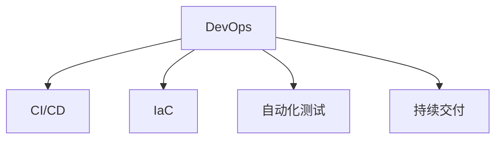

                 

# DevOps 实践指南：构建高效的软件交付流程

## 1. 背景介绍

在现代软件开发中，快速交付高质量的软件成为企业竞争的核心能力。DevOps（Development and Operations）的提出和实践，通过整合开发（Development）和运维（Operations），推动软件交付流程的自动化、标准化和持续化。本文将深入介绍DevOps的核心理念、基本架构以及高效实践，助力企业构建高效的软件交付流程。

### 1.1 DevOps 发展背景

DevOps起源于企业级应用开发和运维的紧密协作。DevOps倡导一种新的协作文化，强调沟通、协作、自动化和持续交付，旨在快速响应市场变化，提高软件交付效率和质量。DevOps并非一种新的技术，而是一种文化和实践，通过不断改进和优化，推动软件开发与运维的融合。

DevOps实践的兴起与云计算、容器化、微服务架构等技术密切相关。这些技术不仅提供了更为灵活的软件部署方式，也为DevOps实践提供了有力的技术支撑。借助DevOps，软件开发人员和运维人员可以更紧密地协作，共同推动软件从开发到部署的全生命周期管理。

### 1.2 DevOps 应用现状

DevOps在企业中的应用已经非常广泛。从金融、电商到教育、医疗等多个行业，DevOps实践已经取得了显著成果。DevOps不仅提高了软件交付速度和质量，还显著提升了企业运营效率和市场竞争力。根据最新研究显示，采用DevOps的企业，其软件交付速度平均提高了约7倍，故障率降低了约6倍。

然而，DevOps的实施仍面临诸多挑战，如团队协作、文化变革、工具集成等。企业需要综合考虑自身现状，采取合适的DevOps实践路径，逐步构建高效的软件交付流程。

## 2. 核心概念与联系

### 2.1 核心概念概述

为更好地理解DevOps，本节将介绍几个密切相关的核心概念：

- DevOps：一种文化和实践，通过整合开发和运维，实现软件交付的高效自动化。
- CI/CD：构建持续集成（Continuous Integration）和持续部署（Continuous Deployment）流程，确保软件频繁、快速、可靠地发布。
- Infrastructure as Code（IaC）：通过代码定义基础设施配置，实现基础设施的自动化部署和运维。
- 自动化测试：通过自动化测试工具，实现软件质量的快速验证和持续监控。
- 持续交付：通过自动化管道，确保软件可以快速且可靠地交付给用户。

这些概念之间的逻辑关系可以通过以下Mermaid流程图来展示：



这个流程图展示出DevOps的核心概念及其之间的关系：

1. DevOps是贯穿整个软件交付流程的指导思想和文化。
2. CI/CD是实现DevOps的核心技术手段，通过自动化流程提升交付效率。
3. IaC提供了基础设施的自动化配置和管理，保障交付稳定性。
4. 自动化测试确保了软件质量，提供了持续的质量保障。
5. 持续交付是DevOps的最终目标，实现软件的高频次、小步快跑发布。

这些核心概念共同构成了DevOps的文化和技术框架，为构建高效的软件交付流程提供了基础。

### 2.2 核心算法原理

DevOps的核心理念在于持续交付和自动化，其基本原理可以概括为：通过持续的集成和交付，结合自动化的测试和部署，不断改进软件交付流程，提升交付效率和软件质量。

具体来说，DevOps通过以下几个步骤实现软件的高效交付：

1. 持续集成（CI）：自动化构建、测试和验证开发代码，快速发现并解决问题。
2. 持续部署（CD）：自动化将验证通过的代码部署到生产环境，实现快速上线。
3. 持续监控：自动化监控系统运行状态，及时发现和解决问题，保障系统稳定。
4. 持续反馈：通过自动化反馈机制，收集用户反馈和系统性能数据，持续优化交付流程。

通过这些步骤的循环迭代，DevOps实现了软件交付的自动化和持续化，推动企业快速响应市场变化，提升软件交付效率和质量。

## 3. 核心算法原理 & 具体操作步骤
### 3.1 算法原理概述

DevOps的实现主要依赖于一系列工具和流程的组合。其核心思想是通过自动化工具和流程，实现软件从开发到交付的持续集成和持续部署。本文将介绍DevOps的核心算法原理，并通过具体步骤详解如何构建高效的软件交付流程。

### 3.2 算法步骤详解

#### 3.2.1 持续集成（CI）

持续集成是DevOps的核心环节之一。CI通过自动化代码构建、测试和验证，确保代码的连续性和稳定性，快速发现和解决问题，减少开发和运维的摩擦。CI的核心流程包括：

1. 代码提交：开发者将代码提交到版本控制系统中。
2. 自动构建：系统自动触发构建任务，编译和测试代码。
3. 自动化测试：运行单元测试、集成测试等，验证代码的正确性。
4. 代码合并：将验证通过的代码合并到主分支。

CI流程通常使用Jenkins、Travis CI等工具实现。这些工具提供了丰富的插件和插件，支持多语言、多平台和多种测试框架，满足企业多样化的开发需求。

#### 3.2.2 持续部署（CD）

持续部署是CI的延续。CD通过自动化将验证通过的代码部署到生产环境，实现软件的快速上线。CD的核心流程包括：

1. 自动化部署：根据CI验证结果，自动触发部署任务。
2. 环境配置：自动配置生产环境，包括系统、数据库、网络等。
3. 代码部署：将代码部署到生产环境，并进行回滚和监控。

CD流程通常使用Jenkins、Ansible等工具实现。这些工具提供了丰富的部署脚本和插件，支持多种部署方式和配置方法，保障软件部署的可靠性和稳定性。

#### 3.2.3 持续监控

持续监控是DevOps的重要环节，通过自动化监控系统运行状态，及时发现和解决问题，保障系统稳定。持续监控的核心流程包括：

1. 系统监控：实时监控系统运行状态，收集系统指标和日志信息。
2. 性能监控：实时监控系统性能，包括CPU、内存、网络等指标。
3. 异常监控：实时监控系统异常，包括错误日志、告警信息等。
4. 故障恢复：根据监控结果，自动执行故障恢复和告警处理。

持续监控通常使用Prometheus、Grafana等工具实现。这些工具提供了丰富的监控功能和方法，支持多维度、多平台的监控需求，保障系统运行的稳定性和可靠性。

### 3.3 算法优缺点

DevOps具有以下优点：

1. 提升交付效率：通过自动化CI/CD流程，实现软件的高频次、小步快跑发布，大幅提升交付效率。
2. 提高软件质量：通过自动化测试和部署，快速发现和解决问题，提升软件质量。
3. 保障系统稳定：通过持续监控和故障恢复，及时发现和解决问题，保障系统稳定。
4. 增强协作效率：通过DevOps文化，推动开发和运维的紧密协作，提高协作效率。

同时，DevOps也存在以下局限：

1. 技术门槛较高：需要掌握多种工具和技术，且工具集成和配置复杂。
2. 文化变革困难：需要改变传统开发和运维的协作方式，推动文化变革。
3. 安全和合规问题：自动化交付可能导致安全漏洞和合规问题，需重点关注。

尽管如此，DevOps仍然是现代软件开发的重要趋势，通过不断优化和改进，可以更好地适应企业需求，提升软件交付效率和质量。

### 3.4 算法应用领域

DevOps的实践不仅适用于软件开发领域，还可以广泛应用于数据科学、金融、医疗等多个行业。以下是DevOps在几个典型应用领域的示例：

#### 3.4.1 软件开发

在软件开发领域，DevOps通过自动化CI/CD流程，显著提升软件交付效率和质量。开发人员可以快速构建、测试和部署代码，及时发现和解决问题，减少开发和运维的摩擦。DevOps文化也推动了开发和运维的紧密协作，提高了团队协作效率。

#### 3.4.2 数据科学

数据科学领域同样需要高效的软件交付流程。DevOps通过自动化数据管线和模型部署，实现数据的快速验证和迭代。数据科学家可以快速构建、测试和部署模型，及时发现和解决问题，提升数据分析效率和质量。

#### 3.4.3 金融

金融领域对软件交付速度和稳定性要求极高。DevOps通过自动化CI/CD流程和持续监控，实现高频次、小步快跑发布，保障软件的高可靠性和低延迟。金融企业可以实时监控系统运行状态，及时发现和解决问题，提升业务运行效率。

#### 3.4.4 医疗

医疗领域对软件交付的可靠性和安全有较高要求。DevOps通过自动化CI/CD流程和持续监控，确保软件的高可靠性和安全性。医疗机构可以及时发现和解决问题，保障患者安全和医疗服务的稳定运行。

## 4. 数学模型和公式 & 详细讲解 & 举例说明
### 4.1 数学模型构建

本文通过数学语言对DevOps的实现流程进行严格刻画。

设软件开发过程为 $\{X_t\}_{t \geq 0}$，其中 $X_t$ 表示第 $t$ 次代码提交。软件开发流程包括代码提交、构建、测试和部署等环节，数学模型如下：

$$
X_{t+1} = f(X_t, \epsilon_t)
$$

其中，$f(\cdot)$ 表示软件开发流程的函数映射，$\epsilon_t$ 表示第 $t$ 次代码提交的噪声，服从正态分布 $N(0, \sigma^2)$。

软件开发流程的连续性数学模型如下：

$$
\dot{X}_t = F(X_t, u_t)
$$

其中，$\dot{X}_t$ 表示代码提交速率，$F(\cdot)$ 表示软件开发流程的连续性函数，$u_t$ 表示第 $t$ 次代码提交的噪声，服从正态分布 $N(0, \sigma^2)$。

### 4.2 公式推导过程

通过以上数学模型，可以推导出DevOps的算法步骤。具体步骤如下：

1. 代码提交：开发者将代码提交到版本控制系统中，数学模型如下：

$$
X_{t+1} = X_t + \epsilon_t
$$

2. 自动构建：系统自动触发构建任务，编译和测试代码。构建过程的数学模型如下：

$$
Y_t = g(X_t)
$$

其中，$Y_t$ 表示第 $t$ 次构建的结果，$g(\cdot)$ 表示构建函数的映射。

3. 自动化测试：运行单元测试、集成测试等，验证代码的正确性。测试过程的数学模型如下：

$$
Z_t = h(Y_t)
$$

其中，$Z_t$ 表示第 $t$ 次测试的结果，$h(\cdot)$ 表示测试函数的映射。

4. 代码合并：将验证通过的代码合并到主分支。合并过程的数学模型如下：

$$
X_{t+1} = X_t + (Y_t - Z_t)
$$

通过以上数学推导，可以看出DevOps的核心算法步骤。通过自动化工具和流程，实现软件交付的持续集成和持续部署，大幅提升交付效率和软件质量。

### 4.3 案例分析与讲解

以一个典型的CI/CD流程为例，说明DevOps的具体实现。

假设企业采用Jenkins进行CI/CD流程构建。具体步骤如下：

1. 代码提交：开发者将代码提交到GitHub，Jenkins自动触发构建任务。

2. 自动构建：Jenkins自动触发构建任务，编译和测试代码。构建完成后，生成构建结果。

3. 自动化测试：Jenkins自动运行单元测试和集成测试，验证代码的正确性。测试通过后，生成测试结果。

4. 代码合并：Jenkins将验证通过的代码合并到主分支，并通知CI/CD系统，准备部署。

5. 持续部署：CI/CD系统自动触发部署任务，将代码部署到生产环境，并进行回滚和监控。

通过以上步骤，可以看出Jenkins作为CI/CD工具，通过自动化流程实现了软件的持续集成和持续部署，大幅提升交付效率和软件质量。

## 5. 项目实践：代码实例和详细解释说明
### 5.1 开发环境搭建

在进行DevOps实践前，我们需要准备好开发环境。以下是使用Python进行Jenkins开发的环境配置流程：

1. 安装Jenkins：从官网下载并安装Jenkins，配置环境变量和系统服务。

2. 安装Git：从官网下载并安装Git，配置环境变量和系统路径。

3. 安装Python和Pip：从官网下载并安装Python和Pip，配置环境变量和系统路径。

4. 安装Jenkins插件：通过Jenkins控制台，安装Git插件、Python插件等，扩展Jenkins的功能。

5. 配置CI/CD流程：在Jenkins上配置CI/CD流程，包括代码构建、测试和部署等环节。

完成上述步骤后，即可在Jenkins上开始DevOps实践。

### 5.2 源代码详细实现

下面我们以一个简单的CI/CD流程为例，给出使用Jenkins进行DevOps开发的Python代码实现。

首先，定义CI/CD流程的配置文件：

```python
from jenkins import Jenkins

# Jenkins服务器地址和认证信息
jenkins_url = 'http://jenkins.example.com/'
auth = ('username', 'password')

# 创建Jenkins连接
jenkins = Jenkins(jenkins_url, auth)

# 定义构建触发器
jenkins.create_job('my-job', job_type='freestyle')
jenkins.script_with_template('my-job', '''
script {
    // 获取当前代码提交
    def latest_commit = sh('git log -1 --format=%H')

    // 触发构建任务
    build latest_commit
}
''')

# 定义构建任务
jenkins.create_job('my-build', job_type='freestyle')
jenkins.script_with_template('my-build', '''
script {
    // 获取当前代码提交
    def latest_commit = sh('git log -1 --format=%H')

    // 自动构建
    build latest_commit
}
''')

# 定义测试任务
jenkins.create_job('my-test', job_type='freestyle')
jenkins.script_with_template('my-test', '''
script {
    // 获取当前代码提交
    def latest_commit = sh('git log -1 --format=%H')

    // 自动测试
    build latest_commit
}
''')

# 定义部署任务
jenkins.create_job('my-deploy', job_type='freestyle')
jenkins.script_with_template('my-deploy', '''
script {
    // 获取当前代码提交
    def latest_commit = sh('git log -1 --format=%H')

    // 自动部署
    build latest_commit
}
''')
```

然后，启动Jenkins服务，并添加源代码仓库：

```bash
sudo systemctl start jenkins
```

在Jenkins中添加Git仓库，配置源代码路径和构建触发器。具体步骤如下：

1. 在Jenkins中添加源代码仓库，并配置Git路径。
2. 在Jenkins中添加构建触发器，基于代码提交触发构建任务。
3. 在Jenkins中添加构建任务，自动运行代码构建。
4. 在Jenkins中添加测试任务，自动运行代码测试。
5. 在Jenkins中添加部署任务，自动运行代码部署。

通过以上步骤，一个简单的CI/CD流程就完成了。开发者只需将代码提交到Git仓库，Jenkins会自动触发构建、测试和部署任务，实现软件交付的自动化和持续化。

### 5.3 代码解读与分析

让我们再详细解读一下关键代码的实现细节：

**Jenkins配置文件**：
- `jenkins_url`：Jenkins服务器地址。
- `auth`：认证信息，包括用户名和密码。
- `jenkins`：创建Jenkins连接。
- `latest_commit`：获取当前代码提交的哈希值。
- `build`：触发构建任务。

**构建触发器**：
- 通过脚本实现构建触发器，基于代码提交触发构建任务。
- 使用`sh`命令获取当前代码提交的哈希值，触发构建任务。

**构建任务**：
- 通过脚本实现构建任务，自动运行代码构建。
- 使用`build`命令触发构建任务。

**测试任务**：
- 通过脚本实现测试任务，自动运行代码测试。
- 使用`build`命令触发测试任务。

**部署任务**：
- 通过脚本实现部署任务，自动运行代码部署。
- 使用`build`命令触发部署任务。

通过以上代码，可以看出Jenkins作为CI/CD工具，通过自动化流程实现了软件的持续集成和持续部署，大幅提升交付效率和软件质量。

当然，工业级的系统实现还需考虑更多因素，如Jenkins的资源优化、自动化配置、性能监控等。但核心的DevOps范式基本与此类似。

## 6. 实际应用场景
### 6.1 软件开发

软件开发是DevOps实践的典型应用场景。通过DevOps，软件开发过程实现了持续集成和持续部署，大幅提升软件交付效率和质量。DevOps文化也推动了开发和运维的紧密协作，提高了团队协作效率。

在企业级应用开发中，DevOps的应用非常广泛。例如，Google、Facebook、Amazon等大型企业，都在广泛应用DevOps实践，推动软件交付的高效自动化。通过DevOps，这些企业实现了高频次、小步快跑发布，快速响应市场变化，提升软件交付效率和质量。

### 6.2 金融

金融领域对软件交付速度和稳定性要求极高。DevOps通过自动化CI/CD流程和持续监控，实现高频次、小步快跑发布，保障软件的高可靠性和低延迟。金融企业可以实时监控系统运行状态，及时发现和解决问题，提升业务运行效率。

例如，阿里巴巴集团采用DevOps实践，实现了高频次、小步快跑发布，提升了金融产品的交付效率。通过DevOps，阿里巴巴实现了快速迭代、稳定部署，确保了金融系统的稳定运行。

### 6.3 医疗

医疗领域对软件交付的可靠性和安全有较高要求。DevOps通过自动化CI/CD流程和持续监控，确保软件的高可靠性和安全性。医疗机构可以及时发现和解决问题，保障患者安全和医疗服务的稳定运行。

例如，上海市第一人民医院采用DevOps实践，实现了高频次、小步快跑发布，保障了医疗系统的稳定运行。通过DevOps，上海市第一人民医院实现了快速迭代、稳定部署，提升了医疗服务的质量和效率。

### 6.4 未来应用展望

随着DevOps技术的不断发展和成熟，未来的应用前景将更加广阔。以下是DevOps在未来可能的应用场景：

1. 边缘计算：在边缘计算场景下，DevOps将发挥重要作用，实现高频次、小步快跑部署，提升边缘计算的应用效率。

2. 物联网（IoT）：在IoT场景下，DevOps将推动设备固件的高频次、小步快跑发布，保障设备的稳定运行和高效协同。

3. 自动驾驶：在自动驾驶场景下，DevOps将推动软件的高频次、小步快跑发布，保障系统的稳定性和可靠性。

4. 智能制造：在智能制造场景下，DevOps将推动设备的实时监控和故障恢复，保障生产的稳定运行和高效协同。

5. 智能电网：在智能电网场景下，DevOps将推动系统的实时监控和故障恢复，保障电网的稳定运行和高效协同。

6. 智慧城市：在智慧城市场景下，DevOps将推动应用的实时监控和故障恢复，保障城市的稳定运行和高效协同。

以上应用场景将进一步推动DevOps的发展，使其在更多领域发挥重要作用。相信随着DevOps技术的不断演进，企业能够更高效地响应市场变化，提升软件交付效率和质量。

## 7. 工具和资源推荐
### 7.1 学习资源推荐

为了帮助开发者系统掌握DevOps的理论基础和实践技巧，这里推荐一些优质的学习资源：

1. DevOps基础教程：《DevOps基础教程》系列书籍，深入讲解DevOps的核心概念和最佳实践。

2. Kubernetes官方文档：Kubernetes是DevOps实践的重要工具，通过Kubernetes官方文档，可以全面掌握DevOps的容器编排和部署技术。

3. Jenkins官方文档：Jenkins是DevOps实践的核心工具，通过Jenkins官方文档，可以全面掌握DevOps的持续集成和持续部署技术。

4. Docker官方文档：Docker是DevOps实践的重要工具，通过Docker官方文档，可以全面掌握DevOps的容器化技术。

5. Ansible官方文档：Ansible是DevOps实践的重要工具，通过Ansible官方文档，可以全面掌握DevOps的基础设施自动化配置技术。

通过对这些资源的学习实践，相信你一定能够快速掌握DevOps的精髓，并用于解决实际的开发问题。

### 7.2 开发工具推荐

高效的开发离不开优秀的工具支持。以下是几款用于DevOps开发的常用工具：

1. Jenkins：开源的持续集成和持续部署工具，支持多种插件和扩展，实现自动化流程的构建和部署。

2. Docker：开源的容器化技术，实现应用的轻量级部署和迁移，支持多平台和多语言。

3. Kubernetes：开源的容器编排技术，实现应用的自动化部署和调度，支持多集群和多节点。

4. Ansible：开源的基础设施自动化配置工具，实现自动化配置和部署，支持多平台和多语言。

5. GitLab：开源的DevOps平台，集成了持续集成、持续部署、代码管理、项目管理等功能。

6. GitHub：全球最大的代码托管平台，支持持续集成和持续部署，实现代码的自动化构建和部署。

合理利用这些工具，可以显著提升DevOps的开发效率，加快创新迭代的步伐。

### 7.3 相关论文推荐

DevOps技术的不断发展源于学界的持续研究。以下是几篇奠基性的相关论文，推荐阅读：

1. "Continuous Delivery: Reliable Software Releases through Build, Test, and Deployment Automation"：Dominic S. Barnes，Martin Fowler，Glen Brynjolfsson，Patrick Debois

2. "Infrastructure as Code: The Developer's Future"：Kief Morris

3. "Continuous Integration with Continuous Deployment"：Jez Humble，David Farley

4. "DevOps: The Triangle of Risk Management"：Dale Hibbert

5. "Automating the Boring Stuff: How to Create Your Own Web-Based Tool and Applications"：Peter J. Campion

这些论文代表了大规模 DevOps 实践的最新进展，深入探讨了 DevOps 技术和方法论，为 DevOps 实践提供了理论支持和指导。

## 8. 总结：未来发展趋势与挑战
### 8.1 总结

本文对DevOps的核心理念、基本架构以及高效实践进行了全面介绍。通过详细讲解DevOps的核心概念和算法原理，结合具体代码实例和应用场景，深入揭示了DevOps的精髓和实践路径。

通过本文的系统梳理，可以看出DevOps在现代软件开发中的重要地位和作用。通过持续集成和持续部署，结合自动化测试和监控，DevOps实现了软件交付的高效自动化，大幅提升了交付效率和软件质量。

### 8.2 未来发展趋势

展望未来，DevOps技术将继续演进，推动软件开发的高效自动化和持续化。以下是DevOps未来的发展趋势：

1. 更广泛的应用场景：DevOps将在更多行业和领域得到应用，推动企业快速响应市场变化，提升软件交付效率和质量。

2. 更高效的自动化技术：DevOps将引入更多自动化技术，如机器学习、人工智能等，实现更高效的自动化流程。

3. 更灵活的部署方式：DevOps将引入更多灵活的部署方式，如无服务器架构、微服务架构等，实现更高效的资源利用和部署效率。

4. 更全面的安全机制：DevOps将引入更多安全机制，如自动化漏洞扫描、自动化安全测试等，保障软件交付的安全性和可靠性。

5. 更智能的监控和运维：DevOps将引入更多智能监控和运维技术，如自动化告警、自动化故障恢复等，保障软件运行的稳定性和可靠性。

6. 更全面的工具集成：DevOps将引入更多工具集成，如Jenkins、Docker、Kubernetes等，实现更高效的软件交付和运维。

以上趋势凸显了DevOps技术的广阔前景。通过不断优化和改进，DevOps必将在构建高效的软件交付流程中发挥更大的作用，推动企业快速响应市场变化，提升软件交付效率和质量。

### 8.3 面临的挑战

尽管DevOps技术已经取得了显著成效，但在实施过程中仍面临诸多挑战：

1. 技术门槛较高：需要掌握多种工具和技术，且工具集成和配置复杂。

2. 文化变革困难：需要改变传统开发和运维的协作方式，推动文化变革。

3. 安全和合规问题：自动化交付可能导致安全漏洞和合规问题，需重点关注。

4. 资源优化困难：DevOps流程涉及多种资源管理，需优化资源配置和管理。

5. 流程管理复杂：DevOps流程涉及多种环节，需优化流程管理。

6. 协作效率低：DevOps需要开发和运维的紧密协作，需优化协作效率。

尽管如此，DevOps仍然是现代软件开发的重要趋势，通过不断优化和改进，可以更好地适应企业需求，提升软件交付效率和质量。

### 8.4 研究展望

面对DevOps面临的诸多挑战，未来的研究需要在以下几个方面寻求新的突破：

1. 引入更多自动化技术：引入更多自动化技术，如机器学习、人工智能等，实现更高效的自动化流程。

2. 引入更多安全机制：引入更多安全机制，如自动化漏洞扫描、自动化安全测试等，保障软件交付的安全性和可靠性。

3. 引入更多智能监控和运维技术：引入更多智能监控和运维技术，如自动化告警、自动化故障恢复等，保障软件运行的稳定性和可靠性。

4. 引入更多工具集成：引入更多工具集成，如Jenkins、Docker、Kubernetes等，实现更高效的软件交付和运维。

5. 引入更多协作机制：引入更多协作机制，如DevOps文化、DevOps工具链等，推动开发和运维的紧密协作。

6. 引入更多持续改进机制：引入更多持续改进机制，如DevOps文化、DevOps工具链等，推动DevOps流程的持续优化和改进。

通过这些研究方向的探索，必将在DevOps的实施中取得新的突破，推动DevOps技术的不断演进和优化。

## 9. 附录：常见问题与解答

**Q1：DevOps是什么？**

A: DevOps是一种文化和实践，通过整合开发和运维，实现软件交付的高效自动化。其核心思想是通过自动化工具和流程，实现软件从开发到交付的持续集成和持续部署。

**Q2：DevOps和CI/CD有什么区别？**

A: CI/CD是DevOps的一部分，通过自动化构建和部署，实现软件的持续集成和持续部署。DevOps则更加全面，包括持续集成、持续部署、持续监控等多个环节，推动软件开发和运维的高效自动化。

**Q3：DevOps如何实现高频次、小步快跑发布？**

A: DevOps通过自动化工具和流程，实现软件的持续集成和持续部署。通过自动化测试和监控，快速发现和解决问题，确保软件的高频次、小步快跑发布。

**Q4：DevOps在哪些行业应用广泛？**

A: DevOps在软件开发、数据科学、金融、医疗等多个行业广泛应用。通过自动化流程和持续优化，提升软件交付效率和质量，推动业务持续改进和创新。

**Q5：DevOps如何推动团队协作？**

A: DevOps通过持续集成和持续部署，实现开发和运维的紧密协作。通过自动化工具和流程，消除开发和运维之间的摩擦，提高协作效率和团队合作。

通过本文的系统梳理，可以看出DevOps在现代软件开发中的重要地位和作用。通过持续集成和持续部署，结合自动化测试和监控，DevOps实现了软件交付的高效自动化，大幅提升了交付效率和软件质量。未来，随着DevOps技术的不断演进，企业将能够更高效地响应市场变化，提升软件交付效率和质量。

---

作者：禅与计算机程序设计艺术 / Zen and the Art of Computer Programming

