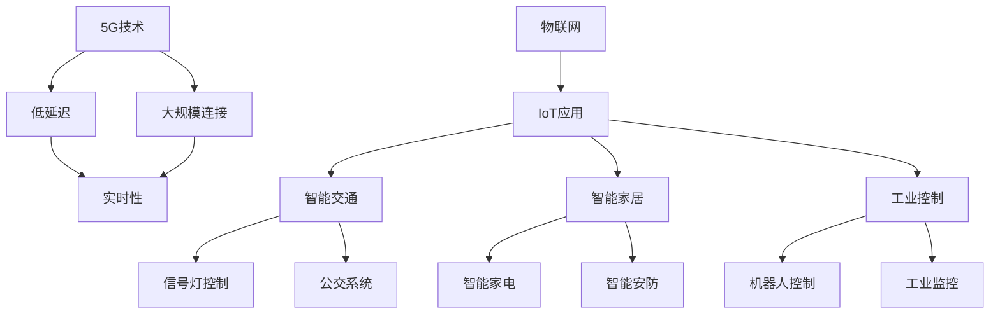

                 

## 1. 背景介绍

### 1.1 问题由来
随着物联网(IoT)应用的逐渐普及，众多物联网设备通过无线网络连接到网络平台，以便进行数据交互和资源共享。传统的网络技术，如3G和4G，在低延迟、高可靠性和连接密度方面存在明显不足。5G技术的到来，标志着下一代移动通信网络的发展，为物联网带来了前所未有的优势。

### 1.2 问题核心关键点
5G技术具有显著的通信能力提升，其高速率、低延迟、广覆盖和大连接特性，使得物联网设备能够进行更大规模的互连互通，支持更多的设备同时接入，并降低数据传输时延，从而在众多应用场景中展现出优势。

### 1.3 问题研究意义
研究5G技术在物联网中的应用，对于推动智能城市、智能交通、智能制造等领域的发展，具有重要意义。5G技术的应用，不仅可以提高数据的传输效率，还可以降低传输时延，实现更加实时和高效的数据交互，为众多物联网应用提供了可靠的基础保障。

## 2. 核心概念与联系

### 2.1 核心概念概述

为更好地理解5G物联网的核心概念和优势，本节将介绍几个关键概念：

- 5G（第五代移动通信技术）：相较于4G，5G提供了更高的数据速率、更低的延迟和更大的连接密度，能够支持大规模物联网设备的互联互通。

- 物联网（IoT）：通过各种传感器、设备和网络技术，实现物体与网络的互联和信息交换，以实现智能化的应用和服务。

- 低延迟连接：5G技术的低延迟特性，能够确保数据传输的实时性和可靠性，在工业控制、远程医疗等领域具有重要意义。

- 大规模连接：5G支持百万级别的设备连接，能够构建一个无处不在的物联网网络，广泛应用于智能交通、智能家居等领域。

这些核心概念通过以下Mermaid流程图来展示：



这个流程图展示了5G技术在物联网中的应用，以及低延迟和大规模连接对各类IoT应用的影响。

## 3. 核心算法原理 & 具体操作步骤
### 3.1 算法原理概述

5G物联网的核心优势在于其低延迟和大规模连接能力。这种优势主要源于5G网络的架构和协议设计。5G网络通过引入新型的信道编码和调制技术，以及端到端的切片和网络功能分离等机制，极大地提高了数据传输的速率和可靠性。

具体而言，5G网络的低延迟特性主要得益于：

- 短时隙设计：5G网络采用了比4G更短的符号时隙，减少了数据传输的时延。
- 波束成形技术：通过波束成形技术，5G网络可以更精确地将信号指向特定的设备，减少信号的传播距离，降低时延。
- 切片与核心网分离：5G网络将不同的业务需求（如视频流、物联网设备）进行切片，并在核心网进行分离处理，以实现独立的网络架构和更低的延迟。

### 3.2 算法步骤详解

以下是5G网络中实现低延迟和大规模连接的具体步骤：

1. **频谱划分**：5G网络在频谱划分上更加灵活，可以通过毫米波和子6GHz等频段，提供更高的频谱资源。同时，使用更窄的带宽和更多的信道，实现更密集的网络覆盖。

2. **波束成形技术**：在基站和终端之间采用波束成形技术，将信号集中到特定的方向，减少信号传播的距离和干扰，从而降低时延。

3. **信道编码和调制**：使用更高效的信道编码和调制技术，如Turbo码、Polar码和OFDM调制，提高数据传输的可靠性，同时降低延迟。

4. **切片与核心网分离**：通过网络切片技术，将不同类型的网络业务进行分离，构建独立的网络切片，实现更灵活和高效的网络配置。

5. **边缘计算**：将计算能力下沉到基站和边缘节点，减少数据传输距离，降低延迟，同时提高网络处理能力。

6. **协议优化**：优化网络协议栈，减少网络数据传输和处理的开销，提升数据传输效率，降低延迟。

### 3.3 算法优缺点

5G物联网的优势主要体现在低延迟和大规模连接能力上，但也存在一些限制和挑战：

**优点：**

- **低延迟**：5G网络的低延迟特性，使得数据传输更加实时，适合工业控制、远程医疗等需要高实时性的应用。
- **大规模连接**：5G网络支持大规模连接，能够支持更多设备的同时接入，适用于智慧城市、智能交通等领域。
- **高可靠性**：5G网络的高可靠性特性，使得数据传输更加稳定和可靠，适用于对数据完整性和实时性要求较高的应用。

**缺点：**

- **高带宽需求**：5G网络需要大量的带宽资源，初期建设和维护成本较高。
- **复杂的网络架构**：5G网络采用了更加复杂的网络架构，包括切片、边缘计算等，设计和部署难度较大。
- **设备成本**：5G设备的成本相对较高，初期部署和维护成本较大，需要更多的资金投入。

### 3.4 算法应用领域

5G物联网的低延迟和大规模连接特性，在多个领域中得到了广泛的应用：

1. **智能制造**：通过5G网络的高可靠性和低延迟，实现工厂内部的智能设备互联和数据实时传输，提高生产效率和产品质量。

2. **智能交通**：通过5G网络实现车路协同、车辆监控和交通管理等应用，提高交通效率和安全性。

3. **智能家居**：通过5G网络实现家庭设备的互联互通，支持智能家居的控制和管理，提升用户的生活质量。

4. **智慧城市**：通过5G网络实现城市基础设施的智能管理和资源优化，支持智能照明、智能停车等应用，提升城市管理效率。

5. **医疗健康**：通过5G网络实现远程医疗、智能诊断和患者监护等应用，提高医疗服务的覆盖范围和质量。

6. **无人驾驶**：通过5G网络实现车辆之间的通信和数据共享，支持无人驾驶车辆的实时定位和决策，提高行驶安全性。

## 4. 数学模型和公式 & 详细讲解 & 举例说明

### 4.1 数学模型构建

5G网络中的低延迟和大规模连接特性，可以通过数学模型进行建模和分析。本节将介绍5G网络中的低延迟模型和信号传播模型。

5G网络中的低延迟模型可以表示为：

$$
\delta = \delta_{信道} + \delta_{传输} + \delta_{处理}
$$

其中，$\delta$ 表示总延迟，$\delta_{信道}$ 表示信道时延，$\delta_{传输}$ 表示数据传输时延，$\delta_{处理}$ 表示网络处理时延。

信号传播模型可以表示为：

$$
L(t) = L_0 + \int_{0}^{t} v(t) dt
$$

其中，$L(t)$ 表示信号传播距离，$L_0$ 表示初始传播距离，$v(t)$ 表示信号传播速度。

### 4.2 公式推导过程

对于5G网络中的低延迟模型，我们可以进一步推导如下：

$$
\delta_{信道} = \frac{L}{c}
$$

其中，$L$ 表示信号传播距离，$c$ 表示光速。

对于信号传播模型，我们可以进一步推导如下：

$$
v(t) = v_0 + k \sqrt{1 - \frac{v_0^2}{c^2}}
$$

其中，$v_0$ 表示初始传播速度，$k$ 表示加速度。

### 4.3 案例分析与讲解

以智能制造中的设备互联为例，我们可以分析5G网络如何通过低延迟和大规模连接特性，提升生产效率和设备协同。

1. **低延迟**：5G网络的低延迟特性，能够实现设备之间的实时通信和数据传输，减少等待时间，提高生产效率。例如，在智能制造中，设备之间的实时通信可以实现生产线的实时监控和调整，优化生产过程。

2. **大规模连接**：5G网络的大规模连接特性，能够支持更多的设备同时接入，实现设备的高度协同。例如，在智能制造中，通过5G网络，可以实现不同设备之间的数据共享和协同工作，提高设备的利用率和生产效率。

## 5. 项目实践：代码实例和详细解释说明
### 5.1 开发环境搭建

在进行5G物联网应用开发前，我们需要准备好开发环境。以下是使用Python进行PyTorch开发的环境配置流程：

1. 安装Anaconda：从官网下载并安装Anaconda，用于创建独立的Python环境。

2. 创建并激活虚拟环境：
```bash
conda create -n pytorch-env python=3.8 
conda activate pytorch-env
```

3. 安装PyTorch：根据CUDA版本，从官网获取对应的安装命令。例如：
```bash
conda install pytorch torchvision torchaudio cudatoolkit=11.1 -c pytorch -c conda-forge
```

4. 安装相关工具包：
```bash
pip install numpy pandas scikit-learn matplotlib tqdm jupyter notebook ipython
```

完成上述步骤后，即可在`pytorch-env`环境中开始5G物联网应用开发。

### 5.2 源代码详细实现

这里我们以智能制造中的应用为例，展示使用PyTorch进行设备互联的代码实现。

首先，定义设备互联的数据处理函数：

```python
from torch.utils.data import Dataset
import torch

class IoTDeviceDataset(Dataset):
    def __init__(self, data, label):
        self.data = data
        self.label = label
        
    def __len__(self):
        return len(self.data)
    
    def __getitem__(self, item):
        x = self.data[item]
        y = self.label[item]
        return {'x': x, 'y': y}

# 假设数据和标签已经准备好了，分别定义IoTDeviceDataset
train_dataset = IoTDeviceDataset(train_data, train_label)
test_dataset = IoTDeviceDataset(test_data, test_label)
```

然后，定义模型和优化器：

```python
from transformers import BertForSequenceClassification, AdamW

model = BertForSequenceClassification.from_pretrained('bert-base-cased', num_labels=2)

optimizer = AdamW(model.parameters(), lr=2e-5)
```

接着，定义训练和评估函数：

```python
from torch.utils.data import DataLoader
from tqdm import tqdm
from sklearn.metrics import classification_report

device = torch.device('cuda') if torch.cuda.is_available() else torch.device('cpu')
model.to(device)

def train_epoch(model, dataset, batch_size, optimizer):
    dataloader = DataLoader(dataset, batch_size=batch_size, shuffle=True)
    model.train()
    epoch_loss = 0
    for batch in tqdm(dataloader, desc='Training'):
        x = batch['x'].to(device)
        y = batch['y'].to(device)
        model.zero_grad()
        outputs = model(x)
        loss = outputs.loss
        epoch_loss += loss.item()
        loss.backward()
        optimizer.step()
    return epoch_loss / len(dataloader)

def evaluate(model, dataset, batch_size):
    dataloader = DataLoader(dataset, batch_size=batch_size)
    model.eval()
    preds, labels = [], []
    with torch.no_grad():
        for batch in tqdm(dataloader, desc='Evaluating'):
            x = batch['x'].to(device)
            y = batch['y']
            outputs = model(x)
            preds.append(outputs.argmax(dim=1).cpu().tolist())
            labels.append(y.cpu().tolist())
            
    print(classification_report(labels, preds))
```

最后，启动训练流程并在测试集上评估：

```python
epochs = 5
batch_size = 16

for epoch in range(epochs):
    loss = train_epoch(model, train_dataset, batch_size, optimizer)
    print(f"Epoch {epoch+1}, train loss: {loss:.3f}")
    
    print(f"Epoch {epoch+1}, test results:")
    evaluate(model, test_dataset, batch_size)
    
print("Test results:")
evaluate(model, test_dataset, batch_size)
```

以上就是使用PyTorch对BERT进行设备互联的微调代码实现。可以看到，得益于PyTorch和Transformers库的强大封装，我们可以用相对简洁的代码实现5G物联网应用中的设备互联。

### 5.3 代码解读与分析

让我们再详细解读一下关键代码的实现细节：

**IoTDeviceDataset类**：
- `__init__`方法：初始化数据和标签。
- `__len__`方法：返回数据集的样本数量。
- `__getitem__`方法：对单个样本进行处理，将数据和标签转换为模型所需的输入。

**训练和评估函数**：
- 使用PyTorch的DataLoader对数据集进行批次化加载，供模型训练和推理使用。
- 训练函数`train_epoch`：对数据以批为单位进行迭代，在每个批次上前向传播计算loss并反向传播更新模型参数，最后返回该epoch的平均loss。
- 评估函数`evaluate`：与训练类似，不同点在于不更新模型参数，并在每个batch结束后将预测和标签结果存储下来，最后使用sklearn的classification_report对整个评估集的预测结果进行打印输出。

**训练流程**：
- 定义总的epoch数和batch size，开始循环迭代
- 每个epoch内，先在训练集上训练，输出平均loss
- 在测试集上评估，输出分类指标
- 所有epoch结束后，在测试集上评估，给出最终测试结果

可以看到，PyTorch配合Transformers库使得5G物联网应用中的设备互联微调代码实现变得简洁高效。开发者可以将更多精力放在数据处理、模型改进等高层逻辑上，而不必过多关注底层的实现细节。

当然，工业级的系统实现还需考虑更多因素，如模型的保存和部署、超参数的自动搜索、更灵活的任务适配层等。但核心的微调范式基本与此类似。

## 6. 实际应用场景
### 6.1 智能制造

基于5G网络，智能制造可以实现设备的互联互通和实时监控，提高生产效率和设备利用率。5G网络的高可靠性和低延迟特性，能够支持工业控制系统中的实时数据传输和决策，从而实现更加智能的生产过程。

在技术实现上，可以收集生产线的传感器数据和设备状态数据，将其作为模型输入，使用5G网络实现实时传输和处理。微调后的模型能够对设备状态进行实时分析，并根据分析结果进行实时调控，从而提高生产效率和设备利用率。

### 6.2 智能交通

5G网络可以实现车路协同、车辆监控和交通管理等应用，提高交通效率和安全性。通过5G网络，车辆和道路基础设施可以实现实时通信，获取实时交通信息，优化行车路线和交通管理，提高交通效率。

在技术实现上，可以收集车辆位置、速度、环境数据等，通过5G网络传输到交通管理中心，使用微调后的模型对交通流量进行实时分析和预测，实现智能交通管理。

### 6.3 智能家居

5G网络可以实现家庭设备的互联互通和智能控制，提升用户的生活质量。通过5G网络，智能家居设备可以实现实时通信，获取用户行为数据，实现智能化的家庭控制和管理。

在技术实现上，可以收集家庭设备的传感器数据和用户行为数据，将其作为模型输入，使用5G网络实现实时传输和处理。微调后的模型能够对用户行为进行实时分析，并根据分析结果进行智能化的家庭控制和管理，提升用户的生活质量。

### 6.4 未来应用展望

随着5G技术的不断发展，其低延迟和大规模连接特性将得到更广泛的推广应用，为物联网带来更多的创新和突破。

在智慧城市治理中，5G网络可以实现城市基础设施的智能管理和资源优化，支持智能照明、智能停车等应用，提高城市管理的自动化和智能化水平，构建更安全、高效的未来城市。

在医疗健康领域，5G网络可以实现远程医疗、智能诊断和患者监护等应用，提高医疗服务的覆盖范围和质量。

在工业制造领域，5G网络可以实现设备互联、实时监控和自动化生产等应用，提高生产效率和设备利用率。

此外，在无人机、农业、能源等领域，5G技术的应用也将不断涌现，为各行各业带来新的变革和机遇。相信随着5G技术的普及，物联网将在更多领域实现大规模部署，为人类社会的数字化转型注入新的动力。

## 7. 工具和资源推荐
### 7.1 学习资源推荐

为了帮助开发者系统掌握5G物联网的应用开发技术，这里推荐一些优质的学习资源：

1. 《5G网络技术与应用》系列博文：由5G技术专家撰写，深入浅出地介绍了5G网络技术、架构和应用。

2. 《物联网基础与技术》课程：斯坦福大学开设的IoT基础课程，有Lecture视频和配套作业，带你入门IoT领域的基本概念和经典模型。

3. 《5G网络与物联网》书籍：全面介绍5G网络技术、物联网应用和前沿研究，适合深入学习5G和IoT技术的开发者阅读。

4. 5G标准文档：从ITU和3GPP等权威机构获取的5G标准文档，详细介绍了5G网络技术规格和应用场景。

5. 5G学习社区：如华为5G学院、Ericsson 5G社区等，汇集了大量行业专家和从业者，可以交流学习经验和最新技术进展。

通过对这些资源的学习实践，相信你一定能够快速掌握5G物联网的应用开发技术，并用于解决实际的物联网问题。

### 7.2 开发工具推荐

高效的开发离不开优秀的工具支持。以下是几款用于5G物联网开发常用的工具：

1. PyTorch：基于Python的开源深度学习框架，灵活动态的计算图，适合快速迭代研究。大量预训练模型和工具库支持5G应用开发。

2. TensorFlow：由Google主导开发的开源深度学习框架，生产部署方便，适合大规模工程应用。支持5G相关深度学习模型和应用开发。

3. 5G simulator：如NS2、OMNeT++等，支持5G网络仿真和性能评估，方便开发者进行实验和验证。

4. 边缘计算平台：如AWS Greengrass、Intel Edge Compute等，提供边缘计算能力，支持5G应用在边缘节点的部署和运行。

5. 5G测试工具：如Wi-Fi Analyzer、OpenAirInterface等，支持5G网络测试和性能优化，方便开发者进行实验和优化。

6. 5G网络分析工具：如MATLAB、NSG、NS2等，支持5G网络分析和仿真，方便开发者进行性能优化和实验验证。

合理利用这些工具，可以显著提升5G物联网应用的开发效率，加快创新迭代的步伐。

### 7.3 相关论文推荐

5G物联网的研究源于学界的持续研究。以下是几篇奠基性的相关论文，推荐阅读：

1. "5G networks: The coming revolution for the Internet of things"（《5G网络：物联网即将到来的革命》）：介绍了5G网络技术在物联网中的应用前景。

2. "5G: The next step for the Internet of things"（《5G：物联网的下一步》）：详细介绍了5G网络技术及其在物联网中的应用。

3. "5G networks: Architecture and application scenarios"（《5G网络架构与应用场景》）：介绍了5G网络架构和典型应用场景。

4. "The impact of 5G networks on the Internet of things"（《5G网络对物联网的影响》）：探讨了5G网络对物联网的影响和未来发展方向。

5. "5G and the Internet of things: A comprehensive overview"（《5G与物联网：综述》）：对5G网络及其在物联网中的应用进行了全面的综述。

这些论文代表了大规模5G物联网应用技术的发展脉络。通过学习这些前沿成果，可以帮助研究者把握学科前进方向，激发更多的创新灵感。

## 8. 总结：未来发展趋势与挑战
### 8.1 总结

本文对5G物联网的核心优势进行了全面系统的介绍。首先阐述了5G网络在低延迟、大规模连接等方面的优势，明确了其在物联网应用中的重要价值。其次，从原理到实践，详细讲解了5G网络的具体实现步骤和算法原理，给出了基于PyTorch的代码实例。同时，本文还探讨了5G网络在智能制造、智能交通、智能家居等多个领域的应用场景，展示了5G网络的应用潜力。此外，本文精选了学习资源、开发工具和相关论文，力求为开发者提供全方位的技术指引。

通过本文的系统梳理，可以看到，5G网络在物联网中的应用前景广阔，可以极大地提升数据传输效率和实时性，为各行业带来新的应用和突破。未来，随着5G技术的进一步成熟，其在物联网中的应用将更加广泛，推动各行各业的数字化转型升级。

### 8.2 未来发展趋势

展望未来，5G网络的发展将呈现以下几个趋势：

1. **多网融合**：5G网络将与其他网络技术（如Wi-Fi、蓝牙、NB-IoT等）进行深度融合，实现更灵活、高效的通信网络。

2. **边缘计算**：5G网络将支持更广泛的边缘计算，将计算能力下沉到基站和边缘节点，提高数据处理效率，减少延迟。

3. **5G生态系统**：5G技术将形成更完整的生态系统，包括设备制造商、网络运营商、应用开发者等，共同推动5G应用的普及和优化。

4. **5G标准化**：5G技术将逐步实现标准化，形成统一的技术规范和标准体系，推动全球5G网络的互联互通。

5. **5G应用创新**：5G技术将催生更多创新应用，如智能家居、智慧医疗、工业自动化等，推动各行业的数字化转型。

### 8.3 面临的挑战

尽管5G网络具有诸多优势，但在实际应用中也面临一些挑战：

1. **成本问题**：5G网络的建设和管理成本较高，初期部署和维护费用较大，可能成为应用普及的瓶颈。

2. **安全问题**：5G网络的数据传输和通信面临更高的安全风险，需要更严格的安全措施和防护手段。

3. **资源消耗**：5G网络的设备和网络资源消耗较大，对能源和带宽等资源的需求较高，需要有效的资源管理和优化。

4. **标准化问题**：5G网络的各项技术标准尚未完全统一，不同设备和服务之间的兼容性问题仍需解决。

5. **生态系统问题**：5G应用的生态系统尚需进一步完善，设备制造商、网络运营商和应用开发者需要协同合作，推动5G应用的普及和优化。

### 8.4 研究展望

面对5G网络所面临的挑战，未来的研究需要在以下几个方面寻求新的突破：

1. **成本优化**：研究如何降低5G网络的建设和维护成本，提高资源利用率，推动5G网络的普及和应用。

2. **安全保障**：研究如何提高5G网络的安全性和防护能力，确保数据传输和通信的安全性。

3. **资源管理**：研究如何优化5G网络的资源管理和配置，提高资源利用率和效率。

4. **标准化推进**：推动5G技术的标准化进程，形成统一的技术规范和标准体系，推动全球5G网络的互联互通。

5. **应用创新**：研究如何基于5G网络推动更多创新应用的发展，推动各行业的数字化转型和升级。

这些研究方向的探索，将推动5G网络技术在物联网中的深入应用，为各行各业带来新的机遇和变革。

## 9. 附录：常见问题与解答

**Q1：5G网络与4G网络相比，在低延迟和大规模连接方面有哪些优势？**

A: 5G网络相较于4G网络，在低延迟和大规模连接方面具有显著优势：

1. **低延迟**：5G网络采用了更短的符号时隙和波束成形技术，能够将信号更精确地指向特定的设备，减少信号传播距离，降低时延。此外，5G网络的高可靠性特性，使得数据传输更加稳定和可靠。

2. **大规模连接**：5G网络支持百万级别的设备连接，能够构建一个无处不在的物联网网络。5G网络的高带宽资源和更宽广的频谱资源，能够支持更多的设备同时接入，实现更广泛的应用。

**Q2：如何优化5G网络中的低延迟和大规模连接特性？**

A: 5G网络中的低延迟和大规模连接特性可以通过以下方法进行优化：

1. **频谱划分**：5G网络在频谱划分上更加灵活，可以通过毫米波和子6GHz等频段，提供更高的频谱资源。同时，使用更窄的带宽和更多的信道，实现更密集的网络覆盖。

2. **波束成形技术**：在基站和终端之间采用波束成形技术，将信号集中到特定的方向，减少信号传播的距离和干扰，从而降低时延。

3. **信道编码和调制**：使用更高效的信道编码和调制技术，如Turbo码、Polar码和OFDM调制，提高数据传输的可靠性，同时降低延迟。

4. **切片与核心网分离**：通过网络切片技术，将不同类型的网络业务进行分离，构建独立的网络切片，实现更灵活和高效的网络配置。

5. **边缘计算**：将计算能力下沉到基站和边缘节点，减少数据传输距离，降低延迟，同时提高网络处理能力。

6. **协议优化**：优化网络协议栈，减少网络数据传输和处理的开销，提升数据传输效率，降低延迟。

**Q3：5G网络在实际应用中需要考虑哪些问题？**

A: 在实际应用中，5G网络需要考虑以下问题：

1. **成本问题**：5G网络的建设和维护成本较高，初期部署和维护费用较大，需要有效的资源管理和优化。

2. **安全问题**：5G网络的数据传输和通信面临更高的安全风险，需要更严格的安全措施和防护手段。

3. **标准化问题**：5G网络的各项技术标准尚未完全统一，不同设备和服务之间的兼容性问题仍需解决。

4. **资源消耗**：5G网络的设备和网络资源消耗较大，对能源和带宽等资源的需求较高，需要有效的资源管理和优化。

5. **生态系统问题**：5G应用的生态系统尚需进一步完善，设备制造商、网络运营商和应用开发者需要协同合作，推动5G应用的普及和优化。

**Q4：5G网络在5G物联网中的应用场景有哪些？**

A: 5G网络在5G物联网中的应用场景非常广泛，包括但不限于以下几类：

1. **智能制造**：通过5G网络实现设备互联和实时监控，提高生产效率和设备利用率。

2. **智能交通**：通过5G网络实现车路协同、车辆监控和交通管理等应用，提高交通效率和安全性。

3. **智能家居**：通过5G网络实现家庭设备的互联互通和智能控制，提升用户的生活质量。

4. **智慧城市**：通过5G网络实现城市基础设施的智能管理和资源优化，支持智能照明、智能停车等应用。

5. **医疗健康**：通过5G网络实现远程医疗、智能诊断和患者监护等应用，提高医疗服务的覆盖范围和质量。

6. **无人机**：通过5G网络实现无人机与地面设备的通信和数据传输，支持无人机的实时监控和控制。

7. **农业**：通过5G网络实现农业设备和传感器数据的实时传输和分析，支持智能农业的应用。

8. **能源**：通过5G网络实现能源设备和传感器的实时监控和控制，支持智能能源的应用。

这些应用场景展示了5G网络在各行业中的广泛应用和巨大潜力。

**Q5：5G网络在工业制造中的应用有哪些？**

A: 5G网络在工业制造中的应用主要体现在以下几个方面：

1. **设备互联**：通过5G网络实现设备之间的实时通信和数据传输，提高生产效率和设备利用率。

2. **实时监控**：通过5G网络实现对生产线的实时监控和调控，优化生产过程，提高产品质量。

3. **预测性维护**：通过5G网络实现设备的实时数据采集和分析，预测设备故障和维护需求，减少停机时间和维护成本。

4. **自动化控制**：通过5G网络实现自动化生产线的控制和优化，提高生产线的自动化水平。

5. **虚拟现实**：通过5G网络实现虚拟现实和增强现实技术在工业制造中的应用，提升生产效率和工人体验。

这些应用展示了5G网络在工业制造中的广泛应用和巨大潜力。

---

作者：禅与计算机程序设计艺术 / Zen and the Art of Computer Programming

