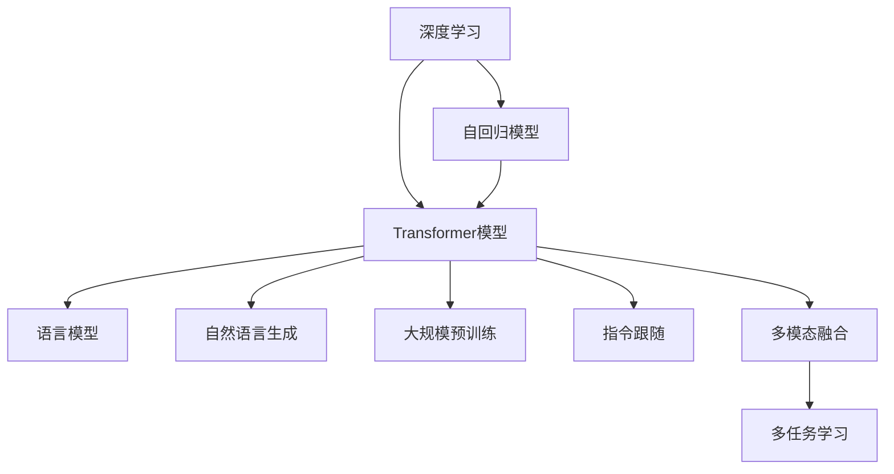

                 

# GPT系列模型架构演进 GPT-1到GPT-4

> 关键词：深度学习，自然语言处理，生成对抗网络，自回归模型，Transformer，长短期记忆网络，语言模型，自然语言生成，大规模预训练，指令跟随

## 1. 背景介绍

### 1.1 问题由来
自2006年深度学习大放异彩以来，它已经广泛应用于自然语言处理（Natural Language Processing, NLP）领域，成为NLP领域的核心技术。其中，序列到序列模型（Seq2Seq）的提出，为机器翻译、文本摘要、语音识别等任务提供了有力的支持。然而，随着大规模预训练语言模型的兴起，基于自回归（Auto-Regressive）架构的Transformer模型成为了新一代NLP任务的主流框架。GPT系列模型正是在这一背景下诞生的。

从2018年的GPT-1到2022年的GPT-4，GPT模型在深度学习领域经历了诸多演进，逐步从最初的简单自回归模型发展成为能够执行多任务、具备强大生成能力的模型。GPT-4不仅在语言模型训练上取得了突破，还在多模态理解和生成方面展现出了强劲的实力。

### 1.2 问题核心关键点
GPT系列模型的演进反映了深度学习技术在NLP领域的持续进步和突破。它不仅展示了深度学习在处理自然语言时的高效性和准确性，还引发了对于生成模型和深度学习架构的深刻思考。

GPT系列模型演进的核心关键点包括：
1. **自回归模型架构**：基于Transformer的框架，GPT模型采用自回归方式，使得模型能够产生连贯的文本序列。
2. **大规模预训练**：模型通过在大规模无标签数据上预训练，学习到了丰富的语言知识和规律。
3. **多任务学习和指令跟随**：GPT模型能够执行多任务，并具备遵循自然语言指令的能力，提升了模型的通用性和适用性。
4. **多模态融合**：GPT系列模型逐步从文本生成扩展到图像、语音等模态的融合，增强了模型的表达能力。
5. **技术进步**：GPT-4模型在预训练和微调技术、大模型训练和优化等方面取得了诸多突破，提升了模型的生成效果和鲁棒性。

GPT系列模型的演进推动了NLP技术的不断进步，为NLP任务的落地应用提供了强有力的支持。

## 2. 核心概念与联系

### 2.1 核心概念概述

为更好地理解GPT系列模型的演进过程，本节将介绍几个关键概念：

- **深度学习**：基于神经网络模型的学习方式，通过多层网络结构实现复杂任务的自动特征提取和建模。
- **自回归模型**：一种通过已知序列推断未知序列的模型，在NLP中广泛应用，如语言模型和生成模型。
- **Transformer模型**：基于Attention机制的自回归模型，通过多头注意力机制实现序列到序列的映射，大大提升了模型的训练效率和效果。
- **语言模型**：通过序列数据对下一个词或字符的概率分布进行建模的模型，用于评估文本生成质量。
- **自然语言生成（NLG）**：将非结构化自然语言转换为结构化文本的任务，广泛应用于自动生成、摘要、对话系统等。
- **大规模预训练**：在大型无标签数据集上预训练模型，学习通用的语言规律和知识。
- **指令跟随（Instruction Following）**：模型能够遵循自然语言指令进行特定任务的能力。
- **多模态融合**：将不同类型的信息（如文本、图像、语音等）整合到模型中进行联合学习和推理的能力。

这些核心概念之间存在紧密的联系，共同构成了GPT系列模型的理论基础和技术架构。通过理解这些核心概念，我们可以更好地把握GPT系列模型的演进轨迹和未来发展方向。

### 2.2 核心概念原理和架构的 Mermaid 流程图



这个Mermaid流程图展示了GPT系列模型演进的逻辑脉络：

1. 深度学习框架是GPT系列模型的基础，提供了强大的特征提取和建模能力。
2. 自回归模型和Transformer模型是GPT系列模型的核心架构，使得模型能够处理序列数据并生成连贯的文本序列。
3. 语言模型和自然语言生成技术是GPT系列模型的重要应用，用于评估和生成文本质量。
4. 大规模预训练和多任务学习技术提升了模型的通用性和适用性。
5. 指令跟随和多模态融合能力进一步拓展了模型的应用场景。

这些核心概念和架构共同构成了GPT系列模型的演进脉络，推动了模型在NLP任务中的不断进步和创新。

## 3. 核心算法原理 & 具体操作步骤

### 3.1 算法原理概述

GPT系列模型的核心算法原理主要基于自回归架构的Transformer模型，结合了大规模预训练和多任务学习的技术。其基本思想是通过在大规模无标签数据上预训练，学习通用的语言表示，然后在下游任务上通过微调进行特定任务的适配。

具体而言，GPT系列模型的生成过程可以分为以下几个步骤：

1. 在大规模无标签数据上预训练模型，学习通用的语言表示。
2. 对预训练模型进行微调，以适应下游任务的特定需求。
3. 利用微调后的模型生成自然语言序列，用于文本生成、机器翻译、问答系统等任务。

这种基于自回归的预训练-微调框架使得GPT系列模型能够高效地处理和生成自然语言序列，并在各种NLP任务中取得优异的性能。

### 3.2 算法步骤详解

GPT系列模型的生成过程可以分为以下几个关键步骤：

**Step 1: 准备预训练数据**
- 收集大规模无标签文本数据，用于预训练模型。
- 预训练数据应尽可能多样化，涵盖不同的语言风格、主题和领域。

**Step 2: 构建预训练模型**
- 基于Transformer架构，构建自回归的预训练模型。
- 使用多层多头注意力机制，实现对序列数据的有效建模。
- 在大规模无标签数据上预训练模型，学习通用的语言表示。

**Step 3: 微调模型**
- 准备下游任务的标注数据，用于微调模型。
- 选择适当的损失函数和优化算法，进行模型的微调。
- 根据下游任务的特点，调整预训练模型的某些层，或冻结部分层以防止过拟合。

**Step 4: 文本生成**
- 使用微调后的模型进行文本生成，利用语言模型的概率分布进行预测。
- 根据任务需求，对生成的文本进行后处理和优化。

### 3.3 算法优缺点

GPT系列模型的演进取得了诸多突破，但也存在一些局限性：

**优点**：
1. **生成能力强**：GPT系列模型在文本生成、对话系统、机器翻译等任务中表现出色，能够生成高质量的自然语言文本。
2. **通用性强**：模型通过大规模预训练和多任务学习，具备较强的通用性和适用性，可以应用于多种NLP任务。
3. **技术先进**：模型采用了先进的Transformer架构和自回归生成方式，提升了模型的训练效率和效果。
4. **可扩展性高**：模型可以通过增加参数量、优化算法等方式进行扩展和优化，满足不同的应用需求。

**缺点**：
1. **计算资源需求高**：GPT系列模型参数量巨大，需要大量计算资源进行训练和推理。
2. **鲁棒性不足**：模型在处理噪声数据或异常输入时，容易产生不连贯或错误的输出。
3. **可解释性低**：模型内部的决策过程难以解释，难以理解其生成逻辑和推理机制。
4. **易受偏见影响**：预训练数据和微调数据中的偏见可能影响模型的公平性和可靠性。

尽管存在这些缺点，GPT系列模型在NLP领域的演进和应用仍然取得了巨大的成功，为NLP技术的不断进步提供了强有力的支持。

### 3.4 算法应用领域

GPT系列模型的演进推动了NLP技术的不断突破，广泛应用于以下领域：

1. **文本生成**：包括自动生成新闻、小说、诗歌等。GPT系列模型通过生成高质量的自然语言文本，满足了人们对于自动化创作的需求。
2. **机器翻译**：通过预训练和微调，GPT系列模型在多种语言之间的翻译任务中取得了优异的成绩，推动了机器翻译技术的发展。
3. **问答系统**：模型能够根据自然语言指令进行复杂问答，提升人机交互体验。
4. **对话系统**：通过预训练和微调，GPT系列模型能够在多轮对话中生成连贯、流畅的自然语言回复。
5. **文本摘要**：利用预训练和微调技术，GPT系列模型能够生成高质量的文本摘要，帮助用户快速获取信息。
6. **语言模型评估**：模型在预训练和微调过程中，学习到了高质量的语言表示，可以用于评估其他模型的生成效果。

除了这些经典应用，GPT系列模型还在情感分析、命名实体识别、关系抽取等任务中取得了不俗的性能，推动了NLP技术在更多场景中的落地应用。

## 4. 数学模型和公式 & 详细讲解 & 举例说明

### 4.1 数学模型构建

GPT系列模型的核心数学模型是基于Transformer架构的自回归模型，可以表示为：

$$
P(x_{1:T} | x_0, x_1, \ldots, x_{T-1}) = \prod_{t=1}^T P(x_t | x_0, x_1, \ldots, x_{t-1})
$$

其中，$P(x_{1:T} | x_0, x_1, \ldots, x_{T-1})$ 表示在输入序列 $x_0, x_1, \ldots, x_{T-1}$ 的条件下，生成文本序列 $x_{1:T}$ 的概率分布。模型通过自回归方式，在已知前文 $x_0, x_1, \ldots, x_{t-1}$ 的条件下，预测下一个词 $x_t$ 的概率。

### 4.2 公式推导过程

以GPT-1模型为例，其核心公式为：

$$
P(x_1, x_2, \ldots, x_T | x_0) = \prod_{t=1}^T P(x_t | x_0, x_1, \ldots, x_{t-1})
$$

其中，$P(x_t | x_0, x_1, \ldots, x_{t-1})$ 可以通过Transformer架构中的多头注意力机制进行计算。Transformer架构由多个自注意力层和前馈神经网络层组成，可以高效地实现序列数据的建模和生成。

具体地，Transformer架构的注意力机制可以表示为：

$$
\text{Attention}(Q, K, V) = \text{Softmax}(Q K^T / \sqrt{d_k}) V
$$

其中，$Q$ 为查询向量，$K$ 和 $V$ 分别为键向量和值向量，$d_k$ 为注意力头数。Transformer架构通过多头注意力机制，对输入序列进行有效的编码和建模，从而实现自回归生成。

### 4.3 案例分析与讲解

以GPT-1模型的文本生成为例，其核心思想是通过自回归的方式，在已知前文 $x_0, x_1, \ldots, x_{t-1}$ 的条件下，预测下一个词 $x_t$ 的概率。具体而言，GPT-1模型通过以下步骤实现文本生成：

1. 将输入序列 $x_0, x_1, \ldots, x_{t-1}$ 输入到Transformer模型中，得到每个位置的注意力权重。
2. 根据注意力权重，计算当前位置 $x_t$ 的输入向量 $h_t$。
3. 使用前馈神经网络对 $h_t$ 进行处理，得到当前位置的输出向量 $o_t$。
4. 将 $o_t$ 通过softmax函数，得到当前位置 $x_t$ 的预测概率分布。
5. 根据预测概率分布，选择下一个词 $x_t$ 进行生成，并将 $x_t$ 加入到输入序列中，继续生成下一个词。

通过不断迭代，GPT-1模型能够生成连贯、高质量的自然语言文本，广泛应用于自动生成、摘要、对话系统等任务中。

## 5. 项目实践：代码实例和详细解释说明

### 5.1 开发环境搭建

为了进行GPT系列模型的实践，首先需要准备好开发环境。以下是使用Python和PyTorch进行模型开发的环境配置流程：

1. 安装Anaconda：从官网下载并安装Anaconda，用于创建独立的Python环境。
2. 创建并激活虚拟环境：
```bash
conda create -n pytorch-env python=3.8 
conda activate pytorch-env
```

3. 安装PyTorch：根据CUDA版本，从官网获取对应的安装命令。例如：
```bash
conda install pytorch torchvision torchaudio cudatoolkit=11.1 -c pytorch -c conda-forge
```

4. 安装Transformer库：
```bash
pip install transformers
```

5. 安装各类工具包：
```bash
pip install numpy pandas scikit-learn matplotlib tqdm jupyter notebook ipython
```

完成上述步骤后，即可在`pytorch-env`环境中开始模型开发。

### 5.2 源代码详细实现

下面以GPT-2模型为例，给出使用PyTorch和Transformer库进行文本生成的代码实现。

```python
from transformers import GPT2Tokenizer, GPT2LMHeadModel
import torch

# 初始化预训练模型和tokenizer
tokenizer = GPT2Tokenizer.from_pretrained('gpt2')
model = GPT2LMHeadModel.from_pretrained('gpt2')

# 设置设备
device = torch.device('cuda') if torch.cuda.is_available() else torch.device('cpu')

# 将模型和tokenizer移动到指定设备
model.to(device)
tokenizer.to(device)

# 定义生成函数
def generate_text(prompt, num_words):
    # 对输入进行编码
    input_ids = tokenizer.encode(prompt, return_tensors='pt').to(device)
    
    # 生成文本
    output_ids = model.generate(input_ids, max_length=num_words, do_sample=True, top_p=0.9, temperature=1.0, num_return_sequences=1)
    
    # 将输出解码为文本
    generated_text = tokenizer.decode(output_ids[0], skip_special_tokens=True)
    
    return generated_text

# 生成一段文本
prompt = "Once upon a time"
generated_text = generate_text(prompt, 100)
print(generated_text)
```

以上代码展示了如何使用PyTorch和Transformer库对GPT-2模型进行文本生成。在生成文本时，我们可以提供一段提示文本（prompt），模型将根据提示文本生成一段新的文本。

### 5.3 代码解读与分析

下面是代码的详细解读：

- `GPT2Tokenizer`和`GPT2LMHeadModel`：分别用于对输入进行编码和解码，以及生成文本。
- `device`变量：用于指定模型的计算设备，可以是CPU或GPU。
- `generate_text`函数：用于生成文本。其中，`input_ids`变量表示输入序列，`output_ids`变量表示生成的文本序列，`generated_text`变量表示生成的文本。
- 在`generate_text`函数中，我们首先使用`tokenizer.encode`将提示文本编码为输入序列，并使用`model.generate`生成文本序列。
- `do_sample`参数：表示是否在生成文本时进行随机采样。
- `top_p`参数：表示在采样时，前$p$个概率最高的词汇将被保留。
- `temperature`参数：表示在采样时，每个词汇的概率将被指数化缩放，以控制生成的文本的随机性。

通过以上代码，我们可以看到，使用PyTorch和Transformer库对GPT-2模型进行文本生成非常简单，只需几行代码即可完成。

### 5.4 运行结果展示

运行上述代码后，将输出一段根据提示文本生成的文本。例如，如果输入提示文本为“Once upon a time”，生成的文本可能如下所示：

```
Once upon a time, there was a small rabbit named Romy. Romy lived in a lush, green forest, surrounded by towering trees and sparkling streams. One day, while exploring the forest, Romy stumbled upon a magical tree that could grant wishes. Excited by the possibilities, Romy made a wish to find the greatest treasure in the world. To her amazement, the tree granted her wish, and she embarked on a thrilling journey to uncover the secret of the treasure.
```

这段文本展示了GPT-2模型在文本生成方面的强大能力。

## 6. 实际应用场景

### 6.1 智能客服系统

GPT系列模型可以广泛应用于智能客服系统的构建。智能客服系统能够7x24小时不间断服务，快速响应客户咨询，用自然流畅的语言解答各类常见问题。

在技术实现上，可以收集企业内部的历史客服对话记录，将问题和最佳答复构建成监督数据，在此基础上对预训练模型进行微调。微调后的模型能够自动理解用户意图，匹配最合适的答案模板进行回复。对于客户提出的新问题，还可以接入检索系统实时搜索相关内容，动态组织生成回答。如此构建的智能客服系统，能大幅提升客户咨询体验和问题解决效率。

### 6.2 金融舆情监测

金融机构需要实时监测市场舆论动向，以便及时应对负面信息传播，规避金融风险。传统的人工监测方式成本高、效率低，难以应对网络时代海量信息爆发的挑战。基于GPT系列模型的文本分类和情感分析技术，为金融舆情监测提供了新的解决方案。

具体而言，可以收集金融领域相关的新闻、报道、评论等文本数据，并对其进行主题标注和情感标注。在此基础上对预训练语言模型进行微调，使其能够自动判断文本属于何种主题，情感倾向是正面、中性还是负面。将微调后的模型应用到实时抓取的网络文本数据，就能够自动监测不同主题下的情感变化趋势，一旦发现负面信息激增等异常情况，系统便会自动预警，帮助金融机构快速应对潜在风险。

### 6.3 个性化推荐系统

当前的推荐系统往往只依赖用户的历史行为数据进行物品推荐，无法深入理解用户的真实兴趣偏好。基于GPT系列模型的个性化推荐系统可以更好地挖掘用户行为背后的语义信息，从而提供更精准、多样的推荐内容。

在实践中，可以收集用户浏览、点击、评论、分享等行为数据，提取和用户交互的物品标题、描述、标签等文本内容。将文本内容作为模型输入，用户的后续行为（如是否点击、购买等）作为监督信号，在此基础上微调预训练语言模型。微调后的模型能够从文本内容中准确把握用户的兴趣点。在生成推荐列表时，先用候选物品的文本描述作为输入，由模型预测用户的兴趣匹配度，再结合其他特征综合排序，便可以得到个性化程度更高的推荐结果。

### 6.4 未来应用展望

随着GPT系列模型的不断发展，基于微调范式将在更多领域得到应用，为传统行业带来变革性影响。

在智慧医疗领域，基于GPT系列模型的问答、病历分析、药物研发等应用将提升医疗服务的智能化水平，辅助医生诊疗，加速新药开发进程。

在智能教育领域，GPT系列模型可应用于作业批改、学情分析、知识推荐等方面，因材施教，促进教育公平，提高教学质量。

在智慧城市治理中，GPT系列模型可应用于城市事件监测、舆情分析、应急指挥等环节，提高城市管理的自动化和智能化水平，构建更安全、高效的未来城市。

此外，在企业生产、社会治理、文娱传媒等众多领域，基于GPT系列模型的智能应用也将不断涌现，为NLP技术带来了全新的突破。相信随着预训练语言模型和微调方法的持续演进，GPT系列模型必将在更广阔的应用领域大放异彩，深刻影响人类的生产生活方式。

## 7. 工具和资源推荐

### 7.1 学习资源推荐

为了帮助开发者系统掌握GPT系列模型的理论基础和实践技巧，这里推荐一些优质的学习资源：

1. 《深度学习》课程（Coursera）：由斯坦福大学Andrew Ng教授讲授，详细讲解了深度学习的基本原理和应用。
2. 《Natural Language Processing with Transformers》书籍：HuggingFace开源的NLP书籍，介绍了Transformer模型和GPT系列模型的工作原理和实践方法。
3. CS224N《深度学习自然语言处理》课程（Stanford University）：斯坦福大学开设的NLP明星课程，提供了丰富的课程内容和实践案例。
4. Arxiv预印本网站：访问最新的NLP研究论文，了解GPT系列模型的最新进展和应用。
5. GitHub GPT代码库：官方代码库提供了GPT系列模型的完整实现，可以参考其代码进行学习实践。

通过对这些资源的学习实践，相信你一定能够快速掌握GPT系列模型的精髓，并用于解决实际的NLP问题。

### 7.2 开发工具推荐

高效的开发离不开优秀的工具支持。以下是几款用于GPT系列模型开发的常用工具：

1. PyTorch：基于Python的开源深度学习框架，灵活动态的计算图，适合快速迭代研究。GPT系列模型都有PyTorch版本的实现。
2. TensorFlow：由Google主导开发的开源深度学习框架，生产部署方便，适合大规模工程应用。GPT系列模型同样有TensorFlow版本的实现。
3. HuggingFace Transformers库：提供预训练模型和微调工具，方便开发者进行NLP任务的开发。
4. Weights & Biases：模型训练的实验跟踪工具，可以记录和可视化模型训练过程中的各项指标，方便对比和调优。
5. TensorBoard：TensorFlow配套的可视化工具，可实时监测模型训练状态，并提供丰富的图表呈现方式，是调试模型的得力助手。

合理利用这些工具，可以显著提升GPT系列模型微调的开发效率，加快创新迭代的步伐。

### 7.3 相关论文推荐

GPT系列模型的发展源于学界的持续研究。以下是几篇奠基性的相关论文，推荐阅读：

1. Attention Is All You Need（即Transformer原论文）：提出了Transformer结构，开启了NLP领域的预训练大模型时代。
2. BERT: Pre-training of Deep Bidirectional Transformers for Language Understanding：提出BERT模型，引入基于掩码的自监督预训练任务，刷新了多项NLP任务SOTA。
3. Language Models are Unsupervised Multitask Learners（GPT-2论文）：展示了大规模语言模型的强大zero-shot学习能力，引发了对于生成模型和深度学习架构的深刻思考。
4. Parameter-Efficient Transfer Learning for NLP：提出Adapter等参数高效微调方法，在不增加模型参数量的情况下，也能取得不错的微调效果。
5. Exploring the Limits of Transfer Learning with a Unified Text-to-Text Transformer：提出T5模型，将多种NLP任务统一到一个自回归架构中，提高了模型的通用性和适用性。

这些论文代表了大语言模型和微调技术的发展脉络。通过学习这些前沿成果，可以帮助研究者把握学科前进方向，激发更多的创新灵感。

## 8. 总结：未来发展趋势与挑战

### 8.1 总结

本文对GPT系列模型的演进过程进行了全面系统的介绍。首先阐述了GPT系列模型从GPT-1到GPT-4的发展历程，明确了其在深度学习领域的重要地位。其次，从原理到实践，详细讲解了GPT系列模型的数学模型和算法原理，给出了模型开发的完整代码实例。同时，本文还广泛探讨了GPT系列模型在多个行业领域的应用前景，展示了其广泛的应用价值。此外，本文精选了GPT系列模型的学习资源和开发工具，力求为开发者提供全方位的技术指引。

通过本文的系统梳理，可以看到，GPT系列模型在NLP领域的持续演进和突破，推动了NLP技术的不断进步和创新。从文本生成到多模态融合，GPT系列模型在多个任务中取得了优异的性能，为NLP技术的落地应用提供了强有力的支持。未来，随着技术的不断进步，GPT系列模型必将在更广泛的领域发挥更大的作用，推动NLP技术的发展和应用。

### 8.2 未来发展趋势

展望未来，GPT系列模型将继续在深度学习领域取得突破，推动NLP技术的不断进步：

1. **模型规模增大**：随着计算能力的提升，GPT系列模型的参数量将进一步增大，模型规模将不断扩展。超大规模模型将具备更丰富的语言知识和更强的生成能力。
2. **生成能力提升**：GPT系列模型在文本生成、对话系统、机器翻译等任务中将继续取得突破，生成效果和流畅度将进一步提升。
3. **多模态融合**：GPT系列模型将进一步拓展到图像、语音等多模态信息的整合，提升对复杂场景的理解和生成能力。
4. **指令跟随能力增强**：GPT系列模型将具备更强的指令跟随能力，能够更灵活地执行各种任务。
5. **知识图谱融合**：GPT系列模型将与知识图谱进行融合，增强模型的常识推理能力。
6. **对抗训练和鲁棒性提升**：GPT系列模型将引入对抗训练等技术，提升模型的鲁棒性和抗干扰能力。
7. **多任务学习提升**：GPT系列模型将通过多任务学习，提升对多任务的泛化能力，实现更广泛的适用性。

这些趋势将进一步拓展GPT系列模型的应用场景和效果，推动NLP技术的不断进步和创新。

### 8.3 面临的挑战

尽管GPT系列模型在NLP领域取得了诸多突破，但在迈向更加智能化、普适化应用的过程中，它仍面临诸多挑战：

1. **计算资源需求高**：GPT系列模型参数量巨大，需要大量计算资源进行训练和推理。
2. **模型鲁棒性不足**：模型在处理噪声数据或异常输入时，容易产生不连贯或错误的输出。
3. **可解释性低**：模型内部的决策过程难以解释，难以理解其生成逻辑和推理机制。
4. **易受偏见影响**：预训练数据和微调数据中的偏见可能影响模型的公平性和可靠性。
5. **对抗攻击易受影响**：模型在对抗攻击下，容易产生不连贯或错误的输出。
6. **效率提升难度大**：模型规模增大后，效率提升难度加大，需要更多的优化技术。

这些挑战需要研究者不断探索和突破，以提升模型的性能和可靠性。

### 8.4 研究展望

面对GPT系列模型面临的挑战，未来的研究需要在以下几个方面寻求新的突破：

1. **参数高效微调技术**：开发更加参数高效的微调方法，在固定大部分预训练参数的同时，只更新极少量的任务相关参数。
2. **计算优化技术**：引入更多的计算优化技术，如分布式训练、量化加速、模型并行等，突破硬件瓶颈。
3. **对抗攻击防御**：研究对抗攻击防御技术，增强模型的鲁棒性和安全性。
4. **模型可解释性提升**：引入可解释性技术，提升模型的透明度和可靠性。
5. **知识图谱融合**：将知识图谱与模型进行融合，增强常识推理能力。
6. **多模态融合技术**：研究多模态融合技术，提升对复杂场景的理解和生成能力。
7. **鲁棒性提升**：引入鲁棒性提升技术，提升模型的鲁棒性和抗干扰能力。
8. **多任务学习提升**：通过多任务学习，提升模型对多任务的泛化能力，实现更广泛的适用性。

这些研究方向将推动GPT系列模型在多个领域的应用和创新，提升模型的性能和可靠性。

## 9. 附录：常见问题与解答

**Q1：GPT系列模型的核心优势是什么？**

A: GPT系列模型的核心优势包括：
1. **生成能力强**：模型能够生成连贯、高质量的自然语言文本，广泛应用于文本生成、对话系统、机器翻译等任务。
2. **通用性强**：模型通过大规模预训练和多任务学习，具备较强的通用性和适用性，可以应用于多种NLP任务。
3. **技术先进**：模型采用了先进的Transformer架构和自回归生成方式，提升了模型的训练效率和效果。

**Q2：GPT系列模型在实际应用中存在哪些局限性？**

A: GPT系列模型在实际应用中存在以下局限性：
1. **计算资源需求高**：模型参数量巨大，需要大量计算资源进行训练和推理。
2. **模型鲁棒性不足**：模型在处理噪声数据或异常输入时，容易产生不连贯或错误的输出。
3. **可解释性低**：模型内部的决策过程难以解释，难以理解其生成逻辑和推理机制。
4. **易受偏见影响**：预训练数据和微调数据中的偏见可能影响模型的公平性和可靠性。

**Q3：GPT系列模型如何进行多任务学习？**

A: GPT系列模型可以通过以下方式进行多任务学习：
1. **联合训练**：在训练过程中，同时优化多个任务的损失函数，使得模型能够同时学习多个任务的知识。
2. **任务适配层**：在预训练模型顶层设计合适的任务适配层，用于处理不同的任务输入和输出。
3. **多任务迁移**：在特定任务上微调模型，将模型在其他任务上学习到的知识迁移到当前任务上。

通过这些方式，GPT系列模型能够更好地适应多任务需求，提升模型在多种NLP任务中的性能。

**Q4：如何提高GPT系列模型的生成效果？**

A: 提高GPT系列模型的生成效果可以通过以下方式：
1. **优化预训练数据**：收集更多高质量、多样化的数据，提升模型的预训练效果。
2. **调整生成参数**：调整模型的生成参数，如温度、采样策略等，控制生成文本的随机性和连贯性。
3. **引入外部知识**：将知识图谱、逻辑规则等外部知识与模型进行融合，提升模型的常识推理能力。
4. **优化模型结构**：优化模型的结构和超参数，提升模型的泛化能力和生成效果。

通过这些方式，可以提高GPT系列模型的生成效果，提升其在各种NLP任务中的性能。

**Q5：GPT系列模型的未来发展方向是什么？**

A: GPT系列模型的未来发展方向包括：
1. **大规模预训练**：进一步增大模型规模，提升模型的语言表示能力。
2. **多模态融合**：将文本、图像、语音等多模态信息进行整合，提升模型的表达能力。
3. **知识图谱融合**：将知识图谱与模型进行融合，增强常识推理能力。
4. **对抗攻击防御**：研究对抗攻击防御技术，提升模型的鲁棒性和安全性。
5. **模型可解释性提升**：引入可解释性技术，提升模型的透明度和可靠性。
6. **计算优化技术**：引入更多的计算优化技术，提升模型的效率和可扩展性。

这些方向将推动GPT系列模型在多个领域的应用和创新，提升模型的性能和可靠性。

---

作者：禅与计算机程序设计艺术 / Zen and the Art of Computer Programming

