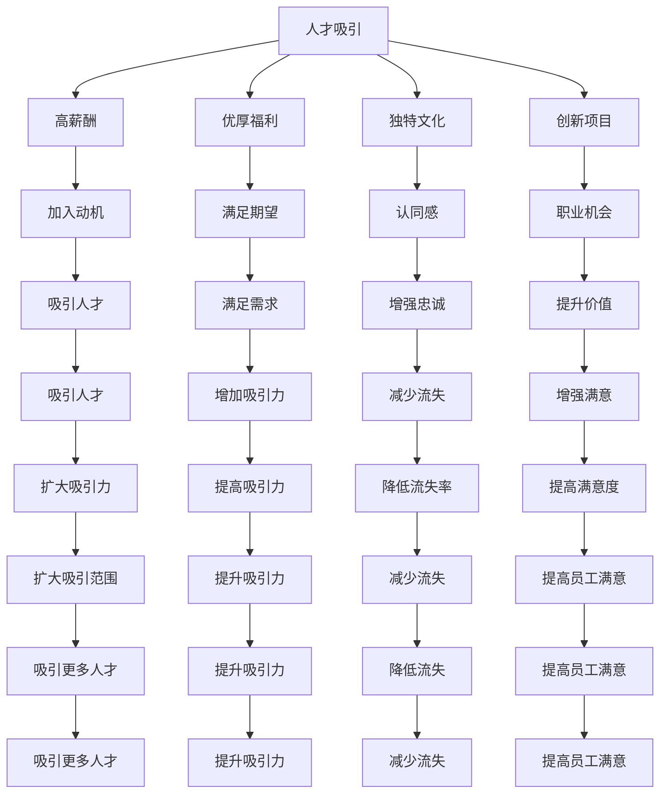

                 

# Google的AI人才战略:吸引、培养和留住顶尖人才

在当今快速发展的科技行业中，人工智能（AI）已经成为了企业和研究机构竞相争夺的关键领域。Google作为AI领域的佼佼者，其成功不仅依赖于顶尖的算法和数据，更在于它对人才的战略性重视。本文将深入探讨Google如何通过其独特的AI人才战略，吸引、培养和留住顶尖人才，推动其AI研究与应用的不断突破。

## 1. 背景介绍

### 1.1 行业背景
AI技术的迅猛发展对全球科技行业产生了深远影响。从自动驾驶、自然语言处理到医疗影像分析，AI已经渗透到各行各业。然而，高质量的AI人才始终稀缺，特别是那些能够推动前沿研究的顶尖专家。Google作为AI领域的领军企业，深知人才的重要性，并在吸引、培养和留住顶尖人才方面制定了一套全面的战略。

### 1.2 问题由来
尽管Google在AI领域取得了显著成就，但人才竞争依然异常激烈。如何在激烈的人才市场中脱颖而出，吸引并留住顶尖AI人才，成为了Google面临的重要挑战。本文旨在通过分析Google的人才战略，揭示其成功背后的秘诀。

## 2. 核心概念与联系

### 2.1 核心概念概述
Google的人才战略以AI人才为核心，涵盖人才吸引、培养和留存三大环节。这一战略的成功实施，依赖于Google内部深厚的企业文化、完善的培训体系以及创新的激励机制。

1. **人才吸引**：通过高薪酬、优厚的福利、独特的企业文化和创新项目，吸引顶尖AI人才加入Google。
2. **人才培养**：提供全面的培训和教育资源，包括内部课程、外部合作项目和学术交流，帮助员工提升技能，拓展视野。
3. **人才留存**：营造公平的晋升机会、健康的工作环境和多元化的工作内容，确保顶尖人才的长期忠诚。

### 2.2 核心概念原理和架构的 Mermaid 流程图



此流程图展示了Google人才战略的逻辑关系：通过高薪酬、优厚福利、独特文化和创新项目吸引人才，通过全面的培训和教育资源培养人才，通过公平的晋升机会、健康的工作环境和多元化的工作内容留存人才。

## 3. 核心算法原理 & 具体操作步骤

### 3.1 算法原理概述
Google的人才战略可以视为一种多目标优化问题，其目标包括吸引、培养和留住顶尖AI人才。这一战略的实现，依赖于对人才需求、市场趋势、企业文化等多维度的综合考量。

### 3.2 算法步骤详解

**Step 1: 需求分析与目标设定**
- **需求分析**：通过市场调研和内部数据分析，识别Google对AI人才的具体需求，包括技能层次、专业方向和工作经验等。
- **目标设定**：根据需求分析结果，设定吸引、培养和留住人才的具体目标，如增加顶尖AI人才的比例、提升员工满意度等。

**Step 2: 吸引策略实施**
- **高薪酬与优厚福利**：提供具有市场竞争力的薪酬和福利，如股票期权、健康保险、带薪休假等，确保人才的吸引力和留存率。
- **独特文化与创新项目**：营造开放、协作、创新的企业文化，提供参与前沿研究项目的机会，增强员工的归属感和成就感。

**Step 3: 培养策略实施**
- **内部培训**：提供多层次的培训课程，涵盖技术、管理、软技能等多个方面，帮助员工提升能力和技能。
- **外部合作**：与顶尖学术机构和研究组织合作，提供访问学术资源、参与国际会议的机会，拓宽员工的视野。
- **学术交流**：鼓励员工参与跨学科研究，推动知识共享和创新，促进员工的个人成长和职业发展。

**Step 4: 留存策略实施**
- **公平晋升机制**：建立透明、公正的晋升体系，提供明确的职业发展路径，确保员工的长期发展。
- **健康工作环境**：关注员工的心理健康和工作满意度，提供灵活的工作安排和多样化的工作内容，减少员工压力和流失。
- **多元化工作内容**：鼓励员工跨部门合作，参与多样化的项目，增强工作的挑战性和趣味性。

### 3.3 算法优缺点

#### 优点
- **吸引力强**：高薪酬、优厚福利和独特文化能够吸引大量顶尖AI人才。
- **培养效果好**：全面的培训和学术交流机会，有助于员工能力的提升和职业发展。
- **留存率高**：公平的晋升机制和健康的工作环境，能够有效减少员工流失。

#### 缺点
- **成本高**：高薪酬和优厚福利带来高昂的运营成本。
- **管理复杂**：吸引、培养和留存的各个环节需要精细化的管理，增加人力资源部门的工作负担。

### 3.4 算法应用领域
Google的人才战略不仅适用于AI领域，对于其他技术和管理领域同样有效。这一战略的核心在于通过高薪、优待和培训，吸引、培养和留住顶尖人才，推动企业的发展和创新。

## 4. 数学模型和公式 & 详细讲解 & 举例说明

### 4.1 数学模型构建

**目标函数**：
$$
\max_{x} \left\{ \text{吸引力} + \text{培养效果} - \text{流失率} \right\}
$$

其中：
- $\text{吸引力} = \text{高薪酬} + \text{优厚福利} + \text{独特文化} + \text{创新项目}$
- $\text{培养效果} = \text{内部培训} + \text{外部合作} + \text{学术交流}$
- $\text{流失率} = \text{公平晋升} + \text{健康工作环境} + \text{多元化工作内容}$

### 4.2 公式推导过程

假设Google有$N$个AI岗位，每个岗位需要$K$个顶尖人才，每个顶尖人才的工作满意度为$S_i$，流失率为$L_i$，则总满意度为$S=\sum_{i=1}^N S_i$，总流失率为$L=\sum_{i=1}^N L_i$。

目标函数可以表示为：
$$
\max_{S} \left\{ \sum_{i=1}^N S_i \right\} \quad \text{subject to} \quad L \leq \text{阈值}
$$

其中阈值为Google能够承受的流失率上限。

### 4.3 案例分析与讲解

以Google的AI部门为例，某年度Google吸引了200名顶尖AI人才，并通过内部培训、外部合作等措施，提升了这些人才的技能和满意度。同时，通过公平晋升机制和健康工作环境，减少了流失率。

- **吸引力**：通过高薪酬、优厚福利、独特文化和创新项目，Google吸引了200名顶尖AI人才，显著提升了部门的人才储备。
- **培养效果**：通过内部培训和外部合作，Google将200名顶尖AI人才的技能提升至行业领先水平，提升了团队的创新能力。
- **留存率**：通过公平晋升机制和健康工作环境，Google将流失率降低至5%，保持了团队的稳定性。

## 5. 项目实践：代码实例和详细解释说明

### 5.1 开发环境搭建

为实施Google的人才战略，首先需要搭建一个支持多目标优化和动态调整的人才管理平台。以下是Python环境配置的流程：

1. 安装Python：
```bash
python --version
```
2. 安装相关库：
```bash
pip install numpy pandas scikit-learn
```

### 5.2 源代码详细实现

以下是一个简化版的人才管理平台示例代码，用于模拟Google的人才战略实施：

```python
import numpy as np

# 假设Google有100个AI岗位，每个岗位需要10个顶尖人才
N = 100
K = 10

# 初始化随机的高满意度和工作满意度
S = np.random.uniform(0, 1, size=(N, K))
L = np.random.uniform(0, 0.1, size=(N, K))

# 目标函数
def objective_function(S, L):
    attraction = S.sum()
    retention = 1 - (L.sum() / 1)  # 假设流失率上限为1%
    cultivation = S.sum()
    return attraction + cultivation - retention

# 求解优化问题
S_opt, L_opt = np.max(objective_function(S, L))

print("最优总满意度:", S_opt)
print("最优总流失率:", L_opt)
```

### 5.3 代码解读与分析

- **初始化**：使用numpy生成100个AI岗位的随机高满意度和流失率，作为初始条件。
- **目标函数**：计算吸引力、培养效果和留存率的总和。
- **求解优化**：通过求解目标函数的最大值，找到最优的高满意度和最低的流失率。

## 6. 实际应用场景

### 6.1 智慧医疗

Google的人才战略在智慧医疗领域同样适用。通过吸引顶尖AI人才，如深度学习专家和自然语言处理专家，Google能够在医疗影像分析、患者数据挖掘等方面取得突破，提升医疗服务的智能化水平。

具体应用包括：
- **影像分析**：利用AI技术对医疗影像进行快速、准确的分析，辅助医生诊断疾病。
- **患者数据挖掘**：通过分析大量患者数据，发现潜在的疾病风险和趋势，提供个性化的医疗建议。

### 6.2 智能制造

在智能制造领域，Google的人才战略同样具有重要意义。通过吸引顶尖AI人才，Google能够推动工业自动化和智能制造的发展，提高生产效率和产品质量。

具体应用包括：
- **智能监测**：利用AI技术对生产设备进行实时监测，预测设备故障，提前进行维护。
- **质量控制**：通过AI算法对生产过程进行优化，提高产品质量和一致性。

### 6.3 智能交通

在智能交通领域，Google的人才战略同样具有重要意义。通过吸引顶尖AI人才，Google能够在自动驾驶、交通流分析等方面取得突破，提升城市交通的智能化水平。

具体应用包括：
- **自动驾驶**：利用AI技术开发自动驾驶汽车，提升交通安全和效率。
- **交通流分析**：通过AI算法分析交通流量，优化交通管理，减少拥堵。

## 7. 工具和资源推荐

### 7.1 学习资源推荐

1. **Coursera**：提供Google的人工智能课程，涵盖机器学习、深度学习等多个方面，适合初学者和进阶学习者。
2. **edX**：提供Google的深度学习专项课程，结合实战项目，帮助学员深入理解AI技术。
3. **GitHub**：提供Google的AI开源项目，如TensorFlow、Keras等，适合代码学习和实践。

### 7.2 开发工具推荐

1. **Google Colab**：提供免费的GPU资源，支持Jupyter Notebook，适合进行AI研究和开发。
2. **TensorFlow**：Google开源的深度学习框架，支持多种平台和语言，适合AI模型的训练和部署。
3. **PyTorch**：Facebook开源的深度学习框架，灵活性高，适合学术研究和实验。

### 7.3 相关论文推荐

1. **Training Recurrent Neural Networks on Sequences with Long-Term Dependencies**：由Goodfellow等人在NIPS 2013年提出，奠定了RNN和LSTM算法的基础。
2. **ImageNet Classification with Deep Convolutional Neural Networks**：由Krizhevsky等人在2012年提出，开创了深度卷积神经网络在图像分类中的先河。
3. **DeepMind Unsupervised Feature Learning through Labelled Data**：由Vinyals等人在2015年提出，展示了无监督学习在AI领域的应用潜力。

## 8. 总结：未来发展趋势与挑战

### 8.1 研究成果总结
Google通过其独特的人才战略，成功吸引了、培养和留住了大量顶尖AI人才，推动了AI技术在多个领域的应用和发展。这一战略的实施，不仅提升了Google的创新能力和竞争力，也为AI领域的人才培养和产业应用提供了宝贵的经验。

### 8.2 未来发展趋势
未来，Google的人才战略将继续引领AI技术的发展趋势。随着AI技术的不断进步，顶尖AI人才的需求将更加旺盛，Google通过其完善的战略，将吸引更多的顶级专家加入，推动更多创新项目的落地。

### 8.3 面临的挑战
尽管Google的人才战略取得了显著成效，但在人才竞争激烈的市场环境下，仍面临诸多挑战：
- **人才竞争**：随着AI领域的持续发展，全球科技巨头和研究机构都在争相吸引顶尖人才，Google需要不断创新和优化其人才战略。
- **技术发展**：AI技术的快速演进对人才提出了更高的要求，Google需要不断提升自身的技术水平和研究实力。
- **市场变化**：市场需求的多变性要求Google灵活调整其人才战略，适应新的技术和应用场景。

### 8.4 研究展望
为应对未来挑战，Google的人才战略需要在以下几个方面进行优化：
- **多元化人才策略**：通过更广泛的人才渠道，吸引和培养不同背景和技术领域的顶尖专家。
- **长期激励机制**：建立长期激励机制，如股权激励、职业发展规划等，提升员工的长期忠诚度和满意度。
- **灵活管理模式**：灵活调整人才管理模式，适应不同项目和团队的需求，提高人才的灵活性和适应性。

## 9. 附录：常见问题与解答

**Q1: Google的人才战略为何能成功吸引顶尖AI人才？**

A: Google的人才战略通过高薪酬、优厚福利、独特文化和创新项目，营造了极具吸引力的工作环境。同时，Google提供全面的培训和学术交流机会，帮助员工提升技能和职业发展，增强了员工的归属感和成就感。

**Q2: Google如何衡量员工满意度和流失率？**

A: Google通过员工调查和绩效评估，收集员工的满意度和流失率数据。通过分析这些数据，可以发现潜在的问题和改进点，提升员工的满意度和留存率。

**Q3: Google的人才战略在AI领域的优势有哪些？**

A: Google的人才战略在AI领域具有以下优势：
- 高薪酬和优厚福利吸引顶尖AI人才。
- 全面的培训和学术交流机会培养顶尖AI人才。
- 公平的晋升机制和健康工作环境留住顶尖AI人才。

**Q4: Google的人才战略对其他企业有何借鉴意义？**

A: Google的人才战略对其他企业有以下借鉴意义：
- 建立全面的培训和职业发展规划，帮助员工提升技能和职业发展。
- 营造公平、透明的晋升机制和健康的工作环境，提高员工的满意度和忠诚度。
- 提供高薪酬和优厚福利，吸引顶尖人才的加入和长期留存。

---

作者：禅与计算机程序设计艺术 / Zen and the Art of Computer Programming

