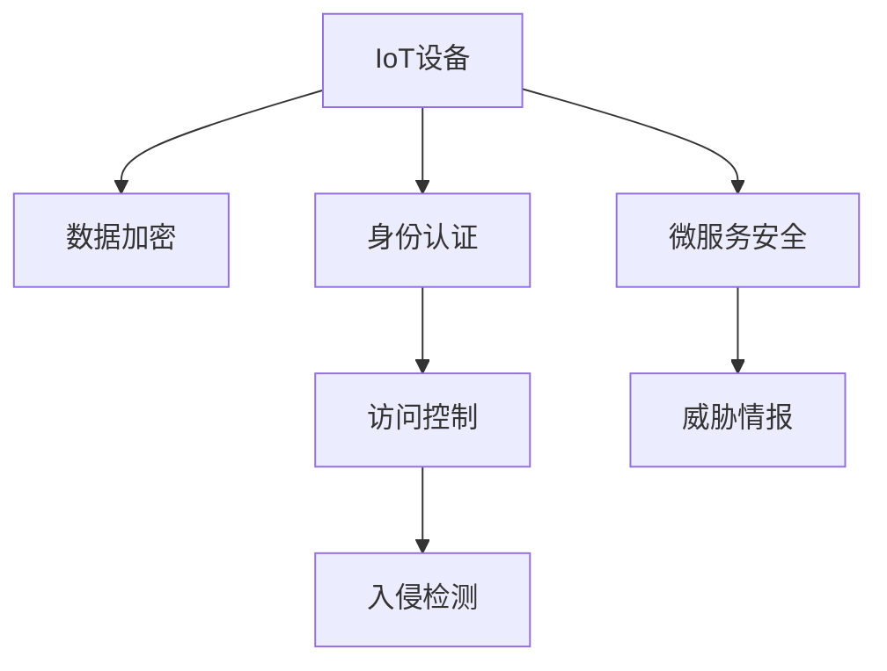

                 

# IoT安全：从设备到云端的全面防护

## 1. 背景介绍

### 1.1 问题由来
随着物联网(IoT)技术的飞速发展，越来越多的设备接入互联网，极大提升了人们的生活质量和工作效率。但与此同时，IoT设备由于其开放性、多样性、复杂性等特点，也面临着严重的安全威胁。从设备硬件到云端的软件系统，每一个环节都可能成为攻击者入侵的入口。因此，IoT安全成为了当前技术界和工业界的热点话题。

### 1.2 问题核心关键点
IoT安全涉及从设备到云端的多个层面，包括设备固件安全、设备数据传输安全、云端数据存储安全、云端应用服务安全等。设备侧主要面临的威胁有设备固件漏洞、设备物理攻击、设备数据泄漏等。而云端则可能遭受SQL注入、XSS、DDoS等网络攻击。整体来看，IoT安全风险具有多样性、复杂性和高时效性等特点。

### 1.3 问题研究意义
研究IoT安全技术，对于保障设备用户隐私、提升设备可靠性、增强产业竞争力具有重要意义：

1. 保障用户隐私。IoT设备收集了大量个人敏感信息，一旦被攻击者获取，将对用户隐私构成严重威胁。
2. 提升设备可靠性。IoT设备频繁与外部环境交互，安全漏洞可能造成设备无法正常运行，甚至引发更大规模的安全事故。
3. 增强产业竞争力。安全是IoT产业健康发展的基石，只有安全可靠的产品才能赢得用户信任和市场份额。

## 2. 核心概念与联系

### 2.1 核心概念概述

为更好地理解IoT安全技术，本节将介绍几个密切相关的核心概念：

- 物联网(IoT)：通过传感器、嵌入式设备等方式，实现人与物、物与物之间的互联互通，提升设备智能化水平。
- 物联网安全：在物联网系统中，通过各种技术手段，保障设备和数据的安全性，防止恶意攻击。
- 数据加密：在数据传输和存储过程中，采用加密技术保护数据的安全性，防止数据被窃取、篡改或泄露。
- 访问控制：通过对用户和设备的身份进行认证和管理，限制非法访问和滥用。
- 身份认证和授权：采用多种技术手段，如密码、生物识别、零信任等，确保只有授权用户才能访问受保护资源。
- 入侵检测与防御(IDS/IPS)：通过实时监测网络流量、日志等，检测和防范各种网络攻击。
- 微服务安全：采用服务化的开发模式，通过网络隔离、服务授权等方式，保障微服务架构的安全性。
- 威胁情报：通过收集和分析最新的安全威胁信息，提前预警和应对潜在的安全威胁。

这些核心概念之间的逻辑关系可以通过以下Mermaid流程图来展示：



这个流程图展示了几大核心概念及其之间的关系：

1. IoT设备通过加密技术保护数据的安全。
2. 身份认证和授权用于管理用户和设备的访问权限。
3. 访问控制限制非法访问和滥用。
4. 入侵检测实时监控网络威胁。
5. 微服务安全保障服务化的架构安全。
6. 威胁情报通过分析最新的安全威胁信息，提前预警和应对。

## 3. 核心算法原理 & 具体操作步骤
### 3.1 算法原理概述

IoT安全技术涉及多个子领域，包括数据加密、身份认证、访问控制、入侵检测等。其核心原理可以归纳为以下三点：

1. **数据加密与解密**：在数据传输和存储过程中，采用加密算法将数据加密，保证数据在传输和存储过程中的安全性。
2. **身份认证与授权**：通过密码、生物识别、零信任等技术手段，对用户和设备的身份进行认证和管理，限制非法访问和滥用。
3. **入侵检测与防御**：通过实时监测网络流量、日志等，检测和防范各种网络攻击。

### 3.2 算法步骤详解

以IoT设备的数据加密为例，其基本步骤如下：

1. **选择加密算法**：根据数据类型、传输方式和安全需求，选择合适的加密算法。常见的加密算法有对称加密、非对称加密和哈希算法等。
2. **密钥管理**：建立和维护密钥管理机制，确保密钥的安全性和有效性。
3. **数据加密**：将明文数据转换为密文，确保数据在传输和存储过程中的安全性。
4. **数据解密**：通过私钥或解密算法将密文还原为明文，恢复数据的原始状态。

以身份认证为例，基本步骤如下：

1. **身份认证机制选择**：根据应用场景选择合适的身份认证机制，如密码、生物识别、零信任等。
2. **用户身份认证**：通过用户输入的凭证（如密码、指纹等），验证用户身份的真实性。
3. **授权管理**：根据用户身份，授权其访问相应的资源。
4. **登录审计**：记录和监控用户的登录行为，发现异常及时预警。

### 3.3 算法优缺点

IoT安全算法具有以下优点：

1. **提升安全性**：通过数据加密、身份认证和授权等技术，显著提升IoT设备及数据的安全性，防止数据泄漏和攻击。
2. **灵活性高**：不同的应用场景可以采用不同的加密算法和身份认证方式，满足多样化的安全需求。
3. **兼容性好**：各种加密算法和身份认证机制可以无缝集成到IoT设备系统中，提升系统的整体安全性。

但同时也存在一些缺点：

1. **性能损耗**：加密和解密过程会增加系统的计算负担，影响设备性能。
2. **实现复杂**：实施IoT安全措施需要技术实力，对设备和应用系统的改动较大。
3. **成本高**：高安全性的实现通常需要额外的硬件设备和软件工具，成本较高。
4. **维护困难**：随着设备和服务的发展，安全系统的维护和管理也变得更加复杂。

### 3.4 算法应用领域

IoT安全算法广泛应用在各个领域，包括但不限于以下几类：

1. **智能家居设备**：如智能锁、智能摄像头、智能音箱等，采用数据加密、身份认证等技术，保障用户隐私和设备安全。
2. **工业物联网**：如智能制造、智能电网、智能交通等，通过数据加密、入侵检测等技术，提升工业生产效率和安全性。
3. **医疗健康设备**：如智能手环、智能血糖仪等，采用数据加密、身份认证等技术，保障患者隐私和数据安全。
4. **智能城市**：如智慧城市管理系统、智能路灯、智能交通信号灯等，通过数据加密、入侵检测等技术，提升城市管理和安全水平。
5. **车载设备**：如智能车联网、智能驾驶等，通过数据加密、身份认证等技术，提升车辆安全性和用户体验。

## 4. 数学模型和公式 & 详细讲解  
### 4.1 数学模型构建

IoT安全涉及到加密算法、身份认证算法和入侵检测算法等多种技术手段。这里以数据加密算法为例，构建其数学模型。

假设明文为 $m$，公钥为 $e$，私钥为 $d$。采用公钥加密算法，加密过程如下：

$$
c = m^e \mod n
$$

其中 $n$ 为模数。解密过程如下：

$$
m = c^d \mod n
$$

通过加密和解密过程，实现了数据的加密和解密，确保数据在传输和存储过程中的安全性。

### 4.2 公式推导过程

以RSA算法为例，其公钥为 $(n,e)$，私钥为 $(n,d)$。加密过程为：

$$
c = m^e \mod n
$$

其中 $n=pq$，$p$ 和 $q$ 为两个大素数。

解密过程为：

$$
m = c^d \mod n
$$

其中 $d$ 满足 $ed \equiv 1 \mod \varphi(n)$。

通过上述推导，我们可以看到RSA算法通过公钥加密和私钥解密，实现数据的加密和解密，保障数据的安全性。

### 4.3 案例分析与讲解

以AES加密算法为例，其加密过程如下：

1. 初始轮密钥生成：将明文 $m$ 与轮密钥 $K$ 异或，得到中间状态 $m'$。
2. 迭代轮加密：通过一系列的轮变换，将中间状态 $m'$ 逐步加密，最终得到密文 $c$。

解密过程与加密过程相反，通过一系列的轮变换，将密文 $c$ 逐步解密，最终得到明文 $m'$。

AES算法是一种对称加密算法，速度快、安全性高，适用于大规模数据的加密。

## 5. 项目实践：代码实例和详细解释说明
### 5.1 开发环境搭建

在进行IoT安全项目开发前，需要搭建相应的开发环境。以下是Python语言下的开发环境搭建流程：

1. 安装Python：可以从官网下载安装Python，安装完成后配置环境变量。
2. 安装加密库：如PyCrypto、cryptography等，用于实现数据加密算法。
3. 安装身份认证库：如Flask-Login、Django-Auth等，用于实现身份认证和授权功能。
4. 安装入侵检测库：如Netstat、Fiddler等，用于实现入侵检测功能。

### 5.2 源代码详细实现

以下是使用Flask框架实现数据加密和身份认证的示例代码：

```python
from flask import Flask, request
from flask_login import LoginManager, UserMixin, login_user, logout_user, login_required
from werkzeug.security import generate_password_hash, check_password_hash

app = Flask(__name__)
app.config['SECRET_KEY'] = 'secret_key'
app.config['SQLALCHEMY_DATABASE_URI'] = 'sqlite:///database.db'
db = SQLAlchemy(app)

# 用户模型
class User(db.Model, UserMixin):
    id = db.Column(db.Integer, primary_key=True)
    username = db.Column(db.String(64), unique=True)
    password_hash = db.Column(db.String(128))

    def set_password(self, password):
        self.password_hash = generate_password_hash(password)

    def check_password(self, password):
        return check_password_hash(self.password_hash, password)

# 登录管理
login_manager = LoginManager(app)
login_manager.login_view = 'login'
login_manager.login_message_category = 'info'

@login_manager.user_loader
def load_user(id):
    return User.query.get(int(id))

# 登录页面
@app.route('/login', methods=['GET', 'POST'])
def login():
    if request.method == 'POST':
        username = request.form['username']
        password = request.form['password']
        user = User.query.filter_by(username=username).first()
        if user and user.check_password(password):
            login_user(user)
            return redirect('/')
        else:
            flash('Invalid username or password', 'danger')
    return render_template('login.html')

# 注册页面
@app.route('/register', methods=['GET', 'POST'])
def register():
    if request.method == 'POST':
        username = request.form['username']
        password = request.form['password']
        user = User(username=username)
        user.set_password(password)
        db.session.add(user)
        db.session.commit()
        flash('User registered', 'success')
        return redirect('/')
    return render_template('register.html')

# 加密页面
@app.route('/encrypt', methods=['GET', 'POST'])
@login_required
def encrypt():
    if request.method == 'POST':
        data = request.form['data']
        encrypted_data = encrypt_data(data)
        return render_template('encrypt.html', encrypted_data=encrypted_data)
    return render_template('encrypt.html')

# 解密页面
@app.route('/decrypt', methods=['GET', 'POST'])
@login_required
def decrypt():
    if request.method == 'POST':
        data = request.form['data']
        decrypted_data = decrypt_data(data)
        return render_template('decrypt.html', decrypted_data=decrypted_data)
    return render_template('decrypt.html')

# 加密函数
def encrypt_data(data):
    # 将明文转换为字节串
    plaintext = data.encode('utf-8')
    # 使用RSA算法进行加密
    ciphertext = rsa_encrypt(plaintext)
    return ciphertext

# 解密函数
def decrypt_data(data):
    # 使用RSA算法进行解密
    plaintext = rsa_decrypt(data)
    # 将密文转换为字符串
    return plaintext.decode('utf-8')

# RSA加密函数
def rsa_encrypt(plaintext):
    # 生成RSA公钥和私钥
    public_key, private_key = rsa_keygen()
    # 使用公钥进行加密
    ciphertext = pow(plaintext, public_key, public_key)
    return ciphertext

# RSA解密函数
def rsa_decrypt(ciphertext):
    # 使用私钥进行解密
    plaintext = pow(ciphertext, private_key, private_key)
    return plaintext
```

### 5.3 代码解读与分析

这里我们解读一下关键代码的实现细节：

**Flask框架**：
- 使用Flask框架搭建Web应用程序，提供路由和视图功能。
- 使用Flask-Login实现用户认证和会话管理。
- 使用werkzeug.security库实现密码的哈希存储和校验。

**用户模型**：
- 定义User模型，包含用户名和密码字段，并使用SQLAlchemy库进行数据库操作。
- 实现set_password和check_password方法，用于存储和验证用户密码。

**登录管理**：
- 使用LoginManager类管理用户登录状态，提供登录、注销、用户加载等功能。
- 设置登录页面路径和登录消息分类。

**加密解密页面**：
- 定义加密和解密视图，分别处理加密和解密请求。
- 使用加密和解密函数实现数据加密和解密。

**加密解密函数**：
- 使用RSA算法实现数据的加密和解密。
- 使用rsa_encrypt和rsa_decrypt函数对明文和密文进行转换。

通过Flask框架和RSA算法，我们可以看到IoT设备的数据加密和身份认证可以较为简单地实现。

## 6. 实际应用场景
### 6.1 智能家居设备

智能家居设备如智能锁、智能摄像头等，通过数据加密和身份认证技术，确保用户数据的安全性。具体而言，设备收集用户的行为数据，如开锁记录、人脸识别结果等，通过加密算法保护数据的机密性。同时，用户登录设备时需要进行身份认证，确保只有授权用户才能访问设备。

### 6.2 工业物联网

工业物联网设备如智能制造系统、智能电网等，通过数据加密和入侵检测技术，保障工业生产数据的安全性。具体而言，设备采集的生产数据通过加密算法保护数据的机密性，防止数据被窃取或篡改。同时，设备部署在网络环境中，通过入侵检测技术实时监控网络流量，发现并防范网络攻击。

### 6.3 医疗健康设备

医疗健康设备如智能手环、智能血糖仪等，通过数据加密和身份认证技术，保障患者隐私和数据安全。具体而言，设备收集的患者健康数据通过加密算法保护数据的机密性，防止数据被泄露。同时，患者登录设备时需要进行身份认证，确保只有授权用户才能访问设备。

### 6.4 智能城市

智能城市管理系统如智慧路灯、智能交通信号灯等，通过数据加密和入侵检测技术，提升城市管理和安全水平。具体而言，设备采集的城市管理数据通过加密算法保护数据的机密性，防止数据被窃取或篡改。同时，设备部署在网络环境中，通过入侵检测技术实时监控网络流量，发现并防范网络攻击。

### 6.5 车载设备

车载设备如智能车联网、智能驾驶等，通过数据加密和身份认证技术，提升车辆安全性和用户体验。具体而言，设备收集的车辆数据如行驶轨迹、车内监控等通过加密算法保护数据的机密性，防止数据被窃取或篡改。同时，车主登录设备时需要进行身份认证，确保只有授权用户才能访问设备。

## 7. 工具和资源推荐
### 7.1 学习资源推荐

为了帮助开发者系统掌握IoT安全技术，以下是一些优质的学习资源：

1. **IoT安全白皮书**：由IoT安全行业专家撰写，深入浅出地介绍了IoT安全的基本概念和前沿技术。
2. **IoT安全培训班**：提供系统化的IoT安全培训课程，涵盖设备固件安全、数据加密、身份认证等内容。
3. **IoT安全博客**：IoT安全领域的知名博客，提供丰富的IoT安全案例和技术文章。
4. **IoT安全社区**：IoT安全从业者交流的社区平台，分享最新的IoT安全新闻和研究成果。

通过对这些资源的学习实践，相信你一定能够快速掌握IoT安全技术的精髓，并用于解决实际的IoT安全问题。

### 7.2 开发工具推荐

IoT安全技术的开发离不开优秀的工具支持。以下是几款常用的IoT安全开发工具：

1. **RSA加密库**：如PyCrypto、cryptography等，用于实现数据加密和解密功能。
2. **Flask框架**：用于搭建Web应用程序，实现用户认证和会话管理功能。
3. **Flask-Login插件**：用于实现用户认证和授权功能。
4. **Netstat工具**：用于实时监测网络流量，发现网络攻击。
5. **Fiddler工具**：用于抓包分析，发现网络异常行为。

合理利用这些工具，可以显著提升IoT安全开发的效率，加快创新迭代的步伐。

### 7.3 相关论文推荐

IoT安全技术的发展源于学界的持续研究。以下是几篇奠基性的相关论文，推荐阅读：

1. **IoT安全现状与挑战**：探讨IoT设备的现状和面临的安全威胁，提出基于多层次防御机制的安全解决方案。
2. **IoT设备加密技术研究**：研究IoT设备的加密算法和密钥管理技术，提出基于硬件和软件相结合的加密方案。
3. **IoT身份认证技术研究**：研究IoT设备的身份认证技术，提出基于密码、生物识别和零信任等技术手段的认证方案。
4. **IoT入侵检测技术研究**：研究IoT设备的入侵检测技术，提出基于异常行为检测和流量分析的检测方案。

这些论文代表了大规模物联网安全技术的最新发展，通过学习这些前沿成果，可以帮助研究者把握学科前进方向，激发更多的创新灵感。

## 8. 总结：未来发展趋势与挑战

### 8.1 总结

本文对IoT安全技术进行了全面系统的介绍。首先阐述了IoT安全技术的研究背景和意义，明确了IoT安全在保障设备用户隐私、提升设备可靠性、增强产业竞争力方面的重要价值。其次，从原理到实践，详细讲解了IoT安全技术的核心算法和操作步骤，给出了IoT安全项目开发的完整代码实例。同时，本文还广泛探讨了IoT安全技术在智能家居、工业物联网、医疗健康设备、智能城市、车载设备等多个行业领域的应用前景，展示了IoT安全技术的巨大潜力。此外，本文精选了IoT安全技术的各类学习资源，力求为读者提供全方位的技术指引。

通过本文的系统梳理，可以看到，IoT安全技术正在成为IoT设备健康发展的基石，极大地拓展了IoT设备的应用边界，催生了更多的落地场景。未来，伴随IoT技术的进一步发展和普及，IoT安全技术必将迎来新的挑战和机遇，引领IoT产业迈向更加安全、可靠、智能的未来。

### 8.2 未来发展趋势

展望未来，IoT安全技术将呈现以下几个发展趋势：

1. **多层次防御**：随着IoT设备场景的多样化，安全防御将从单一的加密和认证手段，扩展到多层次、多维度的防御机制，如硬件加密、软件加密、边缘计算等。
2. **智能防护**：借助AI和机器学习技术，提升入侵检测和威胁预警的智能化水平，实现实时分析和主动防御。
3. **零信任架构**：借鉴零信任的理念，构建无默认信任的IoT安全架构，提升系统的整体安全性和可靠性。
4. **区块链技术**：结合区块链技术，实现设备间的数据共享和身份认证，保障数据的安全性和可信度。
5. **标准化规范**：制定IoT安全相关的标准化规范和行业标准，推动IoT设备的安全性评价和认证。
6. **跨领域融合**：推动IoT安全技术与其他领域的深度融合，如云计算、大数据、人工智能等，构建更加全面的IoT安全体系。

以上趋势凸显了IoT安全技术的发展方向，必将引领IoT产业迈向更加安全、可靠、智能的未来。

### 8.3 面临的挑战

尽管IoT安全技术已经取得了一定进展，但在迈向更加智能化、普适化应用的过程中，仍面临着诸多挑战：

1. **设备硬件差异**：IoT设备的硬件种类繁多，不同设备间的安全需求和实现方式差异较大，难以构建统一的安全体系。
2. **安全技术复杂性**：IoT安全技术涉及加密、认证、入侵检测等多个子领域，技术实现复杂，成本较高。
3. **数据隐私保护**：IoT设备收集的大量个人敏感信息，如何有效保护数据隐私，防止数据泄露，仍是技术难点。
4. **设备性能影响**：IoT设备资源有限，加密和解密等安全措施可能影响设备性能，降低用户体验。
5. **安全标准缺失**：IoT安全相关的标准化规范和行业标准尚未完善，缺乏统一的安全评估和认证体系。
6. **跨领域协作难度**：IoT安全技术需要跨领域的深度合作，涉及设备制造商、网络运营商、服务提供商等多个方面，协调难度较大。

这些挑战需要业界多方共同努力，才能逐步解决，推动IoT安全技术的普及和应用。

### 8.4 研究展望

面对IoT安全技术所面临的挑战，未来的研究需要在以下几个方面寻求新的突破：

1. **设备标准化**：推动IoT设备的标准化工作，构建统一的硬件接口和安全接口，简化安全系统的实现和维护。
2. **轻量级加密**：开发轻量级的加密算法，降低加密和解密过程的计算负担，提升设备性能。
3. **智能防护**：结合AI和机器学习技术，提升入侵检测和威胁预警的智能化水平，实现实时分析和主动防御。
4. **隐私保护技术**：研究更加高效的数据隐私保护技术，如差分隐私、多方安全计算等，保障用户隐私。
5. **区块链技术**：结合区块链技术，实现设备间的数据共享和身份认证，保障数据的安全性和可信度。
6. **跨领域协作**：推动IoT安全技术的跨领域深度合作，形成多方协同的安全生态系统。

这些研究方向将为IoT安全技术的发展提供新的动力，推动IoT产业迈向更加安全、可靠、智能的未来。

## 9. 附录：常见问题与解答

**Q1：IoT设备的安全性如何保障？**

A: IoT设备的安全性主要通过数据加密、身份认证和入侵检测等技术手段保障。在数据传输和存储过程中，采用加密算法保护数据的安全性。通过密码、生物识别等手段对用户和设备进行身份认证，确保只有授权用户才能访问受保护资源。通过实时监测网络流量、日志等，检测和防范各种网络攻击，实现入侵检测与防御。

**Q2：IoT设备的数据加密算法有哪些？**

A: IoT设备常用的数据加密算法包括对称加密算法（如AES、DES等）、非对称加密算法（如RSA、ECC等）和哈希算法（如MD5、SHA-2等）。对称加密算法速度快，适用于大规模数据的加密。非对称加密算法安全性强，适用于密钥管理和数字签名。哈希算法适用于数据的完整性验证和防篡改。

**Q3：IoT设备的身份认证方式有哪些？**

A: IoT设备常用的身份认证方式包括密码、生物识别、零信任等。密码认证通过用户输入的密码验证身份，生物识别通过指纹、面部识别等生物特征验证身份。零信任认证通过严格的用户认证和授权管理，确保只有授权用户才能访问受保护资源。

**Q4：IoT设备的入侵检测方式有哪些？**

A: IoT设备常用的入侵检测方式包括异常行为检测、流量分析等。异常行为检测通过监测设备行为是否偏离正常模式，发现异常行为。流量分析通过分析网络流量数据，检测异常流量和攻击行为。

**Q5：IoT设备的加密和解密过程如何实现？**

A: IoT设备的加密和解密过程通常采用对称加密和非对称加密算法。对称加密算法使用相同的密钥进行加密和解密，速度快但密钥管理复杂。非对称加密算法使用公钥加密、私钥解密，安全性强但速度较慢。

---

作者：禅与计算机程序设计艺术 / Zen and the Art of Computer Programming

