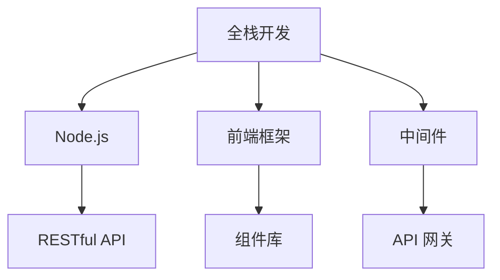

                 

# JavaScript全栈开发：Node.js与前端框架的结合

## 1. 背景介绍

### 1.1 问题由来
随着Web技术的不断进步，Web开发模式从传统的C/S（Client/Server）架构，逐渐演变为全栈开发模式。全栈开发不仅可以减少前后端切换的时间成本，提升开发效率，还可以让开发者从底层到顶层全面理解Web应用，提高代码的质量和稳定性。

然而，全栈开发也面临一些挑战：
- 技术栈过于单一，开发能力受限。
- 开发效率提升，但质量控制难度增加。
- 前端框架种类繁多，选择困难。

Node.js作为Web开发中最重要的技术之一，以其简洁、高效、可扩展的特性，成为全栈开发的首选技术。而React、Vue等前端框架的出现，使得全栈开发变得更加高效。

### 1.2 问题核心关键点
本文将重点探讨以下关键点：
- 全栈开发的优势和挑战。
- Node.js与前端框架的结合方式。
- 全栈开发的技术选型和优化策略。

本文通过理论阐述与实践案例相结合的方式，带你深入了解全栈开发的本质，以及Node.js与前端框架的融合策略。

## 2. 核心概念与联系

### 2.1 核心概念概述

在全栈开发中，涉及的核心概念包括以下几个：

- **全栈开发**：指开发人员具备前后端开发能力，可以独立完成整个Web应用的开发和维护。

- **Node.js**：基于Chrome V8引擎的JavaScript运行环境，可以在服务器端运行JavaScript代码，支持非阻塞I/O、事件驱动等特性。

- **前端框架**：如React、Vue等，提供了丰富的UI组件和组件化开发模式，提高开发效率和代码复用性。

- **中间件**：是连接前后端的关键，负责处理请求、响应等任务，支持业务逻辑的灵活扩展。

这些概念之间相互联系，共同构成了全栈开发的技术体系。以下是它们的联系图：



## 3. 核心算法原理 & 具体操作步骤
### 3.1 算法原理概述

全栈开发的核心在于前后端技术的无缝衔接。Node.js提供了在服务器端执行JavaScript代码的能力，从而实现前后端的统一。而前端框架如React、Vue等，则提供了丰富的UI组件和开发模式，提升了开发效率和代码质量。

### 3.2 算法步骤详解

以下是全栈开发的具体操作步骤：

**Step 1: 开发环境搭建**

首先，需要搭建开发环境。以Node.js和React为例：

1. 安装Node.js和npm。

2. 使用npm安装React和其他依赖包。

3. 配置项目目录和结构，编写入口文件。

**Step 2: 前端开发**

使用前端框架如React、Vue进行UI组件的开发。具体步骤如下：

1. 设计页面结构和组件。

2. 编写组件代码，进行样式和交互设计。

3. 使用状态管理库如Redux或MobX管理页面状态。

4. 进行组件的单元测试。

**Step 3: 后端开发**

使用Node.js和中间件处理请求和响应。具体步骤如下：

1. 设计API接口和数据库模型。

2. 编写中间件，处理路由、认证、权限等逻辑。

3. 编写业务逻辑和数据访问层代码。

4. 进行API的单元测试。

**Step 4: 集成测试**

将前后端代码进行集成，进行端到端测试。具体步骤如下：

1. 启动前后端服务器。

2. 使用测试工具如Jest进行集成测试。

3. 修复集成测试中发现的问题。

**Step 5: 部署和运维**

将开发好的应用部署到生产环境，并进行运维。具体步骤如下：

1. 使用CI/CD工具如Jenkins进行自动化部署。

2. 监控应用运行状态，处理异常和错误。

3. 进行性能优化和问题排查。

### 3.3 算法优缺点

全栈开发的优势在于：
1. 前后端协同开发，减少切换时间。
2. 提升代码质量和可维护性。
3. 提高开发效率，缩短项目周期。

但全栈开发也存在一些缺点：
1. 技术栈过于单一，开发能力受限。
2. 开发效率提升，但质量控制难度增加。
3. 前端框架种类繁多，选择困难。

### 3.4 算法应用领域

全栈开发在多个领域都有广泛应用：

- **Web应用**：包括电商、社交、新闻、金融等各类网站。
- **移动应用**：包括iOS和Android应用的开发。
- **桌面应用**：包括Electron等跨平台应用。
- **大数据和机器学习**：处理海量数据和算法模型，需要进行前后端一体化开发。

## 4. 数学模型和公式 & 详细讲解 & 举例说明
### 4.1 数学模型构建

全栈开发中的数学模型主要涉及前后端数据传输和处理。以React和Node.js为例，数学模型可以如下构建：

- 前端数据模型：如状态树、虚拟DOM等。
- 后端数据模型：如数据库表、API接口等。

### 4.2 公式推导过程

以下推导React中虚拟DOM和组件树的概念：

设$V$为虚拟DOM树，$T$为组件树，则有：

$$
V = f(T)
$$

其中，$f$为虚拟DOM的构建函数，将组件树映射为虚拟DOM树。

### 4.3 案例分析与讲解

以下以一个简单的博客应用为例，讲解全栈开发的具体实现。

1. 前端使用React组件开发博客页面。

2. 后端使用Node.js和Express框架处理请求。

3. 使用MongoDB数据库存储博客数据。

4. 使用mongoose进行数据访问和模型定义。

## 5. 项目实践：代码实例和详细解释说明
### 5.1 开发环境搭建

以下是使用Node.js和React进行全栈开发的开发环境搭建步骤：

1. 安装Node.js和npm。

2. 使用npm初始化项目，安装依赖包。

3. 创建项目目录和结构，编写入口文件。

### 5.2 源代码详细实现

以下是React+Node.js博客应用的代码实现：

1. 前端代码：

```javascript
import React from 'react';
import ReactDOM from 'react-dom';

class Blog extends React.Component {
  constructor(props) {
    super(props);
    this.state = { articles: [] };
  }

  componentDidMount() {
    fetch('/api/articles')
      .then(response => response.json())
      .then(articles => this.setState({ articles }));
  }

  render() {
    return (
      <div>
        <h1>My Blog</h1>
        <ul>
          {this.state.articles.map((article, index) => (
            <li key={index}>{article.title}</li>
          ))}
        </ul>
      </div>
    );
  }
}

ReactDOM.render(<Blog />, document.getElementById('root'));
```

2. 后端代码：

```javascript
const express = require('express');
const mongoose = require('mongoose');

const app = express();

// 连接数据库
mongoose.connect('mongodb://localhost:27017/blog', {
  useNewUrlParser: true,
  useUnifiedTopology: true,
});

// 定义数据模型
const ArticleSchema = new mongoose.Schema({
  title: String,
  content: String,
});

const Article = mongoose.model('Article', ArticleSchema);

// 处理API请求
app.get('/api/articles', async (req, res) => {
  const articles = await Article.find();
  res.json(articles);
});

// 启动服务器
app.listen(3000, () => {
  console.log('Server started on port 3000');
});
```

### 5.3 代码解读与分析

1. 前端使用React组件实现博客页面，通过状态管理来展示数据。

2. 后端使用Express框架处理请求，使用mongoose进行数据访问。

3. 使用MongoDB数据库存储博客数据，支持CRUD操作。

4. 通过中间件进行路由处理，支持API接口。

### 5.4 运行结果展示

运行以上代码，在浏览器中访问`http://localhost:3000`，即可看到博客页面。点击页面中的文章标题，可以跳转到相应的文章页面。

## 6. 实际应用场景
### 6.1 智能客服系统

智能客服系统是典型的全栈开发应用，前后端需要紧密协作，提供高效、可靠的客户服务。

1. 前端界面使用React或Vue进行UI设计。

2. 后端使用Node.js和Express框架处理请求，进行逻辑处理。

3. 使用数据库如MySQL或MongoDB存储客户信息和对话记录。

4. 使用消息队列如RabbitMQ进行消息传输，提高系统性能。

### 6.2 在线教育平台

在线教育平台需要处理大量的用户数据和教学内容，需要进行前后端一体化开发。

1. 前端使用React或Vue开发界面，支持课程管理、学生管理等功能。

2. 后端使用Node.js和Express框架处理API请求，进行数据管理和教学内容处理。

3. 使用数据库如MySQL或MongoDB存储用户数据和教学内容。

4. 使用缓存系统如Redis进行数据缓存，提高系统响应速度。

### 6.3 金融交易系统

金融交易系统需要对实时数据进行处理，要求前后端协作紧密，保证系统稳定性和安全性。

1. 前端使用React或Vue开发界面，支持交易下单、账户管理等功能。

2. 后端使用Node.js和Express框架处理API请求，进行数据处理和交易逻辑处理。

3. 使用数据库如MySQL或MongoDB存储交易数据和账户信息。

4. 使用加密技术如SSL/TLS保障数据传输安全。

### 6.4 未来应用展望

全栈开发在未来的应用前景非常广阔，以下是一些展望：

1. 新兴技术的融合。未来全栈开发将更多地融合人工智能、大数据等新兴技术，提供更加智能、高效的服务。

2. 多平台应用的开发。全栈开发将支持更多的平台，如iOS、Android、Web等，实现跨平台应用开发。

3. 微服务架构的采用。全栈开发将更多地采用微服务架构，提高系统的可扩展性和可维护性。

4. 开发效率的提升。随着开发工具和框架的不断完善，全栈开发的效率将得到进一步提升。

## 7. 工具和资源推荐
### 7.1 学习资源推荐

以下是一些全栈开发的优秀学习资源：

1. 《JavaScript全栈开发》一书，介绍了全栈开发的理念和实践。

2. 《Node.js设计模式》一书，介绍了Node.js的常用设计模式和最佳实践。

3. React官方文档和Vue官方文档，提供了详细的组件化开发模式和API文档。

4. Express官方文档和Koa官方文档，提供了前后端API开发的最佳实践。

5. Redux官方文档和MobX官方文档，提供了状态管理库的使用指南和API文档。

### 7.2 开发工具推荐

以下是一些常用的全栈开发工具：

1. Visual Studio Code：轻量级代码编辑器，支持多种编程语言和框架。

2. Git：版本控制系统，支持多人协作开发。

3. Docker：容器化技术，支持跨平台部署。

4. Jenkins：CI/CD工具，支持自动化部署和测试。

5. Jest：测试框架，支持单元测试和集成测试。

### 7.3 相关论文推荐

以下是一些关于全栈开发的相关论文：

1. "The Future of Web Development: Full Stack Programming"：探讨了全栈开发的未来发展方向。

2. "Full-Stack Web Development: A Survey"：综述了全栈开发的应用现状和研究进展。

3. "Efficiency and Scalability in Full Stack Development"：讨论了全栈开发中效率和可扩展性的优化方法。

4. "Combining Node.js with Frontend Frameworks: A Case Study"：以实际案例分析了Node.js与前端框架的结合方式。

## 8. 总结：未来发展趋势与挑战
### 8.1 总结

本文从全栈开发的概念和优势出发，详细讲解了Node.js与前端框架的结合方式，以及全栈开发的具体操作步骤。通过理论阐述与实践案例相结合的方式，带你深入了解全栈开发的本质。

通过本文的系统梳理，可以看到，全栈开发是一种前后端协同开发的方式，能够提高开发效率和代码质量，但也面临技术栈单一、开发效率提升等挑战。未来全栈开发需要在技术选型、优化策略等方面不断创新，以适应更多的应用场景。

### 8.2 未来发展趋势

未来全栈开发将呈现以下几个发展趋势：

1. 技术栈的多样化。未来全栈开发将采用更多样化的技术栈，如Node.js、Django、Flask等，提供更多选择。

2. 微服务架构的采用。全栈开发将更多地采用微服务架构，提高系统的可扩展性和可维护性。

3. 新兴技术的融合。全栈开发将更多地融合人工智能、大数据等新兴技术，提供更加智能、高效的服务。

4. 跨平台应用的开发。全栈开发将支持更多的平台，如iOS、Android、Web等，实现跨平台应用开发。

### 8.3 面临的挑战

全栈开发面临的挑战主要包括：

1. 技术栈过于单一，开发能力受限。

2. 开发效率提升，但质量控制难度增加。

3. 前端框架种类繁多，选择困难。

4. 前后端协同开发，沟通成本增加。

5. 系统复杂性增加，维护难度增大。

### 8.4 研究展望

未来全栈开发的研究方向包括：

1. 技术栈的多样化。探索更多样化的技术栈，提高开发人员的开发能力和灵活性。

2. 微服务架构的采用。研究微服务架构的最佳实践，提高系统的可扩展性和可维护性。

3. 新兴技术的融合。探索人工智能、大数据等新兴技术的应用场景，提高系统的智能化水平。

4. 跨平台应用的开发。研究跨平台开发的最佳实践，提高系统的通用性和兼容性。

## 9. 附录：常见问题与解答

**Q1：全栈开发和前后端分离有什么区别？**

A: 全栈开发是将前后端开发融合在一起，开发人员需要具备前后端的开发能力。前后端分离则是将前后端开发分离，开发人员分别负责前后端开发，通过接口进行通信。全栈开发可以提高开发效率，但也需要更多的开发人员技能。前后端分离则分工明确，但协作成本较高。

**Q2：全栈开发中应该选择哪个前端框架？**

A: 选择前端框架需要考虑以下几个方面：
1. 项目需求和开发团队的技术栈。
2. 框架的性能和可维护性。
3. 社区和文档的支持。
4. 扩展性和兼容性。

常见的选择包括React、Vue、Angular等，需要根据具体情况进行选择。

**Q3：全栈开发中的前后端接口设计有哪些注意事项？**

A: 前后端接口设计需要注意以下几点：
1. 接口规范一致，使用RESTful API或GraphQL等标准。
2. 数据格式统一，如JSON或Protocol Buffers等。
3. 错误码统一，使用HTTP状态码或自定义错误码。
4. 版本管理，使用API版本控制。

通过合理的接口设计，可以提高系统的稳定性和可扩展性。

---

作者：禅与计算机程序设计艺术 / Zen and the Art of Computer Programming

