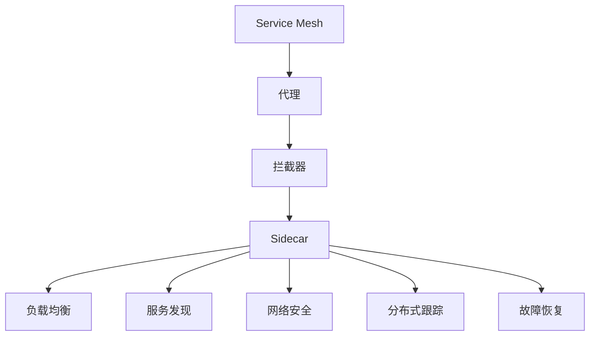

                 

# Kubernetes Service Mesh实践

## 1. 背景介绍

### 1.1 问题由来
随着微服务架构的普及，服务间通信的复杂度也在不断增加，服务间的依赖关系变得越来越紧密，这带来了诸多挑战：

1. **分布式跟踪问题**：当系统服务越来越多，调试和跟踪服务的请求路径变得越来越困难。
2. **延迟问题**：微服务间通信的开销和网络延迟对系统性能产生了重大影响。
3. **服务实例管理**：管理服务实例的上线、下线和状态变更变得复杂。
4. **安全性问题**：保障微服务间的安全通信成为一项重要挑战。
5. **网络故障定位**：当网络故障发生时，定位问题变得非常复杂。

为了解决上述问题，Service Mesh应运而生，它是一种独立于应用程序的分布式系统基础设施层，提供了多种机制和工具，以提升微服务架构的可靠性、安全性、性能和运维效率。

## 2. 核心概念与联系

### 2.1 核心概念概述

为更好地理解Service Mesh，我们需要首先理解以下几个核心概念：

- **Service Mesh**：Service Mesh是Kubernetes等微服务平台上的一种网络基础设施，用于处理微服务间的通信。它通过提供一些功能组件，如负载均衡、服务发现、网络安全、分布式跟踪、故障恢复等，来提升微服务架构的性能和可管理性。
- **代理**：代理是Service Mesh的核心组件，负责拦截服务间的通信请求，进行必要的处理后将其转发至目标服务。
- **拦截器**：拦截器是一种附加在代理上的功能模块，用于在代理拦截到的请求中进行一些特定的操作，比如日志记录、安全检查、性能监控等。
- **Sidecar**：Sidecar是一种与主应用进程一起部署的代理，负责拦截服务间的通信请求，提供服务发现、负载均衡、故障恢复等功能。

这些概念之间通过一系列流程和机制相互协作，共同构建起了一个高效、可靠、可扩展的分布式系统基础设施层。

### 2.2 核心概念原理和架构的 Mermaid 流程图


## 3. 核心算法原理 & 具体操作步骤

### 3.1 算法原理概述

Service Mesh的核心算法原理主要包括几个方面：

1. **拦截和代理**：代理拦截服务间的所有通信请求，并根据拦截器的指令进行相应的处理。
2. **负载均衡**：Service Mesh通过负载均衡器将请求分配到可用的服务实例上，以确保服务的高可用性和性能。
3. **服务发现**：Service Mesh维护一个服务注册表，用于记录服务实例的地址和状态信息，并动态更新。
4. **网络安全**：Service Mesh通过加密、认证、授权等机制，保障服务间通信的安全性。
5. **分布式跟踪**：Service Mesh内置了分布式跟踪功能，可以记录请求的路径、时间戳和调用链等信息，方便故障排查和性能优化。
6. **故障恢复**：Service Mesh通过一些机制，如断路器、重试、限流等，提高服务的可用性和容错能力。

### 3.2 算法步骤详解

下面详细介绍Service Mesh的核心算法步骤：

1. **部署Sidecar**：在每个服务的部署配置中，将Service Mesh的代理（Sidecar）部署在应用容器内，以便 intercept 所有进出服务的网络流量。

2. **配置拦截器**：通过配置拦截器，指定需要拦截的请求类型和操作。比如，可以设置日志记录拦截器、安全拦截器、性能监控拦截器等。

3. **负载均衡**：Service Mesh根据负载均衡策略，将请求分配到不同的服务实例上。常用的负载均衡策略有随机、轮询、最少连接等。

4. **服务发现**：Service Mesh维护一个服务注册表，记录所有服务实例的地址和状态信息。当服务实例发生变化时，Service Mesh会自动更新注册表。

5. **网络安全**：Service Mesh通过加密、认证、授权等机制，保障服务间通信的安全性。比如，可以使用TLS加密通信，通过认证和授权机制控制访问权限。

6. **分布式跟踪**：Service Mesh内置了分布式跟踪功能，可以记录请求的路径、时间戳和调用链等信息，方便故障排查和性能优化。

7. **故障恢复**：Service Mesh通过一些机制，如断路器、重试、限流等，提高服务的可用性和容错能力。

### 3.3 算法优缺点

Service Mesh的优点包括：

1. **可扩展性**：Service Mesh是一个独立于应用程序的分布式系统基础设施层，可以通过扩展代理和拦截器来支持更多的服务。
2. **高性能**：Service Mesh的代理和拦截器可以在本地处理通信请求，减少网络延迟和开销。
3. **易于运维**：Service Mesh提供了丰富的运维工具和监控指标，可以方便地进行故障排查和性能优化。
4. **安全可靠**：Service Mesh提供了多种网络安全机制，保障服务间通信的安全性和可靠性。

然而，Service Mesh也存在一些缺点：

1. **复杂性**：Service Mesh的架构和配置比较复杂，需要一定的运维经验。
2. **资源占用**：Sidecar容器会占用一定的资源，可能会对服务性能产生一定影响。
3. **成本高**：Service Mesh的引入需要额外的硬件和软件成本，对于一些中小型应用来说可能不经济。
4. **学习曲线**：需要一定的学习成本，需要掌握Service Mesh的各种配置和运维工具。

### 3.4 算法应用领域

Service Mesh在以下领域得到了广泛应用：

1. **金融服务**：金融行业对于数据安全和性能要求很高，Service Mesh可以在其中提供高效可靠的服务。
2. **电子商务**：电子商务平台需要处理大量的交易请求和用户数据，Service Mesh可以提高系统的可扩展性和可用性。
3. **游戏**：游戏行业需要处理大量的玩家请求和数据，Service Mesh可以提高系统的性能和容错能力。
4. **物流**：物流行业需要处理大量的订单和物流信息，Service Mesh可以提高系统的可靠性和性能。
5. **智能制造**：智能制造需要处理大量的生产数据和设备请求，Service Mesh可以提高系统的可用性和安全性。

## 4. 数学模型和公式 & 详细讲解 & 举例说明

### 4.1 数学模型构建

Service Mesh的数学模型主要包括以下几个方面：

1. **负载均衡模型**：
   - 随机负载均衡：$P_{random}(k) = \frac{1}{N}$，其中 $N$ 是服务实例的数量。
   - 轮询负载均衡：$P_{round-robin}(k) = \frac{1}{N}$，其中 $N$ 是服务实例的数量。

2. **故障恢复模型**：
   - 断路器模型：当服务实例不可用时，断路器会默认将请求分配到其他实例。
   - 重试机制：当请求失败时，可以通过重试机制进行多次尝试，直到成功或达到最大重试次数。

3. **分布式跟踪模型**：
   - 请求路径跟踪：记录请求的路径、时间戳和调用链等信息，方便故障排查和性能优化。

### 4.2 公式推导过程

1. **随机负载均衡公式推导**：
   - 假设服务实例数量为 $N$，请求到达每个实例的概率为 $P_{random}(k)$，则有：
   - $$ P_{random}(k) = \frac{1}{N} $$

2. **轮询负载均衡公式推导**：
   - 假设服务实例数量为 $N$，请求到达每个实例的概率为 $P_{round-robin}(k)$，则有：
   - $$ P_{round-robin}(k) = \frac{1}{N} $$

3. **断路器模型公式推导**：
   - 假设服务实例数量为 $N$，请求到达每个实例的概率为 $P_{circuit-breaker}(k)$，则有：
   - $$ P_{circuit-breaker}(k) = \frac{1}{N} $$

4. **重试机制公式推导**：
   - 假设服务实例数量为 $N$，请求到达每个实例的概率为 $P_{retry}(k)$，则有：
   - $$ P_{retry}(k) = \frac{1}{N} $$

### 4.3 案例分析与讲解

假设某服务系统有3个实例，负载均衡策略为随机，则请求到达每个实例的概率为 $\frac{1}{3}$。如果使用轮询策略，则请求到达每个实例的概率也为 $\frac{1}{3}$。如果某个实例故障，断路器机制会自动将请求分配到其他实例，从而保障系统的可靠性。如果请求失败，重试机制可以帮助系统重新发送请求，直到成功或达到最大重试次数。

## 5. 项目实践：代码实例和详细解释说明

### 5.1 开发环境搭建

1. **安装Kubernetes**：在服务器上安装Kubernetes，可以使用Minikube、Kubeadm、Rancher等工具。

2. **部署Service Mesh**：可以使用Istio、Linkerd等Service Mesh解决方案，通过YAML文件配置Service Mesh。

3. **配置Sidecar**：在每个服务的部署配置中，将Sidecar容器添加到Pod中。

### 5.2 源代码详细实现

以下是使用Istio配置Service Mesh的示例代码：

```yaml
apiVersion: networking.istio.io/v1alpha3
apiVersion: v1
kind: Service
metadata:
  name: example-service
spec:
  selector:
    app: example
  ports:
    - protocol: TCP
      port: 80
      targetPort: 8080
```

### 5.3 代码解读与分析

以上YAML配置文件定义了一个名为 `example-service` 的服务，它使用了 `istio` 部署的Sidecar容器。服务选择器 `app: example` 指定了匹配的Pod，目标端口 `targetPort: 8080` 指定了目标服务的端口。

## 6. 实际应用场景

### 6.1 金融服务

在金融服务中，Service Mesh可以提供高效可靠的服务。比如，银行系统需要处理大量的交易请求和用户数据，Service Mesh可以提高系统的可扩展性和可用性，同时保障数据安全和隐私。

### 6.2 电子商务

电子商务平台需要处理大量的交易请求和用户数据，Service Mesh可以提高系统的可扩展性和可用性。比如，使用Istio可以方便地进行负载均衡、故障恢复和分布式跟踪。

### 6.3 游戏

游戏行业需要处理大量的玩家请求和数据，Service Mesh可以提高系统的性能和容错能力。比如，使用Istio可以方便地进行负载均衡、故障恢复和分布式跟踪。

### 6.4 物流

物流行业需要处理大量的订单和物流信息，Service Mesh可以提高系统的可靠性和性能。比如，使用Istio可以方便地进行负载均衡、故障恢复和分布式跟踪。

### 6.5 智能制造

智能制造需要处理大量的生产数据和设备请求，Service Mesh可以提高系统的可用性和安全性。比如，使用Istio可以方便地进行负载均衡、故障恢复和分布式跟踪。

## 7. 工具和资源推荐

### 7.1 学习资源推荐

1. **Kubernetes官方文档**：详细介绍了Kubernetes的安装、部署和使用，是学习Service Mesh的入门必读。

2. **Istio官方文档**：详细介绍了Istio的安装、部署和使用，是学习Service Mesh的入门必读。

3. **Linkerd官方文档**：详细介绍了Linkerd的安装、部署和使用，是学习Service Mesh的入门必读。

4. **Kubernetes认证培训**：通过官方认证培训，可以系统掌握Kubernetes的高级特性和最佳实践。

5. **Istio认证培训**：通过官方认证培训，可以系统掌握Istio的高级特性和最佳实践。

### 7.2 开发工具推荐

1. **Minikube**：一种在本地运行Kubernetes的工具，方便在开发环境中测试和调试。

2. **Kubeadm**：一种快速安装和部署Kubernetes的工具，适合在生产环境中使用。

3. **Istio**：一种开源的Service Mesh解决方案，提供丰富的网络安全、负载均衡和分布式跟踪功能。

4. **Linkerd**：一种开源的Service Mesh解决方案，提供丰富的网络安全、负载均衡和分布式跟踪功能。

5. **Prometheus**：一种开源的监控工具，可以实时监控Kubernetes和Service Mesh的性能指标。

6. **Grafana**：一种开源的数据可视化工具，可以方便地展示Kubernetes和Service Mesh的监控数据。

### 7.3 相关论文推荐

1. **《Kubernetes Service Mesh for Microservices》**：介绍Istio的架构和功能，探讨其在微服务架构中的作用。

2. **《Microservices and the Four Laws of Networked Systems》**：探讨微服务架构的网络特性，强调了网络基础设施的重要性。

3. **《A Cloud-Native Paradigm Shift》**：探讨云原生架构的演变，强调了Service Mesh在云原生环境中的作用。

## 8. 总结：未来发展趋势与挑战

### 8.1 研究成果总结

Service Mesh技术已经成为微服务架构的重要组成部分，在金融、电子商务、游戏、物流、智能制造等众多领域得到了广泛应用。Service Mesh通过提供负载均衡、服务发现、网络安全、分布式跟踪、故障恢复等机制，极大地提升了微服务架构的性能和可管理性。

### 8.2 未来发展趋势

Service Mesh技术的未来发展趋势包括：

1. **生态系统完善**：更多的工具和组件将加入Service Mesh生态系统，提高Service Mesh的可用性和易用性。

2. **技术演进**：Service Mesh将不断演进，引入更多的网络特性和机制，提升系统的性能和可靠性。

3. **行业应用拓展**：Service Mesh将在更多行业领域得到应用，提供更灵活和高效的服务。

### 8.3 面临的挑战

Service Mesh技术在发展过程中仍面临一些挑战：

1. **复杂性**：Service Mesh的架构和配置比较复杂，需要一定的运维经验。

2. **资源占用**：Sidecar容器会占用一定的资源，可能会对服务性能产生一定影响。

3. **成本高**：Service Mesh的引入需要额外的硬件和软件成本，对于一些中小型应用来说可能不经济。

4. **学习曲线**：需要一定的学习成本，需要掌握Service Mesh的各种配置和运维工具。

### 8.4 研究展望

Service Mesh技术将在未来继续发展，推动微服务架构的演进。随着技术的不断进步，Service Mesh的复杂性和成本问题也将得到解决，其应用领域将更加广泛。

## 9. 附录：常见问题与解答

### Q1: 什么是Service Mesh？

A: Service Mesh是一种独立于应用程序的分布式系统基础设施层，用于处理微服务间的通信。它通过提供一些功能组件，如负载均衡、服务发现、网络安全、分布式跟踪、故障恢复等，来提升微服务架构的性能和可管理性。

### Q2: 什么是Sidecar？

A: Sidecar是一种与主应用进程一起部署的代理，负责拦截服务间的通信请求，提供服务发现、负载均衡、故障恢复等功能。

### Q3: 什么是Istio？

A: Istio是一种开源的Service Mesh解决方案，提供丰富的网络安全、负载均衡和分布式跟踪功能。它可以帮助用户轻松管理微服务架构，提高系统的可靠性和性能。

### Q4: 什么是Istio的拦截器？

A: Istio的拦截器是一种附加在Sidecar上的功能模块，用于在Sidecar拦截到的请求中进行一些特定的操作，比如日志记录、安全检查、性能监控等。

### Q5: 如何部署Service Mesh？

A: 可以通过Minikube、Kubeadm、Rancher等工具在Kubernetes上安装和部署Service Mesh。在服务部署配置中添加Sidecar容器，并配置拦截器即可。

### Q6: 如何监控Service Mesh？

A: 可以使用Prometheus和Grafana等工具实时监控Service Mesh的性能指标，并可视化展示监控数据。

---

作者：禅与计算机程序设计艺术 / Zen and the Art of Computer Programming

