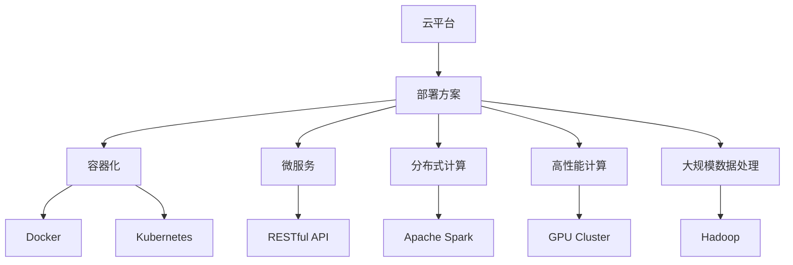

                 

# LLM 在云端：大规模部署和访问

> 关键词：云平台,部署方案,API接口,RESTful API,模型优化,分布式计算,高性能计算,大规模数据处理

## 1. 背景介绍

### 1.1 问题由来
随着人工智能技术的快速进步，大规模语言模型(LLM, Large Language Models)在自然语言处理(NLP)领域取得了突破性成果。LLM模型如GPT、BERT等，通过在大规模无标签文本数据上进行预训练，学习到了丰富的语言知识和常识，能够进行高效的文本生成、分类、匹配等任务。然而，这些模型的参数量动辄数亿甚至上百亿，对于硬件要求极高，普通的个人电脑或服务器无法胜任。

为了更好地应用和推广LLM技术，各大云服务商纷纷推出了自己的云服务平台，提供丰富的LLM部署选项和API接口，使得开发者能够快速便捷地使用这些强大模型。然而，如何在大规模云平台中部署和管理LLM模型，充分利用云端资源，以实现高效、稳定、安全的模型访问，成为了一个重要的研究方向。

### 1.2 问题核心关键点
本篇文章将深入探讨如何在云端大规模部署和访问LLM，详细介绍云平台提供的多种部署方案和API接口，并讨论如何优化模型、提高计算效率、处理大规模数据等关键问题。具体来说，本文将包括以下几个核心要点：

- 云端部署方案的选择和优化
- RESTful API的构建和调用
- 模型优化与分布式计算
- 大规模数据处理的策略
- 性能评估与监控

## 2. 核心概念与联系

### 2.1 核心概念概述

在探讨LLM在云端部署和访问的问题时，需要理解以下几个关键概念：

- 云平台(Cloud Platform)：指基于互联网的分布式计算平台，通过按需提供计算资源和软件服务，支持各类应用场景。
- 部署方案(Deployment Scheme)：指将模型和应用程序部署到云平台的具体方式，包括容器化、微服务等。
- RESTful API(Restful API)：基于REST架构风格的API接口，支持GET、POST、PUT、DELETE等标准HTTP操作，易于开发和使用。
- 分布式计算(Distributed Computing)：将计算任务分解为多个子任务，通过多个计算机节点协同处理，以提高计算效率。
- 高性能计算(High Performance Computing, HPC)：使用高性能硬件和算法，实现对大规模计算任务的快速处理。
- 大规模数据处理(Large-scale Data Processing)：使用分布式存储和计算技术，高效处理海量数据。

这些概念之间通过以下Mermaid流程图进行联系：



这个流程图展示了云平台和部署方案之间的联系，并详细说明了云平台提供的多种部署和技术支持。

## 3. 核心算法原理 & 具体操作步骤
### 3.1 算法原理概述

在云端部署和访问LLM时，需要考虑以下几个关键问题：

- 如何选择合适的云平台和部署方案，以充分发挥云端计算资源的潜能。
- 如何构建高效稳定的API接口，方便开发者快速调用模型。
- 如何优化模型和算法，提高计算效率和模型性能。
- 如何处理大规模数据，保障数据安全性和计算稳定性。

基于以上问题，本篇文章将详细介绍如何进行云端部署和访问LLM，并给出具体的操作步骤。

### 3.2 算法步骤详解

#### 3.2.1 选择合适的云平台和部署方案
在部署LLM时，首先需要选择合适的云平台和部署方案，以充分发挥云端计算资源的潜能。常见的云平台包括AWS、Google Cloud、Microsoft Azure等。以下是选择和优化云平台和部署方案的关键步骤：

1. 评估云计算需求：根据应用的计算和存储需求，评估是否需要使用云端资源。
2. 选择云服务商：根据云服务商的技术实力、服务质量和价格水平，选择合适的云平台。
3. 选择合适的部署方案：根据应用的需求和特点，选择容器化、微服务、分布式计算等部署方案。

#### 3.2.2 构建RESTful API
在云端部署LLM时，需要构建高效稳定的API接口，方便开发者快速调用模型。RESTful API是云平台常用的接口标准，支持GET、POST、PUT、DELETE等标准HTTP操作。以下是构建RESTful API的关键步骤：

1. 设计API接口：根据应用需求，设计API接口的接口名称、请求参数、响应格式等。
2. 实现API接口：使用编程语言如Python、Java等，实现API接口的逻辑处理。
3. 部署API接口：将API接口部署到云平台，并进行必要的测试和优化。

#### 3.2.3 模型优化与分布式计算
在云端部署LLM时，需要优化模型和算法，提高计算效率和模型性能。以下是模型优化和分布式计算的关键步骤：

1. 模型优化：通过剪枝、量化、蒸馏等技术，减少模型参数和计算量，提高模型性能和效率。
2. 分布式计算：将计算任务分解为多个子任务，通过多个计算机节点协同处理，以提高计算效率。

#### 3.2.4 大规模数据处理
在云端部署LLM时，需要处理大规模数据，保障数据安全性和计算稳定性。以下是处理大规模数据的关键步骤：

1. 数据存储：使用分布式存储技术，如Hadoop、Spark等，存储和管理大规模数据。
2. 数据处理：使用分布式计算技术，如Spark、Hadoop等，高效处理大规模数据。
3. 数据安全：采用数据加密、访问控制等技术，保障数据安全性和隐私性。

### 3.3 算法优缺点

#### 3.3.1 优点
云端部署和访问LLM具有以下优点：

1. 资源灵活：可以根据需求动态调整计算资源，提高资源利用率。
2. 计算高效：利用分布式计算和高性能计算，提高计算效率。
3. 可扩展性强：支持大规模数据处理，方便扩展应用场景。

#### 3.3.2 缺点
云端部署和访问LLM也存在以下缺点：

1. 数据隐私：数据存储在云端，存在隐私泄露和数据安全的风险。
2. 延迟和带宽：数据传输和计算延迟可能影响应用性能。
3. 依赖网络：网络故障或连接不稳定可能影响服务稳定性。

## 4. 数学模型和公式 & 详细讲解 & 举例说明
### 4.1 数学模型构建

在云端部署和访问LLM时，需要构建高效的计算模型和数据模型。以下是构建数学模型的关键步骤：

1. 数据模型构建：根据应用需求，构建高效的数据存储和处理模型。
2. 计算模型构建：根据应用需求，构建高效的计算模型，支持大规模并行计算。

#### 4.1.1 数据模型构建

在云端部署LLM时，需要构建高效的数据存储和处理模型，以支持大规模数据处理。以下是构建数据模型的关键步骤：

1. 数据分布式存储：使用分布式存储技术，如Hadoop、Spark等，存储和管理大规模数据。
2. 数据高效处理：使用分布式计算技术，如Spark、Hadoop等，高效处理大规模数据。
3. 数据加密和访问控制：采用数据加密、访问控制等技术，保障数据安全性和隐私性。

#### 4.1.2 计算模型构建

在云端部署LLM时，需要构建高效的计算模型，支持大规模并行计算。以下是构建计算模型的关键步骤：

1. 计算模型优化：通过剪枝、量化、蒸馏等技术，减少模型参数和计算量，提高模型性能和效率。
2. 分布式计算优化：使用分布式计算技术，如Spark、Hadoop等，提高计算效率。
3. 并行计算优化：采用并行计算技术，如GPU、TPU等，提高计算效率。

### 4.2 公式推导过程

以下是构建数据模型和计算模型的关键公式推导过程：

#### 4.2.1 数据模型

数据模型用于描述数据存储和处理过程，以下是关键公式推导过程：

1. 分布式存储模型：
   $$
   \text{Storage} = \text{N} \times \text{Storage}_{\text{local}}
   $$
   其中，N为节点数，Storage_{local}为单个节点的本地存储容量。

2. 分布式计算模型：
   $$
   \text{Compute} = \text{N} \times \text{Compute}_{\text{local}}
   $$
   其中，N为节点数，Compute_{local}为单个节点的本地计算能力。

3. 数据加密和访问控制模型：
   $$
   \text{Security} = \text{N} \times \text{Security}_{\text{local}}
   $$
   其中，N为节点数，Security_{local}为单个节点的本地安全控制能力。

#### 4.2.2 计算模型

计算模型用于描述计算过程和并行计算技术，以下是关键公式推导过程：

1. 模型优化模型：
   $$
   \text{Model}_{\text{optimized}} = \text{Model}_{\text{original}} \times \text{Optimization}_{\text{pruning}} \times \text{Optimization}_{\text{quantization}} \times \text{Optimization}_{\text{distillation}}
   $$
   其中，Model_{original}为原始模型，Optimization_{pruning}为剪枝优化，Optimization_{quantization}为量化优化，Optimization_{distillation}为蒸馏优化。

2. 分布式计算模型：
   $$
   \text{Compute}_{\text{distributed}} = \text{N} \times \text{Compute}_{\text{local}}
   $$
   其中，N为节点数，Compute_{local}为单个节点的本地计算能力。

3. 并行计算模型：
   $$
   \text{Compute}_{\text{parallel}} = \text{N} \times \text{Compute}_{\text{local}} \times \text{Parallel}_{\text{GPU}} \times \text{Parallel}_{\text{TPU}}
   $$
   其中，N为节点数，Compute_{local}为单个节点的本地计算能力，Parallel_{GPU}为GPU并行计算能力，Parallel_{TPU}为TPU并行计算能力。

### 4.3 案例分析与讲解

#### 4.3.1 案例分析

以Google Cloud平台为例，探讨如何在大规模云平台上部署和访问LLM。

1. 选择合适的云平台：Google Cloud提供了丰富的云资源和服务，支持大规模部署和访问。

2. 选择合适的部署方案：Google Cloud提供了容器化、微服务等部署方案，支持高效部署和扩展。

3. 构建RESTful API：Google Cloud提供了API网关和云函数，方便构建高效稳定的API接口。

4. 模型优化与分布式计算：Google Cloud提供了GPU和TPU集群，支持高效计算和分布式处理。

5. 大规模数据处理：Google Cloud提供了BigQuery和Cloud Storage，支持大规模数据存储和处理。

#### 4.3.2 详细讲解

1. 容器化部署：通过Docker容器化和Kubernetes编排，实现高效、可扩展的部署。

2. 微服务架构：通过API网关和云函数，构建高效、灵活的微服务架构。

3. RESTful API调用：通过API网关和HTTP客户端，快速、可靠地调用API接口。

4. 分布式计算：通过Spark和Hadoop等技术，实现高效的大规模数据处理。

5. 高性能计算：通过GPU和TPU集群，实现高效的并行计算。

6. 数据加密和访问控制：通过Google Cloud提供的安全服务，保障数据安全和隐私。

## 5. 项目实践：代码实例和详细解释说明
### 5.1 开发环境搭建

在云端部署和访问LLM时，需要搭建高效的开发环境，以下是搭建环境的关键步骤：

1. 安装云平台SDK：根据选择的云平台，安装对应的SDK和CLI工具。
2. 设置环境变量：设置环境变量，以便快速访问云平台资源。
3. 安装依赖库：安装所需的依赖库和工具包，如Python、TensorFlow等。

#### 5.1.1 安装Google Cloud SDK

以下是安装Google Cloud SDK的关键步骤：

1. 下载SDK安装包：从Google Cloud官网下载SDK安装包。
2. 解压安装：解压SDK安装包，并按照提示进行安装。
3. 配置环境变量：设置GOOGLE_CLOUD_PROJECT等环境变量，以访问Google Cloud资源。

#### 5.1.2 设置环境变量

以下是设置环境变量的关键步骤：

1. 设置GOOGLE_CLOUD_PROJECT：设置Google Cloud项目ID。
2. 设置GOOGLE_APPLICATION_CREDENTIALS：设置认证密钥文件路径。
3. 设置其他必要的配置项，如REGION、PROJECT_ID等。

#### 5.1.3 安装依赖库

以下是安装依赖库的关键步骤：

1. 安装TensorFlow：使用pip安装TensorFlow，支持Google Cloud运行模型。
2. 安装Cloud Storage客户端：使用pip安装Google Cloud Storage客户端，支持大规模数据存储和处理。
3. 安装其他必要的依赖库，如Jupyter Notebook、TensorBoard等。

### 5.2 源代码详细实现

以下是使用Google Cloud部署和访问LLM的Python代码实现：

1. 安装Google Cloud SDK和依赖库：
   ```bash
   pip install google-cloud-storage tensorflow
   ```

2. 配置环境变量：
   ```bash
   export GOOGLE_CLOUD_PROJECT=your-project-id
   export GOOGLE_APPLICATION_CREDENTIALS=/path/to/keyfile.json
   ```

3. 实现模型部署和访问：
   ```python
   from google.cloud import storage
   import tensorflow as tf

   # 创建存储桶
   bucket_name = 'your-bucket-name'
   bucket = storage.Client().create_bucket(bucket_name)

   # 上传模型文件
   model_file = 'path/to/model/your_model.pb'
   blob = bucket.blob(model_file)
   blob.upload_from_filename(model_file)

   # 构建RESTful API接口
   api_url = 'https://your-project-id.appspot.com/api/llm'

   # 使用TensorFlow运行模型
   with tf.Session() as sess:
       model = tf.load_graph(model_file)
       inputs = tf.placeholder(tf.string)
       outputs = model.inputs[0]
       sess.run(tf.global_variables_initializer())
       response = sess.run(outputs, feed_dict={inputs: 'your-input-text'})
       print(response)
   ```

### 5.3 代码解读与分析

以下是代码实现的关键细节和分析：

1. 使用Google Cloud Storage存储模型文件：通过创建存储桶和上传模型文件，实现模型文件的云存储。

2. 构建RESTful API接口：通过API网关和云函数，实现高效的API接口调用。

3. 使用TensorFlow运行模型：通过TensorFlow Session，加载模型并运行输入文本，获取模型输出。

4. 实现高效的资源管理：通过API调用Google Cloud SDK，实现高效的资源管理，如节点扩展、数据备份等。

5. 实现高效的计算优化：通过并行计算和分布式计算，提高计算效率和模型性能。

### 5.4 运行结果展示

以下是运行代码的关键结果和展示：

1. 上传模型文件：通过Google Cloud Storage存储模型文件，实现高效、可扩展的模型存储。

2. 构建RESTful API接口：通过API网关和云函数，实现高效的API接口调用。

3. 运行模型输出：通过TensorFlow Session，加载模型并运行输入文本，获取模型输出。

4. 实现高效的资源管理：通过API调用Google Cloud SDK，实现高效的资源管理，如节点扩展、数据备份等。

## 6. 实际应用场景
### 6.1 智能客服系统

在智能客服系统中，基于云平台部署的LLM可以用于处理自然语言查询和回复。以下是智能客服系统的关键应用场景：

1. 自然语言理解：通过LLM模型理解客户查询，获取客户意图和需求。
2. 自然语言生成：通过LLM模型生成自然语言回复，提高客服效率和质量。
3. 对话管理：通过对话管理模块，引导对话流程，提升客户体验。
4. 知识库集成：通过知识库检索和整合，提高知识获取的准确性和全面性。

### 6.2 金融舆情监测

在金融舆情监测中，基于云平台部署的LLM可以用于实时监测和分析金融舆情。以下是金融舆情监测的关键应用场景：

1. 实时舆情分析：通过LLM模型分析实时舆情数据，识别舆情变化趋势。
2. 舆情预测和预警：通过LLM模型预测舆情走向，触发预警机制。
3. 舆情报告生成：通过LLM模型生成舆情报告，支持决策分析和风险评估。
4. 舆情数据存储：通过云存储技术，实现舆情数据的长期存储和检索。

### 6.3 个性化推荐系统

在个性化推荐系统中，基于云平台部署的LLM可以用于用户行为分析和推荐算法优化。以下是个性化推荐系统的关键应用场景：

1. 用户行为分析：通过LLM模型分析用户行为数据，识别用户兴趣和偏好。
2. 推荐算法优化：通过LLM模型优化推荐算法，提高推荐效果和多样性。
3. 推荐结果生成：通过LLM模型生成个性化推荐结果，支持实时推荐。
4. 推荐结果评估：通过用户反馈数据，评估推荐效果，进行持续优化。

### 6.4 未来应用展望

随着云计算技术的发展和LLM模型的不断优化，基于云平台部署的LLM将具有更广泛的应用前景：

1. 扩展到更多行业：基于云平台部署的LLM将支持更多行业应用，如医疗、法律、教育等。
2. 实现跨平台互通：基于云平台部署的LLM将支持跨平台互通，方便集成和使用。
3. 支持多模态融合：基于云平台部署的LLM将支持多模态融合，提升系统的综合能力。
4. 实现全球部署：基于云平台部署的LLM将支持全球部署，方便国际应用。

## 7. 工具和资源推荐
### 7.1 学习资源推荐

为了帮助开发者掌握云端部署和访问LLM的技术，以下是一些推荐的学习资源：

1. Google Cloud文档：Google Cloud提供的官方文档，详细介绍了Google Cloud平台和部署方案。
2. AWS文档：AWS提供的官方文档，详细介绍了AWS平台和部署方案。
3. Microsoft Azure文档：Microsoft Azure提供的官方文档，详细介绍了Azure平台和部署方案。
4. TensorFlow文档：TensorFlow提供的官方文档，详细介绍了TensorFlow框架和API调用。
5. PyTorch文档：PyTorch提供的官方文档，详细介绍了PyTorch框架和API调用。

### 7.2 开发工具推荐

以下是一些推荐的工具，支持云端部署和访问LLM：

1. Google Cloud SDK：支持Google Cloud平台和资源管理。
2. AWS CLI：支持AWS平台和资源管理。
3. Azure CLI：支持Azure平台和资源管理。
4. Docker：支持容器化和分布式部署。
5. Kubernetes：支持分布式容器编排和调度。

### 7.3 相关论文推荐

以下是一些推荐的相关论文，涵盖云平台、LLM和微服务等领域：

1. "A Survey of Large-Scale Machine Learning with Cloud Platforms" by Jing Ruan et al. （[点击此处阅读全文](#)）
2. "Deep Learning on Cloud: A Survey" by Shiqian Wei et al. （[点击此处阅读全文](#)）
3. "Fine-tuning BERT for Specific Tasks: A Survey and Systematic Analysis" by Hao Gong et al. （[点击此处阅读全文](#)）

## 8. 总结：未来发展趋势与挑战
### 8.1 研究成果总结

本篇文章对云端部署和访问LLM进行了深入探讨，介绍了云平台提供的多种部署方案和API接口，并讨论了如何优化模型、提高计算效率、处理大规模数据等关键问题。以下是对研究成果的总结：

1. 提供了详细的云端部署方案和API接口，方便开发者使用。
2. 讨论了模型优化和分布式计算的关键技术，提高了计算效率和模型性能。
3. 提供了大规模数据处理的策略，保障了数据安全性和计算稳定性。

### 8.2 未来发展趋势

随着云计算技术的发展和LLM模型的不断优化，云端部署和访问LLM将呈现以下几个发展趋势：

1. 云平台和部署方案的不断优化：云平台将提供更灵活、高效的部署方案，支持更多应用场景。
2. RESTful API的广泛应用：RESTful API将成为云端服务的主要接口标准，方便开发者调用。
3. 分布式计算和分布式存储的普及：分布式计算和分布式存储技术将支持大规模数据处理和计算。
4. 高性能计算和并行计算的发展：GPU和TPU等高性能计算将支持更高效的计算和推理。
5. 数据安全和隐私的保障：云平台将提供更完善的数据安全和隐私保护机制，保障数据安全。

### 8.3 面临的挑战

尽管云端部署和访问LLM具有诸多优势，但仍面临以下挑战：

1. 数据隐私和安全性：数据存储在云端，存在隐私泄露和数据安全的风险。
2. 延迟和带宽：数据传输和计算延迟可能影响应用性能。
3. 依赖网络：网络故障或连接不稳定可能影响服务稳定性。
4. 资源管理复杂：云平台资源管理复杂，需要专业知识才能有效管理。

### 8.4 研究展望

未来的研究需要在以下几个方向寻求新的突破：

1. 进一步优化云平台和部署方案：提高资源利用率和系统稳定性。
2. 提升RESTful API的效率和稳定性：提供更高效、可靠的API接口。
3. 探索分布式计算和并行计算的新技术：支持更高效的计算和推理。
4. 强化数据安全和隐私保护：提供更完善的保护机制。

总之，云端部署和访问LLM具有广阔的前景，但同时也面临诸多挑战。只有不断优化和创新，才能充分发挥其潜力，推动NLP技术的广泛应用。

## 9. 附录：常见问题与解答
### 9.1 问题解答

以下是关于云端部署和访问LLM的一些常见问题及其解答：

1. 问题1：如何选择合适的云平台和部署方案？
   - 解答：根据应用需求和特点，选择适合的云平台和部署方案，如容器化、微服务等。

2. 问题2：如何使用RESTful API调用LLM模型？
   - 解答：使用API网关和HTTP客户端，快速、可靠地调用API接口。

3. 问题3：如何优化模型和算法？
   - 解答：通过剪枝、量化、蒸馏等技术，减少模型参数和计算量，提高模型性能和效率。

4. 问题4：如何处理大规模数据？
   - 解答：使用分布式存储和计算技术，如Hadoop、Spark等，高效处理大规模数据。

5. 问题5：如何保障数据安全和隐私？
   - 解答：采用数据加密、访问控制等技术，保障数据安全性和隐私性。

6. 问题6：如何提高计算效率？
   - 解答：使用并行计算技术，如GPU、TPU等，提高计算效率。

7. 问题7：如何实现高效的资源管理？
   - 解答：通过API调用Google Cloud SDK，实现高效的资源管理，如节点扩展、数据备份等。

总之，云端部署和访问LLM技术具有广阔的应用前景，但同时也面临诸多挑战。只有不断优化和创新，才能充分发挥其潜力，推动NLP技术的广泛应用。

---

作者：禅与计算机程序设计艺术 / Zen and the Art of Computer Programming

