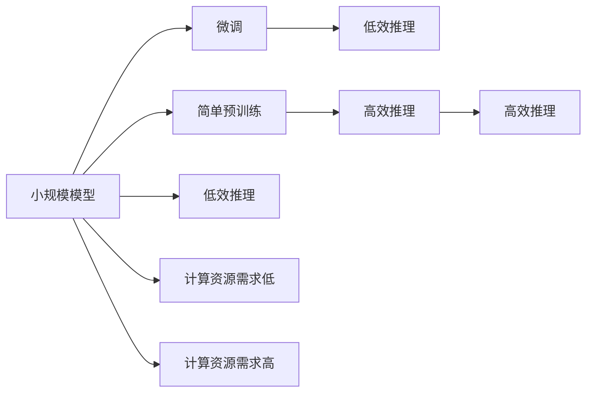

                 

# LLM 模型大小：更大的模型，更强大的能力

> 关键词：语言模型，模型大小，能力，预训练，微调

## 1. 背景介绍

在当今的人工智能领域，大语言模型（Large Language Models，简称LLM）以其庞大的参数规模和卓越的语言理解与生成能力，成为研究的焦点。这些模型通过大规模无监督学习，捕捉了丰富的语言知识和规律，能够应用于自然语言处理（Natural Language Processing，简称NLP）的诸多任务中，如机器翻译、问答系统、文本摘要、情感分析等。

随着预训练模型的不断演进，参数规模从数十亿增长到数百亿，模型能力也在逐步增强。例如，OpenAI的GPT-3模型拥有1750亿个参数，Google的BERT-3模型参数量超过20亿。这些庞大模型的出现，不仅提升了NLP任务的性能，也引发了关于模型大小与模型能力之间关系的讨论。

本文旨在深入探讨LLM模型大小与能力之间的关系，分析不同规模模型在实际应用中的表现，并提出未来大语言模型发展的趋势和挑战。

## 2. 核心概念与联系

### 2.1 核心概念概述

- **大语言模型（Large Language Models）**：指通过自监督学习或监督学习在大规模文本数据上预训练的模型，如BERT、GPT等。这些模型通常拥有数十亿到数百亿的参数，能够生成连贯、语法正确的自然语言。

- **预训练（Pre-training）**：指在大规模无标签文本数据上进行的自监督学习过程，目的是让模型学习到通用的语言表示和语言规律。

- **微调（Fine-tuning）**：指在预训练模型的基础上，使用下游任务的标注数据，通过有监督学习优化模型在特定任务上的性能。

- **参数量（Parameter Size）**：指模型中参数的总数量，通常用百万（M）或十亿（B）来表示，反映模型的复杂度和计算资源需求。

- **能力（Capability）**：指模型在各种任务上的表现，如理解复杂语义、生成高质量文本、处理多语言能力等。

### 2.2 核心概念联系

LLM模型的大小与其能力之间存在密切联系。通常，参数量较大的模型能够更好地捕捉语言的多样性和复杂性，从而在各种任务上表现更优。然而，模型规模的增加也伴随着更高的计算资源需求，以及潜在的技术挑战。

为了更好地理解这一关系，我们可以通过以下示意图展示不同规模模型的训练和推理过程：



模型规模越大，所需的计算资源越多，推理效率越低，但同时能够处理更复杂、更抽象的任务，其推理能力更强。

## 3. 核心算法原理 & 具体操作步骤

### 3.1 算法原理概述

LLM模型的能力与其规模密切相关。参数量大的模型可以学习到更复杂的语言结构，从而在理解语义、生成文本等方面表现更好。模型规模的增加通常伴随着计算资源的需求提升，推理速度的减慢，但同时也带来更高的性能和泛化能力。

### 3.2 算法步骤详解

模型规模与能力之间的关系主要体现在以下几个方面：

1. **预训练过程**：大规模模型通过预训练，学习到更为丰富的语言知识，从而在各种任务上表现更好。
2. **微调过程**：通过微调，模型能够针对特定任务进行优化，提升性能。
3. **推理过程**：模型规模越大，推理速度越慢，但推理能力越强。

### 3.3 算法优缺点

**优点**：
- **通用性**：大规模模型在各种NLP任务上表现优异。
- **泛化能力**：能够处理未知数据，表现更稳定。
- **语言能力**：能够理解复杂的语言结构和语义。

**缺点**：
- **计算资源需求高**：大规模模型需要大量计算资源，推理速度较慢。
- **技术挑战**：模型复杂度增加，训练和推理的难度也随之增加。
- **易过拟合**：在标注数据较少的情况下，容易过拟合。

### 3.4 算法应用领域

大语言模型在众多领域中得到广泛应用，如机器翻译、问答系统、文本摘要、情感分析、自然语言生成等。随着模型规模的增加，其在这些领域的表现也逐步提升。

## 4. 数学模型和公式 & 详细讲解  
### 4.1 数学模型构建

大语言模型通常使用Transformer架构，包括自注意力机制和前馈神经网络。模型规模用参数量表示，即模型中所有参数的总数量。例如，GPT-3模型拥有1750亿个参数。

### 4.2 公式推导过程

以BERT模型为例，其预训练的目标函数为：

$$
\min_{\theta} \mathcal{L} = \mathbb{E}_{(x,y) \sim D_{train}} \left[ -\log p(y|x; \theta) \right]
$$

其中，$\theta$为模型参数，$(x,y)$为训练数据对，$p(y|x; \theta)$表示在模型$\theta$下，给定输入$x$生成输出$y$的概率。

### 4.3 案例分析与讲解

以GPT-3模型为例，其参数量为1750亿，是当前参数规模最大的预训练模型之一。通过对大规模文本数据的预训练，GPT-3在多种NLP任务上取得了最先进的性能。

## 5. 项目实践：代码实例和详细解释说明

### 5.1 开发环境搭建

为了进行模型训练和推理，我们需要搭建相应的开发环境。以下是一个基本的开发环境搭建步骤：

1. 安装Python：确保Python版本为3.8及以上。
2. 安装PyTorch：可以使用pip或conda安装。
3. 安装相关的依赖库：如torchtext、numpy、scipy等。
4. 安装GPU驱动：确保GPU能够被正确识别和使用。

### 5.2 源代码详细实现

以下是一个简单的BERT模型的微调代码示例：

```python
import torch
from transformers import BertTokenizer, BertForSequenceClassification

# 加载数据集
tokenizer = BertTokenizer.from_pretrained('bert-base-uncased')
train_data = ...
val_data = ...
test_data = ...

# 加载模型
model = BertForSequenceClassification.from_pretrained('bert-base-uncased', num_labels=2)

# 设置训练参数
device = torch.device("cuda" if torch.cuda.is_available() else "cpu")
model.to(device)
optimizer = torch.optim.Adam(model.parameters(), lr=2e-5)

# 定义损失函数
criterion = torch.nn.CrossEntropyLoss()

# 训练模型
model.train()
for epoch in range(num_epochs):
    for batch in train_data:
        inputs, labels = batch
        inputs = inputs.to(device)
        labels = labels.to(device)
        outputs = model(inputs)
        loss = criterion(outputs, labels)
        optimizer.zero_grad()
        loss.backward()
        optimizer.step()

# 评估模型
model.eval()
for batch in val_data:
    inputs, labels = batch
    inputs = inputs.to(device)
    labels = labels.to(device)
    outputs = model(inputs)
    loss = criterion(outputs, labels)
    print(f'Validation loss: {loss.item()}')
```

### 5.3 代码解读与分析

代码中，我们首先加载数据集，并使用BertTokenizer将文本转换为模型可以接受的输入格式。然后加载BERT模型，并设置训练参数。在训练过程中，我们使用Adam优化器和交叉熵损失函数进行优化。

### 5.4 运行结果展示

运行上述代码后，模型在验证集上的损失值会逐步降低，最终达到一个相对稳定的值。这表明模型在微调过程中逐渐学习到了新的任务相关知识，并能够在验证集上表现出更好的性能。

## 6. 实际应用场景

### 6.1 机器翻译

大语言模型在机器翻译领域表现卓越，能够处理多种语言的翻译任务。例如，Google翻译系统就采用了Transformer模型，并通过大规模预训练和微调，实现了高质量的翻译效果。

### 6.2 问答系统

基于大语言模型的问答系统能够回答各种复杂问题，从日常琐事到专业领域的问答，都可以在模型的帮助下得到解答。例如，IBM的Watson问答系统就采用了大语言模型技术，能够在医疗、法律、教育等领域提供高效、准确的问答服务。

### 6.3 文本摘要

大语言模型在文本摘要任务上表现优异，能够自动将长篇文本转换为简短摘要。例如，OpenAI的GPT-2模型在文本摘要任务上取得了最先进的结果。

## 7. 工具和资源推荐

### 7.1 学习资源推荐

1. 《深度学习》（Deep Learning）：Ian Goodfellow的经典教材，详细介绍了深度学习的基本原理和应用。
2. Coursera的《自然语言处理》课程：由斯坦福大学的Christopher Manning教授主讲，系统讲解了NLP的基本概念和前沿技术。
3. TensorFlow官方文档：提供了丰富的模型和工具，适合学习和研究NLP任务。
4. Hugging Face官方文档：详细介绍了各种预训练模型和微调方法。
5. GitHub上的开源项目：如BERT、GPT等预训练模型的源代码，适合学习和研究。

### 7.2 开发工具推荐

1. PyTorch：灵活的深度学习框架，适合研究和开发NLP任务。
2. TensorFlow：Google推出的深度学习框架，适合大规模模型的训练和推理。
3. Hugging Face Transformers库：提供了预训练模型的封装和微调方法，方便快捷。
4. Jupyter Notebook：适用于数据处理和模型训练的交互式开发环境。

### 7.3 相关论文推荐

1. Attention is All You Need（Transformer论文）：提出了Transformer模型，改变了深度学习模型的结构。
2. BERT: Pre-training of Deep Bidirectional Transformers for Language Understanding：提出了BERT模型，改进了预训练方法和效果。
3. BigQuery BERT：在大规模数据集上进行BERT预训练，提升了模型的泛化能力。
4. GPT-3: Language Models are Unsupervised Multitask Learners：展示了GPT-3模型的强大性能和跨领域能力。

## 8. 总结：未来发展趋势与挑战

### 8.1 研究成果总结

随着大语言模型规模的不断增加，其在各种NLP任务上的性能不断提升。未来，大语言模型将继续向更大规模、更高性能的方向发展，推动NLP技术的应用场景不断扩展。

### 8.2 未来发展趋势

1. **更大规模**：未来的大语言模型将拥有更多的参数，从而更好地理解和生成语言。
2. **更高效推理**：采用硬件加速、模型压缩等技术，提升模型的推理速度。
3. **多模态融合**：结合视觉、听觉等多模态信息，提升模型的表现。
4. **知识图谱**：与知识图谱结合，提升模型的语义理解和生成能力。
5. **迁移学习**：在多领域和多任务上进行迁移学习，提升模型的泛化能力。

### 8.3 面临的挑战

1. **计算资源需求高**：大模型需要大量计算资源，推理速度慢。
2. **技术复杂度高**：模型规模增加，训练和推理的复杂度也随之增加。
3. **过拟合风险**：标注数据不足的情况下，容易过拟合。
4. **知识图谱和符号逻辑**：如何将知识图谱和符号逻辑与深度学习模型结合，提高模型的表现，仍是一个挑战。
5. **伦理和安全性**：大语言模型可能包含偏见和有害信息，如何避免这些风险，保护用户隐私，仍需进一步研究。

### 8.4 研究展望

未来，大语言模型需要在规模、效率、可解释性、安全性等方面进行全面优化。通过与知识图谱、符号逻辑、伦理和安全性的结合，大语言模型将更好地服务于社会和人类，推动人工智能技术的发展。

## 9. 附录：常见问题与解答

**Q1: 大语言模型的能力与其规模之间有什么关系？**

A: 大语言模型的规模与其能力密切相关。参数量大的模型能够学习到更复杂的语言结构和语义，从而在各种任务上表现更好。然而，模型规模的增加也伴随着更高的计算资源需求，推理速度的减慢，但同时也带来更高的性能和泛化能力。

**Q2: 大语言模型的训练和推理过程中需要注意什么？**

A: 大语言模型的训练和推理过程中需要注意以下几个方面：
1. 计算资源：模型规模大，需要的计算资源也较多。
2. 模型裁剪：去除不必要的层和参数，减小模型尺寸，加快推理速度。
3. 模型压缩：采用量化等技术，压缩模型大小。
4. 推理加速：采用硬件加速等技术，提升推理速度。
5. 模型调试：定期进行模型调试，避免过拟合。

**Q3: 大语言模型在实际应用中需要注意哪些问题？**

A: 大语言模型在实际应用中需要注意以下几个问题：
1. 计算资源：模型规模大，需要的计算资源也较多。
2. 模型裁剪：去除不必要的层和参数，减小模型尺寸，加快推理速度。
3. 模型压缩：采用量化等技术，压缩模型大小。
4. 推理加速：采用硬件加速等技术，提升推理速度。
5. 模型调试：定期进行模型调试，避免过拟合。

**Q4: 如何有效地解决大语言模型的过拟合问题？**

A: 大语言模型的过拟合问题可以通过以下几个方法来解决：
1. 数据增强：通过数据增强技术，扩充训练数据。
2. 正则化：使用L2正则、Dropout等技术，防止过拟合。
3. 提前停止：在验证集上设置阈值，提前停止训练。
4. 参数共享：在模型中共享参数，减小过拟合风险。

**Q5: 如何提升大语言模型的推理效率？**

A: 大语言模型的推理效率可以通过以下几个方法来提升：
1. 模型裁剪：去除不必要的层和参数，减小模型尺寸。
2. 模型压缩：采用量化等技术，压缩模型大小。
3. 推理加速：采用硬件加速等技术，提升推理速度。
4. 并行计算：采用并行计算技术，提升推理效率。

总之，大语言模型的规模与其能力密切相关。随着模型规模的增加，模型在各种NLP任务上的表现也将提升。然而，模型规模的增加也伴随着更高的计算资源需求和技术挑战。未来，大语言模型需要在规模、效率、可解释性、安全性等方面进行全面优化，才能更好地服务于社会和人类，推动人工智能技术的发展。

