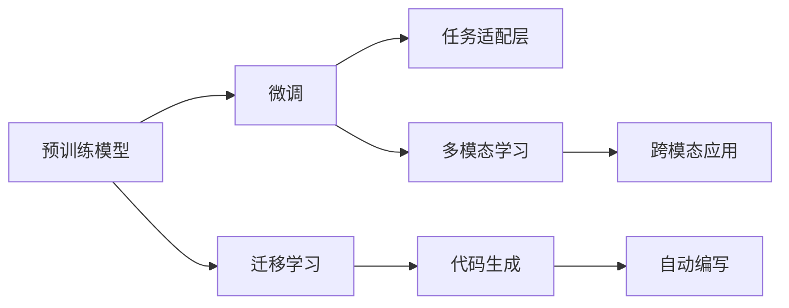

                 

# LLM 生态系统：一个新产业的诞生

## 1. 背景介绍

在人工智能(AI)的浪潮中，语言模型大模型(LLMs)无疑是最具代表性和影响力的技术之一。从早期的语言模型如word2vec，到如今的GPT-3、BERT等大模型，LLMs已经成为驱动NLP（自然语言处理）领域创新和应用的核心力量。然而，大模型并非孤立存在，它们与一系列相关的技术、工具、平台、生态系统相互作用，共同构建了一个庞大的LLM生态系统。本文将探讨LLM生态系统的诞生过程、核心组成和未来发展方向，揭示这一新兴产业带来的变革性影响。

## 2. 核心概念与联系

### 2.1 核心概念概述

为理解LLM生态系统的全貌，首先需要定义几个关键概念：

- **语言模型大模型(LLMs)**：基于深度学习框架构建的，能够自动学习并生成自然语言文本的模型。如GPT-3、BERT、T5等，以其巨大的参数量和强大的泛化能力著称。
- **预训练模型**：在大规模无标注数据上训练的模型，旨在学习语言的通用表征，常见于像BERT和GPT这样的模型。
- **微调(MF)与迁移学习(ML)**：在特定领域或任务上，对预训练模型进行有监督或无监督的调整，以提升其在特定任务上的性能。
- **代码生成与自动编写**：利用LLMs生成代码或辅助编写代码，提升软件开发的效率和质量。
- **多模态学习**：结合文本、图像、音频等多种数据形式，构建跨模态的AI系统，提升系统的感知能力和应用场景。

### 2.2 核心概念原理和架构的 Mermaid 流程图



该图展示了LLM生态系统的核心概念及其相互关系：

- 预训练模型通过在大规模无标签数据上自监督学习，获得通用的语言表征。
- 微调技术通过在特定任务上对预训练模型进行调整，提升其任务特定性能。
- 迁移学习通过将预训练模型应用于多个任务，提升模型的泛化能力。
- 代码生成和自动编写利用LLMs在生成和编写代码上的能力，提升软件开发的效率。
- 多模态学习通过结合多种数据形式，拓展AI系统的感知范围和应用场景。

## 3. 核心算法原理 & 具体操作步骤

### 3.1 算法原理概述

LLMs生态系统的构建，依赖于一系列核心算法的协同工作。这些算法包括预训练、微调、迁移学习、代码生成、多模态学习等。其中，预训练和微调是最为关键的环节。

**预训练算法**：通常使用自监督学习方法，如掩码语言模型(MLM)、下一句子预测(NSP)等，在大规模语料库上训练模型，学习语言的通用表示。以BERT为例，其通过掩码语言模型进行预训练，使得模型能够预测被随机掩码的单词，从而学习到单词和上下文之间的关系。

**微调算法**：在预训练模型基础上，使用任务相关的数据对模型进行有监督的调整。以Fine-Tuning为例，将模型作为初始化参数，通过目标任务的数据集进行微调，使得模型能够适应特定任务。例如，使用大量带有标签的问答数据，对GPT模型进行微调，使其能够回答问题。

### 3.2 算法步骤详解

下面以微调为例，详细描述其操作步骤：

1. **数据准备**：收集任务相关的训练集和验证集，进行数据预处理。
2. **模型初始化**：使用预训练模型作为初始参数。
3. **适配层设计**：根据任务需求，设计适配层。例如，对于文本分类任务，需要添加全连接层和softmax输出层。
4. **损失函数选择**：选择适合任务的损失函数，如交叉熵损失、均方误差损失等。
5. **优化器设置**：选择合适的优化器，如Adam、SGD等，并设置学习率、批大小、迭代次数等超参数。
6. **模型训练**：在训练集上，使用优化器更新模型参数，最小化损失函数。
7. **模型评估**：在验证集上评估模型性能，防止过拟合。
8. **模型测试**：在测试集上测试模型性能，对比微调前后的效果。

### 3.3 算法优缺点

**优点**：

- **泛化能力**：预训练和微调使得模型能够处理多种类型的任务，具有较强的泛化能力。
- **快速迭代**：微调过程相对简单，可以快速适应新任务，提高开发效率。
- **通用性**：模型适用于多种NLP任务，如文本分类、情感分析、问答等，具有广泛的适用性。

**缺点**：

- **标注数据需求高**：微调需要大量的标注数据，数据获取成本较高。
- **过拟合风险**：在数据量不足的情况下，容易发生过拟合，影响模型性能。
- **模型复杂度**：大模型参数量大，训练和推理需要较高的计算资源。

### 3.4 算法应用领域

LLMs生态系统在多个领域得到了广泛应用，包括但不限于：

- **自然语言处理(NLP)**：文本分类、情感分析、问答系统等。
- **智能客服**：自动回复、问题理解等。
- **智能搜索**：通过自然语言查询进行搜索，提升搜索效率。
- **机器翻译**：实现跨语言交流，如Google翻译等。
- **代码生成**：辅助编写和生成代码，提升软件开发效率。
- **多模态应用**：结合文本、图像、音频等多模态数据，构建跨模态AI系统。

## 4. 数学模型和公式 & 详细讲解 & 举例说明

### 4.1 数学模型构建

以Fine-Tuning为例，假设预训练模型为 $M_{\theta}$，其中 $\theta$ 为预训练得到的模型参数。给定下游任务 $T$ 的标注数据集 $D=\{(x_i, y_i)\}_{i=1}^N$，微调的目标是找到新的模型参数 $\hat{\theta}$，使得：

$$
\hat{\theta}=\mathop{\arg\min}_{\theta} \mathcal{L}(M_{\theta},D)
$$

其中 $\mathcal{L}$ 为针对任务 $T$ 设计的损失函数，用于衡量模型预测输出与真实标签之间的差异。

### 4.2 公式推导过程

假设模型 $M_{\theta}$ 在输入 $x$ 上的输出为 $\hat{y}=M_{\theta}(x) \in [0,1]$，表示样本属于正类的概率。真实标签 $y \in \{0,1\}$。则二分类交叉熵损失函数定义为：

$$
\ell(M_{\theta}(x),y) = -[y\log \hat{y} + (1-y)\log (1-\hat{y})]
$$

将其代入经验风险公式，得：

$$
\mathcal{L}(\theta) = -\frac{1}{N}\sum_{i=1}^N [y_i\log M_{\theta}(x_i)+(1-y_i)\log(1-M_{\theta}(x_i))]
$$

根据链式法则，损失函数对参数 $\theta_k$ 的梯度为：

$$
\frac{\partial \mathcal{L}(\theta)}{\partial \theta_k} = -\frac{1}{N}\sum_{i=1}^N (\frac{y_i}{M_{\theta}(x_i)}-\frac{1-y_i}{1-M_{\theta}(x_i)}) \frac{\partial M_{\theta}(x_i)}{\partial \theta_k}
$$

其中 $\frac{\partial M_{\theta}(x_i)}{\partial \theta_k}$ 可进一步递归展开，利用自动微分技术完成计算。

### 4.3 案例分析与讲解

以BERT模型为例，BERT通过掩码语言模型和下一句子预测任务进行预训练，得到语言表示。在微调过程中，假设任务为情感分类，有标注数据集 $D=\{(x_i, y_i)\}_{i=1}^N$，其中 $x_i$ 为输入文本，$y_i$ 为情感标签。

- **数据准备**：将数据集分为训练集、验证集和测试集。
- **模型初始化**：使用BERT的Base模型作为初始参数。
- **适配层设计**：在BERT模型顶部添加全连接层和softmax输出层，用于情感分类。
- **损失函数选择**：使用交叉熵损失函数。
- **优化器设置**：使用Adam优化器，学习率为 $2e-5$。
- **模型训练**：在训练集上使用交叉熵损失函数和Adam优化器进行微调。
- **模型评估**：在验证集上评估模型性能，防止过拟合。
- **模型测试**：在测试集上测试模型性能，对比微调前后的效果。

## 5. 项目实践：代码实例和详细解释说明

### 5.1 开发环境搭建

以下是在Python中使用PyTorch和Transformers库搭建开发环境的步骤：

1. 安装Anaconda：从官网下载并安装Anaconda。
2. 创建并激活虚拟环境：
```bash
conda create -n pytorch-env python=3.8 
conda activate pytorch-env
```
3. 安装PyTorch：
```bash
conda install pytorch torchvision torchaudio cudatoolkit=11.1 -c pytorch -c conda-forge
```
4. 安装Transformers库：
```bash
pip install transformers
```
5. 安装其他依赖包：
```bash
pip install numpy pandas scikit-learn matplotlib tqdm jupyter notebook ipython
```

### 5.2 源代码详细实现

以微调BERT模型进行情感分类为例，代码实现如下：

```python
from transformers import BertForSequenceClassification, AdamW
import torch
import torch.nn as nn

# 设置设备
device = torch.device('cuda') if torch.cuda.is_available() else torch.device('cpu')

# 加载数据
train_dataset = ...
dev_dataset = ...
test_dataset = ...

# 初始化模型
model = BertForSequenceClassification.from_pretrained('bert-base-uncased', num_labels=2)

# 设置优化器和损失函数
optimizer = AdamW(model.parameters(), lr=2e-5)
loss_fn = nn.CrossEntropyLoss()

# 微调过程
for epoch in range(epochs):
    # 训练
    for batch in train_loader:
        inputs = batch['input_ids'].to(device)
        labels = batch['labels'].to(device)
        outputs = model(inputs)
        loss = loss_fn(outputs, labels)
        optimizer.zero_grad()
        loss.backward()
        optimizer.step()

    # 验证
    eval_loss = 0
    for batch in dev_loader:
        inputs = batch['input_ids'].to(device)
        labels = batch['labels'].to(device)
        outputs = model(inputs)
        loss = loss_fn(outputs, labels)
        eval_loss += loss.item()
    eval_loss /= len(dev_loader)

    # 测试
    test_loss = 0
    for batch in test_loader:
        inputs = batch['input_ids'].to(device)
        labels = batch['labels'].to(device)
        outputs = model(inputs)
        loss = loss_fn(outputs, labels)
        test_loss += loss.item()
    test_loss /= len(test_loader)

    print(f"Epoch {epoch+1}, train loss: {train_loss:.3f}, dev loss: {eval_loss:.3f}, test loss: {test_loss:.3f}")
```

### 5.3 代码解读与分析

代码的核心部分是模型训练和验证过程。具体分析如下：

- **数据加载**：通过Transformers库中的数据集类定义数据集，并加载数据集。
- **模型初始化**：使用预训练模型进行微调。
- **优化器和损失函数**：定义优化器和损失函数。
- **训练过程**：在训练集上循环迭代，计算损失并反向传播更新模型参数。
- **验证过程**：在验证集上计算损失，防止过拟合。
- **测试过程**：在测试集上计算损失，评估模型性能。

## 6. 实际应用场景

### 6.1 智能客服系统

智能客服系统是LLM在实际应用中的典型案例。传统客服依赖人工，高峰期响应慢、效率低。LLM的微调模型能够提供7x24小时不间断服务，自动理解用户意图，生成合适回复，显著提升客户体验。

### 6.2 金融舆情监测

金融舆情监测需要实时监测市场舆论动向。LLM的微调模型能够自动理解新闻、评论等文本，进行情感分析和主题分类，及时预警负面舆情，帮助金融机构规避风险。

### 6.3 个性化推荐系统

个性化推荐系统依赖用户历史行为数据，难以发现用户的真实兴趣。LLM的微调模型能够从文本数据中挖掘用户兴趣，生成个性化推荐，提升推荐质量。

### 6.4 未来应用展望

未来，LLM生态系统将在更多领域得到应用：

- **智慧医疗**：利用微调模型进行病历分析、诊疗推荐等。
- **智能教育**：自动批改作业、分析学情等。
- **智慧城市**：城市事件监测、应急响应等。
- **智慧制造**：自动检测设备状态、预测维护需求等。
- **智慧农业**：自动分析土壤数据、预测收成等。

## 7. 工具和资源推荐

### 7.1 学习资源推荐

1. **《Transformer from Zero to Hero》系列博文**：由LLM技术专家撰写，涵盖Transformer原理、BERT模型、微调技术等，适合初学者入门。
2. **CS224N《深度学习自然语言处理》课程**：斯坦福大学开设的NLP明星课程，讲解深度学习在NLP中的应用。
3. **《Natural Language Processing with Transformers》书籍**：Transformer库的作者所著，全面介绍如何使用Transformers库进行NLP任务开发。
4. **HuggingFace官方文档**：Transformers库的官方文档，提供海量预训练模型和微调样例代码。
5. **CLUE开源项目**：中文语言理解测评基准，涵盖大量NLP数据集和微调baseline模型。

### 7.2 开发工具推荐

1. **PyTorch**：深度学习框架，支持动态计算图，适合快速迭代研究。
2. **TensorFlow**：Google开发的深度学习框架，生产部署方便。
3. **Transformers库**：HuggingFace开发的NLP工具库，支持多种预训练模型。
4. **Weights & Biases**：实验跟踪工具，记录模型训练过程。
5. **TensorBoard**：TensorFlow配套的可视化工具，实时监测模型训练状态。
6. **Google Colab**：在线Jupyter Notebook环境，免费提供GPU/TPU算力。

### 7.3 相关论文推荐

1. **Attention is All You Need**：Transformer原始论文，提出Transformer结构，开启大模型时代。
2. **BERT: Pre-training of Deep Bidirectional Transformers for Language Understanding**：提出BERT模型，引入掩码语言模型预训练，刷新NLP任务SOTA。
3. **Language Models are Unsupervised Multitask Learners**：展示大模型zero-shot学习能力，引发对于通用人工智能的思考。
4. **Parameter-Efficient Transfer Learning for NLP**：提出Adapter等参数高效微调方法。
5. **Prefix-Tuning: Optimizing Continuous Prompts for Generation**：引入连续型Prompt微调范式。
6. **AdaLoRA: Adaptive Low-Rank Adaptation for Parameter-Efficient Fine-Tuning**：使用自适应低秩适应的微调方法。

## 8. 总结：未来发展趋势与挑战

### 8.1 研究成果总结

本文系统介绍了LLM生态系统的构建和应用，展示了LLM在自然语言处理、智能客服、金融舆情、个性化推荐等多个领域的应用价值。

### 8.2 未来发展趋势

未来LLM生态系统将呈现以下几个发展趋势：

- **模型规模持续增大**：预训练和微调模型参数量将持续增长，提升模型的泛化能力和通用性。
- **微调方法多样化**：引入参数高效和计算高效的微调方法，提高模型的泛化性和灵活性。
- **多模态融合**：结合文本、图像、音频等多模态数据，提升系统的感知能力和应用场景。
- **自动生成与编写**：代码生成和自动编写成为新的趋势，提升软件开发的效率和质量。
- **智慧化应用**：在智慧医疗、智能教育、智慧城市等多个领域，LLM的微调模型将带来深远影响。

### 8.3 面临的挑战

LLM生态系统在发展过程中仍面临诸多挑战：

- **标注数据成本高**：大规模标注数据获取困难，限制了微调模型的应用。
- **过拟合风险**：数据量不足时容易发生过拟合，影响模型性能。
- **资源消耗高**：大模型参数量大，训练和推理需要较高的计算资源。
- **模型可解释性差**：黑盒模型难以解释，难以满足某些高风险领域的要求。
- **安全性和伦理性**：模型可能学习有害信息，带来安全性和伦理性问题。

### 8.4 研究展望

为应对这些挑战，未来的研究应重点关注：

- **无监督和半监督学习**：减少对标注数据的依赖，提高模型泛化能力。
- **参数高效和计算高效微调**：提高微调效率，减少资源消耗。
- **多模态融合和跨模态学习**：结合多种数据形式，拓展应用场景。
- **自动生成和编写**：提升代码生成和自动编写能力。
- **可解释性和伦理性**：增强模型可解释性，确保模型的安全和伦理性。

## 9. 附录：常见问题与解答

**Q1：如何选择合适的预训练模型？**

A: 根据任务需求选择合适的预训练模型。例如，对于文本分类任务，可以选择BERT、GPT等模型；对于代码生成任务，可以选择AllenAI的GPT-3等模型。

**Q2：微调过程中如何避免过拟合？**

A: 可以采用数据增强、正则化、早停等方法。例如，通过回译、近义替换等方法扩充训练集；在损失函数中加入L2正则、Dropout等正则化项；设置早停机制，在验证集上监测模型性能，避免过拟合。

**Q3：如何使用LLMs进行多模态学习？**

A: 结合文本、图像、音频等多模态数据，进行跨模态学习。例如，对于图片描述任务，可以将图片和描述文本输入模型进行联合训练，提升模型的感知能力。

**Q4：微调模型在落地部署时需要注意哪些问题？**

A: 微调模型需要考虑模型裁剪、量化加速、服务化封装、弹性伸缩、监控告警等问题。例如，去除不必要的层和参数，压缩存储空间；使用定点模型，提高计算效率；将模型封装为标准服务接口，便于集成调用。

**Q5：LLM生态系统如何应对未来发展趋势？**

A: 应对未来发展趋势，需要关注模型规模的增大、微调方法的多样化、多模态融合、自动生成与编写、智慧化应用等方面。例如，持续提升模型参数量和计算能力；开发多样化的微调方法，如AdaLoRA等；结合多模态数据，构建跨模态AI系统；提升代码生成和自动编写能力；在多个领域部署LLM的微调模型。

---

作者：禅与计算机程序设计艺术 / Zen and the Art of Computer Programming

