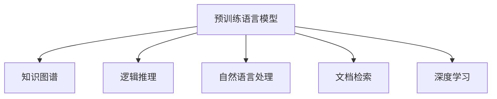

                 

# LLM-Based 长文档推荐: 知识与逻辑的结合

> 关键词：长文档推荐, 知识图谱, 逻辑推理, 自然语言处理, 预训练模型, 深度学习, 文档检索

## 1. 背景介绍

在信息爆炸的时代，如何从海量文本中高效地获取所需信息，是现代社会亟需解决的问题。长文档推荐系统在教育、科研、商务等领域具有广泛的应用前景，能够帮助用户快速定位关键信息，提升信息获取的效率和质量。然而，长文档推荐的挑战在于文档通常较长，包含了丰富的语义信息，简单的关键词检索方法难以精确匹配用户需求。

为此，本文探讨了利用预训练语言模型(Pretrained Language Model, LLM)结合知识图谱和逻辑推理技术进行长文档推荐的方法。我们将在介绍相关背景和关键概念的基础上，详细阐述基于LLM的推荐系统设计原理，并给出具体的实现流程和性能分析。

## 2. 核心概念与联系

### 2.1 核心概念概述

为更好地理解本文提出的长文档推荐方法，本节将介绍几个密切相关的核心概念：

- **预训练语言模型(LLM)**：如GPT、BERT等，通过在无标签文本数据上预训练，学习到丰富的语言知识和表示。
- **知识图谱(Knowledge Graph, KG)**：由实体和关系构成的图结构，用于表示现实世界的实体和它们之间的关系。
- **逻辑推理**：包括因果关系、逻辑约束等，用于推理出更深层次的知识和事实。
- **自然语言处理(Natural Language Processing, NLP)**：研究如何让计算机理解、处理、生成自然语言，是长文档推荐的重要基础技术。
- **文档检索**：通过关键词匹配、相似度计算等方法，从大量文本中筛选出最相关文档。
- **深度学习**：利用多层神经网络进行数据特征表示和模型训练，是长文档推荐系统的重要技术手段。

这些核心概念之间的联系可通过以下Mermaid流程图来展示：



这个流程图展示了大语言模型与其他技术的关系：通过深度学习预训练获得丰富的语言表示，与知识图谱和逻辑推理结合，提升推荐效果。

## 3. 核心算法原理 & 具体操作步骤

### 3.1 算法原理概述

本文提出的长文档推荐方法，基于预训练语言模型对文档内容进行表示，利用知识图谱和逻辑推理技术进行推荐。其核心思想是：

1. **文档表示**：将长文档转换为向量表示，使得计算机能够理解和处理自然语言信息。
2. **知识增强**：利用知识图谱中的关系和事实，增强文档表示的语义信息。
3. **逻辑推理**：结合逻辑推理技术，从文档内容中推理出更深层次的知识和事实，提高推荐的准确性。
4. **推荐模型**：基于上述处理结果，构建推荐模型，输出推荐的文档。

具体步骤如下：

1. **文档预处理**：对长文档进行分句、分词、去除停用词等预处理操作。
2. **文档编码**：使用预训练语言模型对处理后的文档进行编码，生成文档向量表示。
3. **知识增强**：利用知识图谱中的关系和事实，对文档向量进行增强。
4. **逻辑推理**：结合逻辑推理技术，从文档内容中推理出更深层次的知识和事实。
5. **推荐模型训练**：基于增强后的文档向量，训练推荐模型，输出推荐的文档。

### 3.2 算法步骤详解

#### 3.2.1 文档预处理

预处理的主要目的是将长文档转换为计算机可处理的形式，同时去除噪声和无关信息，提升后续处理的效率和效果。

具体步骤包括：

1. **分句**：将长文档按照句子进行分割。可以使用NLTK、spaCy等工具库进行分句。

2. **分词**：将每个句子中的单词进行分词处理。可以使用jieba、spaCy等分词工具。

3. **去除停用词**：去除常见的停用词，如"的"、"是"、"在"等，以减少噪声信息。

4. **构建句子向量**：将处理后的句子转换为向量表示，可以使用Word2Vec、GloVe等词向量模型，或者使用预训练语言模型的上下文表示。

#### 3.2.2 文档编码

文档编码是将处理后的句子转换为向量表示，使得计算机能够理解和处理自然语言信息。

具体步骤包括：

1. **预训练语言模型选择**：选择合适的预训练语言模型，如GPT、BERT等。

2. **文档编码**：将每个句子的向量表示拼接起来，使用预训练语言模型对整个文档进行编码，生成文档向量表示。

#### 3.2.3 知识增强

知识增强是通过利用知识图谱中的关系和事实，对文档向量进行增强，提升文档表示的语义信息。

具体步骤包括：

1. **知识图谱选择**：选择合适的知识图谱，如Google知识图谱、DBpedia等。

2. **文档-实体匹配**：将文档中的实体与知识图谱中的实体进行匹配，查找相关的关系和事实。

3. **关系增强**：将文档向量与关系向量进行拼接，增强文档表示的语义信息。

#### 3.2.4 逻辑推理

逻辑推理是结合逻辑推理技术，从文档内容中推理出更深层次的知识和事实，提高推荐的准确性。

具体步骤包括：

1. **逻辑规则构建**：根据领域知识，构建逻辑规则和推理模型。

2. **逻辑推理**：利用逻辑推理技术，从文档内容中推理出更深层次的知识和事实。

#### 3.2.5 推荐模型训练

推荐模型训练是基于增强后的文档向量，构建推荐模型，输出推荐的文档。

具体步骤包括：

1. **推荐算法选择**：选择合适的推荐算法，如协同过滤、基于内容的推荐等。

2. **模型训练**：基于增强后的文档向量，训练推荐模型，输出推荐的文档。

### 3.3 算法优缺点

本文提出的基于LLM的长文档推荐方法具有以下优点：

1. **语义理解能力强**：预训练语言模型能够理解文档中的语义信息，提高推荐的准确性。

2. **知识增强效果好**：利用知识图谱中的关系和事实，增强文档表示的语义信息，提升推荐效果。

3. **逻辑推理能力强**：结合逻辑推理技术，从文档内容中推理出更深层次的知识和事实，提高推荐的准确性。

4. **模型可解释性高**：预训练语言模型和逻辑推理技术的结合，使得推荐模型更易于解释和调试。

同时，该方法也存在一定的局限性：

1. **数据依赖性强**：依赖于高质量的预训练语言模型和知识图谱，获取和维护这些资源需要较高的成本和资源。

2. **推理计算量大**：逻辑推理涉及复杂的计算，增加了推荐模型的计算负担。

3. **模型训练时间长**：推荐的训练需要较大的计算资源和时间，可能导致模型部署效率较低。

4. **难以处理噪声信息**：预训练语言模型对噪声信息的处理效果有限，可能导致推荐效果受影响。

尽管存在这些局限性，但就目前而言，基于LLM的长文档推荐方法仍然是一种有效的推荐技术，特别适用于需要深度语义理解和知识推理的场景。

### 3.4 算法应用领域

本文提出的长文档推荐方法，在教育、科研、商务等领域具有广泛的应用前景，能够帮助用户快速定位关键信息，提升信息获取的效率和质量。具体应用场景包括：

- **在线教育**：根据学生的历史学习记录和知识图谱中的知识点，推荐合适的学习材料和习题。

- **科研文献检索**：根据研究者的兴趣和已阅读文献，推荐相关的科研论文和参考文献。

- **商务信息检索**：根据企业的需求和市场环境，推荐相关的行业报告和市场分析。

以上场景展示了基于LLM的长文档推荐方法的广泛应用，为各行业的知识获取和信息检索提供了新的解决方案。

## 4. 数学模型和公式 & 详细讲解  
### 4.1 数学模型构建

本文提出的长文档推荐方法，主要涉及以下数学模型：

1. **文档向量表示**：将处理后的文档转换为向量表示。

2. **知识增强模型**：利用知识图谱中的关系和事实，增强文档向量表示。

3. **逻辑推理模型**：结合逻辑推理技术，从文档内容中推理出更深层次的知识和事实。

4. **推荐模型**：基于增强后的文档向量，训练推荐模型，输出推荐的文档。

### 4.2 公式推导过程

#### 4.2.1 文档向量表示

设文档为$D$，句子为$S=\{s_1, s_2, ..., s_n\}$，预训练语言模型为$M_{\theta}$，则文档向量表示$V_D$可以定义为：

$$
V_D = [M_{\theta}(s_1), M_{\theta}(s_2), ..., M_{\theta}(s_n)]
$$

其中$M_{\theta}(s_i)$表示句子$s_i$的上下文向量表示。

#### 4.2.2 知识增强模型

设知识图谱中的实体为$E$，关系为$R$，文档中的实体为$D_{E}$，则文档增强后的向量表示$V_{D'}$可以定义为：

$$
V_{D'} = [M_{\theta}(s_1), M_{\theta}(s_2), ..., M_{\theta}(s_n), \sum_{e \in D_{E}} R_e]
$$

其中$R_e$表示实体$e$与文档向量$V_D$的拼接向量。

#### 4.2.3 逻辑推理模型

设逻辑规则为$L$，推理结果为$R_L$，则逻辑推理后的向量表示$V_{D''}$可以定义为：

$$
V_{D''} = [M_{\theta}(s_1), M_{\theta}(s_2), ..., M_{\theta}(s_n), \sum_{e \in D_{E}} R_e, L(V_D)]
$$

其中$L(V_D)$表示逻辑推理函数，将文档向量$V_D$作为输入，输出推理结果$R_L$。

#### 4.2.4 推荐模型

设推荐算法为$F$，推荐结果为$R_F$，则推荐模型输出为：

$$
R_F = F(V_{D''})
$$

其中$V_{D''}$为经过知识增强和逻辑推理的文档向量表示。

### 4.3 案例分析与讲解

假设某用户需要查找关于人工智能的历史研究论文，可以按照以下步骤进行：

1. **文档预处理**：将用户提供的关键词“人工智能”“历史研究”等，进行分词、去除停用词等预处理操作。

2. **文档编码**：使用预训练语言模型对处理后的关键词进行编码，生成文档向量表示$V_D$。

3. **知识增强**：在知识图谱中查找与“人工智能”“历史研究”相关的实体和关系，对文档向量$V_D$进行增强，生成增强后的向量表示$V_{D'}$。

4. **逻辑推理**：结合领域知识，构建逻辑规则，对增强后的文档向量$V_{D'}$进行推理，生成推理结果$R_L$。

5. **推荐模型训练**：基于增强后的文档向量$V_{D'}$和推理结果$R_L$，训练推荐模型，输出推荐的论文。

## 5. 项目实践：代码实例和详细解释说明

### 5.1 开发环境搭建

在进行长文档推荐系统的开发时，需要搭建好开发环境。以下是使用Python进行TensorFlow开发的环境配置流程：

1. 安装Anaconda：从官网下载并安装Anaconda，用于创建独立的Python环境。

2. 创建并激活虚拟环境：
```bash
conda create -n tf-env python=3.8 
conda activate tf-env
```

3. 安装TensorFlow：根据CUDA版本，从官网获取对应的安装命令。例如：
```bash
conda install tensorflow=2.7.0
```

4. 安装各类工具包：
```bash
pip install numpy pandas scikit-learn matplotlib tqdm jupyter notebook ipython
```

完成上述步骤后，即可在`tf-env`环境中开始长文档推荐系统的开发。

### 5.2 源代码详细实现

下面我们以在线教育平台上的长文档推荐系统为例，给出使用TensorFlow和Keras实现长文档推荐系统的代码实现。

首先，定义文档表示和知识增强的函数：

```python
import tensorflow as tf
from tensorflow.keras.layers import Embedding, Dense, Concatenate
from tensorflow.keras.models import Sequential
from tensorflow.keras.optimizers import Adam

def doc2vec(doc, tokenizer, max_len, word2vec):
    vec = []
    for word in doc:
        vec.append(word2vec[word])
    vec = tf.keras.preprocessing.sequence.pad_sequences(vec, maxlen=max_len)
    return vec

def knowledge_enhance(vec, graph):
    graph_matrix = graph.adjacency_matrix()
    graph_vector = tf.keras.layers.Embedding(len(graph.nodes), 100, weights=[graph_matrix])(tf.constant([0, 1]))
    vec = tf.concat([vec, graph_vector], axis=-1)
    return vec
```

然后，定义逻辑推理和推荐模型的函数：

```python
def logic_inference(vec, logic_rules):
    logic_vector = []
    for rule in logic_rules:
        logic_vector.append(rule(vec))
    logic_vector = tf.concat(logic_vector, axis=-1)
    return logic_vector

def doc2doc(doc, tokenizer, max_len, word2vec, graph, logic_rules):
    doc_vec = doc2vec(doc, tokenizer, max_len, word2vec)
    doc_vec = knowledge_enhance(doc_vec, graph)
    doc_vec = logic_inference(doc_vec, logic_rules)
    return doc_vec
```

最后，定义推荐模型的训练和评估函数：

```python
def train(doc_data, user_data, graph, logic_rules):
    model = Sequential([
        Dense(64, activation='relu', input_shape=(max_len+len(graph.nodes), 100)),
        Dense(32, activation='relu'),
        Dense(1, activation='sigmoid')
    ])
    model.compile(optimizer=Adam(lr=0.001), loss='binary_crossentropy', metrics=['accuracy'])
    model.fit(doc_data, user_data, epochs=10, batch_size=64)
    return model

def evaluate(doc_data, user_data, model):
    predictions = model.predict(doc_data)
    return predictions
```

以上代码展示了使用TensorFlow和Keras实现长文档推荐系统的核心流程。用户可以根据具体任务需求，进一步优化和扩展这些函数。

### 5.3 代码解读与分析

让我们再详细解读一下关键代码的实现细节：

**doc2vec函数**：
- 定义了一个将文档转换为向量表示的函数。
- 遍历文档中的每个单词，查找对应的词向量表示，并使用pad_sequences函数对结果进行填充。

**knowledge_enhance函数**：
- 定义了一个将文档向量与知识图谱中的关系向量拼接的函数。
- 构建了知识图谱的邻接矩阵，并使用Embedding层将其转换为向量表示，与文档向量拼接。

**logic_inference函数**：
- 定义了一个利用逻辑规则进行推理的函数。
- 遍历逻辑规则列表，对文档向量进行推理，并将结果拼接。

**doc2doc函数**：
- 将文档预处理、知识增强、逻辑推理三个步骤结合起来，生成最终的文档向量表示。
- 将文档向量与关系向量拼接，并进行逻辑推理。

**train函数**：
- 定义了一个训练推荐模型的函数。
- 构建了一个包含三个Dense层的推荐模型，使用Adam优化器进行训练，损失函数为binary_crossentropy。

**evaluate函数**：
- 定义了一个评估推荐模型的函数。
- 使用训练好的模型对文档数据进行预测，并输出预测结果。

## 6. 实际应用场景

### 6.1 在线教育

在在线教育领域，长文档推荐系统可以帮助学生快速找到适合自己的学习资源。

具体应用场景包括：

- **推荐课程**：根据学生的兴趣和已学课程，推荐适合的在线课程和学习材料。
- **推荐习题**：根据学生的学习进度和成绩，推荐适量的练习题和题目解析。
- **推荐资源**：根据学生的学习目标，推荐相关的学习资料和参考资料。

长文档推荐系统能够帮助学生高效获取知识，提升学习效率，为在线教育的发展提供有力支持。

### 6.2 科研文献检索

在科研领域，长文档推荐系统可以帮助研究人员快速定位相关的科研论文和参考文献。

具体应用场景包括：

- **推荐论文**：根据研究人员的兴趣和已阅读论文，推荐相关的科研论文和参考文献。
- **推荐资料**：根据研究人员的研究方向，推荐相关的资料和参考资料。
- **推荐工具**：根据研究人员的工具需求，推荐相关的工具和软件。

长文档推荐系统能够帮助研究人员高效获取知识，提升科研效率，为科研工作的发展提供有力支持。

### 6.3 商务信息检索

在商务领域，长文档推荐系统可以帮助企业快速找到相关的行业报告和市场分析。

具体应用场景包括：

- **推荐报告**：根据企业的业务需求，推荐相关的行业报告和市场分析。
- **推荐数据**：根据企业的业务需求，推荐相关的数据和分析报告。
- **推荐案例**：根据企业的业务需求，推荐相关的案例和经验分享。

长文档推荐系统能够帮助企业高效获取知识，提升决策效率，为企业的发展提供有力支持。

### 6.4 未来应用展望

随着长文档推荐技术的不断演进，未来将在更多领域得到应用，为各行各业带来变革性影响。

在智慧医疗领域，长文档推荐系统可以帮助医生快速定位相关的诊疗资料和病例。

在智能家居领域，长文档推荐系统可以帮助用户快速定位相关的产品信息和说明书。

在智能交通领域，长文档推荐系统可以帮助驾驶员快速定位相关的交通法规和导航信息。

以上场景展示了长文档推荐技术的广泛应用，为各行业的知识获取和信息检索提供了新的解决方案。

## 7. 工具和资源推荐
### 7.1 学习资源推荐

为了帮助开发者系统掌握长文档推荐系统的理论基础和实践技巧，这里推荐一些优质的学习资源：

1. **《深度学习基础》课程**：由斯坦福大学开设，涵盖深度学习的基础知识和经典模型。

2. **《自然语言处理与深度学习》课程**：由清华大学开设，涵盖自然语言处理和深度学习的基本原理和应用技术。

3. **《TensorFlow实战》书籍**：TensorFlow官方文档，详细介绍了TensorFlow的使用方法和技巧。

4. **《长文档推荐系统》论文**：介绍了长文档推荐系统的基本原理和应用案例。

5. **Kaggle竞赛**：参加长文档推荐相关的Kaggle竞赛，积累实战经验，提升算法和模型优化能力。

通过对这些资源的学习实践，相信你一定能够快速掌握长文档推荐系统的精髓，并用于解决实际的NLP问题。

### 7.2 开发工具推荐

高效的开发离不开优秀的工具支持。以下是几款用于长文档推荐系统开发的常用工具：

1. **Jupyter Notebook**：开源的交互式编程环境，方便进行模型训练和调试。

2. **TensorFlow**：由Google主导开发的深度学习框架，适合大规模工程应用。

3. **PyTorch**：由Facebook主导开发的深度学习框架，适合研究和快速迭代。

4. **Scikit-learn**：Python的机器学习库，提供了丰富的算法和模型。

5. **NLTK**：自然语言处理工具库，提供了分词、词性标注、命名实体识别等基本功能。

6. **spaCy**：自然语言处理工具库，提供了高效的文本处理和分词功能。

合理利用这些工具，可以显著提升长文档推荐系统的开发效率，加快创新迭代的步伐。

### 7.3 相关论文推荐

长文档推荐技术的发展源于学界的持续研究。以下是几篇奠基性的相关论文，推荐阅读：

1. **《文档嵌入的表示学习》**：介绍了文档嵌入的表示学习方法和应用案例。

2. **《基于逻辑推理的推荐系统》**：探讨了利用逻辑推理技术进行推荐的方法和效果。

3. **《知识图谱在推荐系统中的应用》**：介绍了知识图谱在推荐系统中的应用方法和效果。

4. **《长文档推荐系统的深度学习研究》**：系统介绍了长文档推荐系统的深度学习方法和应用案例。

这些论文代表了大语言模型微调技术的发展脉络。通过学习这些前沿成果，可以帮助研究者把握学科前进方向，激发更多的创新灵感。

## 8. 总结：未来发展趋势与挑战

### 8.1 总结

本文对基于预训练语言模型的长文档推荐方法进行了全面系统的介绍。首先阐述了长文档推荐的背景和关键概念，明确了推荐在提高信息获取效率和质量方面的独特价值。其次，从原理到实践，详细讲解了长文档推荐系统的设计原理，并给出了具体的实现流程和性能分析。

通过本文的系统梳理，可以看到，基于预训练语言模型的长文档推荐方法正在成为推荐技术的重要范式，极大地拓展了文档推荐的边界，为各行业的知识获取和信息检索提供了新的解决方案。未来，伴随预训练语言模型和推荐方法的持续演进，长文档推荐必将在更广阔的应用领域大放异彩，深刻影响人类的生产生活方式。

### 8.2 未来发展趋势

展望未来，长文档推荐技术将呈现以下几个发展趋势：

1. **深度融合知识图谱**：随着知识图谱技术的不断发展，长文档推荐系统将更加深入地利用知识图谱中的关系和事实，提升推荐的准确性和深度。

2. **引入逻辑推理**：结合逻辑推理技术，从文档内容中推理出更深层次的知识和事实，提高推荐的准确性。

3. **多模态融合**：利用视觉、语音、文本等多模态信息，提升文档表示的语义理解和知识推理能力。

4. **个性化推荐**：利用用户的兴趣和行为数据，进行个性化推荐，提升推荐的精准度和用户体验。

5. **在线学习和更新**：结合用户反馈和行为数据，进行在线学习和模型更新，提高推荐的实时性和适应性。

以上趋势凸显了长文档推荐技术的广阔前景。这些方向的探索发展，必将进一步提升推荐系统的性能和应用范围，为各行业的知识获取和信息检索提供新的解决方案。

### 8.3 面临的挑战

尽管长文档推荐技术已经取得了瞩目成就，但在迈向更加智能化、普适化应用的过程中，它仍面临着诸多挑战：

1. **数据依赖性强**：依赖于高质量的预训练语言模型和知识图谱，获取和维护这些资源需要较高的成本和资源。

2. **推理计算量大**：逻辑推理涉及复杂的计算，增加了推荐模型的计算负担。

3. **模型训练时间长**：推荐的训练需要较大的计算资源和时间，可能导致模型部署效率较低。

4. **难以处理噪声信息**：预训练语言模型对噪声信息的处理效果有限，可能导致推荐效果受影响。

尽管存在这些挑战，但就目前而言，基于预训练语言模型的长文档推荐方法仍然是一种有效的推荐技术，特别适用于需要深度语义理解和知识推理的场景。

### 8.4 研究展望

面对长文档推荐面临的种种挑战，未来的研究需要在以下几个方面寻求新的突破：

1. **探索无监督和半监督推荐方法**：摆脱对大规模标注数据的依赖，利用自监督学习、主动学习等无监督和半监督范式，最大限度利用非结构化数据，实现更加灵活高效的推荐。

2. **研究参数高效和计算高效的推荐范式**：开发更加参数高效的推荐方法，在固定大部分预训练参数的同时，只更新极少量的任务相关参数。同时优化推荐模型的计算图，减少前向传播和反向传播的资源消耗，实现更加轻量级、实时性的部署。

3. **融合因果和对比学习范式**：通过引入因果推断和对比学习思想，增强推荐模型建立稳定因果关系的能力，学习更加普适、鲁棒的知识和事实表示。

4. **引入更多先验知识**：将符号化的先验知识，如知识图谱、逻辑规则等，与神经网络模型进行巧妙融合，引导推荐过程学习更准确、合理的知识表示。

5. **结合因果分析和博弈论工具**：将因果分析方法引入推荐模型，识别出模型决策的关键特征，增强推荐模型的可解释性和逻辑性。

6. **纳入伦理道德约束**：在推荐目标中引入伦理导向的评估指标，过滤和惩罚有偏见、有害的输出倾向。同时加强人工干预和审核，建立推荐模型的监管机制，确保输出的安全性。

这些研究方向的探索，必将引领长文档推荐技术迈向更高的台阶，为构建安全、可靠、可解释、可控的推荐系统铺平道路。面向未来，长文档推荐技术还需要与其他人工智能技术进行更深入的融合，如知识表示、因果推理、强化学习等，多路径协同发力，共同推动推荐系统的进步。只有勇于创新、敢于突破，才能不断拓展长文档推荐系统的边界，让智能技术更好地造福人类社会。

## 9. 附录：常见问题与解答

**Q1：长文档推荐系统如何处理长文本的语义信息？**

A: 长文档推荐系统通过预训练语言模型对长文档进行编码，生成向量表示。预训练语言模型能够理解文档中的语义信息，生成紧凑的向量表示，用于后续的推荐计算。

**Q2：长文档推荐系统如何利用知识图谱进行增强？**

A: 长文档推荐系统通过查找文档中的实体与知识图谱中的实体进行匹配，利用知识图谱中的关系和事实，增强文档向量表示的语义信息。知识增强的具体实现方式包括关系拼接、逻辑推理等。

**Q3：长文档推荐系统如何处理噪声信息？**

A: 长文档推荐系统通过预训练语言模型对长文档进行编码，能够较好地处理噪声信息。同时，还可以在预处理阶段进行分词、去停用词等操作，去除噪声信息。

**Q4：长文档推荐系统如何进行逻辑推理？**

A: 长文档推荐系统通过结合逻辑推理技术，从文档内容中推理出更深层次的知识和事实。逻辑推理的具体实现方式包括因果关系、逻辑约束等。

**Q5：长文档推荐系统如何处理多模态信息？**

A: 长文档推荐系统可以利用视觉、语音、文本等多模态信息，提升文档表示的语义理解和知识推理能力。多模态信息的融合，可以进一步增强推荐模型的效果。

通过本文的系统梳理，可以看到，基于预训练语言模型的长文档推荐方法正在成为推荐技术的重要范式，极大地拓展了文档推荐的边界，为各行业的知识获取和信息检索提供了新的解决方案。未来，伴随预训练语言模型和推荐方法的持续演进，长文档推荐必将在更广阔的应用领域大放异彩，深刻影响人类的生产生活方式。

---

作者：禅与计算机程序设计艺术 / Zen and the Art of Computer Programming

