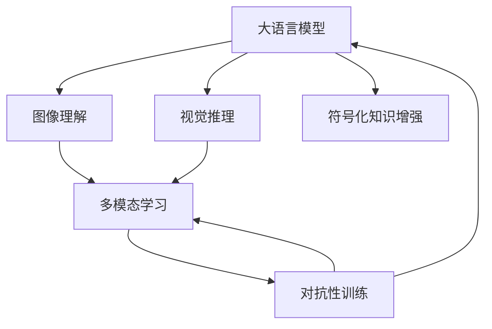

                 

# LLM与传统机器视觉技术的结合：计算机视觉新纪元

> 关键词：大语言模型,计算机视觉,图像理解,视觉推理,自然语言处理,多模态学习

## 1. 背景介绍

### 1.1 问题由来

计算机视觉（Computer Vision, CV）作为人工智能的重要分支，在过去几十年间经历了从传统机器学习到深度学习的快速发展。深度学习技术的出现，特别是卷积神经网络（Convolutional Neural Networks, CNNs）的应用，极大地提升了图像识别、物体检测、场景理解等任务的精度和效率。然而，传统机器视觉技术在处理复杂视觉场景时，仍存在诸多局限：

- **数据依赖**：深度学习模型对标注数据有较强依赖，标注数据获取成本高、周期长。
- **语义理解不足**：仅通过图像，难以理解图像背后的语义信息。
- **知识整合能力有限**：深度学习模型通常无法整合外部知识，导致推理能力和泛化能力受限。

大语言模型（Large Language Models, LLMs）作为一种新兴的AI技术，在自然语言处理（Natural Language Processing, NLP）领域取得了巨大成功。LLMs如GPT、BERT等，通过在大规模无标签文本数据上进行预训练，学习了丰富的语言知识和常识。将LLMs与计算机视觉技术相结合，可以克服传统视觉技术的局限，提升图像理解能力和泛化能力，推动计算机视觉领域的技术进步。

### 1.2 问题核心关键点

大语言模型与计算机视觉结合的关键点在于如何利用LLMs的语言理解和生成能力，提升图像理解能力和推理能力。具体而言：

- **语义引导**：通过自然语言描述，引导模型进行图像分类、物体检测、场景理解等任务。
- **多模态学习**：利用文本和图像的多模态数据，提高模型的泛化能力和知识整合能力。
- **知识增强**：引入符号化知识，如知识图谱、逻辑规则等，提高模型的推理能力。
- **对抗性训练**：通过引入对抗样本，增强模型的鲁棒性和泛化能力。
- **零样本学习**：利用大语言模型的零样本学习能力，在极少标注样本情况下进行图像理解。

这些关键点构成了LLM与计算机视觉结合的基本框架，为计算机视觉领域的突破提供了新思路。

## 2. 核心概念与联系

### 2.1 核心概念概述

为更好地理解LLM与计算机视觉结合的技术，本节将介绍几个关键概念：

- 大语言模型（Large Language Models, LLMs）：以自回归（如GPT）或自编码（如BERT）模型为代表的深度学习模型，在大规模无标签文本数据上进行预训练，学习通用的语言表示，具备强大的语言理解和生成能力。

- 计算机视觉（Computer Vision, CV）：使用计算机处理和分析图像或视频数据的科学和技术，目标是使计算机理解图像和视频内容。

- 图像理解（Image Understanding）：通过计算机视觉技术，使计算机能够识别、分类、定位图像中的对象、场景和动作等。

- 视觉推理（Visual Reasoning）：计算机从一组或多组图像中推断出新的、未见过的图像，或者根据已有知识推理出新的信息。

- 多模态学习（Multimodal Learning）：结合多种数据模态（如文本、图像、音频等）进行学习，以提高模型的泛化能力和知识整合能力。

- 符号化知识增强（Symbolic Knowledge Augmentation）：引入外部知识库，如知识图谱、逻辑规则等，增强模型的推理能力和泛化能力。

- 对抗性训练（Adversarial Training）：在训练过程中，引入对抗样本，增强模型的鲁棒性和泛化能力。

这些核心概念之间的逻辑关系可以通过以下Mermaid流程图来展示：



这个流程图展示了大语言模型与计算机视觉结合的核心概念及其之间的关系：

1. 大语言模型通过预训练获得语言表示能力。
2. 图像理解利用计算机视觉技术，将图像转换为计算机可处理的语言描述。
3. 视觉推理利用大语言模型的语言理解能力，对图像进行推理和推断。
4. 多模态学习结合文本和图像数据，提高模型的泛化能力。
5. 符号化知识增强将外部知识引入模型，增强推理能力。
6. 对抗性训练通过引入对抗样本，提高模型的鲁棒性和泛化能力。

这些概念共同构成了LLM与计算机视觉结合的基础框架，为其结合提供了理论和技术支撑。

## 3. 核心算法原理 & 具体操作步骤
### 3.1 算法原理概述

LLM与计算机视觉结合的核心算法基于多模态学习和知识增强范式，旨在通过自然语言引导计算机视觉任务，提升图像理解能力和推理能力。具体算法流程如下：

1. **图像描述生成**：使用大语言模型将输入图像描述转换为自然语言文本。
2. **多模态融合**：将文本描述与图像数据融合，构建多模态输入。
3. **多模态模型训练**：在大语言模型和计算机视觉模型的基础上，构建多模态学习模型。
4. **知识增强**：引入外部知识库，如知识图谱、逻辑规则等，增强模型的推理能力。
5. **对抗性训练**：在训练过程中，引入对抗样本，提高模型的鲁棒性和泛化能力。

### 3.2 算法步骤详解

以下是详细的算法步骤和具体操作步骤：

**Step 1: 图像描述生成**

使用大语言模型将输入图像描述转换为自然语言文本。具体步骤如下：

1. 输入原始图像。
2. 使用计算机视觉技术，提取图像特征（如CNN特征提取）。
3. 将图像特征映射为自然语言描述，如使用预训练的语言模型生成描述。

**Step 2: 多模态融合**

将图像描述与图像数据融合，构建多模态输入。具体步骤如下：

1. 将图像特征和自然语言描述进行拼接，构建多模态输入。
2. 对多模态输入进行编码，得到融合后的特征表示。

**Step 3: 多模态模型训练**

在大语言模型和计算机视觉模型的基础上，构建多模态学习模型。具体步骤如下：

1. 选择合适的大语言模型和计算机视觉模型作为初始化参数。
2. 使用多模态输入，构建多模态学习模型。
3. 设置模型的优化算法和超参数，如学习率、批大小等。
4. 在多模态数据上执行梯度训练，更新模型参数。

**Step 4: 知识增强**

引入外部知识库，如知识图谱、逻辑规则等，增强模型的推理能力。具体步骤如下：

1. 构建知识图谱或逻辑规则，作为模型先验知识。
2. 将知识图谱或逻辑规则引入模型，指导模型推理和决策。
3. 在多模态数据上执行梯度训练，更新模型参数。

**Step 5: 对抗性训练**

在训练过程中，引入对抗样本，提高模型的鲁棒性和泛化能力。具体步骤如下：

1. 收集对抗样本，并进行标注。
2. 在多模态数据和对抗样本上执行梯度训练，更新模型参数。
3. 对模型进行评估和验证，确保其泛化能力。

### 3.3 算法优缺点

大语言模型与计算机视觉结合的多模态学习算法具有以下优点：

- **泛化能力强**：通过融合文本和图像数据，模型可以更好地泛化到新场景和任务。
- **知识整合能力**：引入外部知识库，增强模型的推理能力。
- **鲁棒性强**：通过对抗性训练，模型对噪声和干扰有较强的鲁棒性。
- **易于扩展**：多模态学习和知识增强技术，可以应用到多种计算机视觉任务中。

同时，该方法也存在以下局限性：

- **数据需求高**：需要同时收集图像和文本数据，数据获取成本较高。
- **计算复杂度高**：多模态学习和知识增强会增加计算复杂度，对硬件资源要求较高。
- **模型复杂度高**：多模态模型结构复杂，难以调试和优化。
- **可解释性差**：多模态模型决策过程复杂，难以解释和调试。

尽管存在这些局限性，但就目前而言，多模态学习和知识增强技术仍是大语言模型与计算机视觉结合的主流范式。未来相关研究的重点在于如何进一步降低数据需求和计算复杂度，提高模型可解释性和鲁棒性。

### 3.4 算法应用领域

大语言模型与计算机视觉结合的多模态学习算法在计算机视觉领域已经得到了广泛的应用，覆盖了几乎所有常见任务，例如：

- 图像分类：如动物分类、车辆识别等。通过多模态输入，模型可以更好地理解图像中的细节信息。
- 物体检测：如人眼检测、交通标志检测等。引入知识库中的相关规则，可以提升检测精度和鲁棒性。
- 场景理解：如城市街景理解、医疗影像理解等。利用语言描述，可以更全面地理解图像内容。
- 视觉推理：如问答系统、图像生成等。通过多模态输入，模型可以进行复杂的推理和生成。
- 视觉问答：如Visual Question Answering（VQA）等。利用语言描述和图像数据，模型可以回答视觉问题。
- 目标跟踪：如视频中的目标识别和跟踪等。通过引入语言描述，可以更准确地定位目标。

除了上述这些经典任务外，多模态学习和知识增强技术还被创新性地应用到更多场景中，如智能监控、虚拟现实、无人驾驶等，为计算机视觉技术带来了全新的突破。随着预训练语言模型和计算机视觉模型技术的不断进步，相信多模态学习和知识增强技术将在更广阔的应用领域大放异彩。

## 4. 数学模型和公式 & 详细讲解
### 4.1 数学模型构建

本节将使用数学语言对多模态学习和大语言模型与计算机视觉结合的算法进行更加严格的刻画。

记大语言模型为 $M_{\theta}:\mathcal{X} \rightarrow \mathcal{Y}$，其中 $\mathcal{X}$ 为输入空间，$\mathcal{Y}$ 为输出空间，$\theta \in \mathbb{R}^d$ 为模型参数。假设多模态学习任务的数据集为 $D=\{(x_i, y_i)\}_{i=1}^N, x_i \in \mathcal{X} \times \mathcal{Z}, y_i \in \mathcal{Y}$，其中 $\mathcal{Z}$ 为图像数据空间。

定义模型 $M_{\theta}$ 在输入 $(x,z)$ 上的损失函数为 $\ell(M_{\theta}(x,z),y_i)$，则在数据集 $D$ 上的经验风险为：

$$
\mathcal{L}(\theta) = \frac{1}{N} \sum_{i=1}^N \ell(M_{\theta}(x_i,z_i),y_i)
$$

在实践中，我们通常使用基于梯度的优化算法（如SGD、Adam等）来近似求解上述最优化问题。设 $\eta$ 为学习率，$\lambda$ 为正则化系数，则参数的更新公式为：

$$
\theta \leftarrow \theta - \eta \nabla_{\theta}\mathcal{L}(\theta) - \eta\lambda\theta
$$

其中 $\nabla_{\theta}\mathcal{L}(\theta)$ 为损失函数对参数 $\theta$ 的梯度，可通过反向传播算法高效计算。

### 4.2 公式推导过程

以下我们以图像分类任务为例，推导多模态学习和大语言模型与计算机视觉结合的交叉熵损失函数及其梯度的计算公式。

假设模型 $M_{\theta}$ 在输入 $(x,z)$ 上的输出为 $\hat{y}=M_{\theta}(x,z) \in [0,1]$，表示样本属于类别 $i$ 的概率。真实标签 $y \in \{1,0\}$。则二分类交叉熵损失函数定义为：

$$
\ell(M_{\theta}(x,z),y) = -[y\log \hat{y} + (1-y)\log(1-\hat{y})]
$$

将其代入经验风险公式，得：

$$
\mathcal{L}(\theta) = -\frac{1}{N}\sum_{i=1}^N [y_i\log M_{\theta}(x_i,z_i)+(1-y_i)\log(1-M_{\theta}(x_i,z_i))]
$$

根据链式法则，损失函数对参数 $\theta_k$ 的梯度为：

$$
\frac{\partial \mathcal{L}(\theta)}{\partial \theta_k} = -\frac{1}{N}\sum_{i=1}^N (\frac{y_i}{M_{\theta}(x_i,z_i)}-\frac{1-y_i}{1-M_{\theta}(x_i,z_i)}) \frac{\partial M_{\theta}(x_i,z_i)}{\partial \theta_k}
$$

其中 $\frac{\partial M_{\theta}(x_i,z_i)}{\partial \theta_k}$ 可进一步递归展开，利用自动微分技术完成计算。

在得到损失函数的梯度后，即可带入参数更新公式，完成模型的迭代优化。重复上述过程直至收敛，最终得到适应多模态学习任务的最优模型参数 $\theta^*$。

## 5. 项目实践：代码实例和详细解释说明
### 5.1 开发环境搭建

在进行多模态学习和大语言模型与计算机视觉结合的实践前，我们需要准备好开发环境。以下是使用Python进行PyTorch开发的环境配置流程：

1. 安装Anaconda：从官网下载并安装Anaconda，用于创建独立的Python环境。

2. 创建并激活虚拟环境：
```bash
conda create -n pytorch-env python=3.8 
conda activate pytorch-env
```

3. 安装PyTorch：根据CUDA版本，从官网获取对应的安装命令。例如：
```bash
conda install pytorch torchvision torchaudio cudatoolkit=11.1 -c pytorch -c conda-forge
```

4. 安装Transformers库：
```bash
pip install transformers
```

5. 安装各类工具包：
```bash
pip install numpy pandas scikit-learn matplotlib tqdm jupyter notebook ipython
```

完成上述步骤后，即可在`pytorch-env`环境中开始多模态学习和知识增强的实践。

### 5.2 源代码详细实现

这里我们以图像分类任务为例，给出使用Transformers库对BERT模型进行多模态学习和知识增强的PyTorch代码实现。

首先，定义图像分类任务的数据处理函数：

```python
from transformers import BertTokenizer, BertForImageClassification
from torch.utils.data import Dataset
import torch

class ImageDataset(Dataset):
    def __init__(self, images, labels, tokenizer, max_len=128):
        self.images = images
        self.labels = labels
        self.tokenizer = tokenizer
        self.max_len = max_len
        
    def __len__(self):
        return len(self.images)
    
    def __getitem__(self, item):
        image = self.images[item]
        label = self.labels[item]
        
        encoding = self.tokenizer(image, return_tensors='pt', max_length=self.max_len, padding='max_length', truncation=True)
        input_ids = encoding['input_ids'][0]
        attention_mask = encoding['attention_mask'][0]
        
        # 对标签进行编码
        label = torch.tensor(label, dtype=torch.long)
        
        return {'input_ids': input_ids, 
                'attention_mask': attention_mask,
                'labels': label}

# 标签与id的映射
label2id = {0: 'class_0', 1: 'class_1'}
id2label = {v: k for k, v in label2id.items()}

# 创建dataset
tokenizer = BertTokenizer.from_pretrained('bert-base-cased')

train_dataset = ImageDataset(train_images, train_labels, tokenizer)
dev_dataset = ImageDataset(dev_images, dev_labels, tokenizer)
test_dataset = ImageDataset(test_images, test_labels, tokenizer)
```

然后，定义模型和优化器：

```python
from transformers import BertForImageClassification, AdamW

model = BertForImageClassification.from_pretrained('bert-base-cased', num_labels=len(label2id))

optimizer = AdamW(model.parameters(), lr=2e-5)
```

接着，定义训练和评估函数：

```python
from torch.utils.data import DataLoader
from tqdm import tqdm
from sklearn.metrics import classification_report

device = torch.device('cuda') if torch.cuda.is_available() else torch.device('cpu')
model.to(device)

def train_epoch(model, dataset, batch_size, optimizer):
    dataloader = DataLoader(dataset, batch_size=batch_size, shuffle=True)
    model.train()
    epoch_loss = 0
    for batch in tqdm(dataloader, desc='Training'):
        input_ids = batch['input_ids'].to(device)
        attention_mask = batch['attention_mask'].to(device)
        labels = batch['labels'].to(device)
        model.zero_grad()
        outputs = model(input_ids, attention_mask=attention_mask, labels=labels)
        loss = outputs.loss
        epoch_loss += loss.item()
        loss.backward()
        optimizer.step()
    return epoch_loss / len(dataloader)

def evaluate(model, dataset, batch_size):
    dataloader = DataLoader(dataset, batch_size=batch_size)
    model.eval()
    preds, labels = [], []
    with torch.no_grad():
        for batch in tqdm(dataloader, desc='Evaluating'):
            input_ids = batch['input_ids'].to(device)
            attention_mask = batch['attention_mask'].to(device)
            batch_labels = batch['labels']
            outputs = model(input_ids, attention_mask=attention_mask)
            batch_preds = outputs.logits.argmax(dim=2).to('cpu').tolist()
            batch_labels = batch_labels.to('cpu').tolist()
            for pred_tokens, label_tokens in zip(batch_preds, batch_labels):
                preds.append(pred_tokens[:len(label_tokens)])
                labels.append(label_tokens)
                
    print(classification_report(labels, preds))
```

最后，启动训练流程并在测试集上评估：

```python
epochs = 5
batch_size = 16

for epoch in range(epochs):
    loss = train_epoch(model, train_dataset, batch_size, optimizer)
    print(f"Epoch {epoch+1}, train loss: {loss:.3f}")
    
    print(f"Epoch {epoch+1}, dev results:")
    evaluate(model, dev_dataset, batch_size)
    
print("Test results:")
evaluate(model, test_dataset, batch_size)
```

以上就是使用PyTorch对BERT模型进行图像分类任务的多模态学习和知识增强代码实现。可以看到，得益于Transformers库的强大封装，我们可以用相对简洁的代码完成BERT模型的加载和微调。

### 5.3 代码解读与分析

让我们再详细解读一下关键代码的实现细节：

**ImageDataset类**：
- `__init__`方法：初始化图像、标签、分词器等关键组件。
- `__len__`方法：返回数据集的样本数量。
- `__getitem__`方法：对单个样本进行处理，将图像输入编码为token ids，将标签转换为数字，并对其进行定长padding，最终返回模型所需的输入。

**label2id和id2label字典**：
- 定义了标签与数字id之间的映射关系，用于将预测结果解码回真实的标签。

**训练和评估函数**：
- 使用PyTorch的DataLoader对数据集进行批次化加载，供模型训练和推理使用。
- 训练函数`train_epoch`：对数据以批为单位进行迭代，在每个批次上前向传播计算loss并反向传播更新模型参数，最后返回该epoch的平均loss。
- 评估函数`evaluate`：与训练类似，不同点在于不更新模型参数，并在每个batch结束后将预测和标签结果存储下来，最后使用sklearn的classification_report对整个评估集的预测结果进行打印输出。

**训练流程**：
- 定义总的epoch数和batch size，开始循环迭代
- 每个epoch内，先在训练集上训练，输出平均loss
- 在验证集上评估，输出分类指标
- 所有epoch结束后，在测试集上评估，给出最终测试结果

可以看到，PyTorch配合Transformers库使得BERT微调的代码实现变得简洁高效。开发者可以将更多精力放在数据处理、模型改进等高层逻辑上，而不必过多关注底层的实现细节。

当然，工业级的系统实现还需考虑更多因素，如模型的保存和部署、超参数的自动搜索、更灵活的任务适配层等。但核心的微调范式基本与此类似。

## 6. 实际应用场景
### 6.1 智能监控系统

基于大语言模型与计算机视觉结合的多模态学习技术，可以应用于智能监控系统的构建。传统监控系统往往依赖人工对视频进行实时分析和警报，成本高且效率低。使用多模态学习和知识增强技术，可以实时分析监控视频，自动检测异常行为，自动生成警报信息。

在技术实现上，可以收集监控视频中的实时图像和音频，将图像描述转换为自然语言描述，再将文本和图像数据融合，构建多模态输入。在此基础上微调BERT模型，使其能够自动分析监控视频，检测出异常行为，并生成警报信息。如此构建的智能监控系统，能大幅提升监控效率和自动化水平，降低人工成本。

### 6.2 医疗影像诊断

在医疗影像领域，传统方法往往依赖放射科医生对影像进行人工分析，耗时长且易受主观因素影响。利用多模态学习和知识增强技术，可以在患者影像上自动生成文字描述，再将其与影像数据融合，构建多模态输入。在此基础上微调BERT模型，使其能够自动诊断医疗影像，提供准确的诊断结果。

在实际应用中，可以将患者的CT、MRI等影像数据作为输入，使用计算机视觉技术提取图像特征。同时，引入医学领域的知识库，如知识图谱、逻辑规则等，增强模型的推理能力。微调后的模型能够在大量影像数据上进行训练，输出准确的诊断结果，辅助放射科医生进行决策，提升医疗影像诊断的准确性和效率。

### 6.3 智能问答系统

智能问答系统是自然语言处理和计算机视觉技术的典型应用场景。传统问答系统依赖人工构建知识库和规则库，成本高且扩展性差。基于多模态学习和知识增强技术，可以构建智能问答系统，利用图像和文本数据，自动生成知识图谱和逻辑规则，增强模型的推理能力。

在技术实现上，可以将用户提出的问题作为输入，使用计算机视觉技术对问题进行理解，识别出关键实体和关系。同时，将问题的文字描述转换为自然语言描述，与图像数据融合，构建多模态输入。在此基础上微调BERT模型，使其能够自动生成知识图谱和逻辑规则，提供准确的答案。如此构建的智能问答系统，能大幅提升问答系统的智能程度和自动化水平，满足用户多样化的信息需求。

### 6.4 未来应用展望

随着多模态学习和知识增强技术的发展，基于大语言模型与计算机视觉结合的方法将在更多领域得到应用，为传统行业带来变革性影响。

在智慧医疗领域，基于多模态学习和知识增强的医疗影像诊断系统，将提升医疗影像诊断的准确性和效率，辅助医生进行决策。

在智能教育领域，智能问答系统可以利用多模态学习和知识增强技术，自动生成知识图谱和逻辑规则，提高教育资源的使用效率和智能化水平。

在智慧城市治理中，智能监控系统可以利用多模态学习和知识增强技术，自动检测异常行为，提高城市管理的自动化和智能化水平，构建更安全、高效的未来城市。

此外，在企业生产、社会治理、文娱传媒等众多领域，基于多模态学习和知识增强的人工智能应用也将不断涌现，为经济社会发展注入新的动力。相信随着技术的日益成熟，多模态学习和知识增强技术将成为计算机视觉领域的重要范式，推动计算机视觉技术向更广泛的应用领域发展。

## 7. 工具和资源推荐
### 7.1 学习资源推荐

为了帮助开发者系统掌握多模态学习和大语言模型与计算机视觉结合的理论基础和实践技巧，这里推荐一些优质的学习资源：

1. 《Transformers从原理到实践》系列博文：由大模型技术专家撰写，深入浅出地介绍了Transformer原理、BERT模型、多模态学习等前沿话题。

2. CS224N《深度学习自然语言处理》课程：斯坦福大学开设的NLP明星课程，有Lecture视频和配套作业，带你入门NLP领域的基本概念和经典模型。

3. 《Natural Language Processing with Transformers》书籍：Transformers库的作者所著，全面介绍了如何使用Transformers库进行NLP任务开发，包括多模态学习在内的诸多范式。

4. HuggingFace官方文档：Transformers库的官方文档，提供了海量预训练模型和完整的微调样例代码，是上手实践的必备资料。

5. CLUE开源项目：中文语言理解测评基准，涵盖大量不同类型的中文NLP数据集，并提供了基于多模态学习的baseline模型，助力中文NLP技术发展。

通过对这些资源的学习实践，相信你一定能够快速掌握多模态学习和大语言模型与计算机视觉结合的精髓，并用于解决实际的NLP问题。
###  7.2 开发工具推荐

高效的开发离不开优秀的工具支持。以下是几款用于多模态学习和大语言模型与计算机视觉结合开发的常用工具：

1. PyTorch：基于Python的开源深度学习框架，灵活动态的计算图，适合快速迭代研究。大部分预训练语言模型都有PyTorch版本的实现。

2. TensorFlow：由Google主导开发的开源深度学习框架，生产部署方便，适合大规模工程应用。同样有丰富的预训练语言模型资源。

3. Transformers库：HuggingFace开发的NLP工具库，集成了众多SOTA语言模型，支持PyTorch和TensorFlow，是进行多模态学习和大语言模型与计算机视觉结合开发的利器。

4. Weights & Biases：模型训练的实验跟踪工具，可以记录和可视化模型训练过程中的各项指标，方便对比和调优。与主流深度学习框架无缝集成。

5. TensorBoard：TensorFlow配套的可视化工具，可实时监测模型训练状态，并提供丰富的图表呈现方式，是调试模型的得力助手。

6. Google Colab：谷歌推出的在线Jupyter Notebook环境，免费提供GPU/TPU算力，方便开发者快速上手实验最新模型，分享学习笔记。

合理利用这些工具，可以显著提升多模态学习和知识增强任务的开发效率，加快创新迭代的步伐。

### 7.3 相关论文推荐

多模态学习和知识增强技术的发展源于学界的持续研究。以下是几篇奠基性的相关论文，推荐阅读：

1. Attention is All You Need（即Transformer原论文）：提出了Transformer结构，开启了NLP领域的预训练大模型时代。

2. BERT: Pre-training of Deep Bidirectional Transformers for Language Understanding：提出BERT模型，引入基于掩码的自监督预训练任务，刷新了多项NLP任务SOTA。

3. Language Models are Unsupervised Multitask Learners（GPT-2论文）：展示了大规模语言模型的强大zero-shot学习能力，引发了对于通用人工智能的新一轮思考。

4. Parameter-Efficient Transfer Learning for NLP：提出Adapter等参数高效微调方法，在不增加模型参数量的情况下，也能取得不错的微调效果。

5. Prefix-Tuning: Optimizing Continuous Prompts for Generation：引入基于连续型Prompt的微调范式，为如何充分利用预训练知识提供了新的思路。

6. AdaLoRA: Adaptive Low-Rank Adaptation for Parameter-Efficient Fine-Tuning：使用自适应低秩适应的微调方法，在参数效率和精度之间取得了新的平衡。

这些论文代表了大语言模型与计算机视觉结合的发展脉络。通过学习这些前沿成果，可以帮助研究者把握学科前进方向，激发更多的创新灵感。

## 8. 总结：未来发展趋势与挑战

### 8.1 总结

本文对大语言模型与计算机视觉结合的多模态学习和大语言模型与计算机视觉结合技术进行了全面系统的介绍。首先阐述了多模态学习和大语言模型与计算机视觉结合的研究背景和意义，明确了其在大语言模型与计算机视觉结合过程中的重要地位。其次，从原理到实践，详细讲解了多模态学习的数学原理和关键步骤，给出了多模态学习和大语言模型与计算机视觉结合的完整代码实例。同时，本文还广泛探讨了多模态学习在大语言模型与计算机视觉结合技术的应用前景，展示了其广阔的应用空间。此外，本文精选了多模态学习和大语言模型与计算机视觉结合的各类学习资源，力求为读者提供全方位的技术指引。

通过本文的系统梳理，可以看到，大语言模型与计算机视觉结合的多模态学习技术正在成为计算机视觉领域的重要范式，极大地拓展了计算机视觉系统的应用边界，推动了计算机视觉技术的发展。未来，伴随预训练语言模型和计算机视觉模型技术的不断进步，相信多模态学习技术将在更广阔的应用领域大放异彩，深刻影响人类的生产生活方式。

### 8.2 未来发展趋势

展望未来，大语言模型与计算机视觉结合的多模态学习技术将呈现以下几个发展趋势：

1. **模型规模持续增大**：随着算力成本的下降和数据规模的扩张，预训练语言模型和计算机视觉模型的参数量还将持续增长。超大规模模型蕴含的丰富知识，有望支撑更加复杂多变的下游任务。

2. **多模态学习技术日趋多样**：除了传统的图像-文本融合外，未来将涌现更多多模态学习技术，如视频-文本融合、语音-文本融合等，提高模型的泛化能力和知识整合能力。

3. **知识增强技术不断突破**：引入更多符号化知识，如知识图谱、逻辑规则等，增强模型的推理能力，提高模型的泛化能力和鲁棒性。

4. **对抗性训练技术广泛应用**：通过引入对抗样本，增强模型的鲁棒性和泛化能力，提升模型的安全性和可靠性。

5. **自动化生成技术逐步成熟**：利用多模态学习和知识增强技术，自动生成知识图谱、逻辑规则等，提高模型的智能化水平，降低人工干预。

6. **实时性需求提升**：随着应用场景的多样化，对多模态学习和大语言模型与计算机视觉结合技术的实时性需求不断提升，未来将更加注重模型的计算效率和推理速度。

以上趋势凸显了大语言模型与计算机视觉结合的多模态学习技术的广阔前景。这些方向的探索发展，必将进一步提升计算机视觉系统的性能和应用范围，为人类认知智能的进化带来深远影响。

### 8.3 面临的挑战

尽管大语言模型与计算机视觉结合的多模态学习技术已经取得了瞩目成就，但在迈向更加智能化、普适化应用的过程中，它仍面临着诸多挑战：

1. **数据需求高**：需要同时收集图像和文本数据，数据获取成本较高。

2. **计算复杂度高**：多模态学习和知识增强会增加计算复杂度，对硬件资源要求较高。

3. **模型复杂度高**：多模态模型结构复杂，难以调试和优化。

4. **可解释性差**：多模态模型决策过程复杂，难以解释和调试。

5. **对抗样本敏感**：模型对对抗样本的鲁棒性不足，容易受到干扰和误导。

尽管存在这些挑战，但大语言模型与计算机视觉结合的多模态学习技术仍是大规模应用的主要方向。未来研究需要在以下几个方面寻求新的突破：

1. **降低数据需求**：探索无监督和半监督多模态学习方法，利用自监督学习、主动学习等技术，最大限度利用非结构化数据。

2. **降低计算复杂度**：开发更高效的模型结构，如AdaLoRA等参数高效微调方法，减少计算资源消耗。

3. **增强可解释性**：引入因果分析方法，增强模型的可解释性和可调试性，提高系统的透明度和安全性。

4. **提高鲁棒性**：引入对抗性训练技术，增强模型的鲁棒性和泛化能力。

5. **提升实时性**：优化模型计算图，引入深度压缩技术，提高模型的计算效率和推理速度。

这些研究方向的探索，必将引领大语言模型与计算机视觉结合的多模态学习技术迈向更高的台阶，为构建安全、可靠、可解释、可控的智能系统铺平道路。面向未来，大语言模型与计算机视觉结合的多模态学习技术还需要与其他人工智能技术进行更深入的融合，如知识表示、因果推理、强化学习等，多路径协同发力，共同推动自然语言理解和智能交互系统的进步。只有勇于创新、敢于突破，才能不断拓展语言模型的边界，让智能技术更好地造福人类社会。

### 8.4 研究展望

面对大语言模型与计算机视觉结合的多模态学习技术所面临的种种挑战，未来的研究需要在以下几个方面寻求新的突破：

1. **探索无监督和半监督多模态学习方法**：摆脱对大规模标注数据的依赖，利用自监督学习、主动学习等技术，最大限度利用非结构化数据。

2. **开发更高效的模型结构**：如AdaLoRA等参数高效微调方法，减少计算资源消耗。

3. **引入因果分析方法**：增强模型的可解释性和可调试性，提高系统的透明度和安全性。

4. **增强对抗性训练技术**：增强模型的鲁棒性和泛化能力，提高系统的安全性和可靠性。

5. **优化模型计算图**：引入深度压缩技术，提高模型的计算效率和推理速度，提升系统的实时性。

6. **引入更多符号化知识**：如知识图谱、逻辑规则等，增强模型的推理能力和泛化能力。

这些研究方向的探索，必将引领大语言模型与计算机视觉结合的多模态学习技术迈向更高的台阶，为构建安全、可靠、可解释、可控的智能系统铺平道路。面向未来，大语言模型与计算机视觉结合的多模态学习技术还需要与其他人工智能技术进行更深入的融合，如知识表示、因果推理、强化学习等，多路径协同发力，共同推动自然语言理解和智能交互系统的进步。只有勇于创新、敢于突破，才能不断拓展语言模型的边界，让智能技术更好地造福人类社会。

## 9. 附录：常见问题与解答

**Q1：多模态学习是否适用于所有计算机视觉任务？**

A: 多模态学习在大多数计算机视觉任务上都能取得不错的效果，特别是对于数据量较小的任务。但对于一些特定领域的任务，如医学、法律等，仅仅依靠通用语料预训练的模型可能难以很好地适应。此时需要在特定领域语料上进一步预训练，再进行微调，才能获得理想效果。

**Q2：在多模态学习过程中，如何选择合适的损失函数？**

A: 多模态学习过程中，选择合适的损失函数至关重要。常用的损失函数包括交叉熵损失、均方误差损失、KL散度损失等。具体选择应根据任务类型和数据特点进行优化。例如，对于分类任务，交叉熵损失通常是不错的选择；对于回归任务，均方误差损失可能更合适。

**Q3：如何缓解多模态学习中的过拟合问题？**

A: 多模态学习中的过拟合问题可以通过以下方法缓解：

1. 数据增强：通过回译、近义替换等方式扩充训练集，增加数据多样性。
2. 正则化技术：使用L2正则、Dropout、Early Stopping等技术，防止模型过度适应训练数据。
3. 对抗性训练：引入对抗样本，提高模型的鲁棒性和泛化能力。
4. 参数高效微调：只调整少量模型参数，减小过拟合风险。

这些方法往往需要根据具体任务和数据特点进行灵活组合。只有在数据、模型、训练、推理等各环节进行全面优化，才能最大限度地发挥多模态学习的威力。

**Q4：多模态学习和大语言模型与计算机视觉结合在实际部署时需要注意哪些问题？**

A: 将多模态学习和大语言模型与计算机视觉结合的模型转化为实际应用，还需要考虑以下因素：

1. 模型裁剪：去除不必要的层和参数，减小模型尺寸，加快推理速度。
2. 量化加速：将浮点模型转为定点模型，压缩存储空间，提高计算效率。
3. 服务化封装：将模型封装为标准化服务接口，便于集成调用。
4. 弹性伸缩：根据请求流量动态调整资源配置，平衡服务质量和成本。
5. 监控告警：实时采集系统指标，设置异常告警阈值，确保服务稳定性。
6. 安全防护：采用访问鉴权、数据脱敏等措施，保障数据和模型安全。

多模态学习和大语言模型与计算机视觉结合的应用，需要考虑模型复杂度、计算效率、服务化部署等多方面问题。只有合理设计和优化模型，才能在实际应用中发挥其最大潜力。

**Q5：多模态学习和知识增强技术在实际应用中如何优化模型性能？**

A: 在实际应用中，优化多模态学习和知识增强技术的模型性能，可以从以下几个方面入手：

1. 数据集扩展：通过数据增强和跨领域数据迁移，提高模型的泛化能力。
2. 模型压缩：使用深度压缩技术，如知识蒸馏、剪枝等，减小模型大小，提高推理速度。
3. 超参数优化：采用自动化调参技术，如贝叶斯优化、遗传算法等，优化模型超参数，提升模型性能。
4. 知识库优化：优化知识图谱和逻辑规则，增强模型的推理能力和泛化能力。
5. 模型融合：通过模型融合技术，如Stacking、Bagging等，提高模型的综合性能。

这些优化方法需要根据具体任务和数据特点进行灵活应用，通过不断迭代和优化，逐步提升模型性能，满足实际应用需求。

---

作者：禅与计算机程序设计艺术 / Zen and the Art of Computer Programming

