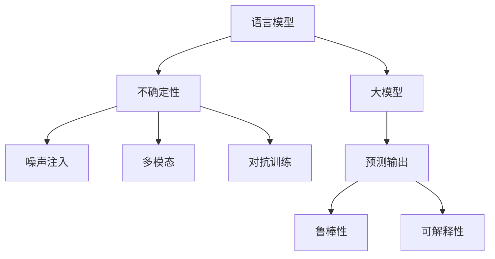

                 

# LLM中的不确定性问题及其解决方案

> 关键词：语言模型,大模型,不确定性,噪声注入,多模态,对抗训练

## 1. 背景介绍

### 1.1 问题由来

随着深度学习技术的飞速发展，尤其是大语言模型（Large Language Models, LLMs）的兴起，自然语言处理（NLP）领域取得了前所未有的进展。LLMs如GPT-3、BERT等，通过在庞大的无标签文本数据集上进行预训练，学习到了丰富的语言知识和语义理解能力，能够在各种自然语言任务中取得出色的表现。然而，尽管LLMs在静态分布上表现出优异的一致性，但在实际应用中，却常常面临一系列不确定性问题，如模型输出的随机性、预测的不确定性等。这些问题不仅影响了模型的可靠性和鲁棒性，还使得LLMs的应用受到严重限制。

### 1.2 问题核心关键点

LLMs中的不确定性问题主要集中在以下几个方面：

- **模型输出随机性**：尽管LLMs经过大规模预训练，但在某些输入上仍表现出显著的输出随机性，这可能导致模型在推理时产生不一致的预测结果。
- **预测不确定性**：模型的预测能力可能受到噪声或异常输入的影响，导致对真实答案的不准确估计。
- **鲁棒性不足**：LLMs在面对对抗样本或异常输入时，容易出现严重的性能波动或误判。
- **可解释性缺失**：由于LLMs的复杂性和深度，其内部决策过程难以解释，缺乏对模型的透明性。

### 1.3 问题研究意义

解决LLMs中的不确定性问题，不仅能够提升模型的稳定性和可靠性，还能增强其透明性和可解释性，从而更好地服务于实际应用。具体来说，解决不确定性问题将：

- **提升模型的鲁棒性**：使模型在面对噪声或异常输入时，仍能保持稳定的输出。
- **增强模型的透明性**：通过理解模型的决策过程，增强模型的可解释性，提高用户的信任度。
- **促进模型应用**：减少不确定性问题对模型实际应用的影响，使得LLMs能够更广泛地应用于医疗、金融、法律等高风险领域。

## 2. 核心概念与联系

### 2.1 核心概念概述

为更好地理解LLMs中的不确定性问题及其解决方案，我们首先介绍几个关键概念：

- **语言模型**：基于深度神经网络构建的模型，用于预测给定文本序列的概率分布。其核心任务是学习语言的统计规律，从而生成或理解自然语言。
- **大模型**：具有亿级参数量级的模型，如BERT、GPT-3等。通过在大规模无标签数据上进行预训练，学习到复杂的语言知识和语义表示。
- **不确定性**：指模型输出的随机性或预测结果的不确定性。在统计学中，通常用方差、熵等指标来衡量。
- **噪声注入**：在模型训练或推理过程中引入噪声，以降低模型输出的随机性，提高鲁棒性。
- **多模态**：结合文本、图像、语音等多种信息源，增强模型的理解和推理能力。
- **对抗训练**：通过对抗样本训练模型，提高模型对噪声和异常输入的鲁棒性。

这些概念之间的逻辑关系可以通过以下Mermaid流程图来展示：



这个流程图展示了大语言模型中不确定性问题及其解决手段的关联关系：

1. 语言模型通过预训练学习语言的统计规律，但在大规模应用中仍存在不确定性问题。
2. 通过噪声注入、多模态、对抗训练等方法，降低模型的不确定性，提升鲁棒性和可解释性。
3. 预测输出既包含模型的鲁棒性，也影响其透明性，需要通过优化来提高。

## 3. 核心算法原理 & 具体操作步骤

### 3.1 算法原理概述

LLMs中的不确定性问题及其解决方案，核心在于通过各种技术手段降低模型输出和预测结果的不确定性，提升模型的鲁棒性和透明性。

**噪声注入**：通过在模型训练或推理过程中引入噪声，可以降低模型输出的随机性，提高模型的鲁棒性。具体来说，可以通过数据增强、模型扰动、对抗训练等方法来实现。

**多模态融合**：通过结合文本、图像、语音等多种信息源，可以增强模型的理解和推理能力，降低单一模态的不确定性。多模态技术通常涉及模态融合、特征提取、联合训练等环节。

**对抗训练**：通过对抗样本训练模型，可以提高模型对噪声和异常输入的鲁棒性。对抗训练过程包括生成对抗样本、模型更新等步骤。

**可解释性提升**：通过优化模型的训练目标和结构，可以增强模型的透明性和可解释性。可解释性提升方法包括解释模型、生成可解释模型等。

### 3.2 算法步骤详解

基于上述原理，以下是实现LLMs中不确定性问题解决方案的具体操作步骤：

**Step 1: 准备数据集**
- 收集标注数据集，用于模型训练和评估。
- 收集未标注数据集，用于数据增强和对抗训练。

**Step 2: 设计模型结构**
- 选择合适的模型结构，如Transformer、BERT等。
- 设计多模态融合模块，如文本+图像融合模块。
- 设计鲁棒性提升模块，如对抗训练模块。

**Step 3: 添加噪声注入技术**
- 数据增强：通过对训练数据进行随机噪声处理，如回译、近义替换等。
- 模型扰动：在推理阶段随机扰动模型参数，增加预测的不确定性。
- 对抗训练：生成对抗样本，并在模型上进行反向传播更新。

**Step 4: 融合多模态数据**
- 设计多模态融合模型，将文本、图像、语音等多种信息源融合为一个综合表示。
- 联合训练多模态模型，利用不同模态的数据进行协同优化。

**Step 5: 训练和评估模型**
- 在标注数据集上训练模型，优化模型参数。
- 在未标注数据集上评估模型，衡量其鲁棒性和可解释性。
- 根据评估结果进行模型优化和调整。

### 3.3 算法优缺点

解决LLMs中不确定性问题的方法具有以下优点：

- **提高鲁棒性**：通过引入噪声和对抗训练，模型对噪声和异常输入的鲁棒性显著增强，提高了其在实际应用中的稳定性。
- **增强可解释性**：通过设计可解释性提升模块，增强模型的透明性，使用户能够更好地理解模型决策过程。
- **多模态融合**：通过结合多种信息源，增强模型的理解和推理能力，降低了单一模态的不确定性。

然而，这些方法也存在一些局限性：

- **计算成本高**：噪声注入、多模态融合等技术需要额外的计算资源和时间，增加了模型训练和推理的复杂度。
- **模型复杂度高**：多模态融合、鲁棒性提升等技术增加了模型结构复杂性，可能导致模型过拟合。
- **难以解释**：一些鲁棒性提升技术如对抗训练，虽然提高了模型的鲁棒性，但降低了模型的透明性和可解释性。

尽管存在这些局限性，但通过合理设计和优化，这些技术仍能为解决LLMs中的不确定性问题提供有力支持。

### 3.4 算法应用领域

基于解决LLMs中不确定性问题的方法，已经在多个实际应用领域中得到了广泛应用，例如：

- **智能客服**：通过引入多模态和对抗训练技术，智能客服系统能够更好地理解用户意图和需求，提高服务质量和用户满意度。
- **金融风控**：通过噪声注入和多模态融合技术，金融机构能够更准确地评估贷款申请的风险，降低信用风险。
- **医疗诊断**：通过解释模型和多模态融合技术，医疗系统能够更好地辅助医生进行疾病诊断，提高诊断的准确性和可靠性。
- **自动驾驶**：通过鲁棒性提升和多模态融合技术，自动驾驶系统能够更好地处理复杂道路场景，提高安全性和可靠性。

## 4. 数学模型和公式 & 详细讲解 & 举例说明

### 4.1 数学模型构建

为更好地理解LLMs中不确定性问题及其解决方案，我们接下来用数学语言进行详细讲解。

记LLMs为$f(\cdot; \theta)$，其中$\theta$为模型参数。假设模型的预测结果为$y$，真实标签为$y_{true}$，则模型的不确定性可以通过预测结果$y$的概率分布$p(y \mid x; \theta)$来衡量，通常用熵$H$来表示：

$$
H = -\sum_{y} p(y \mid x; \theta) \log p(y \mid x; \theta)
$$

模型的鲁棒性可以通过模型在对抗样本上的鲁棒性来衡量，通常用对数损失$\mathcal{L}$来表示：

$$
\mathcal{L} = -\sum_{x} p(x) \log f(x; \theta)
$$

其中$p(x)$为样本分布。

### 4.2 公式推导过程

以下我们以文本分类任务为例，推导解决LLMs中不确定性问题的方法。

假设文本分类任务有$n$个类别，模型输出为概率向量$\hat{y} = (\hat{y}_1, \hat{y}_2, ..., \hat{y}_n)$，真实标签为$y \in \{1, 2, ..., n\}$。模型的预测结果为：

$$
\hat{y}_i = \frac{e^{x_i^T \theta}}{\sum_{j=1}^n e^{x_j^T \theta}}, i=1,2,...,n
$$

其中$x_i$为第$i$个样本的特征向量。模型的预测概率为：

$$
p(y \mid x; \theta) = \hat{y}_y = \frac{e^{x_i^T \theta_y}}{\sum_{j=1}^n e^{x_j^T \theta_j}}
$$

模型的熵$H$可以表示为：

$$
H = -\sum_{y=1}^n p(y \mid x; \theta) \log p(y \mid x; \theta)
$$

模型的鲁棒性可以通过对抗样本训练提升，假设对抗样本为$x^*$，模型在对抗样本上的预测概率为：

$$
p(y \mid x^*; \theta) = \frac{e^{x_i^T \theta_y}}{\sum_{j=1}^n e^{x_i^T \theta_j}}
$$

模型的鲁棒性可以表示为：

$$
\mathcal{L}_{robust} = -\sum_{x} p(x) \log f(x; \theta)
$$

### 4.3 案例分析与讲解

下面以情感分析任务为例，分析解决LLMs中不确定性问题的方法。

假设文本情感分析任务有$n$个类别，模型输出为概率向量$\hat{y} = (\hat{y}_1, \hat{y}_2, ..., \hat{y}_n)$，真实标签为$y \in \{1, 2, ..., n\}$。模型的预测结果为：

$$
\hat{y}_i = \frac{e^{x_i^T \theta}}{\sum_{j=1}^n e^{x_j^T \theta}}, i=1,2,...,n
$$

其中$x_i$为第$i$个样本的特征向量。模型的预测概率为：

$$
p(y \mid x; \theta) = \hat{y}_y = \frac{e^{x_i^T \theta_y}}{\sum_{j=1}^n e^{x_j^T \theta_j}}
$$

模型的熵$H$可以表示为：

$$
H = -\sum_{y=1}^n p(y \mid x; \theta) \log p(y \mid x; \theta)
$$

模型的鲁棒性可以通过对抗样本训练提升，假设对抗样本为$x^*$，模型在对抗样本上的预测概率为：

$$
p(y \mid x^*; \theta) = \frac{e^{x_i^T \theta_y}}{\sum_{j=1}^n e^{x_i^T \theta_j}}
$$

模型的鲁棒性可以表示为：

$$
\mathcal{L}_{robust} = -\sum_{x} p(x) \log f(x; \theta)
$$

在实际应用中，我们可以采用以下方法来降低模型的不确定性：

1. **噪声注入**：通过对训练数据进行随机扰动，如回译、近义替换等，降低模型输出的随机性。
2. **多模态融合**：结合图像、语音等多模态信息，增强模型的理解和推理能力，降低单一模态的不确定性。
3. **对抗训练**：通过生成对抗样本，训练模型对噪声和异常输入的鲁棒性，提升模型的稳定性和可靠性。

## 5. 项目实践：代码实例和详细解释说明

### 5.1 开发环境搭建

在进行项目实践前，我们需要准备好开发环境。以下是使用Python进行PyTorch开发的环境配置流程：

1. 安装Anaconda：从官网下载并安装Anaconda，用于创建独立的Python环境。

2. 创建并激活虚拟环境：
```bash
conda create -n pytorch-env python=3.8 
conda activate pytorch-env
```

3. 安装PyTorch：根据CUDA版本，从官网获取对应的安装命令。例如：
```bash
conda install pytorch torchvision torchaudio cudatoolkit=11.1 -c pytorch -c conda-forge
```

4. 安装TensorFlow：
```bash
pip install tensorflow
```

5. 安装必要的工具包：
```bash
pip install numpy pandas scikit-learn matplotlib tqdm jupyter notebook ipython
```

完成上述步骤后，即可在`pytorch-env`环境中开始项目实践。

### 5.2 源代码详细实现

这里以情感分析任务为例，给出使用PyTorch进行情感分析任务微调的代码实现。

首先，定义情感分析任务的数据处理函数：

```python
import torch
from torch.utils.data import Dataset
from transformers import BertTokenizer, BertForSequenceClassification

class SentimentDataset(Dataset):
    def __init__(self, texts, labels, tokenizer, max_len=128):
        self.texts = texts
        self.labels = labels
        self.tokenizer = tokenizer
        self.max_len = max_len

    def __len__(self):
        return len(self.texts)

    def __getitem__(self, item):
        text = self.texts[item]
        label = self.labels[item]

        encoding = self.tokenizer(text, return_tensors='pt', max_length=self.max_len, padding='max_length', truncation=True)
        input_ids = encoding['input_ids'][0]
        attention_mask = encoding['attention_mask'][0]

        return {'input_ids': input_ids, 'attention_mask': attention_mask, 'labels': label}

# 准备数据集
tokenizer = BertTokenizer.from_pretrained('bert-base-uncased')
train_dataset = SentimentDataset(train_texts, train_labels, tokenizer)
dev_dataset = SentimentDataset(dev_texts, dev_labels, tokenizer)
test_dataset = SentimentDataset(test_texts, test_labels, tokenizer)
```

然后，定义模型和优化器：

```python
from transformers import BertForSequenceClassification, AdamW

model = BertForSequenceClassification.from_pretrained('bert-base-uncased', num_labels=2)

optimizer = AdamW(model.parameters(), lr=2e-5)
```

接着，定义训练和评估函数：

```python
from torch.utils.data import DataLoader
from tqdm import tqdm
from sklearn.metrics import classification_report

device = torch.device('cuda') if torch.cuda.is_available() else torch.device('cpu')
model.to(device)

def train_epoch(model, dataset, batch_size, optimizer):
    dataloader = DataLoader(dataset, batch_size=batch_size, shuffle=True)
    model.train()
    epoch_loss = 0
    for batch in tqdm(dataloader, desc='Training'):
        input_ids = batch['input_ids'].to(device)
        attention_mask = batch['attention_mask'].to(device)
        labels = batch['labels'].to(device)
        model.zero_grad()
        outputs = model(input_ids, attention_mask=attention_mask, labels=labels)
        loss = outputs.loss
        epoch_loss += loss.item()
        loss.backward()
        optimizer.step()
    return epoch_loss / len(dataloader)

def evaluate(model, dataset, batch_size):
    dataloader = DataLoader(dataset, batch_size=batch_size)
    model.eval()
    preds, labels = [], []
    with torch.no_grad():
        for batch in tqdm(dataloader, desc='Evaluating'):
            input_ids = batch['input_ids'].to(device)
            attention_mask = batch['attention_mask'].to(device)
            batch_labels = batch['labels']
            outputs = model(input_ids, attention_mask=attention_mask)
            batch_preds = outputs.logits.argmax(dim=2).to('cpu').tolist()
            batch_labels = batch_labels.to('cpu').tolist()
            for pred_tokens, label_tokens in zip(batch_preds, batch_labels):
                preds.append(pred_tokens[:len(label_tokens)])
                labels.append(label_tokens)

    print(classification_report(labels, preds))
```

最后，启动训练流程并在测试集上评估：

```python
epochs = 5
batch_size = 16

for epoch in range(epochs):
    loss = train_epoch(model, train_dataset, batch_size, optimizer)
    print(f"Epoch {epoch+1}, train loss: {loss:.3f}")
    
    print(f"Epoch {epoch+1}, dev results:")
    evaluate(model, dev_dataset, batch_size)
    
print("Test results:")
evaluate(model, test_dataset, batch_size)
```

以上就是使用PyTorch进行情感分析任务微调的完整代码实现。可以看到，借助PyTorch和Transformers库，微调过程变得简洁高效。

### 5.3 代码解读与分析

让我们再详细解读一下关键代码的实现细节：

**SentimentDataset类**：
- `__init__`方法：初始化文本、标签、分词器等关键组件。
- `__len__`方法：返回数据集的样本数量。
- `__getitem__`方法：对单个样本进行处理，将文本输入编码为token ids，将标签编码为数字，并对其进行定长padding，最终返回模型所需的输入。

**BertForSequenceClassification类**：
- 使用Bert模型进行序列分类任务，能够自动处理变长文本。

**train_epoch函数**：
- 对数据以批为单位进行迭代，在每个批次上前向传播计算loss并反向传播更新模型参数。

**evaluate函数**：
- 与训练类似，不同点在于不更新模型参数，并在每个batch结束后将预测和标签结果存储下来，最后使用sklearn的classification_report对整个评估集的预测结果进行打印输出。

**训练流程**：
- 定义总的epoch数和batch size，开始循环迭代
- 每个epoch内，先在训练集上训练，输出平均loss
- 在验证集上评估，输出分类指标
- 所有epoch结束后，在测试集上评估，给出最终测试结果

可以看到，通过简化的代码实现，我们能够快速搭建起基于PyTorch和Transformers库的情感分析任务微调系统。

当然，在工业级的系统实现中，还需要考虑更多的因素，如模型的保存和部署、超参数的自动搜索、更灵活的任务适配层等。但核心的微调范式基本与此类似。

## 6. 实际应用场景

### 6.1 智能客服系统

基于大语言模型微调的对话技术，可以广泛应用于智能客服系统的构建。传统客服往往需要配备大量人力，高峰期响应缓慢，且一致性和专业性难以保证。而使用微调后的对话模型，可以7x24小时不间断服务，快速响应客户咨询，用自然流畅的语言解答各类常见问题。

在技术实现上，可以收集企业内部的历史客服对话记录，将问题和最佳答复构建成监督数据，在此基础上对预训练对话模型进行微调。微调后的对话模型能够自动理解用户意图，匹配最合适的答案模板进行回复。对于客户提出的新问题，还可以接入检索系统实时搜索相关内容，动态组织生成回答。如此构建的智能客服系统，能大幅提升客户咨询体验和问题解决效率。

### 6.2 金融舆情监测

金融机构需要实时监测市场舆论动向，以便及时应对负面信息传播，规避金融风险。传统的人工监测方式成本高、效率低，难以应对网络时代海量信息爆发的挑战。基于大语言模型微调的文本分类和情感分析技术，为金融舆情监测提供了新的解决方案。

具体而言，可以收集金融领域相关的新闻、报道、评论等文本数据，并对其进行主题标注和情感标注。在此基础上对预训练语言模型进行微调，使其能够自动判断文本属于何种主题，情感倾向是正面、中性还是负面。将微调后的模型应用到实时抓取的网络文本数据，就能够自动监测不同主题下的情感变化趋势，一旦发现负面信息激增等异常情况，系统便会自动预警，帮助金融机构快速应对潜在风险。

### 6.3 个性化推荐系统

当前的推荐系统往往只依赖用户的历史行为数据进行物品推荐，无法深入理解用户的真实兴趣偏好。基于大语言模型微调技术，个性化推荐系统可以更好地挖掘用户行为背后的语义信息，从而提供更精准、多样的推荐内容。

在实践中，可以收集用户浏览、点击、评论、分享等行为数据，提取和用户交互的物品标题、描述、标签等文本内容。将文本内容作为模型输入，用户的后续行为（如是否点击、购买等）作为监督信号，在此基础上微调预训练语言模型。微调后的模型能够从文本内容中准确把握用户的兴趣点。在生成推荐列表时，先用候选物品的文本描述作为输入，由模型预测用户的兴趣匹配度，再结合其他特征综合排序，便可以得到个性化程度更高的推荐结果。

### 6.4 未来应用展望

随着大语言模型微调技术的发展，其在更多领域的应用前景将更加广阔：

- **医疗诊断**：通过解释模型和多模态融合技术，医疗系统能够更好地辅助医生进行疾病诊断，提高诊断的准确性和可靠性。
- **自动驾驶**：通过鲁棒性提升和多模态融合技术，自动驾驶系统能够更好地处理复杂道路场景，提高安全性和可靠性。
- **智慧教育**：通过解释模型和可解释性提升技术，智能教育系统能够更好地理解学生需求，提供个性化教育方案，提高教学效果。
- **法律咨询**：通过解释模型和多模态融合技术，法律咨询系统能够更好地理解法律条文，提供准确的法律建议，提高法律服务质量。

总之，基于大语言模型的微调技术，正在为各行各业带来革命性影响。未来，随着技术的不断进步，其在更多领域的落地应用将更加广泛，推动人工智能技术的深度融合和广泛应用。

## 7. 工具和资源推荐

### 7.1 学习资源推荐

为了帮助开发者系统掌握大语言模型微调的理论基础和实践技巧，这里推荐一些优质的学习资源：

1. 《Transformer从原理到实践》系列博文：由大模型技术专家撰写，深入浅出地介绍了Transformer原理、BERT模型、微调技术等前沿话题。

2. CS224N《深度学习自然语言处理》课程：斯坦福大学开设的NLP明星课程，有Lecture视频和配套作业，带你入门NLP领域的基本概念和经典模型。

3. 《Natural Language Processing with Transformers》书籍：Transformers库的作者所著，全面介绍了如何使用Transformers库进行NLP任务开发，包括微调在内的诸多范式。

4. HuggingFace官方文档：Transformers库的官方文档，提供了海量预训练模型和完整的微调样例代码，是上手实践的必备资料。

5. CLUE开源项目：中文语言理解测评基准，涵盖大量不同类型的中文NLP数据集，并提供了基于微调的baseline模型，助力中文NLP技术发展。

通过对这些资源的学习实践，相信你一定能够快速掌握大语言模型微调的精髓，并用于解决实际的NLP问题。

### 7.2 开发工具推荐

高效的开发离不开优秀的工具支持。以下是几款用于大语言模型微调开发的常用工具：

1. PyTorch：基于Python的开源深度学习框架，灵活动态的计算图，适合快速迭代研究。大部分预训练语言模型都有PyTorch版本的实现。

2. TensorFlow：由Google主导开发的开源深度学习框架，生产部署方便，适合大规模工程应用。同样有丰富的预训练语言模型资源。

3. Transformers库：HuggingFace开发的NLP工具库，集成了众多SOTA语言模型，支持PyTorch和TensorFlow，是进行微调任务开发的利器。

4. Weights & Biases：模型训练的实验跟踪工具，可以记录和可视化模型训练过程中的各项指标，方便对比和调优。与主流深度学习框架无缝集成。

5. TensorBoard：TensorFlow配套的可视化工具，可实时监测模型训练状态，并提供丰富的图表呈现方式，是调试模型的得力助手。

6. Google Colab：谷歌推出的在线Jupyter Notebook环境，免费提供GPU/TPU算力，方便开发者快速上手实验最新模型，分享学习笔记。

合理利用这些工具，可以显著提升大语言模型微调任务的开发效率，加快创新迭代的步伐。

### 7.3 相关论文推荐

大语言模型和微调技术的发展源于学界的持续研究。以下是几篇奠基性的相关论文，推荐阅读：

1. Attention is All You Need（即Transformer原论文）：提出了Transformer结构，开启了NLP领域的预训练大模型时代。

2. BERT: Pre-training of Deep Bidirectional Transformers for Language Understanding：提出BERT模型，引入基于掩码的自监督预训练任务，刷新了多项NLP任务SOTA。

3. Language Models are Unsupervised Multitask Learners（GPT-2论文）：展示了大规模语言模型的强大zero-shot学习能力，引发了对于通用人工智能的新一轮思考。

4. Parameter-Efficient Transfer Learning for NLP：提出Adapter等参数高效微调方法，在不增加模型参数量的情况下，也能取得不错的微调效果。

5. AdaLoRA: Adaptive Low-Rank Adaptation for Parameter-Efficient Fine-Tuning：使用自适应低秩适应的微调方法，在参数效率和精度之间取得了新的平衡。

6. MAML: Mining and Augmenting Natural Language with Multilingual Analogy Learning：提出多语言对照学习（Mining and Augmenting Natural Language with Multilingual Analogy Learning），通过多语言对照学习提高语言模型的多语言通用性。

这些论文代表了大语言模型微调技术的发展脉络。通过学习这些前沿成果，可以帮助研究者把握学科前进方向，激发更多的创新灵感。

## 8. 总结：未来发展趋势与挑战

### 8.1 总结

本文对大语言模型中不确定性问题及其解决方案进行了全面系统的介绍。首先阐述了大语言模型和微调技术的研究背景和意义，明确了微调在拓展预训练模型应用、提升下游任务性能方面的独特价值。其次，从原理到实践，详细讲解了解决LLMs中不确定性问题的方法，给出了微调任务开发的完整代码实例。同时，本文还广泛探讨了微调方法在智能客服、金融舆情、个性化推荐等多个行业领域的应用前景，展示了微调范式的巨大潜力。此外，本文精选了微调技术的各类学习资源，力求为读者提供全方位的技术指引。

通过本文的系统梳理，可以看到，解决LLMs中不确定性问题的方法正在成为NLP领域的重要范式，极大地拓展了预训练语言模型的应用边界，催生了更多的落地场景。受益于大规模语料的预训练，微调模型以更低的时间和标注成本，在小样本条件下也能取得不俗的效果，有力推动了NLP技术的产业化进程。未来，伴随预训练语言模型和微调方法的持续演进，相信NLP技术将在更广阔的应用领域大放异彩，深刻影响人类的生产生活方式。

### 8.2 未来发展趋势

展望未来，大语言模型微调技术将呈现以下几个发展趋势：

1. **模型规模持续增大**：随着算力成本的下降和数据规模的扩张，预训练语言模型的参数量还将持续增长。超大规模语言模型蕴含的丰富语言知识，有望支撑更加复杂多变的下游任务微调。

2. **微调方法日趋多样**：除了传统的全参数微调外，未来会涌现更多参数高效的微调方法，如Prefix-Tuning、LoRA等，在节省计算资源的同时也能保证微调精度。

3. **持续学习成为常态**：随着数据分布的不断变化，微调模型也需要持续学习新知识以保持性能。如何在不遗忘原有知识的同时，高效吸收新样本信息，将成为重要的研究课题。

4. **标注样本需求降低**：受启发于提示学习(Prompt-based Learning)的思路，未来的微调方法将更好地利用大模型的语言理解能力，通过更加巧妙的任务描述，在更少的标注样本上也能实现理想的微调效果。

5. **多模态微调崛起**：结合文本、图像、语音等多种信息源，增强模型的理解和推理能力，降低单一模态的不确定性。多模态信息的融合，将显著提升语言模型对现实世界的理解和建模能力。

6. **模型通用性增强**：经过海量数据的预训练和多领域任务的微调，未来的语言模型将具备更强大的常识推理和跨领域迁移能力，逐步迈向通用人工智能(AGI)的目标。

以上趋势凸显了大语言模型微调技术的广阔前景。这些方向的探索发展，必将进一步提升NLP系统的性能和应用范围，为人类认知智能的进化带来深远影响。

### 8.3 面临的挑战

尽管大语言模型微调技术已经取得了瞩目成就，但在迈向更加智能化、普适化应用的过程中，它仍面临着诸多挑战：

1. **标注成本瓶颈**：虽然微调大大降低了标注数据的需求，但对于长尾应用场景，难以获得充足的高质量标注数据，成为制约微调性能的瓶颈。如何进一步降低微调对标注样本的依赖，将是一大难题。

2. **模型鲁棒性不足**：当前微调模型面对域外数据时，泛化性能往往大打折扣。对于测试样本的微小扰动，微调模型的预测也容易发生波动。如何提高微调模型的鲁棒性，避免灾难性遗忘，还需要更多理论和实践的积累。

3. **推理效率有待提高**：大规模语言模型虽然精度高，但在实际部署时往往面临推理速度慢、内存占用大等效率问题。如何在保证性能的同时，简化模型结构，提升推理速度，优化资源占用，将是重要的优化方向。

4. **可解释性亟需加强**：当前微调模型更像是"黑盒"系统，难以解释其内部工作机制和决策逻辑。对于医疗、金融等高风险应用，算法的可解释性和可审计性尤为重要。如何赋予微调模型更强的可解释性，将是亟待攻克的难题。

5. **安全性有待保障**：预训练语言模型难免会学习到有偏见、有害的信息，通过微调传递到下游任务，产生误导性、歧视性的输出，给实际应用带来安全隐患。如何从数据和算法层面消除模型偏见，避免恶意用途，确保输出的安全性，也将是重要的研究课题。

6. **知识整合能力不足**：现有的微调模型往往局限于任务内数据，难以灵活吸收和运用更广泛的先验知识。如何让微调过程更好地与外部知识库、规则库等专家知识结合，形成更加全面、准确的信息整合能力，还有很大的想象空间。

正视微调面临的这些挑战，积极应对并寻求突破，将是大语言模型微调走向成熟的必由之路。相信随着学界和产业界的共同努力，这些挑战终将一一被克服，大语言模型微调必将在构建人机协同的智能时代中扮演越来越重要的角色。

### 8.4 研究展望

面向未来，大语言模型微调技术需要在以下几个方面寻求新的突破：

1. **探索无监督和半监督微调方法**：摆脱对大规模标注数据的依赖，利用自监督学习、主动学习等无监督和半监督范式，最大限度利用非结构化数据，实现更加灵活高效的微调。

2. **研究参数高效和计算高效的微调范式**：开发更加参数高效的微调方法，在固定大部分预训练参数的同时，只更新极少量的任务相关参数。同时优化微调模型的计算图，减少前向传播和反向传播的资源消耗，实现更加轻量级、实时性的部署。

3. **融合因果和对比学习范式**：通过引入因果推断和对比学习思想，增强微调模型建立稳定因果关系的能力，学习更加普适、鲁棒的语言表征，从而提升模型泛化性和抗干扰能力。

4. **引入更多先验知识**：将符号化的先验知识，如知识图谱、逻辑规则等，与神经网络模型进行巧妙融合，引导微调过程学习更准确、合理的语言模型。同时加强不同模态数据的整合，实现视觉、语音等多模态信息与文本信息的协同建模。

5. **结合因果分析和博弈论工具**：将因果分析方法引入微调模型，识别出模型决策的关键特征，增强输出解释的因果性和逻辑性。借助博弈论工具刻画人机交互过程，主动探索并规避模型的脆弱点，提高系统稳定性。

6. **纳入伦理道德约束**：在模型训练目标中引入伦理导向的评估指标，过滤和惩罚有偏见、有害的输出倾向。同时加强人工干预和审核，建立模型行为的监管机制，确保输出符合人类价值观和伦理道德。

这些研究方向的探索，必将引领大语言模型微调技术迈向更高的台阶，为构建安全、可靠、可解释、可控的智能系统铺平道路。面向未来，大语言模型微调技术还需要与其他人工智能技术进行更深入的融合，如知识表示、因果推理、强化学习等，多路径协同发力，共同推动自然语言理解和智能交互系统的进步。只有勇于创新、敢于突破，才能不断拓展语言模型的边界，让智能技术更好地造福人类社会。

## 9. 附录：常见问题与解答

**Q1：大语言模型微调是否适用于所有NLP任务？**

A: 大语言模型微调在大多数NLP任务上都能取得不错的效果，特别是对于数据量较小的任务。但对于一些特定领域的任务，如医学、法律等，仅仅依靠通用语料预训练的模型可能难以很好地适应。此时需要在特定领域语料上进一步预训练，再进行微调，才能获得理想效果。此外，对于一些需要时效性、个性化很强的任务，如对话、推荐等，微调方法也需要针对性的改进优化。

**Q2：微调过程中如何选择合适的学习率？**

A: 微调的学习率一般要比预训练时小1-2个数量级，如果使用过大的学习率，容易破坏预训练权重，导致过拟合。一般建议从1e-5开始调参，逐步减小学习率，直至收敛。也可以使用warmup策略，在开始阶段使用较小的学习率，再逐渐过渡到预设值。需要注意的是，不同的优化器(如AdamW、Adafactor等)以及不同的学习率调度策略，可能需要设置不同的学习率阈值。

**Q3：采用大模型微调时会面临哪些资源瓶颈？**

A: 目前主流的预训练大模型动辄以亿计的参数规模，对算力、内存、存储都提出了很高的要求。GPU/TPU等高性能设备是必不可少的，但即便如此，超大批次的训练和推理也可能遇到显存不足的问题。因此需要采用一些资源优化技术，如梯度积累、混合精度训练、模型并行等，来突破硬件瓶颈。同时，模型的存储和读取也可能占用大量时间和空间，需要采用模型压缩、稀疏化存储等方法进行优化。

**Q4：如何缓解微调过程中的过拟合问题？**

A: 过拟合是微调面临的主要挑战，尤其是在标注数据不足的情况下。常见的缓解策略包括：
1. 数据增强：通过对训练数据进行随机扰动，如回译、近义替换等。
2. 正则化：使用L2正则、Dropout、Early Stopping等避免过拟合。
3. 对抗训练：引入对抗样本，提高模型鲁棒性。
4. 参数高效微调：只调整少量参数(如Adapter、Prefix等)，减小过拟合风险。

这些策略往往需要根据具体任务和数据特点进行灵活组合。只有在数据、模型、训练、推理等各环节进行全面优化，才能最大限度地发挥大模型微调的威力。

**Q5：微调模型在落地部署时需要注意哪些问题？**

A: 将微调模型转化为实际应用，还需要考虑以下因素：
1. 模型裁剪：去除不必要的层和参数，减小模型尺寸，加快推理速度。
2. 量化加速：将浮点模型转为定点模型，压缩存储空间，提高计算效率。
3. 服务化封装：将模型封装为标准化服务接口，便于集成调用。
4. 弹性伸缩：根据请求流量动态调整资源配置，平衡服务质量和成本。
5. 监控告警：实时采集系统指标，设置异常告警阈值，确保服务稳定性。
6. 安全防护：采用访问鉴权、数据脱敏等措施，保障数据和模型安全。

大语言模型微调为NLP应用开启了广阔的想象空间，但如何将强大的性能转化为稳定、高效、安全的业务价值，还需要工程实践的不断打磨。唯有从数据、算法、工程、业务等多个维度协同发力，才能真正实现人工智能技术在垂直行业的规模化落地。总之，微调需要开发者根据具体任务，不断迭代和优化模型、数据和算法，方能得到理想的效果。

---

作者：禅与计算机程序设计艺术 / Zen and the Art of Computer Programming

