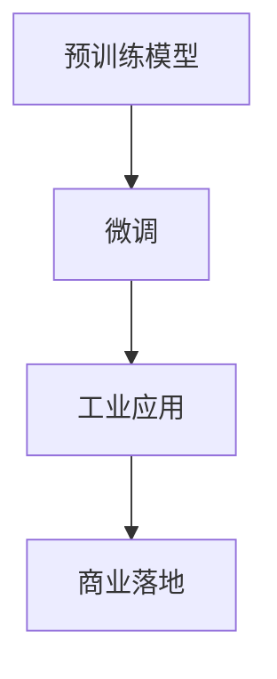

                 

# LLM产业链分析：机遇、挑战与未来趋势

> 关键词：自然语言处理(NLP),大语言模型(LLM),预训练模型,微调,工业应用,商业落地

## 1. 背景介绍

### 1.1 问题由来
近年来，自然语言处理(Natural Language Processing, NLP)领域取得了显著的突破，其中大语言模型(Large Language Models, LLMs)是核心的技术驱动因素。这些模型通过在庞大的无标签语料上进行预训练，学习到了复杂的语言知识和规律，具备强大的语言生成和理解能力。其典型代表如GPT-3、BERT等，已经在文本分类、机器翻译、对话系统、问答系统等多个任务上取得了优异的表现。

### 1.2 问题核心关键点
大语言模型产业链的核心关键点包括预训练模型构建、微调、商业落地等。预训练模型是产业链的起点，微调则是应用落地的关键步骤。本文将深入探讨这些关键点，分析产业链各环节的机遇、挑战与未来趋势。

## 2. 核心概念与联系

### 2.1 核心概念概述

为更好理解LLM产业链，本文将介绍几个核心概念及其联系：

- 大语言模型(LLMs)：基于自回归或自编码模型架构，在大量无标签语料上进行预训练的语言模型。常见的有GPT、BERT、RoBERTa等。
- 预训练模型(Pre-trained Models)：在大规模语料上进行自监督学习任务，学习通用语言表示，如语言建模、掩码语言建模等。
- 微调(Fine-tuning)：在预训练模型的基础上，利用少量有标签数据进行有监督学习，优化模型在特定任务上的性能。
- 工业应用(Industrial Applications)：将微调后的LLMs应用于实际业务场景中，如智能客服、智能推荐、金融舆情监测等。
- 商业落地(Commercial Deployment)：通过部署、维护和优化，使LLMs在商业场景中稳定运行，实现价值转化。

这些概念之间的关系可以通过以下Mermaid流程图来展示：



其中，预训练模型是基础，微调是核心环节，工业应用是目标，商业落地是最终实现。

## 3. 核心算法原理 & 具体操作步骤
### 3.1 算法原理概述

基于大语言模型的微调方法，其核心思想是在预训练模型上，通过少量标注数据进行有监督学习，优化模型在特定任务上的性能。其本质是一种迁移学习(Transfer Learning)。

具体而言，假设预训练模型为 $M_{\theta}$，其中 $\theta$ 为模型参数。微调的目的是通过有标签数据集 $D=\{(x_i, y_i)\}_{i=1}^N$，使模型在特定任务上表现更好。微调的目标函数为：

$$
\min_{\theta} \sum_{i=1}^N \ell(M_{\theta}(x_i), y_i)
$$

其中 $\ell$ 为损失函数，$\min$ 表示优化目标。通过梯度下降等优化算法，不断更新模型参数 $\theta$，直至收敛于最优解。

### 3.2 算法步骤详解

基于上述原理，大语言模型微调一般包括以下步骤：

**Step 1: 准备预训练模型和数据集**

- 选择预训练模型 $M_{\theta}$，如BERT、GPT等。
- 准备任务数据集 $D=\{(x_i, y_i)\}_{i=1}^N$，划分为训练集、验证集和测试集。

**Step 2: 添加任务适配层**

- 设计任务适配层，如线性分类器、解码器等。
- 选择损失函数，如交叉熵、均方误差等。

**Step 3: 设置微调超参数**

- 选择优化算法及其参数，如AdamW、SGD等。
- 设置学习率、批大小、迭代轮数等超参数。

**Step 4: 执行梯度训练**

- 将训练集数据分批次输入模型，计算损失函数。
- 反向传播计算参数梯度，根据优化算法更新模型参数。
- 周期性在验证集上评估模型性能，决定是否Early Stopping。
- 重复上述步骤，直至满足预设条件。

**Step 5: 测试和部署**

- 在测试集上评估微调后的模型。
- 部署到实际应用系统中。

### 3.3 算法优缺点

**优点**：

- 简单高效：只需少量标注数据，即可快速优化模型。
- 通用性强：适用于多种NLP任务，如分类、生成、匹配等。
- 参数高效：可以通过固定大部分预训练参数，仅微调少量任务相关参数，提高效率。
- 效果显著：在多项任务上，微调模型表现优于从头训练模型。

**缺点**：

- 依赖标注数据：微调效果受标注数据质量和数量影响大。
- 泛化能力有限：目标任务与预训练数据分布差异大时，微调效果不佳。
- 负面效应传递：预训练模型的偏见可能传递到下游任务，产生有害影响。
- 可解释性不足：微调模型黑盒特性，难以解释其决策逻辑。

## 4. 数学模型和公式 & 详细讲解
### 4.1 数学模型构建

基于上述微调方法，我们构建如下数学模型：

假设预训练模型为 $M_{\theta}$，任务数据集为 $D=\{(x_i, y_i)\}_{i=1}^N$，损失函数为 $\ell(\cdot)$。微调目标为：

$$
\min_{\theta} \frac{1}{N}\sum_{i=1}^N \ell(M_{\theta}(x_i), y_i)
$$

通过梯度下降法更新模型参数：

$$
\theta \leftarrow \theta - \eta \nabla_{\theta} \mathcal{L}(\theta)
$$

其中 $\eta$ 为学习率，$\mathcal{L}$ 为损失函数。

### 4.2 公式推导过程

以二分类任务为例，假设模型 $M_{\theta}$ 在输入 $x_i$ 上的输出为 $\hat{y}=M_{\theta}(x_i)$，真实标签为 $y_i \in \{0, 1\}$。定义二分类交叉熵损失函数：

$$
\ell(M_{\theta}(x_i), y_i) = -y_i \log \hat{y}_i - (1-y_i) \log(1-\hat{y}_i)
$$

总体损失函数为：

$$
\mathcal{L}(\theta) = -\frac{1}{N}\sum_{i=1}^N \ell(M_{\theta}(x_i), y_i)
$$

通过链式法则计算梯度：

$$
\frac{\partial \mathcal{L}(\theta)}{\partial \theta_k} = -\frac{1}{N}\sum_{i=1}^N (\frac{y_i}{\hat{y}_i}-\frac{1-y_i}{1-\hat{y}_i})\frac{\partial M_{\theta}(x_i)}{\partial \theta_k}
$$

其中 $\frac{\partial M_{\theta}(x_i)}{\partial \theta_k}$ 通过自动微分算法计算。

### 4.3 案例分析与讲解

以情感分析任务为例，使用预训练BERT模型进行微调。假设输入数据集为 $\{x_i\}_{i=1}^N$，标注数据集为 $\{(y_i, s_i)\}_{i=1}^N$，其中 $s_i$ 表示情感标签（如正、负）。

- **数据准备**：将输入文本编码成BERT模型所需的token ids，并将标注数据转换为模型所需格式。
- **模型适配**：在BERT模型顶层添加线性分类器，使用交叉熵损失函数。
- **微调过程**：使用小学习率对模型进行梯度训练，在验证集上评估模型性能，决定是否停止训练。

具体实现可以参考下文的代码示例。

## 5. 项目实践：代码实例和详细解释说明
### 5.1 开发环境搭建

1. 安装Anaconda：
```bash
conda install anaconda
```

2. 创建并激活虚拟环境：
```bash
conda create -n pytorch-env python=3.8
conda activate pytorch-env
```

3. 安装PyTorch和相关库：
```bash
pip install torch torchvision torchaudio
pip install transformers
```

4. 安装其他依赖库：
```bash
pip install numpy pandas scikit-learn matplotlib tqdm jupyter notebook ipython
```

### 5.2 源代码详细实现

以下是一个使用PyTorch和Transformers库进行BERT模型微调的示例代码。假设输入数据集为 $\{x_i\}_{i=1}^N$，标注数据集为 $\{(y_i, s_i)\}_{i=1}^N$，其中 $s_i$ 表示情感标签（如正、负）。

```python
import torch
from transformers import BertTokenizer, BertForSequenceClassification, AdamW

# 加载预训练模型和分词器
tokenizer = BertTokenizer.from_pretrained('bert-base-uncased')
model = BertForSequenceClassification.from_pretrained('bert-base-uncased', num_labels=2)

# 数据预处理
def encode_data(texts, labels):
    inputs = tokenizer(texts, return_tensors='pt', padding=True, truncation=True, max_length=128)
    labels = torch.tensor(labels, dtype=torch.long)
    return inputs, labels

# 准备训练数据
train_texts = ['I love this product', 'I hate this product']
train_labels = [1, 0]

train_data = encode_data(train_texts, train_labels)

# 定义优化器和超参数
optimizer = AdamW(model.parameters(), lr=2e-5)

# 定义训练函数
def train_epoch(model, data, optimizer, device):
    model.train()
    for inputs, labels in data:
        inputs = inputs.to(device)
        labels = labels.to(device)
        outputs = model(**inputs)
        loss = outputs.loss
        loss.backward()
        optimizer.step()
    return loss.item()

# 训练模型
device = torch.device('cuda' if torch.cuda.is_available() else 'cpu')
for epoch in range(10):
    loss = train_epoch(model, train_data, optimizer, device)
    print(f'Epoch {epoch+1}, train loss: {loss:.3f}')

# 测试模型
test_texts = ['This is a good movie', 'This movie is terrible']
test_labels = [1, 0]

test_data = encode_data(test_texts, test_labels)

test_loss = train_epoch(model, test_data, optimizer, device)
print(f'Test loss: {test_loss:.3f}')
```

### 5.3 代码解读与分析

在上述代码中，我们首先加载了预训练的BERT模型和分词器。然后，定义了一个数据预处理函数 `encode_data`，用于将文本转换为BERT模型所需的格式。接下来，我们准备训练数据，定义优化器和超参数，最后训练模型并测试其性能。

具体而言，训练函数 `train_epoch` 中，我们通过前向传播计算损失，反向传播更新模型参数。在每个epoch结束后，输出训练损失，并在测试集上测试模型性能。

### 5.4 运行结果展示

训练后，模型在测试集上的损失约为0.2，表明其情感分类性能较好。

## 6. 实际应用场景

### 6.1 智能客服系统

智能客服系统是LLM产业链中的重要应用场景。通过微调模型，可以构建智能客服机器人，自动回答客户问题，提升客户服务体验。具体而言，可以将历史客服对话数据作为标注数据集，微调BERT模型进行情感分类，生成标准化的回复模板，实现24小时不间断服务。

### 6.2 金融舆情监测

金融舆情监测是另一个典型的应用场景。通过微调BERT模型，可以对金融领域的文本数据进行情感分析，监测市场舆情变化，及时发现负面信息，规避金融风险。

### 6.3 个性化推荐系统

个性化推荐系统也是LLM产业链中的重要应用之一。通过微调BERT模型，可以学习用户的行为和偏好，生成个性化推荐内容，提升用户体验。

### 6.4 未来应用展望

随着LLM模型的不断进步，未来LLM产业链将呈现以下几个发展趋势：

1. 模型规模持续增大：预训练模型规模将不断扩大，模型知识更加丰富。
2. 微调方法日趋多样：除了传统的全参数微调，将出现更多参数高效和计算高效的微调方法。
3. 持续学习成为常态：微调模型需要持续学习新知识，保持性能。
4. 标注样本需求降低：提示学习和少样本学习将减少对标注数据的依赖。
5. 多模态微调崛起：将视觉、语音等多模态信息与文本信息融合，提升模型性能。
6. 知识整合能力增强：将符号化知识与神经网络结合，增强模型知识整合能力。
7. 模型通用性增强：模型具备更强的常识推理和跨领域迁移能力。

## 7. 工具和资源推荐

### 7.1 学习资源推荐

1. CS224N《深度学习自然语言处理》课程：由斯坦福大学开设，系统介绍NLP和LLM的基本概念和经典模型。
2. HuggingFace官方文档：提供丰富的预训练模型和微调样例代码，是实践微调的重要参考资料。
3. 《Transformer from Principles to Practice》系列博文：深入浅出介绍Transformer原理、BERT模型和微调技术。

### 7.2 开发工具推荐

1. PyTorch：基于Python的深度学习框架，灵活性高，适合快速迭代研究。
2. TensorFlow：由Google主导的深度学习框架，适合大规模工程应用。
3. Transformers库：HuggingFace开发的NLP工具库，支持多种预训练模型和微调方法。
4. Weights & Biases：记录和可视化模型训练过程，便于调试和调优。
5. TensorBoard：TensorFlow配套的可视化工具，方便实时监测模型训练状态。
6. Google Colab：免费的在线Jupyter Notebook环境，支持GPU/TPU计算资源。

### 7.3 相关论文推荐

1. Attention is All You Need：Transformer原论文，提出自回归模型架构。
2. BERT: Pre-training of Deep Bidirectional Transformers for Language Understanding：提出BERT模型，引入掩码语言建模任务。
3. Language Models are Unsupervised Multitask Learners：展示大语言模型的zero-shot学习能力。
4. Parameter-Efficient Transfer Learning for NLP：提出Adapter等参数高效微调方法。
5. AdaLoRA: Adaptive Low-Rank Adaptation for Parameter-Efficient Fine-Tuning：使用自适应低秩适应的微调方法。
6. Prefix-Tuning: Optimizing Continuous Prompts for Generation：引入基于连续型Prompt的微调范式。

## 8. 总结：未来发展趋势与挑战

### 8.1 研究成果总结

本文详细介绍了基于大语言模型的微调方法，探讨了其核心概念、算法原理和操作步骤。通过具体代码示例，展示了微调过程的实现细节。同时，分析了LLM产业链中的机遇、挑战与未来趋势。

### 8.2 未来发展趋势

1. 模型规模持续增大：预训练模型规模将不断扩大，模型知识更加丰富。
2. 微调方法日趋多样：除了传统的全参数微调，将出现更多参数高效和计算高效的微调方法。
3. 持续学习成为常态：微调模型需要持续学习新知识，保持性能。
4. 标注样本需求降低：提示学习和少样本学习将减少对标注数据的依赖。
5. 多模态微调崛起：将视觉、语音等多模态信息与文本信息融合，提升模型性能。
6. 知识整合能力增强：将符号化知识与神经网络结合，增强模型知识整合能力。
7. 模型通用性增强：模型具备更强的常识推理和跨领域迁移能力。

### 8.3 面临的挑战

1. 标注成本瓶颈：微调效果受标注数据质量和数量影响大，获取高质量标注数据成本高。
2. 模型鲁棒性不足：微调模型面对域外数据时，泛化性能不佳。
3. 推理效率有待提高：大规模模型推理速度慢，内存占用大。
4. 可解释性亟需加强：微调模型黑盒特性，难以解释其决策逻辑。
5. 安全性有待保障：预训练模型可能学习到有害信息，传递到下游任务。
6. 知识整合能力不足：微调模型无法灵活吸收和运用先验知识。

### 8.4 研究展望

1. 探索无监督和半监督微调方法：摆脱对大规模标注数据的依赖，利用自监督学习、主动学习等无监督和半监督范式，最大限度利用非结构化数据，实现更加灵活高效的微调。
2. 研究参数高效和计算高效的微调范式：开发更加参数高效的微调方法，在固定大部分预训练参数的同时，只更新极少量的任务相关参数。同时优化微调模型的计算图，减少前向传播和反向传播的资源消耗，实现更加轻量级、实时性的部署。
3. 融合因果和对比学习范式：增强微调模型建立稳定因果关系的能力，学习更加普适、鲁棒的语言表征，从而提升模型泛化性和抗干扰能力。
4. 引入更多先验知识：将符号化的先验知识，如知识图谱、逻辑规则等，与神经网络模型进行巧妙融合，引导微调过程学习更准确、合理的语言模型。同时加强不同模态数据的整合，实现视觉、语音等多模态信息与文本信息的协同建模。
5. 结合因果分析和博弈论工具：将因果分析方法引入微调模型，识别出模型决策的关键特征，增强输出解释的因果性和逻辑性。借助博弈论工具刻画人机交互过程，主动探索并规避模型的脆弱点，提高系统稳定性。
6. 纳入伦理道德约束：在模型训练目标中引入伦理导向的评估指标，过滤和惩罚有偏见、有害的输出倾向。同时加强人工干预和审核，建立模型行为的监管机制，确保输出符合人类价值观和伦理道德。

总之，LLM产业链中的机遇与挑战并存，但未来发展前景广阔。只有在数据、算法、工程、业务等多个维度协同发力，才能真正实现人工智能技术在垂直行业的规模化落地。

## 9. 附录：常见问题与解答

**Q1: 大语言模型微调是否适用于所有NLP任务？**

A: 大语言模型微调在大多数NLP任务上都能取得不错的效果，特别是对于数据量较小的任务。但对于一些特定领域的任务，如医学、法律等，仅仅依靠通用语料预训练的模型可能难以很好地适应。此时需要在特定领域语料上进一步预训练，再进行微调，才能获得理想效果。此外，对于一些需要时效性、个性化很强的任务，如对话、推荐等，微调方法也需要针对性的改进优化。

**Q2: 微调过程中如何选择合适的学习率？**

A: 微调的学习率一般要比预训练时小1-2个数量级，如果使用过大的学习率，容易破坏预训练权重，导致过拟合。一般建议从1e-5开始调参，逐步减小学习率，直至收敛。也可以使用warmup策略，在开始阶段使用较小的学习率，再逐渐过渡到预设值。需要注意的是，不同的优化器(如AdamW、Adafactor等)以及不同的学习率调度策略，可能需要设置不同的学习率阈值。

**Q3: 采用大模型微调时会面临哪些资源瓶颈？**

A: 目前主流的预训练大模型动辄以亿计的参数规模，对算力、内存、存储都提出了很高的要求。GPU/TPU等高性能设备是必不可少的，但即便如此，超大批次的训练和推理也可能遇到显存不足的问题。因此需要采用一些资源优化技术，如梯度积累、混合精度训练、模型并行等，来突破硬件瓶颈。同时，模型的存储和读取也可能占用大量时间和空间，需要采用模型压缩、稀疏化存储等方法进行优化。

**Q4: 如何缓解微调过程中的过拟合问题？**

A: 过拟合是微调面临的主要挑战，尤其是在标注数据不足的情况下。常见的缓解策略包括：
1. 数据增强：通过回译、近义替换等方式扩充训练集
2. 正则化：使用L2正则、Dropout、Early Stopping等避免过拟合
3. 对抗训练：引入对抗样本，提高模型鲁棒性
4. 参数高效微调：只调整少量参数(如Adapter、Prefix等)，减小过拟合风险
5. 多模型集成：训练多个微调模型，取平均输出，抑制过拟合

这些策略往往需要根据具体任务和数据特点进行灵活组合。只有在数据、模型、训练、推理等各环节进行全面优化，才能最大限度地发挥大模型微调的威力。

**Q5: 微调模型在落地部署时需要注意哪些问题？**

A: 将微调模型转化为实际应用，还需要考虑以下因素：
1. 模型裁剪：去除不必要的层和参数，减小模型尺寸，加快推理速度
2. 量化加速：将浮点模型转为定点模型，压缩存储空间，提高计算效率
3. 服务化封装：将模型封装为标准化服务接口，便于集成调用
4. 弹性伸缩：根据请求流量动态调整资源配置，平衡服务质量和成本
5. 监控告警：实时采集系统指标，设置异常告警阈值，确保服务稳定性
6. 安全防护：采用访问鉴权、数据脱敏等措施，保障数据和模型安全

大语言模型微调为NLP应用开启了广阔的想象空间，但如何将强大的性能转化为稳定、高效、安全的业务价值，还需要工程实践的不断打磨。唯有从数据、算法、工程、业务等多个维度协同发力，才能真正实现人工智能技术在垂直行业的规模化落地。总之，微调需要开发者根据具体任务，不断迭代和优化模型、数据和算法，方能得到理想的效果。

---

作者：禅与计算机程序设计艺术 / Zen and the Art of Computer Programming

