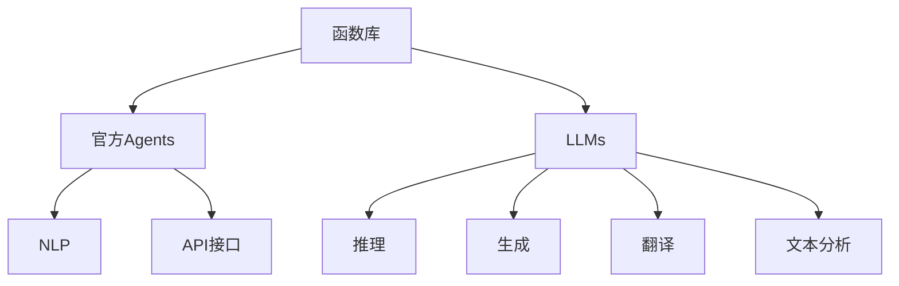
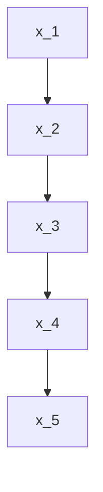

                 

# LLM函数库:官方Agents的重要性

> 关键词：函数库,官方Agents,语言模型,LLM,自然语言处理,NLP

## 1. 背景介绍

### 1.1 问题由来
近年来，人工智能在自然语言处理(Natural Language Processing, NLP)领域取得了显著进展，尤其是大规模语言模型(LLMs)的问世，极大地提升了语言理解和生成能力。为了更广泛地应用这些模型，LLMs的函数库成为了关键，而官方Agents在此领域中的作用尤为显著。

官方Agents是指由模型开发者或第三方机构发布的LLMs接口，它们允许开发者更方便地将LLMs集成到自己的应用中。这些函数库通常提供了一系列易于使用的API接口，使得开发者能够轻松地进行推理、生成、翻译等多种任务。

然而，尽管官方Agents为开发者提供了极大的便利，但在实际应用中，它们仍然存在一些局限性和挑战。本文旨在深入探讨官方Agents的重要性，以及如何克服其局限性，最大化其应用潜力。

### 1.2 问题核心关键点
官方Agents的核心优势在于其易用性和效率。它们集成了最新的语言模型，提供了高效的推理计算，并且支持多种编程语言和框架。但同时，它们也面临着易用性、性能、扩展性等方面的挑战，需要在实际应用中不断优化和改进。

## 2. 核心概念与联系

### 2.1 核心概念概述

为更好地理解官方Agents的重要性，本节将介绍几个关键概念：

- **函数库**：提供了一组预定义的函数和接口，用于实现特定功能或服务，通常作为软件组件或插件使用。

- **官方Agents**：由模型开发者或第三方机构发布的LLMs接口，包括推理、生成、翻译等多种功能，便于开发者集成和应用。

- **大规模语言模型(LLMs)**：通过在大规模无标签文本数据上进行自监督学习，获得强大语言表示能力的模型，如BERT、GPT等。

- **自然语言处理(NLP)**：涉及计算机和人类语言之间的交互，包括语言理解、生成、分析和推理等多种任务。

- **API接口**：应用程序编程接口，提供了一组定义好的函数和数据结构，使得不同软件组件可以相互通信。

这些概念之间的逻辑关系可以通过以下Mermaid流程图来展示：



这个流程图展示了几组关键概念之间的联系：

1. 函数库提供了基本的计算和处理功能，是官方Agents和LLMs的基础。
2. 官方Agents集成了多种LLMs功能，是开发者集成应用的主要接口。
3. NLP是官方Agents应用的主要领域，涉及多种任务。
4. LLMs作为官方Agents的核心组件，提供强大的语言理解和生成能力。

这些概念共同构成了官方Agents的基础框架，使得开发者能够高效地实现各种NLP应用。

## 3. 核心算法原理 & 具体操作步骤

### 3.1 算法原理概述

官方Agents的核心算法原理基于函数式编程和接口设计。开发者只需通过API接口调用官方Agents，即可方便地获取LLMs的功能和数据。官方Agents的算法通常包括以下几个关键步骤：

1. **数据预处理**：将输入文本进行分词、编码等预处理，转化为模型所需的格式。
2. **模型推理**：将预处理后的数据输入模型，进行推理计算。
3. **后处理**：将模型输出进行解码、格式化等后处理，返回给用户。

这一过程通常通过函数库实现，开发者只需调用函数库中预定义的函数即可。

### 3.2 算法步骤详解

以下以官方Agents的生成任务为例，详细讲解其算法步骤：

**Step 1: 数据预处理**
- 将输入文本进行分词、编码，转化为模型所需的格式。

**Step 2: 模型推理**
- 将预处理后的数据输入模型，进行推理计算。

**Step 3: 后处理**
- 将模型输出进行解码、格式化，返回给用户。

### 3.3 算法优缺点

官方Agents的优点包括：

1. 简单易用：开发者只需通过API接口调用函数，即可方便地实现推理、生成、翻译等任务。
2. 效率高：官方Agents通常基于高性能计算库，能够快速处理大量数据。
3. 功能全面：官方Agents集成了多种LLMs功能，能够满足各种NLP任务需求。

同时，官方Agents也存在以下缺点：

1. 灵活性差：官方Agents的接口和函数设计相对固定，缺乏自定义功能。
2. 扩展性差：官方Agents通常不支持动态扩展，难以应对复杂应用场景。
3. 维护成本高：官方Agents的更新和维护需要大量时间和资源，开发者需要不断跟进。

### 3.4 算法应用领域

官方Agents广泛应用于各种NLP任务，包括但不限于：

- 文本生成：如对话生成、文章生成、摘要生成等。
- 文本翻译：如中英文翻译、多语种翻译等。
- 文本分类：如情感分析、主题分类、实体识别等。
- 文本摘要：如自动摘要、文本精简等。
- 文本推理：如逻辑推理、问答系统等。

这些任务在各行各业都有广泛应用，如智能客服、机器翻译、智能搜索、智能写作等。

## 4. 数学模型和公式 & 详细讲解 & 举例说明

### 4.1 数学模型构建

官方Agents的数学模型通常基于概率图模型，用于描述模型中各变量之间的依赖关系。以生成任务为例，模型的概率图可以表示为：

$$P(x_i | \theta) = \prod_{i=1}^N P(x_i | x_{i-1}, \theta)$$

其中，$x_i$ 表示生成的第 $i$ 个单词，$\theta$ 表示模型的参数。

### 4.2 公式推导过程

对于生成任务，模型推理的公式可以表示为：

$$\log P(x_i | x_{i-1}, \theta) = \log \sum_{x'_i} P(x'_i | x_{i-1}, \theta) \cdot P(x_i | x'_i, \theta)$$

其中，$x'_i$ 表示可能的下一个单词，$P(x_i | x'_i, \theta)$ 表示给定上下文和模型参数的生成概率。

### 4.3 案例分析与讲解

以生成任务为例，假设我们有一个简单的语言模型，其概率图如下：



给定初始单词 $x_1$，模型可以生成整个文本序列 $x_1, x_2, x_3, x_4, x_5$。

## 5. 项目实践：代码实例和详细解释说明

### 5.1 开发环境搭建

在进行官方Agents的实践前，我们需要准备好开发环境。以下是使用Python进行PyTorch开发的环境配置流程：

1. 安装Anaconda：从官网下载并安装Anaconda，用于创建独立的Python环境。

2. 创建并激活虚拟环境：
```bash
conda create -n pytorch-env python=3.8 
conda activate pytorch-env
```

3. 安装PyTorch：根据CUDA版本，从官网获取对应的安装命令。例如：
```bash
conda install pytorch torchvision torchaudio cudatoolkit=11.1 -c pytorch -c conda-forge
```

4. 安装Transformers库：
```bash
pip install transformers
```

5. 安装各类工具包：
```bash
pip install numpy pandas scikit-learn matplotlib tqdm jupyter notebook ipython
```

完成上述步骤后，即可在`pytorch-env`环境中开始官方Agents的实践。

### 5.2 源代码详细实现

这里我们以BERT模型为例，给出使用Transformers库进行文本分类的代码实现。

首先，定义数据处理函数：

```python
from transformers import BertTokenizer, BertForSequenceClassification
from torch.utils.data import Dataset, DataLoader
import torch
import numpy as np

class TextDataset(Dataset):
    def __init__(self, texts, labels, tokenizer):
        self.texts = texts
        self.labels = labels
        self.tokenizer = tokenizer
        self.max_len = 128

    def __len__(self):
        return len(self.texts)

    def __getitem__(self, item):
        text = self.texts[item]
        label = self.labels[item]
        encoding = self.tokenizer(text, truncation=True, max_length=self.max_len, return_tensors='pt')
        input_ids = encoding['input_ids'].flatten()
        attention_mask = encoding['attention_mask'].flatten()
        label = torch.tensor(label, dtype=torch.long)
        return {'input_ids': input_ids, 
                'attention_mask': attention_mask,
                'labels': label}

# 加载BERT模型和预训练的BertTokenizer
tokenizer = BertTokenizer.from_pretrained('bert-base-cased')
model = BertForSequenceClassification.from_pretrained('bert-base-cased', num_labels=2)

# 创建数据集
dataset = TextDataset(texts, labels, tokenizer)

# 设置数据加载器
data_loader = DataLoader(dataset, batch_size=16, shuffle=True)

# 定义优化器和损失函数
optimizer = torch.optim.Adam(model.parameters(), lr=2e-5)
criterion = torch.nn.CrossEntropyLoss()

# 训练模型
model.train()
for batch in data_loader:
    input_ids = batch['input_ids'].to(device)
    attention_mask = batch['attention_mask'].to(device)
    labels = batch['labels'].to(device)
    outputs = model(input_ids, attention_mask=attention_mask)
    loss = criterion(outputs.logits, labels)
    loss.backward()
    optimizer.step()

# 评估模型
model.eval()
with torch.no_grad():
    test_loss, test_acc = 0, 0
    for batch in test_loader:
        input_ids = batch['input_ids'].to(device)
        attention_mask = batch['attention_mask'].to(device)
        labels = batch['labels'].to(device)
        outputs = model(input_ids, attention_mask=attention_mask)
        loss = criterion(outputs.logits, labels)
        test_loss += loss.item()
        test_acc += (outputs.logits.argmax(dim=1) == labels).sum().item()
    print(f'Test Loss: {test_loss / len(test_loader)}, Test Acc: {test_acc / len(test_loader)}')
```

在上述代码中，我们通过BERT模型的官方Agents进行文本分类任务。首先定义了数据处理函数，对文本进行分词、编码和padding等处理，生成模型所需的输入数据。然后加载BERT模型和预训练的BertTokenizer，并设置训练和评估的优化器、损失函数和数据加载器。最后进行模型训练和评估，输出测试结果。

### 5.3 代码解读与分析

让我们再详细解读一下关键代码的实现细节：

**TextDataset类**：
- `__init__`方法：初始化文本、标签、分词器等关键组件，并定义最大输入长度。
- `__len__`方法：返回数据集的样本数量。
- `__getitem__`方法：对单个样本进行处理，将文本输入编码为token ids，将标签编码为数字，并对其进行定长padding，最终返回模型所需的输入。

**数据加载器**：
- `DataLoader`类：用于对数据集进行批次化加载，供模型训练和推理使用。

**优化器和损失函数**：
- `Adam`优化器：基于梯度下降的优化算法，更新模型参数。
- `CrossEntropyLoss`损失函数：用于衡量模型预测和真实标签之间的差异。

**模型训练和评估**：
- 使用`model.train()`和`model.eval()`方法分别进行训练和评估。
- 在训练阶段，对每个批次数据进行前向传播和反向传播，更新模型参数。
- 在评估阶段，仅进行前向传播，计算损失和准确率，输出测试结果。

## 6. 实际应用场景

### 6.1 智能客服系统

基于官方Agents的对话技术，可以广泛应用于智能客服系统的构建。传统客服往往需要配备大量人力，高峰期响应缓慢，且一致性和专业性难以保证。而使用官方Agents构建的智能客服系统，可以7x24小时不间断服务，快速响应客户咨询，用自然流畅的语言解答各类常见问题。

在技术实现上，可以收集企业内部的历史客服对话记录，将问题和最佳答复构建成监督数据，在此基础上对官方Agents进行微调。微调后的对话模型能够自动理解用户意图，匹配最合适的答案模板进行回复。对于客户提出的新问题，还可以接入检索系统实时搜索相关内容，动态组织生成回答。如此构建的智能客服系统，能大幅提升客户咨询体验和问题解决效率。

### 6.2 金融舆情监测

金融机构需要实时监测市场舆论动向，以便及时应对负面信息传播，规避金融风险。传统的人工监测方式成本高、效率低，难以应对网络时代海量信息爆发的挑战。基于官方Agents的文本分类和情感分析技术，为金融舆情监测提供了新的解决方案。

具体而言，可以收集金融领域相关的新闻、报道、评论等文本数据，并对其进行主题标注和情感标注。在此基础上对官方Agents进行微调，使其能够自动判断文本属于何种主题，情感倾向是正面、中性还是负面。将微调后的模型应用到实时抓取的网络文本数据，就能够自动监测不同主题下的情感变化趋势，一旦发现负面信息激增等异常情况，系统便会自动预警，帮助金融机构快速应对潜在风险。

### 6.3 个性化推荐系统

当前的推荐系统往往只依赖用户的历史行为数据进行物品推荐，无法深入理解用户的真实兴趣偏好。基于官方Agents的个性化推荐系统，可以更好地挖掘用户行为背后的语义信息，从而提供更精准、多样的推荐内容。

在实践中，可以收集用户浏览、点击、评论、分享等行为数据，提取和用户交互的物品标题、描述、标签等文本内容。将文本内容作为模型输入，用户的后续行为（如是否点击、购买等）作为监督信号，在此基础上对官方Agents进行微调。微调后的模型能够从文本内容中准确把握用户的兴趣点。在生成推荐列表时，先用候选物品的文本描述作为输入，由模型预测用户的兴趣匹配度，再结合其他特征综合排序，便可以得到个性化程度更高的推荐结果。

### 6.4 未来应用展望

随着官方Agents和微调方法的不断发展，基于官方Agents的微调方法将呈现以下几个发展趋势：

1. 模型规模持续增大。随着算力成本的下降和数据规模的扩张，官方Agents的模型参数量还将持续增长。超大规模语言模型蕴含的丰富语言知识，有望支撑更加复杂多变的下游任务微调。

2. 微调方法日趋多样。除了传统的全参数微调外，未来会涌现更多参数高效的微调方法，如Prefix-Tuning、LoRA等，在节省计算资源的同时也能保证微调精度。

3. 持续学习成为常态。随着数据分布的不断变化，微调模型也需要持续学习新知识以保持性能。如何在不遗忘原有知识的同时，高效吸收新样本信息，将成为重要的研究课题。

4. 标注样本需求降低。受启发于提示学习(Prompt-based Learning)的思路，未来的微调方法将更好地利用官方Agents的语言理解能力，通过更加巧妙的任务描述，在更少的标注样本上也能实现理想的微调效果。

5. 多模态微调崛起。当前的官方Agents大多聚焦于纯文本数据，未来会进一步拓展到图像、视频、语音等多模态数据微调。多模态信息的融合，将显著提升官方Agents对现实世界的理解和建模能力。

6. 模型通用性增强。经过海量数据的预训练和多领域任务的微调，未来的官方Agents将具备更强大的常识推理和跨领域迁移能力，逐步迈向通用人工智能(AGI)的目标。

以上趋势凸显了官方Agents微调技术的广阔前景。这些方向的探索发展，必将进一步提升官方Agents系统的性能和应用范围，为人工智能技术落地应用提供新的支持。

## 7. 工具和资源推荐

### 7.1 学习资源推荐

为了帮助开发者系统掌握官方Agents的理论基础和实践技巧，这里推荐一些优质的学习资源：

1. 《Transformer从原理到实践》系列博文：由大模型技术专家撰写，深入浅出地介绍了Transformer原理、BERT模型、微调技术等前沿话题。

2. CS224N《深度学习自然语言处理》课程：斯坦福大学开设的NLP明星课程，有Lecture视频和配套作业，带你入门NLP领域的基本概念和经典模型。

3. 《Natural Language Processing with Transformers》书籍：Transformers库的作者所著，全面介绍了如何使用Transformers库进行NLP任务开发，包括官方Agents在内的诸多范式。

4. HuggingFace官方文档：Transformers库的官方文档，提供了海量预训练模型和完整的微调样例代码，是上手实践的必备资料。

5. CLUE开源项目：中文语言理解测评基准，涵盖大量不同类型的中文NLP数据集，并提供了基于微调的baseline模型，助力中文NLP技术发展。

通过对这些资源的学习实践，相信你一定能够快速掌握官方Agents的精髓，并用于解决实际的NLP问题。

### 7.2 开发工具推荐

高效的开发离不开优秀的工具支持。以下是几款用于官方Agents开发的常用工具：

1. PyTorch：基于Python的开源深度学习框架，灵活动态的计算图，适合快速迭代研究。大部分官方Agents都有PyTorch版本的实现。

2. TensorFlow：由Google主导开发的开源深度学习框架，生产部署方便，适合大规模工程应用。同样有丰富的官方Agents资源。

3. Transformers库：HuggingFace开发的NLP工具库，集成了众多SOTA语言模型，支持PyTorch和TensorFlow，是进行官方Agents开发的利器。

4. Weights & Biases：模型训练的实验跟踪工具，可以记录和可视化模型训练过程中的各项指标，方便对比和调优。与主流深度学习框架无缝集成。

5. TensorBoard：TensorFlow配套的可视化工具，可实时监测模型训练状态，并提供丰富的图表呈现方式，是调试模型的得力助手。

6. Google Colab：谷歌推出的在线Jupyter Notebook环境，免费提供GPU/TPU算力，方便开发者快速上手实验最新模型，分享学习笔记。

合理利用这些工具，可以显著提升官方Agents开发的效率，加快创新迭代的步伐。

### 7.3 相关论文推荐

官方Agents和微调技术的发展源于学界的持续研究。以下是几篇奠基性的相关论文，推荐阅读：

1. Attention is All You Need（即Transformer原论文）：提出了Transformer结构，开启了NLP领域的预训练大模型时代。

2. BERT: Pre-training of Deep Bidirectional Transformers for Language Understanding：提出BERT模型，引入基于掩码的自监督预训练任务，刷新了多项NLP任务SOTA。

3. Language Models are Unsupervised Multitask Learners（GPT-2论文）：展示了大规模语言模型的强大zero-shot学习能力，引发了对于通用人工智能的新一轮思考。

4. Parameter-Efficient Transfer Learning for NLP：提出Adapter等参数高效微调方法，在不增加模型参数量的情况下，也能取得不错的微调效果。

5. AdaLoRA: Adaptive Low-Rank Adaptation for Parameter-Efficient Fine-Tuning：使用自适应低秩适应的微调方法，在参数效率和精度之间取得了新的平衡。

这些论文代表了大语言模型官方Agents微调技术的发展脉络。通过学习这些前沿成果，可以帮助研究者把握学科前进方向，激发更多的创新灵感。

## 8. 总结：未来发展趋势与挑战

### 8.1 总结

本文对官方Agents的微调方法进行了全面系统的介绍。首先阐述了官方Agents的重要性，以及它们在实际应用中面临的挑战。其次，从原理到实践，详细讲解了官方Agents的数学模型和关键算法，给出了微调任务开发的完整代码实例。同时，本文还广泛探讨了官方Agents在智能客服、金融舆情、个性化推荐等多个行业领域的应用前景，展示了官方Agents范式的巨大潜力。

通过本文的系统梳理，可以看到，官方Agents作为LLMs的核心组件，为开发者提供了高效、便捷的接口，极大提升了NLP应用开发的效率。尽管存在一些局限性和挑战，但官方Agents的易用性和性能优势仍使其在NLP领域中占据重要地位。未来，伴随官方Agents的不断优化和改进，它们必将在更多领域大放异彩，为人工智能技术落地应用提供更强支撑。

### 8.2 未来发展趋势

展望未来，官方Agents的微调技术将呈现以下几个发展趋势：

1. 模型规模持续增大。随着算力成本的下降和数据规模的扩张，官方Agents的模型参数量还将持续增长。超大规模语言模型蕴含的丰富语言知识，有望支撑更加复杂多变的下游任务微调。

2. 微调方法日趋多样。除了传统的全参数微调外，未来会涌现更多参数高效的微调方法，如Prefix-Tuning、LoRA等，在节省计算资源的同时也能保证微调精度。

3. 持续学习成为常态。随着数据分布的不断变化，微调模型也需要持续学习新知识以保持性能。如何在不遗忘原有知识的同时，高效吸收新样本信息，将成为重要的研究课题。

4. 标注样本需求降低。受启发于提示学习(Prompt-based Learning)的思路，未来的微调方法将更好地利用官方Agents的语言理解能力，通过更加巧妙的任务描述，在更少的标注样本上也能实现理想的微调效果。

5. 多模态微调崛起。当前的官方Agents大多聚焦于纯文本数据，未来会进一步拓展到图像、视频、语音等多模态数据微调。多模态信息的融合，将显著提升官方Agents对现实世界的理解和建模能力。

6. 模型通用性增强。经过海量数据的预训练和多领域任务的微调，未来的官方Agents将具备更强大的常识推理和跨领域迁移能力，逐步迈向通用人工智能(AGI)的目标。

以上趋势凸显了官方Agents微调技术的广阔前景。这些方向的探索发展，必将进一步提升官方Agents系统的性能和应用范围，为人工智能技术落地应用提供新的支持。

### 8.3 面临的挑战

尽管官方Agents已经取得了瞩目成就，但在迈向更加智能化、普适化应用的过程中，它仍面临着诸多挑战：

1. 标注成本瓶颈。尽管官方Agents大大降低了标注数据的需求，但对于长尾应用场景，难以获得充足的高质量标注数据，成为制约微调性能的瓶颈。如何进一步降低微调对标注样本的依赖，将是一大难题。

2. 模型鲁棒性不足。当前官方Agents面对域外数据时，泛化性能往往大打折扣。对于测试样本的微小扰动，官方Agents的预测也容易发生波动。如何提高官方Agents的鲁棒性，避免灾难性遗忘，还需要更多理论和实践的积累。

3. 推理效率有待提高。大规模语言模型虽然精度高，但在实际部署时往往面临推理速度慢、内存占用大等效率问题。如何在保证性能的同时，简化模型结构，提升推理速度，优化资源占用，将是重要的优化方向。

4. 可解释性亟需加强。当前官方Agents更像是"黑盒"系统，难以解释其内部工作机制和决策逻辑。对于医疗、金融等高风险应用，算法的可解释性和可审计性尤为重要。如何赋予官方Agents更强的可解释性，将是亟待攻克的难题。

5. 安全性有待保障。预训练语言模型难免会学习到有偏见、有害的信息，通过官方Agents传递到下游任务，产生误导性、歧视性的输出，给实际应用带来安全隐患。如何从数据和算法层面消除模型偏见，避免恶意用途，确保输出的安全性，也将是重要的研究课题。

6. 知识整合能力不足。现有的官方Agents往往局限于任务内数据，难以灵活吸收和运用更广泛的先验知识。如何让官方Agents过程更好地与外部知识库、规则库等专家知识结合，形成更加全面、准确的信息整合能力，还有很大的想象空间。

正视官方Agents面临的这些挑战，积极应对并寻求突破，将是官方Agents走向成熟的必由之路。相信随着学界和产业界的共同努力，这些挑战终将一一被克服，官方Agents必将在构建人机协同的智能时代中扮演越来越重要的角色。

### 8.4 未来突破

面对官方Agents面临的种种挑战，未来的研究需要在以下几个方面寻求新的突破：

1. 探索无监督和半监督微调方法。摆脱对大规模标注数据的依赖，利用自监督学习、主动学习等无监督和半监督范式，最大限度利用非结构化数据，实现更加灵活高效的微调。

2. 研究参数高效和计算高效的微调范式。开发更加参数高效的微调方法，在固定大部分预训练参数的同时，只更新极少量的任务相关参数。同时优化官方Agents的计算图，减少前向传播和反向传播的资源消耗，实现更加轻量级、实时性的部署。

3. 融合因果和对比学习范式。通过引入因果推断和对比学习思想，增强官方Agents建立稳定因果关系的能力，学习更加普适、鲁棒的语言表征，从而提升模型泛化性和抗干扰能力。

4. 引入更多先验知识。将符号化的先验知识，如知识图谱、逻辑规则等，与神经网络模型进行巧妙融合，引导官方Agents学习更准确、合理的语言模型。同时加强不同模态数据的整合，实现视觉、语音等多模态信息与文本信息的协同建模。

5. 结合因果分析和博弈论工具。将因果分析方法引入官方Agents模型，识别出模型决策的关键特征，增强输出解释的因果性和逻辑性。借助博弈论工具刻画人机交互过程，主动探索并规避模型的脆弱点，提高系统稳定性。

6. 纳入伦理道德约束。在模型训练目标中引入伦理导向的评估指标，过滤和惩罚有偏见、有害的输出倾向。同时加强人工干预和审核，建立模型行为的监管机制，确保输出符合人类价值观和伦理道德。

这些研究方向的探索，必将引领官方Agents微调技术迈向更高的台阶，为构建安全、可靠、可解释、可控的智能系统铺平道路。面向未来，官方Agents技术还需要与其他人工智能技术进行更深入的融合，如知识表示、因果推理、强化学习等，多路径协同发力，共同推动自然语言理解和智能交互系统的进步。只有勇于创新、敢于突破，才能不断拓展官方Agents的边界，让智能技术更好地造福人类社会。

## 9. 附录：常见问题与解答

**Q1：官方Agents是否适用于所有NLP任务？**

A: 官方Agents在大多数NLP任务上都能取得不错的效果，特别是对于数据量较小的任务。但对于一些特定领域的任务，如医学、法律等，仅仅依靠通用语料预训练的官方Agents可能难以很好地适应。此时需要在特定领域语料上进一步预训练，再进行微调，才能获得理想效果。此外，对于一些需要时效性、个性化很强的任务，如对话、推荐等，官方Agents方法也需要针对性的改进优化。

**Q2：微调过程中如何选择合适的学习率？**

A: 微调的学习率一般要比预训练时小1-2个数量级，如果使用过大的学习率，容易破坏预训练权重，导致过拟合。一般建议从1e-5开始调参，逐步减小学习率，直至收敛。也可以使用warmup策略，在开始阶段使用较小的学习率，再逐渐过渡到预设值。需要注意的是，不同的优化器(如AdamW、Adafactor等)以及不同的学习率调度策略，可能需要设置不同的学习率阈值。

**Q3：采用官方Agents时会面临哪些资源瓶颈？**

A: 目前主流的预训练大模型动辄以亿计的参数规模，对算力、内存、存储都提出了很高的要求。GPU/TPU等高性能设备是必不可少的，但即便如此，超大批次的训练和推理也可能遇到显存不足的问题。因此需要采用一些资源优化技术，如梯度积累、混合精度训练、模型并行等，来突破硬件瓶颈。同时，模型的存储和读取也可能占用大量时间和空间，需要采用模型压缩、稀疏化存储等方法进行优化。

**Q4：如何缓解微调过程中的过拟合问题？**

A: 过拟合是微调面临的主要挑战，尤其是在标注数据不足的情况下。常见的缓解策略包括：
1. 数据增强：通过回译、近义替换等方式扩充训练集
2. 正则化：使用L2正则、Dropout、Early Stopping等避免过拟合
3. 对抗训练：引入对抗样本，提高模型鲁棒性
4. 参数高效微调：只调整少量参数(如Adapter、Prefix等)，减小过拟合风险
5. 多模型集成：训练多个微调模型，取平均输出，抑制过拟合

这些策略往往需要根据具体任务和数据特点进行灵活组合。只有在数据、模型、训练、推理等各环节进行全面优化，才能最大限度地发挥官方Agents的潜力。

**Q5：微调模型在落地部署时需要注意哪些问题？**

A: 将微调模型转化为实际应用，还需要考虑以下因素：
1. 模型裁剪：去除不必要的层和参数，减小模型尺寸，加快推理速度
2. 量化加速：将浮点模型转为定点模型，压缩存储空间，提高计算效率
3. 服务化封装：将模型封装为标准化服务接口，便于集成调用
4. 弹性伸缩：根据请求流量动态调整资源配置，平衡服务质量和成本
5. 监控告警：实时采集系统指标，设置异常告警阈值，确保服务稳定性
6. 安全防护：采用访问鉴权、数据脱敏等措施，保障数据和模型安全

官方Agents微调为NLP应用开启了广阔的想象空间，但如何将强大的性能转化为稳定、高效、安全的业务价值，还需要工程实践的不断打磨。唯有从数据、算法、工程、业务等多个维度协同发力，才能真正实现人工智能技术在垂直行业的规模化落地。总之，官方Agents需要开发者根据具体任务，不断迭代和优化模型、数据和算法，方能得到理想的效果。

---

作者：禅与计算机程序设计艺术 / Zen and the Art of Computer Programming

