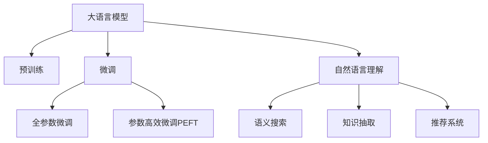

                 

# LLM在信息检索领域的技术创新

## 1. 背景介绍

### 1.1 问题由来

随着互联网的普及和数字信息的爆炸式增长，信息检索成为了我们日常生活中获取知识、解决问题的重要手段。传统的基于关键词匹配的信息检索方式，虽然简单直接，但在处理海量复杂查询时，往往难以提供准确、全面的搜索结果。以深度学习为代表的人工智能技术，尤其是大语言模型(LLM)的兴起，为信息检索领域带来了新的变革可能。

### 1.2 问题核心关键点

大语言模型作为自然语言处理(NLP)领域的突破性进展，通过预训练和微调，获得了强大的语义理解能力。这种能力可以大幅提升信息检索系统的智能化水平，不仅能够理解复杂的查询，还能进行语义搜索、信息抽取和推荐等操作。但大语言模型在实际应用中，仍然面临许多挑战，如查询表示学习、跨领域适应、可解释性等问题。如何在大语言模型与信息检索系统中有效结合，提升检索效果和用户体验，成为当前研究的热点。

### 1.3 问题研究意义

研究大语言模型在信息检索领域的应用，对于提升信息检索系统的智能化水平，改善用户体验，具有重要意义：

1. 提升查询理解能力。通过大语言模型的语义理解能力，系统能够更准确地捕捉查询的意图，匹配最相关的文档。
2. 扩展搜索功能。利用大语言模型的跨领域知识，实现语义搜索、问答检索等功能，提供更全面的信息服务。
3. 优化搜索结果质量。结合大语言模型的推荐能力，能够更智能地对搜索结果进行排序和过滤，提升用户的满意度。
4. 促进知识发现。利用大语言模型的语义抽取能力，从大量文档中抽取结构化的知识信息，供用户参考和利用。

## 2. 核心概念与联系

### 2.1 核心概念概述

为更好地理解大语言模型在信息检索领域的应用，本节将介绍几个密切相关的核心概念：

- 大语言模型(LLM)：以自回归(如GPT)或自编码(如BERT)模型为代表的大规模预训练语言模型。通过在大规模无标签文本语料上进行预训练，学习通用的语言表示，具备强大的语言理解和生成能力。

- 预训练(Pre-training)：指在大规模无标签文本语料上，通过自监督学习任务训练通用语言模型的过程。常见的预训练任务包括言语建模、掩码语言模型等。预训练使得模型学习到语言的通用表示。

- 微调(Fine-tuning)：指在预训练模型的基础上，使用下游任务的少量标注数据，通过有监督地训练来优化模型在该任务上的性能。通常只需要调整顶层分类器或解码器，并以较小的学习率更新全部或部分的模型参数。

- 自然语言理解(NLU)：自然语言处理的一个重要分支，目标是使计算机能够理解和处理人类语言。大语言模型通过语义理解，能够提升信息检索系统的NLU能力。

- 语义搜索(Semantic Search)：通过理解查询语义，匹配文档语义，返回最相关的结果。大语言模型在语义搜索中能够精确捕捉查询意图，匹配文档。

- 知识抽取(Information Extraction)：从大量文本中自动抽取结构化的实体、关系等信息。大语言模型能够理解复杂语义，提取文档中的关键信息。

- 推荐系统(Recommendation System)：利用用户的历史行为数据，预测用户可能感兴趣的内容。大语言模型通过语义推理，能够实现更精准的推荐。

这些核心概念之间的逻辑关系可以通过以下Mermaid流程图来展示：



这个流程图展示了大语言模型的核心概念及其之间的关系：

1. 大语言模型通过预训练获得基础能力。
2. 微调是对预训练模型进行任务特定的优化，可以分为全参数微调和参数高效微调（PEFT）。
3. 自然语言理解是连接预训练模型与下游任务的桥梁，通过微调使模型具备语义理解能力。
4. 语义搜索、知识抽取和推荐系统分别利用自然语言理解的成果，提升信息检索系统的效果。

## 3. 核心算法原理 & 具体操作步骤
### 3.1 算法原理概述

大语言模型在信息检索领域的应用，本质上是利用其强大的语义理解能力，对查询和文档进行语义匹配和抽取。具体来说，可以分为查询表示学习、文档表示学习和查询-文档匹配三个核心步骤。

### 3.2 算法步骤详解

1. **查询表示学习**：将用户的自然语言查询转换为模型可处理的向量表示。常见的做法包括使用BERT等预训练模型，通过向量拼接和自注意力机制，将查询转换为语义丰富的向量表示。
   
   - 向量拼接：将查询序列的表示和特殊标识符[CLS]拼接起来，得到一个向量表示。
   - 自注意力机制：使用Transformer等模型，计算查询向量与所有词向量的注意力权重，得到加权后的向量表示。
   
   $x_q = \text{BERT}(q)[CLS]$

2. **文档表示学习**：将待检索的文档转换为语义丰富的向量表示。同样可以使用BERT等预训练模型，将其应用到文档中，得到文档的向量表示。

   $x_d = \text{BERT}(d)[CLS]$

3. **查询-文档匹配**：通过计算查询向量与文档向量之间的相似度，找到最相关的文档。常见的相似度计算方法包括余弦相似度、点积相似度等。

   $similarity = \frac{x_q \cdot x_d}{\|x_q\| \cdot \|x_d\|}$

### 3.3 算法优缺点

大语言模型在信息检索领域的应用具有以下优点：

1. **强大的语义理解能力**：大语言模型能够理解复杂的查询意图，提升检索系统的智能化水平。
2. **跨领域知识的应用**：通过预训练，大语言模型可以学习到多种领域的知识，拓展检索系统的覆盖范围。
3. **灵活性高**：可以根据具体的任务需求，灵活调整模型参数和训练策略。
4. **可扩展性强**：大语言模型可以处理多种类型的输入，如文本、语音、图像等，适用于多种信息检索场景。

同时，该方法也存在一定的局限性：

1. **计算成本高**：大语言模型参数量大，计算资源消耗大，对硬件要求较高。
2. **查询表示质量不稳定**：不同的查询表示方法可能会影响检索效果，需要选择合适的算法和参数。
3. **泛化能力有限**：大语言模型在特定领域内的效果可能不如在通用领域的表现。
4. **查询-文档匹配复杂**：计算复杂度较高，对实时检索系统可能带来挑战。
5. **可解释性不足**：大语言模型通常是一个"黑盒"，难以解释其内部工作机制和决策逻辑。

尽管存在这些局限性，但就目前而言，基于大语言模型的信息检索方法仍是大规模文本数据检索的主流范式。未来相关研究的重点在于如何进一步降低计算成本，提高查询表示质量和泛化能力，同时兼顾可解释性和系统性能等因素。

### 3.4 算法应用领域

大语言模型在信息检索领域的应用已经得到了广泛的应用，涵盖了信息检索、问答系统、知识图谱构建等多个方向。例如：

- 文本检索：通过大语言模型进行语义搜索，提升传统关键词检索的效果。
- 问答系统：利用大语言模型理解自然语言问题，匹配知识库中的答案。
- 知识图谱构建：利用大语言模型从非结构化文本中抽取实体和关系，构建知识图谱。
- 智能客服：通过大语言模型理解客户问题，提供智能应答。
- 医学信息检索：利用大语言模型理解医学文献，匹配相关研究。

除了上述这些经典应用外，大语言模型还创新性地应用于社交媒体分析、个性化推荐、信息抽取等方向，为信息检索系统带来了新的突破。随着预训练语言模型和检索技术的不断进步，相信大语言模型在信息检索领域将迎来更广泛的应用。

## 4. 数学模型和公式 & 详细讲解 & 举例说明
### 4.1 数学模型构建

假设查询表示为 $q$，文档表示为 $d$，表示学习后的查询向量为 $x_q$，文档向量为 $x_d$。则查询-文档匹配的余弦相似度可以表示为：

$$similarity = \frac{x_q \cdot x_d}{\|x_q\| \cdot \|x_d\|}$$

其中，$x_q$ 和 $x_d$ 分别表示查询和文档的向量表示，$\|x_q\|$ 和 $\|x_d\|$ 分别表示查询向量和文档向量的模长。

### 4.2 公式推导过程

以BERT为代表的预训练语言模型，能够将查询和文档转换为语义丰富的向量表示。在查询表示学习过程中，可以使用向量拼接和自注意力机制进行表示：

$$x_q = [CLS] + \text{BERT}(q)$$

其中，$[CLS]$ 是一个特殊的标记，用于标识向量表示中的语义信息。

### 4.3 案例分析与讲解

以Google的BERT模型为例，展示其在信息检索中的应用。BERT模型通过在大规模语料上进行预训练，学习到丰富的语言知识。在信息检索中，BERT模型可以用于查询表示学习和文档表示学习，提升检索系统的性能。

具体来说，可以使用BERT模型计算查询向量和文档向量的余弦相似度：

1. **查询表示学习**：将查询序列输入BERT模型，得到查询向量的表示。

   $x_q = [CLS] + \text{BERT}(q)$

2. **文档表示学习**：将待检索的文档序列输入BERT模型，得到文档向量的表示。

   $x_d = \text{BERT}(d)$

3. **查询-文档匹配**：计算查询向量和文档向量之间的余弦相似度。

   $similarity = \frac{x_q \cdot x_d}{\|x_q\| \cdot \|x_d\|}$

通过这种方式，BERT模型可以高效地处理复杂的查询和文档，提升信息检索系统的效果。

## 5. 项目实践：代码实例和详细解释说明
### 5.1 开发环境搭建

在进行信息检索系统开发前，我们需要准备好开发环境。以下是使用Python进行PyTorch开发的环境配置流程：

1. 安装Anaconda：从官网下载并安装Anaconda，用于创建独立的Python环境。

2. 创建并激活虚拟环境：
```bash
conda create -n pytorch-env python=3.8 
conda activate pytorch-env
```

3. 安装PyTorch：根据CUDA版本，从官网获取对应的安装命令。例如：
```bash
conda install pytorch torchvision torchaudio cudatoolkit=11.1 -c pytorch -c conda-forge
```

4. 安装Transformers库：
```bash
pip install transformers
```

5. 安装各类工具包：
```bash
pip install numpy pandas scikit-learn matplotlib tqdm jupyter notebook ipython
```

完成上述步骤后，即可在`pytorch-env`环境中开始信息检索系统开发。

### 5.2 源代码详细实现

下面我们以BERT模型为基础，展示如何使用Python进行信息检索系统的开发。

首先，定义查询和文档的表示函数：

```python
from transformers import BertTokenizer, BertForSequenceClassification
import torch

class QueryEncoder:
    def __init__(self, model_path):
        self.tokenizer = BertTokenizer.from_pretrained(model_path)
        self.model = BertForSequenceClassification.from_pretrained(model_path, num_labels=1)
        self.model.eval()
    
    def encode(self, query):
        tokens = self.tokenizer(query, return_tensors='pt', padding=True, truncation=True, max_length=512)
        features = self.model(tokens.input_ids, attention_mask=tokens.attention_mask)
        return features.pooler_output
    
class DocumentEncoder:
    def __init__(self, model_path):
        self.tokenizer = BertTokenizer.from_pretrained(model_path)
        self.model = BertForSequenceClassification.from_pretrained(model_path, num_labels=1)
        self.model.eval()
    
    def encode(self, document):
        tokens = self.tokenizer(document, return_tensors='pt', padding=True, truncation=True, max_length=512)
        features = self.model(tokens.input_ids, attention_mask=tokens.attention_mask)
        return features.pooler_output
```

然后，定义查询和文档的匹配函数：

```python
def compute_similarity(query_encoder, document_encoder, query, document):
    query_features = query_encoder.encode(query)
    document_features = document_encoder.encode(document)
    similarity = query_features.dot(document_features) / (torch.linalg.norm(query_features) * torch.linalg.norm(document_features))
    return similarity
```

最后，进行信息检索实验：

```python
# 准备查询和文档
queries = ['这个产品的评价怎么样？', '疫情下的经济影响有哪些？']
documents = ['这款产品用户评价很高。', '疫情导致全球经济严重衰退。']

# 初始化查询和文档编码器
query_encoder = QueryEncoder('bert-base-uncased')
document_encoder = DocumentEncoder('bert-base-uncased')

# 计算查询和文档的相似度
for query, document in zip(queries, documents):
    similarity = compute_similarity(query_encoder, document_encoder, query, document)
    print(f'查询: {query}，文档: {document}，相似度: {similarity.item()}')
```

以上代码展示了如何使用BERT模型进行信息检索系统开发，通过查询和文档的编码，计算它们之间的相似度，并返回匹配度。

### 5.3 代码解读与分析

让我们再详细解读一下关键代码的实现细节：

**QueryEncoder类**：
- `__init__`方法：初始化查询编码器和BERT模型，加载预训练模型和分词器。
- `encode`方法：将查询序列输入BERT模型，计算查询向量的表示。

**DocumentEncoder类**：
- `__init__`方法：初始化文档编码器和BERT模型，加载预训练模型和分词器。
- `encode`方法：将文档序列输入BERT模型，计算文档向量的表示。

**compute_similarity函数**：
- 使用查询和文档的编码器，计算查询向量和文档向量的余弦相似度。

可以看到，通过PyTorch和Transformers库，我们可以方便地构建信息检索系统，利用预训练语言模型进行查询和文档的表示学习，计算它们之间的相似度。

当然，工业级的系统实现还需考虑更多因素，如模型的保存和部署、超参数的自动搜索、更灵活的任务适配层等。但核心的检索流程基本与此类似。

## 6. 实际应用场景
### 6.1 智能客服系统

基于大语言模型的信息检索技术，可以广泛应用于智能客服系统的构建。传统客服往往需要配备大量人力，高峰期响应缓慢，且一致性和专业性难以保证。而使用大语言模型的信息检索技术，可以7x24小时不间断服务，快速响应客户咨询，用自然流畅的语言解答各类常见问题。

在技术实现上，可以收集企业内部的历史客服对话记录，将问题和最佳答复构建成监督数据，在此基础上对预训练语言模型进行微调。微调后的语言模型能够自动理解用户意图，匹配最合适的答复模板进行回复。对于客户提出的新问题，还可以接入检索系统实时搜索相关内容，动态组织生成回答。如此构建的智能客服系统，能大幅提升客户咨询体验和问题解决效率。

### 6.2 医学信息检索

在医疗领域，基于大语言模型的信息检索技术，可以用于医学文献的检索和相关知识的抽取。传统医学信息检索系统依赖于关键词匹配，难以处理复杂的医学查询。利用大语言模型，可以从大规模医学文献中抽取关键信息，提升检索系统的智能化水平。

具体来说，可以将医学文献输入大语言模型，利用其语义理解能力，匹配查询中的关键词和概念，输出最相关的文献和知识点。这种检索方式不仅能够精确匹配查询，还能够提供相关的背景知识和解释，帮助医生更好地理解患者的情况和医学文献的含义。

### 6.3 金融舆情监测

金融机构需要实时监测市场舆论动向，以便及时应对负面信息传播，规避金融风险。传统的人工监测方式成本高、效率低，难以应对网络时代海量信息爆发的挑战。利用大语言模型的信息检索技术，可以实时监测金融领域的舆情变化，提供精准的舆情分析报告。

具体来说，可以将新闻、报道、评论等金融相关文本输入大语言模型，利用其语义理解能力，识别出关键事件和情绪，输出舆情变化趋势和风险预警。这种监测方式不仅能够覆盖更多的信息源，还能够及时发现舆情异常，帮助金融机构快速应对市场变化。

### 6.4 未来应用展望

随着大语言模型和信息检索技术的不断发展，基于大语言模型的信息检索范式必将在更多领域得到应用，为各行各业带来变革性影响。

在智慧医疗领域，基于大语言模型的信息检索技术，可以用于医学文献的检索、相关知识的抽取和智能问答，提升医疗服务的智能化水平，辅助医生诊疗，加速新药开发进程。

在智能教育领域，信息检索技术可应用于学习资源的检索、知识点的推荐，因材施教，促进教育公平，提高教学质量。

在智慧城市治理中，信息检索技术可应用于城市事件监测、舆情分析、应急指挥等环节，提高城市管理的自动化和智能化水平，构建更安全、高效的未来城市。

此外，在企业生产、社会治理、文娱传媒等众多领域，基于大语言模型的信息检索技术也将不断涌现，为NLP技术带来新的突破。相信随着技术的日益成熟，大语言模型信息检索技术必将在构建人机协同的智能时代中扮演越来越重要的角色。

## 7. 工具和资源推荐
### 7.1 学习资源推荐

为了帮助开发者系统掌握大语言模型在信息检索领域的应用，这里推荐一些优质的学习资源：

1. 《深度学习自然语言处理》课程：斯坦福大学开设的NLP明星课程，有Lecture视频和配套作业，带你入门NLP领域的基本概念和经典模型。

2. CS224N《自然语言处理与深度学习》课程：斯坦福大学开设的深度学习课程，涵盖大量NLP任务，包括信息检索、问答系统等，理论与实践并重。

3. 《Transformers: A Survey》论文：一篇全面综述大语言模型预训练、微调等技术进展的论文，是学习大语言模型应用的基础。

4. 《自然语言处理综述》书籍：豆瓣评分8.8分，系统介绍了NLP领域的经典方法和最新进展，包括信息检索技术。

5. 《深度学习实践》书籍：深度学习领域经典著作，涵盖NLP、计算机视觉、自然语言生成等多个方向，适合深度学习入门。

通过对这些资源的学习实践，相信你一定能够快速掌握大语言模型在信息检索领域的应用精髓，并用于解决实际的NLP问题。

### 7.2 开发工具推荐

高效的开发离不开优秀的工具支持。以下是几款用于大语言模型信息检索开发的常用工具：

1. PyTorch：基于Python的开源深度学习框架，灵活动态的计算图，适合快速迭代研究。大部分预训练语言模型都有PyTorch版本的实现。

2. TensorFlow：由Google主导开发的开源深度学习框架，生产部署方便，适合大规模工程应用。同样有丰富的预训练语言模型资源。

3. Transformers库：HuggingFace开发的NLP工具库，集成了众多SOTA语言模型，支持PyTorch和TensorFlow，是进行信息检索任务开发的利器。

4. Weights & Biases：模型训练的实验跟踪工具，可以记录和可视化模型训练过程中的各项指标，方便对比和调优。与主流深度学习框架无缝集成。

5. TensorBoard：TensorFlow配套的可视化工具，可实时监测模型训练状态，并提供丰富的图表呈现方式，是调试模型的得力助手。

6. Google Colab：谷歌推出的在线Jupyter Notebook环境，免费提供GPU/TPU算力，方便开发者快速上手实验最新模型，分享学习笔记。

合理利用这些工具，可以显著提升大语言模型信息检索任务的开发效率，加快创新迭代的步伐。

### 7.3 相关论文推荐

大语言模型和信息检索技术的发展源于学界的持续研究。以下是几篇奠基性的相关论文，推荐阅读：

1. Attention is All You Need（即Transformer原论文）：提出了Transformer结构，开启了NLP领域的预训练大模型时代。

2. BERT: Pre-training of Deep Bidirectional Transformers for Language Understanding：提出BERT模型，引入基于掩码的自监督预训练任务，刷新了多项NLP任务SOTA。

3. Information Retrieval using Pretrained Transformers：研究了利用预训练Transformer进行文本检索的方法，展示了其优越的检索效果。

4. Neural Information Retrieval using Sentence-BERT：研究了使用预训练Sentence-BERT进行文本检索的方法，提出了基于向量相似度计算的检索策略。

5. Duality: A Novel Text Matching Framework based on Attention Mechanism：提出了一种基于注意力机制的文本匹配框架，适用于信息检索任务。

这些论文代表了大语言模型信息检索技术的发展脉络。通过学习这些前沿成果，可以帮助研究者把握学科前进方向，激发更多的创新灵感。

## 8. 总结：未来发展趋势与挑战

### 8.1 总结

本文对基于大语言模型的信息检索方法进行了全面系统的介绍。首先阐述了大语言模型和信息检索技术的研究背景和意义，明确了信息检索在大语言模型应用中的独特价值。其次，从原理到实践，详细讲解了大语言模型在信息检索中的应用方法，包括查询表示学习、文档表示学习和查询-文档匹配三个核心步骤。同时，本文还广泛探讨了大语言模型在信息检索领域的应用前景，展示了微调技术在智能客服、医学信息检索、金融舆情监测等多个行业领域的应用效果。

通过本文的系统梳理，可以看到，基于大语言模型的信息检索技术正在成为NLP领域的重要范式，极大地拓展了预训练语言模型的应用边界，催生了更多的落地场景。得益于大语言模型强大的语义理解能力，信息检索系统能够更智能地处理复杂查询，提供精准的搜索结果，提高用户体验。未来，伴随预训练语言模型和检索技术的不断进步，基于大语言模型的信息检索技术必将在更多领域得到应用，为各行各业带来变革性影响。

### 8.2 未来发展趋势

展望未来，大语言模型在信息检索领域的应用将呈现以下几个发展趋势：

1. **跨领域泛化能力增强**：未来的模型将能够更好地跨领域泛化，适应更多的信息检索场景。

2. **智能推荐系统整合**：信息检索系统将更多地整合推荐算法，提升搜索结果的相关性和多样性。

3. **知识图谱的深度应用**：利用大语言模型构建的知识图谱，进行更深入的语义搜索和知识抽取。

4. **实时性提升**：通过模型优化和算法改进，提升信息检索系统的实时响应能力。

5. **用户交互增强**：利用大语言模型的多轮对话能力，提升信息检索系统的交互体验。

6. **数据隐私保护**：加强数据隐私保护和匿名化处理，确保用户数据安全。

以上趋势凸显了大语言模型信息检索技术的广阔前景。这些方向的探索发展，必将进一步提升信息检索系统的智能化水平，为信息检索领域带来新的突破。

### 8.3 面临的挑战

尽管大语言模型在信息检索领域已经取得了瞩目成就，但在迈向更加智能化、普适化应用的过程中，它仍面临着诸多挑战：

1. **数据成本高**：构建大语言模型和信息检索系统需要大量的标注数据和计算资源，成本较高。

2. **模型泛化能力不足**：大语言模型在不同领域和场景中的泛化性能可能有限，难以覆盖所有信息检索需求。

3. **查询表示不稳定**：查询表示方法的选择对检索效果影响较大，需要选择合适的算法和参数。

4. **检索结果排序困难**：如何优化排序算法，提升检索结果的相关性和多样性，是一个重要的研究方向。

5. **可解释性不足**：大语言模型通常是一个"黑盒"，难以解释其内部工作机制和决策逻辑。

6. **数据隐私和伦理问题**：信息检索系统需要处理大量用户数据，如何保护用户隐私和数据安全，是一个重要的伦理问题。

7. **大规模部署的可行性**：大语言模型参数量大，计算资源消耗大，对实时检索系统的部署和运行带来了挑战。

这些挑战需要从技术、工程和伦理等多个维度进行协同解决，才能确保大语言模型信息检索技术的应用效果和用户体验。

### 8.4 研究展望

面对大语言模型信息检索所面临的挑战，未来的研究需要在以下几个方面寻求新的突破：

1. **无监督和半监督学习**：探索无监督和半监督学习方法，降低对标注数据的依赖，提高模型的泛化能力。

2. **参数高效和计算高效**：开发更加参数高效和计算高效的微调方法，提高模型的实时性和可部署性。

3. **跨领域知识整合**：将符号化的先验知识，如知识图谱、逻辑规则等，与神经网络模型进行巧妙融合，增强模型的跨领域适应能力。

4. **多模态数据整合**：利用多模态数据，提升信息检索系统的智能化水平。

5. **知识抽取和信息提取**：结合大语言模型的语义理解能力，进行更深入的知识抽取和信息提取，提供结构化的知识信息。

6. **人机协同**：利用大语言模型的多轮对话能力，进行更智能的交互，提升用户体验。

这些研究方向的探索，必将引领大语言模型信息检索技术迈向更高的台阶，为构建智能、高效、安全的信息检索系统提供新的思路和方向。

## 9. 附录：常见问题与解答

**Q1：大语言模型在信息检索中有什么优势？**

A: 大语言模型在信息检索中的主要优势在于其强大的语义理解能力。通过预训练和微调，大语言模型可以学习到丰富的语言知识和常识，能够理解和处理复杂的查询，匹配文档，并提供精准的搜索结果。此外，大语言模型还具有跨领域知识的应用能力，可以拓展检索系统的覆盖范围，提供更加全面和准确的信息服务。

**Q2：大语言模型在信息检索中如何处理长文本？**

A: 大语言模型可以处理长文本，但需要将其分块为适合模型输入的段落或句子。具体来说，可以将长文本分割成若干个子句或段落，分别输入BERT等预训练模型进行编码，计算各部分的向量表示，再通过加权平均或聚合的方式得到整体向量表示。

**Q3：信息检索中如何避免过拟合？**

A: 在信息检索中，过拟合问题可以通过以下方法解决：
1. 数据增强：通过数据扩充和噪声注入，增加训练集的多样性，避免模型对训练集过拟合。
2. 正则化：使用L2正则、Dropout等正则化技术，控制模型的复杂度，防止过拟合。
3. 早停策略：在验证集上监控模型性能，一旦性能不再提升，立即停止训练。
4. 模型裁剪：通过剪枝和量化等技术，减少模型参数和计算量，提高模型的泛化能力。

**Q4：信息检索中如何处理多轮对话？**

A: 在信息检索中处理多轮对话，可以利用大语言模型的多轮对话能力。具体来说，可以将对话历史和当前查询作为输入，通过多轮对话生成模型生成回复，再将其作为后续查询的上下文。这样，信息检索系统可以逐步理解用户的意图，提供更加个性化和智能的应答。

**Q5：信息检索中如何保护用户隐私？**

A: 在信息检索中保护用户隐私，可以通过以下方法实现：
1. 数据匿名化：对用户数据进行匿名化处理，保护用户隐私。
2. 数据加密：使用数据加密技术，保护用户数据在传输和存储过程中的安全。
3. 访问控制：设置严格的访问权限，防止未经授权的用户访问敏感数据。
4. 数据脱敏：对敏感信息进行脱敏处理，保护用户隐私。

这些方法可以帮助信息检索系统在保护用户隐私的同时，提供高质量的信息服务。

---

作者：禅与计算机程序设计艺术 / Zen and the Art of Computer Programming

