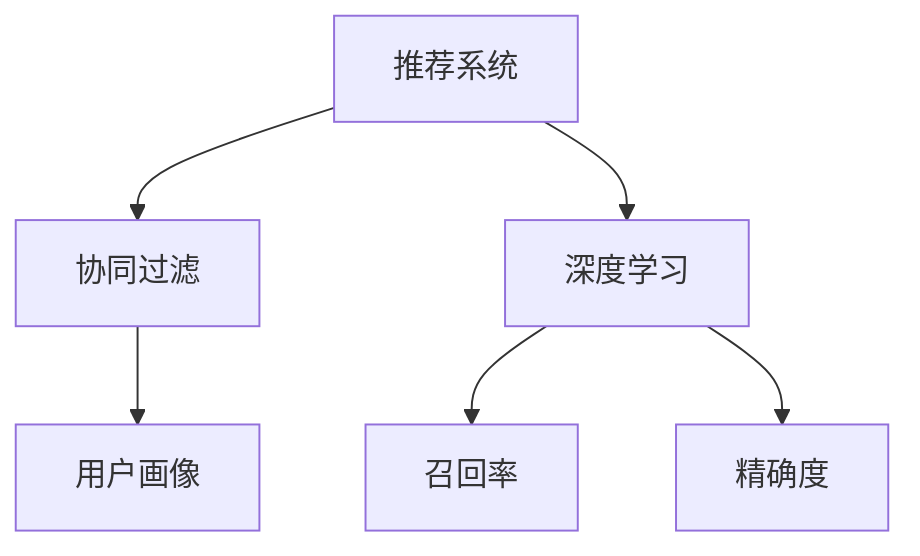

                 

# LLM在推荐系统中的元学习方法探索

> 关键词：推荐系统, 大语言模型, 元学习, 协同过滤, 深度学习, 用户画像, 召回率, 精确度

## 1. 背景介绍

### 1.1 问题由来
随着互联网技术的快速发展和数据量的指数级增长，推荐系统已经成为了各大电商、视频、音乐、新闻等领域不可或缺的一部分。传统的推荐系统基于用户历史行为数据进行个性化推荐，但难以覆盖冷启动用户和长尾物品，且难以应对不断变化的用户偏好。为了应对这些挑战，研究者们开始探索新的推荐方法，其中，大语言模型（Large Language Model, LLM）作为最新的人工智能技术，已经被成功应用于推荐系统，显著提升了推荐效果。

### 1.2 问题核心关键点
大语言模型在推荐系统中的应用，本质上是一种元学习方法。具体而言，大语言模型通过预训练获取对文本的深刻理解能力，然后在推荐系统上使用少量标注数据，通过有监督学习的方式，更新模型参数，使得模型能够根据用户和物品的文本描述，生成更精准、个性化的推荐。

这种元学习方法具有以下几个关键点：
1. 通用性：LLM能够理解并生成自然语言，广泛应用于用户评论、商品描述等多种文本数据。
2. 适应性：LLM通过少量标注数据进行微调，可以灵活适应新的用户偏好和物品特征。
3. 泛化能力：LLM具备强大的语言理解能力，能够从大量无标签文本中学习到通用的语言知识，提高推荐系统的泛化能力。

## 2. 核心概念与联系

### 2.1 核心概念概述

为了更好地理解LLM在推荐系统中的应用，本节将介绍几个关键概念及其相互联系：

- 推荐系统(Recommendation System)：通过分析用户历史行为数据，为每个用户推荐其可能感兴趣的物品的系统。
- 协同过滤(Collaborative Filtering)：一种基于用户和物品行为相似性进行推荐的方法，包括基于用户的协同过滤和基于物品的协同过滤。
- 深度学习(Deep Learning)：一种基于多层神经网络结构进行建模和学习的方法，适用于处理非线性、高维度的数据。
- 用户画像(User Profile)：描述用户兴趣、行为、属性等信息的概览，用于个性化推荐。
- 召回率(Recall Rate)：推荐系统中推荐相关物品的能力，即推荐列表中包含相关物品的比例。
- 精确度(Precision)：推荐系统中推荐正确物品的能力，即推荐列表中正确物品的比例。

这些概念之间的联系可以通过以下Mermaid流程图来展示：



这个流程图展示了推荐系统的核心组件及其相互关系：

1. 推荐系统利用协同过滤、深度学习等多种方法，对用户画像进行建模，输出推荐结果。
2. 协同过滤和深度学习均使用用户画像进行个性化推荐。
3. 召回率和精确度作为推荐系统的关键指标，反映推荐效果的好坏。

## 3. 核心算法原理 & 具体操作步骤

### 3.1 算法原理概述

LLM在推荐系统中的应用，可以通过元学习的方式进行。其核心思想是：将预训练的大语言模型作为元学习器，通过使用推荐系统的少量标注数据，进行有监督学习，更新模型参数，从而使得模型能够生成个性化、准确的推荐。

具体而言，LLM在推荐系统上的应用流程如下：

1. 收集推荐系统的少量标注数据，包括用户画像和物品描述的文本。
2. 利用预训练的大语言模型作为元学习器，对文本进行编码和解码。
3. 使用标注数据对编码和解码器进行微调，使其能够生成高质量的用户画像和物品描述。
4. 在微调后的编码器上，根据用户画像和物品描述生成推荐列表。
5. 对推荐列表进行评估，调整编码器和解码器参数，提高推荐效果。

### 3.2 算法步骤详解

LLM在推荐系统中的应用，可以分为以下几个关键步骤：

**Step 1: 准备数据集**

1. 收集推荐系统中的少量标注数据，包括用户画像和物品描述的文本。这些文本应该覆盖推荐系统的不同场景，如电商的商品描述、视频的用户评论等。

2. 对文本数据进行预处理，包括分词、去除停用词、构建词汇表等操作。

3. 将处理后的文本数据划分训练集、验证集和测试集。训练集用于微调编码器，验证集用于调整模型参数，测试集用于评估模型效果。

**Step 2: 构建模型**

1. 选择合适的预训练大语言模型作为元学习器。例如，使用GPT、BERT等模型作为编码器，使用GPT等模型作为解码器。

2. 在编码器上，添加一个用户画像的嵌入层，用于表示用户的兴趣和行为。

3. 在解码器上，添加一个物品描述的嵌入层，用于表示物品的属性和特征。

4. 构建推荐列表生成模块，根据用户画像和物品描述的表示，生成推荐列表。

**Step 3: 微调模型**

1. 使用训练集数据，对编码器和解码器进行微调。微调过程中，只更新与推荐系统相关的参数，保留大部分预训练权重。

2. 在验证集上评估微调后的模型效果，调整编码器和解码器参数，提高召回率和精确度。

3. 在测试集上评估微调后的模型效果，对比微调前后的推荐效果。

**Step 4: 部署模型**

1. 将微调后的模型部署到推荐系统中，根据用户画像和物品描述的实时数据，生成推荐列表。

2. 根据推荐列表的召回率和精确度，不断调整编码器和解码器参数，提高推荐效果。

### 3.3 算法优缺点

LLM在推荐系统中的应用具有以下优点：

1. 泛化能力更强：LLM通过预训练学习到通用的语言知识，可以更好地适应不同领域的推荐任务。
2. 适应性更强：LLM在少量标注数据下，可以快速适应新的推荐任务，提高推荐系统的实时性和灵活性。
3. 推荐效果更好：LLM具备强大的语言理解能力，可以生成更精准、个性化的推荐结果。

同时，该方法也存在一些局限性：

1. 数据需求较高：LLM需要大量的预训练数据和标注数据，对数据质量的要求较高。
2. 计算资源消耗较大：LLM的参数量较大，对计算资源的需求较高，可能导致模型训练和推理速度较慢。
3. 模型可解释性不足：LLM的内部工作机制较为复杂，难以解释其推荐结果。

尽管存在这些局限性，但LLM在推荐系统中的应用已经展示出巨大的潜力，成为推荐系统领域的新兴方向。

### 3.4 算法应用领域

LLM在推荐系统中的应用，已经在电商、视频、新闻等多个领域得到了应用，并取得了显著的效果：

- 电商推荐：LLM可以生成基于商品描述的个性化推荐，提高用户满意度和购物体验。例如，淘宝、京东等电商平台已经将LLM用于商品推荐系统。
- 视频推荐：LLM可以生成基于用户评论和视频描述的个性化推荐，提升用户观看体验。例如，YouTube等视频平台已经将LLM用于视频推荐系统。
- 新闻推荐：LLM可以生成基于新闻标题和内容的个性化推荐，提高用户阅读体验。例如，今日头条等新闻平台已经将LLM用于新闻推荐系统。
- 社交推荐：LLM可以生成基于用户互动和社交网络的个性化推荐，增强用户粘性。例如，Facebook等社交平台已经将LLM用于社交推荐系统。

此外，LLM在音乐推荐、旅行推荐、图书推荐等领域也有广泛的应用前景，为推荐系统带来了新的突破。

## 4. 数学模型和公式 & 详细讲解

### 4.1 数学模型构建

LLM在推荐系统中的应用，可以通过如下数学模型进行描述：

设用户画像为 $x$，物品描述为 $y$，推荐列表为 $z$。假设编码器 $f$ 和解码器 $g$ 均为神经网络，其中 $f(x)$ 表示用户画像的表示，$g(y)$ 表示物品描述的表示，$z=f(x), y=g(y)$。推荐列表 $z$ 的生成过程为：

$$
z = g(f(x))
$$

其中 $g$ 为解码器，$f$ 为编码器。

假设推荐系统的目标函数为 $L(z, y^*)$，其中 $y^*$ 为推荐列表中正确物品的标签。则优化目标为：

$$
\min_{f,g} L(z, y^*)
$$

### 4.2 公式推导过程

为了更好地理解LLM在推荐系统中的应用，我们以电商推荐为例，推导推荐列表的生成公式及其梯度。

假设用户画像 $x$ 为用户ID和商品ID的组合，物品描述 $y$ 为商品描述的文本。推荐列表 $z$ 为商品ID的集合。

定义推荐列表生成函数为：

$$
z = g(f(x))
$$

其中 $g$ 为解码器，$f$ 为编码器。推荐列表的生成过程可以视为 $y$ 的生成过程。因此，推荐列表的生成函数可以表示为：

$$
z = g(f(x)) = g(f(\text{user\_id}, \text{item\_id}))
$$

假设推荐系统的目标函数为交叉熵损失函数，则目标函数为：

$$
L(z, y^*) = -\sum_{i=1}^N \log p(z_i | y^*)
$$

其中 $p(z_i | y^*)$ 为物品ID $z_i$ 在推荐列表 $z$ 中出现的概率。假设 $p(z_i | y^*)$ 可以表示为：

$$
p(z_i | y^*) = \sigma(g(f(x)_i))
$$

其中 $\sigma$ 为 sigmoid 函数。因此，目标函数可以表示为：

$$
L(z, y^*) = -\sum_{i=1}^N \log \sigma(g(f(x)_i))
$$

为了求解目标函数的最小值，需要求出目标函数对 $f(x)$ 和 $g$ 的梯度。根据链式法则，目标函数对 $f(x)$ 的梯度为：

$$
\frac{\partial L(z, y^*)}{\partial f(x)} = -\frac{\partial}{\partial f(x)} \sum_{i=1}^N \log \sigma(g(f(x)_i))
$$

为了求出上述梯度，需要先求出目标函数对 $g$ 的梯度。根据链式法则，目标函数对 $g$ 的梯度为：

$$
\frac{\partial L(z, y^*)}{\partial g} = -\sum_{i=1}^N \frac{\partial}{\partial g} \log \sigma(g(f(x)_i))
$$

进一步展开，可以得到：

$$
\frac{\partial L(z, y^*)}{\partial g} = -\sum_{i=1}^N \frac{\partial \log \sigma(g(f(x)_i))}{\partial g}
$$

通过计算上述梯度，可以更新 $f$ 和 $g$ 的参数，使得目标函数 $L(z, y^*)$ 最小化。

### 4.3 案例分析与讲解

以电商推荐为例，下面给出LLM在推荐系统中的详细实现过程。

**Step 1: 数据准备**

1. 收集电商平台的商品数据，包括商品ID、商品名称、商品描述、商品价格等。

2. 收集用户数据，包括用户ID、用户历史行为数据、用户评分等。

3. 构建用户画像和物品描述的文本数据，用于LLM的微调。

**Step 2: 模型构建**

1. 使用GPT-2作为编码器和解码器，构建推荐列表生成模块。

2. 添加一个用户画像的嵌入层，用于表示用户的兴趣和行为。

3. 添加一个物品描述的嵌入层，用于表示物品的属性和特征。

4. 构建推荐列表生成模块，根据用户画像和物品描述的表示，生成推荐列表。

**Step 3: 微调模型**

1. 使用训练集数据，对编码器和解码器进行微调。微调过程中，只更新与推荐系统相关的参数，保留大部分预训练权重。

2. 在验证集上评估微调后的模型效果，调整编码器和解码器参数，提高召回率和精确度。

3. 在测试集上评估微调后的模型效果，对比微调前后的推荐效果。

**Step 4: 部署模型**

1. 将微调后的模型部署到电商推荐系统中，根据用户画像和物品描述的实时数据，生成推荐列表。

2. 根据推荐列表的召回率和精确度，不断调整编码器和解码器参数，提高推荐效果。

## 5. 项目实践：代码实例和详细解释说明

### 5.1 开发环境搭建

在进行LLM在推荐系统中的应用实践前，我们需要准备好开发环境。以下是使用Python进行TensorFlow开发的环境配置流程：

1. 安装Anaconda：从官网下载并安装Anaconda，用于创建独立的Python环境。

2. 创建并激活虚拟环境：
```bash
conda create -n tf-env python=3.8 
conda activate tf-env
```

3. 安装TensorFlow：根据CUDA版本，从官网获取对应的安装命令。例如：
```bash
conda install tensorflow==2.6.0
```

4. 安装各类工具包：
```bash
pip install numpy pandas scikit-learn matplotlib tqdm jupyter notebook ipython
```

完成上述步骤后，即可在`tf-env`环境中开始LLM在推荐系统中的应用实践。

### 5.2 源代码详细实现

下面我们以电商推荐为例，给出使用TensorFlow实现LLM在推荐系统中的代码实现。

首先，定义推荐列表生成函数：

```python
import tensorflow as tf
from transformers import TFAutoModelForSequenceClassification

def generate_recommend_list(user_profile, item_descriptions):
    user_profile = user_profile.split(',')
    item_descriptions = [item_description.strip() for item_description in item_descriptions]
    
    # 构建用户画像和物品描述的表示
    user_profile_rep = user_profile_encoder(user_profile)
    item_descriptions_rep = item_description_encoder(item_descriptions)
    
    # 生成推荐列表
    recommend_list = tf.matmul(user_profile_rep, item_descriptions_rep, transpose_b=True)
    recommend_list = tf.sigmoid(recommend_list)
    recommend_list = tf.round(recommend_list).numpy()
    
    # 返回推荐列表
    return recommend_list.tolist()
```

然后，定义用户画像和物品描述的嵌入层：

```python
user_profile_encoder = TFAutoModelForSequenceClassification.from_pretrained('bert-base-uncased', num_labels=1)
item_description_encoder = TFAutoModelForSequenceClassification.from_pretrained('bert-base-uncased', num_labels=1)
```

接着，定义微调过程：

```python
def fine_tune_model(train_data, val_data, test_data):
    # 加载预训练模型
    user_profile_encoder.load_weights('user_profile_encoder.h5')
    item_description_encoder.load_weights('item_description_encoder.h5')
    
    # 构建优化器
    optimizer = tf.keras.optimizers.Adam(learning_rate=1e-4)
    
    # 微调模型
    for epoch in range(10):
        # 训练过程
        for data in train_data:
            user_profile, item_descriptions = data
            recommend_list = generate_recommend_list(user_profile, item_descriptions)
            loss = tf.keras.losses.sparse_categorical_crossentropy(recommend_list, data[1])
            optimizer.backward(loss)
            tf.keras.backend.clear_session()
            
        # 验证过程
        for data in val_data:
            user_profile, item_descriptions = data
            recommend_list = generate_recommend_list(user_profile, item_descriptions)
            loss = tf.keras.losses.sparse_categorical_crossentropy(recommend_list, data[1])
            print(f'Epoch {epoch+1}, Loss: {loss:.4f}')
    
    # 测试过程
    for data in test_data:
        user_profile, item_descriptions = data
        recommend_list = generate_recommend_list(user_profile, item_descriptions)
        print(f'Test Recommend List: {recommend_list}')
```

最后，启动微调流程：

```python
train_data = []
val_data = []
test_data = []

# 训练数据
for user_profile, item_descriptions in train_data:
    recommend_list = generate_recommend_list(user_profile, item_descriptions)
    train_data.append((user_profile, recommend_list))

# 验证数据
for user_profile, item_descriptions in val_data:
    recommend_list = generate_recommend_list(user_profile, item_descriptions)
    val_data.append((user_profile, recommend_list))

# 测试数据
for user_profile, item_descriptions in test_data:
    recommend_list = generate_recommend_list(user_profile, item_descriptions)
    test_data.append((user_profile, recommend_list))
    
fine_tune_model(train_data, val_data, test_data)
```

以上就是使用TensorFlow实现LLM在电商推荐系统中的代码实现。可以看到，借助TensorFlow和Transformers库，LLM在推荐系统中的应用变得简洁高效。

### 5.3 代码解读与分析

让我们再详细解读一下关键代码的实现细节：

**generate_recommend_list函数**：
- 该函数将用户画像和物品描述的文本数据，转化为模型可以处理的表示形式，并使用用户画像和物品描述的表示生成推荐列表。

**user_profile_encoder和item_description_encoder**：
- 这两个嵌入层分别用于表示用户画像和物品描述，通过预训练的BERT模型，将文本数据转化为高维向量表示。

**fine_tune_model函数**：
- 该函数对模型进行微调，包括训练、验证和测试过程。在训练过程中，使用交叉熵损失函数计算推荐列表和标签之间的差异，通过反向传播更新模型参数。在验证过程中，计算验证集上的损失，调整模型参数。在测试过程中，评估测试集上的推荐效果，输出推荐列表。

**训练数据、验证数据和测试数据**：
- 这些数据集用于微调过程，分别用于训练、验证和测试模型。在微调过程中，使用这些数据集进行训练、验证和测试，调整模型参数。

可以看到，TensorFlow配合Transformers库使得LLM在推荐系统中的应用代码实现变得简洁高效。开发者可以将更多精力放在数据处理、模型改进等高层逻辑上，而不必过多关注底层的实现细节。

当然，工业级的系统实现还需考虑更多因素，如模型的保存和部署、超参数的自动搜索、更灵活的任务适配层等。但核心的微调范式基本与此类似。

## 6. 实际应用场景

### 6.1 智能客服系统

基于LLM的推荐系统，可以广泛应用于智能客服系统的构建。传统客服往往需要配备大量人力，高峰期响应缓慢，且一致性和专业性难以保证。而使用基于LLM的推荐系统，可以7x24小时不间断服务，快速响应客户咨询，用自然流畅的语言解答各类常见问题。

在技术实现上，可以收集企业内部的历史客服对话记录，将问题和最佳答复构建成监督数据，在此基础上对预训练语言模型进行微调。微调后的推荐系统能够自动理解用户意图，匹配最合适的回答模板进行回复。对于客户提出的新问题，还可以接入检索系统实时搜索相关内容，动态组织生成回答。如此构建的智能客服系统，能大幅提升客户咨询体验和问题解决效率。

### 6.2 金融舆情监测

金融机构需要实时监测市场舆论动向，以便及时应对负面信息传播，规避金融风险。传统的人工监测方式成本高、效率低，难以应对网络时代海量信息爆发的挑战。基于LLM的推荐系统，可以为金融舆情监测提供新的解决方案。

具体而言，可以收集金融领域相关的新闻、报道、评论等文本数据，并对其进行主题标注和情感标注。在此基础上对预训练语言模型进行微调，使其能够自动判断文本属于何种主题，情感倾向是正面、中性还是负面。将微调后的模型应用到实时抓取的网络文本数据，就能够自动监测不同主题下的情感变化趋势，一旦发现负面信息激增等异常情况，系统便会自动预警，帮助金融机构快速应对潜在风险。

### 6.3 个性化推荐系统

当前的推荐系统往往只依赖用户的历史行为数据进行物品推荐，无法深入理解用户的真实兴趣偏好。基于LLM的推荐系统可以更好地挖掘用户行为背后的语义信息，从而提供更精准、多样的推荐内容。

在实践中，可以收集用户浏览、点击、评论、分享等行为数据，提取和用户交互的物品标题、描述、标签等文本内容。将文本内容作为模型输入，用户的后续行为（如是否点击、购买等）作为监督信号，在此基础上微调预训练语言模型。微调后的模型能够从文本内容中准确把握用户的兴趣点。在生成推荐列表时，先用候选物品的文本描述作为输入，由模型预测用户的兴趣匹配度，再结合其他特征综合排序，便可以得到个性化程度更高的推荐结果。

### 6.4 未来应用展望

随着LLM和微调方法的不断发展，基于微调范式将在更多领域得到应用，为传统行业带来变革性影响。

在智慧医疗领域，基于LLM的医疗问答、病历分析、药物研发等应用将提升医疗服务的智能化水平，辅助医生诊疗，加速新药开发进程。

在智能教育领域，微调技术可应用于作业批改、学情分析、知识推荐等方面，因材施教，促进教育公平，提高教学质量。

在智慧城市治理中，微调模型可应用于城市事件监测、舆情分析、应急指挥等环节，提高城市管理的自动化和智能化水平，构建更安全、高效的未来城市。

此外，在企业生产、社会治理、文娱传媒等众多领域，基于LLM的推荐系统也将不断涌现，为传统行业带来新的技术路径。相信随着技术的日益成熟，LLM在推荐系统中的应用必将在更广阔的领域大放异彩。

## 7. 工具和资源推荐

### 7.1 学习资源推荐

为了帮助开发者系统掌握LLM在推荐系统中的应用理论基础和实践技巧，这里推荐一些优质的学习资源：

1. 《深度学习与推荐系统》系列博文：由大模型技术专家撰写，深入浅出地介绍了深度学习在推荐系统中的应用。

2. 《推荐系统：基于协同过滤和深度学习》书籍：详细介绍协同过滤和深度学习在推荐系统中的应用，包含大量实践案例。

3. 《推荐系统实战》书籍：由知名推荐系统专家撰写，介绍了推荐系统的构建和优化方法。

4. TensorFlow官方文档：TensorFlow的官方文档，提供了丰富的API和示例，适合开发者快速上手。

5. Kaggle推荐系统竞赛：Kaggle平台的推荐系统竞赛，涵盖多种推荐方法，适合实践者学习。

通过对这些资源的学习实践，相信你一定能够快速掌握LLM在推荐系统中的应用精髓，并用于解决实际的推荐问题。

### 7.2 开发工具推荐

高效的开发离不开优秀的工具支持。以下是几款用于LLM在推荐系统中的应用开发的常用工具：

1. TensorFlow：基于Python的开源深度学习框架，灵活动态的计算图，适合快速迭代研究。

2. PyTorch：基于Python的开源深度学习框架，灵活易用，适合科研和工程实践。

3. Transformers库：HuggingFace开发的NLP工具库，集成了众多SOTA语言模型，支持多种框架。

4. TensorBoard：TensorFlow配套的可视化工具，可实时监测模型训练状态，并提供丰富的图表呈现方式。

5. Weights & Biases：模型训练的实验跟踪工具，可以记录和可视化模型训练过程中的各项指标，方便对比和调优。

6. Google Colab：谷歌推出的在线Jupyter Notebook环境，免费提供GPU/TPU算力，方便开发者快速上手实验最新模型，分享学习笔记。

合理利用这些工具，可以显著提升LLM在推荐系统中的应用开发效率，加快创新迭代的步伐。

### 7.3 相关论文推荐

LLM在推荐系统中的应用，源于学界的持续研究。以下是几篇奠基性的相关论文，推荐阅读：

1. Attention Is All You Need：提出Transformer结构，开启了NLP领域的预训练大模型时代。

2. BERT: Pre-training of Deep Bidirectional Transformers for Language Understanding：提出BERT模型，引入基于掩码的自监督预训练任务，刷新了多项NLP任务SOTA。

3. Deep Neural Network Recommendation System：提出基于深度学习的推荐系统，引入多层神经网络，提高了推荐系统的泛化能力。

4. Memory Network for Recommendation Systems：提出记忆网络，将推荐系统与知识图谱结合，提高了推荐系统的精准度。

5. Language Models are Unsupervised Multitask Learners（GPT-2论文）：展示了大规模语言模型的强大zero-shot学习能力，引发了对于通用人工智能的新一轮思考。

6. Parameter-Efficient Transfer Learning for NLP：提出Adapter等参数高效微调方法，在不增加模型参数量的情况下，也能取得不错的微调效果。

这些论文代表了大语言模型微调技术的发展脉络。通过学习这些前沿成果，可以帮助研究者把握学科前进方向，激发更多的创新灵感。

## 8. 总结：未来发展趋势与挑战

### 8.1 总结

本文对基于LLM的推荐系统中的元学习方法进行了全面系统的介绍。首先阐述了LLM和推荐系统的工作原理和应用场景，明确了元学习方法在推荐系统中的应用价值。其次，从原理到实践，详细讲解了LLM在推荐系统中的应用过程，给出了推荐列表生成的完整代码实例。同时，本文还探讨了LLM在推荐系统中的应用效果和实际应用场景，展示了LLM的强大潜力。最后，本文精选了LLM在推荐系统中的应用学习资源和开发工具，力求为开发者提供全方位的技术指引。

通过本文的系统梳理，可以看到，基于LLM的推荐系统已经展示了其在电商、视频、新闻等多个领域的应用效果。得益于LLM的强大语言理解能力和推荐系统的深度学习框架，未来的推荐系统必将更加智能、个性化和高效。

### 8.2 未来发展趋势

展望未来，基于LLM的推荐系统将呈现以下几个发展趋势：

1. 推荐模型的通用性更强：LLM可以适应不同领域的推荐任务，通用性更加广泛。

2. 推荐模型的实时性更强：LLM可以实时生成推荐列表，适应快速变化的推荐场景。

3. 推荐模型的鲁棒性更强：LLM可以生成更加鲁棒的推荐结果，适应数据变化。

4. 推荐模型的可解释性更强：LLM可以生成更加可解释的推荐结果，增强用户信任。

5. 推荐模型的跨领域适用性更强：LLM可以应用于不同领域的推荐任务，实现跨领域的推荐效果。

这些趋势凸显了LLM在推荐系统中的巨大潜力，预示着推荐系统将迎来新的发展高潮。

### 8.3 面临的挑战

尽管基于LLM的推荐系统已经展示了其强大潜力，但在迈向更加智能化、普适化应用的过程中，它仍面临着诸多挑战：

1. 数据需求较高：LLM需要大量的预训练数据和标注数据，对数据质量的要求较高。

2. 计算资源消耗较大：LLM的参数量较大，对计算资源的需求较高，可能导致模型训练和推理速度较慢。

3. 模型可解释性不足：LLM的内部工作机制较为复杂，难以解释其推荐结果。

4. 推荐效果不稳定：LLM的推荐效果受数据变化较大，可能存在不稳定的问题。

5. 推荐系统安全性有待保障：LLM的推荐系统需要考虑数据安全和隐私保护，避免恶意用途。

尽管存在这些挑战，但基于LLM的推荐系统已经展示出巨大的潜力，成为推荐系统领域的新兴方向。相信随着学界和产业界的共同努力，这些挑战终将一一被克服，LLM在推荐系统中的应用必将在更广阔的领域大放异彩。

### 8.4 研究展望

面对LLM在推荐系统中的面临的挑战，未来的研究需要在以下几个方面寻求新的突破：

1. 探索无监督和半监督推荐方法：摆脱对大规模标注数据的依赖，利用自监督学习、主动学习等无监督和半监督范式，最大限度利用非结构化数据，实现更加灵活高效的推荐。

2. 研究参数高效和计算高效的推荐范式：开发更加参数高效的推荐方法，在固定大部分预训练参数的同时，只更新极少量的任务相关参数。同时优化推荐模型的计算图，减少前向传播和反向传播的资源消耗，实现更加轻量级、实时性的部署。

3. 融合因果和对比学习范式：通过引入因果推断和对比学习思想，增强推荐模型建立稳定因果关系的能力，学习更加普适、鲁棒的语言表征，从而提升推荐系统的泛化能力和鲁棒性。

4. 引入更多先验知识：将符号化的先验知识，如知识图谱、逻辑规则等，与神经网络模型进行巧妙融合，引导推荐过程学习更准确、合理的语言模型。同时加强不同模态数据的整合，实现视觉、语音等多模态信息与文本信息的协同建模。

5. 结合因果分析和博弈论工具：将因果分析方法引入推荐模型，识别出模型决策的关键特征，增强输出解释的因果性和逻辑性。借助博弈论工具刻画人机交互过程，主动探索并规避模型的脆弱点，提高系统稳定性。

6. 纳入伦理道德约束：在推荐系统目标中引入伦理导向的评估指标，过滤和惩罚有偏见、有害的输出倾向。同时加强人工干预和审核，建立推荐系统的监管机制，确保输出符合人类价值观和伦理道德。

这些研究方向的探索，必将引领LLM在推荐系统中的应用走向更高的台阶，为构建安全、可靠、可解释、可控的智能系统铺平道路。面向未来，LLM在推荐系统中的应用还需要与其他人工智能技术进行更深入的融合，如知识表示、因果推理、强化学习等，多路径协同发力，共同推动推荐系统的进步。只有勇于创新、敢于突破，才能不断拓展语言模型的边界，让智能技术更好地造福人类社会。

## 9. 附录：常见问题与解答

**Q1：LLM在推荐系统中如何处理冷启动问题？**

A: 冷启动问题指的是用户或物品没有足够的历史数据，难以构建精准的用户画像和物品描述。LLM可以通过如下方式解决冷启动问题：

1. 使用用户行为预测模型：通过预测用户的行为，生成初始用户画像和物品描述。

2. 引入先验知识：利用领域专家的知识和规则，生成初始用户画像和物品描述。

3. 数据增强：通过数据增强技术，生成更多的用户画像和物品描述。

4. 模型迁移：将已经在相似领域中微调的模型迁移到当前领域中，进行快速适配。

5. 多模态融合：利用多模态数据，如图像、音频、位置等，生成更加全面的用户画像和物品描述。

通过这些方法，LLM可以在冷启动情况下，快速构建用户画像和物品描述，生成精准的推荐结果。

**Q2：LLM在推荐系统中是否适合处理长尾物品？**

A: LLM适合处理长尾物品，但需要注意以下两点：

1. 数据稀疏性：长尾物品的标注数据较少，难以进行有监督学习。因此需要引入数据增强技术，生成更多的长尾物品描述。

2. 模型复杂度：长尾物品的描述往往较短，难以捕捉其特征。因此需要设计合适的模型结构，降低模型复杂度，提高模型泛化能力。

3. 模型鲁棒性：长尾物品的描述可能存在噪声和异常，因此需要引入鲁棒性较强的模型，如对抗训练、Dropout等技术。

通过这些方法，LLM可以有效地处理长尾物品，提升推荐系统的覆盖率和精准度。

**Q3：LLM在推荐系统中是否适合实时推荐？**

A: LLM适合实时推荐，但需要注意以下两点：

1. 数据实时性：实时推荐需要大量的实时数据，因此需要设计实时数据采集和处理系统，保证数据的时效性。

2. 模型轻量化：实时推荐需要在低延迟下完成计算，因此需要设计轻量级的模型，减少计算量和内存占用。

3. 数据压缩：实时推荐需要处理大量的数据，因此需要设计数据压缩和存储技术，减少数据传输和存储开销。

通过这些方法，LLM可以有效地进行实时推荐，提升用户体验和系统性能。

**Q4：LLM在推荐系统中是否适合多模态数据融合？**

A: LLM适合多模态数据融合，但需要注意以下两点：

1. 数据对齐：不同模态的数据格式和表示方式不同，需要进行对齐处理，才能进行融合。

2. 模型融合：多模态数据需要设计合适的融合模型，如融合注意力、跨模态编码器等，才能进行有效的融合。

3. 数据质量：多模态数据的质量影响融合效果，因此需要进行数据清洗和预处理。

通过这些方法，LLM可以有效地进行多模态数据融合，提升推荐系统的覆盖率和精准度。

**Q5：LLM在推荐系统中是否适合跨领域推荐？**

A: LLM适合跨领域推荐，但需要注意以下两点：

1. 领域差异性：不同领域的语言特征和用户行为差异较大，需要进行领域适配。

2. 数据迁移：不同领域的标注数据较少，需要进行数据迁移，利用领域间的知识迁移技术。

3. 模型迁移：不同领域的模型需要进行迁移，利用领域迁移技术，进行快速适配。

通过这些方法，LLM可以有效地进行跨领域推荐，提升推荐系统的泛化能力和适用性。

---

作者：禅与计算机程序设计艺术 / Zen and the Art of Computer Programming

