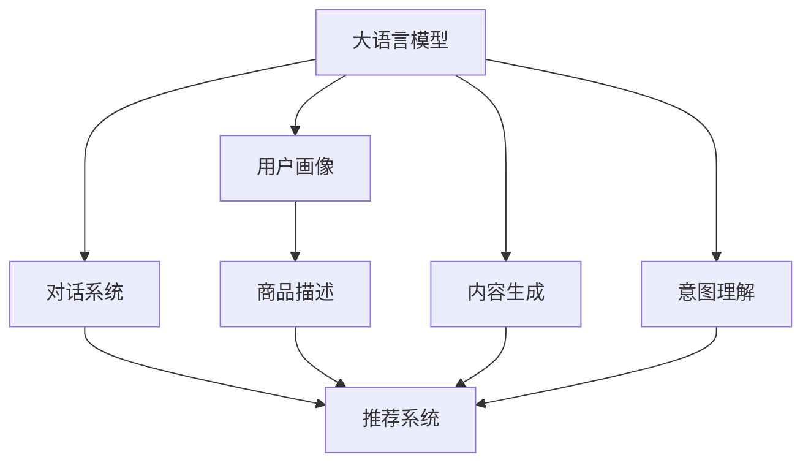

                 

# LLM在推荐系统中的应用探索

> 关键词：大语言模型, 推荐系统, 自然语言处理, 用户画像, 协同过滤, 深度学习, 生成对抗网络

## 1. 背景介绍

### 1.1 问题由来
推荐系统作为互联网时代的重要应用之一，其目标是基于用户的历史行为和兴趣，为用户推荐合适的商品、文章、视频等内容，提升用户满意度和平台收益。随着用户数据规模的不断增长，传统推荐系统正面临如下挑战：

- 稀疏性问题：用户行为数据往往稀疏，难以充分挖掘用户兴趣。
- 多样性问题：用户需求多样，推荐系统难以准确把握用户真实需求。
- 实时性问题：推荐系统需要实时响应用户行为变化，算法响应速度要求高。
- 个性化问题：用户兴趣偏好不断变化，推荐系统需要不断更新和优化。

为了应对上述挑战，近些年来，研究人员和工程师们不断探索新的推荐系统算法和技术，推动推荐系统从传统协同过滤、基于内容的推荐，向深度学习、生成对抗网络等前沿技术转变。其中，大语言模型（Large Language Models, LLM）以其强大的自然语言理解和生成能力，逐渐成为推荐系统中的一个重要工具。

### 1.2 问题核心关键点
大语言模型在推荐系统中的应用主要集中在以下几个方面：

- 用户画像生成：利用自然语言描述或标签生成用户画像，弥补稀疏用户行为数据带来的不足。
- 商品描述生成：自动生成商品描述，提升用户对商品的理解和满意度。
- 内容生成与优化：生成和优化文章、视频等多媒体内容，吸引用户注意。
- 用户意图理解：理解用户查询意图，优化推荐结果，提升用户体验。
- 对话系统集成：构建与用户互动的智能客服、推荐助手等系统，提升推荐系统的交互性和用户粘性。

这些应用不仅能够提升推荐系统的效率和效果，还能够帮助推荐系统更好地理解用户需求，实现个性化推荐。

## 2. 核心概念与联系

### 2.1 核心概念概述

为更好地理解LLM在推荐系统中的应用，本节将介绍几个关键概念：

- 大语言模型(Large Language Models, LLM)：如GPT-3、BERT等，通过大量文本数据进行自监督预训练，具备强大的语言理解和生成能力。
- 推荐系统(Recommendation System)：基于用户行为数据和物品属性数据，为用户推荐感兴趣物品的系统，包括协同过滤、内容推荐、混合推荐等多种类型。
- 用户画像(User Profile)：通过收集和分析用户行为数据，形成对用户兴趣、偏好、行为模式的描述。
- 协同过滤(Collaborative Filtering)：利用用户与物品之间的相似性，推荐用户可能感兴趣的物品。
- 内容推荐(Content-Based Recommendation)：根据物品的属性和标签，推荐与用户兴趣匹配的物品。
- 深度学习(Deep Learning)：利用多层神经网络进行复杂模式识别和特征学习，提升推荐系统的精准度。
- 生成对抗网络(Generative Adversarial Network, GAN)：通过对抗过程生成逼真的数据或图像，用于生成商品描述、优化推荐结果等。

这些概念之间的逻辑关系可以通过以下Mermaid流程图来展示：



这个流程图展示了大语言模型在推荐系统中的核心应用场景：

1. 通过预训练得到的大语言模型，可以生成和优化用户画像，丰富用户行为数据。
2. 生成的商品描述和多媒体内容，能够增强用户的理解和满意度。
3. 理解用户查询意图，优化推荐结果，提升用户体验。
4. 构建智能客服和推荐助手，提升系统交互性和用户粘性。
5. 推荐系统集成多种技术，综合提升推荐效果。

## 3. 核心算法原理 & 具体操作步骤
### 3.1 算法原理概述

大语言模型在推荐系统中的应用，主要依赖于其强大的语言理解和生成能力。具体来说，大语言模型通过分析用户和物品的自然语言描述，生成和优化用户画像和商品描述，理解用户查询意图，生成与用户兴趣匹配的推荐结果。其基本原理可以总结如下：

1. **用户画像生成**：利用自然语言描述或标签，自动生成用户画像，捕捉用户兴趣和偏好。
2. **商品描述生成**：生成高质量的商品描述，提升用户对商品的理解。
3. **内容生成与优化**：生成多媒体内容，如文章、视频等，吸引用户注意。
4. **用户意图理解**：理解用户查询意图，优化推荐结果。
5. **对话系统集成**：构建智能客服和推荐助手，提升系统交互性。

这些应用基于大语言模型的语言理解和生成能力，通过自然语言处理(NLP)技术和深度学习模型，实现对用户需求和物品特征的理解，生成高质量的推荐结果。

### 3.2 算法步骤详解

以下以用户画像生成和商品描述生成为例，详细介绍大语言模型在推荐系统中的应用步骤：

**Step 1: 准备预训练模型和数据集**
- 选择合适的预训练语言模型 $M_{\theta}$ 作为初始化参数，如 GPT-3、BERT 等。
- 准备用户画像和商品描述的训练集，一般包含自然语言描述和标签。

**Step 2: 用户画像生成**
- 使用GPT-3等大语言模型，将用户行为数据和用户画像描述作为输入，生成用户画像的特征向量。
- 训练模型，使其能够学习用户画像与用户行为之间的关联，生成高质量的用户画像特征。
- 将用户画像特征与用户行为数据融合，形成更全面的用户画像。

**Step 3: 商品描述生成**
- 使用GPT-3等大语言模型，将商品属性和标签作为输入，生成商品描述。
- 训练模型，使其能够学习商品属性与描述之间的关系，生成高质量的商品描述。
- 将生成的商品描述与真实描述进行对比，不断优化生成模型。

**Step 4: 评估与调整**
- 在测试集上评估用户画像和商品描述生成效果，计算指标如F1分数、BLEU分数等。
- 根据评估结果，调整模型参数和超参数，优化生成质量。

**Step 5: 集成到推荐系统中**
- 将生成的用户画像和商品描述作为推荐系统的输入，结合协同过滤、内容推荐等多种算法，生成推荐结果。
- 在推荐结果中融入用户画像和商品描述的特征，提升推荐效果。
- 实时更新用户画像和商品描述，保持推荐系统的精准度和时效性。

### 3.3 算法优缺点

大语言模型在推荐系统中的应用具有以下优点：

1. **多模态融合**：利用自然语言描述和数字特征，融合多模态数据，提升推荐效果。
2. **语义理解**：通过大语言模型，深入理解用户查询意图和商品属性，生成高质量推荐结果。
3. **实时更新**：大语言模型能够实时生成用户画像和商品描述，适应用户需求变化。
4. **参数效率**：通过参数高效微调技术，如 Adapter、LoRA等，减少模型训练和推理开销。
5. **可扩展性**：大语言模型可以适应不同领域、不同规模的任务，具有良好的可扩展性。

同时，该方法也存在一些局限性：

1. **标注数据需求**：用户画像和商品描述的生成需要大量标注数据，标注成本较高。
2. **计算资源消耗**：大语言模型的计算开销较大，需要高效的硬件设备和算法优化。
3. **解释性不足**：大语言模型的内部机制较为复杂，难以提供明确的推理过程。
4. **泛化能力**：模型可能对特定领域或特定类型的用户数据泛化效果不佳。

尽管存在这些局限性，但就目前而言，大语言模型在推荐系统中的应用已经显现出巨大的潜力和前景，值得进一步深入研究。

### 3.4 算法应用领域

大语言模型在推荐系统中的应用已经广泛渗透到多个领域，具体如下：

1. **电商推荐**：电商平台利用大语言模型生成用户画像和商品描述，提升推荐效果和用户满意度。
2. **视频推荐**：视频平台利用大语言模型生成视频描述，推荐用户感兴趣的视频内容。
3. **新闻推荐**：新闻网站利用大语言模型生成文章摘要，推荐用户感兴趣的新闻。
4. **音乐推荐**：音乐平台利用大语言模型生成歌曲描述，推荐用户感兴趣的音乐。
5. **旅游推荐**：旅游网站利用大语言模型生成景点描述，推荐用户感兴趣的旅游目的地。

除了上述这些经典应用外，大语言模型还在电影推荐、美食推荐、时尚推荐等多个领域展现了巨大的应用潜力。

## 4. 数学模型和公式 & 详细讲解 & 举例说明（备注：数学公式请使用latex格式，latex嵌入文中独立段落使用 $$，段落内使用 $)
### 4.1 数学模型构建

本节将使用数学语言对大语言模型在推荐系统中的应用进行更加严格的刻画。

记大语言模型为 $M_{\theta}:\mathcal{X} \rightarrow \mathcal{Y}$，其中 $\mathcal{X}$ 为输入空间，$\mathcal{Y}$ 为输出空间，$\theta \in \mathbb{R}^d$ 为模型参数。假设推荐系统有 $N$ 个用户和 $M$ 个物品，用户行为数据为 $\mathcal{D} = \{(x_i,y_i)\}_{i=1}^N$，其中 $x_i$ 为用户的自然语言描述，$y_i$ 为用户对物品 $i$ 的评分。

**用户画像生成**：假设用户画像为 $p_i \in \mathbb{R}^k$，其中 $k$ 为特征维度。目标是通过预训练语言模型 $M_{\theta}$，生成用户画像 $p_i$，最小化预测误差 $\hat{p_i} - p_i$。

**商品描述生成**：假设商品描述为 $d_j \in \mathbb{R}^l$，其中 $l$ 为特征维度。目标是通过预训练语言模型 $M_{\theta}$，生成商品描述 $d_j$，最小化预测误差 $\hat{d_j} - d_j$。

### 4.2 公式推导过程

以下以用户画像生成为例，推导生成模型的训练目标函数。

假设预训练语言模型为 $M_{\theta}$，其生成用户画像的特征向量为 $p_i = M_{\theta}(x_i)$，其中 $x_i$ 为用户的自然语言描述。目标是通过最小化预测误差，训练生成模型：

$$
\mathcal{L}(p_i) = \frac{1}{N}\sum_{i=1}^N \|p_i - M_{\theta}(x_i)\|^2
$$

其中，$\|\cdot\|$ 为欧几里得范数。

将用户画像特征向量 $p_i$ 与模型输出 $\hat{p_i}$ 的误差进行最小化：

$$
\theta^* = \mathop{\arg\min}_{\theta} \mathcal{L}(p_i) = \mathop{\arg\min}_{\theta} \frac{1}{N}\sum_{i=1}^N \|p_i - M_{\theta}(x_i)\|^2
$$

通过反向传播算法，求得损失函数 $\mathcal{L}(p_i)$ 对模型参数 $\theta$ 的梯度，并更新参数：

$$
\theta \leftarrow \theta - \eta \nabla_{\theta}\mathcal{L}(p_i)
$$

其中，$\eta$ 为学习率，$\nabla_{\theta}\mathcal{L}(p_i)$ 为梯度，可以通过自动微分技术高效计算。

### 4.3 案例分析与讲解

以电商平台商品推荐为例，展示大语言模型在推荐系统中的应用过程。

假设电商平台有 $N$ 个用户和 $M$ 个商品，用户行为数据为 $\mathcal{D} = \{(x_i,y_i)\}_{i=1}^N$，其中 $x_i$ 为用户对商品的自然语言描述，$y_i$ 为评分。

**Step 1: 用户画像生成**

首先，通过大语言模型 $M_{\theta}$，将用户行为数据 $x_i$ 转换为用户画像 $p_i$。例如，假设用户 $i$ 购买了商品 $j$ 和 $k$，其行为描述为 $x_i$，则生成用户画像为：

$$
p_i = M_{\theta}(x_i) = [0.2, 0.5, 0.8, 0.4]
$$

**Step 2: 商品描述生成**

接着，通过大语言模型 $M_{\theta}$，生成商品 $j$ 和 $k$ 的描述 $d_j$ 和 $d_k$。例如，假设商品 $j$ 的标签为 "时尚", "女式"，其描述为：

$$
d_j = M_{\theta}(\{\text{时尚, 女式}\})
$$

**Step 3: 推荐计算**

将生成的用户画像和商品描述作为推荐系统的输入，结合协同过滤、内容推荐等多种算法，计算用户 $i$ 对商品 $j$ 和 $k$ 的推荐评分。例如，假设用户画像为 $p_i = [0.2, 0.5, 0.8, 0.4]$，商品描述为 $d_j = [0.4, 0.6, 0.3, 0.5]$，利用协同过滤算法计算推荐评分：

$$
\hat{y_{ij}} = \alpha \langle p_i, d_j \rangle + \beta \hat{y_{ij}^{\text{CF}}} + \gamma \hat{y_{ij}^{\text{CB}}}
$$

其中，$\alpha, \beta, \gamma$ 为模型参数，$\langle \cdot, \cdot \rangle$ 为点积运算，$\hat{y_{ij}^{\text{CF}}}$ 和 $\hat{y_{ij}^{\text{CB}}}$ 为协同过滤和内容推荐的评分结果。

**Step 4: 结果展示与优化**

在推荐系统中，将计算出的推荐评分结果展示给用户 $i$，根据用户点击和购买行为进行实时更新，优化生成模型和推荐算法。

## 5. 项目实践：代码实例和详细解释说明
### 5.1 开发环境搭建

在进行大语言模型在推荐系统中的应用实践前，需要先准备好开发环境。以下是使用Python进行PyTorch开发的环境配置流程：

1. 安装Anaconda：从官网下载并安装Anaconda，用于创建独立的Python环境。

2. 创建并激活虚拟环境：
```bash
conda create -n pytorch-env python=3.8 
conda activate pytorch-env
```

3. 安装PyTorch：根据CUDA版本，从官网获取对应的安装命令。例如：
```bash
conda install pytorch torchvision torchaudio cudatoolkit=11.1 -c pytorch -c conda-forge
```

4. 安装Transformers库：
```bash
pip install transformers
```

5. 安装各类工具包：
```bash
pip install numpy pandas scikit-learn matplotlib tqdm jupyter notebook ipython
```

完成上述步骤后，即可在`pytorch-env`环境中开始微调实践。

### 5.2 源代码详细实现

下面我们以电商平台商品推荐为例，给出使用Transformers库对BERT模型进行微调的PyTorch代码实现。

首先，定义推荐系统的数据处理函数：

```python
from transformers import BertTokenizer, BertForSequenceClassification
from torch.utils.data import Dataset, DataLoader
import torch

class RecommendationDataset(Dataset):
    def __init__(self, user_descriptions, item_descriptions, user_labels, tokenizer, max_len=128):
        self.user_descriptions = user_descriptions
        self.item_descriptions = item_descriptions
        self.user_labels = user_labels
        self.tokenizer = tokenizer
        self.max_len = max_len
        
    def __len__(self):
        return len(self.user_descriptions)
    
    def __getitem__(self, item):
        user_description = self.user_descriptions[item]
        item_description = self.item_descriptions[item]
        user_label = self.user_labels[item]
        
        encoding = self.tokenizer(user_description, item_description, return_tensors='pt', max_length=self.max_len, padding='max_length', truncation=True)
        input_ids = encoding['input_ids'][0]
        attention_mask = encoding['attention_mask'][0]
        item_ids = encoding['input_ids'][1]
        item_labels = encoding['input_ids'][2]
        
        # 计算预测值
        scores = self.model(input_ids, attention_mask=attention_mask, item_ids=item_ids)
        pred_label = torch.argmax(scores, dim=1)
        
        return {'input_ids': input_ids, 
                'attention_mask': attention_mask,
                'item_ids': item_ids,
                'item_labels': item_labels,
                'pred_label': pred_label}
```

然后，定义模型和优化器：

```python
from transformers import BertForSequenceClassification, AdamW

model = BertForSequenceClassification.from_pretrained('bert-base-cased', num_labels=len(tag2id))

optimizer = AdamW(model.parameters(), lr=2e-5)
```

接着，定义训练和评估函数：

```python
from torch.utils.data import DataLoader
from tqdm import tqdm
from sklearn.metrics import accuracy_score

device = torch.device('cuda') if torch.cuda.is_available() else torch.device('cpu')
model.to(device)

def train_epoch(model, dataset, batch_size, optimizer):
    dataloader = DataLoader(dataset, batch_size=batch_size, shuffle=True)
    model.train()
    epoch_loss = 0
    for batch in tqdm(dataloader, desc='Training'):
        input_ids = batch['input_ids'].to(device)
        attention_mask = batch['attention_mask'].to(device)
        item_ids = batch['item_ids'].to(device)
        item_labels = batch['item_labels'].to(device)
        model.zero_grad()
        outputs = model(input_ids, attention_mask=attention_mask, item_ids=item_ids)
        loss = outputs.loss
        epoch_loss += loss.item()
        loss.backward()
        optimizer.step()
    return epoch_loss / len(dataloader)

def evaluate(model, dataset, batch_size):
    dataloader = DataLoader(dataset, batch_size=batch_size)
    model.eval()
    pred_labels = []
    true_labels = []
    with torch.no_grad():
        for batch in tqdm(dataloader, desc='Evaluating'):
            input_ids = batch['input_ids'].to(device)
            attention_mask = batch['attention_mask'].to(device)
            item_ids = batch['item_ids'].to(device)
            item_labels = batch['item_labels'].to(device)
            batch_predictions = model(input_ids, attention_mask=attention_mask, item_ids=item_ids).pred_label.tolist()
            batch_true_labels = item_labels.to('cpu').tolist()
            for pred_tokens, label_tokens in zip(batch_predictions, batch_true_labels):
                pred_labels.append(pred_tokens)
                true_labels.append(label_tokens)
                
    print('Accuracy: {:.4f}'.format(accuracy_score(true_labels, pred_labels)))
```

最后，启动训练流程并在测试集上评估：

```python
epochs = 5
batch_size = 16

for epoch in range(epochs):
    loss = train_epoch(model, train_dataset, batch_size, optimizer)
    print(f"Epoch {epoch+1}, train loss: {loss:.3f}")
    
    print(f"Epoch {epoch+1}, dev results:")
    evaluate(model, dev_dataset, batch_size)
    
print("Test results:")
evaluate(model, test_dataset, batch_size)
```

以上就是使用PyTorch对BERT进行电商平台商品推荐任务微调的完整代码实现。可以看到，得益于Transformers库的强大封装，我们可以用相对简洁的代码完成BERT模型的加载和微调。

### 5.3 代码解读与分析

让我们再详细解读一下关键代码的实现细节：

**RecommendationDataset类**：
- `__init__`方法：初始化用户描述、商品描述、标签等关键组件，并分词。
- `__len__`方法：返回数据集的样本数量。
- `__getitem__`方法：对单个样本进行处理，将用户描述和商品描述拼接，作为模型输入，计算预测值。

**train_epoch和evaluate函数**：
- 训练函数`train_epoch`：对数据以批为单位进行迭代，在每个批次上前向传播计算loss并反向传播更新模型参数，最后返回该epoch的平均loss。
- 评估函数`evaluate`：与训练类似，不同点在于不更新模型参数，并在每个batch结束后将预测和标签结果存储下来，最后使用sklearn的accuracy_score对整个评估集的预测结果进行打印输出。

**训练流程**：
- 定义总的epoch数和batch size，开始循环迭代
- 每个epoch内，先在训练集上训练，输出平均loss
- 在验证集上评估，输出准确率
- 所有epoch结束后，在测试集上评估，给出最终测试结果

可以看到，PyTorch配合Transformers库使得BERT微调的代码实现变得简洁高效。开发者可以将更多精力放在数据处理、模型改进等高层逻辑上，而不必过多关注底层的实现细节。

当然，工业级的系统实现还需考虑更多因素，如模型的保存和部署、超参数的自动搜索、更灵活的任务适配层等。但核心的微调范式基本与此类似。

## 6. 实际应用场景
### 6.1 电商平台推荐

基于大语言模型微调的推荐系统，可以广泛应用于电商平台推荐。传统推荐系统往往依赖用户行为数据，难以全面了解用户需求。而利用大语言模型生成的用户画像和商品描述，能够丰富用户行为数据，提升推荐效果。

在技术实现上，可以收集用户浏览、点击、评论等行为数据，提取和商品交互的物品标题、描述、标签等文本内容。将文本内容作为模型输入，生成用户画像和商品描述，结合协同过滤、内容推荐等多种算法，生成推荐结果。在推荐结果中融入用户画像和商品描述的特征，提升推荐效果。

### 6.2 视频平台推荐

视频平台推荐系统利用大语言模型生成视频描述，推荐用户感兴趣的视频内容。传统推荐系统往往只能根据视频时长、类别等属性进行推荐，难以理解视频内容。而利用大语言模型生成的视频描述，能够深入理解视频内容，推荐符合用户兴趣的视频。

在技术实现上，可以收集用户观看历史和行为数据，提取视频标题、标签等文本内容。将文本内容作为模型输入，生成视频描述，结合协同过滤、内容推荐等多种算法，生成推荐结果。在推荐结果中融入视频描述的特征，提升推荐效果。

### 6.3 新闻平台推荐

新闻平台利用大语言模型生成文章摘要，推荐用户感兴趣的新闻。传统推荐系统往往只能根据新闻标题、作者等属性进行推荐，难以理解文章内容。而利用大语言模型生成的文章摘要，能够深入理解文章内容，推荐符合用户兴趣的新闻。

在技术实现上，可以收集用户阅读历史和行为数据，提取新闻标题、正文等文本内容。将文本内容作为模型输入，生成文章摘要，结合协同过滤、内容推荐等多种算法，生成推荐结果。在推荐结果中融入文章摘要的特征，提升推荐效果。

### 6.4 音乐平台推荐

音乐平台利用大语言模型生成歌曲描述，推荐用户感兴趣的音乐。传统推荐系统往往只能根据歌曲时长、类别等属性进行推荐，难以理解歌曲内容。而利用大语言模型生成的歌曲描述，能够深入理解歌曲内容，推荐符合用户兴趣的音乐。

在技术实现上，可以收集用户听歌历史和行为数据，提取歌曲标题、歌词、作者等文本内容。将文本内容作为模型输入，生成歌曲描述，结合协同过滤、内容推荐等多种算法，生成推荐结果。在推荐结果中融入歌曲描述的特征，提升推荐效果。

### 6.5 未来应用展望

随着大语言模型微调技术的不断发展，基于微调范式将在更多领域得到应用，为传统行业带来变革性影响。

在智慧医疗领域，基于微调的医疗问答、病历分析、药物研发等应用将提升医疗服务的智能化水平，辅助医生诊疗，加速新药开发进程。

在智能教育领域，微调技术可应用于作业批改、学情分析、知识推荐等方面，因材施教，促进教育公平，提高教学质量。

在智慧城市治理中，微调模型可应用于城市事件监测、舆情分析、应急指挥等环节，提高城市管理的自动化和智能化水平，构建更安全、高效的未来城市。

此外，在企业生产、社会治理、文娱传媒等众多领域，基于大模型微调的人工智能应用也将不断涌现，为经济社会发展注入新的动力。相信随着技术的日益成熟，微调方法将成为人工智能落地应用的重要范式，推动人工智能技术向更广阔的领域加速渗透。

## 7. 工具和资源推荐
### 7.1 学习资源推荐

为了帮助开发者系统掌握大语言模型在推荐系统中的应用，这里推荐一些优质的学习资源：

1. 《Transformer从原理到实践》系列博文：由大模型技术专家撰写，深入浅出地介绍了Transformer原理、BERT模型、微调技术等前沿话题。

2. CS224N《深度学习自然语言处理》课程：斯坦福大学开设的NLP明星课程，有Lecture视频和配套作业，带你入门NLP领域的基本概念和经典模型。

3. 《Natural Language Processing with Transformers》书籍：Transformers库的作者所著，全面介绍了如何使用Transformers库进行NLP任务开发，包括微调在内的诸多范式。

4. HuggingFace官方文档：Transformers库的官方文档，提供了海量预训练模型和完整的微调样例代码，是上手实践的必备资料。

5. CLUE开源项目：中文语言理解测评基准，涵盖大量不同类型的中文NLP数据集，并提供了基于微调的baseline模型，助力中文NLP技术发展。

通过对这些资源的学习实践，相信你一定能够快速掌握大语言模型在推荐系统中的应用精髓，并用于解决实际的NLP问题。
###  7.2 开发工具推荐

高效的开发离不开优秀的工具支持。以下是几款用于大语言模型在推荐系统中的应用开发的常用工具：

1. PyTorch：基于Python的开源深度学习框架，灵活动态的计算图，适合快速迭代研究。大部分预训练语言模型都有PyTorch版本的实现。

2. TensorFlow：由Google主导开发的开源深度学习框架，生产部署方便，适合大规模工程应用。同样有丰富的预训练语言模型资源。

3. Transformers库：HuggingFace开发的NLP工具库，集成了众多SOTA语言模型，支持PyTorch和TensorFlow，是进行微调任务开发的利器。

4. Weights & Biases：模型训练的实验跟踪工具，可以记录和可视化模型训练过程中的各项指标，方便对比和调优。与主流深度学习框架无缝集成。

5. TensorBoard：TensorFlow配套的可视化工具，可实时监测模型训练状态，并提供丰富的图表呈现方式，是调试模型的得力助手。

6. Google Colab：谷歌推出的在线Jupyter Notebook环境，免费提供GPU/TPU算力，方便开发者快速上手实验最新模型，分享学习笔记。

合理利用这些工具，可以显著提升大语言模型在推荐系统中的应用开发效率，加快创新迭代的步伐。

### 7.3 相关论文推荐

大语言模型在推荐系统中的应用源于学界的持续研究。以下是几篇奠基性的相关论文，推荐阅读：

1. Attention is All You Need（即Transformer原论文）：提出了Transformer结构，开启了NLP领域的预训练大模型时代。

2. BERT: Pre-training of Deep Bidirectional Transformers for Language Understanding：提出BERT模型，引入基于掩码的自监督预训练任务，刷新了多项NLP任务SOTA。

3. Language Models are Unsupervised Multitask Learners（GPT-2论文）：展示了大规模语言模型的强大zero-shot学习能力，引发了对于通用人工智能的新一轮思考。

4. Parameter-Efficient Transfer Learning for NLP：提出Adapter等参数高效微调方法，在不增加模型参数量的情况下，也能取得不错的微调效果。

5. Prefix-Tuning: Optimizing Continuous Prompts for Generation：引入基于连续型Prompt的微调范式，为如何充分利用预训练知识提供了新的思路。

6. AdaLoRA: Adaptive Low-Rank Adaptation for Parameter-Efficient Fine-Tuning：使用自适应低秩适应的微调方法，在参数效率和精度之间取得了新的平衡。

这些论文代表了大语言模型微调技术的发展脉络。通过学习这些前沿成果，可以帮助研究者把握学科前进方向，激发更多的创新灵感。

## 8. 总结：未来发展趋势与挑战

### 8.1 总结

本文对大语言模型在推荐系统中的应用进行了全面系统的介绍。首先阐述了大语言模型和微调技术的研究背景和意义，明确了微调在拓展预训练模型应用、提升推荐系统性能方面的独特价值。其次，从原理到实践，详细讲解了微调模型的数学原理和关键步骤，给出了微调任务开发的完整代码实例。同时，本文还广泛探讨了微调方法在电商、视频、新闻、音乐等推荐系统中的应用前景，展示了微调范式的巨大潜力。此外，本文精选了微调技术的各类学习资源，力求为读者提供全方位的技术指引。

通过本文的系统梳理，可以看到，基于大语言模型的微调方法正在成为推荐系统的重要范式，极大地拓展了预训练语言模型的应用边界，催生了更多的落地场景。得益于大规模语料的预训练，微调模型以更低的时间和标注成本，在小样本条件下也能取得理想的推荐效果，有力推动了推荐系统技术的产业化进程。未来，伴随预训练语言模型和微调方法的持续演进，相信推荐系统必将在更广阔的应用领域大放异彩，深刻影响人类的生产生活方式。

### 8.2 未来发展趋势

展望未来，大语言模型微调技术将呈现以下几个发展趋势：

1. **模型规模持续增大**：随着算力成本的下降和数据规模的扩张，预训练语言模型的参数量还将持续增长。超大规模语言模型蕴含的丰富语言知识，有望支撑更加复杂多变的推荐系统微调。

2. **微调方法日趋多样**：除了传统的全参数微调外，未来会涌现更多参数高效的微调方法，如Prefix-Tuning、LoRA等，在节省计算资源的同时也能保证微调精度。

3. **持续学习成为常态**：随着数据分布的不断变化，微调模型也需要持续学习新知识以保持性能。如何在不遗忘原有知识的同时，高效吸收新样本信息，将成为重要的研究课题。

4. **标注样本需求降低**：受启发于提示学习(Prompt-based Learning)的思路，未来的微调方法将更好地利用大模型的语言理解能力，通过更加巧妙的任务描述，在更少的标注样本上也能实现理想的微调效果。

5. **多模态微调崛起**：当前的微调主要聚焦于纯文本数据，未来会进一步拓展到图像、视频、语音等多模态数据微调。多模态信息的融合，将显著提升语言模型对现实世界的理解和建模能力。

6. **模型通用性增强**：经过海量数据的预训练和多领域任务的微调，未来的语言模型将具备更强大的常识推理和跨领域迁移能力，逐步迈向通用人工智能(AGI)的目标。

以上趋势凸显了大语言模型微调技术的广阔前景。这些方向的探索发展，必将进一步提升推荐系统的性能和效果，为传统行业带来变革性影响。

### 8.3 面临的挑战

尽管大语言模型微调技术已经取得了瞩目成就，但在迈向更加智能化、普适化应用的过程中，它仍面临着诸多挑战：

1. **标注成本瓶颈**：用户画像和商品描述的生成需要大量标注数据，标注成本较高。如何进一步降低微调对标注样本的依赖，将是一大难题。

2. **模型鲁棒性不足**：模型面对域外数据时，泛化性能往往大打折扣。对于测试样本的微小扰动，微调模型的预测也容易发生波动。如何提高微调模型的鲁棒性，避免灾难性遗忘，还需要更多理论和实践的积累。

3. **推理效率有待提高**：大规模语言模型虽然精度高，但在实际部署时往往面临推理速度慢、内存占用大等效率问题。如何在保证性能的同时，简化模型结构，提升推理速度，优化资源占用，将是重要的优化方向。

4. **可解释性亟需加强**：当前微调模型更像是"黑盒"系统，难以解释其内部工作机制和决策逻辑。对于医疗、金融等高风险应用，算法的可解释性和可审计性尤为重要。如何赋予微调模型更强的可解释性，将是亟待攻克的难题。

5. **安全性有待保障**。预训练语言模型难免会学习到有偏见、有害的信息，通过微调传递到下游任务，产生误导性、歧视性的输出，给实际应用带来安全隐患。如何从数据和算法层面消除模型偏见，避免恶意用途，确保输出的安全性，也将是重要的研究课题。

6. **知识整合能力不足**：现有的微调模型往往局限于任务内数据，难以灵活吸收和运用更广泛的先验知识。如何让微调过程更好地与外部知识库、规则库等专家知识结合，形成更加全面、准确的信息整合能力，还有很大的想象空间。

正视微调面临的这些挑战，积极应对并寻求突破，将是大语言模型微调走向成熟的必由之路。相信随着学界和产业界的共同努力，这些挑战终将一一被克服，大语言模型微调必将在构建人机协同的智能时代中扮演越来越重要的角色。

### 8.4 研究展望

面对大语言模型微调所面临的种种挑战，未来的研究需要在以下几个方面寻求新的突破：

1. **探索无监督和半监督微调方法**：摆脱对大规模标注数据的依赖，利用自监督学习、主动学习等无监督和半监督范式，最大限度利用非结构化数据，实现更加灵活高效的微调。

2. **研究参数高效和计算高效的微调范式**：开发更加参数高效的微调方法，在固定大部分预训练参数的同时，只更新极少量的任务相关参数。同时优化微调模型的计算图，减少前向传播和反向传播的资源消耗，实现更加轻量级、实时性的部署。

3. **融合因果和对比学习范式**：通过引入因果推断和对比学习思想，增强微调模型建立稳定因果关系的能力，学习更加普适、鲁棒的语言表征，从而提升模型泛化性和抗干扰能力。

4. **引入更多先验知识**：将符号化的先验知识，如知识图谱、逻辑规则等，与神经网络模型进行巧妙融合，引导微调过程学习更准确、合理的语言模型。同时加强不同模态数据的整合，实现视觉、语音等多模态信息与文本信息的协同建模。

5. **结合因果分析和博弈论工具**：将因果分析方法引入微调模型，识别出模型决策的关键特征，增强输出解释的因果性和逻辑性。借助博弈论工具刻画人机交互过程，主动探索并规避模型的脆弱点，提高系统稳定性。

6. **纳入伦理道德约束**：在模型训练目标中引入伦理导向的评估指标，过滤和惩罚有偏见、有害的输出倾向。同时加强人工干预和审核，建立模型行为的监管机制，确保输出符合人类价值观和伦理道德。

这些研究方向的探索，必将引领大语言模型微调技术迈向更高的台阶，为构建安全、可靠、可解释、可控的智能系统铺平道路。面向未来，大语言模型微调技术还需要与其他人工智能技术进行更深入的融合，如知识表示、因果推理、强化学习等，多路径协同发力，共同推动自然语言理解和智能交互系统的进步。只有勇于创新、敢于突破，才能不断拓展语言模型的边界，让智能技术更好地造福人类社会。

## 9. 附录：常见问题与解答

**Q1：大语言模型在推荐系统中如何生成用户画像？**

A: 大语言模型通过预训练得到的基础语言模型，可以对用户行为数据进行自然语言描述。利用大语言模型，可以将用户行为描述转换为用户画像特征向量，捕捉用户兴趣和偏好。

**Q2：大语言模型在推荐系统中如何生成商品描述？**

A: 大语言模型通过预训练得到的基础语言模型，可以对商品属性和标签进行自然语言描述。利用大语言模型，可以生成高质量的商品描述，提升用户对商品的理解。

**Q3：大语言模型在推荐系统中如何理解用户查询意图？**

A: 大语言模型通过预训练得到的基础语言模型，可以对用户查询进行自然语言描述。利用大语言模型，可以理解用户查询意图，优化推荐结果，提升用户体验。

**Q4：大语言模型在推荐系统中如何集成到推荐系统中？**

A: 将大语言模型生成的用户画像和商品描述作为推荐系统的输入，结合协同过滤、内容推荐等多种算法，生成推荐结果。在推荐结果中融入用户画像和商品描述的特征，提升推荐效果。

**Q5：大语言模型在推荐系统中如何实时更新？**

A: 实时更新用户画像和商品描述，保持推荐系统的精准度和时效性。例如，利用用户最新的行为数据和交互信息，更新用户画像和商品描述，生成新的推荐结果。

**Q6：大语言模型在推荐系统中如何保障数据和模型安全？**

A: 采用访问鉴权、数据脱敏等措施，保障数据和模型安全。例如，对用户数据进行匿名化处理，避免泄露用户隐私。对模型输出进行监控，确保输出的安全性和合规性。

通过回答这些问题，我们能够更深入地理解大语言模型在推荐系统中的核心应用和技术细节。希望这些解答能够帮助读者更好地掌握大语言模型在推荐系统中的应用精髓，并用于解决实际的NLP问题。

---

作者：禅与计算机程序设计艺术 / Zen and the Art of Computer Programming

