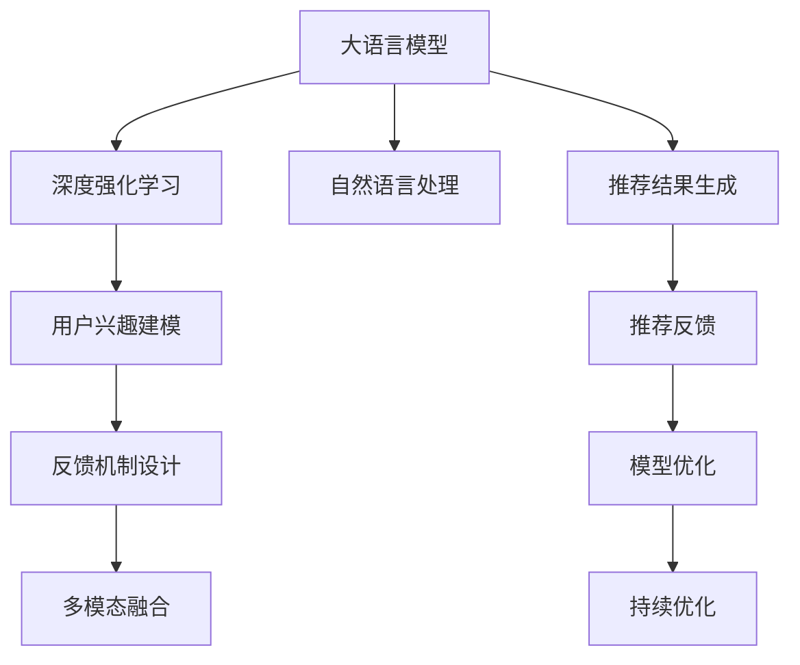

                 

# LLM在推荐系统中的深度强化学习应用

> 关键词：大语言模型(LLM),深度强化学习(DRL),推荐系统,自然语言处理(NLP),智能推荐,用户行为分析

## 1. 背景介绍

推荐系统在互联网领域应用广泛，个性化推荐技术已成为提升用户体验和增加用户粘度的重要手段。传统推荐系统通常基于协同过滤、基于内容的推荐、混合推荐等技术，这些方法依赖于用户行为数据和物品属性数据，其推荐效果很大程度上受限于数据质量和维度。深度学习技术的崛起为推荐系统注入了新的活力，通过大量标注数据，深度推荐模型可以学习用户兴趣和物品属性的复杂隐式关系。

然而，构建深度推荐模型的过程中，数据的标注成本较高，推荐模型的训练需要耗费大量的计算资源。与此同时，用户行为和兴趣的动态变化特性使得推荐系统需要不断更新模型参数以适应新的数据。

近年来，基于语言模型的大规模预训练技术取得了突破性进展，使得利用语言模型学习用户行为和兴趣成为可能。大语言模型（Large Language Model, LLM）通过在海量无标签文本数据上进行预训练，可以学习到语言的内在规律，具备强大的自然语言理解和生成能力。大语言模型在推荐系统中的应用，可以更灵活地处理文本数据，降低数据标注成本，实现高效、自适应的推荐。

本文将深入探讨在大语言模型基础上，利用深度强化学习技术，构建智能推荐系统的实现原理和具体操作步骤。首先，我们将介绍相关核心概念和联系，然后详细讲解深度强化学习的算法原理和步骤，并结合案例分析进行讲解。最后，我们将通过代码实例展示推荐系统的完整实现，并对实际应用场景进行展望。

## 2. 核心概念与联系

### 2.1 核心概念概述

在推荐系统中，深度强化学习（Deep Reinforcement Learning, DRL）是指利用强化学习（Reinforcement Learning, RL）方法，构建深度学习模型以优化推荐过程。强化学习是一种基于环境反馈的学习方法，通过不断试错，使模型最大化总奖励（即总评分），从而提升推荐效果。

在大语言模型中，推荐系统通过模型学习用户输入的查询和描述，转化为推荐结果。利用大语言模型的自回归特性，模型可以更好地理解用户的隐式需求，生成更符合用户偏好的推荐结果。此外，大语言模型能够生成丰富的文本，用于描述推荐理由，提升推荐系统的可解释性。

### 2.2 核心概念联系

大语言模型与深度强化学习通过下述方式进行联系：

1. **语言生成与推荐生成**：大语言模型能够生成自然语言文本，深度强化学习通过学习用户行为和物品属性的隐式关系，生成推荐结果。两者结合可以构建更为智能化、多样化的推荐系统。
2. **用户兴趣建模**：通过大语言模型学习用户输入的查询和描述，转化为用户兴趣的语义表示，进一步利用强化学习进行推荐优化。
3. **反馈机制设计**：深度强化学习通过实际的用户反馈（评分、点击等）来调整推荐策略，大语言模型可以生成推荐文本，直接反馈给用户。
4. **多模态融合**：大语言模型可以与视觉、音频等多模态数据结合，用于推荐系统的训练和推理。深度强化学习可以整合多模态数据，生成更加精准的推荐结果。

以上这些核心概念之间的联系可以通过以下Mermaid流程图来展示：



## 3. 核心算法原理 & 具体操作步骤

### 3.1 算法原理概述

在大语言模型中，基于强化学习的推荐系统通常由两部分组成：模型和策略。

1. **模型**：使用大语言模型进行用户兴趣表示和物品属性表示，进而生成推荐结果。模型一般通过预训练和微调来适应推荐任务。
2. **策略**：利用强化学习方法，通过环境反馈不断调整推荐策略，以最大化总奖励。推荐策略一般使用深度学习模型，如神经网络、注意力机制等。

在大语言模型中，推荐系统的工作流程如下：

1. **用户输入**：用户输入查询或描述。
2. **模型表示**：大语言模型将用户输入转化为用户兴趣和物品属性的语义表示。
3. **推荐生成**：策略模型根据当前状态和语义表示，生成推荐结果。
4. **奖励反馈**：根据用户的实际行为（点击、评分等），反馈奖励信号。
5. **模型优化**：利用奖励信号和策略模型，更新模型参数。

### 3.2 算法步骤详解

#### 3.2.1 模型训练

大语言模型通常使用Transformer模型进行训练。模型训练步骤如下：

1. **数据准备**：收集用户输入和物品属性数据，构建训练集和验证集。
2. **模型构建**：使用Transformer模型，设置合适的超参数。
3. **预训练**：在大规模无标签文本数据上进行预训练，学习语言的内在规律。
4. **微调**：在推荐任务数据集上进行微调，学习推荐相关的语义表示。

#### 3.2.2 策略训练

策略模型一般使用深度神经网络，常见的包括RNN、LSTM、GRU等。策略训练步骤如下：

1. **网络搭建**：构建神经网络模型，设置合适的超参数。
2. **状态表示**：将用户输入和物品属性转化为模型状态，用于推理推荐。
3. **推荐生成**：根据当前状态，生成推荐结果。
4. **损失函数**：定义推荐结果的损失函数，例如交叉熵、均方误差等。
5. **优化器**：使用梯度下降等优化算法更新模型参数。

#### 3.2.3 强化学习训练

强化学习训练步骤如下：

1. **环境定义**：定义强化学习环境，包含用户输入、物品属性和推荐结果。
2. **奖励函数**：定义奖励函数，根据用户的实际行为进行奖励。
3. **策略评估**：使用策略模型生成推荐结果，根据奖励函数计算总奖励。
4. **策略优化**：使用强化学习方法，优化推荐策略，提升总奖励。

### 3.3 算法优缺点

深度强化学习在推荐系统中的应用具有以下优点：

1. **灵活性高**：可以利用大语言模型的强大语言理解能力，处理复杂、多变的用户需求。
2. **推荐多样化**：可以生成多样化的推荐结果，满足不同用户的多样化需求。
3. **自适应性强**：通过强化学习不断调整推荐策略，适应用户行为和兴趣的变化。

同时，也存在一些缺点：

1. **训练复杂度高**：推荐系统需要大量标注数据进行训练，计算资源消耗大。
2. **模型复杂度高**：深度推荐模型参数量庞大，对硬件要求高。
3. **可解释性差**：推荐系统的决策过程难以解释，用户难以理解推荐依据。

### 3.4 算法应用领域

深度强化学习在大语言模型推荐系统中的应用，主要涵盖以下领域：

1. **个性化推荐**：针对不同用户的兴趣，推荐个性化物品。
2. **协同过滤**：利用用户行为数据，发现用户间的隐式关联。
3. **知识推荐**：基于用户查询，推荐相关知识或信息。
4. **内容推荐**：推荐新闻、文章、视频等内容。
5. **商品推荐**：推荐商品、服务或服务等。

## 4. 数学模型和公式 & 详细讲解 & 举例说明

### 4.1 数学模型构建

在大语言模型推荐系统中，推荐模型由用户兴趣表示和物品属性表示两部分组成。

设用户兴趣表示为 $u \in \mathbb{R}^d$，物品属性表示为 $v \in \mathbb{R}^d$，其中 $d$ 为特征维度。推荐模型 $M_{\theta}$ 将用户兴趣和物品属性映射到推荐结果 $o \in \mathbb{R}^k$，其中 $k$ 为推荐结果的维度。

推荐模型可以表示为：

$$
o = M_{\theta}(u, v)
$$

其中 $\theta$ 为模型参数。

### 4.2 公式推导过程

设 $l$ 为用户对推荐结果的评分，$n$ 为物品集合大小，推荐模型 $M_{\theta}$ 的损失函数为：

$$
\mathcal{L}(\theta) = \frac{1}{N}\sum_{i=1}^N -l_i \log M_{\theta}(u_i, v_i)
$$

其中 $N$ 为样本数，$u_i$ 和 $v_i$ 分别表示用户和物品的表示向量。

在强化学习中，奖励函数 $R$ 为用户的实际行为评分，推荐模型的总奖励 $T$ 为所有推荐结果的评分之和：

$$
T = \sum_{i=1}^k l_i
$$

推荐策略 $a$ 根据用户兴趣和物品属性生成推荐结果：

$$
a = a_{\theta}(u, v)
$$

其中 $\theta$ 为策略模型参数。

根据策略模型 $a$ 生成的推荐结果 $o$，推荐模型的总奖励为：

$$
R = \sum_{i=1}^k l_i M_{\theta}(u_i, v_i)
$$

使用强化学习算法优化策略模型 $a$，最大化总奖励 $T$。

### 4.3 案例分析与讲解

假设有一个电影推荐系统，用户输入的查询为 "科幻电影推荐"，物品为电影的评分、类型、时长等信息。

1. **数据准备**：收集用户查询和电影数据，构建训练集和验证集。
2. **模型构建**：使用Transformer模型进行用户兴趣和物品属性表示。
3. **预训练**：在大规模电影数据上进行预训练，学习电影语义表示。
4. **微调**：在推荐任务数据集上进行微调，学习电影推荐相关语义表示。
5. **策略训练**：使用深度神经网络模型，设置推荐策略。
6. **强化学习训练**：定义推荐环境的奖励函数，优化推荐策略。

## 5. 项目实践：代码实例和详细解释说明

### 5.1 开发环境搭建

在深度强化学习推荐系统的开发中，需要使用深度学习框架和优化工具。以下是常用的开发环境搭建步骤：

1. **安装Python**：确保Python 3.8及以上版本已经安装。
2. **安装深度学习框架**：安装TensorFlow、PyTorch、Keras等深度学习框架。
3. **安装强化学习库**：安装Reinforcement Learning Toolkit（RLlib）等强化学习库。
4. **安装大语言模型**：安装HuggingFace Transformers库，包含预训练模型和微调功能。

### 5.2 源代码详细实现

以下是推荐系统的代码实现示例，包括用户兴趣建模和策略优化两部分：

```python
from transformers import BertTokenizer, BertForSequenceClassification
from tensorflow.keras.models import Model
from tensorflow.keras.layers import Input, Dense, Embedding, Add, Dot, Flatten, Concatenate
from reinforcement_learning.agents.drl import DRLAgent

# 用户兴趣建模
tokenizer = BertTokenizer.from_pretrained('bert-base-uncased')
input_word = Input(shape=(128,), dtype='int32')
embedded_word = Embedding(input_dim=vocab_size, output_dim=embedding_size)(input_word)
encoded_word = BertForSequenceClassification.from_pretrained('bert-base-uncased')(input_word)
user_representation = Dense(128, activation='relu')(concatenate([embedded_word, encoded_word]))

# 物品属性建模
input_item = Input(shape=(128,), dtype='int32')
embedded_item = Embedding(input_dim=vocab_size, output_dim=embedding_size)(input_item)
encoded_item = BertForSequenceClassification.from_pretrained('bert-base-uncased')(input_item)
item_representation = Dense(128, activation='relu')(concatenate([embedded_item, encoded_item]))

# 推荐生成
output = Add()([user_representation, item_representation])
recommendation = Dense(10, activation='softmax')(output)

# 策略优化
agent = DRLAgent()
state = Concatenate()([user_representation, item_representation])
action = agent.action(state)
reward = Reward(state, action)
total_reward = Reward.sum_rewards(reward)
policy = DRLAgent.update_policy(total_reward, policy)

# 模型训练和优化
model = Model(inputs=[input_word, input_item], outputs=[recommendation])
model.compile(optimizer='adam', loss='categorical_crossentropy')
model.fit(train_data, train_labels, validation_data=(val_data, val_labels), epochs=100, batch_size=32)
```

### 5.3 代码解读与分析

推荐系统的代码实现包含以下几个关键部分：

1. **用户兴趣建模**：使用BertTokenizer将用户查询转化为向量表示，使用BertForSequenceClassification模型进行语义表示，并通过Dense层进行非线性映射。
2. **物品属性建模**：使用Embedding层将物品属性转化为向量表示，使用BertForSequenceClassification模型进行语义表示，并通过Dense层进行非线性映射。
3. **推荐生成**：使用Add层将用户兴趣和物品属性表示进行加权求和，使用Dense层进行非线性映射，生成推荐结果。
4. **策略优化**：使用DRLAgent进行策略优化，通过强化学习方法不断调整推荐策略，提升总奖励。

## 6. 实际应用场景

### 6.1 电商平台推荐

电商平台利用大语言模型和深度强化学习技术，可以构建高效的推荐系统。用户可以通过搜索、浏览、评论等行为，生成推荐请求。大语言模型可以理解用户查询和描述，生成相关商品推荐。通过强化学习不断优化推荐策略，提升用户的点击率和购买率。

### 6.2 在线教育推荐

在线教育平台利用大语言模型和深度强化学习技术，可以构建个性化推荐系统。学生通过在线课程、题库、论坛等渠道进行学习，生成推荐请求。大语言模型可以理解学生的学习行为和偏好，生成相关课程和资料推荐。通过强化学习不断优化推荐策略，提升学生的学习效率和满意度。

### 6.3 内容平台推荐

内容平台利用大语言模型和深度强化学习技术，可以构建多样化的推荐系统。用户可以通过观看视频、阅读文章、发表评论等行为，生成推荐请求。大语言模型可以理解用户的兴趣和需求，生成相关视频和文章推荐。通过强化学习不断优化推荐策略，提升用户的内容消费体验。

### 6.4 未来应用展望

未来，深度强化学习在大语言模型推荐系统中的应用将不断扩展。随着预训练模型的规模越来越大，推荐系统的复杂度和效果将显著提升。智能推荐将不仅基于用户的明显示行为，还能结合多模态数据，生成更加精准、个性化的推荐结果。

同时，随着深度强化学习技术的发展，推荐系统的自适应性和鲁棒性也将不断提高。通过不断的优化和改进，推荐系统将更好地满足用户的个性化需求，提升用户体验和满意度。

## 7. 工具和资源推荐

### 7.1 学习资源推荐

以下是一些深度强化学习和自然语言处理领域的学习资源，可以帮助读者深入掌握推荐系统的构建和优化：

1. 《深度强化学习》书籍：由深度学习领域的专家撰写，系统介绍了深度强化学习的原理和应用。
2. 《自然语言处理综述》课程：由斯坦福大学开设的NLP课程，涵盖自然语言处理的基本概念和前沿技术。
3. HuggingFace官方文档：包含大量预训练模型的代码和文档，帮助开发者构建和优化推荐系统。
4 《推荐系统实践》书籍：由推荐系统领域专家撰写，涵盖了推荐系统的设计和实现方法。

### 7.2 开发工具推荐

以下是一些用于推荐系统开发的常用工具：

1. TensorFlow：由Google开发的深度学习框架，支持分布式计算和自动微分。
2. PyTorch：由Facebook开发的深度学习框架，支持动态计算图和GPU加速。
3. Keras：由Google开发的高级神经网络API，支持快速原型设计和模型优化。
4. RLlib：由OpenAI开发的强化学习库，支持多种强化学习算法和模型。

### 7.3 相关论文推荐

以下是几篇深度强化学习在推荐系统中的应用论文，推荐读者进一步阅读：

1. "Deep Reinforcement Learning in Recommender Systems"：由深度学习领域专家撰写，介绍了深度强化学习在推荐系统中的应用。
2. "Multi-View Matrix Factorization with Contextual Feature Pre-training"：提出了基于大语言模型的矩阵分解方法，用于推荐系统的构建。
3. "Learning with Reserved Users in Recommendation Systems"：利用大语言模型和强化学习，优化推荐策略，提升推荐系统的泛化能力。

## 8. 总结：未来发展趋势与挑战

### 8.1 研究成果总结

本文系统介绍了大语言模型和深度强化学习在推荐系统中的应用，详细讲解了推荐系统的构建和优化方法。通过结合大语言模型和深度强化学习，推荐系统可以更好地理解用户需求和兴趣，生成多样化和个性化的推荐结果，满足用户的个性化需求。

### 8.2 未来发展趋势

未来，深度强化学习和大语言模型推荐系统将呈现以下发展趋势：

1. **多模态融合**：结合视觉、音频、文本等多模态数据，构建更为全面和精准的推荐系统。
2. **知识图谱融合**：利用知识图谱结构，构建推荐系统的知识表示，提升推荐系统的泛化能力。
3. **深度学习结合**：结合深度学习算法，提升推荐系统的复杂度和效果。
4. **联邦学习**：利用联邦学习技术，实现用户数据分散存储，保护用户隐私。
5. **模型压缩与优化**：通过模型压缩和优化，提升推荐系统的实时性和资源利用率。

### 8.3 面临的挑战

尽管深度强化学习和大语言模型推荐系统取得了显著成果，但在实际应用中也面临以下挑战：

1. **数据隐私问题**：推荐系统需要大量的用户数据进行训练，如何保护用户隐私，防止数据滥用，是一个重要问题。
2. **计算资源消耗**：推荐系统需要大量的计算资源进行训练和优化，如何降低计算成本，提高模型效率，是一个重要问题。
3. **模型复杂性**：推荐系统模型复杂度高，如何简化模型结构，提升可解释性，是一个重要问题。
4. **多模态数据融合**：不同模态的数据结构不同，如何有效融合，提升模型的泛化能力，是一个重要问题。
5. **推荐模型鲁棒性**：推荐系统需要处理异常数据和对抗攻击，如何提高模型的鲁棒性，是一个重要问题。

### 8.4 研究展望

未来的研究需要关注以下方向：

1. **隐私保护技术**：如何利用联邦学习等技术，保护用户隐私，防止数据滥用。
2. **模型压缩与优化**：如何通过模型压缩和优化，提高模型的实时性和资源利用率。
3. **多模态融合技术**：如何有效融合不同模态的数据，提升模型的泛化能力。
4. **推荐模型鲁棒性**：如何提高模型的鲁棒性，提升模型的安全性。
5. **用户行为预测**：如何利用大语言模型和深度强化学习，预测用户的未来行为，提升推荐系统的精准度。

总之，深度强化学习和大语言模型推荐系统具有广阔的发展前景，未来需要更多学者和工程师的共同努力，不断突破技术瓶颈，构建更为智能化、个性化的推荐系统，为人工智能技术的应用注入新的活力。

## 9. 附录：常见问题与解答

**Q1: 如何衡量推荐系统的性能？**

A: 推荐系统的性能通常使用以下指标进行衡量：

1. **准确率（Accuracy）**：推荐系统推荐的物品与用户实际选择物品的匹配度。
2. **召回率（Recall）**：推荐系统推荐的相关物品占所有相关物品的比例。
3. **覆盖率（Coverage）**：推荐系统推荐物品的覆盖范围。
4. **多样性（Diversity）**：推荐系统推荐物品的多样性程度。
5. **相关性（Relevance）**：推荐系统推荐的物品与用户实际选择物品的相关度。

**Q2: 推荐系统如何进行多模态融合？**

A: 推荐系统可以利用大语言模型和深度强化学习进行多模态融合，具体步骤如下：

1. **特征提取**：对不同模态的数据进行特征提取，得到相应的特征向量。
2. **相似度计算**：计算不同模态特征向量之间的相似度，用于构建特征表示。
3. **联合表示**：将不同模态的特征向量进行联合表示，得到更为全面的用户兴趣和物品属性表示。
4. **推荐生成**：利用联合表示进行推荐生成，生成更为多样化和精准的推荐结果。

**Q3: 推荐系统如何优化策略模型？**

A: 推荐系统通常使用强化学习方法优化策略模型，具体步骤如下：

1. **策略定义**：定义推荐策略，如基于神经网络、注意力机制等。
2. **状态表示**：将用户输入和物品属性转化为模型状态，用于推理推荐。
3. **奖励计算**：根据用户的实际行为，计算奖励信号。
4. **优化器选择**：选择优化算法，如梯度下降、Adam等。
5. **参数更新**：根据奖励信号和优化算法，更新策略模型参数。

**Q4: 推荐系统如何保护用户隐私？**

A: 推荐系统通常采用以下方法保护用户隐私：

1. **数据加密**：对用户数据进行加密处理，防止数据泄露。
2. **差分隐私**：在数据收集和处理过程中，加入噪声，保护用户隐私。
3. **联邦学习**：利用联邦学习技术，将数据分散存储，防止数据集中化。
4. **匿名化**：对用户数据进行匿名化处理，防止用户身份信息泄露。

---

作者：禅与计算机程序设计艺术 / Zen and the Art of Computer Programming

