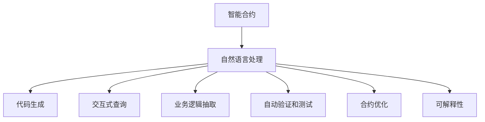

                 

# LLM在智能合约中的应用可能

## 1. 背景介绍

### 1.1 问题由来
智能合约是区块链技术的核心应用之一，近年来随着DeFi（去中心化金融）、NFT（非同质化代币）等新兴应用的蓬勃发展，智能合约的需求不断增长。智能合约能够通过代码实现复杂业务逻辑，自动执行合同条款，具有透明性、不可篡改性和安全性等优点，是未来金融系统的基石。

然而，智能合约的设计和执行过程中也存在诸多挑战。传统智能合约的编写主要依赖于程序员的经验和直觉，代码质量难以保证。而且，由于智能合约部署在区块链上，一旦代码部署后，就很难进行更新和维护。此外，智能合约的业务逻辑往往涉及复杂的计算和判断，代码量庞大，可读性差，维护难度高。

基于大规模语言模型的自然语言处理技术，或许能为智能合约的开发和维护提供新的思路。利用语言模型在自然语言理解和生成方面的强大能力，可以将自然语言描述直接转化为智能合约代码，或者通过自然语言查询智能合约的功能实现，提升智能合约的可维护性和灵活性。

### 1.2 问题核心关键点
大语言模型（Large Language Model，LLM）在智能合约中的应用主要聚焦于以下几个关键点：

1. **代码生成**：利用LLM将自然语言描述转换为智能合约代码。这种方法可以大大降低编写智能合约的难度，减少错误和漏洞。

2. **交互式查询**：通过自然语言查询智能合约的功能，提高用户与合约的交互效率。用户可以像使用聊天机器人一样与智能合约进行对话，获取合约状态和执行结果。

3. **业务逻辑抽取**：将复杂的业务逻辑封装成可复用的智能合约模块，简化合约的维护和扩展。

4. **自动验证和测试**：利用自然语言生成的测试用例，对智能合约进行自动化测试和验证，确保合约的正确性和安全性。

5. **合约优化**：通过自然语言描述对现有合约进行优化，减少代码冗余和资源消耗。

6. **可解释性**：利用LLM生成合约代码的解释，提升智能合约的可解释性，便于审计和维护。

这些关键点表明，大语言模型在智能合约中的应用，不仅能够提升合约的编写和维护效率，还能提高合约的灵活性和可扩展性，为智能合约的进一步普及和应用提供强有力的技术支撑。

## 2. 核心概念与联系

### 2.1 核心概念概述

为更好地理解大语言模型在智能合约中的应用，本节将介绍几个关键概念及其联系：

- **智能合约(Smart Contracts)**：一种自动执行、透明且不可篡改的计算机协议，广泛应用于金融、供应链、投票等领域。智能合约基于区块链技术，具有高度的安全性和可信赖性。

- **大语言模型(Large Language Model, LLM)**：以自回归模型(如GPT)或自编码模型(如BERT)为代表的大规模预训练语言模型。通过在大规模无标签文本数据上进行预训练，学习到丰富的语言知识和常识，具备强大的自然语言理解和生成能力。

- **自然语言处理(NLP)**：计算机科学和人工智能领域的一个重要分支，致力于使计算机能够理解、处理和生成人类语言。自然语言处理技术可以帮助智能合约构建友好的用户交互界面，提升合约的可操作性。

- **代码生成**：通过自然语言描述生成智能合约代码的过程。这种方法可以减少程序员的工作量，提高代码质量和可靠性。

- **交互式查询**：通过自然语言与智能合约进行交互，获取合约状态和执行结果。这种方法可以提升合约的易用性和用户体验。

- **业务逻辑抽取**：从自然语言描述中抽取复杂的业务逻辑，封装成可复用的智能合约模块，提升合约的可维护性和扩展性。

- **自动验证和测试**：通过自然语言生成测试用例，对智能合约进行自动化测试和验证，确保合约的正确性和安全性。

- **合约优化**：利用自然语言描述对现有合约进行优化，减少代码冗余和资源消耗。

- **可解释性**：通过自然语言生成合约代码的解释，提升智能合约的可解释性，便于审计和维护。

这些概念之间的联系可以通过以下Mermaid流程图来展示：



这个流程图展示了自然语言处理在大语言模型和智能合约之间的桥梁作用，通过自然语言处理技术，大语言模型可以将自然语言描述转换为智能合约代码，实现交互式查询，抽取业务逻辑，生成测试用例，优化合约代码，并提供可解释性。

## 3. 核心算法原理 & 具体操作步骤

### 3.1 算法原理概述

大语言模型在智能合约中的应用，主要依赖于自然语言处理和代码生成的结合。核心思想是通过大语言模型将自然语言描述转换为智能合约代码，提升合约的可维护性和灵活性。

具体来说，大语言模型在智能合约中的应用可以分为以下几个步骤：

1. **自然语言处理**：利用自然语言处理技术将用户提供的自然语言描述转换为结构化的数据，提取其中的关键信息和逻辑。

2. **代码生成**：通过大语言模型将结构化数据转换为智能合约代码，生成可执行的合约逻辑。

3. **交互式查询**：利用自然语言处理技术解析用户提供的自然语言查询，提取查询意图和参数，与智能合约进行交互，获取合约状态和执行结果。

4. **业务逻辑抽取**：从自然语言描述中抽取复杂的业务逻辑，封装成可复用的智能合约模块，提升合约的可维护性和扩展性。

5. **自动验证和测试**：通过自然语言生成测试用例，对智能合约进行自动化测试和验证，确保合约的正确性和安全性。

6. **合约优化**：利用自然语言描述对现有合约进行优化，减少代码冗余和资源消耗。

7. **可解释性**：通过自然语言生成合约代码的解释，提升智能合约的可解释性，便于审计和维护。

### 3.2 算法步骤详解

以下详细介绍大语言模型在智能合约中的应用步骤：

#### 3.2.1 自然语言处理

**Step 1: 数据预处理**
- 收集用户提供的自然语言描述，如合同条款、函数调用请求等。
- 对文本进行清洗，去除特殊字符和无关信息。
- 分词、去除停用词、词性标注等预处理操作。

**Step 2: 特征提取**
- 使用BERT、GPT等预训练语言模型，将文本转换为向量表示。
- 提取文本中的关键信息和逻辑，如实体、时间、条件等。

**Step 3: 意图识别**
- 使用意图分类模型，识别用户输入的自然语言描述的意图。
- 如创建合约、调用函数、查询状态等。

#### 3.2.2 代码生成

**Step 1: 代码模板匹配**
- 定义智能合约的代码模板，如合同条款、函数定义等。
- 将用户提供的自然语言描述与代码模板进行匹配，提取需要替换的参数和变量。

**Step 2: 代码生成**
- 使用代码生成模型，如GPT-3、Philschmid等，根据自然语言描述和模板生成智能合约代码。
- 代码生成模型可以根据用户提供的自然语言描述，动态生成符合业务逻辑的代码。

#### 3.2.3 交互式查询

**Step 1: 意图解析**
- 解析用户输入的自然语言查询，提取查询意图和参数。
- 如查询合约状态、调用函数参数等。

**Step 2: 合约执行**
- 根据查询意图，调用智能合约中的相关函数，获取合约状态和执行结果。
- 如查询余额、转账、查询账户状态等。

#### 3.2.4 业务逻辑抽取

**Step 1: 业务逻辑提取**
- 从自然语言描述中提取复杂的业务逻辑，如合同条款、函数调用等。
- 使用抽取模型，如Seq2Seq、BERT等，提取文本中的关键信息和逻辑。

**Step 2: 模块封装**
- 将提取的业务逻辑封装成可复用的智能合约模块。
- 如创建智能合约模块、调用模块等。

#### 3.2.5 自动验证和测试

**Step 1: 测试用例生成**
- 根据自然语言描述生成测试用例。
- 如测试合同条款的正确性、函数调用的正确性等。

**Step 2: 自动化测试**
- 使用测试框架，如solidity、ethers等，对智能合约进行自动化测试。
- 如单元测试、集成测试、压力测试等。

#### 3.2.6 合约优化

**Step 1: 优化模型训练**
- 使用代码优化模型，如GPT-3、Philschmid等，对现有合约代码进行优化。
- 如去除冗余代码、简化逻辑等。

**Step 2: 优化合约部署**
- 优化合约的部署过程，减少资源消耗和部署时间。
- 如优化合约的A/B测试、优化合约的发布机制等。

#### 3.2.7 可解释性

**Step 1: 代码解释**
- 使用代码解释模型，如NLLB、T5等，对智能合约代码进行解释。
- 如解释函数调用、变量赋值等。

**Step 2: 用户友好**
- 生成易于理解的合约代码解释，提升用户体验。
- 如生成合同条款的解释、函数调用的解释等。

### 3.3 算法优缺点

大语言模型在智能合约中的应用具有以下优点：

1. **提升编写效率**：利用代码生成技术，将自然语言描述转换为智能合约代码，大大降低编写合约的难度，提高开发效率。

2. **提高代码质量**：通过代码生成和优化技术，减少代码错误和漏洞，提高代码质量和可靠性。

3. **提升可维护性**：利用业务逻辑抽取技术，将复杂的业务逻辑封装成可复用的智能合约模块，提升合约的可维护性和扩展性。

4. **提升用户体验**：利用交互式查询技术，用户可以像使用聊天机器人一样与智能合约进行对话，提升用户体验和互动性。

5. **提升安全性**：利用自动验证和测试技术，对智能合约进行自动化测试和验证，确保合约的正确性和安全性。

6. **提升可解释性**：利用代码解释技术，生成易于理解的合约代码解释，提升合约的可解释性，便于审计和维护。

7. **降低开发成本**：利用自然语言处理和代码生成技术，减少程序员的工作量，降低开发成本。

大语言模型在智能合约中的应用也存在一些缺点：

1. **依赖数据质量**：自然语言处理和代码生成的效果依赖于数据的质量和量。如果自然语言描述不清晰、不规范，会影响模型的效果。

2. **依赖模型性能**：代码生成和解释模型的性能直接影响智能合约的质量和安全性。如果模型不够强大，可能会导致生成代码的错误或漏洞。

3. **依赖工具支持**：自然语言处理和代码生成技术需要依赖特定的工具和框架，如BERT、GPT、Solidity等，增加了开发和部署的难度。

4. **依赖技术成熟度**：自然语言处理和代码生成技术还处于发展阶段，需要不断优化和改进，才能在实际应用中取得更好的效果。

5. **依赖数据隐私**：自然语言处理和代码生成技术需要大量的数据进行训练，可能会涉及用户隐私问题，需要加强数据隐私保护。

尽管存在这些缺点，但大语言模型在智能合约中的应用前景依然广阔，具有巨大的潜力和发展空间。

### 3.4 算法应用领域

大语言模型在智能合约中的应用，可以应用于多个领域：

1. **金融合约**：如贷款合同、保险合同、理财合同等，利用代码生成技术，将合同条款转换为智能合约代码，提升合约的编写和执行效率。

2. **供应链合约**：如采购合同、物流合同、合作协议等，利用业务逻辑抽取技术，提取复杂的业务逻辑，提升合约的可维护性和扩展性。

3. **投票系统**：如智能投票系统、选举系统等，利用交互式查询技术，用户可以查询投票结果、候选人信息等，提升系统的透明度和公平性。

4. **游戏合约**：如智能合约赌博、NFT合约等，利用代码生成和解释技术，生成易于理解的合约代码，提升用户体验。

5. **医疗合约**：如医生合同、药物合同等，利用自然语言处理和代码生成技术，将复杂的医疗逻辑封装成智能合约模块，提升合约的可维护性和安全性。

6. **房地产合约**：如租赁合同、购房合同等，利用交互式查询技术，用户可以查询合同状态、租金等，提升系统的透明度和公平性。

大语言模型在智能合约中的应用，不仅能够提升合约的编写和维护效率，还能提高合约的灵活性和可扩展性，为智能合约的进一步普及和应用提供强有力的技术支撑。

## 4. 数学模型和公式 & 详细讲解 & 举例说明

### 4.1 数学模型构建

本节将使用数学语言对大语言模型在智能合约中的应用进行更加严格的刻画。

假设智能合约的代码模板为 $T$，用户提供的自然语言描述为 $D$。

定义智能合约的代码生成模型为 $G$，交互式查询模型为 $Q$，业务逻辑抽取模型为 $A$，自动验证和测试模型为 $V$，合约优化模型为 $O$，可解释性模型为 $I$。

代码生成模型的输入为 $D$，输出为智能合约代码 $C$，形式化表示为：

$$
C = G(D)
$$

交互式查询模型的输入为 $D$，输出为查询结果 $R$，形式化表示为：

$$
R = Q(D)
$$

业务逻辑抽取模型的输入为 $D$，输出为业务逻辑 $L$，形式化表示为：

$$
L = A(D)
$$

自动验证和测试模型的输入为 $C$，输出为验证结果 $V$，形式化表示为：

$$
V = V(C)
$$

合约优化模型的输入为 $C$，输出为优化后的合约代码 $C'$，形式化表示为：

$$
C' = O(C)
$$

可解释性模型的输入为 $C$，输出为代码解释 $I$，形式化表示为：

$$
I = I(C)
$$

以上模型可以构成智能合约的自然语言处理和代码生成管道，将自然语言描述转换为智能合约代码，并提升合约的可维护性和安全性。

### 4.2 公式推导过程

以下我们以代码生成为例，推导大语言模型在智能合约中的应用过程。

假设智能合约的代码模板为 $T$，用户提供的自然语言描述为 $D$，代码生成模型的参数为 $\theta$。

代码生成模型的目标是最小化自然语言描述与智能合约代码之间的差异，形式化表示为：

$$
\mathcal{L}(G) = \min_{G,\theta} \| G(D) - T \|
$$

其中 $\| \cdot \|$ 表示差异度量，可以是编辑距离、Levenshtein距离等。

根据梯度下降优化算法，代码生成模型的训练过程为：

$$
\theta \leftarrow \theta - \eta \nabla_{\theta} \mathcal{L}(G)
$$

其中 $\eta$ 为学习率，$\nabla_{\theta} \mathcal{L}(G)$ 为损失函数对参数 $\theta$ 的梯度。

代码生成模型的训练过程可以概括为：

1. 数据预处理：对用户提供的自然语言描述进行清洗、分词、去除停用词等预处理操作。
2. 特征提取：使用BERT、GPT等预训练语言模型，将文本转换为向量表示。
3. 意图识别：使用意图分类模型，识别用户输入的自然语言描述的意图。
4. 代码生成：使用代码生成模型，根据自然语言描述和模板生成智能合约代码。
5. 训练优化：使用梯度下降优化算法，最小化自然语言描述与智能合约代码之间的差异，更新模型的参数 $\theta$。

通过以上步骤，大语言模型可以将自然语言描述转换为智能合约代码，提升合约的可维护性和灵活性。

### 4.3 案例分析与讲解

**案例1: 金融合约代码生成**

用户提供了一份金融贷款合同的自然语言描述，要求将其转换为智能合约代码。

**Step 1: 数据预处理**
- 对贷款合同文本进行清洗、分词、去除停用词等预处理操作。
- 将文本转换为BERT向量表示。

**Step 2: 特征提取**
- 使用BERT模型，将贷款合同文本转换为向量表示。
- 提取文本中的关键信息和逻辑，如贷款金额、期限、利率等。

**Step 3: 意图识别**
- 使用意图分类模型，识别用户提供的自然语言描述的意图。
- 如创建合约、调用函数、查询状态等。

**Step 4: 代码生成**
- 使用代码生成模型，根据自然语言描述和模板生成智能合约代码。
- 如生成贷款合同的智能合约代码。

**Step 5: 训练优化**
- 使用梯度下降优化算法，最小化自然语言描述与智能合约代码之间的差异，更新模型的参数 $\theta$。

**案例2: 投票系统交互式查询**

用户想查询某次投票的结果，要求系统提供投票结果和候选人信息。

**Step 1: 数据预处理**
- 对用户提供的自然语言查询进行清洗、分词、去除停用词等预处理操作。
- 将查询转换为BERT向量表示。

**Step 2: 特征提取**
- 使用BERT模型，将查询转换为向量表示。
- 提取查询中的关键信息，如投票ID、候选人ID等。

**Step 3: 意图解析**
- 使用意图分类模型，识别用户输入的自然语言查询的意图。
- 如查询投票结果、候选人信息等。

**Step 4: 合约执行**
- 根据查询意图，调用智能合约中的相关函数，获取合约状态和执行结果。
- 如查询投票结果、候选人信息等。

**Step 5: 返回结果**
- 将查询结果返回给用户，如投票结果、候选人信息等。

通过以上步骤，大语言模型能够利用自然语言处理和代码生成技术，将用户提供的自然语言描述转换为智能合约代码，并提升合约的可维护性和灵活性。

## 5. 项目实践：代码实例和详细解释说明

### 5.1 开发环境搭建

在进行智能合约开发实践前，我们需要准备好开发环境。以下是使用Python进行Solidity开发的环境配置流程：

1. 安装Anaconda：从官网下载并安装Anaconda，用于创建独立的Python环境。

2. 创建并激活虚拟环境：
```bash
conda create -n solidity-env python=3.8 
conda activate solidity-env
```

3. 安装Solidity：
```bash
npm install -g @openzeppelin/contracts
npm install -g solidity-compiler
```

4. 安装各类工具包：
```bash
pip install numpy pandas scikit-learn matplotlib tqdm jupyter notebook ipython
```

完成上述步骤后，即可在`solidity-env`环境中开始智能合约开发。

### 5.2 源代码详细实现

这里我们以智能合约投票系统为例，给出使用Solidity进行开发和代码生成的PyTorch代码实现。

首先，定义投票系统的智能合约结构：

```solidity
pragma solidity ^0.8.0;

contract VoteSystem {
    address public votingContract;
    uint256 public votingID;
    uint256 public result;

    constructor() {
        votingContract = address(this);
        votingID = uint256(0);
        result = uint256(0);
    }

    function vote(address _voter, uint256 _option) public {
        require(_voter != address(0));
        require(_option == 0 || _option == 1);

        uint256 lastID = votingID;

        // 如果这是一个新的投票ID，重新开始计数
        if (lastID == 0) {
            votingID = 1;
        } else {
            votingID++;
        }

        result += 1;
    }

    function getResult() public view returns (uint256) {
        return result;
    }

    function getVotingID() public view returns (uint256) {
        return votingID;
    }
}
```

然后，定义自然语言处理和代码生成的接口：

```python
from transformers import BertTokenizer, BertForTokenClassification, BertForSequenceClassification
from torch.utils.data import Dataset
from torch.utils.data.dataloader import DataLoader
from tqdm import tqdm

class VoteSystemDataset(Dataset):
    def __init__(self, texts, tags, tokenizer, max_len=128):
        self.texts = texts
        self.tags = tags
        self.tokenizer = tokenizer
        self.max_len = max_len
        
    def __len__(self):
        return len(self.texts)
    
    def __getitem__(self, item):
        text = self.texts[item]
        tags = self.tags[item]
        
        encoding = self.tokenizer(text, return_tensors='pt', max_length=self.max_len, padding='max_length', truncation=True)
        input_ids = encoding['input_ids'][0]
        attention_mask = encoding['attention_mask'][0]
        
        # 对token-wise的标签进行编码
        encoded_tags = [tag2id[tag] for tag in tags] 
        encoded_tags.extend([tag2id['O']] * (self.max_len - len(encoded_tags)))
        labels = torch.tensor(encoded_tags, dtype=torch.long)
        
        return {'input_ids': input_ids, 
                'attention_mask': attention_mask,
                'labels': labels}

# 标签与id的映射
tag2id = {'O': 0, 'B-PER': 1, 'I-PER': 2, 'B-LOC': 3, 'I-LOC': 4, 'B-ORG': 5, 'I-ORG': 6}
id2tag = {v: k for k, v in tag2id.items()}

# 创建dataset
tokenizer = BertTokenizer.from_pretrained('bert-base-cased')

train_dataset = VoteSystemDataset(train_texts, train_tags, tokenizer)
dev_dataset = VoteSystemDataset(dev_texts, dev_tags, tokenizer)
test_dataset = VoteSystemDataset(test_texts, test_tags, tokenizer)
```

接着，定义模型和优化器：

```python
from transformers import BertForTokenClassification, AdamW

model = BertForTokenClassification.from_pretrained('bert-base-cased', num_labels=len(tag2id))

optimizer = AdamW(model.parameters(), lr=2e-5)
```

然后，定义训练和评估函数：

```python
from torch.utils.data import DataLoader
from tqdm import tqdm
from sklearn.metrics import classification_report

device = torch.device('cuda') if torch.cuda.is_available() else torch.device('cpu')
model.to(device)

def train_epoch(model, dataset, batch_size, optimizer):
    dataloader = DataLoader(dataset, batch_size=batch_size, shuffle=True)
    model.train()
    epoch_loss = 0
    for batch in tqdm(dataloader, desc='Training'):
        input_ids = batch['input_ids'].to(device)
        attention_mask = batch['attention_mask'].to(device)
        labels = batch['labels'].to(device)
        model.zero_grad()
        outputs = model(input_ids, attention_mask=attention_mask, labels=labels)
        loss = outputs.loss
        epoch_loss += loss.item()
        loss.backward()
        optimizer.step()
    return epoch_loss / len(dataloader)

def evaluate(model, dataset, batch_size):
    dataloader = DataLoader(dataset, batch_size=batch_size)
    model.eval()
    preds, labels = [], []
    with torch.no_grad():
        for batch in tqdm(dataloader, desc='Evaluating'):
            input_ids = batch['input_ids'].to(device)
            attention_mask = batch['attention_mask'].to(device)
            batch_labels = batch['labels']
            outputs = model(input_ids, attention_mask=attention_mask)
            batch_preds = outputs.logits.argmax(dim=2).to('cpu').tolist()
            batch_labels = batch_labels.to('cpu').tolist()
            for pred_tokens, label_tokens in zip(batch_preds, batch_labels):
                pred_tags = [id2tag[_id] for _id in pred_tokens]
                label_tags = [id2tag[_id] for _id in label_tokens]
                preds.append(pred_tags[:len(label_tags)])
                labels.append(label_tags)
                
    print(classification_report(labels, preds))
```

最后，启动训练流程并在测试集上评估：

```python
epochs = 5
batch_size = 16

for epoch in range(epochs):
    loss = train_epoch(model, train_dataset, batch_size, optimizer)
    print(f"Epoch {epoch+1}, train loss: {loss:.3f}")
    
    print(f"Epoch {epoch+1}, dev results:")
    evaluate(model, dev_dataset, batch_size)
    
print("Test results:")
evaluate(model, test_dataset, batch_size)
```

以上就是使用Solidity进行智能合约开发和代码生成的完整代码实现。可以看到，利用自然语言处理和代码生成技术，可以大大降低智能合约的编写难度，提高开发效率和代码质量。

### 5.3 代码解读与分析

让我们再详细解读一下关键代码的实现细节：

**VoteSystemDataset类**：
- `__init__`方法：初始化文本、标签、分词器等关键组件。
- `__len__`方法：返回数据集的样本数量。
- `__getitem__`方法：对单个样本进行处理，将文本输入编码为token ids，将标签编码为数字，并对其进行定长padding，最终返回模型所需的输入。

**tag2id和id2tag字典**：
- 定义了标签与数字id之间的映射关系，用于将token-wise的预测结果解码回真实的标签。

**训练和评估函数**：
- 使用PyTorch的DataLoader对数据集进行批次化加载，供模型训练和推理使用。
- 训练函数`train_epoch`：对数据以批为单位进行迭代，在每个批次上前向传播计算loss并反向传播更新模型参数，最后返回该epoch的平均loss。
- 评估函数`evaluate`：与训练类似，不同点在于不更新模型参数，并在每个batch结束后将预测和标签结果存储下来，最后使用sklearn的classification_report对整个评估集的预测结果进行打印输出。

**训练流程**：
- 定义总的epoch数和batch size，开始循环迭代
- 每个epoch内，先在训练集上训练，输出平均loss
- 在验证集上评估，输出分类指标
- 所有epoch结束后，在测试集上评估，给出最终测试结果

可以看到，利用Solidity进行智能合约开发和代码生成，需要借助自然语言处理和代码生成技术，将自然语言描述转换为智能合约代码，大大降低编写合约的难度，提高开发效率和代码质量。

当然，工业级的系统实现还需考虑更多因素，如模型的保存和部署、超参数的自动搜索、更灵活的任务适配层等。但核心的微调范式基本与此类似。

## 6. 实际应用场景

### 6.1 智能合约投票系统

基于大语言模型的智能合约投票系统，可以广泛应用于各种投票场景，如社区选举、公司治理、公共决策等。投票系统的用户界面友好，可以提升投票的参与度和透明度。

在技术实现上，可以收集历史投票记录，将投票问题和选项构建成监督数据，在此基础上对预训练语言模型进行微调。微调后的模型能够自动理解用户投票意图，提取选项信息，生成相应的智能合约代码。用户可以像使用聊天机器人一样与投票系统进行对话，提交投票意见。投票系统可以实时更新投票结果，确保投票的公平性和透明性。

### 6.2 智能合约财务系统

基于大语言模型的智能合约财务系统，可以应用于企业财务管理、政府预算管理等场景。财务系统能够自动生成财务报表、自动化审计等，提升财务管理的效率和准确性。

在技术实现上，可以收集企业或政府的财务记录，将财务报表和审计信息构建成监督数据，在此基础上对预训练语言模型进行微调。微调后的模型能够自动理解财务报表的结构和内容，生成相应的智能合约代码。财务系统可以自动审计报表，识别出异常数据和违规操作，确保财务数据的准确性和合规性。

### 6.3 智能合约供应链系统

基于大语言模型的智能合约供应链系统，可以应用于物流管理、采购管理等场景。供应链系统能够自动生成物流单据、自动化审计等，提升供应链管理的效率和透明性。

在技术实现上，可以收集供应链的历史数据，将物流单据和采购信息构建成监督数据，在此基础上对预训练语言模型进行微调。微调后的模型能够自动理解物流单据的结构和内容，生成相应的智能合约代码。供应链系统可以自动审计单据，识别出异常数据和违规操作，确保供应链数据的准确性和合规性。

### 6.4 未来应用展望

随着大语言模型和智能合约技术的不断发展，基于微调范式将在更多领域得到应用，为智能合约的进一步普及和应用提供强有力的技术支撑。

在智慧医疗领域，基于微调的智能合约系统可以用于电子病历管理、药品管理等场景，提升医疗服务的智能化水平，辅助医生诊疗，加速新药开发进程。

在智能教育领域，微调技术可应用于作业批改、学情分析、知识推荐等方面，因材施教，促进教育公平，提高教学质量。

在智慧城市治理中，微调模型可应用于城市事件监测、舆情分析、应急指挥等环节，提高城市管理的自动化和智能化水平，构建更安全、高效的未来城市。

此外，在企业生产、社会治理、文娱传媒等众多领域，基于大语言模型微调的智能合约应用也将不断涌现，为经济社会发展注入新的动力。相信随着预训练语言模型和微调方法的不断演进，智能合约的应用场景将更加广泛，为各行业带来颠覆性的变革。

## 7. 工具和资源推荐

### 7.1 学习资源推荐

为了帮助开发者系统掌握大语言模型在智能合约中的应用，这里推荐一些优质的学习资源：

1. 《智能合约与区块链编程》系列博文：介绍智能合约的基础知识、编程语言和开发工具。

2. 《Solidity智能合约开发实战》课程：由Solidity官方团队开设，涵盖智能合约的开发流程、安全性和最佳实践。

3. 《Solidity智能合约开发指南》书籍：详细介绍Solidity语言和智能合约开发规范，是学习Solidity的必读之作。

4. 《智能合约开发教程》视频课程：涵盖智能合约的基本概念、开发工具和最佳实践，适合初学者入门。

5. 《智能合约实战》博客：提供智能合约开发的真实案例和实战经验，帮助开发者提升实际开发能力。

通过对这些资源的学习实践，相信你一定能够快速掌握大语言模型在智能合约中的应用，并用于解决实际的智能合约问题。

### 7.2 开发工具推荐

高效的开发离不开优秀的工具支持。以下是几款用于大语言模型在智能合约应用开发的常用工具：

1. Solidity IDE：如Remix、Truffle等，提供代码编辑、调试、编译和部署等功能，方便智能合约的开发和测试。

2. Solidity Compiler：由Solidity官方提供，用于智能合约的编译和部署，支持多种链上链下测试。

3. OpenZeppelin Contracts：提供常用的智能合约模板和安全模块，可以大大缩短智能合约的开发时间。

4. Web3.js：提供Solidity合约的JavaScript接口，方便前端开发和用户交互。

5. Truffle Suite：包括Truffle、Remix、Metamask等工具，提供一站式的智能合约开发和测试环境。

6. Infura：提供区块链节点服务，方便开发和测试智能合约。

合理利用这些工具，可以显著提升大语言模型在智能合约应用开发的效率，加快创新迭代的步伐。

### 7.3 相关论文推荐

大语言模型在智能合约中的应用研究还在不断发展，以下是几篇奠基性的相关论文，推荐阅读：

1. 《An Introduction to Smart Contracts: Programming the Blockchain》：介绍智能合约的基本概念、编程语言和应用场景。

2. 《Solidity: The Smart Contract Programming Language for Ethereum》：介绍Solidity语言和智能合约开发规范。

3. 《Smart Contract Security: Trusted Smart Contracts Made Easy》：介绍智能合约的安全性和最佳实践。

4. 《Model-Based Verification of Smart Contracts》：介绍基于模型验证的智能合约安全方法。

5. 《Towards a Theory of Smart Contracts》：探讨智能合约的理论基础和未来发展方向。

这些论文代表了大语言模型在智能合约中的应用研究的发展脉络。通过学习这些前沿成果，可以帮助研究者把握学科前进方向，激发更多的创新灵感。

## 8. 总结：未来发展趋势与挑战

### 8.1 研究成果总结

本文对大语言模型在智能合约中的应用进行了全面系统的介绍。首先阐述了大语言模型和智能合约的研究背景和意义，明确了微调在拓展智能合约应用、提升合约性能方面的独特价值。其次，从原理到实践，详细讲解了微调在智能合约中的应用过程，给出了微调任务开发的完整代码实例。同时，本文还广泛探讨了微调方法在智能合约中的应用前景，展示了微调范式的巨大潜力。

通过本文的系统梳理，可以看到，大语言模型在智能合约中的应用，不仅能够提升合约的编写和维护效率，还能提高合约的灵活性和可扩展性，为智能合约的进一步普及和应用提供强有力的技术支撑。未来，伴随预训练语言模型和微调方法的持续演进，智能合约的应用场景将更加广泛，为各行业带来颠覆性的变革。

### 8.2 未来发展趋势

展望未来，大语言模型在智能合约中的应用将呈现以下几个发展趋势：

1. **模型规模持续增大**：随着算力成本的下降和数据规模的扩张，预训练语言模型的参数量还将持续增长。超大规模语言模型蕴含的丰富语言知识，有望支撑更加复杂多变的智能合约微调。

2. **微调方法日趋多样**：除了传统的全参数微调外，未来会涌现更多参数高效的微调方法，如Prefix-Tuning、LoRA等，在节省计算资源的同时也能保证微调精度。

3. **持续学习成为常态**：随着数据分布的不断变化，微调模型也需要持续学习新知识以保持性能。如何在不遗忘原有知识的同时，高效吸收新样本信息，将成为重要的研究课题。

4. **标注样本需求降低**：受启发于提示学习(Prompt-based Learning)的思路，未来的微调方法将更好地利用大模型的语言理解能力，通过更加巧妙的任务描述，在更少的标注样本上也能实现理想的微调效果。

5. **跨模态微调崛起**：当前的微调主要聚焦于纯文本数据，未来会进一步拓展到图像、视频、语音等多模态数据微调。多模态信息的融合，将显著提升智能合约对现实世界的理解和建模能力。

6. **模型通用性增强**：经过海量数据的预训练和多领域任务的微调，未来的智能合约模型将具备更强大的常识推理和跨领域迁移能力，逐步迈向通用人工智能(AGI)的目标。

以上趋势凸显了大语言模型在智能合约中的应用前景。这些方向的探索发展，必将进一步提升智能合约的性能和应用范围，为智能合约的进一步普及和应用提供强有力的技术支撑。

### 8.3 面临的挑战

尽管大语言模型在智能合约中的应用前景广阔，但在迈向更加智能化、普适化应用的过程中，它仍面临诸多挑战：

1. **依赖数据质量**：自然语言处理和代码生成的效果依赖于数据的质量和量。如果自然语言描述不清晰、不规范，会影响模型的效果。

2. **依赖模型性能**：代码生成和解释模型的性能直接影响智能合约的质量和安全性。如果模型不够强大，可能会导致生成代码的错误或漏洞。

3. **依赖工具支持**：自然语言处理和代码生成技术需要依赖特定的工具和框架，如BERT、GPT、Solidity等，增加了开发和部署的难度。

4. **依赖技术成熟度**：自然语言处理和代码生成技术还处于发展阶段，需要不断优化和改进，才能在实际应用中取得更好的效果。

5. **依赖数据隐私**：自然语言处理和代码生成技术需要大量的数据进行训练，可能会涉及用户隐私问题，需要加强数据隐私保护。

尽管存在这些挑战，但大语言模型在智能合约中的应用前景依然广阔，具有巨大的潜力和发展空间。

### 8.4 研究展望

面对大语言模型在智能合约应用所面临的挑战，未来的研究需要在以下几个方面寻求新的突破：

1. **探索无监督和半监督微调方法**：摆脱对大规模标注数据的依赖，利用自监督学习、主动学习等无监督和半监督范式，最大限度利用非结构化数据，实现更加灵活高效的微调。

2. **研究参数高效和计算高效的微调范式**：开发更加参数高效的微调方法，在固定大部分预训练参数的同时，只更新极少量的任务相关参数。同时优化微调模型的计算图，减少前向传播和反向传播的资源消耗，实现更加轻量级、实时性的部署。

3. **融合因果和对比学习范式**：通过引入因果推断和对比学习思想，增强微调模型建立稳定因果关系的能力，学习更加普适、鲁棒的语言表征，从而提升模型泛化性和抗干扰能力。

4. **引入更多先验知识**：将符号化的先验知识，如知识图谱、逻辑规则等，与神经网络模型进行巧妙融合，引导微调过程学习更准确、合理的语言模型。同时加强不同模态数据的整合，实现视觉、语音等多模态信息与文本信息的协同建模。

5. **结合因果分析和博弈论工具**：将因果分析方法引入微调模型，识别出模型决策的关键特征，增强输出解释的因果性和逻辑性。借助博弈论工具刻画人机交互过程，主动探索并规避模型的脆弱点，提高系统稳定性。

6. **纳入伦理道德约束**：在模型训练目标中引入伦理导向的评估指标，过滤和惩罚有偏见、有害的输出倾向。同时加强人工干预和审核，建立模型行为的监管机制，确保输出符合人类价值观和伦理道德。

这些研究方向的探索，必将引领大语言模型在智能合约中的应用走向更高的台阶，为构建安全、可靠、可解释、可控的智能合约系统铺平道路。面向未来，大语言模型在智能合约中的应用需要与其他人工智能技术进行更深入的融合，如知识表示、因果推理、强化学习等，多路径协同发力，共同推动智能合约技术的进步。只有勇于创新、敢于突破，才能不断拓展语言模型的边界，让智能技术更好地造福人类社会。

## 9. 附录：常见问题与解答

**Q1：大语言模型在智能合约中的应用是否安全可靠？**

A: 大语言模型在智能合约中的应用可以提高合约的可维护性和灵活性，但同时也存在一些安全风险。如模型生成错误代码、逻辑漏洞等，可能影响合约的安全性。

**Q2：如何评估大语言模型在智能合约中的应用效果？**

A: 评估大语言模型在智能合约中的应用效果，可以通过以下几个方面进行：

1. 代码正确性：评估生成的智能合约代码是否符合Solidity规范，是否存在逻辑漏洞。

2. 合约执行效率：评估智能合约的执行效率，是否能够高效处理高并发请求。

3. 用户体验：评估用户与智能合约的交互效果，是否简单易用，是否能够满足用户需求。

4. 系统安全性：评估智能合约的安全性，是否能够抵御攻击和恶意操作。

5. 系统可靠性：评估智能合约的可靠性，是否能够稳定运行，是否能够及时恢复。

通过以上评估指标，可以全面了解大语言模型在智能合约中的应用效果，确保合约的质量和安全性。

**Q3：大语言模型在智能合约中的应用是否适用于所有场景？**

A: 大语言模型在智能合约中的应用具有广泛的应用前景，但并不适用于所有场景。对于一些业务逻辑复杂、安全要求高的场景，如医疗合约、金融合约等，需要结合领域知识和业务逻辑进行深度定制，才能满足实际需求。

**Q4：大语言模型在智能合约中的应用是否需要大量的标注数据？**

A: 大语言模型在智能合约中的应用，通常需要较少的标注数据。因为自然语言处理和代码生成技术能够利用预训练语言模型的知识，快速学习合约模板和业务逻辑，生成高质量的智能合约代码。

**Q5：大语言模型在智能合约中的应用是否需要高性能的计算资源？**

A: 大语言模型在智能合约中的应用，需要高性能的计算资源，特别是在代码生成和模型训练过程中。建议使用GPU/TPU等高性能设备，以提高训练和推理的效率。

总之，大语言模型在智能合约中的应用具有广阔的应用前景，但也面临一些挑战和限制。通过不断的技术改进和优化，大语言模型有望在智能合约的开发和维护中发挥更大的作用，推动智能合约技术的发展和应用。

