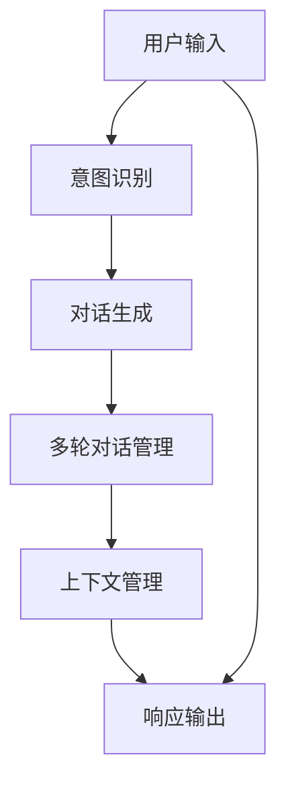

                 

# LLM在智能对话系统中的应用探索

> 关键词：智能对话系统, 大语言模型(Large Language Model, LLM), 对话生成, 意图识别, 多轮对话, 上下文管理, 用户交互设计

## 1. 背景介绍

### 1.1 问题由来
随着人工智能技术的快速发展，智能对话系统已成为企业、政府、医疗机构等多个领域提供高效、个性化服务的重要工具。智能对话系统通过自然语言理解(Natural Language Understanding, NLU)和自然语言生成(Natural Language Generation, NLG)技术，实现了人与机器之间的自然交互。然而，传统的基于规则和模板的对话系统难以满足日益复杂的用户需求，难以处理多变和复杂的对话场景。

近年来，基于深度学习的智能对话系统通过学习大量对话数据，具备了更高的灵活性和适应性。其中，大语言模型（Large Language Model, LLM）作为对话系统的核心技术，通过大规模无监督预训练，能够学习和理解自然语言的内在规律，具备强大的语言生成能力，成为推动智能对话系统发展的重要力量。

### 1.2 问题核心关键点
智能对话系统中的大语言模型通常基于预训练的方法，在大规模语料库上预训练，获取丰富的语言知识。随后通过微调（Fine-Tuning）或零样本学习（Zero-Shot Learning）等方法，在特定对话场景中进行优化，提升模型在特定对话任务上的表现。

- 预训练：在无标签文本数据上自监督训练，获取通用语言知识。
- 微调：在有标签的对话数据上进一步优化，适应特定对话场景。
- 零样本学习：直接通过文本描述执行特定对话任务，无需额外标注数据。

在智能对话系统中，LLM的对话生成、意图识别、多轮对话管理等功能对用户体验和系统的智能化水平至关重要。

## 2. 核心概念与联系

### 2.1 核心概念概述

智能对话系统中的大语言模型主要涉及以下几个关键概念：

- **大语言模型（LLM）**：基于Transformer架构的深度学习模型，通过大规模语料库预训练，能够处理自然语言的理解与生成。
- **对话生成（Dialogue Generation）**：LLM根据输入的对话历史，生成合适的回答，实现自然流畅的对话交互。
- **意图识别（Intent Recognition）**：LLM识别用户输入的意图，确定用户需求。
- **多轮对话管理（Multi-turn Dialogue Management）**：LLM维持对话状态，保证对话连贯性和正确性。
- **上下文管理（Context Management）**：LLM能够保存并利用对话历史，理解上下文信息，提升对话准确性和丰富度。
- **用户交互设计（User Interaction Design）**：通过对话界面设计，提升用户体验，增加用户粘性。

这些概念通过互相协作，形成了智能对话系统的核心功能。

### 2.2 核心概念原理和架构的 Mermaid 流程图



此图展示了智能对话系统中大语言模型的工作流程：用户输入被意图识别模块解析，生成对话意图，然后进入对话生成模块生成回应。多轮对话管理模块根据对话历史更新上下文，保证对话的连贯性和准确性，最终通过输出模块反馈到用户。

## 3. 核心算法原理 & 具体操作步骤

### 3.1 算法原理概述

智能对话系统中的大语言模型通常使用自回归模型或自编码模型进行预训练。以下以自回归模型（如GPT系列）为例，介绍其原理和操作步骤：

#### 3.1.1 自回归模型原理

自回归模型通过学习大量文本数据，预测下一个词的概率，从而获取丰富的语言知识。假设模型已经在大规模无标签文本语料上进行预训练，得到一个模型参数 $\theta$。给定当前对话上下文 $c$，通过自回归模型 $M_{\theta}$ 计算下一个回应 $r$ 的概率分布 $P(r|c)$。

数学表达式为：
$$
P(r|c) = \frac{e^{M_{\theta}(c)r}}{\sum_{r'} e^{M_{\theta}(c)r'}}
$$

其中，$M_{\theta}(c)$ 表示模型在当前上下文 $c$ 下的输出，即预测下一个词的概率分布。

#### 3.1.2 操作步骤

智能对话系统中的大语言模型操作步骤包括：

1. **预训练**：在无标签文本数据上自监督训练模型 $M_{\theta}$。
2. **微调**：在有标签的对话数据上进一步优化模型 $M_{\theta}$，适应特定对话场景。
3. **对话生成**：根据用户输入和上下文，通过模型生成合适的回答。
4. **意图识别**：识别用户输入的意图，确定用户需求。
5. **多轮对话管理**：维持对话状态，保证对话连贯性和正确性。
6. **上下文管理**：保存并利用对话历史，理解上下文信息，提升对话准确性和丰富度。

### 3.2 算法步骤详解

#### 3.2.1 预训练步骤

1. **数据准备**：收集大规模无标签文本数据，如维基百科、新闻、小说等，作为预训练数据。
2. **模型选择**：选择合适的自回归模型，如GPT-2、GPT-3等。
3. **模型训练**：在预训练数据上训练模型，获取模型参数 $\theta$。

#### 3.2.2 微调步骤

1. **数据准备**：收集有标签的对话数据，如客户服务对话、问答对话等。
2. **模型选择**：在预训练模型基础上选择微调模型。
3. **超参数设置**：设置学习率、批次大小、迭代轮数等。
4. **模型训练**：在对话数据上训练微调模型，优化模型参数。
5. **性能评估**：在测试集上评估微调后模型的性能。

#### 3.2.3 对话生成步骤

1. **用户输入处理**：对用户输入进行分词、标准化等预处理。
2. **意图识别**：通过意图识别模型，识别用户输入的意图。
3. **上下文处理**：保存并利用对话历史，理解上下文信息。
4. **生成响应**：通过模型生成合适的回答，计算概率分布。
5. **输出处理**：将生成的回应输出到用户界面。

### 3.3 算法优缺点

#### 3.3.1 优点

- **灵活性强**：通过微调，大语言模型能够适应特定的对话场景和任务，提升对话效果。
- **适应性广**：大语言模型能够处理多种自然语言，适用于多语言环境。
- **可扩展性强**：模型能够通过增加数据和计算资源，进一步提升性能。
- **用户友好**：生成的回答自然流畅，提升用户体验。

#### 3.3.2 缺点

- **训练成本高**：预训练和微调需要大量计算资源和数据。
- **模型复杂**：大规模模型参数较多，需要高效的训练和推理。
- **数据依赖性强**：需要大量有标签的对话数据进行微调，数据获取成本高。
- **过拟合风险**：微调过程容易过拟合，需要合理的正则化和数据增强策略。

### 3.4 算法应用领域

智能对话系统中的大语言模型在多个领域都有广泛应用，包括但不限于：

- **客户服务**：在客户服务对话中，LLM能够快速回答客户问题，提升服务效率。
- **医疗咨询**：LLM能够提供医疗咨询和建议，缓解医疗资源短缺问题。
- **教育辅导**：LLM能够进行在线教育辅导，解答学生疑问，提升学习效果。
- **智能家居**：LLM能够控制智能家居设备，提升用户生活便捷性。
- **旅游咨询**：LLM能够提供旅游咨询服务，帮助用户规划行程，提升旅行体验。

## 4. 数学模型和公式 & 详细讲解 & 举例说明

### 4.1 数学模型构建

智能对话系统中的大语言模型通常使用自回归模型，其数学模型构建如下：

假设模型已经在大规模无标签文本语料上进行预训练，得到一个模型参数 $\theta$。给定当前对话上下文 $c$，通过自回归模型 $M_{\theta}$ 计算下一个回应 $r$ 的概率分布 $P(r|c)$。

数学表达式为：
$$
P(r|c) = \frac{e^{M_{\theta}(c)r}}{\sum_{r'} e^{M_{\theta}(c)r'}}
$$

其中，$M_{\theta}(c)$ 表示模型在当前上下文 $c$ 下的输出，即预测下一个词的概率分布。

### 4.2 公式推导过程

自回归模型的预测过程可以视为一个多步的条件概率计算，即：
$$
P(r_n|r_1,...,r_{n-1},c) = \frac{e^{M_{\theta}(r_1,...,r_{n-1},c)r_n}}{\sum_{r'} e^{M_{\theta}(r_1,...,r_{n-1},c)r'}}
$$

其中，$r_n$ 表示当前预测的词，$M_{\theta}(r_1,...,r_{n-1},c)$ 表示模型在历史对话 $r_1,...,r_{n-1}$ 和当前上下文 $c$ 下的输出。

### 4.3 案例分析与讲解

以GPT-2为例，其预训练过程使用了语言建模任务，即给定一段文本，预测下一个词的概率。预训练过程分为两个阶段：

- **自回归阶段**：利用自回归模型预测下一个词，计算损失函数。
- **语言模型阶段**：在自回归模型的基础上，引入语言模型任务，进一步优化模型。

预训练过程可以表示为：
$$
\mathcal{L} = -\sum_{i=1}^N \sum_{j=1}^{T_i} \log P(r_j|r_1,...,r_{j-1},c)
$$

其中，$N$ 表示训练样本数量，$T_i$ 表示第 $i$ 个样本的词数，$r_j$ 表示第 $j$ 个词，$c$ 表示上下文信息。

在微调过程中，通过有标签的对话数据进一步优化模型。微调过程可以表示为：
$$
\mathcal{L} = -\sum_{i=1}^N \sum_{j=1}^{T_i} \log P(r_j|r_1,...,r_{j-1},c,y)
$$

其中，$y$ 表示标签，即用户期望的回应。

## 5. 项目实践：代码实例和详细解释说明

### 5.1 开发环境搭建

在进行智能对话系统开发前，需要准备好开发环境。以下是使用Python进行PyTorch开发的环境配置流程：

1. 安装Anaconda：从官网下载并安装Anaconda，用于创建独立的Python环境。

2. 创建并激活虚拟环境：
```bash
conda create -n pytorch-env python=3.8 
conda activate pytorch-env
```

3. 安装PyTorch：根据CUDA版本，从官网获取对应的安装命令。例如：
```bash
conda install pytorch torchvision torchaudio cudatoolkit=11.1 -c pytorch -c conda-forge
```

4. 安装Transformers库：
```bash
pip install transformers
```

5. 安装各类工具包：
```bash
pip install numpy pandas scikit-learn matplotlib tqdm jupyter notebook ipython
```

完成上述步骤后，即可在`pytorch-env`环境中开始对话系统开发。

### 5.2 源代码详细实现

我们以GPT-2模型为例，实现智能对话系统的对话生成功能。

首先，定义对话生成模型：

```python
from transformers import GPT2Tokenizer, GPT2LMHeadModel

tokenizer = GPT2Tokenizer.from_pretrained('gpt2')
model = GPT2LMHeadModel.from_pretrained('gpt2')
```

然后，实现对话生成函数：

```python
def generate_response(model, tokenizer, input_text, max_length=50):
    tokens = tokenizer.encode(input_text, return_tensors='pt')
    generated_tokens = model.generate(tokens, max_length=max_length, top_k=50, top_p=0.9, temperature=0.8)
    response_text = tokenizer.decode(generated_tokens[0])
    return response_text
```

使用对话生成函数，实现智能对话系统：

```python
import numpy as np
import torch

def chatbot(model, tokenizer):
    while True:
        user_input = input("User: ")
        response = generate_response(model, tokenizer, user_input)
        print("Bot: ", response)

chatbot(model, tokenizer)
```

### 5.3 代码解读与分析

以下是关键代码的实现细节：

**GPT2Tokenizer和GPT2LMHeadModel**：
- `GPT2Tokenizer` 用于将用户输入转换为模型可接受的形式。
- `GPT2LMHeadModel` 用于生成回应，其核心是自回归语言模型。

**generate_response函数**：
- 将用户输入编码成token ids。
- 使用模型生成回应，并解码成可读的文本。

**chatbot函数**：
- 不断循环，等待用户输入，生成回应。

使用上述代码，即可实现简单的智能对话系统。

## 6. 实际应用场景

### 6.1 智能客服系统

智能客服系统是大语言模型在实际应用中的典型场景之一。传统的客服系统依赖人工，成本高且效率低。智能客服系统通过预训练和微调的大语言模型，能够全天候处理客户咨询，快速响应，提升客户满意度。

例如，某电商平台的智能客服系统，通过预训练和微调GPT-2模型，实现了对客户问题的高效回答和分类。系统首先识别客户的意图，然后生成合适的回答，并通过回退机制处理复杂问题。

### 6.2 医疗咨询

大语言模型在医疗咨询中的应用也有显著成效。智能医疗咨询系统通过预训练和微调，能够处理医生和患者的交互，提供诊断建议和治疗方案。

例如，某医院智能医疗咨询系统，通过微调GPT-2模型，实现了对患者症状和问题的智能诊断。系统首先识别患者的症状，然后生成初步诊断建议，并通过专家审核进一步确认诊断结果。

### 6.3 智能家居

智能家居系统中，大语言模型可以用于控制和管理智能设备，提升用户的生活便捷性。例如，某智能家居系统的语音助手，通过预训练和微调，能够理解和处理用户的语音指令，控制家电设备。

### 6.4 旅游咨询

旅游咨询系统中，大语言模型可以用于提供旅行建议和规划。例如，某旅游咨询平台，通过预训练和微调GPT-2模型，能够根据用户的偏好和预算生成旅行路线和住宿建议。

## 7. 工具和资源推荐

### 7.1 学习资源推荐

为了帮助开发者系统掌握大语言模型在智能对话系统中的应用，这里推荐一些优质的学习资源：

1. 《自然语言处理入门》系列博文：由大语言模型技术专家撰写，深入浅出地介绍了自然语言处理的基本概念和关键技术。

2. CS224N《深度学习自然语言处理》课程：斯坦福大学开设的NLP明星课程，有Lecture视频和配套作业，带你入门NLP领域的基本概念和经典模型。

3. 《Transformer from Scratch》书籍：提供了Transformer模型的实现细节和原理，适合对深度学习感兴趣的读者。

4. HuggingFace官方文档：提供了大量预训练模型和微调样例代码，是上手实践的必备资料。

5. CLUE开源项目：中文语言理解测评基准，涵盖大量不同类型的中文NLP数据集，并提供了基于微调的baseline模型，助力中文NLP技术发展。

通过对这些资源的学习实践，相信你一定能够快速掌握大语言模型在智能对话系统中的应用，并用于解决实际的对话问题。

### 7.2 开发工具推荐

高效的开发离不开优秀的工具支持。以下是几款用于智能对话系统开发常用的工具：

1. PyTorch：基于Python的开源深度学习框架，灵活动态的计算图，适合快速迭代研究。大部分预训练语言模型都有PyTorch版本的实现。

2. TensorFlow：由Google主导开发的开源深度学习框架，生产部署方便，适合大规模工程应用。同样有丰富的预训练语言模型资源。

3. Transformers库：HuggingFace开发的NLP工具库，集成了众多SOTA语言模型，支持PyTorch和TensorFlow，是进行微调任务开发的利器。

4. Weights & Biases：模型训练的实验跟踪工具，可以记录和可视化模型训练过程中的各项指标，方便对比和调优。与主流深度学习框架无缝集成。

5. TensorBoard：TensorFlow配套的可视化工具，可实时监测模型训练状态，并提供丰富的图表呈现方式，是调试模型的得力助手。

6. Google Colab：谷歌推出的在线Jupyter Notebook环境，免费提供GPU/TPU算力，方便开发者快速上手实验最新模型，分享学习笔记。

合理利用这些工具，可以显著提升智能对话系统的开发效率，加快创新迭代的步伐。

### 7.3 相关论文推荐

大语言模型在智能对话系统中的应用源于学界的持续研究。以下是几篇奠基性的相关论文，推荐阅读：

1. Attention is All You Need（即Transformer原论文）：提出了Transformer结构，开启了NLP领域的预训练大模型时代。

2. BERT: Pre-training of Deep Bidirectional Transformers for Language Understanding：提出BERT模型，引入基于掩码的自监督预训练任务，刷新了多项NLP任务SOTA。

3. Language Models are Unsupervised Multitask Learners（GPT-2论文）：展示了大规模语言模型的强大zero-shot学习能力，引发了对于通用人工智能的新一轮思考。

4. Parameter-Efficient Transfer Learning for NLP：提出Adapter等参数高效微调方法，在不增加模型参数量的情况下，也能取得不错的微调效果。

5. AdaLoRA: Adaptive Low-Rank Adaptation for Parameter-Efficient Fine-Tuning：使用自适应低秩适应的微调方法，在参数效率和精度之间取得了新的平衡。

这些论文代表了大语言模型在智能对话系统中的发展脉络。通过学习这些前沿成果，可以帮助研究者把握学科前进方向，激发更多的创新灵感。

## 8. 总结：未来发展趋势与挑战

### 8.1 研究成果总结

本文对大语言模型在智能对话系统中的应用进行了全面系统的介绍。首先阐述了大语言模型在智能对话系统中的重要性，明确了对话生成、意图识别、多轮对话管理等功能对用户体验和系统的智能化水平至关重要。其次，从原理到实践，详细讲解了预训练、微调和对话生成等关键步骤，给出了智能对话系统开发的完整代码实例。同时，本文还广泛探讨了大语言模型在智能客服、医疗咨询、智能家居等场景中的应用前景，展示了智能对话系统的巨大潜力。

通过本文的系统梳理，可以看到，大语言模型在智能对话系统中的应用前景广阔，通过预训练和微调，能够显著提升对话系统的智能化水平和用户体验。未来，伴随大语言模型的不断演进，智能对话系统必将在更多领域得到广泛应用，为人类生活和工作带来更高效、更便捷的体验。

### 8.2 未来发展趋势

展望未来，大语言模型在智能对话系统中的应用将呈现以下几个发展趋势：

1. **多模态对话**：除了文本对话外，智能对话系统将进一步拓展到语音、图像等多模态对话，提升用户交互体验。

2. **上下文理解**：通过上下文管理，智能对话系统能够更好地理解对话历史和上下文信息，提升对话连贯性和准确性。

3. **知识图谱融合**：将知识图谱和语义网等外部知识资源与对话系统进行深度融合，提升系统的决策能力和知识表示能力。

4. **多领域适配**：通过迁移学习和零样本学习等技术，智能对话系统能够在不同的领域和场景中快速适应，提升系统的通用性和泛化能力。

5. **交互设计优化**：通过用户交互设计，提升系统的友好性和用户粘性，构建更加自然的对话界面。

6. **隐私保护**：在对话过程中，智能对话系统需要保护用户隐私，避免泄露敏感信息。

这些趋势凸显了大语言模型在智能对话系统中的广阔前景，这些方向的探索发展，必将进一步提升智能对话系统的智能化水平和用户体验。

### 8.3 面临的挑战

尽管大语言模型在智能对话系统中的应用已经取得了显著成效，但在迈向更加智能化、普适化应用的过程中，仍面临诸多挑战：

1. **计算资源限制**：大语言模型的训练和推理需要大量的计算资源，如何优化模型的计算效率，降低资源消耗，是一个亟待解决的问题。

2. **数据获取困难**：智能对话系统需要大量有标签的对话数据进行微调，如何高效获取和标注数据，是一个重要的挑战。

3. **系统复杂性高**：智能对话系统涉及多个模块和组件，如意图识别、对话生成、多轮对话管理等，如何设计高效、稳定的系统架构，是一个重要的研究方向。

4. **用户隐私保护**：在对话过程中，智能对话系统需要保护用户隐私，避免泄露敏感信息，如何实现隐私保护和用户信任，是一个重要的研究课题。

5. **模型公平性**：大语言模型可能学习到偏见和有害信息，如何避免偏见，提升模型的公平性和公正性，是一个重要的研究方向。

6. **长期可持续性**：如何保证智能对话系统的长期稳定性和可持续发展，是一个重要的研究方向。

这些挑战凸显了大语言模型在智能对话系统中的复杂性和不确定性，需要学界和产业界的共同努力，才能解决这些问题，推动大语言模型在智能对话系统中的广泛应用。

### 8.4 研究展望

面对大语言模型在智能对话系统中的挑战，未来的研究需要在以下几个方面寻求新的突破：

1. **多模态对话**：探索语音、图像等多模态对话的实现技术，提升用户交互体验。

2. **上下文理解**：研究上下文管理和多轮对话策略，提升对话连贯性和准确性。

3. **知识图谱融合**：研究知识图谱与语义网的融合技术，提升系统的决策能力和知识表示能力。

4. **多领域适配**：研究迁移学习和零样本学习技术，提升系统的通用性和泛化能力。

5. **隐私保护**：研究隐私保护和用户信任机制，提升系统的隐私保护能力。

6. **模型公平性**：研究偏见消除和公平性提升技术，提升模型的公平性和公正性。

7. **长期可持续性**：研究模型更新和知识迭代机制，保证系统的长期稳定性和可持续发展。

这些研究方向的探索，必将引领大语言模型在智能对话系统中的进一步发展，为构建高效、智能、安全的对话系统铺平道路。

## 9. 附录：常见问题与解答

**Q1：智能对话系统中如何设计意图识别模型？**

A: 意图识别是智能对话系统的核心功能之一，其设计主要涉及以下几个步骤：

1. **数据准备**：收集标注好的对话数据，进行数据预处理和特征提取。
2. **模型选择**：选择合适的意图识别模型，如LSTM、GRU等序列模型，或Transformer等深度学习模型。
3. **模型训练**：在标注数据上训练意图识别模型，获取模型参数。
4. **模型评估**：在测试集上评估模型性能，使用准确率、召回率等指标进行评估。

**Q2：智能对话系统中如何处理多轮对话？**

A: 多轮对话管理是智能对话系统中的关键功能，主要涉及以下几个步骤：

1. **上下文管理**：保存并利用对话历史，理解上下文信息，提升对话连贯性和准确性。
2. **状态跟踪**：记录对话状态，如对话轮次、用户意图等，指导对话生成。
3. **交互设计**：通过对话界面设计，提升用户体验，增加用户粘性。

**Q3：智能对话系统中如何保护用户隐私？**

A: 在对话过程中，智能对话系统需要保护用户隐私，避免泄露敏感信息。主要方法包括：

1. **匿名化处理**：对用户输入和对话历史进行匿名化处理，保护用户隐私。
2. **数据加密**：对用户数据进行加密存储和传输，防止数据泄露。
3. **权限控制**：限制系统访问权限，防止未经授权的数据访问。

通过这些方法，可以提升智能对话系统的隐私保护能力，增强用户信任。

**Q4：智能对话系统中如何设计对话生成模型？**

A: 对话生成是智能对话系统的核心功能之一，其设计主要涉及以下几个步骤：

1. **数据准备**：收集对话数据，进行数据预处理和特征提取。
2. **模型选择**：选择合适的对话生成模型，如自回归模型、自编码模型等。
3. **模型训练**：在标注数据上训练对话生成模型，获取模型参数。
4. **模型评估**：在测试集上评估模型性能，使用BLEU、ROUGE等指标进行评估。

通过这些方法，可以设计出高效、自然的对话生成系统，提升用户交互体验。

通过本文的系统梳理，可以看到，大语言模型在智能对话系统中的应用前景广阔，通过预训练和微调，能够显著提升对话系统的智能化水平和用户体验。未来，伴随大语言模型的不断演进，智能对话系统必将在更多领域得到广泛应用，为人类生活和工作带来更高效、更便捷的体验。

