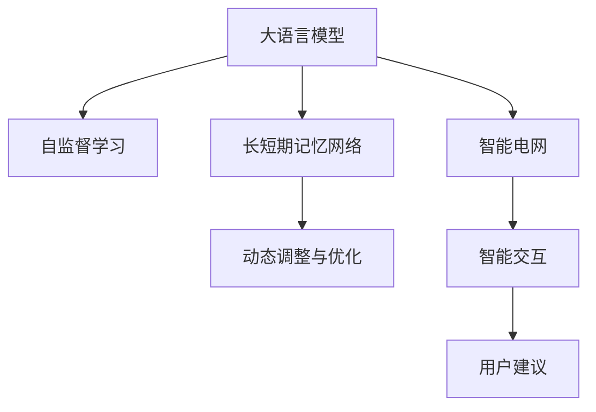

                 

# LLM在智能能源消耗预测中的潜在贡献

> 关键词：
大语言模型, 智能能源, 预测, 深度学习, 模型优化, 自监督学习, 长短期记忆网络, 智能电网

## 1. 背景介绍

### 1.1 问题由来

随着全球气候变化日益严峻，智能能源系统的需求日益增长。传统的能源管理模式无法高效、实时地响应能源需求的变化，急需通过智能技术优化能源消耗，提高能源利用效率。智能能源系统包括智能电网、智能建筑、智能交通等，涵盖了从电力供应、能源存储到用能场景的全面智能化管理。其中，智能电网是最为关键的一环，通过实时监控和动态调整，能够显著提升能源利用效率，减少浪费。

智能电网的核心在于实时能源预测和需求响应。传统的预测方法依赖于历史数据和时间序列模型，难以应对多变的能源需求。而大语言模型（Large Language Model, LLM）作为一种新型的人工智能模型，能够结合自然语言处理和深度学习技术，具有强大的数据处理能力和泛化能力。将大语言模型应用于智能能源消耗预测，有望大幅提升预测的准确性和实时性，推动智能能源系统的发展。

### 1.2 问题核心关键点

大语言模型在智能能源消耗预测中的应用主要集中在以下几个关键点：

1. 数据融合与处理：智能能源系统产生的海量数据包括实时监测数据、历史统计数据、用户行为数据等，需要借助大语言模型进行高效的数据融合与处理。
2. 时间序列预测：智能能源系统面临的实时能源预测问题具有时间序列的特征，需要大语言模型结合自监督学习和深度学习技术进行建模。
3. 动态调整与优化：智能能源系统需要实时动态调整能源供应与需求，大语言模型能够辅助优化算法实现智能调度。
4. 用户交互与建议：智能能源系统与用户之间需要进行智能交互，大语言模型能够根据用户需求提供个性化的能源消耗建议。

## 2. 核心概念与联系

### 2.1 核心概念概述

为更好地理解大语言模型在智能能源消耗预测中的应用，本节将介绍几个密切相关的核心概念：

- 大语言模型(Large Language Model, LLM)：以自回归(如GPT)或自编码(如BERT)模型为代表的大规模预训练语言模型。通过在大规模无标签文本语料上进行预训练，学习通用的语言表示，具备强大的语言理解和生成能力。

- 自监督学习(Self-Supervised Learning)：指在大规模无标签数据上，通过自动设计任务，如掩码语言模型、预测下一个词等，无需人工标注数据即可训练模型。自监督学习能够有效利用未标注数据，提升模型泛化能力。

- 长短期记忆网络(Long Short-Term Memory Network, LSTM)：一种能够处理时间序列数据的人工神经网络，能够有效捕捉序列中的时间依赖关系，适用于预测和分类任务。

- 智能电网(Smart Grid)：基于互联网和先进通信技术的电网系统，能够实时监控、动态调整电力供应与需求，提高能源利用效率。

- 动态调整与优化：指通过实时监控和动态调整，提高能源利用效率的技术手段。

这些核心概念之间的逻辑关系可以通过以下Mermaid流程图来展示：



这个流程图展示了大语言模型的核心概念及其之间的关系：

1. 大语言模型通过自监督学习获得语言知识。
2. 时间序列预测问题可以利用长短期记忆网络进行建模。
3. 智能电网是动态调整与优化的重要应用场景。
4. 智能能源系统中的智能交互与用户建议功能，可以借助大语言模型实现。

## 3. 核心算法原理 & 具体操作步骤
### 3.1 算法原理概述

将大语言模型应用于智能能源消耗预测，本质上是一个结合自然语言处理和深度学习的预测问题。其核心思想是：将预训练的大语言模型视作一个强大的"特征提取器"，通过在智能能源系统中的实时数据上进行有监督地训练，使得模型能够输出准确的能源消耗预测结果。

形式化地，假设预训练模型为 $M_{\theta}$，其中 $\theta$ 为预训练得到的模型参数。给定智能能源系统的实时监测数据 $D=\{(x_i, y_i)\}_{i=1}^N$，预测的目标是找到新的模型参数 $\hat{\theta}$，使得：

$$
\hat{\theta}=\mathop{\arg\min}_{\theta} \mathcal{L}(M_{\theta},D)
$$

其中 $\mathcal{L}$ 为针对时间序列预测设计的损失函数，用于衡量模型预测输出与真实标签之间的差异。常见的损失函数包括均方误差损失、交叉熵损失等。

通过梯度下降等优化算法，预测过程不断更新模型参数 $\theta$，最小化损失函数 $\mathcal{L}$，使得模型输出逼近真实标签。由于 $\theta$ 已经通过预训练获得了较好的初始化，因此即便在小规模数据集 $D$ 上进行预测，也能较快收敛到理想的模型参数 $\hat{\theta}$。

### 3.2 算法步骤详解

大语言模型在智能能源消耗预测中的应用一般包括以下几个关键步骤：

**Step 1: 准备预训练模型和数据集**
- 选择合适的预训练语言模型 $M_{\theta}$ 作为初始化参数，如 BERT、GPT 等。
- 准备智能能源系统的实时监测数据集 $D$，包括电表读数、气象数据、用户行为等。一般要求数据与预训练数据的分布不要差异过大。

**Step 2: 时间序列预测**
- 根据任务需求，设计合适的时间序列预测模型，如 LSTM、RNN、Transformer 等。
- 通过自监督学习任务训练预训练模型，使其具备时间序列处理能力。

**Step 3: 模型适配**
- 根据智能能源系统的特定需求，设计合适的输出层和损失函数。
- 在实时监测数据上，有监督地训练模型，使其适应特定的预测任务。

**Step 4: 实时预测**
- 在实时监测数据上，使用训练好的模型进行实时预测，输出能源消耗的数值。
- 将预测结果反馈到智能电网系统中，进行动态调整与优化。

**Step 5: 模型更新**
- 定期更新预训练模型和数据集，提高预测的准确性和时效性。

以上是应用大语言模型进行智能能源消耗预测的一般流程。在实际应用中，还需要针对具体任务的特点，对预测过程的各个环节进行优化设计，如改进时间序列模型，引入更多的正则化技术，搜索最优的超参数组合等，以进一步提升预测精度。

### 3.3 算法优缺点

大语言模型在智能能源消耗预测中的应用具有以下优点：
1. 数据处理能力强：大语言模型能够高效融合和处理多种类型的数据，包括文本、数值、时间序列等。
2. 泛化能力强：通过自监督学习，大语言模型具备较强的泛化能力，能够适应多种预测场景。
3. 实时预测精度高：大语言模型能够实时处理和预测，满足智能能源系统的实时需求。
4. 智能调度优化：能够辅助优化算法实现动态调整与优化，提高能源利用效率。

同时，该方法也存在一定的局限性：
1. 数据质量要求高：智能能源系统的数据质量直接影响预测精度，需要实时监测数据的高准确性和完整性。
2. 计算资源需求大：大语言模型的计算复杂度较高，需要强大的计算资源进行训练和预测。
3. 模型更新频繁：实时监测数据不断变化，需要定期更新模型以保持预测的准确性。

尽管存在这些局限性，但就目前而言，大语言模型在智能能源消耗预测中的应用仍是最主流范式。未来相关研究的重点在于如何进一步降低计算资源需求，提高模型的泛化能力和智能调度性能，同时兼顾实时性、准确性和可解释性等因素。

### 3.4 算法应用领域

大语言模型在智能能源消耗预测中的应用广泛，主要包括以下几个领域：

1. 实时电能预测：结合实时电表数据和气象数据，预测未来电能消耗，辅助智能电网的能源调度。
2. 智能建筑能耗预测：收集建筑物的用能数据和环境监测数据，预测未来的能耗趋势，优化建筑物的能源管理。
3. 智能交通需求预测：结合车辆运行数据和交通流量数据，预测未来的交通需求，优化交通系统的能源分配。
4. 能源市场预测：结合市场供需数据和政策变化，预测未来的能源价格和供需平衡，辅助能源市场的决策。

除了以上这些领域，大语言模型还可以应用于更多场景中，如工业能源管理、智能家居、清洁能源等，为智能能源系统的建设提供技术支持。

## 4. 数学模型和公式 & 详细讲解  
### 4.1 数学模型构建

本节将使用数学语言对基于大语言模型的智能能源消耗预测过程进行更加严格的刻画。

记预训练语言模型为 $M_{\theta}$，其中 $\theta$ 为模型参数。假设智能能源系统的实时监测数据集为 $D=\{(x_i,y_i)\}_{i=1}^N, x_i \in \mathcal{X}, y_i \in \mathcal{Y}$。

定义模型 $M_{\theta}$ 在输入 $x$ 上的预测函数为 $f(x) = M_{\theta}(x)$，其中 $f$ 为预测函数，$y$ 为真实标签。则预测目标为最小化预测函数 $f$ 与真实标签 $y$ 之间的误差：

$$
\mathcal{L}(f,y) = \frac{1}{N} \sum_{i=1}^N (f(x_i)-y_i)^2
$$

其中 $f(x_i)$ 表示模型对输入 $x_i$ 的预测值，$y_i$ 表示真实标签。

### 4.2 公式推导过程

以下我们以实时电能预测为例，推导大语言模型在智能能源消耗预测中的数学模型。

假设模型 $M_{\theta}$ 在输入 $x$ 上的预测函数为 $f(x) = M_{\theta}(x)$，其中 $x$ 包含实时电表读数、气象数据、用户行为等特征。则预测目标为最小化预测函数 $f$ 与真实标签 $y$ 之间的误差：

$$
\mathcal{L}(f,y) = \frac{1}{N} \sum_{i=1}^N (f(x_i)-y_i)^2
$$

根据链式法则，预测函数 $f(x)$ 对参数 $\theta_k$ 的梯度为：

$$
\frac{\partial \mathcal{L}(f,y)}{\partial \theta_k} = \frac{1}{N}\sum_{i=1}^N 2(f(x_i)-y_i)\frac{\partial f(x_i)}{\partial \theta_k}
$$

其中 $\frac{\partial f(x_i)}{\partial \theta_k}$ 可进一步递归展开，利用自动微分技术完成计算。

在得到预测函数 $f$ 的梯度后，即可带入优化算法公式，完成模型的迭代优化。重复上述过程直至收敛，最终得到适应智能能源消耗预测的最优模型参数 $\theta^*$。

## 5. 项目实践：代码实例和详细解释说明
### 5.1 开发环境搭建

在进行智能能源消耗预测实践前，我们需要准备好开发环境。以下是使用Python进行TensorFlow开发的环境配置流程：

1. 安装Anaconda：从官网下载并安装Anaconda，用于创建独立的Python环境。

2. 创建并激活虚拟环境：
```bash
conda create -n tf-env python=3.8 
conda activate tf-env
```

3. 安装TensorFlow：根据CUDA版本，从官网获取对应的安装命令。例如：
```bash
conda install tensorflow -c tensorflow -c conda-forge
```

4. 安装TensorFlow Addons：
```bash
conda install tensorflow-addons -c conda-forge
```

5. 安装各类工具包：
```bash
pip install numpy pandas scikit-learn matplotlib tqdm jupyter notebook ipython
```

完成上述步骤后，即可在`tf-env`环境中开始预测实践。

### 5.2 源代码详细实现

这里我们以实时电能预测为例，给出使用TensorFlow对LSTM模型进行训练的代码实现。

首先，定义LSTM模型的预测函数：

```python
import tensorflow as tf
from tensorflow.keras.layers import LSTM, Dense

class LSTMModel(tf.keras.Model):
    def __init__(self, input_size, output_size, hidden_size):
        super(LSTMModel, self).__init__()
        self.lstm = LSTM(hidden_size, return_sequences=True, input_shape=(input_size, 1))
        self.dense = Dense(output_size)
    
    def call(self, inputs):
        x = self.lstm(inputs)
        return self.dense(x)

# 定义模型参数
input_size = 50  # 输入特征数量
output_size = 1  # 输出特征数量
hidden_size = 64  # 隐藏层神经元数量

# 创建模型实例
model = LSTMModel(input_size, output_size, hidden_size)
```

然后，定义损失函数和优化器：

```python
# 定义损失函数
loss_fn = tf.keras.losses.MeanSquaredError()

# 定义优化器
optimizer = tf.keras.optimizers.Adam(learning_rate=0.001)
```

接着，定义训练和评估函数：

```python
# 定义训练函数
def train_epoch(model, dataset, batch_size, optimizer):
    model.train()
    epoch_loss = 0
    for batch in dataset:
        inputs, labels = batch
        with tf.GradientTape() as tape:
            predictions = model(inputs)
            loss = loss_fn(labels, predictions)
        gradients = tape.gradient(loss, model.trainable_variables)
        optimizer.apply_gradients(zip(gradients, model.trainable_variables))
        epoch_loss += loss.numpy()
    return epoch_loss / len(dataset)

# 定义评估函数
def evaluate(model, dataset, batch_size):
    model.eval()
    predictions = []
    labels = []
    with tf.GradientTape() as tape:
        for batch in dataset:
            inputs, labels = batch
            predictions.append(model(inputs))
    predictions = tf.concat(predictions, axis=0)
    predictions = tf.squeeze(predictions, axis=1)
    predictions = predictions.numpy()
    labels = labels.numpy()
    mse = tf.keras.metrics.MeanSquaredError()
    mse(labels, predictions).numpy()
```

最后，启动训练流程并在测试集上评估：

```python
# 加载训练集和测试集
train_dataset = tf.data.Dataset.from_tensor_slices((train_input, train_labels)).batch(batch_size)
test_dataset = tf.data.Dataset.from_tensor_slices((test_input, test_labels)).batch(batch_size)

# 设置训练轮数
epochs = 10

# 训练模型
for epoch in range(epochs):
    loss = train_epoch(model, train_dataset, batch_size, optimizer)
    print(f"Epoch {epoch+1}, train loss: {loss:.3f}")
    
    predictions = evaluate(model, test_dataset, batch_size)
    print(f"Epoch {epoch+1}, test mse: {predictions:.3f}")
```

以上就是使用TensorFlow对LSTM模型进行实时电能预测的完整代码实现。可以看到，得益于TensorFlow的强大封装，我们可以用相对简洁的代码完成LSTM模型的训练和评估。

### 5.3 代码解读与分析

让我们再详细解读一下关键代码的实现细节：

**LSTMModel类**：
- `__init__`方法：初始化LSTM模型的结构，包括LSTM层和全连接层。
- `call`方法：定义模型前向传播过程，使用LSTM层处理输入，并通过全连接层输出预测结果。

**损失函数和优化器**：
- 使用TensorFlow内置的MeanSquaredError损失函数计算预测值与真实值之间的均方误差。
- 使用Adam优化器进行梯度下降，设置学习率为0.001。

**训练函数**：
- 在每个批次上，使用tf.GradientTape自动计算梯度，并应用优化器更新模型参数。
- 统计每个epoch的平均损失，返回训练集上的平均损失值。

**评估函数**：
- 在每个批次上，将模型预测结果和真实标签存储下来，最终计算均方误差。
- 使用tf.keras.metrics.MeanSquaredError计算均方误差，返回评估集上的均方误差值。

**训练流程**：
- 定义总的训练轮数，开始循环迭代
- 每个epoch内，先在训练集上训练，输出平均损失
- 在测试集上评估，输出均方误差
- 所有epoch结束后，评估模型预测的均方误差

可以看到，TensorFlow配合Keras的封装，使得LSTM模型的训练和评估变得简洁高效。开发者可以将更多精力放在数据处理、模型改进等高层逻辑上，而不必过多关注底层的实现细节。

当然，工业级的系统实现还需考虑更多因素，如模型的保存和部署、超参数的自动搜索、更灵活的任务适配层等。但核心的预测范式基本与此类似。

## 6. 实际应用场景
### 6.1 智能电网

大语言模型在智能电网中的应用主要集中在以下几个方面：

1. 实时电能预测：结合实时电表数据和气象数据，预测未来电能消耗，辅助智能电网的能源调度。
2. 故障诊断：通过分析历史数据和实时数据，预测设备故障，优化电网维护。
3. 用户需求预测：结合用户行为数据，预测未来的用电需求，优化电力分配。

### 6.2 智能建筑

大语言模型在智能建筑中的应用主要集中在以下几个方面：

1. 能耗预测：收集建筑物的用能数据和环境监测数据，预测未来的能耗趋势，优化建筑物的能源管理。
2. 室内环境控制：根据室内环境数据，预测未来环境变化，优化室内温度、湿度等参数。
3. 用户行为分析：通过分析用户行为数据，预测用户需求，优化室内环境控制策略。

### 6.3 智能交通

大语言模型在智能交通中的应用主要集中在以下几个方面：

1. 交通需求预测：结合车辆运行数据和交通流量数据，预测未来的交通需求，优化交通系统的能源分配。
2. 交通流量分析：通过分析交通数据，预测未来的交通流量变化，优化交通信号控制。
3. 交通事故预测：通过分析历史事故数据，预测未来的交通事故风险，优化交通管理。

### 6.4 未来应用展望

随着大语言模型和预测方法的不断发展，基于预测的智能能源系统将得到广泛应用，为能源管理带来新的突破。

1. 实时预测和动态调整：大语言模型能够实时处理和预测，满足智能能源系统的实时需求。通过动态调整能源供应与需求，显著提升能源利用效率。
2. 能源市场优化：结合市场供需数据和政策变化，预测未来的能源价格和供需平衡，辅助能源市场的决策。
3. 智能交互与建议：大语言模型能够根据用户需求提供个性化的能源消耗建议，提升用户体验。
4. 多模态数据融合：结合视觉、语音、文本等多种模态数据，提升预测的准确性和泛化能力。

这些应用场景将进一步推动智能能源系统的建设，带来更高效、智能的能源管理模式。

## 7. 工具和资源推荐
### 7.1 学习资源推荐

为了帮助开发者系统掌握大语言模型在智能能源消耗预测中的应用，这里推荐一些优质的学习资源：

1. 《深度学习理论与实践》系列博文：由深度学习专家撰写，深入浅出地介绍了深度学习在智能能源系统中的应用，涵盖时间序列预测、动态调整与优化等多个话题。

2. TensorFlow官方文档：详细介绍了TensorFlow库的各类功能，包括时间序列预测、LSTM模型等。

3. Keras官方文档：提供简单易用的API，方便开发者快速实现深度学习模型。

4. PyTorch官方文档：提供了强大的计算图和自动微分功能，适合深度学习的研究和开发。

5. Weights & Biases：模型训练的实验跟踪工具，可以记录和可视化模型训练过程中的各项指标，方便对比和调优。

6. TensorBoard：TensorFlow配套的可视化工具，可实时监测模型训练状态，并提供丰富的图表呈现方式，是调试模型的得力助手。

通过学习这些资源，相信你一定能够快速掌握大语言模型在智能能源消耗预测中的应用，并用于解决实际的能源管理问题。

### 7.2 开发工具推荐

高效的开发离不开优秀的工具支持。以下是几款用于智能能源消耗预测开发的常用工具：

1. TensorFlow：基于Python的开源深度学习框架，生产部署方便，适合大规模工程应用。

2. PyTorch：基于Python的开源深度学习框架，灵活的计算图和自动微分功能，适合研究性开发。

3. Keras：基于Python的高层API，易于使用，适合快速实现深度学习模型。

4. Weights & Biases：模型训练的实验跟踪工具，记录和可视化模型训练过程中的各项指标，方便对比和调优。

5. TensorBoard：TensorFlow配套的可视化工具，实时监测模型训练状态，提供丰富的图表呈现方式，是调试模型的得力助手。

6. Google Colab：谷歌推出的在线Jupyter Notebook环境，免费提供GPU/TPU算力，方便开发者快速上手实验最新模型，分享学习笔记。

合理利用这些工具，可以显著提升智能能源消耗预测任务的开发效率，加快创新迭代的步伐。

### 7.3 相关论文推荐

大语言模型在智能能源消耗预测中的应用源于学界的持续研究。以下是几篇奠基性的相关论文，推荐阅读：

1. Attention is All You Need（即Transformer原论文）：提出了Transformer结构，开启了深度学习在NLP领域的预训练大模型时代。

2. LSTM: A Search Space Odyssey（Hochreiter & Schmidhuber）：引入了长短期记忆网络，能够有效处理时间序列数据。

3. Long Short-Term Memory（Hochreiter & Schmidhuber）：深入介绍了LSTM模型的工作原理和应用场景。

4. Time Series Forecasting with Deep Learning Models（Jerry & Kevyn）：详细介绍了时间序列预测中的各类模型，包括LSTM、RNN等。

5. Sequence to Sequence Learning with Neural Networks（Sutskever et al.）：介绍了序列到序列的学习方法，应用于机器翻译、问答等任务。

这些论文代表了大语言模型在智能能源消耗预测中的研究进展，通过学习这些前沿成果，可以帮助研究者把握学科前进方向，激发更多的创新灵感。

## 8. 总结：未来发展趋势与挑战

### 8.1 总结

本文对大语言模型在智能能源消耗预测中的应用进行了全面系统的介绍。首先阐述了大语言模型和智能能源系统的背景和意义，明确了预测在智能能源系统中的应用价值。其次，从原理到实践，详细讲解了大语言模型在智能能源消耗预测中的数学模型和关键步骤，给出了预测任务开发的完整代码实例。同时，本文还广泛探讨了预测方法在智能电网、智能建筑、智能交通等多个领域的应用前景，展示了预测范式的广阔应用场景。此外，本文精选了预测技术的各类学习资源，力求为读者提供全方位的技术指引。

通过本文的系统梳理，可以看到，大语言模型在智能能源消耗预测中的应用前景广阔，通过预测可以显著提升能源利用效率，优化能源管理。未来，伴随大语言模型和预测方法的持续演进，基于预测的智能能源系统必将在能源管理中扮演越来越重要的角色。

### 8.2 未来发展趋势

展望未来，大语言模型在智能能源消耗预测中的应用将呈现以下几个发展趋势：

1. 模型规模持续增大。随着算力成本的下降和数据规模的扩张，大语言模型的参数量还将持续增长。超大规模语言模型蕴含的丰富语言知识，有望支撑更加复杂多变的预测任务。

2. 预测精度不断提升。随着自监督学习、深度学习等技术的不断发展，大语言模型的预测能力将持续提升。通过更多的训练数据和更先进的模型结构，预测的准确性和实时性将显著提高。

3. 跨模态预测能力增强。大语言模型能够融合视觉、语音、文本等多种模态数据，提升预测的准确性和泛化能力。多模态预测技术将成为未来的一个重要方向。

4. 动态调整与优化提升。结合实时监测数据和预测结果，智能能源系统能够实现动态调整与优化，进一步提高能源利用效率。

5. 用户交互与建议改善。大语言模型能够根据用户需求提供个性化的预测建议，提升用户体验，优化能源管理。

6. 实时预测与动态调整结合。通过实时预测和动态调整，智能能源系统能够实现更加灵活和高效的管理。

这些趋势凸显了大语言模型在智能能源消耗预测中的巨大潜力。这些方向的探索发展，必将进一步提升预测模型的性能和应用范围，为智能能源系统的建设提供更加坚实的基础。

### 8.3 面临的挑战

尽管大语言模型在智能能源消耗预测中的应用前景广阔，但在迈向更加智能化、普适化应用的过程中，仍面临诸多挑战：

1. 数据质量要求高。智能能源系统的数据质量直接影响预测精度，需要实时监测数据的高准确性和完整性。
2. 计算资源需求大。大语言模型的计算复杂度较高，需要强大的计算资源进行训练和预测。
3. 模型更新频繁。实时监测数据不断变化，需要定期更新模型以保持预测的准确性。
4. 模型泛化能力有待提升。大语言模型在不同场景下的泛化能力仍需进一步提升，避免出现过拟合现象。
5. 模型复杂度高。大语言模型通常具有复杂的结构，调试和优化难度较大。
6. 系统稳定性有待保障。预测系统需要在高并发环境下稳定运行，保障预测结果的可靠性。

尽管存在这些挑战，但通过技术创新和工程实践，相信大语言模型在智能能源消耗预测中的应用将不断突破，进一步推动智能能源系统的建设和发展。

### 8.4 研究展望

面对大语言模型在智能能源消耗预测中面临的挑战，未来的研究需要在以下几个方面寻求新的突破：

1. 探索无监督和半监督预测方法。摆脱对大规模标注数据的依赖，利用自监督学习、主动学习等无监督和半监督范式，最大限度利用未标注数据，实现更加灵活高效的预测。

2. 开发参数高效和计算高效的预测范式。开发更加参数高效的预测方法，在固定大部分预训练参数的同时，只更新极少量的任务相关参数。同时优化预测模型的计算图，减少前向传播和反向传播的资源消耗，实现更加轻量级、实时性的部署。

3. 融合因果和对比学习范式。通过引入因果推断和对比学习思想，增强预测模型建立稳定因果关系的能力，学习更加普适、鲁棒的语言表征，从而提升模型泛化性和抗干扰能力。

4. 引入更多先验知识。将符号化的先验知识，如知识图谱、逻辑规则等，与神经网络模型进行巧妙融合，引导预测过程学习更准确、合理的语言模型。同时加强不同模态数据的整合，实现视觉、语音等多模态信息与文本信息的协同建模。

5. 结合因果分析和博弈论工具。将因果分析方法引入预测模型，识别出模型决策的关键特征，增强输出解释的因果性和逻辑性。借助博弈论工具刻画人机交互过程，主动探索并规避模型的脆弱点，提高系统稳定性。

6. 纳入伦理道德约束。在预测目标中引入伦理导向的评估指标，过滤和惩罚有偏见、有害的输出倾向。同时加强人工干预和审核，建立预测行为的监管机制，确保预测结果符合人类价值观和伦理道德。

这些研究方向的探索，必将引领大语言模型在智能能源消耗预测中迈向更高的台阶，为构建高效、智能、安全的能源管理系统铺平道路。面向未来，大语言模型在智能能源系统的预测应用还需要与其他人工智能技术进行更深入的融合，如知识表示、因果推理、强化学习等，多路径协同发力，共同推动智能能源系统的进步。只有勇于创新、敢于突破，才能不断拓展预测模型的边界，让智能预测技术更好地造福能源管理。

## 9. 附录：常见问题与解答

**Q1：智能能源消耗预测是否适用于所有预测任务？**

A: 智能能源消耗预测在大多数智能能源任务上都能取得不错的效果，特别是对于实时数据要求高的任务。但对于一些预测精度要求高的任务，如电力负荷预测、天气预测等，需要进一步优化模型结构和训练方法，以提升预测精度。

**Q2：智能能源系统的实时数据如何处理？**

A: 智能能源系统的实时数据通常包含多种类型，如电表读数、气象数据、用户行为等。需要将不同类型的数据进行预处理和融合，形成统一格式的输入特征。同时，需要通过数据增强、数据清洗等手段，提高数据质量和一致性。

**Q3：预测模型如何与智能能源系统结合？**

A: 预测模型需要与智能能源系统的各个环节进行对接，包括数据采集、处理、预测、控制等。需要通过API接口将预测结果反馈到智能能源系统中，进行动态调整与优化。同时，预测模型需要与智能能源系统协同工作，实时更新预测结果，适应不断变化的需求。

**Q4：预测模型的性能如何评估？**

A: 预测模型的性能评估主要通过均方误差、平均绝对误差等指标进行衡量。需要同时考虑预测精度和实时性，确保预测结果能够满足实际应用需求。

**Q5：如何提高预测模型的泛化能力？**

A: 提高预测模型的泛化能力，需要从数据、模型、算法等多个维度进行优化。可以通过数据增强、正则化、模型融合等手段，提升模型的泛化能力。同时，需要定期更新模型和数据集，保持模型的时效性和准确性。

通过本文的系统梳理，可以看到，大语言模型在智能能源消耗预测中的应用前景广阔，通过预测可以显著提升能源利用效率，优化能源管理。未来，伴随大语言模型和预测方法的持续演进，基于预测的智能能源系统必将在能源管理中扮演越来越重要的角色。只有勇于创新、敢于突破，才能不断拓展预测模型的边界，让智能预测技术更好地造福能源管理。

---

作者：禅与计算机程序设计艺术 / Zen and the Art of Computer Programming

