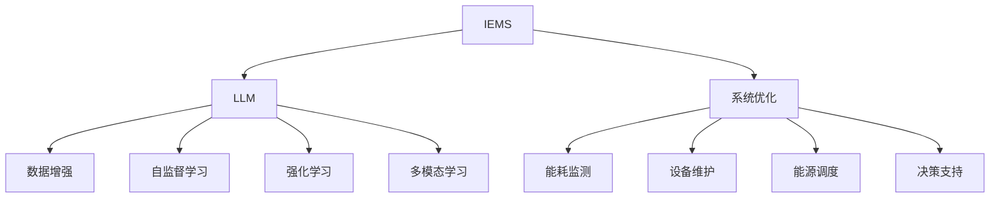

                 

## 1. 背景介绍

随着全球能源需求的不断增加和环境保护意识的提升，智能能源管理系统(Industrial Energy Management Systems, IEMS)逐渐成为现代工业企业的重要组成部分。智能能源管理系统利用先进的信息技术和人工智能技术，实时监控和优化能源的使用和调度，从而达到节能减排、提升生产效率的目标。

当前，智能能源管理系统的核心组成部分包括传感器、边缘计算节点、中央监控中心和决策支持系统。然而，这些系统在运行过程中面临诸如能耗监测不精确、设备维护成本高、能源调度决策不精确等挑战。因此，亟需引入更加智能化的技术手段，提升能源管理的效率和精度。

## 2. 核心概念与联系

### 2.1 核心概念概述

为更好地理解LLM在智能能源管理系统中的潜在作用，本节将介绍几个密切相关的核心概念：

- 工业能源管理系统(IEMS)：指利用信息技术对工业企业的能源使用进行监控、优化和管理的系统。包括能耗监测、设备维护、能源调度等功能模块。
- 大语言模型(LLM)：以Transformer为代表的大规模预训练语言模型，具备强大的语言理解和生成能力。
- 数据增强：通过对训练样本进行改写、回译等操作，扩充训练集，提高模型的泛化能力。
- 自监督学习：在大规模无标签数据上进行自我监督训练，学习数据的内在表示。
- 强化学习：通过与环境交互，学习最优决策策略，优化系统行为。
- 多模态学习：结合文本、图像、语音等多种数据源，学习更全面、准确的系统表征。

这些核心概念之间的逻辑关系可以通过以下Mermaid流程图来展示：



这个流程图展示了大语言模型与智能能源管理系统的关系，以及其与其他关键技术的联系。

## 3. 核心算法原理 & 具体操作步骤

### 3.1 算法原理概述

基于大语言模型(LLM)的智能能源管理系统，主要通过以下几个步骤实现：

1. **数据收集与预处理**：收集工业企业的能源使用数据，包括能耗、温度、湿度、设备状态等。预处理数据，将其转化为模型可以处理的形式。
2. **模型训练**：在大规模无标签数据上进行自监督预训练，学习数据的表示。
3. **模型微调**：在智能能源管理系统的具体任务上进行微调，学习系统特定的表示。
4. **模型部署与优化**：将微调后的模型部署到智能能源管理系统的各个节点上，并进行性能优化，提升系统的实时性和准确性。
5. **系统集成**：将LLM与系统中的其他模块进行集成，形成完整的智能能源管理系统。

### 3.2 算法步骤详解

**Step 1: 数据收集与预处理**
- 收集工业企业的能源使用数据，包括能耗、温度、湿度、设备状态等。
- 对数据进行清洗和归一化，去除异常值和噪声。
- 将数据转化为LLM可以处理的文本或图像形式。

**Step 2: 模型训练**
- 在TensorFlow或PyTorch等深度学习框架上，搭建LLM模型，并进行自监督预训练。例如，可以使用掩码语言模型(Masked Language Model, MLM)、自编码器(Autoder)等任务。
- 使用自监督学习技术，在大规模无标签数据上进行预训练，学习数据的表示。
- 保存预训练模型的权重，以便后续微调使用。

**Step 3: 模型微调**
- 根据智能能源管理系统的具体任务，设计任务的适配层。例如，可以使用分类的输出层进行能耗监测，使用回归的输出层进行设备维护等。
- 使用标注数据，对预训练模型进行微调，优化模型在特定任务上的性能。
- 在微调过程中，使用数据增强、正则化、早停等技术避免过拟合。

**Step 4: 模型部署与优化**
- 将微调后的模型部署到智能能源管理系统的各个节点上，如传感器、边缘计算节点等。
- 进行性能优化，如模型裁剪、量化加速等，提升模型的实时性和效率。
- 采用分布式计算技术，优化模型在多节点上的部署和运行。

**Step 5: 系统集成**
- 将微调后的模型与系统中的其他模块进行集成，形成完整的智能能源管理系统。例如，将LLM与能耗监测模块、设备维护模块、能源调度模块等集成。
- 对整个系统进行测试和评估，确保各模块协同工作，达到预期效果。

### 3.3 算法优缺点

基于LLM的智能能源管理系统具有以下优点：
1. **高效精确的能耗监测**：LLM能够对大量非结构化数据进行理解，从而实现更精确的能耗监测。
2. **设备状态预测**：通过分析设备的历史数据，LLM能够预测设备的故障和维护需求，降低维护成本。
3. **能源调度优化**：LLM能够学习工业企业的能源使用规律，优化能源的分配和调度。
4. **智能决策支持**：LLM能够根据历史数据和实时监测数据，提供科学合理的决策建议。

然而，基于LLM的智能能源管理系统也存在一些缺点：
1. **数据隐私问题**：工业企业需要提供大量的能源使用数据，可能存在数据隐私和安全问题。
2. **模型复杂性高**：LLM模型通常参数量巨大，计算复杂度较高，需要高性能的硬件支持。
3. **微调数据需求高**：LLM模型在微调时需要大量的标注数据，对于某些特定的能源管理任务，标注数据的获取可能较为困难。
4. **实时性要求高**：LLM模型在实时性方面可能存在瓶颈，需要优化模型的计算速度和响应时间。

### 3.4 算法应用领域

基于LLM的智能能源管理系统可以应用于多个领域，例如：

- **能源消耗监测**：对工业企业的能耗进行实时监测，识别能源使用中的异常情况。
- **设备故障预测**：预测设备的故障和维护需求，提前进行维护，避免设备停机。
- **能源调度优化**：优化能源的分配和调度，降低能源使用成本。
- **智能决策支持**：根据历史数据和实时数据，提供科学合理的决策建议，提高能源管理的效率和效果。

## 4. 数学模型和公式 & 详细讲解 & 举例说明

### 4.1 数学模型构建

在智能能源管理系统中，LLM主要应用于以下几个方面：

- **能耗监测**：将能耗数据转化为文本，使用LLM进行分类或回归任务，学习能耗的特征和规律。
- **设备状态预测**：将设备状态数据转化为文本，使用LLM进行分类任务，预测设备的故障和维护需求。
- **能源调度优化**：将能源使用数据转化为文本，使用LLM进行回归任务，预测未来的能源需求，优化能源的分配。

### 4.2 公式推导过程

以下以能耗监测为例，推导LLM的分类任务公式：

记输入文本为 $x$，LLM模型为 $M_{\theta}$，输出为 $y$，假设 $y$ 为能耗监测的分类结果，有 $y \in \{low, medium, high\}$。则分类任务的目标函数可以表示为：

$$
\mathcal{L}(M_{\theta}) = -\frac{1}{N}\sum_{i=1}^N y_i \log M_{\theta}(x_i)
$$

其中 $N$ 为样本数量，$y_i$ 为第 $i$ 个样本的分类标签。

### 4.3 案例分析与讲解

假设有一家化工企业，希望通过LLM模型对其生产线的能耗进行监测。其能耗数据包括热能、电能、化学能等，单位为千瓦时。首先，将能耗数据转化为文本形式，例如：

- 热能：$x_1 = "工厂热能消耗量为50 kWh"$
- 电能：$x_2 = "工厂电能消耗量为80 kWh"$
- 化学能：$x_3 = "工厂化学能消耗量为30 kWh"$

使用LLM模型对上述文本进行分类，可以输出每个能耗分类的概率，例如：

$$
M_{\theta}(x_1) = [0.2, 0.7, 0.1]
$$
$$
M_{\theta}(x_2) = [0.1, 0.6, 0.3]
$$
$$
M_{\theta}(x_3) = [0.3, 0.6, 0.1]
$$

将输出结果转化为分类标签 $y_i$，可以判断每个能耗数据属于哪一类，并进一步分析其能耗特征和规律，为优化能源使用提供决策支持。

## 5. 项目实践：代码实例和详细解释说明

### 5.1 开发环境搭建

在进行LLM的能耗监测实践前，我们需要准备好开发环境。以下是使用Python进行PyTorch开发的环境配置流程：

1. 安装Anaconda：从官网下载并安装Anaconda，用于创建独立的Python环境。

2. 创建并激活虚拟环境：
```bash
conda create -n llm-env python=3.8 
conda activate llm-env
```

3. 安装PyTorch：根据CUDA版本，从官网获取对应的安装命令。例如：
```bash
conda install pytorch torchvision torchaudio cudatoolkit=11.1 -c pytorch -c conda-forge
```

4. 安装LLM库：
```bash
pip install transformers
```

5. 安装各类工具包：
```bash
pip install numpy pandas scikit-learn matplotlib tqdm jupyter notebook ipython
```

完成上述步骤后，即可在`llm-env`环境中开始LLM的能耗监测实践。

### 5.2 源代码详细实现

这里我们以BERT模型为例，对化工企业的能耗监测进行LLM微调。

首先，定义能耗监测的数据处理函数：

```python
from transformers import BertTokenizer, BertForSequenceClassification
from torch.utils.data import Dataset
import torch

class EnergyConsumptionDataset(Dataset):
    def __init__(self, texts, labels, tokenizer, max_len=128):
        self.texts = texts
        self.labels = labels
        self.tokenizer = tokenizer
        self.max_len = max_len
        
    def __len__(self):
        return len(self.texts)
    
    def __getitem__(self, item):
        text = self.texts[item]
        label = self.labels[item]
        
        encoding = self.tokenizer(text, return_tensors='pt', max_length=self.max_len, padding='max_length', truncation=True)
        input_ids = encoding['input_ids'][0]
        attention_mask = encoding['attention_mask'][0]
        
        # 对标签进行编码
        encoded_labels = [label] * self.max_len
        labels = torch.tensor(encoded_labels, dtype=torch.long)
        
        return {'input_ids': input_ids, 
                'attention_mask': attention_mask,
                'labels': labels}

# 标签编码
label2id = {'low': 0, 'medium': 1, 'high': 2}
id2label = {v: k for k, v in label2id.items()}

# 创建dataset
tokenizer = BertTokenizer.from_pretrained('bert-base-cased')

train_dataset = EnergyConsumptionDataset(train_texts, train_labels, tokenizer)
dev_dataset = EnergyConsumptionDataset(dev_texts, dev_labels, tokenizer)
test_dataset = EnergyConsumptionDataset(test_texts, test_labels, tokenizer)
```

然后，定义模型和优化器：

```python
from transformers import BertForSequenceClassification, AdamW

model = BertForSequenceClassification.from_pretrained('bert-base-cased', num_labels=len(label2id))

optimizer = AdamW(model.parameters(), lr=2e-5)
```

接着，定义训练和评估函数：

```python
from torch.utils.data import DataLoader
from tqdm import tqdm
from sklearn.metrics import classification_report

device = torch.device('cuda') if torch.cuda.is_available() else torch.device('cpu')
model.to(device)

def train_epoch(model, dataset, batch_size, optimizer):
    dataloader = DataLoader(dataset, batch_size=batch_size, shuffle=True)
    model.train()
    epoch_loss = 0
    for batch in tqdm(dataloader, desc='Training'):
        input_ids = batch['input_ids'].to(device)
        attention_mask = batch['attention_mask'].to(device)
        labels = batch['labels'].to(device)
        model.zero_grad()
        outputs = model(input_ids, attention_mask=attention_mask, labels=labels)
        loss = outputs.loss
        epoch_loss += loss.item()
        loss.backward()
        optimizer.step()
    return epoch_loss / len(dataloader)

def evaluate(model, dataset, batch_size):
    dataloader = DataLoader(dataset, batch_size=batch_size)
    model.eval()
    preds, labels = [], []
    with torch.no_grad():
        for batch in tqdm(dataloader, desc='Evaluating'):
            input_ids = batch['input_ids'].to(device)
            attention_mask = batch['attention_mask'].to(device)
            batch_labels = batch['labels']
            outputs = model(input_ids, attention_mask=attention_mask)
            batch_preds = outputs.logits.argmax(dim=2).to('cpu').tolist()
            batch_labels = batch_labels.to('cpu').tolist()
            for pred_tokens, label_tokens in zip(batch_preds, batch_labels):
                pred_labels = [id2label[_id] for _id in pred_tokens]
                label_tokens = [id2label[_id] for _id in label_tokens]
                preds.append(pred_labels[:len(label_tokens)])
                labels.append(label_tokens)
                
    print(classification_report(labels, preds))
```

最后，启动训练流程并在测试集上评估：

```python
epochs = 5
batch_size = 16

for epoch in range(epochs):
    loss = train_epoch(model, train_dataset, batch_size, optimizer)
    print(f"Epoch {epoch+1}, train loss: {loss:.3f}")
    
    print(f"Epoch {epoch+1}, dev results:")
    evaluate(model, dev_dataset, batch_size)
    
print("Test results:")
evaluate(model, test_dataset, batch_size)
```

以上就是使用PyTorch对BERT进行化工企业能耗监测的LLM微调的完整代码实现。可以看到，得益于Transformers库的强大封装，我们可以用相对简洁的代码完成BERT模型的加载和微调。

### 5.3 代码解读与分析

让我们再详细解读一下关键代码的实现细节：

**EnergyConsumptionDataset类**：
- `__init__`方法：初始化文本、标签、分词器等关键组件。
- `__len__`方法：返回数据集的样本数量。
- `__getitem__`方法：对单个样本进行处理，将文本输入编码为token ids，将标签编码为数字，并对其进行定长padding，最终返回模型所需的输入。

**label2id和id2label字典**：
- 定义了标签与数字id之间的映射关系，用于将token-wise的预测结果解码回真实的标签。

**训练和评估函数**：
- 使用PyTorch的DataLoader对数据集进行批次化加载，供模型训练和推理使用。
- 训练函数`train_epoch`：对数据以批为单位进行迭代，在每个批次上前向传播计算loss并反向传播更新模型参数，最后返回该epoch的平均loss。
- 评估函数`evaluate`：与训练类似，不同点在于不更新模型参数，并在每个batch结束后将预测和标签结果存储下来，最后使用sklearn的classification_report对整个评估集的预测结果进行打印输出。

**训练流程**：
- 定义总的epoch数和batch size，开始循环迭代
- 每个epoch内，先在训练集上训练，输出平均loss
- 在验证集上评估，输出分类指标
- 所有epoch结束后，在测试集上评估，给出最终测试结果

可以看到，PyTorch配合Transformers库使得LLM微调的代码实现变得简洁高效。开发者可以将更多精力放在数据处理、模型改进等高层逻辑上，而不必过多关注底层的实现细节。

当然，工业级的系统实现还需考虑更多因素，如模型的保存和部署、超参数的自动搜索、更灵活的任务适配层等。但核心的微调范式基本与此类似。

## 6. 实际应用场景

### 6.1 智能工厂

在智能工厂中，大语言模型微调可以应用于生产过程的能耗监测、设备维护、生产调度等环节。通过分析生产线的历史数据和实时数据，LLM能够学习生产的规律，预测设备故障，优化生产调度，提升生产效率和能源利用率。

### 6.2 智能园区

智能园区可以通过LLM进行能耗监测和优化。例如，在园区内的建筑物、设备上安装传感器，收集能源使用数据。利用LLM进行分类和回归任务，学习能源使用的规律和特征，从而实现能源的精准控制和优化。

### 6.3 智能建筑

智能建筑中的能源管理系统，可以通过LLM进行能耗监测、设备状态预测、能源调度等。例如，对建筑内部的温度、湿度、照明等设备的数据进行收集和分析，利用LLM进行分类任务，预测设备的故障和维护需求，优化能源的分配和使用。

### 6.4 未来应用展望

随着LLM技术的发展，其在智能能源管理系统中的应用前景将更加广阔：

1. **多模态融合**：结合文本、图像、语音等多种数据源，学习更全面、准确的能源使用表征，提升能耗监测和优化的准确性。
2. **实时学习**：通过在线学习的方式，不断更新LLM的参数，提升系统的实时性和适应性。
3. **自适应优化**：根据实时数据和历史数据，LLM能够动态调整能源分配和调度策略，优化能源的使用和分配。
4. **跨领域应用**：LLM在能源管理中的应用经验，可以推广到其他领域，如智能交通、智能医疗等，提升各领域的智能化水平。

## 7. 工具和资源推荐

### 7.1 学习资源推荐

为了帮助开发者系统掌握LLM在智能能源管理系统中的应用，这里推荐一些优质的学习资源：

1. 《自然语言处理入门与实践》系列博文：由LLM专家撰写，系统介绍了LLM的基本概念和应用实例。

2. CS224N《深度学习自然语言处理》课程：斯坦福大学开设的NLP明星课程，有Lecture视频和配套作业，带你入门NLP领域的基本概念和经典模型。

3. 《大语言模型技术与应用》书籍：全面介绍了LLM的原理、训练、微调等技术细节，并提供了丰富的代码样例。

4. HuggingFace官方文档：LLM库的官方文档，提供了海量预训练模型和完整的微调样例代码，是上手实践的必备资料。

5. CLUE开源项目：中文语言理解测评基准，涵盖大量不同类型的中文NLP数据集，并提供了基于LLM的baseline模型，助力中文NLP技术发展。

通过对这些资源的学习实践，相信你一定能够快速掌握LLM在智能能源管理系统中的应用，并用于解决实际的能耗管理问题。

### 7.2 开发工具推荐

高效的开发离不开优秀的工具支持。以下是几款用于LLM微调开发的常用工具：

1. PyTorch：基于Python的开源深度学习框架，灵活动态的计算图，适合快速迭代研究。大部分预训练语言模型都有PyTorch版本的实现。

2. TensorFlow：由Google主导开发的开源深度学习框架，生产部署方便，适合大规模工程应用。同样有丰富的预训练语言模型资源。

3. Transformers库：HuggingFace开发的NLP工具库，集成了众多SOTA语言模型，支持PyTorch和TensorFlow，是进行LLM微调开发的利器。

4. Weights & Biases：模型训练的实验跟踪工具，可以记录和可视化模型训练过程中的各项指标，方便对比和调优。与主流深度学习框架无缝集成。

5. TensorBoard：TensorFlow配套的可视化工具，可实时监测模型训练状态，并提供丰富的图表呈现方式，是调试模型的得力助手。

6. Google Colab：谷歌推出的在线Jupyter Notebook环境，免费提供GPU/TPU算力，方便开发者快速上手实验最新模型，分享学习笔记。

合理利用这些工具，可以显著提升LLM在智能能源管理系统中的开发效率，加快创新迭代的步伐。

### 7.3 相关论文推荐

LLM在智能能源管理系统中的应用源于学界的持续研究。以下是几篇奠基性的相关论文，推荐阅读：

1. Attention is All You Need（即Transformer原论文）：提出了Transformer结构，开启了LLM的预训练大模型时代。

2. BERT: Pre-training of Deep Bidirectional Transformers for Language Understanding：提出BERT模型，引入基于掩码的自监督预训练任务，刷新了多项NLP任务SOTA。

3. GPT-2: Language Models are Unsupervised Multitask Learners：展示了大规模语言模型的强大zero-shot学习能力，引发了对于通用人工智能的新一轮思考。

4. Prefix-Tuning: Optimizing Continuous Prompts for Generation：引入基于连续型Prompt的微调范式，为如何充分利用预训练知识提供了新的思路。

5. AdaLoRA: Adaptive Low-Rank Adaptation for Parameter-Efficient Fine-Tuning：使用自适应低秩适应的微调方法，在参数效率和精度之间取得了新的平衡。

这些论文代表了大语言模型在智能能源管理系统中的应用方向，通过学习这些前沿成果，可以帮助研究者把握学科前进方向，激发更多的创新灵感。

## 8. 总结：未来发展趋势与挑战

### 8.1 总结

本文对基于大语言模型(LLM)的智能能源管理系统进行了全面系统的介绍。首先阐述了LLM在智能能源管理系统的研究背景和意义，明确了LLM在能耗监测、设备维护、能源调度等任务上的应用价值。其次，从原理到实践，详细讲解了LLM微调的数学原理和关键步骤，给出了微调任务开发的完整代码实例。同时，本文还广泛探讨了LLM在智能工厂、智能园区、智能建筑等实际应用场景中的应用前景，展示了LLM的巨大潜力。最后，本文精选了LLM技术的各类学习资源，力求为读者提供全方位的技术指引。

通过本文的系统梳理，可以看到，基于大语言模型的智能能源管理系统正逐步成为现代工业企业的重要组成部分，其高效精确的能耗监测、设备状态预测、能源调度优化等功能，显著提升了工业企业的生产效率和能源利用率。未来，随着LLM技术的不断进步，其在智能能源管理系统中的应用前景将更加广阔。

### 8.2 未来发展趋势

展望未来，LLM在智能能源管理系统中的应用将呈现以下几个发展趋势：

1. **多模态融合**：结合文本、图像、语音等多种数据源，学习更全面、准确的能源使用表征，提升能耗监测和优化的准确性。
2. **实时学习**：通过在线学习的方式，不断更新LLM的参数，提升系统的实时性和适应性。
3. **自适应优化**：根据实时数据和历史数据，LLM能够动态调整能源分配和调度策略，优化能源的使用和分配。
4. **跨领域应用**：LLM在能源管理中的应用经验，可以推广到其他领域，如智能交通、智能医疗等，提升各领域的智能化水平。

### 8.3 面临的挑战

尽管LLM在智能能源管理系统中的应用已经取得了显著成果，但在迈向更加智能化、普适化应用的过程中，它仍面临诸多挑战：

1. **数据隐私问题**：工业企业需要提供大量的能源使用数据，可能存在数据隐私和安全问题。
2. **模型复杂性高**：LLM模型通常参数量巨大，计算复杂度较高，需要高性能的硬件支持。
3. **微调数据需求高**：LLM模型在微调时需要大量的标注数据，对于某些特定的能源管理任务，标注数据的获取可能较为困难。
4. **实时性要求高**：LLM模型在实时性方面可能存在瓶颈，需要优化模型的计算速度和响应时间。

### 8.4 研究展望

面对LLM在智能能源管理系统中的应用面临的挑战，未来的研究需要在以下几个方面寻求新的突破：

1. **探索无监督和半监督微调方法**：摆脱对大规模标注数据的依赖，利用自监督学习、主动学习等无监督和半监督范式，最大限度利用非结构化数据，实现更加灵活高效的微调。
2. **研究参数高效和计算高效的微调范式**：开发更加参数高效的微调方法，在固定大部分预训练参数的同时，只更新极少量的任务相关参数。同时优化微调模型的计算图，减少前向传播和反向传播的资源消耗，实现更加轻量级、实时性的部署。
3. **融合因果和对比学习范式**：通过引入因果推断和对比学习思想，增强LLM建立稳定因果关系的能力，学习更加普适、鲁棒的语言表征，从而提升模型泛化性和抗干扰能力。
4. **引入更多先验知识**：将符号化的先验知识，如知识图谱、逻辑规则等，与神经网络模型进行巧妙融合，引导LLM微调过程学习更准确、合理的语言模型。同时加强不同模态数据的整合，实现视觉、语音等多模态信息与文本信息的协同建模。
5. **结合因果分析和博弈论工具**：将因果分析方法引入LLM微调模型，识别出模型决策的关键特征，增强输出解释的因果性和逻辑性。借助博弈论工具刻画人机交互过程，主动探索并规避模型的脆弱点，提高系统稳定性。
6. **纳入伦理道德约束**：在模型训练目标中引入伦理导向的评估指标，过滤和惩罚有偏见、有害的输出倾向。同时加强人工干预和审核，建立模型行为的监管机制，确保输出符合人类价值观和伦理道德。

这些研究方向的探索，必将引领LLM在智能能源管理系统中的应用走向更高的台阶，为构建智能化的能源管理系统铺平道路。面向未来，LLM技术还需要与其他人工智能技术进行更深入的融合，如知识表示、因果推理、强化学习等，多路径协同发力，共同推动智能能源管理系统的发展。

## 9. 附录：常见问题与解答

**Q1：LLM在智能能源管理系统中的应用是否仅限于能耗监测？**

A: 不仅仅是能耗监测，LLM在智能能源管理系统中的应用还包括设备状态预测、能源调度优化等多个环节。通过分析设备的历史数据和实时数据，LLM能够预测设备的故障和维护需求，优化能源的分配和使用。

**Q2：LLM模型在微调过程中是否需要高昂的标注成本？**

A: 对于一些特定领域的能源管理任务，标注数据的获取可能较为困难。然而，LLM的微调也可以通过数据增强、正则化等技术，避免对标注数据的过度依赖，提升模型的泛化能力。

**Q3：如何缓解LLM模型在实时性方面的瓶颈？**

A: 优化模型的计算速度和响应时间，是提升LLM在智能能源管理系统实时性的关键。可以通过模型裁剪、量化加速、分布式计算等技术，减少计算资源消耗，提高模型的实时性。

**Q4：LLM模型在智能能源管理系统中的应用是否面临数据隐私和安全问题？**

A: 是的，工业企业需要提供大量的能源使用数据，可能存在数据隐私和安全问题。为了解决这些问题，可以采用差分隐私、联邦学习等技术，保护数据的隐私性和安全性。

**Q5：LLM模型在智能能源管理系统中的应用是否存在过拟合风险？**

A: 是的，LLM模型在微调过程中存在过拟合的风险。为了缓解过拟合问题，可以采用数据增强、正则化、早停等技术，确保模型的泛化能力。

以上问题及解答，将帮助读者更好地理解LLM在智能能源管理系统中的应用，并指导实际系统开发和优化。

