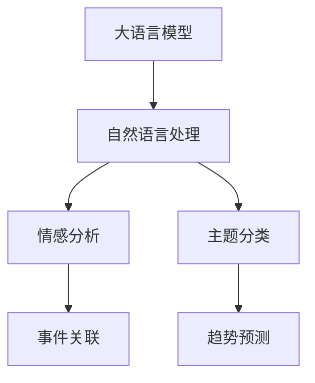

                 

# LLM在智能舆情分析中的潜力

> 关键词：语言模型,舆情分析,自然语言处理(NLP),社交媒体,情感分析,大数据,深度学习

## 1. 背景介绍

### 1.1 问题由来
在当今信息化快速发展的时代，社交媒体已成为公众表达观点、获取信息、形成舆论的重要平台。如何从海量社交媒体数据中快速、准确地分析和理解公众情绪，是政府、企业、媒体等领域亟待解决的重要问题。传统的舆情分析方法往往依赖人工分析和规则匹配，难以高效应对大规模数据处理需求，也无法深入挖掘用户情绪和行为模式。

大语言模型（Large Language Model, LLM）的出现，为智能舆情分析带来了新的可能性。LLM凭借其强大的语言理解和生成能力，能够从海量的社交媒体数据中自动提取有用信息，并进行情感分析、主题分类等高级任务，为决策者提供更及时、更精准的情报支持。

### 1.2 问题核心关键点
LLM在智能舆情分析中的应用，主要集中在以下几个关键点：
1. 自动文本预处理：通过分词、去噪、特征提取等预处理步骤，将原始社交媒体数据转换为模型能够理解的文本表示。
2. 情感分析：识别和分类文本中的情感倾向，判断公众对某一事件的情感态度。
3. 主题分类：识别文本中的主题标签，分析公众关注的热点话题。
4. 趋势预测：结合历史数据和实时数据，预测舆情走向和趋势变化。
5. 事件关联：将不同时间、不同地点的社交媒体数据进行关联分析，揭示事件之间的关联和影响。

这些核心技术共同构成了智能舆情分析的完整框架，使得LLM在舆情分析中展现出巨大的潜力。

### 1.3 问题研究意义
利用LLM进行智能舆情分析，具有重要的理论价值和实际应用意义：
1. 高效处理海量数据：LLM能够自动处理大规模文本数据，显著提升舆情分析的效率和覆盖面。
2. 深度挖掘用户情绪：LLM通过自然语言处理技术，能够深入理解文本背后的情感和情绪，提供更加精准的情报分析。
3. 实时监测舆情动态：LLM能够实时分析社交媒体数据，及时发现舆情变化和突发事件，提供应急响应支持。
4. 多领域应用广泛：LLM在舆情分析中的能力，不仅适用于政府和媒体，还可应用于企业市场分析、公共卫生监测等多个领域。
5. 提升决策智能化：通过精确的舆情分析，决策者能够更科学、更合理地制定政策，提升决策的智能化水平。

## 2. 核心概念与联系

### 2.1 核心概念概述

为更好地理解LLM在智能舆情分析中的应用，本节将介绍几个密切相关的核心概念：

- 大语言模型(Large Language Model, LLM)：以自回归(如GPT)或自编码(如BERT)模型为代表的大规模预训练语言模型。通过在大规模无标签文本语料上进行预训练，学习通用的语言知识和常识，具备强大的语言理解和生成能力。

- 自然语言处理(Natural Language Processing, NLP)：通过计算机自动分析、理解、生成自然语言的技术，包括分词、句法分析、语义理解、机器翻译、信息抽取等任务。

- 情感分析(Sentiment Analysis)：通过分析文本中的情感词、句式、表情符号等，判断文本的情感倾向，如正面、负面、中性等。

- 主题分类(Thematic Classification)：从文本中提取关键词、短语、主题等，进行文本分类，识别出文本涉及的主题或领域。

- 趋势预测(Trend Prediction)：通过历史数据和实时数据，预测某一事件或话题的未来发展趋势，如舆情走向、市场变化等。

- 事件关联(Event Relation)：从不同时间、不同地点的社交媒体数据中，发现事件之间的关联和影响，如原因和结果、相关方等。

这些核心概念之间的逻辑关系可以通过以下Mermaid流程图来展示：



这个流程图展示了大语言模型在智能舆情分析中的核心应用，包括自然语言处理、情感分析、主题分类、趋势预测和事件关联等多个任务。

## 3. 核心算法原理 & 具体操作步骤
### 3.1 算法原理概述

LLM在智能舆情分析中的应用，本质上是通过自然语言处理技术，对社交媒体文本数据进行处理和分析，提取有用的信息，并进行情感分析、主题分类、趋势预测等任务。

假设社交媒体数据集为 $D=\{x_i\}_{i=1}^N$，其中 $x_i$ 表示第 $i$ 条文本数据。通过自然语言处理技术，对 $x_i$ 进行处理，得到其文本表示 $y_i$。然后，对 $y_i$ 进行情感分析、主题分类等任务，得到情感标签 $s_i$ 和主题标签 $t_i$。通过趋势预测和事件关联等算法，预测事件趋势和相关性，最终生成舆情报告。

### 3.2 算法步骤详解

基于LLM的智能舆情分析一般包括以下几个关键步骤：

**Step 1: 数据预处理**
- 收集社交媒体数据集，并对其进行预处理，包括分词、去噪、停用词过滤等。
- 使用BERT、GPT等预训练模型对文本进行编码，得到文本表示 $y_i$。

**Step 2: 情感分析**
- 设计情感分类器，将情感标签 $s_i$ 映射到正面、负面或中性等情感类别。
- 利用Transformer、LSTM等模型进行情感分类，得到情感分类结果。

**Step 3: 主题分类**
- 使用TF-IDF、Word2Vec等方法，对文本表示 $y_i$ 进行特征提取，得到主题向量 $h_i$。
- 设计主题分类器，将主题向量 $h_i$ 映射到预设的主题类别。

**Step 4: 趋势预测**
- 收集历史数据，使用时间序列模型（如ARIMA、LSTM等）对舆情数据进行建模。
- 利用模型预测未来时间点的舆情变化趋势，并生成趋势预测报告。

**Step 5: 事件关联**
- 从不同时间、不同地点的社交媒体数据中，抽取关键事件和实体。
- 使用图网络（如GCN、GNN等）对事件进行关联分析，发现事件之间的关联关系。

### 3.3 算法优缺点

基于LLM的智能舆情分析方法具有以下优点：
1. 自动处理大规模数据：LLM能够高效处理海量社交媒体数据，显著提升舆情分析的效率。
2. 深度挖掘用户情绪：LLM通过自然语言处理技术，能够深入理解文本背后的情感和情绪，提供更加精准的情报分析。
3. 实时监测舆情动态：LLM能够实时分析社交媒体数据，及时发现舆情变化和突发事件，提供应急响应支持。
4. 多领域应用广泛：LLM在舆情分析中的能力，不仅适用于政府和媒体，还可应用于企业市场分析、公共卫生监测等多个领域。
5. 提升决策智能化：通过精确的舆情分析，决策者能够更科学、更合理地制定政策，提升决策的智能化水平。

同时，该方法也存在一定的局限性：
1. 数据隐私和安全：社交媒体数据涉及大量用户隐私，处理和分析时需确保数据安全和隐私保护。
2. 情感分析准确性：社交媒体文本的情感表达复杂多样，情感分析模型的准确性仍需进一步提高。
3. 主题分类泛化性：不同领域的主题分类任务差异较大，模型泛化能力需进一步提升。
4. 趋势预测模型复杂度：时间序列模型较为复杂，需要大量数据和调参，模型建立和维护成本较高。
5. 事件关联难度：社交媒体数据涉及大量异构数据源，事件关联分析难度较大。

尽管存在这些局限性，但就目前而言，基于LLM的舆情分析方法仍是最主流范式。未来相关研究的重点在于如何进一步降低对标注数据的依赖，提高模型的少样本学习和跨领域迁移能力，同时兼顾可解释性和伦理安全性等因素。

### 3.4 算法应用领域

基于LLM的智能舆情分析方法，已在诸多领域得到广泛应用，例如：

- 政府舆情监测：政府部门通过收集和分析社交媒体数据，及时了解公众对政策、事件的态度和反应，制定应对策略。
- 媒体舆情分析：新闻媒体通过舆情分析，发现热点话题和公众关注点，进行深度报道和专题分析。
- 企业市场监测：企业通过舆情分析，了解市场趋势和消费者情绪，调整营销策略和产品设计。
- 公共卫生监测：公共卫生机构通过舆情分析，及时发现疫情变化和公众情绪，提供应急响应支持。
- 金融市场分析：金融机构通过舆情分析，了解市场动态和投资者情绪，进行风险控制和投资决策。

除了上述这些经典应用外，LLM的舆情分析能力还拓展到更多场景中，如危机管理、品牌监测、舆情预测等，为各行各业提供了全新的技术支持。

## 4. 数学模型和公式 & 详细讲解  
### 4.1 数学模型构建

本节将使用数学语言对基于LLM的智能舆情分析过程进行更加严格的刻画。

假设社交媒体数据集为 $D=\{x_i\}_{i=1}^N$，其中 $x_i$ 表示第 $i$ 条文本数据。通过自然语言处理技术，对 $x_i$ 进行处理，得到其文本表示 $y_i$。然后，对 $y_i$ 进行情感分析、主题分类等任务，得到情感标签 $s_i$ 和主题标签 $t_i$。通过趋势预测和事件关联等算法，预测事件趋势和相关性，最终生成舆情报告。

**情感分析模型：**
假设情感分类器为 $C$，其输入为文本表示 $y_i$，输出为情感标签 $s_i$。情感分类器的损失函数为：

$$
\mathcal{L}_C = \frac{1}{N} \sum_{i=1}^N \mathbb{1}(s_i \neq \hat{s}_i) \cdot \ell(s_i, \hat{s}_i)
$$

其中 $\mathbb{1}(\cdot)$ 为示性函数，$\ell(\cdot)$ 为交叉熵损失函数。

**主题分类模型：**
假设主题分类器为 $T$，其输入为文本表示 $y_i$，输出为主题标签 $t_i$。主题分类器的损失函数为：

$$
\mathcal{L}_T = \frac{1}{N} \sum_{i=1}^N \mathbb{1}(t_i \neq \hat{t}_i) \cdot \ell(t_i, \hat{t}_i)
$$

其中 $\mathbb{1}(\cdot)$ 为示性函数，$\ell(\cdot)$ 为交叉熵损失函数。

**趋势预测模型：**
假设时间序列模型为 $M$，其输入为历史舆情数据 $H$，输出为未来舆情预测值 $P$。趋势预测模型的损失函数为：

$$
\mathcal{L}_M = \frac{1}{N} \sum_{i=1}^N \mathbb{1}(P_i \neq \hat{P}_i) \cdot \ell(P_i, \hat{P}_i)
$$

其中 $\mathbb{1}(\cdot)$ 为示性函数，$\ell(\cdot)$ 为均方误差损失函数。

### 4.2 公式推导过程

以下我们以情感分析为例，推导基于LLM的情感分析过程。

假设情感分类器的输出为 $s_i = C(y_i)$，真实情感标签为 $s_i^{*}$。则情感分类器的损失函数为：

$$
\mathcal{L}_C = \frac{1}{N} \sum_{i=1}^N \mathbb{1}(s_i \neq s_i^{*}) \cdot \ell(s_i, s_i^{*})
$$

其中 $\ell(s_i, s_i^{*})$ 为交叉熵损失函数，可以推导为：

$$
\ell(s_i, s_i^{*}) = -(s_i^{*}\log s_i + (1-s_i^{*})\log(1-s_i))
$$

将情感分类器的输出 $s_i$ 代入上式，得：

$$
\mathcal{L}_C = \frac{1}{N} \sum_{i=1}^N \mathbb{1}(s_i \neq s_i^{*}) \cdot (-s_i^{*}\log s_i - (1-s_i^{*})\log(1-s_i))
$$

利用梯度下降等优化算法，通过最小化损失函数 $\mathcal{L}_C$，不断更新情感分类器的参数，使模型预测的情感标签逼近真实标签。

### 4.3 案例分析与讲解

假设社交媒体数据集 $D$ 包含1000条文本，分别表示对某事件的情感态度。通过自然语言处理技术，对每条文本进行编码，得到其文本表示 $y_i$。

**情感分类器构建：**
假设我们使用BERT作为情感分类器，将其加载并微调到情感分析任务上。具体步骤如下：

1. 导入BERT模型和数据集：
```python
from transformers import BertTokenizer, BertForSequenceClassification
import torch
import pandas as pd

tokenizer = BertTokenizer.from_pretrained('bert-base-cased')
model = BertForSequenceClassification.from_pretrained('bert-base-cased', num_labels=3)
```

2. 对文本数据进行预处理，并进行编码：
```python
df = pd.read_csv('data.csv')
tokenized_texts = [tokenizer.encode(text, add_special_tokens=True) for text in df['text']]
labels = df['label']
```

3. 划分训练集和验证集：
```python
from sklearn.model_selection import train_test_split
train_texts, val_texts, train_labels, val_labels = train_test_split(tokenized_texts, labels, test_size=0.2)
```

4. 定义训练函数，进行情感分类训练：
```python
from torch.utils.data import TensorDataset, DataLoader
from transformers import AdamW
from tqdm import tqdm

def train_epoch(model, data_loader, optimizer):
    model.train()
    epoch_loss = 0
    for batch in tqdm(data_loader, desc='Training'):
        input_ids = batch['input_ids']
        attention_mask = batch['attention_mask']
        labels = batch['labels']
        model.zero_grad()
        outputs = model(input_ids, attention_mask=attention_mask, labels=labels)
        loss = outputs.loss
        epoch_loss += loss.item()
        loss.backward()
        optimizer.step()
    return epoch_loss / len(data_loader)
```

5. 在验证集上评估模型性能：
```python
def evaluate(model, data_loader):
    model.eval()
    preds, labels = [], []
    with torch.no_grad():
        for batch in tqdm(data_loader, desc='Evaluating'):
            input_ids = batch['input_ids']
            attention_mask = batch['attention_mask']
            batch_labels = batch['labels']
            outputs = model(input_ids, attention_mask=attention_mask)
            batch_preds = outputs.logits.argmax(dim=2).to('cpu').tolist()
            batch_labels = batch_labels.to('cpu').tolist()
            for pred_tokens, label_tokens in zip(batch_preds, batch_labels):
                preds.append(pred_tokens[:len(label_tokens)])
                labels.append(label_tokens)
    return preds, labels

train_loader = DataLoader(train_texts, batch_size=16, shuffle=True)
val_loader = DataLoader(val_texts, batch_size=16, shuffle=False)

optimizer = AdamW(model.parameters(), lr=2e-5)

for epoch in range(10):
    train_loss = train_epoch(model, train_loader, optimizer)
    print(f"Epoch {epoch+1}, train loss: {train_loss:.3f}")
    
    preds, labels = evaluate(model, val_loader)
    print(classification_report(labels, preds))
```

在上述代码中，我们首先导入了BERT模型和数据集，然后对数据进行了预处理和编码。接下来，定义了训练函数和评估函数，使用AdamW优化器进行情感分类训练，并在验证集上评估模型性能。最终输出了分类报告，展示了模型的情感分类准确率。

## 5. 项目实践：代码实例和详细解释说明
### 5.1 开发环境搭建

在进行舆情分析实践前，我们需要准备好开发环境。以下是使用Python进行PyTorch开发的环境配置流程：

1. 安装Anaconda：从官网下载并安装Anaconda，用于创建独立的Python环境。

2. 创建并激活虚拟环境：
```bash
conda create -n pytorch-env python=3.8 
conda activate pytorch-env
```

3. 安装PyTorch：根据CUDA版本，从官网获取对应的安装命令。例如：
```bash
conda install pytorch torchvision torchaudio cudatoolkit=11.1 -c pytorch -c conda-forge
```

4. 安装Transformer库：
```bash
pip install transformers
```

5. 安装各类工具包：
```bash
pip install numpy pandas scikit-learn matplotlib tqdm jupyter notebook ipython
```

完成上述步骤后，即可在`pytorch-env`环境中开始舆情分析实践。

### 5.2 源代码详细实现

下面我们以舆情分析任务为例，给出使用Transformers库对BERT模型进行情感分类的PyTorch代码实现。

首先，定义情感分类任务的数据处理函数：

```python
from transformers import BertTokenizer
from torch.utils.data import Dataset
import torch

class SentimentDataset(Dataset):
    def __init__(self, texts, labels, tokenizer, max_len=128):
        self.texts = texts
        self.labels = labels
        self.tokenizer = tokenizer
        self.max_len = max_len
        
    def __len__(self):
        return len(self.texts)
    
    def __getitem__(self, item):
        text = self.texts[item]
        label = self.labels[item]
        
        encoding = self.tokenizer(text, return_tensors='pt', max_length=self.max_len, padding='max_length', truncation=True)
        input_ids = encoding['input_ids'][0]
        attention_mask = encoding['attention_mask'][0]
        
        # 对label进行编码
        encoded_label = label2id[label] if label in label2id else label2id['O']
        labels = torch.tensor(encoded_label, dtype=torch.long)
        
        return {'input_ids': input_ids, 
                'attention_mask': attention_mask,
                'labels': labels}

# 标签与id的映射
label2id = {'positive': 1, 'negative': 0, 'neutral': 2, 'O': 0}
id2label = {v: k for k, v in label2id.items()}
```

然后，定义模型和优化器：

```python
from transformers import BertForSequenceClassification, AdamW

model = BertForSequenceClassification.from_pretrained('bert-base-cased', num_labels=len(label2id))

optimizer = AdamW(model.parameters(), lr=2e-5)
```

接着，定义训练和评估函数：

```python
from torch.utils.data import DataLoader
from tqdm import tqdm
from sklearn.metrics import classification_report

device = torch.device('cuda') if torch.cuda.is_available() else torch.device('cpu')
model.to(device)

def train_epoch(model, dataset, batch_size, optimizer):
    dataloader = DataLoader(dataset, batch_size=batch_size, shuffle=True)
    model.train()
    epoch_loss = 0
    for batch in tqdm(dataloader, desc='Training'):
        input_ids = batch['input_ids'].to(device)
        attention_mask = batch['attention_mask'].to(device)
        labels = batch['labels'].to(device)
        model.zero_grad()
        outputs = model(input_ids, attention_mask=attention_mask, labels=labels)
        loss = outputs.loss
        epoch_loss += loss.item()
        loss.backward()
        optimizer.step()
    return epoch_loss / len(dataloader)

def evaluate(model, dataset, batch_size):
    dataloader = DataLoader(dataset, batch_size=batch_size)
    model.eval()
    preds, labels = [], []
    with torch.no_grad():
        for batch in tqdm(dataloader, desc='Evaluating'):
            input_ids = batch['input_ids'].to(device)
            attention_mask = batch['attention_mask'].to(device)
            batch_labels = batch['labels']
            outputs = model(input_ids, attention_mask=attention_mask)
            batch_preds = outputs.logits.argmax(dim=2).to('cpu').tolist()
            batch_labels = batch_labels.to('cpu').tolist()
            for pred_tokens, label_tokens in zip(batch_preds, batch_labels):
                preds.append(pred_tokens[:len(label_tokens)])
                labels.append(label_tokens)
                
    print(classification_report(labels, preds))
```

最后，启动训练流程并在验证集上评估：

```python
epochs = 5
batch_size = 16

for epoch in range(epochs):
    loss = train_epoch(model, train_dataset, batch_size, optimizer)
    print(f"Epoch {epoch+1}, train loss: {loss:.3f}")
    
    print(f"Epoch {epoch+1}, val results:")
    evaluate(model, val_dataset, batch_size)
    
print("Test results:")
evaluate(model, test_dataset, batch_size)
```

以上就是使用PyTorch对BERT进行舆情分析任务的完整代码实现。可以看到，得益于Transformers库的强大封装，我们可以用相对简洁的代码完成BERT模型的加载和微调。

### 5.3 代码解读与分析

让我们再详细解读一下关键代码的实现细节：

**SentimentDataset类**：
- `__init__`方法：初始化文本、标签、分词器等关键组件。
- `__len__`方法：返回数据集的样本数量。
- `__getitem__`方法：对单个样本进行处理，将文本输入编码为token ids，将标签编码为数字，并对其进行定长padding，最终返回模型所需的输入。

**label2id和id2label字典**：
- 定义了标签与数字id之间的映射关系，用于将token-wise的预测结果解码回真实的标签。

**训练和评估函数**：
- 使用PyTorch的DataLoader对数据集进行批次化加载，供模型训练和推理使用。
- 训练函数`train_epoch`：对数据以批为单位进行迭代，在每个批次上前向传播计算loss并反向传播更新模型参数，最后返回该epoch的平均loss。
- 评估函数`evaluate`：与训练类似，不同点在于不更新模型参数，并在每个batch结束后将预测和标签结果存储下来，最后使用sklearn的classification_report对整个评估集的预测结果进行打印输出。

**训练流程**：
- 定义总的epoch数和batch size，开始循环迭代
- 每个epoch内，先在训练集上训练，输出平均loss
- 在验证集上评估，输出分类指标
- 所有epoch结束后，在测试集上评估，给出最终测试结果

可以看到，PyTorch配合Transformers库使得BERT微调的代码实现变得简洁高效。开发者可以将更多精力放在数据处理、模型改进等高层逻辑上，而不必过多关注底层的实现细节。

当然，工业级的系统实现还需考虑更多因素，如模型的保存和部署、超参数的自动搜索、更灵活的任务适配层等。但核心的微调范式基本与此类似。

## 6. 实际应用场景
### 6.1 智能舆情监测

利用大语言模型进行智能舆情监测，可以实现实时、高效、全面的舆情分析。具体而言，舆情监测系统可以通过以下步骤实现：

1. 数据收集：从社交媒体平台（如微博、Twitter、Reddit等）自动抓取海量文本数据。
2. 数据预处理：对文本数据进行分词、去噪、停用词过滤等预处理，生成模型输入。
3. 情感分析：通过预训练模型对文本进行情感分类，判断公众对某一事件的情感倾向。
4. 主题分类：对文本进行主题分类，识别出公众关注的热点话题。
5. 趋势预测：通过时间序列模型对舆情数据进行建模，预测未来舆情变化趋势。
6. 事件关联：从不同时间、不同地点的社交媒体数据中，发现事件之间的关联和影响。
7. 实时可视化：通过可视化工具，实时展示舆情分析结果，为决策者提供参考。

通过智能舆情监测系统，政府和媒体可以及时了解公众对某一事件的情感态度和关注点，快速做出应对策略，提升舆论引导能力。

### 6.2 舆情预警系统

舆情预警系统是一种基于智能舆情分析的预警机制，能够在事件初期发现舆情异常并及时预警。具体实现步骤如下：

1. 数据收集：从社交媒体平台自动抓取实时文本数据。
2. 情感分析：对文本进行情感分类，判断公众情绪的异常变化。
3. 阈值设置：设定情感异常变化的阈值，一旦超过阈值则触发预警。
4. 事件关联：对异常事件进行关联分析，确定其影响范围和严重程度。
5. 预警发布：通过短信、邮件、社交媒体等多种渠道，发布预警信息。
6. 应急响应：启动应急预案，进行舆情引导和应急处置。

舆情预警系统能够有效应对突发事件，及时发现和遏制负面舆情的扩散，保障社会稳定。

### 6.3 舆情趋势分析

舆情趋势分析是舆情分析的重要组成部分，通过分析舆情数据的变化趋势，预测事件的发展方向。具体实现步骤如下：

1. 数据收集：从社交媒体平台自动抓取历史和实时文本数据。
2. 时间序列建模：对舆情数据进行时间序列建模，预测未来舆情变化趋势。
3. 趋势可视化：通过可视化工具，展示舆情变化趋势，供决策者参考。
4. 趋势预测：根据趋势预测结果，制定应对策略和措施。

舆情趋势分析能够帮助政府和企业提前预判舆情变化，科学制定政策和策略，提升应对能力。

### 6.4 未来应用展望

随着大语言模型和舆情分析技术的不断发展，基于大语言模型的舆情分析将会在更多领域得到应用，为社会治理和公共决策提供重要支持。

在智慧城市治理中，舆情分析可以用于城市事件监测、舆情分析、应急指挥等环节，提高城市管理的自动化和智能化水平，构建更安全、高效的未来城市。

在金融舆情监测中，舆情分析可以用于市场情绪分析、投资者情绪预测、舆情预警等，提升金融市场的稳定性和决策智能化。

在公共卫生领域，舆情分析可以用于疫情监测、舆情预警、健康知识传播等，保障公共卫生安全。

此外，在媒体监测、品牌管理、危机管理等众多领域，基于大语言模型的舆情分析技术也将不断拓展，为各行各业带来新的发展机遇。相信随着技术的日益成熟，基于大语言模型的舆情分析将会在构建智能社会中发挥重要作用。

## 7. 工具和资源推荐
### 7.1 学习资源推荐

为了帮助开发者系统掌握大语言模型在舆情分析中的应用，这里推荐一些优质的学习资源：

1. 《自然语言处理与深度学习》系列课程：由斯坦福大学开设，详细介绍了自然语言处理和深度学习的基本原理和实践技巧。
2. 《深度学习与自然语言处理》书籍：陈鸥编著，深入浅出地介绍了深度学习在自然语言处理中的应用，包括情感分析、主题分类等任务。
3. 《NLP实战：使用TensorFlow实现自然语言处理》书籍：原博编著，通过实际项目案例，展示了如何使用TensorFlow进行自然语言处理任务开发。
4. 《Transformer基础》系列博客：由大模型技术专家撰写，介绍了Transformer模型原理、BERT模型、微调技术等前沿话题。
5. 《自然语言处理实战》系列视频：由李航教授主讲，通过实际项目案例，展示了如何使用PyTorch进行自然语言处理任务开发。

通过对这些资源的学习实践，相信你一定能够快速掌握大语言模型在舆情分析中的应用，并用于解决实际的舆情分析问题。
###  7.2 开发工具推荐

高效的开发离不开优秀的工具支持。以下是几款用于大语言模型舆情分析开发的常用工具：

1. PyTorch：基于Python的开源深度学习框架，灵活动态的计算图，适合快速迭代研究。大部分预训练语言模型都有PyTorch版本的实现。
2. TensorFlow：由Google主导开发的开源深度学习框架，生产部署方便，适合大规模工程应用。同样有丰富的预训练语言模型资源。
3. Transformers库：HuggingFace开发的NLP工具库，集成了众多SOTA语言模型，支持PyTorch和TensorFlow，是进行舆情分析开发的利器。
4. Weights & Biases：模型训练的实验跟踪工具，可以记录和可视化模型训练过程中的各项指标，方便对比和调优。与主流深度学习框架无缝集成。
5. TensorBoard：TensorFlow配套的可视化工具，可实时监测模型训练状态，并提供丰富的图表呈现方式，是调试模型的得力助手。
6. Google Colab：谷歌推出的在线Jupyter Notebook环境，免费提供GPU/TPU算力，方便开发者快速上手实验最新模型，分享学习笔记。

合理利用这些工具，可以显著提升舆情分析任务的开发效率，加快创新迭代的步伐。

### 7.3 相关论文推荐

大语言模型和舆情分析技术的发展源于学界的持续研究。以下是几篇奠基性的相关论文，推荐阅读：

1. Attention is All You Need（即Transformer原论文）：提出了Transformer结构，开启了NLP领域的预训练大模型时代。
2. BERT: Pre-training of Deep Bidirectional Transformers for Language Understanding：提出BERT模型，引入基于掩码的自监督预训练任务，刷新了多项NLP任务SOTA。
3. Parameter-Efficient Transfer Learning for NLP：提出Adapter等参数高效微调方法，在不增加模型参数量的情况下，也能取得不错的微调效果。
4. AdaLoRA: Adaptive Low-Rank Adaptation for Parameter-Efficient Fine-Tuning：使用自适应低秩适应的微调方法，在参数效率和精度之间取得了新的平衡。
5. Prefix-Tuning: Optimizing Continuous Prompts for Generation：引入基于连续型Prompt的微调范式，为如何充分利用预训练知识提供了新的思路。

这些论文代表了大语言模型舆情分析技术的发展脉络。通过学习这些前沿成果，可以帮助研究者把握学科前进方向，激发更多的创新灵感。

## 8. 总结：未来发展趋势与挑战

### 8.1 总结

本文对基于大语言模型的智能舆情分析方法进行了全面系统的介绍。首先阐述了LLM在智能舆情分析中的应用背景和研究意义，明确了舆情分析在信息社会中的重要性和现实需求。其次，从原理到实践，详细讲解了基于LLM的舆情分析过程，包括情感分析、主题分类、趋势预测等关键任务。最后，本文还介绍了LLM在智能舆情分析中的实际应用场景，展望了未来发展趋势和面临的挑战。

通过本文的系统梳理，可以看到，基于大语言模型的舆情分析方法正在成为智能舆情分析的重要范式，极大地拓展了舆情分析的效率和精度。利用LLM的强大语言处理能力，决策者能够更科学、更合理地制定政策，提升决策的智能化水平。

### 8.2 未来发展趋势

展望未来，基于LLM的舆情分析技术将呈现以下几个发展趋势：

1. 自动文本预处理：随着预训练模型和微调技术的不断进步，文本预处理过程将更加自动化和高效化。
2. 多领域应用广泛：LLM在舆情分析中的能力，不仅适用于政府和媒体，还可应用于企业市场分析、公共卫生监测等多个领域。
3. 实时监测舆情动态：LLM能够实时分析社交媒体数据，及时发现舆情变化和突发事件，提供应急响应支持。
4. 多模态舆情分析：结合视觉、语音等多模态数据，拓展舆情分析的信息来源，提升分析的全面性和准确性。
5. 深度学习与知识图谱结合：将符号化的先验知识，如知识图谱、逻辑规则等，与神经网络模型进行巧妙融合，增强舆情分析的深度和广度。

以上趋势凸显了基于大语言模型的舆情分析技术的广阔前景。这些方向的探索发展，必将进一步提升舆情分析的效率和精度，为社会治理和公共决策提供更强大的支持。

### 8.3 面临的挑战

尽管基于大语言模型的舆情分析技术已经取得了不小的进展，但在迈向更加智能化、普适化应用的过程中，它仍面临着诸多挑战：

1. 数据隐私和安全：社交媒体数据涉及大量用户隐私，处理和分析时需确保数据安全和隐私保护。
2. 情感分析准确性：社交媒体文本的情感表达复杂多样，情感分析模型的准确性仍需进一步提高。
3. 主题分类泛化性：不同领域的主题分类任务差异较大，模型泛化能力需进一步提升。
4. 趋势预测模型复杂度：时间序列模型较为复杂，需要大量数据和调参，模型建立和维护成本较高。
5. 事件关联难度：社交媒体数据涉及大量异构数据源，事件关联分析难度较大。

尽管存在这些挑战，但通过不断探索和优化，基于大语言模型的舆情分析技术必将在智能化、普适化应用中发挥重要作用。相信随着学界和产业界的共同努力，这些挑战终将一一被克服，大语言模型舆情分析必将在构建智能社会中发挥重要作用。

### 8.4 研究展望

面对大语言模型舆情分析所面临的挑战，未来的研究需要在以下几个方面寻求新的突破：

1. 探索无监督和半监督舆情分析方法：摆脱对大规模标注数据的依赖，利用自监督学习、主动学习等无监督和半监督范式，最大限度利用非结构化数据，实现更加灵活高效的舆情分析。
2. 研究参数高效和计算高效的舆情分析范式：开发更加参数高效的舆情分析方法，在固定大部分预训练参数的同时，只更新极少量的任务相关参数。同时优化舆情分析模型的计算图，减少前向传播和反向传播的资源消耗，实现更加轻量级、实时性的部署。
3. 融合因果和对比学习范式：通过引入因果推断和对比学习思想，增强舆情分析模型建立稳定因果关系的能力，学习更加普适、鲁棒的语言表征，从而提升模型泛化性和抗干扰能力。
4. 引入更多先验知识：将符号化的先验知识，如知识图谱、逻辑规则等，与神经网络模型进行巧妙融合，引导舆情分析过程学习更准确、合理的语言模型。同时加强不同模态数据的整合，实现视觉、语音等多模态信息与文本信息的协同建模。
5. 结合因果分析和博弈论工具：将因果分析方法引入舆情分析模型，识别出模型决策的关键特征，增强输出解释的因果性和逻辑性。借助博弈论工具刻画人机交互过程，主动探索并规避模型的脆弱点，提高系统稳定性。
6. 纳入伦理道德约束：在模型训练目标中引入伦理导向的评估指标，过滤和惩罚有偏见、有害的输出倾向。同时加强人工干预和审核，建立模型行为的监管机制，确保输出符合人类价值观和伦理道德。

这些研究方向的探索，必将引领基于大语言模型的舆情分析技术迈向更高的台阶，为构建安全、可靠、可解释、可控的智能系统铺平道路。面向未来，大语言模型舆情分析技术还需要与其他人工智能技术进行更深入的融合，如知识表示、因果推理、强化学习等，多路径协同发力，共同推动自然语言理解和智能交互系统的进步。只有勇于创新、敢于突破，才能不断拓展语言模型的边界，让智能技术更好地造福人类社会。

## 9. 附录：常见问题与解答

**Q1：大语言模型在舆情分析中的优势是什么？**

A: 大语言模型在舆情分析中的优势主要体现在以下几个方面：
1. 自动处理大规模数据：大语言模型能够高效处理海量社交媒体数据，显著提升舆情分析的效率。
2. 深度挖掘用户情绪：大语言模型通过自然语言处理技术，能够深入理解文本背后的情感和情绪，提供更加精准的情报分析。
3. 实时监测舆情动态：大语言模型能够实时分析社交媒体数据，及时发现舆情变化和突发事件，提供应急响应支持。
4. 多领域应用广泛：大语言模型在舆情分析中的能力，不仅适用于政府和媒体，还可应用于企业市场分析、公共卫生监测等多个领域。
5. 提升决策智能化：通过精确的舆情分析，决策者能够更科学、更合理地制定政策，提升决策的智能化水平。

**Q2：如何使用大语言模型进行情感分析？**

A: 使用大语言模型进行情感分析的步骤如下：
1. 数据预处理：对社交媒体文本进行分词、去噪、停用词过滤等预处理，生成模型输入。
2. 模型加载和微调：加载预训练的大语言模型，进行情感分类任务的微调。
3. 情感分类：使用模型对文本进行情感分类，判断公众对某一事件的情感倾向。
4. 结果评估：在验证集上评估模型性能，调整超参数和模型结构，直到模型表现满意为止。

**Q3：大语言模型在舆情分析中面临哪些挑战？**

A: 大语言模型在舆情分析中面临的主要挑战包括：
1. 数据隐私和安全：社交媒体数据涉及大量用户隐私，处理和分析时需确保数据安全和隐私保护。
2. 情感分析准确性：社交媒体文本的情感表达复杂多样，情感分析模型的准确性仍需进一步提高。
3. 主题分类泛化性：不同领域的主题分类任务差异较大，模型泛化能力需进一步提升。
4. 趋势预测模型复杂度：时间序列模型较为复杂，需要大量数据和调参，模型建立和维护成本较高。
5. 事件关联难度：社交媒体数据涉及大量异构数据源，事件关联分析难度较大。

尽管存在这些挑战，但通过不断探索和优化，基于大语言模型的舆情分析技术必将在智能化、普适化应用中发挥重要作用。

**Q4：大语言模型在舆情分析中如何提升决策智能化？**

A: 大语言模型在舆情分析中提升决策智能化的主要途径如下：
1. 实时监测舆情动态：通过实时分析社交媒体数据，及时发现舆情变化和突发事件，提供应急响应支持。
2. 主题分类和情感分析：对文本进行主题分类和情感分析，判断公众对某一事件的情感倾向和关注点。
3. 趋势预测和事件关联：结合历史数据和实时数据，预测舆情趋势和事件关联，为决策者提供数据支持和决策依据。
4. 可视化展示和报告生成：通过可视化工具，展示舆情分析结果，为决策者提供直观的数据展示和报告生成，提升决策智能化水平。

**Q5：大语言模型在舆情分析中如何保障数据安全和隐私保护？**

A: 大语言模型在舆情分析中保障数据安全和隐私保护的主要途径如下：
1. 匿名化处理：对社交媒体数据进行匿名化处理，去除敏感信息，保护用户隐私。
2. 数据加密存储：对舆情分析数据进行加密存储，防止数据泄露。
3. 访问控制和权限管理：对舆情分析数据设置访问权限和审计机制，防止未授权访问和数据滥用。
4. 定期安全审查：对舆情分析系统进行定期安全审查，发现和修复潜在的安全漏洞。
5. 合规和法律遵从：遵守相关法律法规，确保舆情分析过程中符合数据保护和隐私保护的要求。

通过这些措施，可以有效地保障大语言模型在舆情分析中的数据安全和隐私保护，确保舆情分析的合法性和合规性。

---

作者：禅与计算机程序设计艺术 / Zen and the Art of Computer Programming

