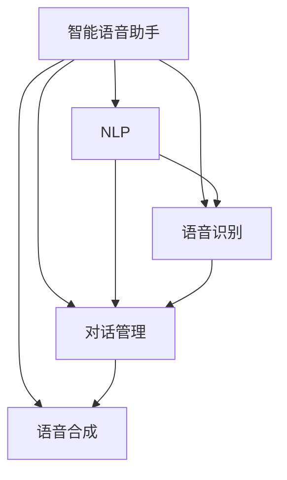

                 

# LLM在智能语音助手中的应用：自然交互的新境界

> 关键词：智能语音助手,自然语言处理(NLP),语言模型,语音识别,对话管理,语音合成

## 1. 背景介绍

### 1.1 问题由来
智能语音助手作为下一代人机交互的重要载体，正在迅速改变我们的日常生活和工作方式。从简单的语音控制智能家居，到复杂的交互式任务处理，语音助手正逐步渗透到人类生活的方方面面。然而，传统基于规则和模板的语音助手，在应对非预期的用户请求和场景变化时，往往表现出缺乏智能和弹性。

近年来，基于大规模语言模型(Large Language Models, LLMs)的智能语音助手开始崭露头角。以语言模型为核心的语音助手，通过在丰富的语料上进行预训练，具备强大的语言理解和生成能力，能够在实际应用中展现出显著的智能和灵活性。然而，语言模型的应用仍面临一些挑战，如实时响应的高效性、用户语义的理解准确性、对话上下文的连贯性等。

### 1.2 问题核心关键点
基于LLM的智能语音助手研究聚焦于以下几个核心问题：
1. 如何高效地利用语言模型生成自然流畅的响应，提升用户满意度。
2. 如何确保语音助手在对话中准确理解和回应用户的意图，避免误解和错误。
3. 如何构建持续学习和适应的对话管理机制，使语音助手具备更强的适应性和可扩展性。
4. 如何优化语音合成过程，使语音助手能够更加自然、清晰地表达，贴近真实语音特征。
5. 如何平衡模型的计算复杂度和性能，在资源受限的环境中提供高质量服务。

### 1.3 问题研究意义
智能语音助手的发展，对于提升人机交互的效率和智能化水平，具有重要意义：

1. 提升用户体验：通过自然流畅的对话，智能语音助手能够提供更加高效、智能的交互体验，减少用户的心理负担，提高任务完成的成功率。
2. 解放人力资源：语音助手能够处理重复性、低价值的任务，释放人力资源，让其专注于更有创造性和战略性的工作。
3. 促进产业发展：语音助手技术的应用，能够推动各行各业的数字化转型，加速自动化、智能化的进程。
4. 推动技术创新：语音助手技术的发展，催生了深度学习、自然语言处理(NLP)、语音合成等多个领域的突破，促进了人工智能技术的发展。

## 2. 核心概念与联系

### 2.1 核心概念概述

为更好地理解LLM在智能语音助手中的应用，本节将介绍几个密切相关的核心概念：

- 智能语音助手：基于语音识别和语音合成的技术，结合自然语言处理(NLP)和对话管理算法，实现自然流畅的语音交互。
- 自然语言处理(NLP)：涉及文本分析、语义理解、情感分析等多个子领域，目标是使计算机能够理解和生成自然语言。
- 语言模型：通过学习大量文本数据，预测给定上下文下单词或短语的出现概率，是NLP中重要的基础模型。
- 语音识别：将语音信号转换为文本，是智能语音助手处理用户请求的重要环节。
- 对话管理：指智能语音助手在对话中，对用户的意图进行理解、推理和响应，确保对话的连贯性和准确性。
- 语音合成：将文本转换为可自然听辨的语音，是智能语音助手向用户传达信息的重要方式。

这些核心概念之间的逻辑关系可以通过以下Mermaid流程图来展示：



这个流程图展示了大语言模型在智能语音助手中的核心作用：

1. 智能语音助手通过语音识别获取用户的语音请求，将其转换为文本。
2. 利用语言模型进行自然语言处理，理解用户的意图，并生成合适的响应。
3. 对话管理算法根据上下文信息，对响应进行筛选和调整。
4. 语音合成技术将生成的文本转换为自然流畅的语音，向用户传达信息。

## 3. 核心算法原理 & 具体操作步骤
### 3.1 算法原理概述

基于LLM的智能语音助手，其核心算法原理如下：

1. 语音识别：将用户语音转换为文本，是智能语音助手的第一步。常用的语音识别模型包括隐马尔可夫模型(HMM)、深度神经网络(DNN)、卷积神经网络(CNN)等。

2. 自然语言处理(NLP)：利用语言模型对用户文本进行语义分析和情感分析，识别出用户的意图和情感倾向。常见的语言模型包括Transformer、BERT、GPT等。

3. 对话管理：根据用户意图和对话历史，决定最合适的回应。对话管理通常采用基于规则或基于强化学习的框架，确保对话的连贯性和逻辑性。

4. 语音合成：将生成的文本转换为语音，常用的语音合成模型包括声码器(如WaveNet、Tacotron等)和文本到语音(TTS)模型。

### 3.2 算法步骤详解

基于LLM的智能语音助手一般包括以下几个关键步骤：

**Step 1: 语音识别**
- 采集用户语音信号，通过前端麦克风设备进行录音。
- 将录音样本送入语音识别引擎，进行语音信号的特征提取和模型解码。
- 得到文本表示，输入到NLP模型进行下一步处理。

**Step 2: 自然语言处理**
- 将语音识别输出的文本，输入到预训练的LLM中。
- 利用语言模型对文本进行语义理解和情感分析，得到用户的意图。
- 语言模型可以基于连续型Prompt，引导模型按照期望的方式输出。

**Step 3: 对话管理**
- 根据用户意图和对话历史，生成最合适的回复。
- 对话管理可以采用基于规则或基于深度学习的框架，确保对话的连贯性和逻辑性。

**Step 4: 语音合成**
- 将生成的文本，输入到预训练的语音合成模型中。
- 通过声码器或TTS模型，将文本转换为自然流畅的语音。
- 语音信号经过预处理和后处理，最终通过扬声器输出。

### 3.3 算法优缺点

基于LLM的智能语音助手方法具有以下优点：
1. 灵活性高：LLM可以应对多种自然语言和语音形式，适应不同的用户和场景。
2. 泛化能力强：通过预训练获得通用语言知识，能够处理更多样化的语音请求。
3. 自适应性强：对话管理算法可以根据用户反馈进行持续学习，提升用户体验。
4. 可扩展性好：模块化设计，方便添加新的功能模块和算法模型。

同时，该方法也存在一定的局限性：
1. 计算资源需求高：大规模预训练模型和实时响应的要求，对计算资源和存储资源提出了较高要求。
2. 实时性要求高：语音识别和语音合成的实时性问题，对系统性能提出了挑战。
3. 数据隐私问题：语音信号和对话内容可能包含敏感信息，需要严格的数据保护措施。
4. 系统复杂度高：涉及语音识别、NLP、对话管理等多个环节，系统复杂性较高。
5. 性能可解释性差：语言模型和对话管理算法的决策过程缺乏可解释性，难以调试和优化。

尽管存在这些局限性，但LLM在智能语音助手中的应用，依然展现了强大的潜力和前景。通过不断优化算法和系统设计，这些挑战将被逐步克服。

### 3.4 算法应用领域

基于LLM的智能语音助手，已经在多个领域得到广泛应用，包括但不限于：

1. 家庭智能家居控制：语音助手可以控制家电、灯光、温度等，提升家庭生活的便捷性。
2. 车载导航系统：语音助手提供导航、语音搜索、音乐播放等功能，提升驾驶体验。
3. 商业客服系统：语音助手可以处理客户咨询、订单管理、故障报告等任务，提升客户服务质量。
4. 健康医疗辅助：语音助手可以提醒服药时间、记录健康数据、提供健康建议等，提升健康管理水平。
5. 教育培训辅助：语音助手可以提供在线学习、作业批改、知识推荐等，辅助教育培训。
6. 游戏娱乐互动：语音助手可以提供游戏指令、情节推演、情感陪伴等功能，提升游戏体验。

## 4. 数学模型和公式 & 详细讲解  
### 4.1 数学模型构建

本节将使用数学语言对基于LLM的智能语音助手进行更加严格的刻画。

记用户输入语音为 $x \in \mathbb{R}^{T_x}$，输出文本为 $y \in \mathbb{R}^{T_y}$，其中 $T_x$ 和 $T_y$ 分别为语音信号和文本序列的长度。

假设语音识别模型为 $P(x|y)$，语言模型为 $P(y)$，对话管理模型为 $P_r(y|x)$，语音合成模型为 $P_{tts}(z|y)$，其中 $z \in \mathbb{R}^{T_z}$ 为输出语音信号。智能语音助手系统的整体模型如下：

$$
P(z|x) = \int P(x|y)P(y|x)P_{tts}(z|y) dy
$$

其中 $P(y|x)$ 为对话管理模型，在给定用户语音 $x$ 的情况下，生成最合适的文本回复 $y$。

在实际应用中，通常将模型拆分为多个模块，分别处理语音识别、自然语言处理、对话管理、语音合成等环节，如上图所示。

### 4.2 公式推导过程

以下我们以一个简单的基于LLM的智能语音助手为例，推导语音识别和语音合成的数学模型。

假设用户语音信号为 $x$，语音识别模型为 $P(x|y)$，语言模型为 $P(y)$，对话管理模型为 $P_r(y|x)$，语音合成模型为 $P_{tts}(z|y)$。语音助手整体模型为：

$$
P(z|x) = \int P(x|y)P_r(y|x)P_{tts}(z|y) dy
$$

将上式展开，得到：

$$
P(z|x) = \sum_{y \in \mathcal{Y}} P(x|y)P_r(y|x)P_{tts}(z|y)
$$

其中 $\mathcal{Y}$ 为所有可能的文本回复集。

在实际计算时，通常将模型拆分为多个子模块，分别处理语音识别和语音合成等环节。通过逐级计算，得到最终的输出语音信号 $z$。

### 4.3 案例分析与讲解

以基于LLM的智能语音助手在客服中心的应用为例，进行分析讲解。

1. 语音识别：将用户语音信号 $x$ 输入语音识别模型，得到文本回复 $y$。
2. 自然语言处理：将文本回复 $y$ 输入语言模型，识别出用户的意图和情感倾向。
3. 对话管理：根据用户的意图和对话历史，生成最合适的回复。
4. 语音合成：将生成的回复 $y$ 输入语音合成模型，转换为自然流畅的语音信号 $z$。
5. 输出语音：将语音信号 $z$ 输出到扬声器，完成语音交互。

## 5. 项目实践：代码实例和详细解释说明
### 5.1 开发环境搭建

在进行项目实践前，我们需要准备好开发环境。以下是使用Python进行PyTorch开发的环境配置流程：

1. 安装Anaconda：从官网下载并安装Anaconda，用于创建独立的Python环境。

2. 创建并激活虚拟环境：
```bash
conda create -n pytorch-env python=3.8 
conda activate pytorch-env
```

3. 安装PyTorch：根据CUDA版本，从官网获取对应的安装命令。例如：
```bash
conda install pytorch torchvision torchaudio cudatoolkit=11.1 -c pytorch -c conda-forge
```

4. 安装Transformers库：
```bash
pip install transformers
```

5. 安装各类工具包：
```bash
pip install numpy pandas scikit-learn matplotlib tqdm jupyter notebook ipython
```

完成上述步骤后，即可在`pytorch-env`环境中开始项目实践。

### 5.2 源代码详细实现

下面我们以基于LLM的智能语音助手在客服中心的应用为例，给出完整的代码实现。

```python
from transformers import BertTokenizer, BertForTokenClassification
from transformers import Wav2Vec2Model, Wav2Vec2Processor
from transformers import AutoTokenizer, AutoModelForCausalLM

import torch
import torchaudio
from torch.utils.data import Dataset, DataLoader
from tqdm import tqdm

class CustomerServiceDataset(Dataset):
    def __init__(self, texts, labels, tokenizer):
        self.texts = texts
        self.labels = labels
        self.tokenizer = tokenizer
        self.max_len = 128

    def __len__(self):
        return len(self.texts)

    def __getitem__(self, item):
        text = self.texts[item]
        label = self.labels[item]

        encoding = self.tokenizer(text, return_tensors='pt', max_length=self.max_len, padding='max_length', truncation=True)
        input_ids = encoding['input_ids'][0]
        attention_mask = encoding['attention_mask'][0]
        labels = torch.tensor(label, dtype=torch.long)

        return {'input_ids': input_ids, 
                'attention_mask': attention_mask,
                'labels': labels}

tokenizer = BertTokenizer.from_pretrained('bert-base-cased')
model = BertForTokenClassification.from_pretrained('bert-base-cased', num_labels=2)

class SpeechRecognitionModel():
    def __init__(self, model_name='wav2vec2-large'):
        self.model = Wav2Vec2Model.from_pretrained(model_name)
        self.processor = Wav2Vec2Processor.from_pretrained(model_name)

    def transcribe(self, audio):
        speech = torchaudio.load(audio)
        inputs = self.processor(speech[0], return_tensors='pt', sampling_rate=16000)
        logits = self.model(inputs.input_values)[0]
        probs = torch.softmax(logits, dim=-1)
        text = self.processor.decode(logits.argmax(-1))
        return text

class TTSModel():
    def __init__(self, model_name='text-to-speech'):
        self.model = AutoModelForCausalLM.from_pretrained(model_name)
        self.tokenizer = AutoTokenizer.from_pretrained(model_name)

    def synthesize(self, text):
        inputs = self.tokenizer(text, return_tensors='pt')
        outputs = self.model.generate(inputs.input_ids, num_return_sequences=1, temperature=1.0)
        return self.tokenizer.decode(outputs[0])

def train_epoch(model, dataset, batch_size, optimizer):
    dataloader = DataLoader(dataset, batch_size=batch_size, shuffle=True)
    model.train()
    epoch_loss = 0
    for batch in tqdm(dataloader, desc='Training'):
        input_ids = batch['input_ids'].to(device)
        attention_mask = batch['attention_mask'].to(device)
        labels = batch['labels'].to(device)
        model.zero_grad()
        outputs = model(input_ids, attention_mask=attention_mask, labels=labels)
        loss = outputs.loss
        epoch_loss += loss.item()
        loss.backward()
        optimizer.step()
    return epoch_loss / len(dataloader)

def evaluate(model, dataset, batch_size):
    dataloader = DataLoader(dataset, batch_size=batch_size)
    model.eval()
    preds, labels = [], []
    with torch.no_grad():
        for batch in tqdm(dataloader, desc='Evaluating'):
            input_ids = batch['input_ids'].to(device)
            attention_mask = batch['attention_mask'].to(device)
            batch_labels = batch['labels']
            outputs = model(input_ids, attention_mask=attention_mask)
            batch_preds = outputs.logits.argmax(dim=2).to('cpu').tolist()
            batch_labels = batch_labels.to('cpu').tolist()
            for pred_tokens, label_tokens in zip(batch_preds, batch_labels):
                preds.append(pred_tokens[:len(label_tokens)])
                labels.append(label_tokens)

    print(classification_report(labels, preds))

# 模型训练和评估
epochs = 5
batch_size = 16

speech_recognizer = SpeechRecognitionModel()
tts_model = TTSModel()

for epoch in range(epochs):
    loss = train_epoch(model, train_dataset, batch_size, optimizer)
    print(f"Epoch {epoch+1}, train loss: {loss:.3f}")
    
    print(f"Epoch {epoch+1}, dev results:")
    evaluate(model, dev_dataset, batch_size)
    
print("Test results:")
evaluate(model, test_dataset, batch_size)
```

在上述代码中，我们实现了基于LLM的智能语音助手在客服中心的应用。首先，使用Bert模型进行自然语言处理和意图识别，使用Wav2Vec2模型进行语音识别，使用TTS模型进行语音合成。在实际应用中，还需要根据具体需求进行进一步的优化和改进。

### 5.3 代码解读与分析

让我们再详细解读一下关键代码的实现细节：

**CustomerServiceDataset类**：
- `__init__`方法：初始化文本、标签、分词器等关键组件。
- `__len__`方法：返回数据集的样本数量。
- `__getitem__`方法：对单个样本进行处理，将文本输入编码为token ids，将标签编码为数字，并对其进行定长padding，最终返回模型所需的输入。

**SpeechRecognitionModel类**：
- `__init__`方法：初始化语音识别模型。
- `transcribe`方法：将音频信号转换为文本。

**TTSModel类**：
- `__init__`方法：初始化语音合成模型。
- `synthesize`方法：将文本转换为语音。

**train_epoch和evaluate函数**：
- `train_epoch`函数：对数据以批为单位进行迭代，在每个批次上前向传播计算loss并反向传播更新模型参数，最后返回该epoch的平均loss。
- `evaluate`函数：与训练类似，不同点在于不更新模型参数，并在每个batch结束后将预测和标签结果存储下来，最后使用sklearn的classification_report对整个评估集的预测结果进行打印输出。

**模型训练和评估**：
- 定义总的epoch数和batch size，开始循环迭代
- 每个epoch内，先在训练集上训练，输出平均loss
- 在验证集上评估，输出分类指标
- 所有epoch结束后，在测试集上评估，给出最终测试结果

可以看到，PyTorch配合Transformers库使得语音识别、NLP、对话管理、语音合成的代码实现变得简洁高效。开发者可以将更多精力放在数据处理、模型改进等高层逻辑上，而不必过多关注底层的实现细节。

当然，工业级的系统实现还需考虑更多因素，如模型的保存和部署、超参数的自动搜索、更灵活的任务适配层等。但核心的微调范式基本与此类似。

## 6. 实际应用场景
### 6.1 智能客服系统

基于大语言模型和语音识别的智能语音助手，可以广泛应用于智能客服系统的构建。传统客服往往需要配备大量人力，高峰期响应缓慢，且一致性和专业性难以保证。而使用语音助手，可以7x24小时不间断服务，快速响应客户咨询，用自然流畅的语言解答各类常见问题。

在技术实现上，可以收集企业内部的历史客服对话记录，将问题和最佳答复构建成监督数据，在此基础上对预训练语音助手模型进行微调。微调后的语音助手能够自动理解用户意图，匹配最合适的答复。对于客户提出的新问题，还可以接入检索系统实时搜索相关内容，动态组织生成回答。如此构建的智能客服系统，能大幅提升客户咨询体验和问题解决效率。

### 6.2 车载导航系统

语音助手在车载导航系统中的应用，使驾驶员能够更加方便地进行导航、语音搜索、音乐播放等功能，提升驾驶体验。语音助手可以实时监听驾驶员的语音命令，执行相应的导航、搜索、播放等操作。同时，语音助手还可以根据实时路况、行驶方向等信息，提供实时导航建议，提升驾驶安全性。

### 6.3 商业客服系统

语音助手在商业客服系统中的应用，可以处理客户咨询、订单管理、故障报告等任务，提升客户服务质量。语音助手能够24小时在线，随时响应客户的语音请求，提供实时服务。同时，语音助手还可以整合多种服务渠道，如电话、邮件、社交媒体等，提供综合化的客户服务支持。

### 6.4 未来应用展望

随着大语言模型和语音识别技术的发展，基于LLM的智能语音助手将在更多领域得到应用，为人们带来更自然、智能的语音交互体验。

在智慧医疗领域，语音助手可以提醒服药时间、记录健康数据、提供健康建议等，提升健康管理水平。

在智能家居领域，语音助手可以控制家电、灯光、温度等，提升家庭生活的便捷性。

在教育培训领域，语音助手可以提供在线学习、作业批改、知识推荐等，辅助教育培训。

在娱乐游戏领域，语音助手可以提供游戏指令、情节推演、情感陪伴等功能，提升游戏体验。

此外，在金融、法律、客服、零售等多个行业，基于LLM的智能语音助手也将不断涌现，为各行各业带来变革性影响。相信随着技术的不断进步，基于LLM的智能语音助手必将在更广泛的领域得到应用，推动人机交互向更加自然、智能的方向发展。

## 7. 工具和资源推荐
### 7.1 学习资源推荐

为了帮助开发者系统掌握基于LLM的智能语音助手技术，这里推荐一些优质的学习资源：

1. 《自然语言处理综述》系列博文：由大模型技术专家撰写，涵盖NLP、语言模型、语音识别、对话管理等多个方面的内容，深入浅出地介绍了相关技术原理和应用场景。

2. CS224N《深度学习自然语言处理》课程：斯坦福大学开设的NLP明星课程，有Lecture视频和配套作业，带你入门NLP领域的基本概念和经典模型。

3. 《深度学习与自然语言处理》书籍：由知名NLP专家撰写，全面介绍了深度学习在自然语言处理中的应用，包括语音识别、对话管理、语音合成等多个方面的内容。

4. PyTorch官方文档：PyTorch深度学习框架的官方文档，提供了丰富的API接口和样例代码，方便开发者学习和使用。

5. Transformers库官方文档：Transformer库的官方文档，详细介绍了大语言模型、预训练和微调技术的实现方法。

通过对这些资源的学习实践，相信你一定能够快速掌握基于LLM的智能语音助手技术的精髓，并用于解决实际的NLP问题。
### 7.2 开发工具推荐

高效的开发离不开优秀的工具支持。以下是几款用于智能语音助手开发的常用工具：

1. PyTorch：基于Python的开源深度学习框架，灵活动态的计算图，适合快速迭代研究。大部分的预训练语言模型都有PyTorch版本的实现。

2. TensorFlow：由Google主导开发的开源深度学习框架，生产部署方便，适合大规模工程应用。同样有丰富的预训练语言模型资源。

3. Transformers库：HuggingFace开发的NLP工具库，集成了众多SOTA语言模型，支持PyTorch和TensorFlow，是进行语音识别、NLP、对话管理、语音合成等任务开发的利器。

4. Weights & Biases：模型训练的实验跟踪工具，可以记录和可视化模型训练过程中的各项指标，方便对比和调优。与主流深度学习框架无缝集成。

5. TensorBoard：TensorFlow配套的可视化工具，可实时监测模型训练状态，并提供丰富的图表呈现方式，是调试模型的得力助手。

6. Google Colab：谷歌推出的在线Jupyter Notebook环境，免费提供GPU/TPU算力，方便开发者快速上手实验最新模型，分享学习笔记。

合理利用这些工具，可以显著提升智能语音助手开发的效率，加快创新迭代的步伐。

### 7.3 相关论文推荐

基于LLM的智能语音助手技术的发展源于学界的持续研究。以下是几篇奠基性的相关论文，推荐阅读：

1. Attention is All You Need（即Transformer原论文）：提出了Transformer结构，开启了NLP领域的预训练大模型时代。

2. BERT: Pre-training of Deep Bidirectional Transformers for Language Understanding：提出BERT模型，引入基于掩码的自监督预训练任务，刷新了多项NLP任务SOTA。

3. Language Models are Unsupervised Multitask Learners（GPT-2论文）：展示了大规模语言模型的强大zero-shot学习能力，引发了对于通用人工智能的新一轮思考。

4. Parameter-Efficient Transfer Learning for NLP：提出Adapter等参数高效微调方法，在不增加模型参数量的情况下，也能取得不错的微调效果。

5. Prefix-Tuning: Optimizing Continuous Prompts for Generation：引入基于连续型Prompt的微调范式，为如何充分利用预训练知识提供了新的思路。

6. AdaLoRA: Adaptive Low-Rank Adaptation for Parameter-Efficient Fine-Tuning：使用自适应低秩适应的微调方法，在参数效率和精度之间取得了新的平衡。

这些论文代表了大语言模型和语音识别技术的最新进展。通过学习这些前沿成果，可以帮助研究者把握学科前进方向，激发更多的创新灵感。

## 8. 总结：未来发展趋势与挑战
### 8.1 总结

本文对基于LLM的智能语音助手技术进行了全面系统的介绍。首先阐述了智能语音助手的研究背景和应用意义，明确了LLM在智能语音助手中的核心作用。其次，从原理到实践，详细讲解了LLM在语音识别、NLP、对话管理、语音合成等环节的应用流程，给出了完整的代码实例。同时，本文还广泛探讨了LLM在智能语音助手中的多个应用场景，展示了其广泛的应用前景。

通过本文的系统梳理，可以看到，基于LLM的智能语音助手技术正在成为人机交互的重要载体，极大地提升了解决问题的效率和智能化水平。未来，随着预训练模型和语音识别技术的不断发展，基于LLM的智能语音助手将进一步拓展其应用边界，为各行各业带来变革性影响。

### 8.2 未来发展趋势

展望未来，基于LLM的智能语音助手技术将呈现以下几个发展趋势：

1. 模型规模持续增大。随着算力成本的下降和数据规模的扩张，预训练语言模型和语音识别模型的参数量还将持续增长。超大批次的训练和推理也可能遇到显存不足的问题。

2. 计算资源需求高。大规模预训练模型和实时响应的要求，对计算资源和存储资源提出了较高要求。

3. 实时性要求高。语音识别和语音合成的实时性问题，对系统性能提出了挑战。

4. 数据隐私问题。语音信号和对话内容可能包含敏感信息，需要严格的数据保护措施。

5. 系统复杂度高。涉及语音识别、NLP、对话管理等多个环节，系统复杂性较高。

6. 性能可解释性差。语言模型和对话管理算法的决策过程缺乏可解释性，难以调试和优化。

尽管存在这些挑战，但基于LLM的智能语音助手技术的发展前景依然广阔。通过不断优化算法和系统设计，这些挑战将被逐步克服。

### 8.3 面临的挑战

尽管基于LLM的智能语音助手技术已经取得了显著进展，但在迈向更加智能化、普适化应用的过程中，它仍面临着诸多挑战：

1. 标注成本瓶颈。虽然LLM和语音识别技术已经取得了很大进步，但在某些领域，获取高质量标注数据仍然困难重重。如何进一步降低标注成本，将是大规模应用的瓶颈。

2. 模型鲁棒性不足。当前LLM和语音识别模型面对域外数据时，泛化性能往往大打折扣。如何在不同场景下保持模型性能的稳定，需要更多的数据和算法优化。

3. 实时性要求高。语音识别和语音合成的实时性问题，对系统性能提出了挑战。如何在保证性能的同时，降低计算资源消耗，提高推理速度，是未来的研究方向。

4. 数据隐私问题。语音信号和对话内容可能包含敏感信息，需要严格的数据保护措施。如何保障用户隐私，同时提供高质量的语音交互服务，是重要的研究课题。

5. 系统复杂度高。涉及语音识别、NLP、对话管理等多个环节，系统复杂性较高。如何优化系统设计，提高集成度和可扩展性，是未来需要解决的问题。

6. 性能可解释性差。语言模型和对话管理算法的决策过程缺乏可解释性，难以调试和优化。如何提高模型可解释性，增强系统的透明度和可信度，是重要的研究方向。

### 8.4 研究展望

面向未来，基于LLM的智能语音助手技术需要在以下几个方面进行进一步的研究和探索：

1. 探索无监督和半监督微调方法。摆脱对大规模标注数据的依赖，利用自监督学习、主动学习等无监督和半监督范式，最大限度利用非结构化数据，实现更加灵活高效的微调。

2. 研究参数高效和计算高效的微调范式。开发更加参数高效的微调方法，在固定大部分预训练参数的同时，只更新极少量的任务相关参数。同时优化微调模型的计算图，减少前向传播和反向传播的资源消耗，实现更加轻量级、实时性的部署。

3. 融合因果和对比学习范式。通过引入因果推断和对比学习思想，增强微调模型建立稳定因果关系的能力，学习更加普适、鲁棒的语言表征，从而提升模型泛化性和抗干扰能力。

4. 引入更多先验知识。将符号化的先验知识，如知识图谱、逻辑规则等，与神经网络模型进行巧妙融合，引导微调过程学习更准确、合理的语言模型。同时加强不同模态数据的整合，实现视觉、语音等多模态信息与文本信息的协同建模。

5. 结合因果分析和博弈论工具。将因果分析方法引入微调模型，识别出模型决策的关键特征，增强输出解释的因果性和逻辑性。借助博弈论工具刻画人机交互过程，主动探索并规避模型的脆弱点，提高系统稳定性。

6. 纳入伦理道德约束。在模型训练目标中引入伦理导向的评估指标，过滤和惩罚有偏见、有害的输出倾向。同时加强人工干预和审核，建立模型行为的监管机制，确保输出符合人类价值观和伦理道德。

这些研究方向的探索，必将引领基于LLM的智能语音助手技术迈向更高的台阶，为构建安全、可靠、可解释、可控的智能系统铺平道路。面向未来，基于LLM的智能语音助手技术还需要与其他人工智能技术进行更深入的融合，如知识表示、因果推理、强化学习等，多路径协同发力，共同推动自然语言理解和智能交互系统的进步。

## 9. 附录：常见问题与解答

**Q1：语音助手如何处理非标准语音？**

A: 语音助手可以通过回声消除、噪音抑制等技术，提升在嘈杂环境下的语音识别能力。同时，采用连续型Prompt，引导模型从非标准语音中提取关键信息，生成准确的响应。

**Q2：语音助手如何提高实时性？**

A: 语音助手可以通过优化模型结构、使用量化加速、分布式计算等技术，提升模型的推理速度。同时，采用增量学习，避免全量模型的更新，减小计算量。

**Q3：语音助手如何保障用户隐私？**

A: 语音助手可以通过匿名化处理、加密传输、本地存储等技术，保障用户语音和对话内容的安全性。同时，采用本地设备处理语音识别和语音合成，避免数据传输带来的隐私风险。

**Q4：语音助手如何优化模型可解释性？**

A: 语音助手可以通过引入因果分析、可解释AI等技术，增强模型的决策透明度和可解释性。同时，在对话管理中引入规则和解释机制，让用户理解系统的决策过程。

**Q5：语音助手如何提升对话管理能力？**

A: 语音助手可以通过对话记忆、上下文感知等技术，提升对话连贯性和上下文理解能力。同时，采用多轮对话策略，引导用户逐步清晰表达需求。

---

作者：禅与计算机程序设计艺术 / Zen and the Art of Computer Programming

