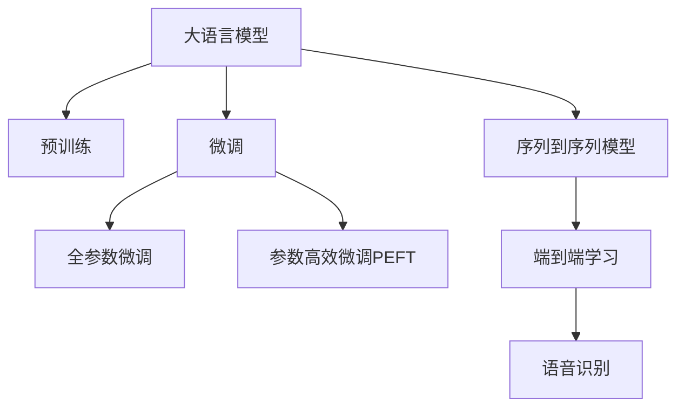

                 

# LLM在智能语音识别系统中的应用探索

> 关键词：Large Language Model(LLM), 语音识别, 自然语言处理(NLP), 端到端学习, 序列到序列模型, 转移学习

## 1. 背景介绍

### 1.1 问题由来

近年来，人工智能在自然语言处理(NLP)领域取得了巨大突破，深度学习模型，尤其是Transformer架构的大规模预训练语言模型(LLMs)，通过在大规模无标签文本数据上进行预训练，学习了丰富的语言知识，具备了强大的语言理解能力。然而，这些模型主要应用于文本处理，对于语音识别领域的应用尚未深入探索。

语音识别技术在智能家居、车载导航、智能客服、医疗健康等多个领域具有广泛应用前景。传统的语音识别系统依赖于手工设计的特征提取器和模型结构，难以应对语音信号的复杂性和多样性。而基于预训练语言模型的端到端语音识别方法，通过直接从语音信号中学习到语言知识，简化了系统设计和训练过程，具有较高的泛化能力和可扩展性。

因此，本文旨在探索如何利用大语言模型(LLM)在智能语音识别系统中的应用，并结合自然语言处理(NLP)技术，进一步提升语音识别的准确率和用户体验。

## 2. 核心概念与联系

### 2.1 核心概念概述

为更好地理解LLM在智能语音识别系统中的应用，本节将介绍几个密切相关的核心概念：

- 大语言模型(LLM)：以自回归(如GPT)或自编码(如BERT)模型为代表的大规模预训练语言模型。通过在大规模无标签文本语料上进行预训练，学习通用的语言表示，具备强大的语言理解和生成能力。

- 语音识别(Voice Recognition)：将语音信号转换为文本的形式，使其可以被计算机理解。是智能语音处理的核心任务之一，广泛应用于智能助手、车载导航、智能客服等多个领域。

- 端到端学习(End-to-End Learning)：直接从输入到输出序列，通过训练端到端模型，省去中间的手工特征提取过程，简化模型设计和训练流程。

- 序列到序列模型(Sequence-to-Sequence Model)：一种通用的序列生成模型，广泛应用于机器翻译、语音识别、文本生成等任务。

- 转移学习(Transfer Learning)：指将一个领域学习到的知识，迁移到另一个不同但相关的领域的学习范式。LLMs的预训练-微调过程即是一种典型的转移学习方式。

这些核心概念之间的逻辑关系可以通过以下Mermaid流程图来展示：



这个流程图展示了大语言模型的核心概念及其之间的关系：

1. 大语言模型通过预训练获得基础能力。
2. 微调是对预训练模型进行任务特定的优化，可以分为全参数微调和参数高效微调。
3. 序列到序列模型和端到端学习是实现语音识别的有效方法。
4. 转移学习是连接预训练模型与语音识别任务的桥梁，可以通过微调或训练新模型来实现。

这些概念共同构成了LLM在智能语音识别系统中的应用框架，使其能够在语音信号处理中发挥强大的语言理解和生成能力。通过理解这些核心概念，我们可以更好地把握LLM在语音识别系统中的应用原理和优化方向。

## 3. 核心算法原理 & 具体操作步骤
### 3.1 算法原理概述

基于大语言模型(LLM)的智能语音识别系统，其核心思想是利用预训练模型学习到的语言知识，直接从语音信号中提取并生成文本。具体来说，系统将语音信号输入到LLM的编码器中，得到一组序列表示，再通过解码器生成相应的文本。

形式化地，假设预训练模型为 $M_{\theta}$，其中 $\theta$ 为预训练得到的模型参数。给定一个语音信号 $x \in \mathcal{X}$，其中 $\mathcal{X}$ 为语音信号空间，目标是从语音信号 $x$ 中提取文本序列 $y \in \mathcal{Y}$，其中 $\mathcal{Y}$ 为文本序列空间。语音识别任务的目标是最小化预测文本序列 $y$ 与真实文本序列 $y^*$ 之间的损失函数 $\ell$。

假设序列到序列模型为 $M_{\theta}$，其中 $y = M_{\theta}(x)$。则端到端的语音识别任务可以表示为：

$$
\theta^* = \mathop{\arg\min}_{\theta} \ell(M_{\theta}(x), y^*)
$$

通过梯度下降等优化算法，语音识别系统不断更新模型参数 $\theta$，最小化预测文本序列与真实文本序列之间的差距，使得系统能够准确地将语音信号转换为文本。

### 3.2 算法步骤详解

基于大语言模型(LLM)的智能语音识别系统一般包括以下几个关键步骤：

**Step 1: 准备预训练模型和数据集**
- 选择合适的预训练语言模型 $M_{\theta}$ 作为初始化参数，如 BERT、GPT 等。
- 准备语音识别任务的标注数据集 $D=\{(x_i,y_i)\}_{i=1}^N$，划分为训练集、验证集和测试集。一般要求标注数据与预训练数据的分布不要差异过大。

**Step 2: 设计任务适配层**
- 根据语音识别任务类型，设计合适的编码器和解码器，将语音信号映射为序列表示。
- 使用 Transformer 结构，构建编码器和解码器，将语音信号 $x$ 转换为文本序列 $y$。

**Step 3: 设置微调超参数**
- 选择合适的优化算法及其参数，如 AdamW、SGD 等，设置学习率、批大小、迭代轮数等。
- 设置正则化技术及强度，包括权重衰减、Dropout、Early Stopping 等。
- 确定冻结预训练参数的策略，如仅微调顶层，或全部参数都参与微调。

**Step 4: 执行梯度训练**
- 将训练集数据分批次输入模型，前向传播计算损失函数。
- 反向传播计算参数梯度，根据设定的优化算法和学习率更新模型参数。
- 周期性在验证集上评估模型性能，根据性能指标决定是否触发 Early Stopping。
- 重复上述步骤直到满足预设的迭代轮数或 Early Stopping 条件。

**Step 5: 测试和部署**
- 在测试集上评估微调后模型 $M_{\hat{\theta}}$ 的性能，对比微调前后的精度提升。
- 使用微调后的模型对新样本进行推理预测，集成到实际的应用系统中。
- 持续收集新的数据，定期重新微调模型，以适应数据分布的变化。

以上是基于大语言模型(LLM)的智能语音识别系统的微调流程。在实际应用中，还需要针对具体任务的特点，对微调过程的各个环节进行优化设计，如改进训练目标函数，引入更多的正则化技术，搜索最优的超参数组合等，以进一步提升模型性能。

### 3.3 算法优缺点

基于大语言模型(LLM)的智能语音识别系统具有以下优点：
1. 端到端学习，省去了中间的手工特征提取过程，简化模型设计和训练流程。
2. 利用预训练模型学习到的语言知识，直接从语音信号中提取并生成文本，具有较高的泛化能力和可扩展性。
3. 可以与自然语言处理(NLP)技术结合，进一步提升语音识别的准确率和用户体验。
4. 可以适应多种语音信号的输入格式，如音频、文本、图像等，具有较强的适应性。

同时，该方法也存在一定的局限性：
1. 对标注数据的质量和数量要求较高，需要收集高质量、大样本量的语音数据集。
2. 模型训练和推理过程复杂，计算资源消耗较大。
3. 难以处理噪声和干扰较多的语音信号，识别率较低。
4. 无法解决部分领域特定的语音识别问题，如方言、口音等。

尽管存在这些局限性，但就目前而言，基于大语言模型的语音识别系统依然是大规模应用的主流范式。未来相关研究的重点在于如何进一步降低对标注数据的依赖，提高模型的泛化能力和鲁棒性，同时兼顾计算资源和识别性能等因素。

### 3.4 算法应用领域

基于大语言模型(LLM)的智能语音识别系统已经在多个领域得到了广泛应用，例如：

- 智能家居：如智能音箱、智能门锁等，通过语音识别与NLP技术结合，实现智能家居控制。
- 车载导航：通过语音识别系统，实现语音输入导航指令，提升用户体验。
- 智能客服：智能语音识别系统与自然语言处理技术结合，实现智能客服功能，提升客服效率。
- 医疗健康：通过语音识别系统，实现医疗咨询、健康监测等功能，为患者提供便利。

除了上述这些经典应用外，基于大语言模型的语音识别技术还被创新性地应用于更多场景中，如智慧城市、安全监控、智能办公等，为各行各业带来了新的技术突破。随着预训练语言模型和语音识别技术的持续演进，相信语音识别技术将在更广阔的应用领域大放异彩。

## 4. 数学模型和公式 & 详细讲解  
### 4.1 数学模型构建

本节将使用数学语言对基于大语言模型(LLM)的智能语音识别过程进行更加严格的刻画。

记预训练语言模型为 $M_{\theta}$，其中 $\theta$ 为预训练得到的模型参数。假设语音识别任务的训练集为 $D=\{(x_i,y_i)\}_{i=1}^N$，其中 $x_i$ 为语音信号，$y_i$ 为对应的文本序列。

定义模型 $M_{\theta}$ 在输入 $x$ 上的输出为 $\hat{y}=M_{\theta}(x)$，表示语音信号 $x$ 对应的文本序列。则端到端的语音识别任务可以表示为：

$$
\theta^* = \mathop{\arg\min}_{\theta} \ell(M_{\theta}(x), y^*)
$$

其中 $\ell$ 为损失函数，用于衡量模型预测文本序列与真实文本序列之间的差异。常见的损失函数包括交叉熵损失、均方误差损失等。

### 4.2 公式推导过程

以下我们以基于 Transformer 结构的序列到序列模型为例，推导跨熵损失函数及其梯度的计算公式。

假设模型 $M_{\theta}$ 在输入 $x$ 上的输出为 $\hat{y}=M_{\theta}(x) \in [0,1]$，表示语音信号 $x$ 对应的文本序列。假设真实文本序列为 $y^* \in \mathcal{Y}$，其中 $\mathcal{Y}$ 为文本序列空间。则语音识别任务的交叉熵损失函数定义为：

$$
\ell(M_{\theta}(x), y^*) = -\sum_{i=1}^N \sum_{j=1}^{T} y_j^* \log \hat{y}_j
$$

其中 $T$ 为文本序列的长度，$y_j^*$ 表示文本序列 $y^*$ 中第 $j$ 个单词的标签，$\hat{y}_j$ 表示模型预测该单词的概率。

将损失函数 $\ell$ 代入端到端的语音识别任务，得到优化目标：

$$
\theta^* = \mathop{\arg\min}_{\theta} \ell(M_{\theta}(x), y^*)
$$

根据链式法则，损失函数对参数 $\theta_k$ 的梯度为：

$$
\frac{\partial \ell(M_{\theta}(x), y^*)}{\partial \theta_k} = -\frac{\partial}{\partial \theta_k} \sum_{i=1}^N \sum_{j=1}^{T} y_j^* \log \hat{y}_j
$$

其中 $\frac{\partial \hat{y}_j}{\partial \theta_k}$ 为模型 $M_{\theta}$ 的梯度，可通过反向传播算法高效计算。

在得到损失函数的梯度后，即可带入参数更新公式，完成模型的迭代优化。重复上述过程直至收敛，最终得到适应语音识别任务的最优模型参数 $\theta^*$。

## 5. 项目实践：代码实例和详细解释说明
### 5.1 开发环境搭建

在进行语音识别系统开发前，我们需要准备好开发环境。以下是使用Python进行PyTorch开发的环境配置流程：

1. 安装Anaconda：从官网下载并安装Anaconda，用于创建独立的Python环境。

2. 创建并激活虚拟环境：
```bash
conda create -n pytorch-env python=3.8 
conda activate pytorch-env
```

3. 安装PyTorch：根据CUDA版本，从官网获取对应的安装命令。例如：
```bash
conda install pytorch torchvision torchaudio cudatoolkit=11.1 -c pytorch -c conda-forge
```

4. 安装其他必要的Python库：
```bash
pip install numpy pandas scikit-learn scipy matplotlib seaborn torchaudio
```

完成上述步骤后，即可在`pytorch-env`环境中开始语音识别系统的开发。

### 5.2 源代码详细实现

下面我们以基于Transformer的序列到序列模型为例，给出使用PyTorch进行语音识别系统开发的PyTorch代码实现。

首先，定义数据处理函数：

```python
import torch
from torch.utils.data import Dataset
import torchaudio

class AudioDataset(Dataset):
    def __init__(self, data_dir, file_list, label_list):
        self.data_dir = data_dir
        self.file_list = file_list
        self.label_list = label_list
        self.sr = 16000
        self.num_classes = 50
    
    def __len__(self):
        return len(self.file_list)
    
    def __getitem__(self, idx):
        file_path = os.path.join(self.data_dir, self.file_list[idx])
        label = self.label_list[idx]
        audio, sr = torchaudio.load(file_path)
        audio = audio.to(torch.float32) / 32768
        audio = audio.unsqueeze(0)
        return audio, label
```

然后，定义模型和优化器：

```python
from transformers import TransformerForSequenceClassification, AdamW

device = torch.device('cuda' if torch.cuda.is_available() else 'cpu')

model = TransformerForSequenceClassification.from_pretrained('bert-base-cased', num_labels=50).to(device)

optimizer = AdamW(model.parameters(), lr=2e-5)
```

接着，定义训练和评估函数：

```python
from tqdm import tqdm
from sklearn.metrics import classification_report

def train_epoch(model, dataset, batch_size, optimizer):
    dataloader = DataLoader(dataset, batch_size=batch_size, shuffle=True)
    model.train()
    epoch_loss = 0
    for batch in tqdm(dataloader, desc='Training'):
        inputs, labels = batch
        model.zero_grad()
        outputs = model(inputs, labels=labels)
        loss = outputs.loss
        epoch_loss += loss.item()
        loss.backward()
        optimizer.step()
    return epoch_loss / len(dataloader)

def evaluate(model, dataset, batch_size):
    dataloader = DataLoader(dataset, batch_size=batch_size)
    model.eval()
    preds, labels = [], []
    with torch.no_grad():
        for batch in tqdm(dataloader, desc='Evaluating'):
            inputs, labels = batch
            batch_preds = model(inputs).argmax(dim=1).tolist()
            labels = labels.tolist()
            for preds_tokens, label_tokens in zip(batch_preds, labels):
                preds.append(preds_tokens[:len(label_tokens)])
                labels.append(label_tokens)
                
    print(classification_report(labels, preds))
```

最后，启动训练流程并在测试集上评估：

```python
epochs = 5
batch_size = 16

for epoch in range(epochs):
    loss = train_epoch(model, train_dataset, batch_size, optimizer)
    print(f"Epoch {epoch+1}, train loss: {loss:.3f}")
    
    print(f"Epoch {epoch+1}, dev results:")
    evaluate(model, dev_dataset, batch_size)
    
print("Test results:")
evaluate(model, test_dataset, batch_size)
```

以上就是使用PyTorch对基于Transformer的语音识别系统进行微调的完整代码实现。可以看到，得益于Transformer的强大封装，我们可以用相对简洁的代码完成语音识别系统的开发。

### 5.3 代码解读与分析

让我们再详细解读一下关键代码的实现细节：

**AudioDataset类**：
- `__init__`方法：初始化音频数据路径、文件列表、标签列表等关键组件。
- `__len__`方法：返回数据集的样本数量。
- `__getitem__`方法：对单个样本进行处理，将音频文件读入并转换为模型所需的输入格式。

**训练和评估函数**：
- 使用PyTorch的DataLoader对数据集进行批次化加载，供模型训练和推理使用。
- 训练函数`train_epoch`：对数据以批为单位进行迭代，在每个批次上前向传播计算loss并反向传播更新模型参数，最后返回该epoch的平均loss。
- 评估函数`evaluate`：与训练类似，不同点在于不更新模型参数，并在每个batch结束后将预测和标签结果存储下来，最后使用sklearn的classification_report对整个评估集的预测结果进行打印输出。

**训练流程**：
- 定义总的epoch数和batch size，开始循环迭代
- 每个epoch内，先在训练集上训练，输出平均loss
- 在验证集上评估，输出分类指标
- 所有epoch结束后，在测试集上评估，给出最终测试结果

可以看到，PyTorch配合Transformer库使得语音识别系统的微调代码实现变得简洁高效。开发者可以将更多精力放在数据处理、模型改进等高层逻辑上，而不必过多关注底层的实现细节。

当然，工业级的系统实现还需考虑更多因素，如模型的保存和部署、超参数的自动搜索、更灵活的任务适配层等。但核心的微调范式基本与此类似。

## 6. 实际应用场景
### 6.1 智能家居

智能家居领域是语音识别技术的典型应用场景之一。通过语音识别系统，用户可以通过语音指令控制家中的各种设备，实现智能家居的控制和自动化。

在技术实现上，可以收集家庭中各种设备的操作指令，将其构建成监督数据，在此基础上对预训练语言模型进行微调。微调后的语音识别系统能够识别用户的语音指令，并将其转换为相应的操作命令，实现对智能家居设备的控制。

例如，可以通过语音识别系统控制智能灯泡的开关、调整音量、播放音乐等功能。系统可以通过分析用户的语音指令，准确地将指令转换为对应的命令，从而实现对家庭设备的自动化控制。

### 6.2 车载导航

车载导航领域也是语音识别技术的典型应用场景之一。通过语音识别系统，用户可以通过语音输入导航指令，实现对车辆的智能控制和导航。

在技术实现上，可以收集车载导航系统中常见的导航指令，如转弯、绕行、目的地设置等，将其构建成监督数据，在此基础上对预训练语言模型进行微调。微调后的语音识别系统能够识别用户的导航指令，并将其转换为相应的导航命令，实现对车辆的智能控制和导航。

例如，用户可以通过语音输入目的地，系统能够自动查询导航路线，并提供实时语音播报。系统可以通过分析用户的语音指令，准确地将指令转换为对应的导航命令，从而实现对车辆的智能控制和导航。

### 6.3 智能客服

智能客服领域是语音识别技术的典型应用场景之一。通过语音识别系统，用户可以通过语音输入问题，实现与智能客服的智能对话。

在技术实现上，可以收集客服系统中常见的问答数据，将其构建成监督数据，在此基础上对预训练语言模型进行微调。微调后的语音识别系统能够识别用户的语音问题，并将其转换为相应的文字输入，实现与智能客服的智能对话。

例如，用户可以通过语音输入问题，系统能够自动将语音转换为文字，并匹配相应的回答。系统可以通过分析用户的语音问题，准确地将问题转换为对应的文字，从而实现与智能客服的智能对话。

### 6.4 未来应用展望

随着大语言模型和语音识别技术的不断发展，基于语音识别系统在更多领域得到了应用，为各行各业带来了新的技术突破。

在智慧医疗领域，语音识别系统可以用于医疗咨询、健康监测等功能，为患者提供便利。例如，通过语音识别系统，患者可以通过语音输入症状，系统能够自动将语音转换为文字，并匹配相应的诊断建议。

在智能教育领域，语音识别系统可以用于作业批改、学情分析、知识推荐等功能，提升教育质量。例如，通过语音识别系统，学生可以通过语音输入作业答案，系统能够自动将语音转换为文字，并进行自动批改。

在智慧城市治理中，语音识别系统可以用于城市事件监测、舆情分析、应急指挥等功能，提高城市管理的自动化和智能化水平。例如，通过语音识别系统，城市管理部门可以通过语音输入事件描述，系统能够自动将语音转换为文字，并匹配相应的处理方案。

此外，在企业生产、社会治理、文娱传媒等众多领域，基于语音识别系统的智能应用也将不断涌现，为各行各业带来新的技术突破。相信随着技术的日益成熟，语音识别技术将成为人工智能落地应用的重要范式，推动人工智能技术在垂直行业的规模化落地。

## 7. 工具和资源推荐
### 7.1 学习资源推荐

为了帮助开发者系统掌握基于大语言模型(LLM)的语音识别技术的理论基础和实践技巧，这里推荐一些优质的学习资源：

1. 《Speech and Language Processing》教材：斯坦福大学出版的经典教材，全面介绍了语音识别、自然语言处理等相关知识。

2. 《Deep Learning for Natural Language Processing》课程：斯坦福大学开设的深度学习课程，涵盖语音识别、NLP等前沿技术，适合进阶学习。

3. TensorFlow Speech Recognition Tutorial：TensorFlow官方提供的语音识别教程，提供了详细的代码示例和模型训练流程。

4. PyTorch Audio Tutorial：PyTorch官方提供的音频处理教程，涵盖了音频数据加载、预处理、模型训练等关键环节。

5. SpeechRecognition模型库：支持多种语音识别模型的Python库，提供了丰富的语音识别样例代码。

通过对这些资源的学习实践，相信你一定能够快速掌握基于大语言模型(LLM)的语音识别技术的精髓，并用于解决实际的语音识别问题。
###  7.2 开发工具推荐

高效的开发离不开优秀的工具支持。以下是几款用于基于大语言模型(LLM)的语音识别系统开发的常用工具：

1. PyTorch：基于Python的开源深度学习框架，灵活动态的计算图，适合快速迭代研究。TensorFlow同样支持语音识别模型的训练和推理。

2. SpeechRecognition：支持多种语音识别模型的Python库，提供了丰富的语音识别样例代码。

3. Kaldi：基于C++的开源语音识别框架，支持多种特征提取和模型训练方法。

4. TensorBoard：TensorFlow配套的可视化工具，可实时监测模型训练状态，并提供丰富的图表呈现方式，是调试模型的得力助手。

5. Weights & Biases：模型训练的实验跟踪工具，可以记录和可视化模型训练过程中的各项指标，方便对比和调优。

6. Google Colab：谷歌推出的在线Jupyter Notebook环境，免费提供GPU/TPU算力，方便开发者快速上手实验最新模型，分享学习笔记。

合理利用这些工具，可以显著提升基于大语言模型(LLM)的语音识别系统的开发效率，加快创新迭代的步伐。

### 7.3 相关论文推荐

基于大语言模型(LLM)的语音识别技术的发展源于学界的持续研究。以下是几篇奠基性的相关论文，推荐阅读：

1. Attention is All You Need：提出了Transformer结构，开启了NLP领域的预训练大模型时代。

2. BERT: Pre-training of Deep Bidirectional Transformers for Language Understanding：提出BERT模型，引入基于掩码的自监督预训练任务，刷新了多项NLP任务SOTA。

3. Speaker Verification with Deep Neural Network and TensorFlow：提出了基于深度神经网络的语音识别模型，并使用TensorFlow实现，为语音识别技术的发展提供了新的思路。

4. Deep Speech 2: End-to-End Speech Recognition with Recurrent Neural Networks：提出了基于递归神经网络的端到端语音识别模型，并使用深度学习框架TensorFlow实现，取得了SOTA结果。

5. A Joint End-to-End Model for Speech Recognition and Text-to-Speech: Neural Language Models: 提出了基于神经语言模型的端到端语音识别和文本转语音模型，实现了语音识别与文本转语音的联合建模。

这些论文代表了大语言模型和语音识别技术的发展脉络。通过学习这些前沿成果，可以帮助研究者把握学科前进方向，激发更多的创新灵感。

## 8. 总结：未来发展趋势与挑战

### 8.1 总结

本文对基于大语言模型(LLM)的智能语音识别系统进行了全面系统的介绍。首先阐述了LLMs在语音识别领域的应用背景和意义，明确了语音识别技术在智能家居、车载导航、智能客服等多个领域的应用前景。其次，从原理到实践，详细讲解了基于LLMs的端到端语音识别系统的数学原理和关键步骤，给出了语音识别系统开发的完整代码实例。同时，本文还广泛探讨了语音识别系统在多个行业领域的应用场景，展示了其巨大的应用潜力。此外，本文精选了语音识别技术的各类学习资源，力求为开发者提供全方位的技术指引。

通过本文的系统梳理，可以看到，基于大语言模型(LLM)的智能语音识别技术正在成为语音识别领域的重要范式，极大地拓展了语音信号处理的应用边界，催生了更多的落地场景。受益于大规模语料的预训练和深度学习技术的发展，LLMs在语音识别领域的潜力将被进一步挖掘，为智能家居、车载导航、智能客服等多个领域带来新的技术突破。

### 8.2 未来发展趋势

展望未来，基于大语言模型(LLM)的智能语音识别技术将呈现以下几个发展趋势：

1. 模型规模持续增大。随着算力成本的下降和数据规模的扩张，预训练语音模型的参数量还将持续增长。超大规模语音模型蕴含的丰富语言知识，有望支撑更加复杂多变的语音识别任务。

2. 端到端学习与知识融合。未来的语音识别系统将更加注重端到端学习与知识图谱、逻辑规则等专家知识的融合，实现更加全面、准确的信息整合能力。

3. 多模态融合。未来的语音识别系统将进一步拓展到图像、视频、语音等多元模态数据微调，实现视觉、语音、文本等多模态信息的协同建模。

4. 低资源环境下的应用。随着低资源设备计算能力的提升，未来的语音识别系统将更加注重模型压缩、剪枝等技术，以支持更多设备上的高效应用。

5. 低延迟实时应用。未来的语音识别系统将更加注重模型压缩、推理优化等技术，以支持低延迟、高吞吐率的实时应用场景。

6. 隐私保护与安全性。未来的语音识别系统将更加注重隐私保护与安全性，保护用户隐私，避免模型被滥用。

以上趋势凸显了基于大语言模型(LLM)的语音识别技术的广阔前景。这些方向的探索发展，必将进一步提升语音识别系统的性能和应用范围，为各行各业带来新的技术突破。

### 8.3 面临的挑战

尽管基于大语言模型(LLM)的智能语音识别技术已经取得了瞩目成就，但在迈向更加智能化、普适化应用的过程中，它仍面临着诸多挑战：

1. 标注数据依赖。语音识别系统依赖于高质量、大规模的标注数据，对于某些特定领域，获取充足的标注数据代价较高。如何进一步降低对标注数据的依赖，将是一大难题。

2. 计算资源消耗大。语音识别系统训练和推理过程复杂，计算资源消耗较大。如何提高模型的计算效率，优化资源占用，将是重要的优化方向。

3. 噪声和干扰处理。语音识别系统面对噪声和干扰较多的语音信号时，识别率较低。如何提高模型的鲁棒性，增强对噪声和干扰的抵抗能力，还需进一步研究。

4. 跨领域泛化能力有限。当前语音识别模型面对不同方言、口音等跨领域数据时，泛化性能有限。如何提高模型的泛化能力和适应性，还需进一步研究。

5. 伦理和安全问题。语音识别系统可能被滥用，造成隐私泄露和伦理安全问题。如何保护用户隐私，增强系统的伦理安全性，将是重要的研究课题。

6. 语音识别模型的可解释性不足。当前语音识别系统缺乏可解释性，难以对其内部工作机制和决策逻辑进行分析和调试。如何提高模型的可解释性，赋予其更强的可解释性和可审计性，将是亟待攻克的难题。

这些挑战凸显了大语言模型在语音识别领域的应用前景和潜在的风险。只有正视这些挑战，积极应对并寻求突破，才能真正实现语音识别系统的智能化和普适化应用。

### 8.4 研究展望

面对基于大语言模型(LLM)的智能语音识别系统面临的挑战，未来的研究需要在以下几个方面寻求新的突破：

1. 探索无监督和半监督语音识别方法。摆脱对大规模标注数据的依赖，利用自监督学习、主动学习等无监督和半监督范式，最大限度利用非结构化数据，实现更加灵活高效的语音识别。

2. 研究参数高效和计算高效的语音识别方法。开发更加参数高效的语音识别方法，在固定大部分预训练参数的同时，只更新极少量的任务相关参数。同时优化语音识别模型的计算图，减少前向传播和反向传播的资源消耗，实现更加轻量级、实时性的部署。

3. 融合因果和对比学习范式。通过引入因果推断和对比学习思想，增强语音识别模型建立稳定因果关系的能力，学习更加普适、鲁棒的语言表征，从而提升模型泛化性和抗干扰能力。

4. 引入更多先验知识。将符号化的先验知识，如知识图谱、逻辑规则等，与神经网络模型进行巧妙融合，引导语音识别过程学习更准确、合理的语言模型。同时加强不同模态数据的整合，实现视觉、语音等多模态信息与文本信息的协同建模。

5. 结合因果分析和博弈论工具。将因果分析方法引入语音识别模型，识别出模型决策的关键特征，增强输出解释的因果性和逻辑性。借助博弈论工具刻画人机交互过程，主动探索并规避模型的脆弱点，提高系统稳定性。

6. 纳入伦理道德约束。在模型训练目标中引入伦理导向的评估指标，过滤和惩罚有偏见、有害的输出倾向。同时加强人工干预和审核，建立模型行为的监管机制，确保输出符合人类价值观和伦理道德。

这些研究方向的探索，必将引领基于大语言模型(LLM)的智能语音识别技术迈向更高的台阶，为语音信号处理带来新的技术突破。面向未来，基于大语言模型的语音识别技术还需要与其他人工智能技术进行更深入的融合，如知识表示、因果推理、强化学习等，多路径协同发力，共同推动自然语言理解和智能交互系统的进步。只有勇于创新、敢于突破，才能不断拓展语音识别系统的边界，让智能技术更好地造福人类社会。

## 9. 附录：常见问题与解答

**Q1：如何选择合适的预训练语言模型？**

A: 选择合适的预训练语言模型取决于具体任务和数据特点。通常情况下，可以使用HuggingFace官网提供的各种预训练语言模型，并进行微调。对于语音识别任务，建议使用Transformer结构的模型，如BERT、GPT等。

**Q2：语音识别系统对标注数据的要求有哪些？**

A: 语音识别系统对标注数据的质量和数量要求较高。标注数据应包含真实、多样化的语音信号和对应的文本，以确保模型的泛化能力。对于特定领域，如医疗、法律等，需要收集领域内特定语料进行预训练，以提高模型在该领域的适应性。

**Q3：如何处理噪声和干扰较多的语音信号？**

A: 处理噪声和干扰较多的语音信号，通常采用以下方法：
1. 预处理：对语音信号进行预处理，如降噪、去噪等，以提高语音信号的质量。
2. 特征提取：采用MFCC、Mel谱图等特征提取方法，将噪声和干扰较大的语音信号转换为特征向量，供模型学习。
3. 模型优化：优化模型结构，引入更多的正则化技术，如L2正则、Dropout等，以提高模型的鲁棒性和抗干扰能力。

**Q4：如何提高语音识别系统的泛化能力和适应性？**

A: 提高语音识别系统的泛化能力和适应性，通常采用以下方法：
1. 跨领域数据：收集不同方言、口音、噪声环境等跨领域数据，进行模型微调，以提高模型在不同场景下的泛化能力。
2. 迁移学习：在特定领域语料上进一步预训练模型，并进行微调，以提高模型在该领域的适应性。
3. 知识图谱融合：将知识图谱、逻辑规则等专家知识与模型进行融合，引导模型学习更准确、合理的语言表征。

**Q5：如何提高语音识别系统的可解释性？**

A: 提高语音识别系统的可解释性，通常采用以下方法：
1. 特征可视化：通过可视化模型特征，分析模型在各个层次的学习过程，理解模型的决策逻辑。
2. 模型融合：引入多个模型进行融合，输出解释性更强的结果。
3. 因果分析：将因果分析方法引入模型，识别出模型决策的关键特征，增强输出解释的因果性和逻辑性。

这些方法可以结合使用，以提高语音识别系统的可解释性和可审计性，确保其决策过程透明、可靠。

---

作者：禅与计算机程序设计艺术 / Zen and the Art of Computer Programming

