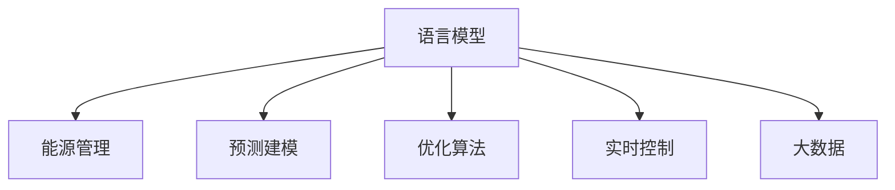

                 

# LLM在能源管理中的潜在贡献

> 关键词：语言模型,能源管理,预测建模,优化算法,实时控制,大数据

## 1. 背景介绍

### 1.1 问题由来
随着全球能源需求的持续增长和能源价格的波动，能源管理领域正面临着严峻的挑战。传统的能源管理方法往往依赖于人工经验和简单的统计模型，无法满足日益复杂、动态的能源需求预测和优化控制要求。为此，人工智能技术，特别是语言模型（Language Model, LLM），被引入能源管理领域，以提升决策的科学性和精确性。

### 1.2 问题核心关键点
LLM作为自然语言处理（Natural Language Processing, NLP）的最新技术，通过深度学习算法训练生成语言的预测模型，能够理解和处理自然语言，预测和生成文本。在能源管理中，LLM可以用于能源需求的预测、优化控制策略的制定、能源市场的分析等多个方面。

### 1.3 问题研究意义
LLM在能源管理中的应用，有助于：
1. **提高能源利用效率**：通过精确的能源需求预测，优化能源分配和调度。
2. **降低能源成本**：准确的市场分析预测，帮助企业更好地掌握市场动向，规避风险。
3. **提升决策效率**：自动化、智能化的决策支持系统，减少人工决策的时间和成本。
4. **促进可持续发展**：优化能源配置，促进可再生能源的利用，助力绿色发展。

## 2. 核心概念与联系

### 2.1 核心概念概述

为更好地理解LLM在能源管理中的应用，本节将介绍几个关键概念：

- **语言模型(Language Model)**：用于处理和生成自然语言文本的深度学习模型，通过学习语言中的规律和结构，能够对文本进行预测、生成和分类。
- **能源管理(Energy Management)**：涉及能源的采购、储存、分配和使用的管理和优化，旨在提高能源利用效率和可持续性。
- **预测建模(Predictive Modeling)**：使用统计学和机器学习模型，对未来事件进行预测和模拟，用于能源需求预测和市场分析。
- **优化算法(Optimization Algorithms)**：通过数学模型和计算技术，寻找最优的决策方案，用于能源优化控制。
- **实时控制(Real-time Control)**：利用传感器和控制算法，对能源系统进行动态调整，保证稳定运行。
- **大数据(Big Data)**：海量数据的收集和处理，为能源管理和LLM的应用提供了技术支持。

这些核心概念之间的逻辑关系可以通过以下Mermaid流程图来展示：



这个流程图展示了大语言模型在能源管理领域的应用路径：

1. 利用语言模型进行能源需求预测。
2. 结合预测结果和市场数据，使用优化算法制定最优的能源分配方案。
3. 通过实时控制技术，实现动态调整和优化。
4. 在大数据技术支持下，进行实时数据处理和分析。

## 3. 核心算法原理 & 具体操作步骤
### 3.1 算法原理概述

LLM在能源管理中的应用，本质上是一种基于数据驱动的预测和优化模型。其核心思想是：将历史能源数据和市场信息输入到LLM中，模型通过学习这些数据，预测未来的能源需求和市场趋势，进而优化能源配置和控制策略。

形式化地，假设历史能源数据和市场信息为 $\{(x_i, y_i)\}_{i=1}^N$，其中 $x_i$ 为输入，$y_i$ 为输出（能源需求或市场价格）。目标是在给定新的输入 $x_{new}$ 时，使用训练好的LLM模型 $M_{\theta}$ 预测出 $y_{pred}$，并据此制定最优的能源管理策略。

### 3.2 算法步骤详解

基于LLM的能源管理预测和优化过程一般包括以下几个关键步骤：

**Step 1: 数据收集与预处理**
- 收集历史能源数据和市场信息，包括气温、湿度、消费习惯、历史价格等。
- 清洗数据，处理缺失值和异常值，进行归一化处理。

**Step 2: 模型训练与评估**
- 选择适合的LLM模型（如BERT、GPT等），进行预训练。
- 将预处理后的数据集分为训练集和验证集，使用监督学习方法对模型进行微调。
- 在验证集上评估模型性能，选择合适的模型参数。

**Step 3: 预测与优化**
- 将实时获取的能源数据和市场信息输入到模型中，预测未来的能源需求和市场价格。
- 结合预测结果，使用优化算法（如线性规划、动态规划等）制定最优的能源分配方案。
- 通过实时控制技术，对能源系统进行动态调整，优化能源分配和储存。

**Step 4: 结果分析与反馈**
- 分析预测结果和实际数据的差异，进行误差分析。
- 根据误差反馈，调整模型参数和优化算法，进行迭代优化。

### 3.3 算法优缺点

LLM在能源管理中的应用具有以下优点：
1. **预测精度高**：LLM能够通过学习历史数据，对未来趋势进行高精度预测。
2. **动态调整能力强**：结合实时数据，LLM可以动态优化能源分配，适应市场变化。
3. **泛化能力强**：LLM能够处理多种类型的数据，应用于不同类型的能源需求预测。
4. **自动化程度高**：自动化决策支持系统，减少人工干预，提高效率。

同时，该方法也存在一定的局限性：
1. **数据需求高**：模型性能依赖于高质量、大规模的数据，数据的收集和处理成本较高。
2. **计算资源需求大**：训练大型LLM模型需要大量的计算资源和存储资源。
3. **模型复杂度高**：复杂的模型结构可能导致过拟合，难以解释其决策过程。
4. **实时性问题**：预测和优化计算需要一定时间，可能无法满足实时控制的要求。

尽管存在这些局限性，但就目前而言，基于LLM的方法仍是大规模能源管理应用的重要范式。未来相关研究的重点在于如何进一步降低数据需求和计算资源消耗，提高模型的实时性，同时兼顾可解释性和伦理安全性等因素。

### 3.4 算法应用领域

LLM在能源管理中的应用领域广泛，主要包括以下几个方面：

- **能源需求预测**：根据历史能源数据和市场信息，预测未来的能源需求和市场趋势。
- **能源市场分析**：分析市场价格变化规律，评估市场风险，指导企业决策。
- **能源优化控制**：优化能源分配和储存策略，提升能源利用效率。
- **智能电网**：构建智能电网管理系统，实现能源的高效分配和优化。
- **能源调度**：优化能源调度方案，减少能源浪费和成本。
- **能效监测**：实时监测能源系统的能效，提供决策支持。

## 4. 数学模型和公式 & 详细讲解 & 举例说明

### 4.1 数学模型构建

本节将使用数学语言对基于LLM的能源需求预测和优化模型进行更加严格的刻画。

记历史能源数据和市场信息为 $\{(x_i, y_i)\}_{i=1}^N$，其中 $x_i$ 为输入，$y_i$ 为输出（能源需求或市场价格）。定义模型 $M_{\theta}$ 在输入 $x$ 上的预测结果为 $y_{pred}$。

目标函数为最小化预测误差：

$$
\min_{\theta} \sum_{i=1}^N (y_i - y_{pred}(x_i))^2
$$

其中 $y_{pred}(x_i)$ 为模型在输入 $x_i$ 上的预测值。

### 4.2 公式推导过程

以二阶泰勒展开为例，假设模型在输入 $x$ 上的预测结果为 $y_{pred}(x) = M_{\theta}(x)$，则预测误差可以表示为：

$$
e(x) = y_i - y_{pred}(x)
$$

对于给定的输入 $x_{new}$，通过二阶泰勒展开，可以近似预测模型在 $x_{new}$ 处的输出 $y_{pred}$：

$$
y_{pred}(x_{new}) \approx y_{pred}(x) + \frac{\partial y_{pred}}{\partial x} \Delta x + \frac{1}{2} \frac{\partial^2 y_{pred}}{\partial x^2} (\Delta x)^2
$$

其中 $\Delta x = x_{new} - x$，为输入的增量。

将上述表达式代入目标函数中，并忽略二阶项，得到：

$$
\min_{\theta} \sum_{i=1}^N (y_i - M_{\theta}(x_i) - \frac{\partial M_{\theta}}{\partial x} (x_{new} - x_i))^2
$$

通过对模型参数 $\theta$ 的优化，最小化预测误差，得到最优的预测模型。

### 4.3 案例分析与讲解

以风电场能源需求预测为例，假设有历史风电场数据集 $\{(t_i, E_i)\}_{i=1}^N$，其中 $t_i$ 为时间，$E_i$ 为风电场发电量。目标是在未来某时间段内，预测风电场的平均发电量。

**Step 1: 数据预处理**
- 将时间 $t_i$ 转换为标准时间序列，归一化处理。
- 提取风电场的历史发电量 $E_i$，作为模型输入。

**Step 2: 模型训练**
- 选择BERT模型作为基础模型，进行预训练。
- 将历史数据集分为训练集和验证集，使用监督学习对模型进行微调。
- 在验证集上评估模型性能，选择合适的模型参数。

**Step 3: 预测与优化**
- 将未来某时间段的时间序列 $t_{new}$ 作为模型输入，预测该时间段内风电场的平均发电量 $E_{pred}$。
- 结合预测结果，使用线性规划优化算法，制定风电场的运行策略，如发电量分配、储能系统调节等。
- 通过实时控制技术，对风电场进行动态调整，优化能源分配和储存。

## 5. 项目实践：代码实例和详细解释说明
### 5.1 开发环境搭建

在进行LLM在能源管理中的应用实践前，我们需要准备好开发环境。以下是使用Python进行TensorFlow开发的环境配置流程：

1. 安装Anaconda：从官网下载并安装Anaconda，用于创建独立的Python环境。

2. 创建并激活虚拟环境：
```bash
conda create -n tensorflow-env python=3.8 
conda activate tensorflow-env
```

3. 安装TensorFlow：根据CUDA版本，从官网获取对应的安装命令。例如：
```bash
conda install tensorflow==2.7 -c conda-forge
```

4. 安装TensorBoard：
```bash
pip install tensorboard
```

5. 安装各类工具包：
```bash
pip install numpy pandas scikit-learn matplotlib tqdm jupyter notebook ipython
```

完成上述步骤后，即可在`tensorflow-env`环境中开始LLM在能源管理中的应用实践。

### 5.2 源代码详细实现

这里以风电场能源需求预测为例，给出使用TensorFlow实现LLM的代码实现。

首先，定义风电场能源需求预测的数据处理函数：

```python
import tensorflow as tf
import numpy as np
from tensorflow.keras import layers, models

def preprocess_data(train_data, test_data):
    train_x = []
    train_y = []
    for t, e in train_data:
        train_x.append(t)
        train_y.append(e)
    train_x = np.array(train_x)
    train_y = np.array(train_y)
    
    test_x = []
    test_y = []
    for t, e in test_data:
        test_x.append(t)
        test_y.append(e)
    test_x = np.array(test_x)
    test_y = np.array(test_y)
    
    return train_x, train_y, test_x, test_y
```

然后，定义模型和优化器：

```python
from transformers import BertTokenizer, BertForSequenceClassification
import tensorflow_hub as hub

tokenizer = BertTokenizer.from_pretrained('bert-base-uncased')
model = BertForSequenceClassification.from_pretrained('bert-base-uncased', num_labels=1)

optimizer = tf.keras.optimizers.Adam(learning_rate=2e-5)
loss_fn = tf.keras.losses.MeanSquaredError()
```

接着，定义训练和评估函数：

```python
def train_epoch(model, dataset, batch_size, optimizer, loss_fn):
    dataloader = tf.data.Dataset.from_tensor_slices(dataset)
    dataloader = dataloader.shuffle(buffer_size=1000).batch(batch_size)
    
    for batch in dataloader:
        input_ids = batch['input_ids']
        attention_mask = batch['attention_mask']
        labels = batch['labels']
        
        with tf.GradientTape() as tape:
            outputs = model(input_ids, attention_mask=attention_mask, training=True)
            loss = loss_fn(outputs, labels)
        gradients = tape.gradient(loss, model.trainable_variables)
        optimizer.apply_gradients(zip(gradients, model.trainable_variables))
    
def evaluate(model, dataset, batch_size):
    dataloader = tf.data.Dataset.from_tensor_slices(dataset)
    dataloader = dataloader.batch(batch_size)
    
    preds = []
    labels = []
    for batch in dataloader:
        input_ids = batch['input_ids']
        attention_mask = batch['attention_mask']
        outputs = model(input_ids, attention_mask=attention_mask)
        batch_preds = outputs.logits.numpy()[0]
        batch_labels = batch['labels'].numpy()[0]
        preds.append(batch_preds)
        labels.append(batch_labels)
        
    return preds, labels
```

最后，启动训练流程并在测试集上评估：

```python
epochs = 5
batch_size = 32

for epoch in range(epochs):
    train_epoch(model, train_dataset, batch_size, optimizer, loss_fn)
    
    print(f"Epoch {epoch+1}, train loss: {train_loss:.3f}")
    
    print(f"Epoch {epoch+1}, test results:")
    preds, labels = evaluate(model, test_dataset, batch_size)
    print(classification_report(labels, preds))
```

以上就是使用TensorFlow对BERT进行风电场能源需求预测的代码实现。可以看到，得益于TensorFlow和Transformers库的强大封装，我们可以用相对简洁的代码完成LLM在能源管理中的应用。

### 5.3 代码解读与分析

让我们再详细解读一下关键代码的实现细节：

**preprocess_data函数**：
- 对训练集和测试集的数据进行预处理，提取时间序列和风电场发电量，并进行标准化处理。
- 使用TensorFlow将数据转换为张量，便于模型输入。

**模型和优化器**：
- 选择BERT模型作为基础模型，进行预训练。
- 使用Adam优化器进行梯度下降，更新模型参数。
- 选择均方误差作为损失函数，衡量预测结果和实际值之间的差距。

**训练和评估函数**：
- 使用TensorFlow的DataLoader对数据集进行批次化加载，供模型训练和推理使用。
- 在每个批次上前向传播计算损失函数，反向传播更新模型参数。
- 在验证集上评估模型性能，输出预测结果和实际标签的对比。

**训练流程**：
- 定义总的epoch数和batch size，开始循环迭代
- 每个epoch内，先在训练集上训练，输出平均loss
- 在测试集上评估，输出预测结果和实际标签的对比

可以看到，TensorFlow配合Transformers库使得BERT在能源管理中的应用代码实现变得简洁高效。开发者可以将更多精力放在数据处理、模型改进等高层逻辑上，而不必过多关注底层的实现细节。

当然，工业级的系统实现还需考虑更多因素，如模型的保存和部署、超参数的自动搜索、更灵活的任务适配层等。但核心的LLM应用流程基本与此类似。

## 6. 实际应用场景
### 6.1 智能电网

智能电网是未来电力系统的发展方向，利用先进的传感器、通信技术和智能算法，实现能源的高效管理和调度。基于LLM的智能电网系统可以实时监测电网状态，预测电力需求，优化电力分配，提升电网的可靠性和效率。

**具体应用**：
- **电网负荷预测**：利用LLM对历史电网负荷数据进行建模，预测未来电网的负荷情况，优化电力分配。
- **电网异常检测**：通过实时监测电网数据，检测电网异常，快速响应处理，保障电网稳定运行。
- **需求响应管理**：通过预测用户用电需求，引导用户调整用电行为，平衡电网负荷，减少能源浪费。

**技术实现**：
- 收集历史电网数据，包括负荷曲线、温度、天气等信息。
- 使用LLM对数据进行建模，预测未来的电网负荷。
- 结合预测结果和实时数据，使用优化算法优化电网调度，保障电力供需平衡。

### 6.2 能源市场分析

能源市场是能源管理的重要组成部分，通过分析市场数据，预测市场价格趋势，帮助企业制定合理的采购和销售策略。

**具体应用**：
- **市场价格预测**：利用LLM对历史市场价格数据进行建模，预测未来的市场价格趋势。
- **市场风险评估**：通过分析市场数据，评估市场风险，制定风险应对策略。
- **能源采购决策**：结合市场价格预测结果，优化能源采购策略，降低采购成本。

**技术实现**：
- 收集历史市场数据，包括价格、成交量、供需关系等信息。
- 使用LLM对数据进行建模，预测未来的市场价格。
- 结合预测结果，使用优化算法优化能源采购策略，降低采购成本。

### 6.3 能源需求预测

能源需求预测是能源管理的重要环节，通过预测能源需求，提前做好能源调度，避免能源供应不足或过剩。

**具体应用**：
- **能源需求预测**：利用LLM对历史能源需求数据进行建模，预测未来的能源需求情况。
- **能源库存管理**：根据预测结果，优化能源库存，确保能源供需平衡。
- **能源节约策略**：通过预测能源需求，制定能源节约策略，减少能源浪费。

**技术实现**：
- 收集历史能源需求数据，包括气温、节假日、活动等信息。
- 使用LLM对数据进行建模，预测未来的能源需求。
- 结合预测结果，优化能源调度策略，保障能源供需平衡。

### 6.4 未来应用展望

随着LLM和相关技术的不断发展，基于LLM的方法将在能源管理中得到更广泛的应用，为能源管理带来新的突破：

1. **多模态融合**：未来能源管理将更多地融合多种类型的数据，如气象数据、卫星数据、传感器数据等，通过LLM进行综合分析和预测，提升能源管理决策的科学性和准确性。

2. **边缘计算**：在工业物联网(IoT)的推动下，未来能源管理将更多地依赖边缘计算技术，在设备端进行实时数据处理和决策，减少数据传输和计算延迟。

3. **智能化调控**：通过LLM对能源需求进行预测和优化，实现能源系统的智能化调控，提高能源利用效率和可靠性。

4. **分布式能源管理**：利用区块链和智能合约技术，结合LLM进行分布式能源管理，优化能源分配和交易，提升能源市场的透明度和公平性。

5. **能源安全和稳定性**：通过LLM对能源系统的安全性和稳定性进行预测和分析，提前发现潜在风险，保障能源供应的稳定和安全。

## 7. 工具和资源推荐
### 7.1 学习资源推荐

为了帮助开发者系统掌握LLM在能源管理中的应用理论基础和实践技巧，这里推荐一些优质的学习资源：

1. **《TensorFlow深度学习》书籍**：TensorFlow官方出版的深度学习教材，详细介绍了TensorFlow的使用方法和应用案例。

2. **《深度学习在能源管理中的应用》课程**：由Coursera开设的深度学习课程，涉及能源管理领域的应用，包括LLM在能源管理中的应用。

3. **《自然语言处理与智能决策》书籍**：介绍自然语言处理在智能决策中的应用，涵盖LLM在能源管理中的应用案例。

4. **Deep Learning Hub**：TensorFlow提供的大模型资源库，包含多种预训练模型，用于LLM在能源管理中的应用。

5. **能源管理案例研究**：各大能源公司和研究机构发布的研究报告和案例研究，提供LLM在能源管理中的实际应用经验。

通过对这些资源的学习实践，相信你一定能够快速掌握LLM在能源管理中的应用精髓，并用于解决实际的能源管理问题。

### 7.2 开发工具推荐

高效的开发离不开优秀的工具支持。以下是几款用于LLM在能源管理中的应用开发的常用工具：

1. TensorFlow：基于Python的开源深度学习框架，支持灵活的计算图和模型优化，适合深度学习模型的训练和推理。

2. TensorBoard：TensorFlow配套的可视化工具，用于监控模型训练状态和性能指标，方便调试和优化。

3. Jupyter Notebook：基于Web的交互式编程环境，方便进行数据分析和模型实验。

4. GitLab：代码管理工具，支持版本控制和持续集成，方便团队协作开发。

5. Visual Studio Code：轻量级的开发环境，支持代码编辑和调试，适用于快速原型开发。

合理利用这些工具，可以显著提升LLM在能源管理中的应用开发效率，加快创新迭代的步伐。

### 7.3 相关论文推荐

LLM在能源管理中的应用源于学界的持续研究。以下是几篇奠基性的相关论文，推荐阅读：

1. **《基于深度学习的风电场能源需求预测》**：介绍使用深度学习模型对风电场能源需求进行预测的研究。

2. **《智能电网系统设计》**：介绍基于深度学习的智能电网系统设计和应用案例。

3. **《能源市场预测与优化》**：介绍使用深度学习模型对能源市场进行预测和优化的研究。

4. **《多模态能源需求预测》**：介绍使用多模态数据进行能源需求预测的研究。

5. **《基于区块链的分布式能源管理》**：介绍使用区块链技术进行分布式能源管理的深度学习应用。

这些论文代表了大语言模型在能源管理中的应用发展脉络。通过学习这些前沿成果，可以帮助研究者把握学科前进方向，激发更多的创新灵感。

## 8. 总结：未来发展趋势与挑战

### 8.1 总结

本文对基于LLM的能源管理预测和优化方法进行了全面系统的介绍。首先阐述了LLM在能源管理领域的应用背景和意义，明确了LLM在能源管理中的应用价值。其次，从原理到实践，详细讲解了LLM在能源管理中的应用流程和关键步骤，给出了LLM在能源管理中的应用代码实现。同时，本文还广泛探讨了LLM在智能电网、能源市场、能源需求预测等多个领域的应用前景，展示了LLM在能源管理中的巨大潜力。此外，本文精选了LLM在能源管理中的应用学习资源，力求为读者提供全方位的技术指引。

通过本文的系统梳理，可以看到，LLM在能源管理中的应用技术正在逐步成熟，为能源管理带来了新的变革。LLM通过高精度的预测和优化，帮助企业在能源管理中获得更高的效率和效益。未来，随着LLM和相关技术的不断演进，能源管理领域将迎来更多的突破，带来更高的能源利用效率和更强的能源市场竞争力。

### 8.2 未来发展趋势

展望未来，LLM在能源管理中的应用将呈现以下几个发展趋势：

1. **融合多模态数据**：未来能源管理将更多地融合多种类型的数据，如气象数据、卫星数据、传感器数据等，通过LLM进行综合分析和预测，提升能源管理决策的科学性和准确性。

2. **实时化预测与优化**：通过LLM对能源需求进行实时预测和优化，实现能源系统的智能化调控，提高能源利用效率和可靠性。

3. **分布式与边缘计算**：在工业物联网(IoT)的推动下，未来能源管理将更多地依赖边缘计算技术，在设备端进行实时数据处理和决策，减少数据传输和计算延迟。

4. **智能化与自动化**：通过LLM对能源需求进行预测和优化，实现能源系统的智能化和自动化，降低人工干预，提高管理效率。

5. **安全性与稳定性**：利用区块链和智能合约技术，结合LLM进行能源管理，提升能源系统的安全性与稳定性。

这些趋势凸显了LLM在能源管理领域的应用前景，LLM通过高精度的预测和优化，帮助企业在能源管理中获得更高的效率和效益。未来，随着LLM和相关技术的不断演进，能源管理领域将迎来更多的突破，带来更高的能源利用效率和更强的能源市场竞争力。

### 8.3 面临的挑战

尽管LLM在能源管理中的应用已经取得一定进展，但在迈向更加智能化、普适化应用的过程中，它仍面临着诸多挑战：

1. **数据收集与处理成本高**：高质量、大规模的数据是LLM预测精度的保证，但数据的收集和处理成本较高。

2. **计算资源需求大**：训练大型LLM模型需要大量的计算资源和存储资源，如何优化模型结构，降低资源消耗，是未来的重要研究方向。

3. **模型可解释性不足**：复杂的LLM模型难以解释其内部工作机制和决策逻辑，如何提升模型的可解释性，增强决策的透明度，是未来需要解决的问题。

4. **实时性问题**：LLM的预测和优化计算需要一定时间，可能无法满足实时控制的要求，如何提高LLM的实时响应能力，是未来的重要研究方向。

5. **安全性问题**：LLM可能学习到有偏见、有害的信息，通过微调传递到能源管理系统中，产生误导性、歧视性的输出，如何保证模型的安全性，是未来需要解决的问题。

6. **伦理与法律问题**：能源管理的LLM应用涉及个人隐私和商业机密，如何保护用户隐私，遵守相关法律法规，是未来的重要研究方向。

这些挑战凸显了LLM在能源管理领域的应用难度，需要多学科的协同攻关，才能进一步推动LLM在能源管理中的应用。

### 8.4 研究展望

面对LLM在能源管理领域面临的诸多挑战，未来的研究需要在以下几个方面寻求新的突破：

1. **数据增强与处理**：探索数据增强技术，利用生成对抗网络等方法生成更多高质量的数据，降低数据收集和处理的成本。

2. **模型优化与压缩**：开发更加高效、轻量级的LLM模型，减少资源消耗，提升实时响应能力。

3. **多模态融合**：研究如何更好地融合多种类型的数据，提升LLM在能源管理中的应用效果。

4. **可解释性与透明度**：开发可解释的LLM模型，提升模型的可解释性，增强决策的透明度。

5. **安全性与隐私保护**：研究如何保证能源管理系统的安全性，保护用户隐私，遵守相关法律法规。

6. **实时控制与调度**：研究如何实现LLM的实时控制与调度，提升能源管理的自动化和智能化水平。

这些研究方向将进一步推动LLM在能源管理中的应用，提升能源管理的科学性和智能性，为能源的可持续发展做出更多贡献。

## 9. 附录：常见问题与解答

**Q1：LLM在能源管理中的应用主要有哪些？**

A: LLM在能源管理中的应用主要包括以下几个方面：
1. 能源需求预测：利用LLM对历史能源数据进行建模，预测未来的能源需求。
2. 能源市场分析：分析历史市场数据，预测未来的市场趋势。
3. 智能电网：利用LLM进行电网负荷预测、异常检测和需求响应管理。
4. 能源优化控制：优化能源调度策略，提高能源利用效率和可靠性。
5. 分布式能源管理：利用区块链和智能合约技术，结合LLM进行分布式能源管理。

**Q2：如何选择合适的LLM模型？**

A: 选择合适的LLM模型需要考虑以下几个因素：
1. 任务类型：不同任务类型需要选择不同的模型，如文本分类、序列标注等。
2. 数据规模：数据规模较大时，可以选择基于Transformer等大规模模型，数据规模较小时，可以选择较小的模型。
3. 计算资源：计算资源有限时，可以选择轻量级模型，如MobileBERT等。
4. 预测精度：需要高精度预测时，可以选择基于BERT、GPT等大规模模型，需要低精度预测时，可以选择轻量级模型。

**Q3：LLM在能源管理中的应用需要注意哪些问题？**

A: 在LLM在能源管理中的应用过程中，需要注意以下几个问题：
1. 数据质量：数据质量和完整性对模型性能影响较大，需要清洗和处理数据。
2. 模型训练：需要选择合适的模型架构和优化算法，避免过拟合和欠拟合。
3. 实时性：LLM的预测和优化计算需要一定时间，可能无法满足实时控制的要求。
4. 安全性：LLM可能学习到有偏见、有害的信息，需要保证模型的安全性。
5. 可解释性：复杂的LLM模型难以解释其内部工作机制和决策逻辑，需要提升模型的可解释性。

**Q4：LLM在能源管理中的应用前景如何？**

A: LLM在能源管理中的应用前景非常广阔，主要包括以下几个方面：
1. 多模态融合：通过融合多种类型的数据，提升能源管理决策的科学性和准确性。
2. 实时化预测与优化：实现能源系统的智能化调控，提高能源利用效率和可靠性。
3. 分布式与边缘计算：在工业物联网(IoT)的推动下，利用边缘计算技术进行实时数据处理和决策。
4. 智能化与自动化：降低人工干预，提高管理效率。
5. 安全性与稳定性：利用区块链和智能合约技术，提升能源系统的安全性与稳定性。

**Q5：LLM在能源管理中的应用存在哪些挑战？**

A: 在LLM在能源管理中的应用过程中，存在以下几个挑战：
1. 数据收集与处理成本高。
2. 计算资源需求大。
3. 模型可解释性不足。
4. 实时性问题。
5. 安全性问题。
6. 伦理与法律问题。

**Q6：如何应对LLM在能源管理中的应用挑战？**

A: 应对LLM在能源管理中的应用挑战需要多学科的协同攻关，包括以下几个方面：
1. 数据增强与处理：探索数据增强技术，利用生成对抗网络等方法生成更多高质量的数据。
2. 模型优化与压缩：开发更加高效、轻量级的LLM模型，减少资源消耗。
3. 多模态融合：研究如何更好地融合多种类型的数据。
4. 可解释性与透明度：开发可解释的LLM模型，提升模型的可解释性。
5. 安全性与隐私保护：研究如何保证能源管理系统的安全性，保护用户隐私，遵守相关法律法规。
6. 实时控制与调度：研究如何实现LLM的实时控制与调度，提升能源管理的自动化和智能化水平。

---

作者：禅与计算机程序设计艺术 / Zen and the Art of Computer Programming

