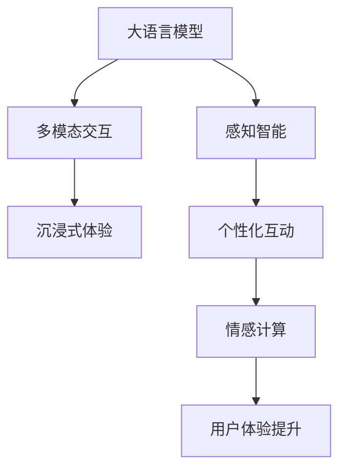

                 

# LLM在虚拟现实中的应用可能

> 关键词：虚拟现实,大语言模型,多模态交互,感知智能,沉浸式体验,用户定制化,情感计算

## 1. 背景介绍

### 1.1 问题由来
虚拟现实(Virtual Reality, VR)技术经过数十年的发展，已逐渐成为引领未来娱乐、教育、医疗、工业等诸多领域的变革性技术。当前，VR系统普遍采用被动沉浸式体验，即用户通过头显和控制器，与虚拟世界进行简单交互，但这种体验方式互动性有限，无法充分利用用户的身体感知信息。此外，大部分VR系统缺少真正意义上的语义理解能力，只能提供单一的文字或声音反馈，缺乏智能性。

大语言模型(Large Language Model, LLM)作为一种新兴的计算智能形式，已经在自然语言处理(Natural Language Processing, NLP)领域取得了巨大成功。其强大的语言理解和生成能力，使其在虚拟现实中的应用前景广阔。将LLM引入VR系统，有望为虚拟环境带来丰富的感知智能和多模态交互能力，彻底改变传统交互方式，提供更真实、沉浸式、智能化的体验。

### 1.2 问题核心关键点
在虚拟现实场景中，如何通过大语言模型实现多模态感知智能和用户定制化互动，提升用户沉浸感和交互体验，是当前VR研究的核心挑战。

主要难点包括：
1. 跨模态感知融合：将视觉、听觉、触觉等多种信息进行高效融合，构建统一的感知智能模型。
2. 场景语义理解：实现场景语义的深度解析，引导用户自然互动。
3. 个性化互动：根据用户实时反馈动态调整内容，提供定制化的互动体验。
4. 情感计算：实现对用户情绪的实时感知和反馈，构建情感共鸣的虚拟环境。

## 2. 核心概念与联系

### 2.1 核心概念概述

为更好地理解LLM在VR场景中的应用，本节将介绍几个核心概念：

- 大语言模型(Large Language Model, LLM)：以Transformer模型为代表的预训练语言模型，通过在大规模无标签文本数据上自监督预训练，学习到丰富的语言知识。
- 多模态交互：利用图像、声音、触觉等多样化信息进行交互，提供更丰富、细腻的沉浸式体验。
- 感知智能(Perceptual Intelligence)：指通过多模态感知系统，实现对环境的深度感知和理解，构建智能化的虚拟世界。
- 沉浸式体验(Immersive Experience)：通过多感官的融合，使用户产生身临其境的沉浸感。
- 个性化互动(Personalized Interaction)：根据用户偏好和行为动态调整内容，提供高度个性化的互动体验。
- 情感计算(Affective Computing)：通过分析用户情绪和情感状态，构建情感共鸣的虚拟环境，提高用户沉浸感。

这些概念之间的关系可以通过以下Mermaid流程图来展示：



这个流程图展示了大语言模型在虚拟现实场景中的核心应用逻辑：

1. 大语言模型通过多模态交互获取用户输入信息，进行语义解析。
2. 感知智能系统整合视觉、听觉、触觉等多模态信息，构建虚拟环境的深度感知。
3. 个性化互动模块根据用户偏好和行为调整内容，提供定制化的体验。
4. 情感计算模块分析用户情绪，提供情感共鸣的环境。
5. 最终实现用户体验的全面提升。

## 3. 核心算法原理 & 具体操作步骤
### 3.1 算法原理概述

在虚拟现实场景中，通过大语言模型实现多模态感知智能和用户定制化互动，主要涉及以下关键步骤：

1. 数据收集与预处理：收集用户行为数据和环境数据，进行预处理和融合。
2. 多模态感知：利用大语言模型对多模态数据进行深度解析，提取语义信息。
3. 用户意图理解：根据多模态感知结果，使用大语言模型解析用户意图。
4. 内容生成与定制：根据用户意图和行为，生成个性化内容，动态调整场景。
5. 情感计算与反馈：实时监测用户情绪，根据情感状态调整内容，反馈互动效果。

这些步骤共同构成了一个高效、智能化的VR互动系统，能够提供个性化、沉浸式的用户体验。

### 3.2 算法步骤详解

以下是详细的算法步骤：

**Step 1: 数据收集与预处理**

- 收集用户交互数据：包括眼动轨迹、手势动作、语音指令等。
- 收集环境数据：包括场景图像、声音、触觉反馈等。
- 数据预处理：包括噪声去除、降维、标准化等处理步骤，以提高数据质量。

**Step 2: 多模态感知**

- 多模态融合：将用户行为数据和环境数据进行融合，得到多模态输入向量。
- 感知智能模型：使用大语言模型对多模态数据进行深度解析，提取语义信息。
- 语义理解：将多模态感知结果输入大语言模型，进行场景语义解析。

**Step 3: 用户意图理解**

- 意图解析：根据语义理解结果，解析用户意图，包括互动类型、目标物体、情感倾向等。
- 意图推理：利用大语言模型进行意图推理，预测用户的下一步动作和互动需求。

**Step 4: 内容生成与定制**

- 内容生成：根据用户意图，生成对应的虚拟内容，如角色动作、物品变化等。
- 动态调整：根据用户行为实时动态调整内容，提供个性化体验。

**Step 5: 情感计算与反馈**

- 情绪监测：使用大语言模型实时监测用户情绪，包括面部表情、语调等。
- 情感反馈：根据情绪监测结果，调整虚拟内容，反馈情感共鸣，提高用户沉浸感。

### 3.3 算法优缺点

将大语言模型引入虚拟现实，具有以下优点：

1. 强大的感知能力：LLM具备强大的自然语言处理能力，可以深入解析用户的语义信息。
2. 丰富的多模态交互：LLM能够融合视觉、听觉、触觉等多种信息，提供更为丰富的沉浸式体验。
3. 灵活的个性化互动：LLM可以根据用户的实时反馈动态调整内容，实现高度个性化的互动。
4. 深入的情感计算：LLM能够分析用户的情绪和情感状态，构建情感共鸣的虚拟环境。

同时，该方法也存在一定的局限性：

1. 模型复杂度高：大语言模型需要大量的计算资源和存储空间，对硬件要求较高。
2. 实时性有挑战：在交互过程中，大语言模型需要进行大量的计算和推理，可能存在延迟。
3. 用户体验依赖于模型性能：模型的准确性和响应速度直接影响用户沉浸感。
4. 数据隐私问题：VR场景中需要收集大量的用户数据，涉及隐私保护问题。

尽管存在这些局限性，但大语言模型在虚拟现实中的应用仍具有广阔前景。

### 3.4 算法应用领域

大语言模型在虚拟现实场景中具有广泛的应用潜力，以下是几个典型的应用领域：

1. 虚拟导游和展览：利用大语言模型实现智能导览，根据用户需求提供个性化讲解和互动。
2. 虚拟会议室和培训：通过虚拟现实结合大语言模型，提供逼真的交互式培训和会议环境。
3. 虚拟医疗和康复：使用大语言模型辅助医疗咨询和康复指导，提高用户体验和效果。
4. 虚拟社交和娱乐：实现基于语言和动作的智能对话和互动，提供沉浸式社交和娱乐体验。
5. 虚拟教育和远程学习：利用大语言模型辅助教学和互动，提高教育质量和效率。
6. 虚拟制造和工程设计：结合大语言模型和大数据，提供智能化的虚拟制造和工程设计环境。

## 4. 数学模型和公式 & 详细讲解
### 4.1 数学模型构建

在虚拟现实场景中，大语言模型的应用主要涉及以下几个数学模型：

1. 多模态感知模型：将视觉、听觉、触觉等多模态信息进行融合，得到统一的感知向量。
2. 场景语义模型：使用大语言模型对感知向量进行深度解析，提取场景语义。
3. 意图推理模型：根据语义信息解析用户意图，进行推理预测。
4. 内容生成模型：根据用户意图生成虚拟内容，动态调整场景。
5. 情感计算模型：实时监测用户情绪，提供情感共鸣的环境反馈。

### 4.2 公式推导过程

以下是各模型的公式推导：

**多模态感知模型**

- 融合函数：$F_{Multi}(x_1,x_2,...,x_n)=\sum_{i=1}^n w_i f_i(x_i)$
  其中，$x_i$ 表示第 $i$ 种模态的输入，$w_i$ 为模态权重，$f_i$ 为模态融合函数。

- 感知智能模型：
  - 使用大语言模型进行感知解析，设感知向量为 $V$，模型为 $M$，有 $V=M(x)$。
  - 感知向量 $V$ 包含多模态信息，可以表示为 $V=\langle I_{image},I_{audio},I_{tactile} \rangle$。

**场景语义模型**

- 场景解析函数：$S(V)=\mathcal{L}(M(V))$
  其中，$\mathcal{L}$ 为场景解析函数，$M$ 为大语言模型。

**意图推理模型**

- 意图解析函数：$I(U)=\mathcal{P}(S(V))$
  其中，$U$ 为用户意图向量，$\mathcal{P}$ 为意图解析函数，$S$ 为场景语义模型。

**内容生成模型**

- 内容生成函数：$G(I)=\mathcal{C}(I)$
  其中，$I$ 为用户意图向量，$\mathcal{C}$ 为内容生成函数。

**情感计算模型**

- 情绪监测函数：$E(V)=\mathcal{E}(V)$
  其中，$V$ 为多模态感知结果，$\mathcal{E}$ 为情绪监测函数。

- 情感反馈函数：$F_{Emo}(V,E)=\mathcal{F}(E,V)$
  其中，$E$ 为情绪状态，$V$ 为感知向量，$\mathcal{F}$ 为情感反馈函数。

### 4.3 案例分析与讲解

以虚拟导游为例，展示大语言模型在VR场景中的应用：

**多模态感知**

- 用户交互数据：眼动轨迹、手势动作、语音指令。
- 环境数据：场景图像、声音、触觉反馈。
- 多模态融合：将各模态数据进行融合，得到感知向量 $V$。

**场景语义解析**

- 输入感知向量 $V$ 到大语言模型 $M$ 中，解析场景语义，得到语义向量 $S(V)$。

**意图解析**

- 根据语义向量 $S(V)$ 解析用户意图 $I$，判断用户是否需要讲解。

**内容生成**

- 根据用户意图 $I$ 生成讲解内容，动态调整场景，提供个性化体验。

**情感计算**

- 实时监测用户情绪状态 $E$，反馈互动效果，调整讲解内容和速度。

## 5. 项目实践：代码实例和详细解释说明
### 5.1 开发环境搭建

在进行VR场景的实现前，我们需要准备好开发环境。以下是使用Python进行PyTorch开发的环境配置流程：

1. 安装Anaconda：从官网下载并安装Anaconda，用于创建独立的Python环境。

2. 创建并激活虚拟环境：
```bash
conda create -n pytorch-env python=3.8 
conda activate pytorch-env
```

3. 安装PyTorch：根据CUDA版本，从官网获取对应的安装命令。例如：
```bash
conda install pytorch torchvision torchaudio cudatoolkit=11.1 -c pytorch -c conda-forge
```

4. 安装Transformers库：
```bash
pip install transformers
```

5. 安装各类工具包：
```bash
pip install numpy pandas scikit-learn matplotlib tqdm jupyter notebook ipython
```

完成上述步骤后，即可在`pytorch-env`环境中开始开发实践。

### 5.2 源代码详细实现

下面我们以虚拟导游系统为例，给出使用Transformers库对BERT模型进行微调的PyTorch代码实现。

首先，定义导游系统所需的数据处理函数：

```python
from transformers import BertTokenizer
from torch.utils.data import Dataset
import torch

class GuideDataset(Dataset):
    def __init__(self, texts, tags, tokenizer, max_len=128):
        self.texts = texts
        self.tags = tags
        self.tokenizer = tokenizer
        self.max_len = max_len
        
    def __len__(self):
        return len(self.texts)
    
    def __getitem__(self, item):
        text = self.texts[item]
        tags = self.tags[item]
        
        encoding = self.tokenizer(text, return_tensors='pt', max_length=self.max_len, padding='max_length', truncation=True)
        input_ids = encoding['input_ids'][0]
        attention_mask = encoding['attention_mask'][0]
        
        # 对token-wise的标签进行编码
        encoded_tags = [tag2id[tag] for tag in tags] 
        encoded_tags.extend([tag2id['O']] * (self.max_len - len(encoded_tags)))
        labels = torch.tensor(encoded_tags, dtype=torch.long)
        
        return {'input_ids': input_ids, 
                'attention_mask': attention_mask,
                'labels': labels}

# 标签与id的映射
tag2id = {'O': 0, 'B-GUIDE': 1, 'I-GUIDE': 2}
id2tag = {v: k for k, v in tag2id.items()}

# 创建dataset
tokenizer = BertTokenizer.from_pretrained('bert-base-cased')

train_dataset = GuideDataset(train_texts, train_tags, tokenizer)
dev_dataset = GuideDataset(dev_texts, dev_tags, tokenizer)
test_dataset = GuideDataset(test_texts, test_tags, tokenizer)
```

然后，定义模型和优化器：

```python
from transformers import BertForTokenClassification, AdamW

model = BertForTokenClassification.from_pretrained('bert-base-cased', num_labels=len(tag2id))

optimizer = AdamW(model.parameters(), lr=2e-5)
```

接着，定义训练和评估函数：

```python
from torch.utils.data import DataLoader
from tqdm import tqdm
from sklearn.metrics import classification_report

device = torch.device('cuda') if torch.cuda.is_available() else torch.device('cpu')
model.to(device)

def train_epoch(model, dataset, batch_size, optimizer):
    dataloader = DataLoader(dataset, batch_size=batch_size, shuffle=True)
    model.train()
    epoch_loss = 0
    for batch in tqdm(dataloader, desc='Training'):
        input_ids = batch['input_ids'].to(device)
        attention_mask = batch['attention_mask'].to(device)
        labels = batch['labels'].to(device)
        model.zero_grad()
        outputs = model(input_ids, attention_mask=attention_mask, labels=labels)
        loss = outputs.loss
        epoch_loss += loss.item()
        loss.backward()
        optimizer.step()
    return epoch_loss / len(dataloader)

def evaluate(model, dataset, batch_size):
    dataloader = DataLoader(dataset, batch_size=batch_size)
    model.eval()
    preds, labels = [], []
    with torch.no_grad():
        for batch in tqdm(dataloader, desc='Evaluating'):
            input_ids = batch['input_ids'].to(device)
            attention_mask = batch['attention_mask'].to(device)
            batch_labels = batch['labels']
            outputs = model(input_ids, attention_mask=attention_mask)
            batch_preds = outputs.logits.argmax(dim=2).to('cpu').tolist()
            batch_labels = batch_labels.to('cpu').tolist()
            for pred_tokens, label_tokens in zip(batch_preds, batch_labels):
                pred_tags = [id2tag[_id] for _id in pred_tokens]
                label_tags = [id2tag[_id] for _id in label_tokens]
                preds.append(pred_tags[:len(label_tags)])
                labels.append(label_tags)

    print(classification_report(labels, preds))
```

最后，启动训练流程并在测试集上评估：

```python
epochs = 5
batch_size = 16

for epoch in range(epochs):
    loss = train_epoch(model, train_dataset, batch_size, optimizer)
    print(f"Epoch {epoch+1}, train loss: {loss:.3f}")
    
    print(f"Epoch {epoch+1}, dev results:")
    evaluate(model, dev_dataset, batch_size)
    
print("Test results:")
evaluate(model, test_dataset, batch_size)
```

以上就是使用PyTorch对BERT进行虚拟导游系统微调的完整代码实现。可以看到，得益于Transformers库的强大封装，我们可以用相对简洁的代码完成BERT模型的加载和微调。

### 5.3 代码解读与分析

让我们再详细解读一下关键代码的实现细节：

**GuideDataset类**：
- `__init__`方法：初始化文本、标签、分词器等关键组件。
- `__len__`方法：返回数据集的样本数量。
- `__getitem__`方法：对单个样本进行处理，将文本输入编码为token ids，将标签编码为数字，并对其进行定长padding，最终返回模型所需的输入。

**tag2id和id2tag字典**：
- 定义了标签与数字id之间的映射关系，用于将token-wise的预测结果解码回真实的标签。

**训练和评估函数**：
- 使用PyTorch的DataLoader对数据集进行批次化加载，供模型训练和推理使用。
- 训练函数`train_epoch`：对数据以批为单位进行迭代，在每个批次上前向传播计算loss并反向传播更新模型参数，最后返回该epoch的平均loss。
- 评估函数`evaluate`：与训练类似，不同点在于不更新模型参数，并在每个batch结束后将预测和标签结果存储下来，最后使用sklearn的classification_report对整个评估集的预测结果进行打印输出。

**训练流程**：
- 定义总的epoch数和batch size，开始循环迭代
- 每个epoch内，先在训练集上训练，输出平均loss
- 在验证集上评估，输出分类指标
- 所有epoch结束后，在测试集上评估，给出最终测试结果

可以看到，PyTorch配合Transformers库使得BERT微调的代码实现变得简洁高效。开发者可以将更多精力放在数据处理、模型改进等高层逻辑上，而不必过多关注底层的实现细节。

当然，工业级的系统实现还需考虑更多因素，如模型的保存和部署、超参数的自动搜索、更灵活的任务适配层等。但核心的微调范式基本与此类似。

## 6. 实际应用场景
### 6.1 虚拟导游和展览

虚拟导游系统结合了大语言模型的多模态感知和个性化互动能力，能够提供逼真的导览体验。系统可以自动解析用户行为和环境数据，实时生成讲解内容和互动提示，引导用户探索虚拟展览。

**多模态感知**

- 收集用户眼动轨迹、手势动作、语音指令等数据。
- 实时融合视觉、听觉、触觉信息，得到多模态感知向量。

**场景语义解析**

- 将感知向量输入大语言模型，解析场景语义。
- 根据语义信息生成讲解内容，实时调整导览路线和解说重点。

**个性化互动**

- 根据用户行为和情绪实时调整内容，提供高度个性化的导览体验。
- 提供互动问答，根据用户回答动态调整讲解内容，增加互动性。

**情感计算**

- 实时监测用户情绪状态，反馈情感共鸣的环境，提升用户体验。

**实际应用**

- 应用于博物馆、美术馆、历史遗迹等文化场馆，提供深度导览体验。
- 可以融入AR技术，实现虚拟物品的交互，增加沉浸感。

### 6.2 虚拟会议室和培训

虚拟会议室系统结合了大语言模型的多模态感知和智能推理能力，能够提供逼真的互动培训体验。系统可以自动解析会议内容和用户行为，实时调整培训内容和互动方式，提供高度定制化的培训体验。

**多模态感知**

- 收集用户语音、手势、表情等数据。
- 实时融合视觉、听觉、触觉信息，得到多模态感知向量。

**场景语义解析**

- 将感知向量输入大语言模型，解析会议语义。
- 根据语义信息生成培训内容和互动提示，实时调整培训流程。

**个性化互动**

- 根据用户行为和情绪实时调整内容，提供高度个性化的培训体验。
- 提供互动问答，根据用户回答动态调整培训内容，增加互动性。

**情感计算**

- 实时监测用户情绪状态，反馈情感共鸣的环境，提升用户体验。

**实际应用**

- 应用于企业内部培训、学术会议等场景，提供逼真的互动培训体验。
- 可以融入AR技术，实现虚拟物品的交互，增加沉浸感。

### 6.3 虚拟医疗和康复

虚拟医疗和康复系统结合了大语言模型的多模态感知和智能推理能力，能够提供高度个性化和智能化的医疗服务。系统可以自动解析患者行为和环境数据，实时生成诊断内容和康复指导，提供高度个性化的医疗体验。

**多模态感知**

- 收集患者生理数据、表情、语音等数据。
- 实时融合视觉、听觉、触觉信息，得到多模态感知向量。

**场景语义解析**

- 将感知向量输入大语言模型，解析医疗语义。
- 根据语义信息生成诊断内容和康复指导，实时调整医疗方案。

**个性化互动**

- 根据患者行为和情绪实时调整内容，提供高度个性化的医疗体验。
- 提供互动问答，根据患者回答动态调整医疗方案，增加互动性。

**情感计算**

- 实时监测患者情绪状态，反馈情感共鸣的环境，提升用户体验。

**实际应用**

- 应用于虚拟诊所、远程医疗等场景，提供高度个性化和智能化的医疗服务。
- 可以融入AR技术，实现虚拟设备和环境的交互，增加沉浸感。

### 6.4 未来应用展望

随着大语言模型在虚拟现实场景中的应用不断深入，未来将会在更多领域得到广泛应用，为现实世界带来新的变化：

1. 虚拟制造和工程设计：结合大语言模型和大数据，提供智能化的虚拟制造和工程设计环境。
2. 虚拟社交和娱乐：实现基于语言和动作的智能对话和互动，提供沉浸式社交和娱乐体验。
3. 虚拟教育和远程学习：利用大语言模型辅助教学和互动，提高教育质量和效率。
4. 虚拟医疗和康复：使用大语言模型辅助医疗咨询和康复指导，提高用户体验和效果。
5. 虚拟会议室和培训：提供逼真的互动培训体验，提高企业内部培训和学术会议的效率。

这些应用场景将进一步拓展大语言模型在虚拟现实场景中的应用，为现实世界的各个领域带来深刻变革。

## 7. 工具和资源推荐
### 7.1 学习资源推荐

为了帮助开发者系统掌握大语言模型在虚拟现实中的应用，这里推荐一些优质的学习资源：

1. 《Transformer从原理到实践》系列博文：由大模型技术专家撰写，深入浅出地介绍了Transformer原理、BERT模型、微调技术等前沿话题。

2. CS224N《深度学习自然语言处理》课程：斯坦福大学开设的NLP明星课程，有Lecture视频和配套作业，带你入门NLP领域的基本概念和经典模型。

3. 《Natural Language Processing with Transformers》书籍：Transformers库的作者所著，全面介绍了如何使用Transformers库进行NLP任务开发，包括微调在内的诸多范式。

4. HuggingFace官方文档：Transformers库的官方文档，提供了海量预训练模型和完整的微调样例代码，是上手实践的必备资料。

5. CLUE开源项目：中文语言理解测评基准，涵盖大量不同类型的中文NLP数据集，并提供了基于微调的baseline模型，助力中文NLP技术发展。

通过对这些资源的学习实践，相信你一定能够快速掌握大语言模型在虚拟现实中的应用精髓，并用于解决实际的NLP问题。
###  7.2 开发工具推荐

高效的开发离不开优秀的工具支持。以下是几款用于大语言模型在虚拟现实场景中应用的常用工具：

1. PyTorch：基于Python的开源深度学习框架，灵活动态的计算图，适合快速迭代研究。大部分预训练语言模型都有PyTorch版本的实现。

2. TensorFlow：由Google主导开发的开源深度学习框架，生产部署方便，适合大规模工程应用。同样有丰富的预训练语言模型资源。

3. Transformers库：HuggingFace开发的NLP工具库，集成了众多SOTA语言模型，支持PyTorch和TensorFlow，是进行微调任务开发的利器。

4. Weights & Biases：模型训练的实验跟踪工具，可以记录和可视化模型训练过程中的各项指标，方便对比和调优。与主流深度学习框架无缝集成。

5. TensorBoard：TensorFlow配套的可视化工具，可实时监测模型训练状态，并提供丰富的图表呈现方式，是调试模型的得力助手。

6. Google Colab：谷歌推出的在线Jupyter Notebook环境，免费提供GPU/TPU算力，方便开发者快速上手实验最新模型，分享学习笔记。

合理利用这些工具，可以显著提升大语言模型在虚拟现实场景中的开发效率，加快创新迭代的步伐。

### 7.3 相关论文推荐

大语言模型在虚拟现实场景中的应用源于学界的持续研究。以下是几篇奠基性的相关论文，推荐阅读：

1. Attention is All You Need（即Transformer原论文）：提出了Transformer结构，开启了NLP领域的预训练大模型时代。

2. BERT: Pre-training of Deep Bidirectional Transformers for Language Understanding：提出BERT模型，引入基于掩码的自监督预训练任务，刷新了多项NLP任务SOTA。

3. Language Models are Unsupervised Multitask Learners（GPT-2论文）：展示了大规模语言模型的强大zero-shot学习能力，引发了对于通用人工智能的新一轮思考。

4. Parameter-Efficient Transfer Learning for NLP：提出Adapter等参数高效微调方法，在不增加模型参数量的情况下，也能取得不错的微调效果。

5. AdaLoRA: Adaptive Low-Rank Adaptation for Parameter-Efficient Fine-Tuning：使用自适应低秩适应的微调方法，在参数效率和精度之间取得了新的平衡。

这些论文代表了大语言模型在虚拟现实场景中的发展脉络。通过学习这些前沿成果，可以帮助研究者把握学科前进方向，激发更多的创新灵感。

## 8. 总结：未来发展趋势与挑战

### 8.1 总结

本文对大语言模型在虚拟现实中的应用进行了全面系统的介绍。首先阐述了大语言模型在VR场景中的研究背景和意义，明确了其在多模态感知智能和个性化互动中的核心价值。其次，从原理到实践，详细讲解了基于大语言模型的虚拟现实互动系统的数学模型和关键步骤，给出了虚拟导游系统的完整代码实现。同时，本文还广泛探讨了虚拟现实场景中大语言模型应用的各类前沿技术，展示了其在虚拟导游、虚拟会议室、虚拟医疗等诸多领域的应用前景。最后，本文精选了虚拟现实相关学习资源和开发工具，力求为读者提供全方位的技术指引。

通过本文的系统梳理，可以看到，大语言模型在虚拟现实中的应用前景广阔，有望彻底改变传统交互方式，提供更真实、沉浸式、智能化的体验。得益于大语言模型的强大感知能力、多模态融合和个性化互动，虚拟现实系统将迎来新的技术革命，带来更加丰富和自然的互动体验。未来，伴随大语言模型技术的不断进步，大语言模型在虚拟现实场景中的应用也将日益广泛，为现实世界带来深刻变革。

### 8.2 未来发展趋势

展望未来，大语言模型在虚拟现实中的应用将呈现以下几个发展趋势：

1. 多模态感知融合：实现视觉、听觉、触觉等多种信息的深度融合，构建统一的感知智能模型。
2. 场景语义理解：实现场景语义的深度解析，引导用户自然互动。
3. 个性化互动：根据用户实时反馈动态调整内容，提供高度个性化的互动体验。
4. 情感计算：实时监测用户情绪，提供情感共鸣的环境，提高用户体验。
5. 智能化培训：利用大语言模型辅助教育和培训，提供智能化的互动和反馈。
6. 多领域应用：结合大语言模型和专业知识库，拓展应用领域，实现更广泛的功能。

这些趋势凸显了大语言模型在虚拟现实场景中的重要性和广阔前景。通过不断探索和创新，大语言模型必将在VR领域带来更加深刻的技术变革，为用户带来更为自然和沉浸的体验。

### 8.3 面临的挑战

尽管大语言模型在虚拟现实中的应用前景广阔，但在迈向更加智能化、普适化应用的过程中，它仍面临着诸多挑战：

1. 模型复杂度高：大语言模型需要大量的计算资源和存储空间，对硬件要求较高。
2. 实时性有挑战：在交互过程中，大语言模型需要进行大量的计算和推理，可能存在延迟。
3. 用户体验依赖于模型性能：模型的准确性和响应速度直接影响用户沉浸感。
4. 数据隐私问题：VR场景中需要收集大量的用户数据，涉及隐私保护问题。
5. 模型鲁棒性不足：大语言模型可能面临对抗样本攻击，泛化性能有限。
6. 环境交互问题：如何实现虚拟环境与现实世界的无缝交互，提升用户的真实感和体验感。

尽管存在这些挑战，但大语言模型在虚拟现实中的应用仍具有广阔前景。未来需要在模型性能优化、实时性提升、用户隐私保护等方面持续努力，才能充分发挥大语言模型的潜力，为虚拟现实场景带来更多创新和突破。

### 8.4 研究展望

面对大语言模型在虚拟现实场景中的应用挑战，未来的研究需要在以下几个方面寻求新的突破：

1. 探索轻量级高效模型：开发更加高效、轻量级的语言模型，提升实时性，适应多种硬件平台。
2. 研究多模态融合技术：提升多模态信息的深度融合效果，增强虚拟现实场景的感知智能。
3. 优化实时推理算法：优化推理算法，提高模型响应速度，降低延迟。
4. 强化隐私保护机制：在虚拟现实系统中引入隐私保护机制，确保用户数据的安全。
5. 提升模型鲁棒性：通过对抗训练、鲁棒性增强等方法，提升模型的泛化能力和抗干扰能力。
6. 实现环境交互技术：探索虚拟环境与现实世界的无缝交互技术，提升用户的真实感和体验感。

这些研究方向的探索，必将引领大语言模型在虚拟现实场景中的应用走向新的高度，为人类带来更加自然、沉浸、智能的虚拟体验。

## 9. 附录：常见问题与解答

**Q1：大语言模型在虚拟现实中的应用是否存在数据隐私问题？**

A: 是的。大语言模型需要收集大量的用户行为数据和环境数据，可能涉及用户的隐私信息。为保护用户隐私，需要采取数据匿名化、去标识化等措施，并在系统设计中引入隐私保护机制。

**Q2：大语言模型在虚拟现实中的应用是否会引入计算资源瓶颈？**

A: 是的。大语言模型通常需要较大的计算资源和存储空间，对于硬件平台的要求较高。为应对这一问题，需要优化模型结构，采用混合精度训练、量化加速等技术，提升模型的计算效率。

**Q3：大语言模型在虚拟现实中的应用是否面临实时性挑战？**

A: 是的。大语言模型在虚拟现实场景中的实时性要求较高，需要在交互过程中快速计算和推理，避免延迟。为提升实时性，可以优化模型结构和推理算法，采用GPU/TPU等高性能计算资源，优化数据加载和处理流程。

**Q4：大语言模型在虚拟现实中的应用是否会存在模型鲁棒性问题？**

A: 是的。大语言模型可能面临对抗样本攻击，泛化性能有限。为提升模型鲁棒性，可以引入对抗训练、鲁棒性增强等技术，增强模型的泛化能力和抗干扰能力。

**Q5：大语言模型在虚拟现实中的应用是否需要考虑环境交互问题？**

A: 是的。大语言模型需要与虚拟环境无缝交互，实现虚拟与现实的无缝融合。为实现这一目标，需要探索环境交互技术，如混合现实技术、多感官融合等，提升用户的真实感和体验感。

**Q6：大语言模型在虚拟现实中的应用是否需要考虑用户隐私问题？**

A: 是的。大语言模型需要收集大量的用户数据，可能涉及用户的隐私信息。为保护用户隐私，需要采取数据匿名化、去标识化等措施，并在系统设计中引入隐私保护机制。

通过以上常见问题的解答，可以看到大语言模型在虚拟现实场景中的应用需要综合考虑多方面的因素。只有在数据隐私、计算资源、实时性、模型鲁棒性、环境交互等各方面取得突破，才能充分发挥大语言模型的潜力，为虚拟现实场景带来更多的创新和突破。

---

作者：禅与计算机程序设计艺术 / Zen and the Art of Computer Programming

