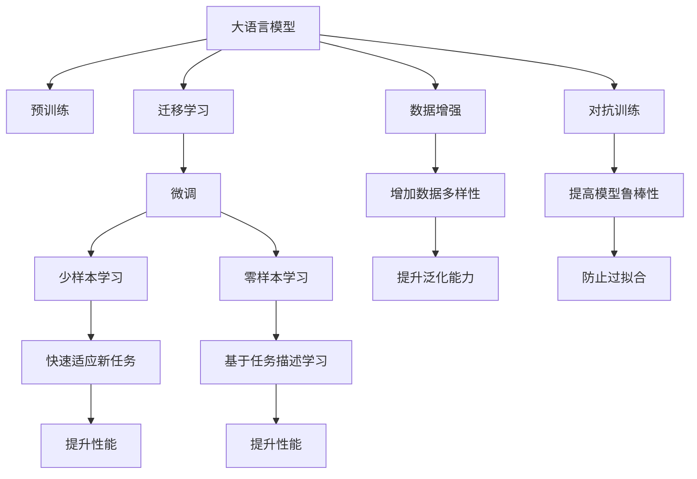

                 

## 1. 背景介绍

**1.1 问题由来**

在当今数字化时代，基于深度学习的人工智能（AI）技术正广泛应用于各行各业，极大地推动了产业创新和效率提升。然而，在AI系统的实际应用中，冷启动问题（Cold-start Problem）始终是一个困扰技术专家和从业者的难题。所谓冷启动，指的是AI系统在面对新数据、新用户或新场景时，由于缺乏足够的历史数据或缺乏对新数据特征的充分理解，导致系统性能下降，无法快速适应新环境的问题。

**1.2 问题核心关键点**

冷启动问题的核心在于如何有效利用有限的训练数据，高效地在新数据或新场景中进行适应和优化。对于基于深度学习模型的AI系统，冷启动问题通常表现为模型初始化问题、模型泛化能力不足和模型优化困难。要解决这个问题，通常需要采取一系列优化措施，如模型迁移、数据增强、模型微调等。

**1.3 问题研究意义**

冷启动问题解决的好坏直接关系到AI系统的实际应用效果。解决好冷启动问题，不仅可以提升系统的适应性和泛化能力，还可以大大降低系统的开发和维护成本，增强系统的稳定性和可靠性。因此，研究冷启动问题的解决方法，对于提升AI技术在实际应用中的落地能力和用户接受度，具有重要意义。

## 2. 核心概念与联系

**2.1 核心概念概述**

为更好地理解冷启动问题的解决方法，本节将介绍几个密切相关的核心概念：

- **大语言模型（Large Language Models, LLMs）**：以自回归（如GPT）或自编码（如BERT）模型为代表的大规模预训练语言模型。通过在大规模无标签文本语料上进行预训练，学习到丰富的语言知识和常识，具备强大的语言理解和生成能力。

- **预训练（Pre-training）**：指在大规模无标签文本语料上，通过自监督学习任务训练通用语言模型的过程。常见的预训练任务包括言语建模、掩码语言模型等。预训练使得模型学习到语言的通用表示。

- **迁移学习（Transfer Learning）**：指将一个领域学习到的知识，迁移应用到另一个不同但相关的领域的学习范式。大模型的预训练-微调过程即是一种典型的迁移学习方式。

- **冷启动（Cold-start）**：指AI系统在新数据、新用户或新场景下，由于缺乏足够的历史数据或对新数据特征的充分理解，导致系统性能下降，无法快速适应新环境的问题。

- **模型微调（Fine-tuning）**：指在预训练模型的基础上，使用下游任务的少量标注数据，通过有监督学习优化模型在特定任务上的性能。通常只需要调整顶层分类器或解码器，并以较小的学习率更新全部或部分的模型参数。

- **数据增强（Data Augmentation）**：指通过对训练样本进行一些扰动或变换，增加数据多样性，提升模型泛化能力。

- **对抗训练（Adversarial Training）**：指在训练过程中加入对抗样本，提高模型鲁棒性，防止过拟合。

- **少样本学习（Few-shot Learning）**：指在只有少量标注样本的情况下，模型能够快速适应新任务的学习方法。

- **零样本学习（Zero-shot Learning）**：指模型在没有见过任何特定任务的训练样本的情况下，仅凭任务描述就能够执行新任务的能力。

- **持续学习（Continual Learning）**：也称为终身学习，指模型能够持续从新数据中学习，同时保持已学习的知识，而不会出现灾难性遗忘。

这些核心概念之间的逻辑关系可以通过以下Mermaid流程图来展示：



这个流程图展示了大语言模型的核心概念及其之间的关系：

1. 大语言模型通过预训练获得基础能力。
2. 迁移学习是连接预训练模型与下游任务的桥梁，可以通过微调或数据增强来实现。
3. 冷启动问题可以通过微调、数据增强等方法解决。
4. 对抗训练可以提升模型的鲁棒性，减少过拟合。
5. 少样本学习和零样本学习可以进一步降低数据需求。
6. 持续学习使得模型能够不断学习新知识，避免遗忘旧知识。

## 3. 核心算法原理 & 具体操作步骤

### 3.1 算法原理概述

基于深度学习的大语言模型在面对冷启动问题时，其基本原理是通过迁移学习和微调技术，利用已有的大规模预训练模型，结合新数据或新场景的特征，进行快速的适应和优化。具体来说，可以分为以下几个步骤：

**Step 1: 准备预训练模型和数据集**
- 选择合适的预训练语言模型 $M_{\theta}$ 作为初始化参数，如 BERT、GPT 等。
- 准备下游任务 $T$ 的少量标注数据集 $D=\{(x_i, y_i)\}_{i=1}^N$，其中 $x_i$ 是输入数据，$y_i$ 是标签。

**Step 2: 添加任务适配层**
- 根据任务类型，在预训练模型顶层设计合适的输出层和损失函数。
- 对于分类任务，通常在顶层添加线性分类器和交叉熵损失函数。
- 对于生成任务，通常使用语言模型的解码器输出概率分布，并以负对数似然为损失函数。

**Step 3: 设置微调超参数**
- 选择合适的优化算法及其参数，如 AdamW、SGD 等，设置学习率、批大小、迭代轮数等。
- 设置正则化技术及强度，包括权重衰减、Dropout、Early Stopping 等。
- 确定冻结预训练参数的策略，如仅微调顶层，或全部参数都参与微调。

**Step 4: 执行梯度训练**
- 将训练集数据分批次输入模型，前向传播计算损失函数。
- 反向传播计算参数梯度，根据设定的优化算法和学习率更新模型参数。
- 周期性在验证集上评估模型性能，根据性能指标决定是否触发 Early Stopping。
- 重复上述步骤直到满足预设的迭代轮数或 Early Stopping 条件。

**Step 5: 测试和部署**
- 在测试集上评估微调后模型 $M_{\hat{\theta}}$ 的性能，对比微调前后的精度提升。
- 使用微调后的模型对新样本进行推理预测，集成到实际的应用系统中。

### 3.2 算法步骤详解

以下是冷启动问题处理的详细步骤：

**Step 1: 准备预训练模型和数据集**

在选择预训练模型和数据集时，需要注意以下几点：

- 预训练模型应与下游任务相关，以确保模型在特定任务上的性能提升。
- 数据集应尽可能覆盖任务的常见情况，避免过拟合。
- 数据集应包含新数据的特征，以指导模型在新的数据场景中快速适应。

**Step 2: 添加任务适配层**

任务适配层的添加需要根据具体的任务类型而定，例如：

- 对于分类任务，如情感分析，通常添加一个线性分类器。
- 对于生成任务，如机器翻译，通常使用语言模型的解码器。

**Step 3: 设置微调超参数**

微调超参数的设定需要根据具体任务和数据集进行调整。一般建议使用较小的学习率，以避免破坏预训练权重，同时需要考虑正则化技术的使用，以防止过拟合。

**Step 4: 执行梯度训练**

梯度训练的执行需要考虑以下几个因素：

- 批大小的设置需要考虑计算资源和数据大小。
- 学习率的设置需要根据任务复杂度和数据量进行调整。
- 迭代轮数需要根据模型收敛情况和性能指标进行调整。

**Step 5: 测试和部署**

测试和部署阶段需要评估微调后的模型性能，并确保其在实际应用中的稳定性和可靠性。

### 3.3 算法优缺点

基于深度学习的大语言模型处理冷启动问题的算法有以下优点：

- **高效**：能够快速适应新数据和新场景，大大缩短了系统的开发和部署时间。
- **泛化能力强**：利用已有的大规模预训练模型，能够提高模型在新数据上的泛化能力。
- **灵活**：通过添加任务适配层和微调策略，可以适应多种不同类型的任务。

同时，该算法也存在一些局限性：

- **依赖数据**：冷启动问题处理依赖于新数据和新场景的特征，数据的获取和标注成本较高。
- **需要计算资源**：大规模预训练模型的微调需要大量的计算资源，对硬件设施要求较高。
- **模型复杂**：预训练模型和微调模型的结构较为复杂，调试和优化难度较大。

### 3.4 算法应用领域

基于深度学习的大语言模型处理冷启动问题的方法在多个领域得到了广泛应用，例如：

- **智能推荐系统**：通过用户历史行为数据的预训练和微调，可以更快地适应新用户和新场景，提高推荐效果。
- **金融风险控制**：通过历史交易数据的预训练和微调，可以实时监控新交易的风险，提高风险控制能力。
- **医疗诊断系统**：通过历史病例数据的预训练和微调，可以更快地诊断新病例，提高诊断准确性。
- **自然语言处理（NLP）**：通过新文本数据的预训练和微调，可以更准确地理解和生成新文本，提高系统表现。

## 4. 数学模型和公式 & 详细讲解 & 举例说明

### 4.1 数学模型构建

在冷启动问题处理中，数学模型的构建通常采用以下形式：

设预训练语言模型为 $M_{\theta}$，其中 $\theta$ 为预训练得到的模型参数。假设下游任务 $T$ 的少量标注数据集为 $D=\{(x_i, y_i)\}_{i=1}^N$，其中 $x_i$ 是输入数据，$y_i$ 是标签。微调的目标是最小化经验风险：

$$
\mathcal{L}(\theta) = \frac{1}{N} \sum_{i=1}^N \ell(M_{\theta}(x_i),y_i)
$$

其中 $\ell$ 为损失函数，通常为交叉熵损失或均方误差损失。

### 4.2 公式推导过程

以二分类任务为例，推导交叉熵损失函数及其梯度的计算公式。

设模型 $M_{\theta}$ 在输入 $x$ 上的输出为 $\hat{y}=M_{\theta}(x)$，表示样本属于正类的概率。真实标签 $y \in \{0,1\}$。则二分类交叉熵损失函数定义为：

$$
\ell(M_{\theta}(x),y) = -[y\log \hat{y} + (1-y)\log (1-\hat{y})]
$$

将其代入经验风险公式，得：

$$
\mathcal{L}(\theta) = -\frac{1}{N}\sum_{i=1}^N [y_i\log M_{\theta}(x_i)+(1-y_i)\log(1-M_{\theta}(x_i))]
$$

根据链式法则，损失函数对参数 $\theta_k$ 的梯度为：

$$
\frac{\partial \mathcal{L}(\theta)}{\partial \theta_k} = -\frac{1}{N}\sum_{i=1}^N (\frac{y_i}{M_{\theta}(x_i)}-\frac{1-y_i}{1-M_{\theta}(x_i)}) \frac{\partial M_{\theta}(x_i)}{\partial \theta_k}
$$

其中 $\frac{\partial M_{\theta}(x_i)}{\partial \theta_k}$ 可进一步递归展开，利用自动微分技术完成计算。

### 4.3 案例分析与讲解

以下以情感分析任务为例，进行案例分析与讲解。

假设模型 $M_{\theta}$ 在输入 $x$ 上的输出为 $\hat{y}=M_{\theta}(x)$，表示样本属于正类的概率。真实标签 $y \in \{0,1\}$。则二分类交叉熵损失函数定义为：

$$
\ell(M_{\theta}(x),y) = -[y\log \hat{y} + (1-y)\log (1-\hat{y})]
$$

将其代入经验风险公式，得：

$$
\mathcal{L}(\theta) = -\frac{1}{N}\sum_{i=1}^N [y_i\log M_{\theta}(x_i)+(1-y_i)\log(1-M_{\theta}(x_i))]
$$

根据链式法则，损失函数对参数 $\theta_k$ 的梯度为：

$$
\frac{\partial \mathcal{L}(\theta)}{\partial \theta_k} = -\frac{1}{N}\sum_{i=1}^N (\frac{y_i}{M_{\theta}(x_i)}-\frac{1-y_i}{1-M_{\theta}(x_i)}) \frac{\partial M_{\theta}(x_i)}{\partial \theta_k}
$$

在得到损失函数的梯度后，即可带入参数更新公式，完成模型的迭代优化。重复上述过程直至收敛，最终得到适应下游任务的最优模型参数 $\theta^*$。

## 5. 项目实践：代码实例和详细解释说明

### 5.1 开发环境搭建

在进行冷启动问题处理的实践前，我们需要准备好开发环境。以下是使用Python进行PyTorch开发的环境配置流程：

1. 安装Anaconda：从官网下载并安装Anaconda，用于创建独立的Python环境。

2. 创建并激活虚拟环境：
```bash
conda create -n pytorch-env python=3.8 
conda activate pytorch-env
```

3. 安装PyTorch：根据CUDA版本，从官网获取对应的安装命令。例如：
```bash
conda install pytorch torchvision torchaudio cudatoolkit=11.1 -c pytorch -c conda-forge
```

4. 安装Transformers库：
```bash
pip install transformers
```

5. 安装各类工具包：
```bash
pip install numpy pandas scikit-learn matplotlib tqdm jupyter notebook ipython
```

完成上述步骤后，即可在`pytorch-env`环境中开始冷启动问题处理的实践。

### 5.2 源代码详细实现

这里以情感分析任务为例，给出使用Transformers库对BERT模型进行冷启动问题处理的PyTorch代码实现。

首先，定义情感分析任务的数据处理函数：

```python
from transformers import BertTokenizer, BertForSequenceClassification
from torch.utils.data import Dataset
import torch

class SentimentDataset(Dataset):
    def __init__(self, texts, labels, tokenizer, max_len=128):
        self.texts = texts
        self.labels = labels
        self.tokenizer = tokenizer
        self.max_len = max_len
        
    def __len__(self):
        return len(self.texts)
    
    def __getitem__(self, item):
        text = self.texts[item]
        label = self.labels[item]
        
        encoding = self.tokenizer(text, return_tensors='pt', max_length=self.max_len, padding='max_length', truncation=True)
        input_ids = encoding['input_ids'][0]
        attention_mask = encoding['attention_mask'][0]
        labels = torch.tensor([label], dtype=torch.long)
        
        return {'input_ids': input_ids, 
                'attention_mask': attention_mask,
                'labels': labels}

# 标签与id的映射
label2id = {'negative': 0, 'positive': 1}
id2label = {v: k for k, v in label2id.items()}

# 创建dataset
tokenizer = BertTokenizer.from_pretrained('bert-base-uncased')

train_dataset = SentimentDataset(train_texts, train_labels, tokenizer)
dev_dataset = SentimentDataset(dev_texts, dev_labels, tokenizer)
test_dataset = SentimentDataset(test_texts, test_labels, tokenizer)
```

然后，定义模型和优化器：

```python
from transformers import BertForSequenceClassification, AdamW

model = BertForSequenceClassification.from_pretrained('bert-base-uncased', num_labels=len(label2id))

optimizer = AdamW(model.parameters(), lr=2e-5)
```

接着，定义训练和评估函数：

```python
from torch.utils.data import DataLoader
from tqdm import tqdm
from sklearn.metrics import classification_report

device = torch.device('cuda') if torch.cuda.is_available() else torch.device('cpu')
model.to(device)

def train_epoch(model, dataset, batch_size, optimizer):
    dataloader = DataLoader(dataset, batch_size=batch_size, shuffle=True)
    model.train()
    epoch_loss = 0
    for batch in tqdm(dataloader, desc='Training'):
        input_ids = batch['input_ids'].to(device)
        attention_mask = batch['attention_mask'].to(device)
        labels = batch['labels'].to(device)
        model.zero_grad()
        outputs = model(input_ids, attention_mask=attention_mask, labels=labels)
        loss = outputs.loss
        epoch_loss += loss.item()
        loss.backward()
        optimizer.step()
    return epoch_loss / len(dataloader)

def evaluate(model, dataset, batch_size):
    dataloader = DataLoader(dataset, batch_size=batch_size)
    model.eval()
    preds, labels = [], []
    with torch.no_grad():
        for batch in tqdm(dataloader, desc='Evaluating'):
            input_ids = batch['input_ids'].to(device)
            attention_mask = batch['attention_mask'].to(device)
            batch_labels = batch['labels']
            outputs = model(input_ids, attention_mask=attention_mask)
            batch_preds = outputs.logits.argmax(dim=1).to('cpu').tolist()
            batch_labels = batch_labels.to('cpu').tolist()
            for pred, label in zip(batch_preds, batch_labels):
                preds.append(pred)
                labels.append(label)
                
    print(classification_report(labels, preds))
```

最后，启动训练流程并在测试集上评估：

```python
epochs = 5
batch_size = 16

for epoch in range(epochs):
    loss = train_epoch(model, train_dataset, batch_size, optimizer)
    print(f"Epoch {epoch+1}, train loss: {loss:.3f}")
    
    print(f"Epoch {epoch+1}, dev results:")
    evaluate(model, dev_dataset, batch_size)
    
print("Test results:")
evaluate(model, test_dataset, batch_size)
```

以上就是使用PyTorch对BERT模型进行情感分析任务冷启动问题处理的完整代码实现。可以看到，得益于Transformers库的强大封装，我们可以用相对简洁的代码完成BERT模型的加载和微调。

### 5.3 代码解读与分析

让我们再详细解读一下关键代码的实现细节：

**SentimentDataset类**：
- `__init__`方法：初始化文本、标签、分词器等关键组件。
- `__len__`方法：返回数据集的样本数量。
- `__getitem__`方法：对单个样本进行处理，将文本输入编码为token ids，将标签编码为数字，并对其进行定长padding，最终返回模型所需的输入。

**label2id和id2label字典**：
- 定义了标签与数字id之间的映射关系，用于将预测结果解码回真实的标签。

**训练和评估函数**：
- 使用PyTorch的DataLoader对数据集进行批次化加载，供模型训练和推理使用。
- 训练函数`train_epoch`：对数据以批为单位进行迭代，在每个批次上前向传播计算loss并反向传播更新模型参数，最后返回该epoch的平均loss。
- 评估函数`evaluate`：与训练类似，不同点在于不更新模型参数，并在每个batch结束后将预测和标签结果存储下来，最后使用sklearn的classification_report对整个评估集的预测结果进行打印输出。

**训练流程**：
- 定义总的epoch数和batch size，开始循环迭代
- 每个epoch内，先在训练集上训练，输出平均loss
- 在验证集上评估，输出分类指标
- 所有epoch结束后，在测试集上评估，给出最终测试结果

可以看到，PyTorch配合Transformers库使得BERT冷启动问题处理的代码实现变得简洁高效。开发者可以将更多精力放在数据处理、模型改进等高层逻辑上，而不必过多关注底层的实现细节。

当然，工业级的系统实现还需考虑更多因素，如模型的保存和部署、超参数的自动搜索、更灵活的任务适配层等。但核心的微调范式基本与此类似。

## 6. 实际应用场景

### 6.1 智能推荐系统

基于大语言模型冷启动问题的处理方法，智能推荐系统可以更快地适应新用户和新场景，提高推荐效果。在技术实现上，可以收集用户历史行为数据，将用户ID和物品ID构建成监督数据，在此基础上对预训练模型进行冷启动问题处理。冷启动问题处理后的模型能够快速适应新用户的行为，生成个性化的推荐结果。

### 6.2 金融风险控制

金融领域需要实时监控新交易的风险，冷启动问题处理使得系统能够更快地适应新交易，提高风险控制能力。通过历史交易数据的预训练和微调，金融风险控制系统可以在新交易发生时，快速评估其风险，及时采取应对措施。

### 6.3 医疗诊断系统

医疗诊断系统需要快速诊断新病例，冷启动问题处理使得系统能够更快地适应新病例，提高诊断准确性。通过历史病例数据的预训练和微调，医疗诊断系统可以在新病例发生时，快速判断其病情，提供准确的诊断结果。

### 6.4 自然语言处理（NLP）

自然语言处理任务需要理解新文本，冷启动问题处理使得系统能够更快地适应新文本，提高理解能力。通过新文本数据的预训练和微调，NLP系统可以在新文本到来时，快速理解其含义，生成准确的输出。

## 7. 工具和资源推荐

### 7.1 学习资源推荐

为了帮助开发者系统掌握冷启动问题的解决方法，这里推荐一些优质的学习资源：

1. 《深度学习》课程：斯坦福大学开设的深度学习课程，系统介绍了深度学习的基础概念和前沿技术，适合入门学习。
2. 《自然语言处理与深度学习》书籍：介绍自然语言处理和深度学习的结合方法，包括冷启动问题处理的案例分析。
3. 《Python深度学习》书籍：全面介绍了深度学习在Python环境下的实现方法，包括冷启动问题处理的详细实现。
4. 《Transformers实战》博客：深度介绍Transformers库的使用方法，包括冷启动问题处理的代码实践。
5. 《Google AI博客》：收录了大量AI领域的研究论文和实践案例，涵盖了冷启动问题处理的技术细节。

通过对这些资源的学习实践，相信你一定能够快速掌握冷启动问题的解决方法，并用于解决实际的AI问题。
###  7.2 开发工具推荐

高效的开发离不开优秀的工具支持。以下是几款用于冷启动问题处理的常用工具：

1. PyTorch：基于Python的开源深度学习框架，灵活动态的计算图，适合快速迭代研究。大部分预训练语言模型都有PyTorch版本的实现。
2. TensorFlow：由Google主导开发的开源深度学习框架，生产部署方便，适合大规模工程应用。同样有丰富的预训练语言模型资源。
3. Transformers库：HuggingFace开发的NLP工具库，集成了众多SOTA语言模型，支持PyTorch和TensorFlow，是进行冷启动问题处理的利器。
4. Weights & Biases：模型训练的实验跟踪工具，可以记录和可视化模型训练过程中的各项指标，方便对比和调优。与主流深度学习框架无缝集成。
5. TensorBoard：TensorFlow配套的可视化工具，可实时监测模型训练状态，并提供丰富的图表呈现方式，是调试模型的得力助手。
6. Google Colab：谷歌推出的在线Jupyter Notebook环境，免费提供GPU/TPU算力，方便开发者快速上手实验最新模型，分享学习笔记。

合理利用这些工具，可以显著提升冷启动问题处理的开发效率，加快创新迭代的步伐。

### 7.3 相关论文推荐

冷启动问题解决的研究源于学界的持续研究。以下是几篇奠基性的相关论文，推荐阅读：

1. Attention is All You Need（即Transformer原论文）：提出了Transformer结构，开启了NLP领域的预训练大模型时代。
2. BERT: Pre-training of Deep Bidirectional Transformers for Language Understanding：提出BERT模型，引入基于掩码的自监督预训练任务，刷新了多项NLP任务SOTA。
3. Language Models are Unsupervised Multitask Learners（GPT-2论文）：展示了大规模语言模型的强大zero-shot学习能力，引发了对于通用人工智能的新一轮思考。
4. Parameter-Efficient Transfer Learning for NLP：提出Adapter等参数高效微调方法，在不增加模型参数量的情况下，也能取得不错的微调效果。
5. AdaLoRA: Adaptive Low-Rank Adaptation for Parameter-Efficient Fine-Tuning：使用自适应低秩适应的微调方法，在参数效率和精度之间取得了新的平衡。
6. Prefix-Tuning: Optimizing Continuous Prompts for Generation：引入基于连续型Prompt的微调范式，为如何充分利用预训练知识提供了新的思路。

这些论文代表了大语言模型冷启动问题处理的演进脉络。通过学习这些前沿成果，可以帮助研究者把握学科前进方向，激发更多的创新灵感。

## 8. 总结：未来发展趋势与挑战

### 8.1 总结

本文对基于深度学习的大语言模型处理冷启动问题的方法进行了全面系统的介绍。首先阐述了冷启动问题的背景和重要性，明确了微调在冷启动问题解决中的核心作用。其次，从原理到实践，详细讲解了冷启动问题的数学模型和关键步骤，给出了冷启动问题处理的完整代码实例。同时，本文还广泛探讨了冷启动问题处理在智能推荐、金融风险控制、医疗诊断等领域的实际应用前景，展示了冷启动问题处理的大规模落地能力。

通过本文的系统梳理，可以看到，冷启动问题处理在大语言模型的应用中起着至关重要的作用。冷启动问题处理不仅能提升系统的适应性和泛化能力，还能有效降低系统的开发和维护成本，提高系统的稳定性和可靠性。未来，伴随深度学习技术的不断进步，冷启动问题处理技术必将进一步提升大语言模型的应用能力，推动AI技术在更多行业中的普及和发展。

### 8.2 未来发展趋势

展望未来，冷启动问题处理技术将呈现以下几个发展趋势：

1. **模型规模持续增大**：随着算力成本的下降和数据规模的扩张，预训练语言模型的参数量还将持续增长。超大规模语言模型蕴含的丰富语言知识，有望支撑更加复杂多变的冷启动问题处理。
2. **冷启动问题处理的范式多样化**：除了传统的全参数微调外，未来会涌现更多冷启动问题处理范式，如数据增强、对抗训练等，在保证精度的情况下，减少计算资源的消耗。
3. **持续学习成为常态**：随着数据分布的不断变化，冷启动问题处理模型也需要持续学习新知识以保持性能。如何在不遗忘原有知识的同时，高效吸收新样本信息，将成为重要的研究课题。
4. **标注样本需求降低**：受启发于提示学习(Prompt-based Learning)的思路，未来的冷启动问题处理方法将更好地利用大模型的语言理解能力，通过更加巧妙的任务描述，在更少的标注样本上也能实现理想的冷启动问题处理效果。
5. **多模态冷启动问题处理的崛起**：当前的冷启动问题处理方法主要聚焦于纯文本数据，未来会进一步拓展到图像、视频、语音等多模态数据冷启动问题处理。多模态信息的融合，将显著提升语言模型对现实世界的理解和建模能力。

以上趋势凸显了冷启动问题处理技术的广阔前景。这些方向的探索发展，必将进一步提升AI系统的性能和应用范围，为人类认知智能的进化带来深远影响。

### 8.3 面临的挑战

尽管冷启动问题处理技术已经取得了瞩目成就，但在迈向更加智能化、普适化应用的过程中，它仍面临着诸多挑战：

1. **数据获取和标注成本高**：冷启动问题处理依赖于新数据和新场景的特征，数据的获取和标注成本较高。如何降低数据需求，提高数据标注效率，将成为一大难题。
2. **计算资源消耗大**：大规模预训练模型的冷启动问题处理需要大量的计算资源，对硬件设施要求较高。如何在保证性能的同时，优化计算资源消耗，将是一大挑战。
3. **模型复杂度提升**：预训练模型和冷启动问题处理模型的结构较为复杂，调试和优化难度较大。如何提高模型结构的可解释性和可维护性，将是未来的研究方向。
4. **知识迁移难度大**：冷启动问题处理模型需要在新数据和新场景中进行知识迁移，其效果很大程度上依赖于新数据的分布和多样性。如何在不同数据分布下进行知识迁移，将是一个需要解决的问题。
5. **系统鲁棒性不足**：冷启动问题处理模型在面对新数据和新场景时，可能存在鲁棒性不足的问题，容易受到数据噪声和异常的影响。如何提高模型的鲁棒性和泛化能力，将是重要的研究方向。

### 8.4 研究展望

面对冷启动问题处理所面临的挑战，未来的研究需要在以下几个方面寻求新的突破：

1. **探索无监督和半监督冷启动问题处理**：摆脱对大规模标注数据的依赖，利用自监督学习、主动学习等无监督和半监督范式，最大限度利用非结构化数据，实现更加灵活高效的冷启动问题处理。
2. **研究高效冷启动问题处理范式**：开发更加高效冷启动问题处理范式，如数据增强、对抗训练等，在保证精度的情况下，减少计算资源的消耗。
3. **融合因果和对比学习范式**：通过引入因果推断和对比学习思想，增强冷启动问题处理模型建立稳定因果关系的能力，学习更加普适、鲁棒的语言表征，从而提升模型泛化性和抗干扰能力。
4. **引入更多先验知识**：将符号化的先验知识，如知识图谱、逻辑规则等，与神经网络模型进行巧妙融合，引导冷启动问题处理过程学习更准确、合理的语言模型。同时加强不同模态数据的整合，实现视觉、语音等多模态信息与文本信息的协同建模。
5. **结合因果分析和博弈论工具**：将因果分析方法引入冷启动问题处理模型，识别出模型决策的关键特征，增强输出解释的因果性和逻辑性。借助博弈论工具刻画人机交互过程，主动探索并规避模型的脆弱点，提高系统稳定性。
6. **纳入伦理道德约束**：在冷启动问题处理模型训练目标中引入伦理导向的评估指标，过滤和惩罚有偏见、有害的输出倾向。同时加强人工干预和审核，建立模型行为的监管机制，确保输出符合人类价值观和伦理道德。

这些研究方向的探索，必将引领冷启动问题处理技术迈向更高的台阶，为构建安全、可靠、可解释、可控的智能系统铺平道路。面向未来，冷启动问题处理技术还需要与其他人工智能技术进行更深入的融合，如知识表示、因果推理、强化学习等，多路径协同发力，共同推动自然语言理解和智能交互系统的进步。只有勇于创新、敢于突破，才能不断拓展语言模型的边界，让智能技术更好地造福人类社会。

## 9. 附录：常见问题与解答

**Q1：冷启动问题处理的核心理念是什么？**

A: 冷启动问题处理的核心理念是利用已有的大规模预训练模型，结合新数据和新场景的特征，进行快速的适应和优化。具体来说，冷启动问题处理通常包括预训练、微调、数据增强等步骤，通过这些步骤，模型能够在新数据和新场景下快速适应，提高系统的性能和泛化能力。

**Q2：冷启动问题处理依赖于哪些关键技术？**

A: 冷启动问题处理依赖于以下关键技术：

1. 预训练模型：通过大规模无标签数据预训练，学习到通用的语言表示。
2. 微调：使用下游任务的少量标注数据，优化模型在特定任务上的性能。
3. 数据增强：通过对训练样本进行一些扰动或变换，增加数据多样性，提升模型泛化能力。
4. 对抗训练：在训练过程中加入对抗样本，提高模型鲁棒性，防止过拟合。

**Q3：冷启动问题处理的实际应用场景有哪些？**

A: 冷启动问题处理在多个领域得到了广泛应用，例如：

1. 智能推荐系统：通过用户历史行为数据的预训练和微调，可以更快地适应新用户和新场景，提高推荐效果。
2. 金融风险控制：通过历史交易数据的预训练和微调，金融风险控制系统可以在新交易发生时，快速评估其风险，及时采取应对措施。
3. 医疗诊断系统：通过历史病例数据的预训练和微调，医疗诊断系统可以在新病例发生时，快速判断其病情，提供准确的诊断结果。
4. 自然语言处理（NLP）：通过新文本数据的预训练和微调，NLP系统可以在新文本到来时，快速理解其含义，生成准确的输出。

通过本文的系统梳理，可以看到，冷启动问题处理在大语言模型的应用中起着至关重要的作用。冷启动问题处理不仅能提升系统的适应性和泛化能力，还能有效降低系统的开发和维护成本，提高系统的稳定性和可靠性。未来，伴随深度学习技术的不断进步，冷启动问题处理技术必将进一步提升大语言模型的应用能力，推动AI技术在更多行业中的普及和发展。

