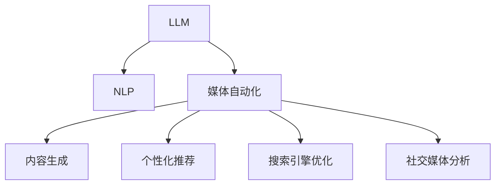

                 

# LLM对传统媒体行业的影响

> 关键词：
- 大语言模型(LLM)
- 自然语言处理(NLP)
- 媒体自动化
- 内容生成
- 搜索引擎优化(SEO)
- 社交媒体分析
- 广告投放优化

## 1. 背景介绍

### 1.1 问题由来
在信息爆炸的互联网时代，媒体行业面临着前所未有的挑战和机遇。传统媒体企业如何利用新技术提升内容质量、增强用户参与度、优化广告效果，成为亟需解决的问题。而大语言模型(LLM)的出现，为这些问题提供了新的解决方案。

LLM通过大规模预训练和微调，具备强大的语言理解和生成能力。其广泛应用于文本分类、自动摘要、情感分析等NLP任务，展现出卓越的性能。在媒体行业，LLM的应用不仅能提升内容生产效率，还能改善用户体验和广告投放效果，进而推动传统媒体的数字化转型。

### 1.2 问题核心关键点
LLM在媒体行业的应用主要集中在以下几个方面：

- **内容生成**：LLM能够自动生成新闻稿、评论、文章等高质量文本内容，节省人力成本。
- **个性化推荐**：根据用户历史行为，LLM能生成个性化文章、广告，提升用户留存率。
- **数据分析与预测**：通过分析海量数据，LLM可预测新闻阅读趋势、广告点击率等，优化内容发布策略。
- **广告投放优化**：LLM能自动生成广告文案，优化关键词选择和投放策略，提升广告效果。
- **社交媒体分析**：通过分析社交媒体用户评论，LLM可提供舆情分析、情绪识别等功能，辅助决策。

这些应用不仅提高了媒体内容生产的效率和质量，还改善了用户体验，推动了媒体行业的创新发展。

### 1.3 问题研究意义
研究LLM在传统媒体行业的应用，对于提升媒体企业的数字化水平、优化运营流程、增强市场竞争力具有重要意义：

1. **提高生产效率**：通过自动化内容生成和推荐，减少人工干预，缩短内容产出周期，提升生产效率。
2. **改善用户体验**：根据用户兴趣生成个性化内容，提升用户满意度，增强用户粘性。
3. **优化广告效果**：生成更具吸引力的广告文案，优化投放策略，提升广告ROI。
4. **辅助决策支持**：通过数据分析和预测，辅助媒体企业进行内容策略和广告投放策略的优化，减少决策失误。
5. **推动行业创新**：引入AI技术，推动传统媒体向智能化、自动化方向发展，提升行业整体竞争力。

## 2. 核心概念与联系

### 2.1 核心概念概述

为更好地理解LLM在媒体行业的应用，本节将介绍几个密切相关的核心概念：

- **大语言模型(LLM)**：以自回归模型或自编码模型为代表的大规模预训练语言模型。通过在大规模无标签文本语料上进行预训练，学习通用的语言表示，具备强大的语言理解和生成能力。

- **自然语言处理(NLP)**：利用计算机技术处理、理解、生成人类语言的技术，旨在使计算机能够理解并生成自然语言文本。

- **媒体自动化**：指利用计算机技术自动化处理媒体内容的过程，包括内容生成、编辑、推荐、分析等环节，提升媒体生产效率和质量。

- **内容生成**：使用算法自动生成文本、图像、视频等内容，减少人工创作工作量。

- **个性化推荐**：根据用户行为和兴趣，生成个性化内容，提升用户参与度和满意度。

- **搜索引擎优化(SEO)**：通过优化内容结构，提高搜索引擎收录和排名，增加流量。

- **社交媒体分析**：利用自然语言处理技术分析社交媒体上的用户评论、帖子等，获取用户情绪、兴趣等信息。

这些核心概念之间的逻辑关系可以通过以下Mermaid流程图来展示：



这个流程图展示了大语言模型与NLP、媒体自动化之间的关系：

1. LLM通过预训练学习通用的语言表示，是NLP的重要基础。
2. LLM被广泛应用于媒体自动化中，通过内容生成、个性化推荐、SEO和社交媒体分析等应用，提升媒体生产效率和用户满意度。
3. 媒体自动化涉及多环节协同，LLM在其中起到了关键作用。

## 3. 核心算法原理 & 具体操作步骤
### 3.1 算法原理概述

基于LLM的媒体自动化主要依赖于NLP技术的语言理解与生成能力，其核心思想是：

- 利用预训练语言模型处理海量文本数据，学习语言规律和特征。
- 通过微调优化，使其适应特定的媒体任务，如内容生成、推荐、广告优化等。

形式化地，假设预训练语言模型为 $M_{\theta}$，其中 $\theta$ 为预训练得到的模型参数。给定特定的媒体任务 $T$，任务数据集为 $D=\{(x_i,y_i)\}_{i=1}^N$，微调的目标是找到新的模型参数 $\hat{\theta}$，使得：

$$
\hat{\theta}=\mathop{\arg\min}_{\theta} \mathcal{L}(M_{\theta},D)
$$

其中 $\mathcal{L}$ 为针对任务 $T$ 设计的损失函数，用于衡量模型预测输出与真实标签之间的差异。常见的损失函数包括交叉熵损失、均方误差损失等。

通过梯度下降等优化算法，微调过程不断更新模型参数 $\theta$，最小化损失函数 $\mathcal{L}$，使得模型输出逼近真实标签。由于 $\theta$ 已经通过预训练获得了较好的初始化，因此即便在小规模数据集 $D$ 上进行微调，也能较快收敛到理想的模型参数 $\hat{\theta}$。

### 3.2 算法步骤详解

基于LLM的媒体自动化一般包括以下几个关键步骤：

**Step 1: 准备预训练模型和数据集**
- 选择合适的预训练语言模型 $M_{\theta}$ 作为初始化参数，如BERT、GPT等。
- 准备媒体任务的标注数据集 $D$，划分为训练集、验证集和测试集。一般要求标注数据与预训练数据的分布不要差异过大。

**Step 2: 添加任务适配层**
- 根据媒体任务类型，在预训练模型顶层设计合适的输出层和损失函数。
- 对于内容生成任务，通常在顶层添加生成器输出概率分布，并以负对数似然为损失函数。
- 对于个性化推荐任务，通常使用协同过滤模型或序列模型，输出推荐结果的预测概率。

**Step 3: 设置微调超参数**
- 选择合适的优化算法及其参数，如 AdamW、SGD 等，设置学习率、批大小、迭代轮数等。
- 设置正则化技术及强度，包括权重衰减、Dropout、Early Stopping等。
- 确定冻结预训练参数的策略，如仅微调顶层，或全部参数都参与微调。

**Step 4: 执行梯度训练**
- 将训练集数据分批次输入模型，前向传播计算损失函数。
- 反向传播计算参数梯度，根据设定的优化算法和学习率更新模型参数。
- 周期性在验证集上评估模型性能，根据性能指标决定是否触发 Early Stopping。
- 重复上述步骤直到满足预设的迭代轮数或 Early Stopping 条件。

**Step 5: 测试和部署**
- 在测试集上评估微调后模型 $M_{\hat{\theta}}$ 的性能，对比微调前后的精度提升。
- 使用微调后的模型对新样本进行推理预测，集成到实际的应用系统中。
- 持续收集新的数据，定期重新微调模型，以适应数据分布的变化。

以上是基于LLM的媒体自动化的一般流程。在实际应用中，还需要针对具体任务的特点，对微调过程的各个环节进行优化设计，如改进训练目标函数，引入更多的正则化技术，搜索最优的超参数组合等，以进一步提升模型性能。

### 3.3 算法优缺点

基于LLM的媒体自动化方法具有以下优点：

- **效率提升**：自动化生成内容、推荐和广告，节省人力成本，提高生产效率。
- **质量提升**：利用预训练模型的语言理解能力，生成高质量、符合语义要求的文本。
- **个性化优化**：根据用户行为和兴趣生成个性化推荐，提升用户体验。
- **精准投放**：优化广告文案和关键词选择，提高广告投放效果。
- **数据分析支持**：通过情感分析、舆情监控等，提供用户行为和市场趋势的洞察。

同时，该方法也存在一定的局限性：

- **依赖标注数据**：微调效果很大程度上取决于标注数据的质量和数量，获取高质量标注数据的成本较高。
- **泛化能力有限**：当目标任务与预训练数据的分布差异较大时，微调的性能提升有限。
- **过拟合风险**：小规模标注数据可能导致过拟合，模型在未见过的数据上表现不佳。
- **可解释性不足**：微调模型的决策过程通常缺乏可解释性，难以对其推理逻辑进行分析和调试。

尽管存在这些局限性，但就目前而言，基于LLM的媒体自动化方法仍是大媒体企业应用的主流范式。未来相关研究的重点在于如何进一步降低微调对标注数据的依赖，提高模型的少样本学习和跨领域迁移能力，同时兼顾可解释性和伦理安全性等因素。

### 3.4 算法应用领域

基于LLM的媒体自动化方法，在媒体行业已经得到了广泛的应用，涵盖了许多不同类型的任务，例如：

- **内容生成**：自动生成新闻、文章、评论等，提高内容产出速度和质量。
- **个性化推荐**：根据用户行为和兴趣生成个性化文章、广告，提升用户参与度和满意度。
- **广告优化**：自动生成广告文案，优化关键词选择和投放策略，提升广告效果。
- **情感分析**：分析社交媒体用户评论，获取用户情绪和舆情信息。
- **舆情监控**：通过分析新闻报道、论坛帖子等，监控和预测舆论趋势。
- **信息检索**：优化内容结构，提升搜索引擎收录和排名，增加流量。

除了上述这些经典任务外，LLM还被创新性地应用到更多场景中，如多媒体内容生成、多模态信息融合等，为媒体行业带来了全新的突破。随着预训练模型和媒体自动化方法的不断进步，相信NLP技术将在更广阔的应用领域大放异彩。

## 4. 数学模型和公式 & 详细讲解
### 4.1 数学模型构建

本节将使用数学语言对基于LLM的媒体自动化过程进行更加严格的刻画。

记预训练语言模型为 $M_{\theta}$，其中 $\theta$ 为预训练得到的模型参数。假设媒体任务 $T$ 的数据集为 $D=\{(x_i,y_i)\}_{i=1}^N, x_i \in \mathcal{X}, y_i \in \mathcal{Y}$。

定义模型 $M_{\theta}$ 在数据样本 $(x,y)$ 上的损失函数为 $\ell(M_{\theta}(x),y)$，则在数据集 $D$ 上的经验风险为：

$$
\mathcal{L}(\theta) = \frac{1}{N} \sum_{i=1}^N \ell(M_{\theta}(x_i),y_i)
$$

微调的优化目标是最小化经验风险，即找到最优参数：

$$
\theta^* = \mathop{\arg\min}_{\theta} \mathcal{L}(\theta)
$$

在实践中，我们通常使用基于梯度的优化算法（如SGD、Adam等）来近似求解上述最优化问题。设 $\eta$ 为学习率，$\lambda$ 为正则化系数，则参数的更新公式为：

$$
\theta \leftarrow \theta - \eta \nabla_{\theta}\mathcal{L}(\theta) - \eta\lambda\theta
$$

其中 $\nabla_{\theta}\mathcal{L}(\theta)$ 为损失函数对参数 $\theta$ 的梯度，可通过反向传播算法高效计算。

### 4.2 公式推导过程

以下我们以内容生成任务为例，推导LLM生成文章的概率模型及其梯度的计算公式。

假设模型 $M_{\theta}$ 在输入 $x$ 上的输出为 $p(x)$，表示模型生成的文本概率。训练样本 $(x_i, y_i)$ 中，$x_i$ 为真实文章，$y_i$ 为生成文章的概率分布。则生成文章的概率模型为：

$$
p(y_i|x_i) = \frac{M_{\theta}(x_i)}{Z}
$$

其中 $Z$ 为归一化因子，保证概率分布之和为1。训练目标是最小化生成文章的概率与真实文章的差异，即交叉熵损失函数：

$$
\ell(p(y_i|x_i), y_i) = -y_i\log p(y_i|x_i) - (1-y_i)\log(1-p(y_i|x_i))
$$

将其代入经验风险公式，得：

$$
\mathcal{L}(\theta) = -\frac{1}{N}\sum_{i=1}^N [y_i\log M_{\theta}(x_i)+(1-y_i)\log(1-M_{\theta}(x_i))]
$$

根据链式法则，损失函数对参数 $\theta_k$ 的梯度为：

$$
\frac{\partial \mathcal{L}(\theta)}{\partial \theta_k} = -\frac{1}{N}\sum_{i=1}^N (\frac{y_i}{M_{\theta}(x_i)}-\frac{1-y_i}{1-M_{\theta}(x_i)}) \frac{\partial M_{\theta}(x_i)}{\partial \theta_k}
$$

其中 $\frac{\partial M_{\theta}(x_i)}{\partial \theta_k}$ 可进一步递归展开，利用自动微分技术完成计算。

在得到损失函数的梯度后，即可带入参数更新公式，完成模型的迭代优化。重复上述过程直至收敛，最终得到适应特定媒体任务的最优模型参数 $\theta^*$。

## 5. 项目实践：代码实例和详细解释说明
### 5.1 开发环境搭建

在进行媒体自动化实践前，我们需要准备好开发环境。以下是使用Python进行PyTorch开发的环境配置流程：

1. 安装Anaconda：从官网下载并安装Anaconda，用于创建独立的Python环境。

2. 创建并激活虚拟环境：
```bash
conda create -n media-env python=3.8 
conda activate media-env
```

3. 安装PyTorch：根据CUDA版本，从官网获取对应的安装命令。例如：
```bash
conda install pytorch torchvision torchaudio cudatoolkit=11.1 -c pytorch -c conda-forge
```

4. 安装Transformers库：
```bash
pip install transformers
```

5. 安装各类工具包：
```bash
pip install numpy pandas scikit-learn matplotlib tqdm jupyter notebook ipython
```

完成上述步骤后，即可在`media-env`环境中开始媒体自动化实践。

### 5.2 源代码详细实现

这里我们以内容生成任务为例，给出使用Transformers库对BERT模型进行媒体自动化的PyTorch代码实现。

首先，定义内容生成任务的数据处理函数：

```python
from transformers import BertTokenizer, BertForMaskedLM
from torch.utils.data import Dataset
import torch

class ContentDataset(Dataset):
    def __init__(self, texts, masks, tokenizer, max_len=128):
        self.texts = texts
        self.masks = masks
        self.tokenizer = tokenizer
        self.max_len = max_len
        
    def __len__(self):
        return len(self.texts)
    
    def __getitem__(self, item):
        text = self.texts[item]
        mask = self.masks[item]
        
        encoding = self.tokenizer(text, return_tensors='pt', max_length=self.max_len, padding='max_length', truncation=True)
        input_ids = encoding['input_ids'][0]
        attention_mask = encoding['attention_mask'][0]
        
        return {'input_ids': input_ids, 
                'attention_mask': attention_mask,
                'mask': mask}

# 创建dataset
tokenizer = BertTokenizer.from_pretrained('bert-base-cased')

train_dataset = ContentDataset(train_texts, train_masks, tokenizer)
dev_dataset = ContentDataset(dev_texts, dev_masks, tokenizer)
test_dataset = ContentDataset(test_texts, test_masks, tokenizer)
```

然后，定义模型和优化器：

```python
from transformers import BertForMaskedLM, AdamW

model = BertForMaskedLM.from_pretrained('bert-base-cased')
optimizer = AdamW(model.parameters(), lr=2e-5)
```

接着，定义训练和评估函数：

```python
from torch.utils.data import DataLoader
from tqdm import tqdm
from sklearn.metrics import perplexity

device = torch.device('cuda') if torch.cuda.is_available() else torch.device('cpu')
model.to(device)

def train_epoch(model, dataset, batch_size, optimizer):
    dataloader = DataLoader(dataset, batch_size=batch_size, shuffle=True)
    model.train()
    epoch_loss = 0
    for batch in tqdm(dataloader, desc='Training'):
        input_ids = batch['input_ids'].to(device)
        attention_mask = batch['attention_mask'].to(device)
        mask = batch['mask'].to(device)
        model.zero_grad()
        outputs = model(input_ids, attention_mask=attention_mask, masked_lm_labels=mask)
        loss = outputs.loss
        epoch_loss += loss.item()
        loss.backward()
        optimizer.step()
    return epoch_loss / len(dataloader)

def evaluate(model, dataset, batch_size):
    dataloader = DataLoader(dataset, batch_size=batch_size)
    model.eval()
    preds, labels = [], []
    with torch.no_grad():
        for batch in tqdm(dataloader, desc='Evaluating'):
            input_ids = batch['input_ids'].to(device)
            attention_mask = batch['attention_mask'].to(device)
            mask = batch['mask'].to(device)
            batch_preds = model(input_ids, attention_mask=attention_mask, masked_lm_labels=mask).logits
            batch_labels = batch['mask']
            preds.append(batch_preds.tolist())
            labels.append(batch_labels.tolist())
                
    print(perplexity(torch.tensor(labels), torch.tensor(preds)))
```

最后，启动训练流程并在测试集上评估：

```python
epochs = 5
batch_size = 16

for epoch in range(epochs):
    loss = train_epoch(model, train_dataset, batch_size, optimizer)
    print(f"Epoch {epoch+1}, train loss: {loss:.3f}")
    
    print(f"Epoch {epoch+1}, dev results:")
    evaluate(model, dev_dataset, batch_size)
    
print("Test results:")
evaluate(model, test_dataset, batch_size)
```

以上就是使用PyTorch对BERT进行内容生成任务媒体自动化的完整代码实现。可以看到，得益于Transformers库的强大封装，我们可以用相对简洁的代码完成BERT模型的加载和微调。

### 5.3 代码解读与分析

让我们再详细解读一下关键代码的实现细节：

**ContentDataset类**：
- `__init__`方法：初始化文本、掩码等关键组件。
- `__len__`方法：返回数据集的样本数量。
- `__getitem__`方法：对单个样本进行处理，将文本输入编码为token ids，将掩码转换为模型所需的掩码序列。

**训练和评估函数**：
- 使用PyTorch的DataLoader对数据集进行批次化加载，供模型训练和推理使用。
- 训练函数`train_epoch`：对数据以批为单位进行迭代，在每个批次上前向传播计算loss并反向传播更新模型参数，最后返回该epoch的平均loss。
- 评估函数`evaluate`：与训练类似，不同点在于不更新模型参数，并在每个batch结束后将预测和标签结果存储下来，最后使用perplexity计算模型在测试集上的性能。

**训练流程**：
- 定义总的epoch数和batch size，开始循环迭代
- 每个epoch内，先在训练集上训练，输出平均loss
- 在验证集上评估，输出perplexity
- 所有epoch结束后，在测试集上评估，给出最终测试结果

可以看到，PyTorch配合Transformers库使得BERT微调的内容生成任务代码实现变得简洁高效。开发者可以将更多精力放在数据处理、模型改进等高层逻辑上，而不必过多关注底层的实现细节。

当然，工业级的系统实现还需考虑更多因素，如模型的保存和部署、超参数的自动搜索、更灵活的任务适配层等。但核心的微调范式基本与此类似。

## 6. 实际应用场景
### 6.1 智能新闻推荐

智能新闻推荐系统通过分析用户的历史浏览记录和兴趣，生成个性化的新闻推荐列表，提升用户粘性和阅读体验。利用LLM，可以实现自动生成新闻标题、摘要等内容，大大减少人工工作量。

在技术实现上，可以收集用户的历史浏览行为数据，将其转化为训练样本。模型将用户行为作为输入，输出最相关的几篇文章。在生成过程中，LLM能利用其语言理解能力，自动生成文章标题、摘要等，进一步优化推荐结果。

### 6.2 个性化广告投放

在广告投放领域，传统的方法往往是基于关键词匹配或人工创意生成，难以满足日益精细化的广告投放需求。利用LLM，可以自动生成广告文案，并根据用户画像和行为进行个性化匹配，提升广告效果。

具体而言，收集用户的浏览历史、兴趣标签等数据，输入到LLM进行文章生成。再结合用户行为数据，生成个性化广告文案，并根据CTR等指标进行投放策略优化。LLM生成的广告文案具有较高的语言表现力，更能吸引用户的注意，提升点击率。

### 6.3 社交媒体舆情分析

社交媒体平台上的舆情分析是媒体行业的重要任务之一，通过监控用户评论和反馈，及时了解市场情绪和热点话题。利用LLM，可以自动分析社交媒体内容，获取舆情变化趋势。

具体实现中，收集社交媒体上的评论数据，输入到LLM进行情感分析和主题抽取。模型能够识别出评论中的情绪倾向和话题，并生成相应的报告。舆情分析结果帮助媒体企业及时调整内容策略，回应社会关切。

### 6.4 内容生成与编辑

传统的内容生产过程需要大量的人力，且往往难以保证内容质量的一致性。利用LLM，可以实现自动生成高质量的文章、报道等，提高内容产出的速度和质量。

例如，对于突发事件的报道，可以输入简短的事件摘要，由LLM自动生成详细的新闻稿。内容生成后的编辑工作，如去除重复信息、排版等，也可以由LLM辅助完成，进一步提升生产效率。

## 7. 工具和资源推荐
### 7.1 学习资源推荐

为了帮助开发者系统掌握LLM在媒体行业的应用，这里推荐一些优质的学习资源：

1. 《Transformer从原理到实践》系列博文：由大模型技术专家撰写，深入浅出地介绍了Transformer原理、BERT模型、媒体自动化等前沿话题。

2. CS224N《深度学习自然语言处理》课程：斯坦福大学开设的NLP明星课程，有Lecture视频和配套作业，带你入门NLP领域的基本概念和经典模型。

3. 《Natural Language Processing with Transformers》书籍：Transformers库的作者所著，全面介绍了如何使用Transformers库进行NLP任务开发，包括媒体自动化在内的诸多范式。

4. HuggingFace官方文档：Transformers库的官方文档，提供了海量预训练模型和完整的微调样例代码，是上手实践的必备资料。

5. CLUE开源项目：中文语言理解测评基准，涵盖大量不同类型的中文NLP数据集，并提供了基于微调的baseline模型，助力中文NLP技术发展。

通过对这些资源的学习实践，相信你一定能够快速掌握LLM在媒体行业的实际应用，并用于解决实际的NLP问题。
###  7.2 开发工具推荐

高效的开发离不开优秀的工具支持。以下是几款用于LLM媒体自动化开发的常用工具：

1. PyTorch：基于Python的开源深度学习框架，灵活动态的计算图，适合快速迭代研究。大部分预训练语言模型都有PyTorch版本的实现。

2. TensorFlow：由Google主导开发的开源深度学习框架，生产部署方便，适合大规模工程应用。同样有丰富的预训练语言模型资源。

3. Transformers库：HuggingFace开发的NLP工具库，集成了众多SOTA语言模型，支持PyTorch和TensorFlow，是进行媒体自动化开发的利器。

4. Weights & Biases：模型训练的实验跟踪工具，可以记录和可视化模型训练过程中的各项指标，方便对比和调优。与主流深度学习框架无缝集成。

5. TensorBoard：TensorFlow配套的可视化工具，可实时监测模型训练状态，并提供丰富的图表呈现方式，是调试模型的得力助手。

6. Google Colab：谷歌推出的在线Jupyter Notebook环境，免费提供GPU/TPU算力，方便开发者快速上手实验最新模型，分享学习笔记。

合理利用这些工具，可以显著提升LLM媒体自动化任务的开发效率，加快创新迭代的步伐。

### 7.3 相关论文推荐

LLM在媒体行业的应用源于学界的持续研究。以下是几篇奠基性的相关论文，推荐阅读：

1. Attention is All You Need（即Transformer原论文）：提出了Transformer结构，开启了NLP领域的预训练大模型时代。

2. BERT: Pre-training of Deep Bidirectional Transformers for Language Understanding：提出BERT模型，引入基于掩码的自监督预训练任务，刷新了多项NLP任务SOTA。

3. Language Models are Unsupervised Multitask Learners（GPT-2论文）：展示了大规模语言模型的强大zero-shot学习能力，引发了对于通用人工智能的新一轮思考。

4. Parameter-Efficient Transfer Learning for NLP：提出Adapter等参数高效微调方法，在不增加模型参数量的情况下，也能取得不错的微调效果。

5. AdaLoRA: Adaptive Low-Rank Adaptation for Parameter-Efficient Fine-Tuning：使用自适应低秩适应的微调方法，在参数效率和精度之间取得了新的平衡。

这些论文代表了大语言模型在媒体行业的应用发展脉络。通过学习这些前沿成果，可以帮助研究者把握学科前进方向，激发更多的创新灵感。

## 8. 总结：未来发展趋势与挑战

### 8.1 总结

本文对基于LLM的媒体自动化方法进行了全面系统的介绍。首先阐述了LLM和媒体自动化的研究背景和意义，明确了LLM在媒体内容生成、个性化推荐、广告优化等任务上的独特价值。其次，从原理到实践，详细讲解了LLM生成内容、推荐广告等任务的数学模型和算法步骤，给出了媒体自动化任务开发的完整代码实例。同时，本文还广泛探讨了LLM在智能新闻推荐、个性化广告投放、社交媒体分析、内容生成与编辑等多个行业领域的应用前景，展示了LLM的强大潜力。此外，本文精选了LLM应用的各类学习资源，力求为开发者提供全方位的技术指引。

通过本文的系统梳理，可以看到，基于LLM的媒体自动化方法正在成为媒体行业的重要范式，极大地提高了内容生产效率和用户满意度，推动了行业数字化转型。未来，伴随LLM和媒体自动化方法的不断演进，相信NLP技术将在更广泛的领域大放异彩，深刻影响媒体行业的创新发展。

### 8.2 未来发展趋势

展望未来，基于LLM的媒体自动化技术将呈现以下几个发展趋势：

1. **效率提升**：随着预训练模型参数量的增加，LLM的生成质量和精度将进一步提升。未来大模型将能生成更详细、更丰富的文章、广告等内容，提高媒体生产的自动化水平。

2. **个性化优化**：通过进一步优化推荐算法，LLM能更好地理解用户兴趣和行为，生成更加个性化、精准的内容和广告，提升用户体验。

3. **广告效果优化**：利用LLM生成更吸引人的广告文案，并通过优化投放策略，提升广告的点击率、转化率等指标，为媒体企业带来更高的商业价值。

4. **多模态融合**：LLM未来将更好地与视觉、音频等多模态数据结合，实现多模态信息融合，提供更全面的媒体内容和服务。

5. **实时性增强**：通过优化模型结构和算法，LLM的推理速度将进一步提升，实现实时生成内容、实时推荐广告等功能，满足用户的即时需求。

6. **伦理与公平**：随着LLM应用领域的扩大，其伦理与公平性问题将日益凸显。如何避免偏见、歧视等负面影响，保证输出内容的客观公正，将是重要的研究方向。

以上趋势凸显了LLM在媒体自动化领域的广阔前景。这些方向的探索发展，必将进一步提升媒体内容生产的效率和质量，推动媒体行业向智能化、自动化方向发展。

### 8.3 面临的挑战

尽管基于LLM的媒体自动化技术已经取得了瞩目成就，但在迈向更加智能化、普适化应用的过程中，它仍面临着诸多挑战：

1. **标注成本瓶颈**：虽然LLM在生成内容、推荐广告等任务上表现优异，但微调过程仍需依赖标注数据，获取高质量标注数据的成本较高。如何降低微调对标注样本的依赖，将是未来的一大挑战。

2. **泛化能力不足**：LLM生成的内容在特定领域内表现较好，但在跨领域任务上泛化能力有限。如何在不同领域之间保持一致的生成质量，将是未来的重要课题。

3. **计算资源消耗**：大模型参数量大，推理时计算资源消耗较大，如何优化模型结构，提升推理效率，是实现LLM自动化应用的关键。

4. **可解释性不足**：LLM生成的内容、推荐等缺乏可解释性，难以解释其决策过程。如何在保证效率的同时，提高模型的可解释性，将是未来的研究方向。

5. **伦理与安全**：LLM可能生成有害内容、误导性信息，如何确保输出的安全性、公正性，避免偏见、歧视等负面影响，将是重要的研究课题。

6. **技术成熟度**：尽管LLM在生成内容、推荐广告等任务上已取得一定成果，但相关技术的成熟度仍需进一步提升，以支持大规模的实际应用。

正视这些挑战，积极应对并寻求突破，将是大语言模型在媒体自动化领域取得更大突破的前提条件。

### 8.4 研究展望

面对大语言模型在媒体自动化应用中所面临的挑战，未来的研究需要在以下几个方面寻求新的突破：

1. **无监督和半监督微调方法**：探索不需要大规模标注数据的微调方法，利用自监督学习、主动学习等技术，最大限度利用非结构化数据。

2. **参数高效微调技术**：开发更加参数高效的微调方法，如Adapter、LoRA等，在不增加模型参数量的情况下，仍能取得较好的微调效果。

3. **多模态融合**：结合视觉、音频等多模态数据，提高LLM的生成质量和广告效果，提供更全面的媒体服务。

4. **因果学习与对比学习**：引入因果推断和对比学习思想，增强LLM的生成能力和泛化性。

5. **融合外部知识**：将符号化的先验知识与神经网络模型结合，引导LLM生成更准确、合理的内容。

6. **伦理与公平性研究**：建立模型行为的监管机制，确保输出内容的客观公正，避免有害内容的生成。

这些研究方向的探索，必将引领大语言模型在媒体自动化领域迈向更高的台阶，为媒体行业带来更深远的变革。相信随着技术的不断发展，大语言模型在媒体自动化领域的应用将更加广泛，推动传统媒体向智能化、自动化方向全面升级。

## 9. 附录：常见问题与解答

**Q1：基于LLM的媒体自动化有哪些优势？**

A: 基于LLM的媒体自动化有以下几个优势：

- **提高生产效率**：自动生成新闻稿、文章、广告等，大大减少人工工作量，提升内容产出速度。
- **提升内容质量**：利用LLM的语言理解能力，生成高质量、符合语义要求的文本，提升内容表现力。
- **个性化推荐**：根据用户兴趣生成个性化文章、广告，提升用户参与度和满意度。
- **广告效果优化**：生成更具吸引力的广告文案，优化投放策略，提升广告ROI。
- **数据分析支持**：通过情感分析、舆情监控等，提供用户行为和市场趋势的洞察，辅助决策。

**Q2：基于LLM的媒体自动化如何提升内容质量？**

A: 基于LLM的媒体自动化通过自动生成内容，可以提升内容质量：

1. **提高生成速度**：自动生成新闻稿、文章、广告等，大幅提升内容产出速度。
2. **提升生成质量**：利用预训练模型的语言理解能力，生成高质量、符合语义要求的文本，避免语法错误、语病等问题。
3. **增强内容多样性**：通过自动生成多种风格的文本，丰富内容类型，满足不同受众的需求。
4. **保持一致性**：自动生成的内容风格和语言表达一致，减少人工干预带来的不一致性。

**Q3：如何缓解基于LLM的媒体自动化的过拟合风险？**

A: 缓解基于LLM的媒体自动化的过拟合风险可以采用以下几种方法：

1. **数据增强**：通过回译、近义替换等方式扩充训练集，增加数据多样性。
2. **正则化技术**：使用L2正则、Dropout、Early Stopping等避免过拟合。
3. **对抗训练**：引入对抗样本，提高模型鲁棒性，减少过拟合风险。
4. **参数高效微调**：只调整少量参数(如Adapter、LoRA等)，减小过拟合风险。
5. **多模型集成**：训练多个LLM模型，取平均输出，抑制过拟合。

这些策略往往需要根据具体任务和数据特点进行灵活组合，最大限度地减少过拟合，提高模型泛化能力。

**Q4：基于LLM的媒体自动化在实际部署时需要注意哪些问题？**

A: 基于LLM的媒体自动化在实际部署时需要注意以下几个问题：

1. **模型裁剪**：去除不必要的层和参数，减小模型尺寸，加快推理速度。
2. **量化加速**：将浮点模型转为定点模型，压缩存储空间，提高计算效率。
3. **服务化封装**：将模型封装为标准化服务接口，便于集成调用。
4. **弹性伸缩**：根据请求流量动态调整资源配置，平衡服务质量和成本。
5. **监控告警**：实时采集系统指标，设置异常告警阈值，确保服务稳定性。
6. **安全防护**：采用访问鉴权、数据脱敏等措施，保障数据和模型安全。

通过合理的部署和优化，可以有效提升LLM在媒体自动化领域的实际应用效果。

**Q5：未来基于LLM的媒体自动化有哪些潜在发展方向？**

A: 未来基于LLM的媒体自动化可能有以下潜在发展方向：

1. **多模态融合**：结合视觉、音频等多模态数据，提供更全面的媒体内容和服务。
2. **实时性增强**：通过优化模型结构和算法，实现实时生成内容、实时推荐广告等功能，满足用户的即时需求。
3. **因果学习与对比学习**：引入因果推断和对比学习思想，增强LLM的生成能力和泛化性。
4. **融合外部知识**：将符号化的先验知识与神经网络模型结合，引导LLM生成更准确、合理的内容。
5. **伦理与公平性研究**：建立模型行为的监管机制，确保输出内容的客观公正，避免有害内容的生成。

这些研究方向将引领基于LLM的媒体自动化技术迈向更高的台阶，为媒体行业带来更深远的变革。

---

作者：禅与计算机程序设计艺术 / Zen and the Art of Computer Programming

