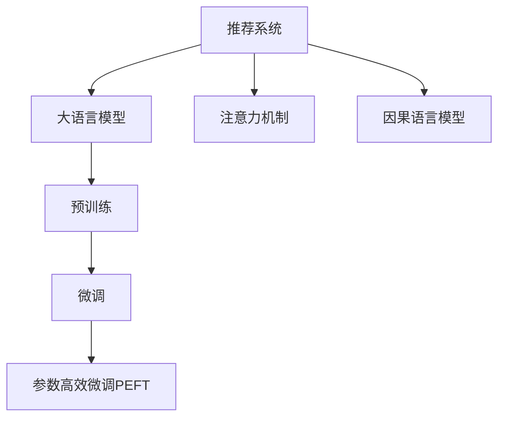

                 

## 1. 背景介绍

### 1.1 问题由来

推荐系统作为电子商务、新闻媒体、在线视频、社交网络等领域的核心组件，其性能直接影响用户体验和业务收入。然而，传统的推荐算法如协同过滤、矩阵分解等，往往面临计算复杂度高、实时性差、推荐准确率不稳定等问题。近年来，随着深度学习和大规模预训练语言模型（Large Language Model, LLM）的兴起，基于LLM的推荐系统成为提升推荐性能的重要方向。

### 1.2 问题核心关键点

LLM在推荐系统中的应用，本质上是通过学习用户行为、商品属性等信息，利用语言模型的自回归性质，生成高质量的推荐序列。其核心挑战在于：

- 如何在海量数据下高效训练和推理LLM模型。
- 如何确保推荐序列的实时性和多样性。
- 如何提升推荐序列的相关性和个性化程度。
- 如何在不同应用场景中平衡模型效率和效果。

这些关键问题直接关系到LLM在推荐系统中的实际落地和应用效果。

### 1.3 问题研究意义

大语言模型在推荐系统中的应用，有助于提升推荐序列的个性化、多样性和相关性，从而增强用户满意度和平台转化率。LLM具备强大的语言理解和生成能力，能够处理复杂的多模态数据，为推荐系统带来新的技术突破。但同时，LLM也面临着高计算需求、低实时性等问题，亟需创新解决路径。因此，深入研究LLM在推荐系统中的应用，具有重要的理论和实践意义。

## 2. 核心概念与联系

### 2.1 核心概念概述

为更好地理解LLM在推荐系统中的应用，本节将介绍几个关键概念：

- 推荐系统(Recommendation System)：根据用户历史行为和喜好，为用户推荐感兴趣的商品、内容等。是互联网产品中极为重要的组成部分，如电商平台、新闻媒体、在线视频等。
- 大语言模型(Large Language Model, LLM)：以自回归（如GPT）或自编码（如BERT）模型为代表的大规模预训练语言模型。通过在大规模无标签文本语料上进行预训练，学习通用的语言表示，具备强大的语言理解和生成能力。
- 预训练(Pre-training)：指在大规模无标签文本语料上，通过自监督学习任务训练通用语言模型的过程。常见的预训练任务包括语言建模、掩码语言模型等。
- 微调(Fine-tuning)：指在预训练模型的基础上，使用下游任务的少量标注数据，通过有监督学习优化模型在特定任务上的性能。通常只需调整顶层分类器或解码器，并以较小的学习率更新全部或部分的模型参数。
- 迁移学习(Transfer Learning)：指将一个领域学习到的知识，迁移应用到另一个不同但相关的领域的学习范式。大模型的预训练-微调过程即是一种典型的迁移学习方式。
- 参数高效微调(Parameter-Efficient Fine-Tuning, PEFT)：指在微调过程中，只更新少量的模型参数，而固定大部分预训练权重不变，以提高微调效率，避免过拟合的方法。
- 注意力机制(Attention Mechanism)：指在神经网络中，通过计算输入序列中不同位置的注意力权重，对不同位置的信息进行加权融合，实现序列建模的强大能力。
- 因果语言模型(Causal Language Model)：指在生成文本时，考虑上下文信息，避免未来的信息对当前的预测造成干扰的语言模型。

这些核心概念之间的逻辑关系可以通过以下Mermaid流程图来展示：



这个流程图展示了大语言模型在推荐系统中的应用核心概念及其之间的关系：

1. 推荐系统通过预训练语言模型进行用户行为建模。
2. 大语言模型通过预训练获得通用的语言表示。
3. 微调优化语言模型在推荐任务上的性能。
4. 参数高效微调在微调过程中只更新少量参数。
5. 注意力机制帮助模型处理序列数据。
6. 因果语言模型确保生成文本的合理性。

这些概念共同构成了LLM在推荐系统中的工作原理和优化方向。

## 3. 核心算法原理 & 具体操作步骤
### 3.1 算法原理概述

基于LLM的推荐系统，通过预训练语言模型来学习用户行为和商品属性的语言表示，然后利用微调优化模型在推荐任务上的性能，生成高质量的推荐序列。

形式化地，假设预训练语言模型为 $M_{\theta}$，其中 $\theta$ 为预训练得到的模型参数。给定用户历史行为数据 $U=\{(u_i,b_i)\}_{i=1}^N$，其中 $u_i$ 为用户ID，$b_i$ 为商品ID。推荐系统的目标是为用户 $u$ 推荐最感兴趣的商品 $b$，即优化：

$$
\max_{b} P_{M_{\theta}}(b|u)
$$

其中 $P_{M_{\theta}}(b|u)$ 表示用户 $u$ 对商品 $b$ 的兴趣概率。

通过梯度下降等优化算法，微调过程不断更新模型参数 $\theta$，最大化用户兴趣概率，使得推荐序列尽可能符合用户的实际需求。

### 3.2 算法步骤详解

基于LLM的推荐系统一般包括以下几个关键步骤：

**Step 1: 准备预训练模型和数据集**
- 选择合适的预训练语言模型 $M_{\theta}$ 作为初始化参数，如 GPT、BERT 等。
- 准备用户历史行为数据 $U$，划分为训练集、验证集和测试集。一般要求数据分布均匀，避免偏差。

**Step 2: 设计任务适配层**
- 根据推荐任务类型，在预训练语言模型的顶层设计合适的输出层和损失函数。
- 对于基于序列的推荐任务，通常使用自回归模型，输出概率分布；对于基于图结构的推荐任务，使用图神经网络模型。

**Step 3: 设置微调超参数**
- 选择合适的优化算法及其参数，如 AdamW、SGD 等，设置学习率、批大小、迭代轮数等。
- 设置正则化技术及强度，包括权重衰减、Dropout、Early Stopping 等。
- 确定冻结预训练参数的策略，如仅微调顶层，或全部参数都参与微调。

**Step 4: 执行梯度训练**
- 将用户历史行为数据 $U$ 分批次输入模型，前向传播计算兴趣概率。
- 反向传播计算参数梯度，根据设定的优化算法和学习率更新模型参数。
- 周期性在验证集上评估模型性能，根据性能指标决定是否触发 Early Stopping。
- 重复上述步骤直到满足预设的迭代轮数或 Early Stopping 条件。

**Step 5: 测试和部署**
- 在测试集上评估微调后模型 $M_{\hat{\theta}}$ 的性能，对比微调前后的精度提升。
- 使用微调后的模型对新用户行为进行推理预测，集成到实际的应用系统中。
- 持续收集新的用户行为数据，定期重新微调模型，以适应数据分布的变化。

以上是基于LLM的推荐系统的一般流程。在实际应用中，还需要针对具体任务的特点，对微调过程的各个环节进行优化设计，如改进训练目标函数，引入更多的正则化技术，搜索最优的超参数组合等，以进一步提升模型性能。

### 3.3 算法优缺点

基于LLM的推荐系统具有以下优点：

- 推荐序列的个性化程度高。LLM具备强大的语言生成能力，能够生成高度个性化的推荐内容。
- 推荐序列的相关性高。LLM能够理解文本中的语义信息，生成与用户兴趣高度相关的推荐序列。
- 推荐序列的多样性高。LLM能够处理多模态数据，生成多样化的推荐内容。
- 推荐系统的泛化能力强。LLM通过预训练-微调过程，学习到了通用的语言表示，能够适应不同的推荐场景。

但同时，该方法也存在一些局限性：

- 训练和推理计算量大。LLM模型参数量巨大，训练和推理需要大量的计算资源和存储空间。
- 实时性不足。LLM模型推理速度较慢，无法实现实时推荐。
- 数据隐私问题。用户历史行为数据的收集和存储可能存在隐私风险，需要采取数据脱敏、访问控制等措施。
- 模型复杂度高。LLM模型的复杂性使得调试和优化过程更加困难。
- 泛化能力不足。LLM模型在特定领域的应用效果可能不如专门的领域模型。

尽管存在这些局限性，但就目前而言，基于LLM的推荐系统仍然是推荐技术的前沿方向，具有巨大的应用潜力。

### 3.4 算法应用领域

基于LLM的推荐系统已经在电商推荐、新闻推荐、视频推荐等诸多领域得到了广泛应用，成为推荐技术落地应用的重要手段。

- 电商推荐系统：通过分析用户浏览、点击、购买等行为数据，生成个性化推荐序列。
- 新闻推荐系统：根据用户阅读历史，生成个性化新闻推荐序列。
- 视频推荐系统：根据用户观看历史和评分数据，生成个性化视频推荐序列。
- 社交网络推荐：根据用户点赞、评论、关注等互动数据，生成个性化内容推荐序列。

除了上述这些经典应用外，LLM在推荐系统中的应用还在不断创新，如可控文本生成、情感分析、用户画像等方向，为推荐系统带来了新的技术突破。

## 4. 数学模型和公式 & 详细讲解  
### 4.1 数学模型构建

本节将使用数学语言对基于LLM的推荐系统进行更加严格的刻画。

记预训练语言模型为 $M_{\theta}$，其中 $\theta$ 为预训练得到的模型参数。假设推荐系统的训练集为 $D=\{(u_i,b_i)\}_{i=1}^N$，其中 $u_i$ 为用户ID，$b_i$ 为商品ID。推荐系统的目标是最小化用户历史行为数据 $U$ 和推荐模型 $M_{\theta}$ 之间的KL散度：

$$
\min_{\theta} KL(P_{M_{\theta}}(b|u)||P_{data}(b|u))
$$

其中 $P_{M_{\theta}}(b|u)$ 表示模型预测的用户对商品 $b$ 的兴趣概率，$P_{data}(b|u)$ 表示用户 $u$ 的实际行为概率。

通过梯度下降等优化算法，微调过程不断更新模型参数 $\theta$，最小化KL散度，使得推荐模型输出的概率分布尽可能接近实际行为分布，从而生成高质量的推荐序列。

### 4.2 公式推导过程

以下我们以基于序列的推荐任务为例，推导基于LLM的推荐模型的损失函数。

假设预训练语言模型为 $M_{\theta}$，其中 $\theta$ 为预训练得到的模型参数。假设用户 $u$ 的推荐序列为 $b_1,b_2,\ldots,b_k$，其中 $b_i$ 为商品ID。则推荐模型的预测概率分布为：

$$
P_{M_{\theta}}(b_1,b_2,\ldots,b_k|u) = \prod_{i=1}^k P_{M_{\theta}}(b_i|u,b_{i-1})
$$

其中 $P_{M_{\theta}}(b_i|u,b_{i-1})$ 表示在用户 $u$ 已推荐商品 $b_{i-1}$ 的情况下，商品 $b_i$ 的推荐概率。

推荐系统的目标是最小化用户历史行为数据 $U$ 和推荐模型 $M_{\theta}$ 之间的KL散度：

$$
\min_{\theta} KL(P_{M_{\theta}}(b_1,b_2,\ldots,b_k|u)||P_{data}(b_1,b_2,\ldots,b_k|u))
$$

将KL散度展开，得：

$$
\min_{\theta} \sum_{u \in U} \sum_{k=1}^{K_u} \sum_{i=1}^k KL(P_{M_{\theta}}(b_i|u,b_{i-1})||P_{data}(b_i|u,b_{i-1}))
$$

其中 $K_u$ 表示用户 $u$ 的推荐序列长度，$P_{data}(b_i|u,b_{i-1})$ 表示用户 $u$ 在已推荐商品 $b_{i-1}$ 的情况下，商品 $b_i$ 的实际推荐概率。

因此，基于LLM的推荐系统的损失函数为：

$$
\mathcal{L}(\theta) = \frac{1}{N} \sum_{i=1}^N \sum_{k=1}^{K_i} \sum_{j=1}^k KL(P_{M_{\theta}}(b_i|u_i,b_{i-1})||P_{data}(b_i|u_i,b_{i-1}))
$$

其中 $N$ 表示用户行为数据 $U$ 的总数。

根据链式法则，损失函数对参数 $\theta$ 的梯度为：

$$
\frac{\partial \mathcal{L}(\theta)}{\partial \theta} = \frac{1}{N} \sum_{i=1}^N \sum_{k=1}^{K_i} \sum_{j=1}^k \frac{\partial KL(P_{M_{\theta}}(b_i|u_i,b_{i-1})||P_{data}(b_i|u_i,b_{i-1}))}{\partial \theta}
$$

其中：

$$
\frac{\partial KL(P_{M_{\theta}}(b_i|u_i,b_{i-1})||P_{data}(b_i|u_i,b_{i-1}))}{\partial \theta} = \sum_{b} P_{data}(b|u_i,b_{i-1}) \log \frac{P_{M_{\theta}}(b|u_i,b_{i-1})}{P_{data}(b|u_i,b_{i-1})}
$$

在得到损失函数的梯度后，即可带入参数更新公式，完成模型的迭代优化。重复上述过程直至收敛，最终得到适应推荐任务的最优模型参数 $\theta^*$。

## 5. 项目实践：代码实例和详细解释说明
### 5.1 开发环境搭建

在进行基于LLM的推荐系统开发前，我们需要准备好开发环境。以下是使用Python进行PyTorch开发的环境配置流程：

1. 安装Anaconda：从官网下载并安装Anaconda，用于创建独立的Python环境。

2. 创建并激活虚拟环境：
```bash
conda create -n pytorch-env python=3.8 
conda activate pytorch-env
```

3. 安装PyTorch：根据CUDA版本，从官网获取对应的安装命令。例如：
```bash
conda install pytorch torchvision torchaudio cudatoolkit=11.1 -c pytorch -c conda-forge
```

4. 安装Transformer库：
```bash
pip install transformers
```

5. 安装各类工具包：
```bash
pip install numpy pandas scikit-learn matplotlib tqdm jupyter notebook ipython
```

完成上述步骤后，即可在`pytorch-env`环境中开始推荐系统的开发实践。

### 5.2 源代码详细实现

这里我们以电商推荐系统为例，给出使用Transformers库对BERT模型进行电商推荐微调的PyTorch代码实现。

首先，定义推荐任务的数据处理函数：

```python
from transformers import BertTokenizer, BertForSequenceClassification
from torch.utils.data import Dataset
import torch

class RecommendationDataset(Dataset):
    def __init__(self, user_behaviors, labels, tokenizer, max_len=128):
        self.user_behaviors = user_behaviors
        self.labels = labels
        self.tokenizer = tokenizer
        self.max_len = max_len
        
    def __len__(self):
        return len(self.user_behaviors)
    
    def __getitem__(self, item):
        user_behavior = self.user_behaviors[item]
        label = self.labels[item]
        
        encoding = self.tokenizer(user_behavior, return_tensors='pt', max_length=self.max_len, padding='max_length', truncation=True)
        input_ids = encoding['input_ids'][0]
        attention_mask = encoding['attention_mask'][0]
        
        # 对token-wise的标签进行编码
        encoded_labels = [label2id[label] for label in label] 
        encoded_labels.extend([label2id['']]*(self.max_len - len(encoded_labels)))
        labels = torch.tensor(encoded_labels, dtype=torch.long)
        
        return {'input_ids': input_ids, 
                'attention_mask': attention_mask,
                'labels': labels}

# 标签与id的映射
label2id = {'buy': 0, 'watch': 1, 'read': 2, 'uninterested': 3}
id2label = {v: k for k, v in label2id.items()}

# 创建dataset
tokenizer = BertTokenizer.from_pretrained('bert-base-cased')

train_dataset = RecommendationDataset(train_user_behaviors, train_labels, tokenizer)
dev_dataset = RecommendationDataset(dev_user_behaviors, dev_labels, tokenizer)
test_dataset = RecommendationDataset(test_user_behaviors, test_labels, tokenizer)
```

然后，定义模型和优化器：

```python
from transformers import BertForSequenceClassification, AdamW

model = BertForSequenceClassification.from_pretrained('bert-base-cased', num_labels=len(label2id))

optimizer = AdamW(model.parameters(), lr=2e-5)
```

接着，定义训练和评估函数：

```python
from torch.utils.data import DataLoader
from tqdm import tqdm
from sklearn.metrics import classification_report

device = torch.device('cuda') if torch.cuda.is_available() else torch.device('cpu')
model.to(device)

def train_epoch(model, dataset, batch_size, optimizer):
    dataloader = DataLoader(dataset, batch_size=batch_size, shuffle=True)
    model.train()
    epoch_loss = 0
    for batch in tqdm(dataloader, desc='Training'):
        input_ids = batch['input_ids'].to(device)
        attention_mask = batch['attention_mask'].to(device)
        labels = batch['labels'].to(device)
        model.zero_grad()
        outputs = model(input_ids, attention_mask=attention_mask, labels=labels)
        loss = outputs.loss
        epoch_loss += loss.item()
        loss.backward()
        optimizer.step()
    return epoch_loss / len(dataloader)

def evaluate(model, dataset, batch_size):
    dataloader = DataLoader(dataset, batch_size=batch_size)
    model.eval()
    preds, labels = [], []
    with torch.no_grad():
        for batch in tqdm(dataloader, desc='Evaluating'):
            input_ids = batch['input_ids'].to(device)
            attention_mask = batch['attention_mask'].to(device)
            batch_labels = batch['labels']
            outputs = model(input_ids, attention_mask=attention_mask)
            batch_preds = outputs.logits.argmax(dim=2).to('cpu').tolist()
            batch_labels = batch_labels.to('cpu').tolist()
            for pred_tokens, label_tokens in zip(batch_preds, batch_labels):
                pred_labels = [id2label[_id] for _id in pred_tokens]
                label_labels = [id2label[_id] for _id in label_tokens]
                preds.append(pred_labels[:len(label_tokens)])
                labels.append(label_labels)
                
    print(classification_report(labels, preds))
```

最后，启动训练流程并在测试集上评估：

```python
epochs = 5
batch_size = 16

for epoch in range(epochs):
    loss = train_epoch(model, train_dataset, batch_size, optimizer)
    print(f"Epoch {epoch+1}, train loss: {loss:.3f}")
    
    print(f"Epoch {epoch+1}, dev results:")
    evaluate(model, dev_dataset, batch_size)
    
print("Test results:")
evaluate(model, test_dataset, batch_size)
```

以上就是使用PyTorch对BERT进行电商推荐任务微调的完整代码实现。可以看到，得益于Transformer库的强大封装，我们可以用相对简洁的代码完成BERT模型的加载和微调。

### 5.3 代码解读与分析

让我们再详细解读一下关键代码的实现细节：

**RecommendationDataset类**：
- `__init__`方法：初始化用户行为数据、标签、分词器等关键组件。
- `__len__`方法：返回数据集的样本数量。
- `__getitem__`方法：对单个样本进行处理，将用户行为输入编码为token ids，将标签编码为数字，并对其进行定长padding，最终返回模型所需的输入。

**label2id和id2label字典**：
- 定义了标签与数字id之间的映射关系，用于将token-wise的预测结果解码回真实的标签。

**训练和评估函数**：
- 使用PyTorch的DataLoader对数据集进行批次化加载，供模型训练和推理使用。
- 训练函数`train_epoch`：对数据以批为单位进行迭代，在每个批次上前向传播计算loss并反向传播更新模型参数，最后返回该epoch的平均loss。
- 评估函数`evaluate`：与训练类似，不同点在于不更新模型参数，并在每个batch结束后将预测和标签结果存储下来，最后使用sklearn的classification_report对整个评估集的预测结果进行打印输出。

**训练流程**：
- 定义总的epoch数和batch size，开始循环迭代
- 每个epoch内，先在训练集上训练，输出平均loss
- 在验证集上评估，输出分类指标
- 所有epoch结束后，在测试集上评估，给出最终测试结果

可以看到，PyTorch配合Transformer库使得BERT微调的代码实现变得简洁高效。开发者可以将更多精力放在数据处理、模型改进等高层逻辑上，而不必过多关注底层的实现细节。

当然，工业级的系统实现还需考虑更多因素，如模型的保存和部署、超参数的自动搜索、更灵活的任务适配层等。但核心的微调范式基本与此类似。

## 6. 实际应用场景
### 6.1 智能客服系统

基于大语言模型微调的对话技术，可以广泛应用于智能客服系统的构建。传统客服往往需要配备大量人力，高峰期响应缓慢，且一致性和专业性难以保证。而使用微调后的对话模型，可以7x24小时不间断服务，快速响应客户咨询，用自然流畅的语言解答各类常见问题。

在技术实现上，可以收集企业内部的历史客服对话记录，将问题和最佳答复构建成监督数据，在此基础上对预训练对话模型进行微调。微调后的对话模型能够自动理解用户意图，匹配最合适的答案模板进行回复。对于客户提出的新问题，还可以接入检索系统实时搜索相关内容，动态组织生成回答。如此构建的智能客服系统，能大幅提升客户咨询体验和问题解决效率。

### 6.2 金融舆情监测

金融机构需要实时监测市场舆论动向，以便及时应对负面信息传播，规避金融风险。传统的人工监测方式成本高、效率低，难以应对网络时代海量信息爆发的挑战。基于大语言模型微调的文本分类和情感分析技术，为金融舆情监测提供了新的解决方案。

具体而言，可以收集金融领域相关的新闻、报道、评论等文本数据，并对其进行主题标注和情感标注。在此基础上对预训练语言模型进行微调，使其能够自动判断文本属于何种主题，情感倾向是正面、中性还是负面。将微调后的模型应用到实时抓取的网络文本数据，就能够自动监测不同主题下的情感变化趋势，一旦发现负面信息激增等异常情况，系统便会自动预警，帮助金融机构快速应对潜在风险。

### 6.3 个性化推荐系统

当前的推荐系统往往只依赖用户的历史行为数据进行物品推荐，无法深入理解用户的真实兴趣偏好。基于大语言模型微调技术，个性化推荐系统可以更好地挖掘用户行为背后的语义信息，从而提供更精准、多样的推荐内容。

在实践中，可以收集用户浏览、点击、评论、分享等行为数据，提取和用户交互的物品标题、描述、标签等文本内容。将文本内容作为模型输入，用户的后续行为（如是否点击、购买等）作为监督信号，在此基础上微调预训练语言模型。微调后的模型能够从文本内容中准确把握用户的兴趣点。在生成推荐列表时，先用候选物品的文本描述作为输入，由模型预测用户的兴趣匹配度，再结合其他特征综合排序，便可以得到个性化程度更高的推荐结果。

### 6.4 未来应用展望

随着大语言模型和微调方法的不断发展，基于微调范式将在更多领域得到应用，为传统行业带来变革性影响。

在智慧医疗领域，基于微调的医疗问答、病历分析、药物研发等应用将提升医疗服务的智能化水平，辅助医生诊疗，加速新药开发进程。

在智能教育领域，微调技术可应用于作业批改、学情分析、知识推荐等方面，因材施教，促进教育公平，提高教学质量。

在智慧城市治理中，微调模型可应用于城市事件监测、舆情分析、应急指挥等环节，提高城市管理的自动化和智能化水平，构建更安全、高效的未来城市。

此外，在企业生产、社会治理、文娱传媒等众多领域，基于大模型微调的人工智能应用也将不断涌现，为经济社会发展注入新的动力。相信随着技术的日益成熟，微调方法将成为人工智能落地应用的重要范式，推动人工智能技术在垂直行业的规模化落地。总之，微调需要开发者根据具体任务，不断迭代和优化模型、数据和算法，方能得到理想的效果。

## 7. 工具和资源推荐
### 7.1 学习资源推荐

为了帮助开发者系统掌握大语言模型微调的理论基础和实践技巧，这里推荐一些优质的学习资源：

1. 《Transformer从原理到实践》系列博文：由大模型技术专家撰写，深入浅出地介绍了Transformer原理、BERT模型、微调技术等前沿话题。

2. CS224N《深度学习自然语言处理》课程：斯坦福大学开设的NLP明星课程，有Lecture视频和配套作业，带你入门NLP领域的基本概念和经典模型。

3. 《Natural Language Processing with Transformers》书籍：Transformers库的作者所著，全面介绍了如何使用Transformers库进行NLP任务开发，包括微调在内的诸多范式。

4. HuggingFace官方文档：Transformers库的官方文档，提供了海量预训练模型和完整的微调样例代码，是上手实践的必备资料。

5. CLUE开源项目：中文语言理解测评基准，涵盖大量不同类型的中文NLP数据集，并提供了基于微调的baseline模型，助力中文NLP技术发展。

通过对这些资源的学习实践，相信你一定能够快速掌握大语言模型微调的精髓，并用于解决实际的NLP问题。
###  7.2 开发工具推荐

高效的开发离不开优秀的工具支持。以下是几款用于大语言模型微调开发的常用工具：

1. PyTorch：基于Python的开源深度学习框架，灵活动态的计算图，适合快速迭代研究。大部分预训练语言模型都有PyTorch版本的实现。

2. TensorFlow：由Google主导开发的开源深度学习框架，生产部署方便，适合大规模工程应用。同样有丰富的预训练语言模型资源。

3. Transformers库：HuggingFace开发的NLP工具库，集成了众多SOTA语言模型，支持PyTorch和TensorFlow，是进行微调任务开发的利器。

4. Weights & Biases：模型训练的实验跟踪工具，可以记录和可视化模型训练过程中的各项指标，方便对比和调优。与主流深度学习框架无缝集成。

5. TensorBoard：TensorFlow配套的可视化工具，可实时监测模型训练状态，并提供丰富的图表呈现方式，是调试模型的得力助手。

6. Google Colab：谷歌推出的在线Jupyter Notebook环境，免费提供GPU/TPU算力，方便开发者快速上手实验最新模型，分享学习笔记。

合理利用这些工具，可以显著提升大语言模型微调任务的开发效率，加快创新迭代的步伐。

### 7.3 相关论文推荐

大语言模型和微调技术的发展源于学界的持续研究。以下是几篇奠基性的相关论文，推荐阅读：

1. Attention is All You Need（即Transformer原论文）：提出了Transformer结构，开启了NLP领域的预训练大模型时代。

2. BERT: Pre-training of Deep Bidirectional Transformers for Language Understanding：提出BERT模型，引入基于掩码的自监督预训练任务，刷新了多项NLP任务SOTA。

3. Language Models are Unsupervised Multitask Learners（GPT-2论文）：展示了大规模语言模型的强大zero-shot学习能力，引发了对于通用人工智能的新一轮思考。

4. Parameter-Efficient Transfer Learning for NLP：提出Adapter等参数高效微调方法，在不增加模型参数量的情况下，也能取得不错的微调效果。

5. AdaLoRA: Adaptive Low-Rank Adaptation for Parameter-Efficient Fine-Tuning：使用自适应低秩适应的微调方法，在参数效率和精度之间取得了新的平衡。

这些论文代表了大语言模型微调技术的发展脉络。通过学习这些前沿成果，可以帮助研究者把握学科前进方向，激发更多的创新灵感。

## 8. 总结：未来发展趋势与挑战

### 8.1 总结

本文对基于LLM的推荐系统进行了全面系统的介绍。首先阐述了LLM在推荐系统中的应用背景和意义，明确了微调在提升推荐性能方面的独特价值。其次，从原理到实践，详细讲解了基于LLM的推荐系统的数学原理和关键步骤，给出了推荐系统开发的完整代码实例。同时，本文还广泛探讨了LLM在推荐系统中的实际应用场景，展示了其巨大潜力。

通过本文的系统梳理，可以看到，基于LLM的推荐系统通过预训练语言模型进行用户行为建模，利用微调优化推荐模型的性能，生成高质量的推荐序列。未来，LLM推荐系统将通过参数高效微调、注意力机制、因果语言模型等技术，进一步提升推荐序列的个性化、相关性和多样性，为推荐系统带来新的突破。

### 8.2 未来发展趋势

展望未来，LLM在推荐系统中的应用将呈现以下几个发展趋势：

1. 推荐系统与LLM深度融合。未来的推荐系统将更加依赖LLM的强大语言生成能力，生成更加个性化、多样化的推荐内容。

2. 推荐系统实时性能提升。通过模型压缩、分布式训练等技术，提升推荐系统的实时处理能力，实现实时推荐。

3. 推荐系统的可解释性增强。利用LLM的逻辑推理能力，增强推荐系统的可解释性，让用户理解推荐理由，提升用户信任度。

4. 推荐系统的多模态融合。将LLM与视觉、语音等多模态信息进行深度融合，提升推荐系统对复杂多模态数据的处理能力。

5. 推荐系统的跨领域迁移。通过知识图谱、领域专家的引导，提升LLM在特定领域的应用效果，实现跨领域迁移。

6. 推荐系统的安全性保障。利用LLM的因果推理能力，避免推荐系统在特定场景下的误导性、歧视性输出，提升系统的安全性。

以上趋势凸显了LLM在推荐系统中的广阔前景。这些方向的探索发展，必将进一步提升推荐系统的性能和应用范围，为推荐系统带来新的突破。

### 8.3 面临的挑战

尽管基于LLM的推荐系统已经取得了瞩目成就，但在迈向更加智能化、普适化应用的过程中，它仍面临着诸多挑战：

1. 训练和推理计算量大。LLM模型参数量巨大，训练和推理需要大量的计算资源和存储空间。

2. 实时性不足。LLM模型推理速度较慢，无法实现实时推荐。

3. 数据隐私问题。用户历史行为数据的收集和存储可能存在隐私风险，需要采取数据脱敏、访问控制等措施。

4. 模型复杂度高。LLM模型的复杂性使得调试和优化过程更加困难。

5. 泛化能力不足。LLM模型在特定领域的应用效果可能不如专门的领域模型。

尽管存在这些局限性，但就目前而言，基于LLM的推荐系统仍然是推荐技术的前沿方向，具有巨大的应用潜力。

### 8.4 研究展望

面对基于LLM的推荐系统所面临的挑战，未来的研究需要在以下几个方面寻求新的突破：

1. 探索无监督和半监督微调方法。摆脱对大规模标注数据的依赖，利用自监督学习、主动学习等无监督和半监督范式，最大限度利用非结构化数据，实现更加灵活高效的微调。

2. 研究参数高效和计算高效的微调范式。开发更加参数高效的微调方法，在固定大部分预训练参数的同时，只更新极少量的任务相关参数。同时优化微调模型的计算图，减少前向传播和反向传播的资源消耗，实现更加轻量级、实时性的部署。

3. 融合因果和对比学习范式。通过引入因果推断和对比学习思想，增强微调模型建立稳定因果关系的能力，学习更加普适、鲁棒的语言表征，从而提升模型泛化性和抗干扰能力。

4. 引入更多先验知识。将符号化的先验知识，如知识图谱、逻辑规则等，与神经网络模型进行巧妙融合，引导微调过程学习更准确、合理的语言模型。同时加强不同模态数据的整合，实现视觉、语音等多模态信息与文本信息的协同建模。

5. 结合因果分析和博弈论工具。将因果分析方法引入微调模型，识别出模型决策的关键特征，增强输出解释的因果性和逻辑性。借助博弈论工具刻画人机交互过程，主动探索并规避模型的脆弱点，提高系统稳定性。

6. 纳入伦理道德约束。在模型训练目标中引入伦理导向的评估指标，过滤和惩罚有偏见、有害的输出倾向。同时加强人工干预和审核，建立模型行为的监管机制，确保输出符合人类价值观和伦理道德。

这些研究方向的探索，必将引领基于LLM的推荐系统技术迈向更高的台阶，为推荐系统带来新的突破。面向未来，LLM推荐系统还需要与其他人工智能技术进行更深入的融合，如知识表示、因果推理、强化学习等，多路径协同发力，共同推动推荐系统的进步。只有勇于创新、敢于突破，才能不断拓展LLM的应用边界，让智能技术更好地造福人类社会。

## 9. 附录：常见问题与解答

**Q1：大语言模型微调是否适用于所有推荐系统？**

A: 大语言模型微调在大多数推荐系统上都能取得不错的效果，特别是对于数据量较小的推荐系统。但对于一些特定领域的推荐系统，如医药、法律等，仅仅依靠通用语料预训练的模型可能难以很好地适应。此时需要在特定领域语料上进一步预训练，再进行微调，才能获得理想效果。此外，对于一些需要时效性、个性化很强的推荐系统，如实时推荐、个性化推荐等，微调方法也需要针对性的改进优化。

**Q2：微调过程中如何选择合适的学习率？**

A: 微调的学习率一般要比预训练时小1-2个数量级，如果使用过大的学习率，容易破坏预训练权重，导致过拟合。一般建议从1e-5开始调参，逐步减小学习率，直至收敛。也可以使用warmup策略，在开始阶段使用较小的学习率，再逐渐过渡到预设值。需要注意的是，不同的优化器(如AdamW、Adafactor等)以及不同的学习率调度策略，可能需要设置不同的学习率阈值。

**Q3：采用大语言模型微调时会面临哪些资源瓶颈？**

A: 目前主流的预训练大模型动辄以亿计的参数规模，对算力、内存、存储都提出了很高的要求。GPU/TPU等高性能设备是必不可少的，但即便如此，超大批次的训练和推理也可能遇到显存不足的问题。因此需要采用一些资源优化技术，如梯度积累、混合精度训练、模型并行等，来突破硬件瓶颈。同时，模型的存储和读取也可能占用大量时间和空间，需要采用模型压缩、稀疏化存储等方法进行优化。

**Q4：如何缓解微调过程中的过拟合问题？**

A: 过拟合是微调面临的主要挑战，尤其是在标注数据不足的情况下。常见的缓解策略包括：
1. 数据增强：通过回译、近义替换等方式扩充训练集
2. 正则化：使用L2正则、Dropout、Early Stopping等避免过拟合
3. 对抗训练：引入对抗样本，提高模型鲁棒性
4. 参数高效微调：只调整少量参数(如Adapter、Prefix等)，减小过拟合风险
5. 多模型集成：训练多个微调模型，取平均输出，抑制过拟合

这些策略往往需要根据具体任务和数据特点进行灵活组合。只有在数据、模型、训练、推理等各环节进行全面优化，才能最大限度地发挥大语言模型微调的威力。

**Q5：微调模型在落地部署时需要注意哪些问题？**

A: 将微调模型转化为实际应用，还需要考虑以下因素：
1. 模型裁剪：去除不必要的层和参数，减小模型尺寸，加快推理速度
2. 量化加速：将浮点模型转为定点模型，压缩存储空间，提高计算效率
3. 服务化封装：将模型封装为标准化服务接口，便于集成调用
4. 弹性伸缩：根据请求流量动态调整资源配置，平衡服务质量和成本
5. 监控告警：实时采集系统指标，设置异常告警阈值，确保服务稳定性
6. 安全防护：采用访问鉴权、数据脱敏等措施，保障数据和模型安全

大语言模型微调为推荐系统提供了强大的语言处理能力，但如何将强大的性能转化为稳定、高效、安全的业务价值，还需要工程实践的不断打磨。唯有从数据、算法、工程、业务等多个维度协同发力，才能真正实现人工智能技术在垂直行业的规模化落地。总之，微调需要开发者根据具体任务，不断迭代和优化模型、数据和算法，方能得到理想的效果。

