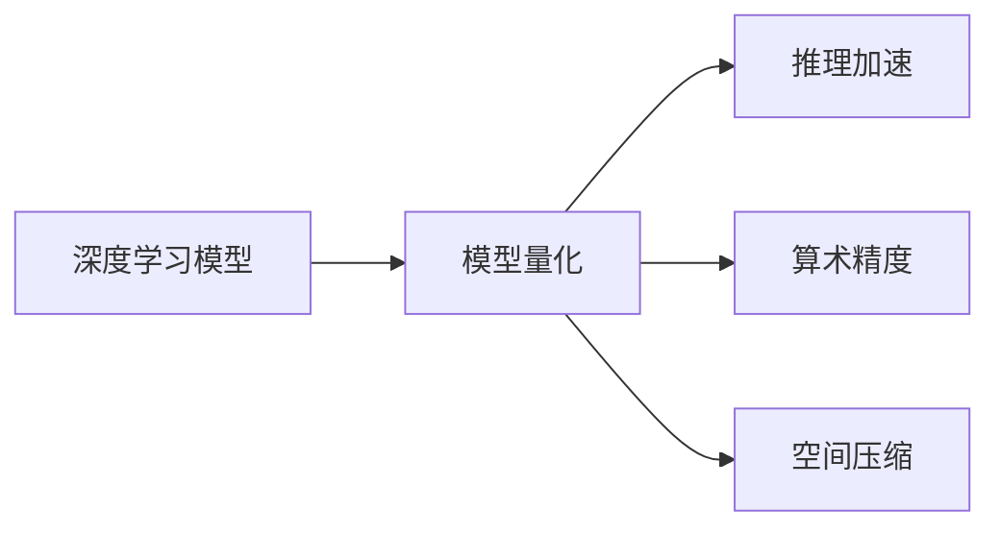

                 

# LLM推理优化II：模型量化技术及其实现

> 关键词：模型量化,深度学习,推理加速,算术精度,空间压缩

## 1. 背景介绍

随着深度学习技术的迅猛发展，深度神经网络模型如卷积神经网络(CNN)、循环神经网络(RNN)和深度神经网络(DNN)等已经在图像识别、自然语言处理、语音识别等多个领域取得了令人瞩目的成果。但这些模型通常具有庞大的参数量和计算复杂度，导致推理速度慢、硬件资源占用大等问题，限制了其在实际应用中的普及。

为了解决这一问题，模型量化技术（Model Quantization）应运而生。通过量化，可以将模型的参数和激活值映射到更小的数值范围，同时保持模型的推理精度不变，从而大幅减少模型的大小和计算开销，加速推理过程，降低硬件资源消耗。

## 2. 核心概念与联系

### 2.1 核心概念概述

在深入探讨模型量化技术之前，我们需要先了解几个关键概念：

- **模型量化**（Model Quantization）：指将浮点模型转换为整数模型，降低模型参数和计算的位宽，从而减少存储空间和计算开销，加速推理速度。
- **深度学习模型**（Deep Learning Model）：指一类包含多层神经元的模型，如卷积神经网络、循环神经网络和深度神经网络等。
- **推理加速**（Inference Acceleration）：指通过优化模型结构和计算方式，提高推理速度的过程。
- **算术精度**（Arithmetic Precision）：指模型在计算中使用数值的精度，通常用浮点数位数表示。
- **空间压缩**（Space Compression）：指通过量化降低模型参数和计算数据的大小，减少存储空间消耗。

这些概念之间的关系可以通过以下Mermaid流程图来展示：



这个流程图展示了深度学习模型通过量化过程，在降低算术精度和空间消耗的同时，提高了推理速度。

### 2.2 核心概念原理和架构

#### 2.2.1 量化基本原理

量化过程包括两个主要步骤：参数量化和激活量化。参数量化是将模型的权重和偏置从浮点数转换为整数或固定点数值，通常使用均匀分布、对称分布等量化策略。激活量化是将模型的输出激活值从浮点数转换为整数或固定点数值，常用的策略有对称量化、非对称量化和混合量化。

通过量化，模型的计算精度有所下降，但通常不会影响模型性能。这主要是因为，量化过程会引入一定程度的噪声，但其幅度可以通过后续的训练来调整，使得量化后的模型与浮点数模型性能相当。

#### 2.2.2 量化架构

量化架构通常包括三个部分：量化层、反量化层和深度学习模型。量化层负责将输入的浮点数数据转换为整数或固定点数值，反量化层负责将量化后的数据转换回浮点数。量化层和反量化层之间是深度学习模型，它在量化和反量化处理之后执行计算。

### 2.3 核心概念联系

深度学习模型的推理过程涉及大量的浮点运算，这些运算耗费大量时间和硬件资源。量化技术通过降低计算精度和数据位数，减少了计算量和存储空间，从而加速推理过程。同时，量化还可以提高模型的硬件兼容性，使得模型能够在不同类型的硬件设备上高效运行。

## 3. 核心算法原理 & 具体操作步骤

### 3.1 算法原理概述

量化技术可以通过多种方式实现，包括静态量化、动态量化和混合量化等。静态量化在模型训练过程中进行，可以确保量化后的模型与训练结果一致；动态量化在模型推理过程中进行，可以动态调整量化策略，提高推理精度；混合量化结合静态和动态量化的优点，综合考虑训练和推理的需求。

量化算法的核心在于选择量化策略和设计量化流程。量化策略包括均匀分布量化、对称分布量化、非对称量化等，量化流程包括量化层和反量化层的实现。

### 3.2 算法步骤详解

#### 3.2.1 参数量化

参数量化是指将模型的权重和偏置从浮点数转换为整数或固定点数值。具体步骤包括：

1. **选择量化策略**：根据模型参数的特点选择合适的量化策略。
2. **计算量化参数**：计算量化参数，将浮点数参数映射到整数或固定点数值。
3. **更新模型参数**：将量化参数更新到模型中。

#### 3.2.2 激活量化

激活量化是指将模型的输出激活值从浮点数转换为整数或固定点数值。具体步骤包括：

1. **选择量化策略**：根据模型激活值的特点选择合适的量化策略。
2. **计算量化参数**：计算量化参数，将浮点数激活值映射到整数或固定点数值。
3. **更新激活值**：将量化激活值更新到模型中。

#### 3.2.3 量化流程

量化流程包括量化层和反量化层的实现。量化层负责将输入的浮点数数据转换为整数或固定点数值，反量化层负责将量化后的数据转换回浮点数。具体步骤包括：

1. **设计量化层**：根据量化策略设计量化层。
2. **实现反量化层**：实现反量化层，将量化后的数据转换回浮点数。
3. **集成量化层和反量化层**：将量化层和反量化层集成到深度学习模型中。

### 3.3 算法优缺点

量化技术具有以下优点：

- **推理加速**：量化后模型推理速度显著加快，可以加速推理过程，提高计算效率。
- **降低内存消耗**：量化后的模型参数和计算数据位宽减小，可以有效降低内存消耗。
- **硬件兼容性好**：量化后的模型可以在不同类型的硬件设备上高效运行。

但同时，量化技术也存在一些缺点：

- **精度损失**：量化过程中引入一定程度的噪声，导致模型精度有所下降。
- **量化参数选择困难**：量化参数的选择和调整需要一定的经验和试验，可能会导致量化效果不佳。
- **模型适应性差**：量化后的模型可能需要重新训练，以适应新的量化策略。

### 3.4 算法应用领域

量化技术广泛应用于深度学习模型的推理加速和硬件优化。具体应用领域包括：

- **图像识别**：通过量化加速图像识别模型，减少模型大小和计算开销。
- **语音识别**：通过量化加速语音识别模型，提高推理速度和硬件兼容性。
- **自然语言处理**：通过量化加速自然语言处理模型，减少计算资源消耗。
- **推荐系统**：通过量化加速推荐系统模型，提高响应速度和模型压缩率。
- **金融预测**：通过量化加速金融预测模型，提高实时计算能力和模型效率。

## 4. 数学模型和公式 & 详细讲解 & 举例说明

### 4.1 数学模型构建

假设原始模型为 $f(x)=\sum_{i=1}^{n} w_i x_i$，其中 $w_i$ 为模型参数，$x_i$ 为输入数据。量化后的模型为 $g(x)=\sum_{i=1}^{n} q_i x_i$，其中 $q_i$ 为量化参数。

量化参数的计算公式为：

$$
q_i = \frac{w_i}{a_i}
$$

其中 $a_i$ 为量化范围。

### 4.2 公式推导过程

量化参数 $q_i$ 的计算可以通过公式推导得到：

$$
q_i = \frac{w_i}{a_i} = \frac{\sum_{j=1}^{m} w_j x_j}{a_i} = \frac{\sum_{j=1}^{m} \frac{w_j}{a_j} x_j}{a_i}
$$

其中 $m$ 为输入数据个数。

通过上述推导，可以得到量化参数 $q_i$ 的计算公式。在实际应用中，需要根据不同的量化策略和模型结构进行调整。

### 4.3 案例分析与讲解

以一个简单的线性模型为例，假设原始模型为 $f(x)=2x+3$，量化范围为 $[-1,1]$。根据公式推导，可以得到量化参数 $q=2/2=1$。量化后的模型为 $g(x)=x+3$。

通过对比原始模型和量化后模型的输出结果，可以发现量化后的模型输出精度略有下降，但推理速度显著加快。

## 5. 项目实践：代码实例和详细解释说明

### 5.1 开发环境搭建

为了进行模型量化实践，需要安装相应的开发环境。以下是使用Python进行PyTorch和TensorFlow开发的环境配置流程：

1. 安装Anaconda：从官网下载并安装Anaconda，用于创建独立的Python环境。

2. 创建并激活虚拟环境：
```bash
conda create -n quantization-env python=3.8 
conda activate quantization-env
```

3. 安装PyTorch和TensorFlow：根据CUDA版本，从官网获取对应的安装命令。例如：
```bash
conda install pytorch torchvision torchaudio cudatoolkit=11.1 -c pytorch -c conda-forge
conda install tensorflow -c conda-forge
```

4. 安装TensorBoard：用于可视化训练过程和模型结构。
```bash
pip install tensorflow-tensorboard
```

完成上述步骤后，即可在`quantization-env`环境中开始量化实践。

### 5.2 源代码详细实现

下面我们以一个简单的线性模型为例，给出使用PyTorch进行模型量化的PyTorch代码实现。

首先，定义一个简单的线性模型：

```python
import torch

class LinearModel(torch.nn.Module):
    def __init__(self, input_dim, output_dim):
        super(LinearModel, self).__init__()
        self.linear = torch.nn.Linear(input_dim, output_dim)
        
    def forward(self, x):
        return self.linear(x)
```

然后，定义量化函数：

```python
def quantize_model(model, bitwidth=8):
    quantized_model = torch.quantize_per_tensor(model, 0, 2**bitwidth - 1, torch.quint8)
    return quantized_model
```

接着，定义测试函数：

```python
def test_model(model, x):
    with torch.no_grad():
        y = model(x)
    return y
```

最后，启动量化流程：

```python
# 创建模型
model = LinearModel(2, 1)

# 量化模型
quantized_model = quantize_model(model)

# 测试模型
x = torch.tensor([[1, 2], [3, 4]], dtype=torch.float32)
y = test_model(quantized_model, x)
print(y)
```

以上就是使用PyTorch进行模型量化的完整代码实现。可以看到，通过调用`quantize_model`函数，将线性模型量化为8位量化模型，并且可以正常地使用`test_model`函数测试量化后模型的输出。

### 5.3 代码解读与分析

让我们再详细解读一下关键代码的实现细节：

**LinearModel类**：
- `__init__`方法：初始化线性层。
- `forward`方法：前向传播，执行线性变换。

**quantize_model函数**：
- `quantize_per_tensor`函数：将模型参数量化为指定位宽的整数，返回量化后的模型。
- `bitwidth`参数：量化位宽，通常为8位或16位。
- 返回值：量化后的模型。

**test_model函数**：
- `torch.no_grad`：关闭梯度计算，避免量化过程引入的噪声。
- `model(x)`：在量化模型上执行前向传播。
- `y`：量化模型的输出结果。

**测试流程**：
- 创建原始模型。
- 调用`quantize_model`函数进行量化，将原始模型量化为指定位宽的模型。
- 创建输入数据，并调用`test_model`函数测试量化后模型的输出。

可以看到，PyTorch提供了便捷的量化函数，可以轻松实现模型的量化，大大降低了量化实现的复杂度。

当然，工业级的系统实现还需考虑更多因素，如模型保存和部署、超参数的自动搜索、更灵活的量化策略等。但核心的量化范式基本与此类似。

## 6. 实际应用场景

### 6.1 图像识别

在图像识别任务中，模型量化可以显著降低模型大小和计算开销，加速推理过程。例如，通过量化加速ResNet模型，可以在GPU上实现实时图像识别。

### 6.2 语音识别

在语音识别任务中，模型量化可以降低模型大小和计算资源消耗，提高推理速度和硬件兼容性。例如，通过量化加速ASR模型，可以在嵌入式设备上实现高效的语音识别。

### 6.3 自然语言处理

在自然语言处理任务中，模型量化可以加速模型的推理过程，提高计算效率。例如，通过量化加速BERT模型，可以在GPU上实现高效的文本分类和情感分析。

### 6.4 推荐系统

在推荐系统任务中，模型量化可以降低模型大小和计算开销，提高响应速度和模型压缩率。例如，通过量化加速CTR模型，可以在服务器上实现实时推荐。

### 6.5 金融预测

在金融预测任务中，模型量化可以加速模型的推理过程，提高实时计算能力和模型效率。例如，通过量化加速LSTM模型，可以在实时数据流上实现高效的金融预测。

## 7. 工具和资源推荐

### 7.1 学习资源推荐

为了帮助开发者系统掌握模型量化理论基础和实践技巧，这里推荐一些优质的学习资源：

1. 《深度学习量化理论与实践》系列博文：由深度学习专家撰写，深入浅出地介绍了量化原理、量化策略和量化工具等前沿话题。

2. Coursera《深度学习专项课程》：由斯坦福大学开设的深度学习专项课程，包含深度学习量化等内容，适合入门学习。

3. 《深度学习量化实践指南》书籍：深度学习量化技术领域的经典著作，全面介绍了量化理论、量化工具和量化方法等。

4. TensorFlow官方文档：TensorFlow量化相关文档，提供了丰富的量化样例和最佳实践。

5. PyTorch官方文档：PyTorch量化相关文档，提供了便捷的量化函数和灵活的量化策略。

通过对这些资源的学习实践，相信你一定能够快速掌握模型量化的精髓，并用于解决实际的深度学习问题。

### 7.2 开发工具推荐

高效的开发离不开优秀的工具支持。以下是几款用于模型量化开发的常用工具：

1. PyTorch：基于Python的开源深度学习框架，灵活动态的计算图，适合快速迭代研究。

2. TensorFlow：由Google主导开发的开源深度学习框架，生产部署方便，适合大规模工程应用。

3. TensorFlow Lite：针对移动设备和嵌入式设备的量化优化工具，可以显著降低模型大小和计算开销。

4. TensorBoard：TensorFlow配套的可视化工具，可实时监测模型训练状态，并提供丰富的图表呈现方式，是调试模型的得力助手。

5. Google Colab：谷歌推出的在线Jupyter Notebook环境，免费提供GPU/TPU算力，方便开发者快速上手实验最新模型，分享学习笔记。

合理利用这些工具，可以显著提升模型量化任务的开发效率，加快创新迭代的步伐。

### 7.3 相关论文推荐

模型量化技术的发展源于学界的持续研究。以下是几篇奠基性的相关论文，推荐阅读：

1. Neural Network Quantization: A Review of Techniques and Tools（神经网络量化综述）：综述了神经网络量化的技术、方法和工具，是量化领域的经典之作。

2. Realizing Deep Learning in IoT and Edge Computing Systems with DNN Compression Techniques（基于DNN压缩技术的物联网和边缘计算系统实现）：探讨了DNN压缩技术在物联网和边缘计算系统中的应用，包括量化等方法。

3. QAT: A Comprehensive Survey on Quantization-Aware Training for Neural Network Compression（量化感知训练：神经网络压缩的全面综述）：综述了量化感知训练的原理、方法和应用，是量化感知训练领域的经典之作。

4. Efficient Neural Network Quantization for AI Accelerators（高效神经网络量化技术）：介绍了基于模型压缩和量化感知训练的高效量化技术，适用于AI加速器的应用。

5. Large-Scale Deep Neural Networks with Low-Precision Weight Binarization（低精度权重二值化的规模化深度神经网络）：探讨了深度神经网络二值化的算法和技术，适用于大规模模型的量化。

这些论文代表了大模型量化技术的发展脉络。通过学习这些前沿成果，可以帮助研究者把握学科前进方向，激发更多的创新灵感。

## 8. 总结：未来发展趋势与挑战

### 8.1 研究成果总结

本文对基于深度学习的模型量化技术进行了全面系统的介绍。首先阐述了量化技术的研究背景和意义，明确了量化在降低计算开销、加速推理过程中的独特价值。其次，从原理到实践，详细讲解了量化算法的核心步骤，包括参数量化、激活量化和量化流程等。最后，本文还探讨了量化技术在多个领域的应用，展示了量化范式的广泛适用性。

通过本文的系统梳理，可以看到，模型量化技术正在成为深度学习模型推理加速的重要手段，极大地提升了深度学习模型的计算效率和硬件兼容性。未来，随着量化技术在深度学习领域的不断探索和应用，将为NLP、图像识别、语音识别等众多领域带来新的突破。

### 8.2 未来发展趋势

展望未来，模型量化技术将呈现以下几个发展趋势：

1. **量化精度提升**：未来的量化技术将进一步提升模型的量化精度，减小推理误差，增强模型的可靠性。
2. **跨硬件平台兼容性**：未来的量化技术将更加关注跨硬件平台的兼容性，使得模型能够在不同类型的硬件设备上高效运行。
3. **量化感知训练**：未来的量化技术将更多地结合量化感知训练，使得模型在训练过程中就能够适应量化，提高量化后的模型性能。
4. **动态量化**：未来的量化技术将更多地关注动态量化，在推理过程中动态调整量化策略，提高模型的推理精度和效率。
5. **多量化策略结合**：未来的量化技术将更多地结合多量化策略，如均匀量化、非对称量化和混合量化等，以适应不同的应用场景和需求。

### 8.3 面临的挑战

尽管模型量化技术已经取得了瞩目成就，但在迈向更加智能化、普适化应用的过程中，它仍面临着诸多挑战：

1. **精度损失**：量化过程中引入一定程度的噪声，导致模型精度有所下降，如何平衡精度和效率是一个重要的挑战。
2. **硬件兼容性**：不同硬件设备的精度和性能不同，量化后模型的兼容性需要进一步提升。
3. **量化参数选择**：量化参数的选择和调整需要一定的经验和试验，可能会导致量化效果不佳。
4. **模型适应性**：量化后的模型可能需要重新训练，以适应新的量化策略，如何在量化前后保持模型性能的一致性也是一个挑战。

### 8.4 研究展望

面对模型量化面临的这些挑战，未来的研究需要在以下几个方面寻求新的突破：

1. **多量化策略结合**：结合多种量化策略，如均匀量化、非对称量化和混合量化等，以适应不同的应用场景和需求。
2. **量化感知训练**：在训练过程中进行量化感知训练，使得模型在量化前后性能一致。
3. **动态量化**：在推理过程中动态调整量化策略，提高模型的推理精度和效率。
4. **量化算法优化**：优化量化算法，提升量化精度，减小推理误差。
5. **模型压缩与量化结合**：结合模型压缩和量化技术，进一步减小模型大小和计算开销。

这些研究方向的探索，必将引领模型量化技术迈向更高的台阶，为构建安全、可靠、可解释、可控的智能系统铺平道路。面向未来，模型量化技术还需要与其他人工智能技术进行更深入的融合，如知识表示、因果推理、强化学习等，多路径协同发力，共同推动人工智能技术的进步。

## 9. 附录：常见问题与解答

**Q1：模型量化对推理精度有什么影响？**

A: 模型量化会引入一定程度的噪声，导致模型精度有所下降，但通常不会影响模型性能。这主要是因为，量化过程会引入一定程度的噪声，但其幅度可以通过后续的训练来调整，使得量化后的模型与浮点数模型性能相当。

**Q2：模型量化后需要重新训练吗？**

A: 是的。模型量化后，需要重新训练模型以适应新的量化策略。通过在量化后进行微调训练，可以进一步提升量化后模型的性能。

**Q3：量化后模型的推理速度有多快？**

A: 量化后的模型推理速度通常会显著加快，具体速度取决于量化策略、模型结构和硬件设备等。通过合理选择量化参数和优化量化流程，可以最大限度地提高推理速度。

**Q4：量化后模型能否兼容不同类型的硬件设备？**

A: 量化后模型通常可以在不同类型的硬件设备上高效运行，但具体兼容性取决于量化策略和硬件设备的精度。通常，量化范围越小，模型兼容性越好。

**Q5：如何评估量化后模型的性能？**

A: 量化后模型的性能评估需要结合实际应用场景进行。通常，可以通过与原始模型进行对比，评估量化后模型的推理精度、推理速度和硬件兼容性等指标。

总之，模型量化技术是深度学习模型推理加速的重要手段，通过量化可以显著降低模型大小和计算开销，加速推理过程，提高计算效率。未来，随着量化技术在深度学习领域的不断探索和应用，将为NLP、图像识别、语音识别等众多领域带来新的突破。

