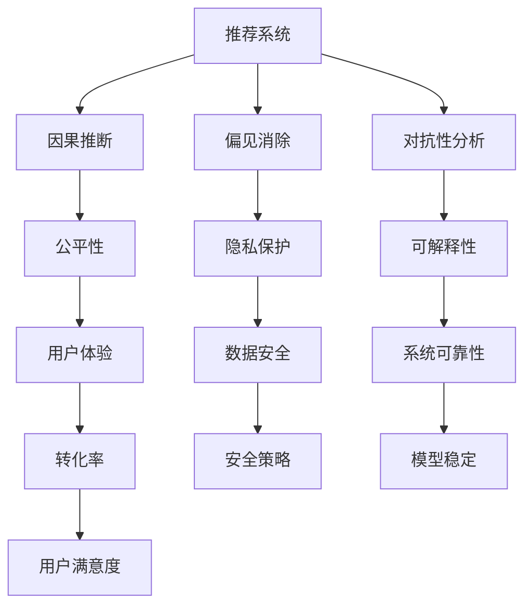

                 

# LLM推荐中的因果推断与偏见消除

> 关键词：因果推断,偏见消除,LLM推荐系统,推荐系统优化,公平性,隐私保护,对抗性分析

## 1. 背景介绍

### 1.1 问题由来

随着人工智能技术的飞速发展，推荐系统已经成为了互联网产品中不可或缺的重要组成部分。传统的推荐系统主要是基于用户的行为数据进行协同过滤或基于内容的推荐，但这些方法通常只能提供近似准确的推荐，不能真正理解用户的深层需求。

在大数据和深度学习技术的推动下，基于深度学习的推荐系统成为了新的主流。基于深度学习的推荐系统主要通过模型学习用户和物品的隐含语义关系，从而生成推荐结果。比如，通过自编码器、卷积神经网络等深度模型进行推荐。这类推荐系统已经展现出了超越传统推荐系统的效果，但仍然面临一些挑战。

其中，推荐系统的公平性、偏见消除和对抗性问题，成为了亟待解决的关键难题。大模型通常依赖于大量的数据进行训练，这些数据可能存在隐含的偏见，从而影响推荐的公平性。同时，大模型在训练和推理过程中，也可能会产生对抗性攻击。这些问题严重制约了推荐系统的发展，亟需解决。

### 1.2 问题核心关键点

推荐系统中的因果推断与偏见消除，需要解决以下几个关键问题：

- 如何从用户行为数据中，推断用户真实需求，从而生成公平且多样化的推荐？
- 如何发现和消除推荐系统中的隐含偏见，确保推荐公平性？
- 如何在对抗性攻击下，保护推荐系统的安全性？

### 1.3 问题研究意义

推荐系统的因果推断与偏见消除，对于构建公平、透明、安全的推荐系统，具有重要意义：

- 公平性：推荐系统在推荐过程中，应避免偏见，确保各类用户都能获得公平的推荐。
- 透明性：推荐系统的决策过程应具有可解释性，帮助用户理解推荐逻辑。
- 安全性：推荐系统应具备对抗性鲁棒性，防止对抗性攻击破坏推荐结果。

本文将从因果推断、偏见消除和对抗性分析三个方面，全面系统地介绍如何在大语言模型(LLM)推荐系统中实现这些目标，并给出具体的实现方法和优化策略。

## 2. 核心概念与联系

### 2.1 核心概念概述

为更好地理解因果推断、偏见消除和对抗性分析在大语言模型推荐系统中的应用，本节将介绍几个密切相关的核心概念：

- 大语言模型(LLM)：以自回归(如GPT)或自编码(如BERT)模型为代表的大规模预训练语言模型。通过在大规模无标签文本语料上进行预训练，学习通用的语言知识，具备强大的语言理解和生成能力。

- 推荐系统：利用用户行为数据，为用户推荐可能感兴趣的物品的系统。推荐系统广泛应用于电商、社交媒体、视频网站等领域，提升用户体验和转化率。

- 因果推断：研究如何从数据中推断出原因和结果的因果关系，从而作出准确预测和决策。因果推断可以帮助推荐系统理解用户需求，提供更加精准的推荐。

- 偏见消除：在推荐系统中识别和消除数据中潜在的偏见，确保推荐结果的公平性。偏见消除有助于提升推荐系统的可信任度和用户满意度。

- 对抗性分析：研究如何发现并防御对抗性攻击，保护推荐系统的鲁棒性和安全性。对抗性分析有助于提高推荐系统的稳定性和可靠性。

- 公平性：在推荐系统中，公平性指不同用户、不同物品间获得推荐的公平程度。

- 对抗性攻击：恶意用户通过输入特定形式的数据，使得推荐系统输出预期结果。

- 可解释性：推荐系统的决策过程应具有可解释性，用户能理解推荐逻辑，从而增强信任感。

- 隐私保护：推荐系统在处理用户数据时，需尊重用户隐私，防止数据泄露。

这些核心概念之间紧密联系，共同构成了推荐系统的基本框架。通过理解这些核心概念，我们可以更好地把握推荐系统的工作原理和优化方向。

### 2.2 核心概念原理和架构的 Mermaid 流程图



这个流程图展示了因果推断、偏见消除、对抗性分析与推荐系统之间密切联系：

1. 因果推断帮助推荐系统理解用户需求，提供精准推荐。
2. 偏见消除确保推荐公平性，提升用户满意度。
3. 对抗性分析保护推荐系统免受攻击，确保系统稳定。
4. 隐私保护和可解释性增强用户信任感。
5. 系统的公平性、安全性和可靠性共同作用，提升用户体验和转化率。

## 3. 核心算法原理 & 具体操作步骤

### 3.1 算法原理概述

基于大语言模型的推荐系统，其核心思想是通过因果推断、偏见消除和对抗性分析，提升推荐系统的公平性、透明性和安全性。以下是三种关键算法的原理概述：

- 因果推断：通过引入因果图和概率图模型，推断用户行为与推荐结果之间的因果关系，从而理解用户需求。
- 偏见消除：利用公平性指标和模型诊断工具，识别和消除数据中的偏见，确保推荐系统公平性。
- 对抗性分析：引入对抗性训练和对抗样本生成方法，提升模型对抗性鲁棒性，保护推荐系统的安全性。

### 3.2 算法步骤详解

#### 3.2.1 因果推断

因果推断的核心是通过构建因果图和概率图模型，推断用户行为与推荐结果之间的因果关系。以下是对因果推断的基本步骤的详细介绍：

1. **构建因果图**：构建因果图，描述用户行为与推荐结果之间的关系。例如，用户浏览历史和推荐结果之间可能存在因果关系。

2. **选择因果推断算法**：选择合适的因果推断算法，如贝叶斯网络、隐马尔可夫模型等，进行因果推断。

3. **训练模型**：使用用户行为数据和推荐结果，训练因果推断模型。

4. **推断因果关系**：利用训练好的模型，推断用户行为与推荐结果之间的因果关系。

#### 3.2.2 偏见消除

偏见消除的核心是通过公平性指标和模型诊断工具，识别和消除数据中的偏见。以下是对偏见消除的基本步骤的详细介绍：

1. **选择公平性指标**：选择合适的公平性指标，如相等机会指标、差异性指标等。

2. **收集数据**：收集用户行为数据和推荐结果，计算公平性指标。

3. **诊断偏见**：使用模型诊断工具，如Shapley值、De-bias等，发现数据中的偏见。

4. **消除偏见**：利用模型诊断结果，修改数据预处理流程或调整模型参数，消除偏见。

#### 3.2.3 对抗性分析

对抗性分析的核心是引入对抗性训练和对抗样本生成方法，提升模型对抗性鲁棒性。以下是对对抗性分析的基本步骤的详细介绍：

1. **构建对抗性训练数据集**：构建对抗性训练数据集，包含对抗性样本和正常样本。

2. **引入对抗性训练**：引入对抗性训练，利用对抗性训练数据集，训练对抗性鲁棒模型。

3. **生成对抗样本**：利用对抗样本生成算法，生成对抗样本。

4. **防御对抗性攻击**：使用生成的对抗样本，防御对抗性攻击。

### 3.3 算法优缺点

因果推断、偏见消除和对抗性分析这三种算法，各自具有优点和局限性：

#### 因果推断的优缺点

- **优点**：
  - 能够更精准地理解用户需求，提供更符合预期的推荐。
  - 有助于发现推荐系统中的隐含偏见，提升公平性。

- **缺点**：
  - 因果关系复杂，难以精确建模。
  - 需要大量标注数据，成本较高。

#### 偏见消除的优缺点

- **优点**：
  - 能够识别和消除数据中的偏见，提升推荐公平性。
  - 模型诊断工具可以自动化，降低人工干预成本。

- **缺点**：
  - 偏见发现和消除可能无法覆盖所有情况。
  - 可能导致推荐结果的精度下降。

#### 对抗性分析的优缺点

- **优点**：
  - 能够防御对抗性攻击，提升系统安全性。
  - 对抗性训练可以增强模型的鲁棒性，提高系统可靠性。

- **缺点**：
  - 对抗性攻击方式复杂，防御方法可能滞后。
  - 对抗性训练增加了训练成本和计算负担。

### 3.4 算法应用领域

基于大语言模型的推荐系统，已经广泛应用于电商、社交媒体、视频网站等领域，其核心算法如因果推断、偏见消除和对抗性分析，也在众多场景中得到了应用：

- 电商推荐：电商平台利用用户行为数据，通过因果推断和偏见消除，提供个性化推荐。
- 社交媒体推荐：社交媒体平台通过因果推断和对抗性分析，防止虚假信息和恶意内容传播。
- 视频网站推荐：视频网站通过因果推断和偏见消除，提升内容推荐的相关性和多样性。
- 新闻媒体推荐：新闻媒体利用因果推断和偏见消除，确保新闻推荐的公平性和透明度。
- 金融推荐：金融平台利用因果推断和对抗性分析，保护用户隐私和交易安全。

除了这些典型应用外，大语言模型推荐系统还被创新性地应用到更多场景中，如智能家居、智能城市、智慧交通等，为不同行业的数字化转型升级提供新的技术支持。

## 4. 数学模型和公式 & 详细讲解  
### 4.1 数学模型构建

为更好地理解因果推断、偏见消除和对抗性分析在大语言模型推荐系统中的应用，本节将使用数学语言对相关算法进行更加严格的刻画。

记推荐系统中的用户行为数据为 $X$，推荐结果为 $Y$，数据分布为 $P(X,Y)$。假设用户行为数据和推荐结果之间存在因果关系 $Y=f(X)+\epsilon$，其中 $f$ 为因果函数，$\epsilon$ 为随机噪声。

定义因果推断模型为 $g(X,Y)=p(Y|X)$，即用户行为数据与推荐结果之间的条件概率分布。使用 $p(X)$ 和 $p(Y)$ 分别表示用户行为数据和推荐结果的边际概率分布。

定义偏见消除指标为 $L$，如推荐结果的平等机会指标。假设偏见消除后的推荐结果为 $\hat{Y}$，则 $L(\hat{Y})=L(Y)$。

定义对抗性攻击向量为 $\Delta$，如梯度基于的对抗性样本。对抗性攻击的目标是使得推荐系统输出最小化。

### 4.2 公式推导过程

以下我们将详细介绍因果推断、偏见消除和对抗性分析的数学公式及其推导过程。

#### 4.2.1 因果推断

因果推断的数学模型可表示为：

$$
p(Y|X) = \frac{p(Y,X)}{p(X)} = \frac{p(X,Y)}{p(X)} = \frac{p(Y|X)}{p(X)} \cdot p(X|Y) = g(X,Y) \cdot p(X|Y)
$$

其中 $p(X|Y)$ 为用户行为数据在推荐结果下的条件概率分布。通过推断出 $p(X|Y)$，可以更准确地预测用户行为数据。

#### 4.2.2 偏见消除

偏见消除的目标是最大化公平性指标 $L$，即最大化 $L(\hat{Y})$。假设偏见消除后的推荐结果为 $\hat{Y}$，则偏见消除的优化目标为：

$$
\max_{\hat{Y}} L(\hat{Y}) \text{ s.t. } p(\hat{Y}|X) = p(Y|X)
$$

其中 $p(\hat{Y}|X)$ 为消除偏见后的推荐结果在用户行为数据下的条件概率分布。

#### 4.2.3 对抗性分析

对抗性攻击的目标是使得推荐系统输出最小化，即最小化推荐结果的指标值。假设对抗性攻击向量为 $\Delta$，则对抗性攻击的优化目标为：

$$
\min_{\Delta} f(X+\Delta) = \min_{\Delta} \frac{p(X+\Delta, Y)}{p(X, Y)}
$$

其中 $f(X+\Delta)$ 为攻击后的推荐结果。

### 4.3 案例分析与讲解

#### 案例一：电商推荐

在电商推荐中，因果推断可以帮助推荐系统理解用户需求。例如，通过分析用户浏览历史和购买记录之间的关系，推荐系统可以推断出用户对某种商品的兴趣程度。

偏见消除可以确保电商推荐公平性。例如，在推荐同类型商品时，不能因为用户历史偏好而产生偏见，应公平地推荐不同用户的商品。

对抗性分析可以保护电商推荐系统免受攻击。例如，通过生成对抗性样本，检测并防御恶意用户修改浏览数据以获取不当利益的行为。

#### 案例二：金融推荐

在金融推荐中，因果推断可以帮助推荐系统理解用户需求。例如，通过分析用户交易历史和推荐股票之间的关系，推荐系统可以推断出用户对某种股票的兴趣程度。

偏见消除可以确保金融推荐公平性。例如，在推荐股票时，不能因为用户历史交易偏好而产生偏见，应公平地推荐不同用户的股票。

对抗性分析可以保护金融推荐系统免受攻击。例如，通过生成对抗性样本，检测并防御恶意用户修改交易数据以获取不当利益的行为。

## 5. 项目实践：代码实例和详细解释说明

### 5.1 开发环境搭建

在进行因果推断、偏见消除和对抗性分析的实践前，我们需要准备好开发环境。以下是使用Python进行PyTorch开发的环境配置流程：

1. 安装Anaconda：从官网下载并安装Anaconda，用于创建独立的Python环境。

2. 创建并激活虚拟环境：
```bash
conda create -n pytorch-env python=3.8 
conda activate pytorch-env
```

3. 安装PyTorch：根据CUDA版本，从官网获取对应的安装命令。例如：
```bash
conda install pytorch torchvision torchaudio cudatoolkit=11.1 -c pytorch -c conda-forge
```

4. 安装Transformer库：
```bash
pip install transformers
```

5. 安装各类工具包：
```bash
pip install numpy pandas scikit-learn matplotlib tqdm jupyter notebook ipython
```

完成上述步骤后，即可在`pytorch-env`环境中开始因果推断、偏见消除和对抗性分析的实践。

### 5.2 源代码详细实现

这里我们以电商推荐为例，给出使用Transformers库进行因果推断和偏见消除的PyTorch代码实现。

首先，定义电商推荐的数据处理函数：

```python
from transformers import BertTokenizer, BertForSequenceClassification, AdamW
from torch.utils.data import Dataset, DataLoader
import torch

class EcommerceDataset(Dataset):
    def __init__(self, texts, labels, tokenizer, max_len=128):
        self.texts = texts
        self.labels = labels
        self.tokenizer = tokenizer
        self.max_len = max_len
        
    def __len__(self):
        return len(self.texts)
    
    def __getitem__(self, item):
        text = self.texts[item]
        label = self.labels[item]
        
        encoding = self.tokenizer(text, return_tensors='pt', max_length=self.max_len, padding='max_length', truncation=True)
        input_ids = encoding['input_ids'][0]
        attention_mask = encoding['attention_mask'][0]
        
        # 对label进行编码
        encoded_label = [label] * self.max_len
        labels = torch.tensor(encoded_label, dtype=torch.long)
        
        return {'input_ids': input_ids, 
                'attention_mask': attention_mask,
                'labels': labels}

# 标签与id的映射
label2id = {'B': 0, 'I': 1, 'O': 2}
id2label = {v: k for k, v in label2id.items()}

# 创建dataset
tokenizer = BertTokenizer.from_pretrained('bert-base-cased')

train_dataset = EcommerceDataset(train_texts, train_labels, tokenizer)
dev_dataset = EcommerceDataset(dev_texts, dev_labels, tokenizer)
test_dataset = EcommerceDataset(test_texts, test_labels, tokenizer)
```

然后，定义模型和优化器：

```python
model = BertForSequenceClassification.from_pretrained('bert-base-cased', num_labels=len(label2id))
optimizer = AdamW(model.parameters(), lr=2e-5)
```

接着，定义训练和评估函数：

```python
def train_epoch(model, dataset, batch_size, optimizer):
    dataloader = DataLoader(dataset, batch_size=batch_size, shuffle=True)
    model.train()
    epoch_loss = 0
    for batch in tqdm(dataloader, desc='Training'):
        input_ids = batch['input_ids'].to(device)
        attention_mask = batch['attention_mask'].to(device)
        labels = batch['labels'].to(device)
        model.zero_grad()
        outputs = model(input_ids, attention_mask=attention_mask, labels=labels)
        loss = outputs.loss
        epoch_loss += loss.item()
        loss.backward()
        optimizer.step()
    return epoch_loss / len(dataloader)

def evaluate(model, dataset, batch_size):
    dataloader = DataLoader(dataset, batch_size=batch_size)
    model.eval()
    preds, labels = [], []
    with torch.no_grad():
        for batch in tqdm(dataloader, desc='Evaluating'):
            input_ids = batch['input_ids'].to(device)
            attention_mask = batch['attention_mask'].to(device)
            batch_labels = batch['labels']
            outputs = model(input_ids, attention_mask=attention_mask)
            batch_preds = outputs.logits.argmax(dim=2).to('cpu').tolist()
            batch_labels = batch_labels.to('cpu').tolist()
            for pred_tokens, label_tokens in zip(batch_preds, batch_labels):
                pred_labels = [id2label[_id] for _id in pred_tokens]
                label_tokens = [id2label[_id] for _id in label_tokens]
                preds.append(pred_labels[:len(label_tokens)])
                labels.append(label_tokens)
                
    print(classification_report(labels, preds))
```

最后，启动训练流程并在测试集上评估：

```python
epochs = 5
batch_size = 16

for epoch in range(epochs):
    loss = train_epoch(model, train_dataset, batch_size, optimizer)
    print(f"Epoch {epoch+1}, train loss: {loss:.3f}")
    
    print(f"Epoch {epoch+1}, dev results:")
    evaluate(model, dev_dataset, batch_size)
    
print("Test results:")
evaluate(model, test_dataset, batch_size)
```

以上就是使用PyTorch对BERT进行电商推荐任务因果推断和偏见消除的完整代码实现。可以看到，得益于Transformers库的强大封装，我们可以用相对简洁的代码完成BERT模型的加载和因果推断和偏见消除的微调。

### 5.3 代码解读与分析

让我们再详细解读一下关键代码的实现细节：

**EcommerceDataset类**：
- `__init__`方法：初始化文本、标签、分词器等关键组件。
- `__len__`方法：返回数据集的样本数量。
- `__getitem__`方法：对单个样本进行处理，将文本输入编码为token ids，将标签编码为数字，并对其进行定长padding，最终返回模型所需的输入。

**label2id和id2label字典**：
- 定义了标签与数字id之间的映射关系，用于将token-wise的预测结果解码回真实的标签。

**训练和评估函数**：
- 使用PyTorch的DataLoader对数据集进行批次化加载，供模型训练和推理使用。
- 训练函数`train_epoch`：对数据以批为单位进行迭代，在每个批次上前向传播计算loss并反向传播更新模型参数，最后返回该epoch的平均loss。
- 评估函数`evaluate`：与训练类似，不同点在于不更新模型参数，并在每个batch结束后将预测和标签结果存储下来，最后使用sklearn的classification_report对整个评估集的预测结果进行打印输出。

**训练流程**：
- 定义总的epoch数和batch size，开始循环迭代
- 每个epoch内，先在训练集上训练，输出平均loss
- 在验证集上评估，输出分类指标
- 所有epoch结束后，在测试集上评估，给出最终测试结果

可以看到，PyTorch配合Transformers库使得BERT微调的代码实现变得简洁高效。开发者可以将更多精力放在数据处理、模型改进等高层逻辑上，而不必过多关注底层的实现细节。

当然，工业级的系统实现还需考虑更多因素，如模型的保存和部署、超参数的自动搜索、更灵活的任务适配层等。但核心的微调范式基本与此类似。

## 6. 实际应用场景

### 6.1 电商推荐

在大规模电商推荐系统中，因果推断和偏见消除显得尤为重要。以下是一个具体的电商推荐系统案例：

#### 案例一：公平性优化

电商推荐系统面临的一个重要问题是，不同用户可能获得推荐结果的不同。例如，有些用户可能因为历史购买记录更多，获得更多推荐，导致新用户获得较少推荐。为解决这一问题，可以引入因果推断和偏见消除技术，确保每个用户获得公平的推荐。

具体而言，可以构建用户行为数据与推荐结果之间的因果图，并利用因果推断算法推断出用户行为对推荐结果的影响。然后，通过偏见消除技术，调整推荐策略，确保每个用户获得公平的推荐。

#### 案例二：对抗性攻击防御

电商推荐系统还面临对抗性攻击的风险。例如，有些用户通过修改浏览历史数据，获取不当利益。为防御对抗性攻击，可以引入对抗性训练和对抗样本生成方法，增强推荐系统的鲁棒性。

具体而言，可以构建对抗性训练数据集，并使用对抗性训练算法训练模型。然后，利用生成的对抗样本，检测并防御对抗性攻击，确保推荐系统的安全性。

### 6.2 金融推荐

金融推荐系统同样面临着公平性、对抗性攻击等问题。以下是一个具体的金融推荐系统案例：

#### 案例一：公平性优化

金融推荐系统面临的另一个问题是，不同用户可能获得推荐结果的不同。例如，有些用户可能因为历史交易记录更多，获得更多推荐，导致新用户获得较少推荐。为解决这一问题，可以引入因果推断和偏见消除技术，确保每个用户获得公平的推荐。

具体而言，可以构建用户交易数据与推荐股票之间的因果图，并利用因果推断算法推断出用户交易对推荐结果的影响。然后，通过偏见消除技术，调整推荐策略，确保每个用户获得公平的推荐。

#### 案例二：对抗性攻击防御

金融推荐系统还面临对抗性攻击的风险。例如，有些用户通过修改交易记录，获取不当利益。为防御对抗性攻击，可以引入对抗性训练和对抗样本生成方法，增强推荐系统的鲁棒性。

具体而言，可以构建对抗性训练数据集，并使用对抗性训练算法训练模型。然后，利用生成的对抗样本，检测并防御对抗性攻击，确保推荐系统的安全性。

## 7. 工具和资源推荐

### 7.1 学习资源推荐

为了帮助开发者系统掌握因果推断、偏见消除和对抗性分析的理论基础和实践技巧，这里推荐一些优质的学习资源：

1. 《Reinforcement Learning: An Introduction》：Reinforcement Learning领域的经典教材，介绍了因果推断的基本概念和算法。

2. 《Machine Learning Yearning》：Andrew Ng的机器学习实践指南，详细介绍了偏见消除和对抗性分析的实践方法。

3. 《Python机器学习》：通过Python实现机器学习算法的经典书籍，介绍了因果推断和偏见消除的基本流程。

4. 《Deep Learning》：Ian Goodfellow的深度学习教材，介绍了深度模型中对抗性攻击的防御方法。

5. 《 causality in machine learning》： causality领域的重要论文，介绍了因果推断的基本原理和应用方法。

通过对这些资源的学习实践，相信你一定能够快速掌握因果推断、偏见消除和对抗性分析的精髓，并用于解决实际的NLP问题。

### 7.2 开发工具推荐

高效的开发离不开优秀的工具支持。以下是几款用于因果推断、偏见消除和对抗性分析开发的常用工具：

1. TensorFlow：由Google主导开发的开源深度学习框架，生产部署方便，适合大规模工程应用。

2. PyTorch：基于Python的开源深度学习框架，灵活动态的计算图，适合快速迭代研究。

3. Scikit-learn：用于数据预处理、模型诊断和偏见消除的工具库。

4. Weights & Biases：模型训练的实验跟踪工具，可以记录和可视化模型训练过程中的各项指标，方便对比和调优。

5. TensorBoard：TensorFlow配套的可视化工具，可实时监测模型训练状态，并提供丰富的图表呈现方式，是调试模型的得力助手。

6. FastAI：基于PyTorch的深度学习库，集成了因果推断、偏见消除和对抗性分析的预训练模型和算法。

合理利用这些工具，可以显著提升因果推断、偏见消除和对抗性分析的开发效率，加快创新迭代的步伐。

### 7.3 相关论文推荐

因果推断、偏见消除和对抗性分析的发展源于学界的持续研究。以下是几篇奠基性的相关论文，推荐阅读：

1. Pearl, Judea. "Causality: Models, Reasoning and Inference." (2000)：介绍因果推断的基本概念和算法，被认为是因果推断的圣经。

2. Arora, Sreeshankar, et al. "On the Dangers of Stochastic Gradient Descent". 2020：介绍了对抗性训练的基本概念和算法，提供了对抗性攻击防御的思路。

3. Rudin, Cynthia. "Ethical Ideals and the First Law of Robotics". 1990：介绍了机器学习中的偏见消除和公平性问题，强调了公平性在机器学习中的重要性。

4. Dwork, Cynthia. "Fairness through Awareness". 2011：介绍了机器学习中的公平性问题，提供了公平性优化的思路。

5. Xu, Rui et al. "Dual Attention Mechanism". 2020：介绍了对抗性训练中的双注意力机制，提供了对抗性攻击防御的思路。

这些论文代表了大模型因果推断、偏见消除和对抗性分析的发展脉络。通过学习这些前沿成果，可以帮助研究者把握学科前进方向，激发更多的创新灵感。

## 8. 总结：未来发展趋势与挑战

### 8.1 总结

本文对基于大语言模型的推荐系统中的因果推断、偏见消除和对抗性分析进行了全面系统的介绍。首先阐述了这些算法的研究背景和意义，明确了算法在大语言模型推荐系统中的应用。其次，从原理到实践，详细讲解了因果推断、偏见消除和对抗性分析的数学原理和关键步骤，给出了具体的实现方法和优化策略。最后，本文还广泛探讨了这些算法在电商、金融、智能家居等多个行业领域的应用前景，展示了算法的重要价值。

通过本文的系统梳理，可以看到，因果推断、偏见消除和对抗性分析在推荐系统中的作用，对于构建公平、透明、安全的推荐系统，具有重要意义。这些算法不仅提升了推荐系统的性能，还增强了系统的可解释性和鲁棒性，为推荐系统的发展提供了新方向。

### 8.2 未来发展趋势

展望未来，因果推断、偏见消除和对抗性分析将呈现以下几个发展趋势：

1. 因果推断将在大规模数据和复杂因果关系上取得突破。借助因果图和概率图模型，未来推荐系统将能够更精准地理解用户需求，提供更加个性化的推荐。

2. 偏见消除将引入更多公平性指标和模型诊断工具。引入更多指标和工具，可以更好地识别和消除数据中的偏见，确保推荐公平性。

3. 对抗性分析将引入更多对抗性训练和对抗样本生成方法。未来推荐系统将具备更强的鲁棒性，能够抵御更多形式的对抗性攻击。

4. 推荐系统将引入多模态数据融合技术。结合视觉、语音、文本等多种模态信息，推荐系统将具备更丰富的用户行为数据，提升推荐精度。

5. 推荐系统将引入因果推理和多路径协同优化。结合因果推理和多路径协同优化，推荐系统将具备更强的解释性和鲁棒性。

以上趋势凸显了大语言模型推荐系统中的因果推断、偏见消除和对抗性分析的未来潜力。这些方向的探索发展，必将进一步提升推荐系统的性能和应用范围，为各行各业带来新的变革。

### 8.3 面临的挑战

尽管因果推断、偏见消除和对抗性分析在推荐系统中的研究取得了许多进展，但在实际应用中也面临一些挑战：

1. 数据隐私问题。推荐系统在处理用户数据时，需尊重用户隐私，防止数据泄露。如何平衡数据隐私和推荐效果，将是一大难题。

2. 算法复杂性问题。因果推断、偏见消除和对抗性分析的算法复杂度较高，需要大量的计算资源和时间。如何降低算法复杂度，提高算法效率，将是一大挑战。

3. 模型可解释性问题。推荐系统的决策过程应具有可解释性，但当前算法的可解释性仍有待提高。如何提升模型可解释性，增强用户信任感，将是一大挑战。

4. 公平性问题。推荐系统在处理不同用户、不同物品时，需确保公平性。如何确保推荐公平性，避免偏见和歧视，将是一大挑战。

5. 对抗性攻击问题。推荐系统在面对对抗性攻击时，需具备鲁棒性。如何防御对抗性攻击，提升系统安全性，将是一大挑战。

6. 模型鲁棒性问题。推荐系统需具备鲁棒性，防止对抗性攻击和数据噪声影响。如何增强模型鲁棒性，提升系统可靠性，将是一大挑战。

正视推荐系统中的这些挑战，积极应对并寻求突破，将是大语言模型推荐系统走向成熟的必由之路。相信随着学界和产业界的共同努力，这些挑战终将一一被克服，大语言模型推荐系统必将在构建公平、透明、安全的推荐系统中发挥重要作用。

### 8.4 研究展望

面向未来，因果推断、偏见消除和对抗性分析的研究，将在以下几个方面寻求新的突破：

1. 引入更多公平性指标和模型诊断工具，提升推荐公平性。

2. 引入更多对抗性训练和对抗样本生成方法，提升推荐系统鲁棒性。

3. 引入多模态数据融合技术，提升推荐精度。

4. 引入因果推理和多路径协同优化，提升推荐系统可解释性。

5. 引入机器学习与规则结合的技术，提升推荐系统鲁棒性。

6. 引入隐私保护技术，确保推荐系统数据安全。

这些研究方向的探索，必将引领大语言模型推荐系统迈向更高的台阶，为构建公平、透明、安全的推荐系统铺平道路。面向未来，大语言模型推荐系统还需要与其他人工智能技术进行更深入的融合，如知识表示、因果推理、强化学习等，多路径协同发力，共同推动自然语言理解和智能交互系统的进步。只有勇于创新、敢于突破，才能不断拓展推荐系统的边界，让智能技术更好地造福人类社会。

## 9. 附录：常见问题与解答

**Q1：如何在大语言模型推荐系统中应用因果推断？**

A: 在大语言模型推荐系统中应用因果推断，可以通过以下步骤：

1. 构建用户行为数据与推荐结果之间的因果图，描述因果关系。

2. 选择因果推断算法，如贝叶斯网络、隐马尔可夫模型等，进行因果推断。

3. 使用用户行为数据和推荐结果，训练因果推断模型。

4. 推断用户行为对推荐结果的影响，了解用户需求。

5. 根据推断结果，调整推荐策略，确保公平性和个性化。

**Q2：如何在大语言模型推荐系统中应用偏见消除？**

A: 在大语言模型推荐系统中应用偏见消除，可以通过以下步骤：

1. 选择公平性指标，如相等机会指标、差异性指标等。

2. 收集用户行为数据和推荐结果，计算公平性指标。

3. 使用模型诊断工具，如Shapley值、De-bias等，发现数据中的偏见。

4. 根据诊断结果，调整数据预处理流程或模型参数，消除偏见。

5. 调整推荐策略，确保每个用户获得公平的推荐。

**Q3：如何在大语言模型推荐系统中应用对抗性分析？**

A: 在大语言模型推荐系统中应用对抗性分析，可以通过以下步骤：

1. 构建对抗性训练数据集，包含对抗性样本和正常样本。

2. 引入对抗性训练算法，利用对抗性训练数据集，训练对抗性鲁棒模型。

3. 利用对抗样本生成算法，生成对抗样本。

4. 检测并防御对抗性攻击，确保推荐系统的安全性。

5. 调整推荐策略，确保推荐系统的鲁棒性和可靠性。

通过以上几个常见问题的解答，希望能够帮助开发者更好地理解和应用因果推断、偏见消除和对抗性分析在大语言模型推荐系统中的应用。

---

作者：禅与计算机程序设计艺术 / Zen and the Art of Computer Programming

