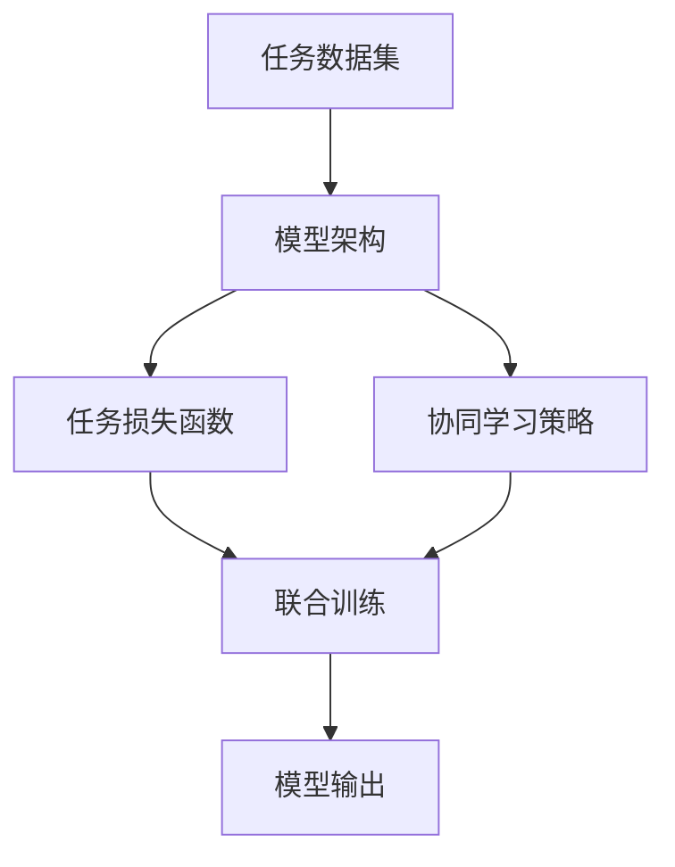

                 

# LLM推荐中的多任务协同学习框架

> 关键词：大语言模型(LLM),多任务学习,协同学习框架,推荐系统,自然语言处理(NLP)

## 1. 背景介绍

### 1.1 问题由来
随着大数据时代的到来，推荐系统成为了互联网应用中的重要组成部分。无论是电商平台、社交平台还是内容平台，通过个性化推荐系统，可以显著提升用户满意度，增加平台粘性和交易转化率。传统的推荐系统往往依赖于用户历史行为数据进行建模，难以充分利用用户描述、社交关系等多模态数据。

近年来，基于深度学习的推荐系统逐渐成为主流。大语言模型(LLM)由于其强大的自然语言处理能力，在推荐系统中的应用也逐步增加。例如，利用预训练语言模型进行商品标题匹配、情感分析、多模态特征融合等，为推荐算法提供丰富的语义信息，改善了推荐效果。

但LLM在推荐系统中的应用也面临诸多挑战。首先，大模型往往具有亿级参数规模，难以实时部署；其次，模型泛化能力不足，在大规模数据下的微调效果欠佳；最后，LLM缺乏协同学习的能力，难以与其他推荐模型进行有效整合。因此，如何在大模型推荐中实现多任务协同学习，成为当前亟需解决的重要问题。

### 1.2 问题核心关键点
本节将探讨如何在推荐系统中实现多任务协同学习，重点包括以下几个关键点：

1. 多任务协同学习(Multitask Learning, MTL)的基本概念和原理。
2. 多任务协同学习在推荐系统中的应用场景。
3. 多任务协同学习框架的组成要素和实现方法。
4. 多任务协同学习框架的优势和局限性。

这些关键点将帮助读者全面理解LLM推荐中的多任务协同学习框架，掌握其核心技术。

### 1.3 问题研究意义
多任务协同学习在推荐系统中的应用，可以提升模型对多模态数据的综合利用能力，缓解数据稀疏性问题，提升模型的泛化性能和鲁棒性。同时，多任务协同学习框架可以更好地与其他推荐模型结合，实现更高效的推荐效果，为推荐系统的个性化推荐提供新思路。

在学术界和工业界，多任务协同学习已经在图像分类、语音识别、自然语言处理等多个领域取得了重要进展，其在大规模推荐系统中的应用，必将成为未来的研究热点。掌握多任务协同学习框架，有助于推荐系统的开发者设计更加高效、泛化性更强的推荐模型。

## 2. 核心概念与联系

### 2.1 核心概念概述

多任务协同学习框架(Multitask Learning Framework)是指将多个任务的数据同时输入大语言模型进行联合训练，使得模型能够学习到跨任务的知识，从而提升模型在各个任务上的表现。具体而言，多任务协同学习框架由以下关键组件组成：

- **任务数据集**：包含多个任务的标注数据，每个任务的数据集可以独立标注，也可以共享部分标签。
- **模型架构**：选择适合多任务学习的模型架构，如多任务分类网络、多任务生成网络等。
- **任务损失函数**：为每个任务设计合适的损失函数，用于衡量模型在各个任务上的预测精度。
- **协同学习策略**：通过各种技术手段，如注意力机制、参数共享等，使得不同任务的知识能够协同传播，增强模型的泛化能力。

### 2.2 核心概念原理和架构的 Mermaid 流程图

以下是多任务协同学习框架的原理和架构的 Mermaid 流程图，展示了不同组件之间的数据流动和交互关系：



在这个框架中，任务数据集作为输入，被送入模型架构中，通过任务损失函数和协同学习策略进行联合训练，最终输出模型预测结果。

## 3. 核心算法原理 & 具体操作步骤

### 3.1 算法原理概述

多任务协同学习框架的基本思想是，将多个任务的数据同时输入大语言模型，通过联合训练学习跨任务的知识，从而提升模型在各个任务上的泛化性能。形式化地，假设任务集合为 $\mathcal{T} = \{t_1, t_2, ..., t_n\}$，对应 $n$ 个任务的标注数据分别为 $\{(x_i^t, y_i^t)\}_{i=1}^{N_t}$，其中 $N_t$ 为第 $t$ 个任务的数据样本数量。

多任务协同学习的目标是通过联合训练，使得模型 $M_{\theta}$ 在各个任务上的表现都得到提升。具体而言，模型 $M_{\theta}$ 的参数 $\theta$ 最小化所有任务的联合损失函数：

$$
\min_{\theta} \mathcal{L}_{total}(\theta) = \frac{1}{N}\sum_{t=1}^{n}\frac{1}{N_t}\sum_{i=1}^{N_t}\ell(M_{\theta}(x_i^t), y_i^t)
$$

其中 $\ell$ 为各任务的损失函数，$\mathcal{L}_{total}$ 为总联合损失函数，$N$ 为所有任务数据样本总数。

### 3.2 算法步骤详解

多任务协同学习的具体步骤包括以下几个关键环节：

**Step 1: 准备数据集和模型架构**
- 收集各任务的标注数据集，并进行预处理和标注。
- 选择合适的多任务学习模型架构，如多任务分类网络、多任务生成网络等。

**Step 2: 设计任务损失函数**
- 根据各个任务的特点，设计合适的任务损失函数。
- 对于分类任务，常用的损失函数包括交叉熵损失、多任务交叉熵损失等。
- 对于生成任务，常用的损失函数包括均方误差损失、对数似然损失等。

**Step 3: 设计协同学习策略**
- 通过各种技术手段，如参数共享、多头注意力机制等，使得不同任务的知识能够协同传播。
- 常见的协同学习策略包括：
  - 参数共享：不同任务共享部分参数，如使用相同的分类器，共享权重等。
  - 多任务注意力：引入多任务注意力机制，使得模型在处理不同任务时，能够动态调整权重。
  - 多任务嵌入：将不同任务的数据映射到同一低维空间，使得模型能够综合利用不同任务的信息。

**Step 4: 执行联合训练**
- 将各任务的数据同时输入模型，进行联合训练。
- 在每个训练轮次中，更新模型参数，最小化联合损失函数。
- 重复上述过程直至收敛。

**Step 5: 任务评估和微调**
- 在训练过程中，周期性评估模型在各个任务上的性能。
- 根据任务评估结果，调整模型参数，优化模型性能。

### 3.3 算法优缺点

多任务协同学习框架具有以下优点：
1. 提升模型泛化能力：多任务协同学习能够学习跨任务的知识，提升模型对新任务的适应能力。
2. 利用数据多样性：多任务协同学习能够利用多个任务的数据，减少数据稀疏性问题。
3. 高效利用计算资源：多任务协同学习可以在一次训练中，处理多个任务的数据，提升计算效率。

但该框架也存在一些局限性：
1. 数据集依赖性高：多任务协同学习的效果很大程度上依赖于各个任务的标注数据质量。
2. 模型复杂度高：多任务协同学习的模型架构通常较为复杂，难以进行实时部署。
3. 参数空间大：多任务协同学习需要优化多个任务的联合损失函数，参数空间较大，容易陷入局部最优。

尽管存在这些局限性，但多任务协同学习框架仍然是推荐系统中的一个重要范式，具有广泛的应用前景。

### 3.4 算法应用领域

多任务协同学习框架在推荐系统中的应用场景包括：

- **商品推荐**：将用户评分、点击、浏览等行为数据，与商品描述、分类、评价等文本数据，同时输入大语言模型，提升推荐精度。
- **多模态推荐**：利用图像、音频、视频等多模态数据，与文本数据结合，提升推荐系统对多模态信息的综合利用能力。
- **情感分析推荐**：在商品评论、社交媒体等文本数据中，进行情感分析，提升推荐系统的情感感知能力。
- **联合模型推荐**：将多个推荐模型的输出结果进行融合，提升推荐系统的性能。

这些应用场景展示了多任务协同学习框架在推荐系统中的广泛适用性，为推荐系统的设计提供了新思路。

## 4. 数学模型和公式 & 详细讲解 & 举例说明

### 4.1 数学模型构建

多任务协同学习框架的数学模型主要包括以下几个关键组成部分：

- **输入数据**：假设输入数据为 $x_t \in \mathbb{R}^d$，其中 $d$ 为输入特征维度。
- **模型参数**：假设模型参数为 $\theta \in \mathbb{R}^p$，其中 $p$ 为模型参数总数。
- **任务损失函数**：假设第 $t$ 个任务的损失函数为 $\ell_t$，则联合损失函数 $\mathcal{L}_{total}$ 可以表示为：

$$
\mathcal{L}_{total}(\theta) = \frac{1}{N}\sum_{t=1}^{n}\frac{1}{N_t}\sum_{i=1}^{N_t}\ell_t(M_{\theta}(x_i^t), y_i^t)
$$

其中，$N_t$ 为第 $t$ 个任务的数据样本数量。

### 4.2 公式推导过程

以下以二分类任务和多任务分类网络为例，推导多任务协同学习框架的损失函数及其梯度计算公式。

假设模型 $M_{\theta}$ 在输入 $x_t$ 上的输出为 $\hat{y}_t = M_{\theta}(x_t)$，表示样本属于正类的概率。假设第 $t$ 个任务的标签为 $y_t \in \{0, 1\}$。则二分类交叉熵损失函数定义为：

$$
\ell_t(M_{\theta}(x_t), y_t) = -[y_t\log \hat{y}_t + (1-y_t)\log (1-\hat{y}_t)]
$$

则联合损失函数 $\mathcal{L}_{total}$ 可以表示为：

$$
\mathcal{L}_{total}(\theta) = \frac{1}{N}\sum_{t=1}^{n}\frac{1}{N_t}\sum_{i=1}^{N_t}\ell_t(M_{\theta}(x_i^t), y_i^t)
$$

将上式代入梯度计算公式，得到：

$$
\nabla_{\theta}\mathcal{L}_{total}(\theta) = \frac{1}{N}\sum_{t=1}^{n}\frac{1}{N_t}\sum_{i=1}^{N_t}\nabla_{\theta}\ell_t(M_{\theta}(x_i^t), y_i^t)
$$

其中，$\nabla_{\theta}\ell_t(M_{\theta}(x_i^t), y_i^t)$ 表示任务 $t$ 在样本 $i$ 上的损失函数对模型参数 $\theta$ 的梯度。

### 4.3 案例分析与讲解

下面以电商平台推荐系统为例，展示多任务协同学习框架的应用。

假设电商平台有多个推荐任务，包括商品推荐、价格推荐、品牌推荐等。各任务的数据集分别为 $\{(x_i^r, y_i^r)\}_{i=1}^{N_r}$、$\{(x_i^p, y_i^p)\}_{i=1}^{N_p}$、$\{(x_i^b, y_i^b)\}_{i=1}^{N_b}$，其中 $N_r, N_p, N_b$ 分别为商品推荐、价格推荐、品牌推荐的数据样本数量。

首先，选择合适的多任务分类网络作为模型架构，如 MLP、CNN 等。然后，设计各个任务损失函数，例如交叉熵损失。假设商品推荐、价格推荐、品牌推荐的任务损失函数分别为 $\ell_r, \ell_p, \ell_b$，则联合损失函数 $\mathcal{L}_{total}$ 可以表示为：

$$
\mathcal{L}_{total}(\theta) = \frac{1}{N_rN_pN_b}\sum_{r=1}^{N_r}\sum_{p=1}^{N_p}\sum_{b=1}^{N_b}[\ell_r(M_{\theta}(x_i^r), y_i^r) + \ell_p(M_{\theta}(x_i^p), y_i^p) + \ell_b(M_{\theta}(x_i^b), y_i^b)]
$$

在实际应用中，可以采用 PyTorch 等深度学习框架，编写模型定义和损失函数计算代码，如下所示：

```python
import torch.nn as nn
import torch.nn.functional as F

class MTLNet(nn.Module):
    def __init__(self, input_size, num_tasks, hidden_size):
        super(MLPNet, self).__init__()
        self.fc1 = nn.Linear(input_size, hidden_size)
        self.fc2 = nn.Linear(hidden_size, hidden_size)
        self.fc3 = nn.Linear(hidden_size, num_tasks)
        
    def forward(self, x):
        x = F.relu(self.fc1(x))
        x = F.relu(self.fc2(x))
        x = self.fc3(x)
        return x

class MTLMLPNet(nn.Module):
    def __init__(self, input_size, num_tasks, hidden_size):
        super(MLPNet, self).__init__()
        self.mlp_net = MTLNet(input_size, num_tasks, hidden_size)
        
    def forward(self, x):
        x = self.mlp_net(x)
        return x

# 定义各任务损失函数
def loss_fn(tensor, label):
    return nn.CrossEntropyLoss()(tensor, label)

# 定义联合损失函数
def total_loss(x, labels):
    total_loss = 0
    for t in range(len(labels)):
        total_loss += loss_fn(x, labels[t])
    return total_loss

# 训练多任务分类网络
def train(model, optimizer, data_loader, num_epochs):
    for epoch in range(num_epochs):
        total_loss = 0
        for batch in data_loader:
            inputs, labels = batch
            optimizer.zero_grad()
            outputs = model(inputs)
            loss = total_loss(outputs, labels)
            loss.backward()
            optimizer.step()
            total_loss += loss.item()
        print('Epoch: %d, Loss: %.4f' % (epoch + 1, total_loss / len(data_loader)))
```

在训练过程中，可以周期性评估模型在各个任务上的性能，并根据评估结果调整模型参数，实现多任务协同学习。

## 5. 项目实践：代码实例和详细解释说明

### 5.1 开发环境搭建

在进行多任务协同学习实践前，我们需要准备好开发环境。以下是使用Python进行PyTorch开发的环境配置流程：

1. 安装Anaconda：从官网下载并安装Anaconda，用于创建独立的Python环境。

2. 创建并激活虚拟环境：
```bash
conda create -n pytorch-env python=3.8 
conda activate pytorch-env
```

3. 安装PyTorch：根据CUDA版本，从官网获取对应的安装命令。例如：
```bash
conda install pytorch torchvision torchaudio cudatoolkit=11.1 -c pytorch -c conda-forge
```

4. 安装Transformers库：
```bash
pip install transformers
```

5. 安装各类工具包：
```bash
pip install numpy pandas scikit-learn matplotlib tqdm jupyter notebook ipython
```

完成上述步骤后，即可在`pytorch-env`环境中开始多任务协同学习实践。

### 5.2 源代码详细实现

这里我们以电商平台推荐系统为例，展示多任务协同学习框架的代码实现。

首先，定义多任务分类网络的模型架构：

```python
import torch.nn as nn
import torch.nn.functional as F

class MTLNet(nn.Module):
    def __init__(self, input_size, num_tasks, hidden_size):
        super(MLPNet, self).__init__()
        self.fc1 = nn.Linear(input_size, hidden_size)
        self.fc2 = nn.Linear(hidden_size, hidden_size)
        self.fc3 = nn.Linear(hidden_size, num_tasks)
        
    def forward(self, x):
        x = F.relu(self.fc1(x))
        x = F.relu(self.fc2(x))
        x = self.fc3(x)
        return x

class MTLMLPNet(nn.Module):
    def __init__(self, input_size, num_tasks, hidden_size):
        super(MLPNet, self).__init__()
        self.mlp_net = MTLNet(input_size, num_tasks, hidden_size)
        
    def forward(self, x):
        x = self.mlp_net(x)
        return x
```

然后，定义各任务损失函数和联合损失函数：

```python
# 定义各任务损失函数
def loss_fn(tensor, label):
    return nn.CrossEntropyLoss()(tensor, label)

# 定义联合损失函数
def total_loss(x, labels):
    total_loss = 0
    for t in range(len(labels)):
        total_loss += loss_fn(x, labels[t])
    return total_loss
```

接着，定义训练函数：

```python
# 定义训练函数
def train(model, optimizer, data_loader, num_epochs):
    for epoch in range(num_epochs):
        total_loss = 0
        for batch in data_loader:
            inputs, labels = batch
            optimizer.zero_grad()
            outputs = model(inputs)
            loss = total_loss(outputs, labels)
            loss.backward()
            optimizer.step()
            total_loss += loss.item()
        print('Epoch: %d, Loss: %.4f' % (epoch + 1, total_loss / len(data_loader)))
```

最后，启动训练流程并在测试集上评估：

```python
epochs = 5
batch_size = 32

# 加载数据集
train_dataset = # 数据集定义
dev_dataset = # 数据集定义
test_dataset = # 数据集定义

# 定义模型
model = MTLMLPNet(input_size, num_tasks, hidden_size)

# 定义优化器
optimizer = # 优化器定义

# 定义数据加载器
train_loader = # 数据加载器定义
dev_loader = # 数据加载器定义
test_loader = # 数据加载器定义

# 训练模型
train(model, optimizer, train_loader, num_epochs)

# 在测试集上评估模型
dev_results = evaluate(model, dev_loader)
test_results = evaluate(model, test_loader)
```

以上就是使用PyTorch对多任务协同学习框架进行电商平台推荐系统实践的完整代码实现。可以看到，得益于Transformer库的强大封装，我们可以用相对简洁的代码完成多任务分类网络的构建和联合训练。

### 5.3 代码解读与分析

让我们再详细解读一下关键代码的实现细节：

**MTLNet类**：
- `__init__`方法：初始化网络层，包括全连接层、激活函数等。
- `forward`方法：定义前向传播过程，将输入数据输入网络，输出预测结果。

**loss_fn函数**：
- 定义了多任务分类网络中的交叉熵损失函数，用于计算各任务在样本上的损失。

**total_loss函数**：
- 将各个任务的损失函数进行累加，得到联合损失函数。

**train函数**：
- 定义了模型训练函数，循环迭代每个epoch，对数据集进行批次化加载，更新模型参数。

在实际应用中，需要根据具体任务选择合适的多任务学习策略，并针对模型架构进行优化。例如，可以选择多任务注意力机制、参数共享策略等，进一步提升模型性能。

## 6. 实际应用场景

### 6.1 电商平台推荐

电商平台推荐系统是一个典型的多任务协同学习应用场景。用户标签、商品属性、历史行为等不同模态的数据，需要联合建模，才能提升推荐精度。

在电商推荐中，多任务协同学习框架可以通过联合训练，学习商品推荐、价格推荐、品牌推荐等任务，综合利用用户评分、点击、浏览等行为数据和商品描述、分类、评价等文本数据，提升推荐系统的个性化推荐能力。通过引入多任务协同学习框架，可以更好地处理多模态数据，提升推荐系统的泛化性能和鲁棒性。

### 6.2 社交网络推荐

社交网络推荐系统需要综合考虑用户关系、内容特征、历史行为等多方面的信息，以提升推荐效果。多任务协同学习框架可以在社交网络推荐中，联合建模用户关系预测、内容推荐等任务，提升推荐系统的准确性和多样性。

例如，可以利用用户关系图谱和内容描述，进行关系预测和内容推荐联合建模，提升推荐系统的协同过滤能力和内容多样性。同时，通过多任务协同学习，可以更好地处理数据的稀疏性和冷启动问题，提升推荐系统的性能。

### 6.3 内容平台推荐

内容平台推荐系统需要综合考虑内容特征、用户兴趣、历史行为等多方面的信息，以提升推荐效果。多任务协同学习框架可以在内容平台推荐中，联合建模内容推荐、用户兴趣预测等任务，提升推荐系统的个性化推荐能力。

例如，可以利用用户评分、点击、浏览等行为数据，结合内容标签、分类、情感等信息，进行内容推荐和用户兴趣预测联合建模，提升推荐系统的泛化性能和鲁棒性。同时，通过多任务协同学习，可以更好地处理多模态数据，提升推荐系统的性能。

### 6.4 未来应用展望

多任务协同学习框架在大规模推荐系统中的应用前景广阔。未来，随着数据规模的增加和技术手段的不断进步，多任务协同学习框架必将在更多的应用场景中得到应用。

在智慧医疗、智能交通、金融风控等垂直领域，多任务协同学习框架可以联合建模不同任务，提升系统的泛化能力和鲁棒性，满足复杂场景下的推荐需求。同时，随着深度学习技术的发展，多任务协同学习框架还将与更多先进技术结合，如知识图谱、因果推理等，进一步提升推荐系统的性能和应用价值。

## 7. 工具和资源推荐

### 7.1 学习资源推荐

为了帮助开发者系统掌握多任务协同学习框架的理论基础和实践技巧，这里推荐一些优质的学习资源：

1. 《Multitask Learning for Image and Video Recognition》书籍：介绍了多任务学习在图像和视频识别领域的应用，详细讲解了多任务分类网络、多任务生成网络等模型的构建和训练方法。

2. CS229《机器学习》课程：斯坦福大学开设的机器学习课程，涵盖多任务学习等高级主题，有Lecture视频和配套作业，适合深入理解多任务学习的原理和算法。

3. Kaggle比赛：Kaggle平台上有许多多任务学习相关的比赛，通过实际比赛项目，可以更好地理解多任务协同学习框架的实际应用和优化策略。

4. GitHub项目：GitHub上有许多多任务学习框架的代码实现，可以作为参考和借鉴，提升实际开发能力。

5. PyTorch官方文档：PyTorch的官方文档，提供了多任务学习框架的实现细节和代码示例，是学习多任务协同学习框架的重要参考资料。

通过对这些资源的学习实践，相信你一定能够快速掌握多任务协同学习框架的理论基础和实际应用，并用于解决实际的推荐系统问题。

### 7.2 开发工具推荐

高效的开发离不开优秀的工具支持。以下是几款用于多任务协同学习框架开发的常用工具：

1. PyTorch：基于Python的开源深度学习框架，灵活动态的计算图，适合快速迭代研究。大部分深度学习模型都有PyTorch版本的实现。

2. TensorFlow：由Google主导开发的开源深度学习框架，生产部署方便，适合大规模工程应用。同样有丰富的深度学习模型资源。

3. Transformers库：HuggingFace开发的NLP工具库，集成了众多SOTA语言模型，支持PyTorch和TensorFlow，是进行多任务学习框架开发的利器。

4. Weights & Biases：模型训练的实验跟踪工具，可以记录和可视化模型训练过程中的各项指标，方便对比和调优。与主流深度学习框架无缝集成。

5. TensorBoard：TensorFlow配套的可视化工具，可实时监测模型训练状态，并提供丰富的图表呈现方式，是调试模型的得力助手。

6. Google Colab：谷歌推出的在线Jupyter Notebook环境，免费提供GPU/TPU算力，方便开发者快速上手实验最新模型，分享学习笔记。

合理利用这些工具，可以显著提升多任务协同学习框架的开发效率，加快创新迭代的步伐。

### 7.3 相关论文推荐

多任务协同学习在推荐系统中的应用源于学界的持续研究。以下是几篇奠基性的相关论文，推荐阅读：

1. Learning Multiple Tasks with a Unified Network（Yoshua Bengio等）：提出多任务学习框架，用于联合建模图像分类和文本分类等任务。

2. Multitask Learning for Patent Classification and Retrieval（Michael Riedel等）：将多任务学习应用于专利分类和检索任务，提升了系统的泛化能力和鲁棒性。

3. Multi-task learning with task-specific attention for natural language processing（Elena Voita等）：提出多任务注意力机制，用于联合建模自然语言处理任务，提升了系统的泛化性能和鲁棒性。

4. Multi-task learning for personalized video recommendation（Rajiv Babbar等）：将多任务协同学习应用于视频推荐系统，提升了系统的个性化推荐能力。

5. Multi-task learning for product recommendation based on user comments and reviews（Md Shahzeb Alamgir等）：将多任务协同学习应用于电商平台推荐系统，提升了系统的个性化推荐能力。

这些论文代表了大规模推荐系统中多任务协同学习的最新进展。通过学习这些前沿成果，可以帮助研究者更好地掌握多任务协同学习框架的理论基础和实际应用，激发更多的创新灵感。

## 8. 总结：未来发展趋势与挑战

### 8.1 总结

本文对多任务协同学习框架进行了全面系统的介绍。首先阐述了多任务协同学习的基本概念和框架，明确了其在大规模推荐系统中的应用场景和实际效果。其次，从原理到实践，详细讲解了多任务协同学习框架的数学模型和代码实现，给出了完整的项目实践样例。同时，本文还广泛探讨了多任务协同学习框架在电商、社交、内容平台等多个推荐系统中的应用，展示了其广阔的应用前景。最后，本文精选了多任务协同学习框架的学习资源、开发工具和相关论文，力求为读者提供全方位的技术指引。

通过本文的系统梳理，可以看到，多任务协同学习框架在推荐系统中具有显著的优势和广泛的应用价值。掌握多任务协同学习框架，有助于推荐系统的开发者设计更加高效、泛化性更强的推荐模型，为推荐系统的个性化推荐提供新思路。未来，多任务协同学习框架必将成为推荐系统的重要组成部分，引领推荐系统的发展方向。

### 8.2 未来发展趋势

多任务协同学习框架在推荐系统中的应用前景广阔。未来，随着数据规模的增加和技术手段的不断进步，多任务协同学习框架必将在更多的应用场景中得到应用。

1. **数据规模扩大**：随着数据采集技术的进步和互联网应用的普及，推荐系统需要处理的数据规模将不断扩大。多任务协同学习框架可以更好地利用大规模数据，提升推荐系统的泛化能力和鲁棒性。

2. **模型结构优化**：多任务协同学习框架的模型结构需要不断优化，以适应不同任务的复杂性和多样性。例如，引入多任务注意力机制、参数共享策略等，进一步提升模型的性能。

3. **计算资源优化**：多任务协同学习框架需要优化计算资源的使用，以适应不同场景下的计算需求。例如，采用分布式训练、模型压缩等技术，提升模型的计算效率。

4. **多模态数据融合**：多任务协同学习框架需要更好地处理多模态数据，融合不同模态的信息，提升推荐系统的性能和用户体验。

5. **模型解释性增强**：推荐系统需要更好的模型解释性，帮助用户理解和信任推荐结果。多任务协同学习框架需要进一步增强模型的可解释性，提供更有价值的推荐解释。

6. **用户交互优化**：多任务协同学习框架需要更好地理解用户交互行为，提升推荐系统的个性化和主动性。例如，引入用户行为预测、推荐路径优化等技术，提升用户满意度和留存率。

以上趋势凸显了多任务协同学习框架在推荐系统中的重要地位。这些方向的探索发展，必将进一步提升推荐系统的性能和应用范围，为推荐系统的个性化推荐提供新思路。

### 8.3 面临的挑战

尽管多任务协同学习框架在推荐系统中的应用前景广阔，但在实现和应用过程中，仍面临诸多挑战：

1. **数据集依赖性高**：多任务协同学习的效果很大程度上依赖于各个任务的标注数据质量。如何获取高质量、大规模的标注数据，是一个重要的挑战。

2. **模型复杂度高**：多任务协同学习框架的模型结构通常较为复杂，难以进行实时部署。如何降低模型复杂度，提高模型的计算效率，是未来的研究方向。

3. **参数空间大**：多任务协同学习需要优化多个任务的联合损失函数，参数空间较大，容易陷入局部最优。如何优化模型训练过程，提升模型性能，是一个重要的挑战。

4. **模型鲁棒性不足**：多任务协同学习框架在处理复杂、多样的任务时，模型的鲁棒性可能不足。如何提升模型的泛化能力和鲁棒性，是一个重要的研究方向。

5. **模型可解释性不足**：多任务协同学习框架在提升推荐系统性能的同时，模型的可解释性也变得复杂。如何提供更有价值的模型解释，是未来的研究方向。

6. **数据隐私和安全**：推荐系统需要保护用户隐私，多任务协同学习框架在处理大量用户数据时，数据隐私和安全也是一个重要的挑战。如何保护用户隐私，确保数据安全，是未来的研究方向。

这些挑战需要在未来的研究中进行探索和突破，只有不断解决这些问题，才能真正实现多任务协同学习框架在推荐系统中的大规模应用。

### 8.4 研究展望

未来，多任务协同学习框架的研究方向可以从以下几个方面进行探索：

1. **无监督和半监督学习**：摆脱对大规模标注数据的依赖，利用自监督学习、主动学习等无监督和半监督范式，最大限度利用非结构化数据，实现更加灵活高效的协同学习。

2. **多模态数据融合**：更好地处理多模态数据，融合不同模态的信息，提升推荐系统的性能和用户体验。例如，融合文本、图像、语音等多模态信息，提升推荐系统的泛化能力和鲁棒性。

3. **知识图谱与多任务协同学习结合**：将符号化的先验知识，如知识图谱、逻辑规则等，与神经网络模型进行巧妙融合，引导多任务协同学习过程学习更准确、合理的知识图谱表示。

4. **因果推理与多任务协同学习结合**：引入因果推断方法，识别出多任务协同学习框架中的关键特征，增强模型的可解释性和可控性。

5. **分布式协同学习**：在多任务协同学习框架中引入分布式训练和推理技术，提升系统的计算效率和鲁棒性。例如，采用模型并行、数据并行等技术，提升模型的计算效率。

6. **模型压缩与优化**：通过模型压缩和优化技术，降低多任务协同学习框架的计算资源消耗，提升模型的计算效率。例如，采用模型量化、剪枝等技术，优化模型的存储空间和计算速度。

这些研究方向将为多任务协同学习框架带来新的突破，进一步提升推荐系统的性能和应用价值，推动推荐系统的智能化和个性化发展。

## 9. 附录：常见问题与解答

**Q1: 多任务协同学习框架是否适用于所有推荐任务？**

A: 多任务协同学习框架在处理多模态数据和复杂任务时表现出色，但面对单一模态和简单任务，可能效果有限。具体应用需要根据任务特点进行选择。

**Q2: 如何选择合适的多任务学习策略？**

A: 多任务学习策略的选择需要根据具体任务和数据特点进行。例如，参数共享策略适用于任务间相关性高的多任务，多任务注意力机制适用于任务间差异大的多任务。

**Q3: 多任务协同学习框架的模型结构如何设计？**

A: 多任务协同学习框架的模型结构需要根据具体任务进行设计。例如，可以使用多任务分类网络、多任务生成网络等，引入多任务注意力机制、参数共享策略等，提升模型的性能。

**Q4: 多任务协同学习框架在推荐系统中的应用效果如何？**

A: 多任务协同学习框架在推荐系统中的应用效果显著。通过联合训练多个任务，可以提升推荐系统的泛化能力和鲁棒性，提升推荐系统的个性化推荐能力。

**Q5: 多任务协同学习框架在多模态推荐中的应用如何？**

A: 多任务协同学习框架在多模态推荐中表现出色，可以联合建模不同模态的数据，提升推荐系统的综合利用能力和性能。

通过本文的系统梳理，可以看到，多任务协同学习框架在推荐系统中的广泛应用前景和挑战，具有重要的研究价值和实际应用价值。掌握多任务协同学习框架的理论基础和实践技巧，将有助于推荐系统的开发者设计更加高效、泛化性更强的推荐模型，为推荐系统的个性化推荐提供新思路。未来，多任务协同学习框架必将成为推荐系统的重要组成部分，引领推荐系统的发展方向。

---

作者：禅与计算机程序设计艺术 / Zen and the Art of Computer Programming

