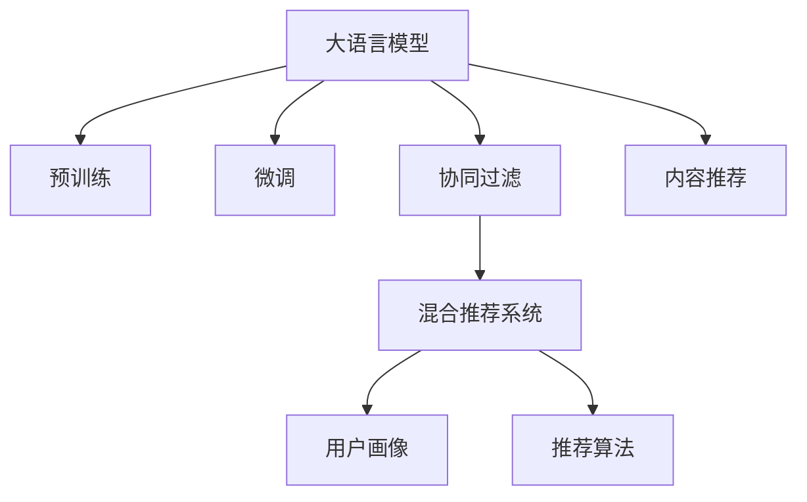

                 

# LLM推荐系统相关研究综述

> 关键词：自然语言处理(NLP)，推荐系统，大语言模型(LLM)，深度学习，协同过滤，预训练，微调

## 1. 背景介绍

推荐系统作为现代互联网的核心应用之一，已经广泛应用于电商、媒体、社交网络等多个领域。传统的推荐系统主要以协同过滤为代表，通过用户行为数据进行隐式推荐。然而，协同过滤算法存在数据稀疏性、冷启动等问题，难以充分挖掘用户深层次需求和偏好。近年来，随着深度学习技术的发展，推荐系统进入智能推荐的新阶段。特别是大语言模型(LLM)的兴起，为推荐系统带来了全新的思路和突破。

LLM推荐系统主要基于自然语言处理(NLP)技术和深度学习算法，通过语言模型对用户行为进行理解与分析，从而更全面、精确地预测用户偏好，实现推荐。LLM推荐系统具有以下优势：
- 强泛化能力：通过预训练大语言模型，具备强大的语言理解能力，能够跨领域、跨用户进行推荐。
- 鲁棒性强：可以处理多模态数据，如文本、图片、视频等，具有更高的鲁棒性和泛化能力。
- 个性化提升：可以动态生成推荐内容，具有高度的个性化和可解释性。
- 跨领域应用：除了传统的电商、媒体推荐，LLM推荐系统还可以应用于智能客服、金融、教育等多个领域。

本研究综述将从核心概念、算法原理、应用场景等方面系统总结基于LLM的推荐系统研究进展，并对未来发展趋势和面临的挑战进行展望。

## 2. 核心概念与联系

### 2.1 核心概念概述

为更好地理解基于LLM的推荐系统，本节将介绍几个密切相关的核心概念：

- 大语言模型(LLM)：以自回归(如GPT)或自编码(如BERT)模型为代表的大规模预训练语言模型。通过在大规模无标签文本语料上进行预训练，学习通用的语言表示，具备强大的语言理解和生成能力。

- 推荐系统：通过分析用户历史行为数据和兴趣特征，推荐符合用户偏好的商品、内容等的信息系统。传统推荐系统主要以协同过滤为主，近些年逐渐引入机器学习、深度学习等技术。

- 预训练与微调：在无标注文本数据上进行预训练，然后在特定任务数据上进行有监督的微调，提升模型在该任务上的性能。

- 协同过滤(Collaborative Filtering)：通过分析用户行为数据，预测用户兴趣，推荐相关商品或内容。协同过滤分为基于用户的协同过滤和基于物品的协同过滤。

- 内容推荐(Content-Based Recommendation)：通过分析商品、内容等特征，预测用户兴趣，推荐相关商品或内容。内容推荐依赖于商品和内容的描述性信息。

- 混合推荐系统(Hybrid Recommendation System)：将协同过滤和内容推荐等方法结合，取长补短，提升推荐效果。

- 用户画像(User Profile)：基于用户基本信息、行为数据、社交关系等构建的用户兴趣模型。用户画像是推荐系统的重要组成部分。

- 推荐算法：如协同过滤算法、基于内容的推荐算法、深度学习推荐算法等，用于推荐模型训练和推荐结果生成。

这些核心概念之间的逻辑关系可以通过以下Mermaid流程图来展示：



这个流程图展示了大语言模型的核心概念及其之间的关系：

1. 大语言模型通过预训练获得基础能力。
2. 微调用于对预训练模型进行任务特定的优化，提升模型性能。
3. 协同过滤和内容推荐为传统的推荐系统范式，基于用户行为和物品特征进行推荐。
4. 混合推荐系统将多种推荐方法结合，提升推荐效果。
5. 用户画像用于表示用户兴趣和行为特征，是推荐系统的重要输入。
6. 推荐算法将各种推荐方法抽象为算法框架，实现推荐模型的训练和优化。

这些概念共同构成了基于LLM的推荐系统的学习和应用框架，使其能够在各种场景下发挥强大的推荐能力。通过理解这些核心概念，我们可以更好地把握基于LLM的推荐系统的原理和优化方向。

## 3. 核心算法原理 & 具体操作步骤
### 3.1 算法原理概述

基于LLM的推荐系统，核心思想是将LLM作为强大的"语言理解器"，通过分析用户历史行为数据和用户画像，动态生成推荐内容。其关键步骤如下：

1. 预训练大语言模型：在无标注文本数据上进行预训练，学习通用的语言表示。
2. 微调模型：在特定推荐任务数据上进行微调，提升模型在该任务上的性能。
3. 构建推荐算法：将微调后的模型与其他推荐方法结合，形成完整的推荐系统。

形式化地，假设微调后的推荐模型为 $M_{\theta}$，其中 $\theta$ 为微调得到的模型参数。假设推荐系统接收用户的历史行为数据 $D=\{(x_i,y_i)\}_{i=1}^N$，其中 $x_i$ 为用户行为特征，$y_i$ 为推荐目标。

推荐任务的目标是找到最优参数 $\hat{\theta}$，使得模型能够准确预测用户偏好：

$$
\hat{\theta}=\mathop{\arg\min}_{\theta} \mathcal{L}(M_{\theta},D)
$$

其中 $\mathcal{L}$ 为推荐损失函数，用于衡量模型预测结果与真实标签之间的差异。常见的推荐损失函数包括均方误差损失、交叉熵损失等。

通过梯度下降等优化算法，微调过程不断更新模型参数 $\theta$，最小化损失函数 $\mathcal{L}$，使得模型输出逼近真实标签。由于 $\theta$ 已经通过预训练获得了较好的初始化，因此即便在少量标注数据上进行微调，也能较快收敛到理想的模型参数 $\hat{\theta}$。

### 3.2 算法步骤详解

基于LLM的推荐系统一般包括以下几个关键步骤：

**Step 1: 准备预训练模型和数据集**
- 选择合适的预训练语言模型 $M_{\theta}$ 作为初始化参数，如 BERT、GPT 等。
- 准备推荐任务 $T$ 的标注数据集 $D$，划分为训练集、验证集和测试集。一般要求标注数据与预训练数据的分布不要差异过大。

**Step 2: 设计推荐算法**
- 选择推荐算法，如基于协同过滤的MF(矩阵分解)、基于内容推荐的CF(基于用户的协同过滤)、混合推荐算法等。
- 设计任务适配层，如将微调模型的输出与推荐算法结合。

**Step 3: 设置微调超参数**
- 选择合适的优化算法及其参数，如 AdamW、SGD 等，设置学习率、批大小、迭代轮数等。
- 设置正则化技术及强度，包括权重衰减、Dropout、Early Stopping 等。
- 确定冻结预训练参数的策略，如仅微调顶层，或全部参数都参与微调。

**Step 4: 执行梯度训练**
- 将训练集数据分批次输入模型，前向传播计算损失函数。
- 反向传播计算参数梯度，根据设定的优化算法和学习率更新模型参数。
- 周期性在验证集上评估模型性能，根据性能指标决定是否触发 Early Stopping。
- 重复上述步骤直到满足预设的迭代轮数或 Early Stopping 条件。

**Step 5: 测试和部署**
- 在测试集上评估微调后模型 $M_{\hat{\theta}}$ 的性能，对比微调前后的精度提升。
- 使用微调后的模型对新样本进行推荐预测，集成到实际的应用系统中。
- 持续收集新的数据，定期重新微调模型，以适应数据分布的变化。

以上是基于LLM的推荐系统的通用流程。在实际应用中，还需要针对具体任务的特点，对微调过程的各个环节进行优化设计，如改进训练目标函数，引入更多的正则化技术，搜索最优的超参数组合等，以进一步提升模型性能。

### 3.3 算法优缺点

基于LLM的推荐系统具有以下优点：
1. 强泛化能力：LLM在无标注文本数据上进行预训练，具有强大的语言理解能力，能够跨领域、跨用户进行推荐。
2. 鲁棒性强：可以处理多模态数据，如文本、图片、视频等，具有更高的鲁棒性和泛化能力。
3. 个性化提升：动态生成推荐内容，具有高度的个性化和可解释性。
4. 跨领域应用：除了传统的电商、媒体推荐，LLM推荐系统还可以应用于智能客服、金融、教育等多个领域。

同时，该方法也存在一定的局限性：
1. 数据依赖性强：LLM推荐系统对标注数据的需求较高，尤其是在新领域或冷启动用户的情况下，推荐效果可能较差。
2. 计算复杂度高：由于LLM模型参数量较大，训练和推理耗时较长。
3. 可解释性不足：LLM模型的黑盒特性使得推荐结果缺乏可解释性，难以理解推荐逻辑。
4. 需要大量标注数据：在微调过程中，标注数据的准备和清洗成本较高，增加了实际应用难度。
5. 推荐算法复杂：传统的推荐算法与LLM模型的结合需要考虑模型结构、数据分布、用户画像等多个因素，增加了推荐系统的复杂度。

尽管存在这些局限性，但就目前而言，基于LLM的推荐系统已经在多个领域展现了显著的效果，成为推荐系统研究的一个重要方向。未来相关研究的重点在于如何进一步降低推荐对标注数据的依赖，提高模型的少样本学习和跨领域迁移能力，同时兼顾可解释性和效率等因素。

### 3.4 算法应用领域

基于LLM的推荐系统已经应用于多个领域，涵盖了电商、社交网络、金融、医疗等多个垂直行业。具体应用场景包括：

- 电商推荐：通过分析用户浏览记录、购物历史，推荐相关商品。
- 新闻推荐：根据用户阅读历史、点赞、评论等信息，推荐相关文章。
- 视频推荐：根据用户观看历史、评分等信息，推荐相关视频。
- 智能客服：通过分析用户对话记录，推荐相关的客服方案或知识库内容。
- 金融推荐：根据用户理财行为、风险偏好等，推荐相关金融产品。
- 医疗推荐：根据用户健康记录、症状等信息，推荐相关医疗服务或知识库内容。

除了上述这些经典应用外，LLM推荐系统还被创新性地应用到更多场景中，如广告投放、知识推荐、游戏推荐等，为推荐系统带来了全新的突破。随着LLM模型的不断发展，推荐系统将在更广阔的应用领域大放异彩。

## 4. 数学模型和公式 & 详细讲解 & 举例说明
### 4.1 数学模型构建

本节将使用数学语言对基于LLM的推荐系统进行更加严格的刻画。

记推荐模型为 $M_{\theta}$，其中 $\theta$ 为微调得到的模型参数。假设推荐系统接收用户的历史行为数据 $D=\{(x_i,y_i)\}_{i=1}^N$，其中 $x_i$ 为用户行为特征，$y_i$ 为推荐目标。

定义模型 $M_{\theta}$ 在数据样本 $(x,y)$ 上的损失函数为 $\ell(M_{\theta}(x),y)$，则在数据集 $D$ 上的经验风险为：

$$
\mathcal{L}(\theta) = \frac{1}{N} \sum_{i=1}^N \ell(M_{\theta}(x_i),y_i)
$$

微调的优化目标是最小化经验风险，即找到最优参数：

$$
\theta^* = \mathop{\arg\min}_{\theta} \mathcal{L}(\theta)
$$

在实践中，我们通常使用基于梯度的优化算法（如SGD、Adam等）来近似求解上述最优化问题。设 $\eta$ 为学习率，$\lambda$ 为正则化系数，则参数的更新公式为：

$$
\theta \leftarrow \theta - \eta \nabla_{\theta}\mathcal{L}(\theta) - \eta\lambda\theta
$$

其中 $\nabla_{\theta}\mathcal{L}(\theta)$ 为损失函数对参数 $\theta$ 的梯度，可通过反向传播算法高效计算。

### 4.2 公式推导过程

以下我们以电商推荐系统为例，推导基于协同过滤的推荐损失函数及其梯度的计算公式。

假设推荐模型 $M_{\theta}$ 在用户行为特征 $x$ 上的输出为 $\hat{y}=M_{\theta}(x) \in [0,1]$，表示商品与用户的匹配程度。真实标签 $y \in \{0,1\}$。则二分类交叉熵损失函数定义为：

$$
\ell(M_{\theta}(x),y) = -[y\log \hat{y} + (1-y)\log (1-\hat{y})]
$$

将其代入经验风险公式，得：

$$
\mathcal{L}(\theta) = -\frac{1}{N}\sum_{i=1}^N [y_i\log M_{\theta}(x_i)+(1-y_i)\log(1-M_{\theta}(x_i))]
$$

根据链式法则，损失函数对参数 $\theta_k$ 的梯度为：

$$
\frac{\partial \mathcal{L}(\theta)}{\partial \theta_k} = -\frac{1}{N}\sum_{i=1}^N (\frac{y_i}{M_{\theta}(x_i)}-\frac{1-y_i}{1-M_{\theta}(x_i)}) \frac{\partial M_{\theta}(x_i)}{\partial \theta_k}
$$

其中 $\frac{\partial M_{\theta}(x_i)}{\partial \theta_k}$ 可进一步递归展开，利用自动微分技术完成计算。

在得到损失函数的梯度后，即可带入参数更新公式，完成模型的迭代优化。重复上述过程直至收敛，最终得到适应推荐任务的最优模型参数 $\theta^*$。

## 5. 项目实践：代码实例和详细解释说明
### 5.1 开发环境搭建

在进行推荐系统实践前，我们需要准备好开发环境。以下是使用Python进行PyTorch开发的环境配置流程：

1. 安装Anaconda：从官网下载并安装Anaconda，用于创建独立的Python环境。

2. 创建并激活虚拟环境：
```bash
conda create -n pytorch-env python=3.8 
conda activate pytorch-env
```

3. 安装PyTorch：根据CUDA版本，从官网获取对应的安装命令。例如：
```bash
conda install pytorch torchvision torchaudio cudatoolkit=11.1 -c pytorch -c conda-forge
```

4. 安装Transformers库：
```bash
pip install transformers
```

5. 安装各类工具包：
```bash
pip install numpy pandas scikit-learn matplotlib tqdm jupyter notebook ipython
```

完成上述步骤后，即可在`pytorch-env`环境中开始推荐系统实践。

### 5.2 源代码详细实现

下面我们以电商推荐系统为例，给出使用Transformers库对BERT模型进行推荐训练的PyTorch代码实现。

首先，定义推荐数据集：

```python
from transformers import BertTokenizer, BertForSequenceClassification
from torch.utils.data import Dataset
import torch

class RecommendationDataset(Dataset):
    def __init__(self, features, labels, tokenizer, max_len=128):
        self.features = features
        self.labels = labels
        self.tokenizer = tokenizer
        self.max_len = max_len
        
    def __len__(self):
        return len(self.features)
    
    def __getitem__(self, item):
        feature = self.features[item]
        label = self.labels[item]
        
        encoding = self.tokenizer(feature, return_tensors='pt', max_length=self.max_len, padding='max_length', truncation=True)
        input_ids = encoding['input_ids'][0]
        attention_mask = encoding['attention_mask'][0]
        
        # 对label进行编码
        encoded_labels = [label] 
        encoded_labels.extend([0] * (self.max_len - len(encoded_labels)))
        labels = torch.tensor(encoded_labels, dtype=torch.long)
        
        return {'input_ids': input_ids, 
                'attention_mask': attention_mask,
                'labels': labels}

# 加载预训练的BERT模型
model = BertForSequenceClassification.from_pretrained('bert-base-cased', num_labels=2)

# 加载数据集
tokenizer = BertTokenizer.from_pretrained('bert-base-cased')
features = [...]
labels = [...]

train_dataset = RecommendationDataset(features, labels, tokenizer)
dev_dataset = RecommendationDataset(features, labels, tokenizer)
test_dataset = RecommendationDataset(features, labels, tokenizer)
```

然后，定义训练和评估函数：

```python
from torch.utils.data import DataLoader
from tqdm import tqdm
from sklearn.metrics import classification_report

device = torch.device('cuda') if torch.cuda.is_available() else torch.device('cpu')
model.to(device)

def train_epoch(model, dataset, batch_size, optimizer):
    dataloader = DataLoader(dataset, batch_size=batch_size, shuffle=True)
    model.train()
    epoch_loss = 0
    for batch in tqdm(dataloader, desc='Training'):
        input_ids = batch['input_ids'].to(device)
        attention_mask = batch['attention_mask'].to(device)
        labels = batch['labels'].to(device)
        model.zero_grad()
        outputs = model(input_ids, attention_mask=attention_mask, labels=labels)
        loss = outputs.loss
        epoch_loss += loss.item()
        loss.backward()
        optimizer.step()
    return epoch_loss / len(dataloader)

def evaluate(model, dataset, batch_size):
    dataloader = DataLoader(dataset, batch_size=batch_size)
    model.eval()
    preds, labels = [], []
    with torch.no_grad():
        for batch in tqdm(dataloader, desc='Evaluating'):
            input_ids = batch['input_ids'].to(device)
            attention_mask = batch['attention_mask'].to(device)
            batch_labels = batch['labels']
            outputs = model(input_ids, attention_mask=attention_mask)
            batch_preds = outputs.logits.argmax(dim=2).to('cpu').tolist()
            batch_labels = batch_labels.to('cpu').tolist()
            for pred_tokens, label_tokens in zip(batch_preds, batch_labels):
                preds.append(pred_tokens[:len(label_tokens)])
                labels.append(label_tokens)
                
    print(classification_report(labels, preds))
```

最后，启动训练流程并在测试集上评估：

```python
epochs = 5
batch_size = 16

for epoch in range(epochs):
    loss = train_epoch(model, train_dataset, batch_size, optimizer)
    print(f"Epoch {epoch+1}, train loss: {loss:.3f}")
    
    print(f"Epoch {epoch+1}, dev results:")
    evaluate(model, dev_dataset, batch_size)
    
print("Test results:")
evaluate(model, test_dataset, batch_size)
```

以上就是使用PyTorch对BERT进行电商推荐系统训练的完整代码实现。可以看到，得益于Transformers库的强大封装，我们可以用相对简洁的代码完成BERT模型的加载和训练。

### 5.3 代码解读与分析

让我们再详细解读一下关键代码的实现细节：

**RecommendationDataset类**：
- `__init__`方法：初始化特征、标签、分词器等关键组件。
- `__len__`方法：返回数据集的样本数量。
- `__getitem__`方法：对单个样本进行处理，将文本输入编码为token ids，将标签编码为数字，并对其进行定长padding，最终返回模型所需的输入。

**预训练模型和优化器**：
- 使用预训练BERT模型进行推荐系统开发。
- 选择AdamW优化器，设置学习率、批大小等参数。

**训练和评估函数**：
- 使用PyTorch的DataLoader对数据集进行批次化加载，供模型训练和推理使用。
- 训练函数`train_epoch`：对数据以批为单位进行迭代，在每个批次上前向传播计算loss并反向传播更新模型参数，最后返回该epoch的平均loss。
- 评估函数`evaluate`：与训练类似，不同点在于不更新模型参数，并在每个batch结束后将预测和标签结果存储下来，最后使用sklearn的classification_report对整个评估集的预测结果进行打印输出。

**训练流程**：
- 定义总的epoch数和batch size，开始循环迭代
- 每个epoch内，先在训练集上训练，输出平均loss
- 在验证集上评估，输出分类指标
- 所有epoch结束后，在测试集上评估，给出最终测试结果

可以看到，PyTorch配合Transformers库使得BERT推荐系统的代码实现变得简洁高效。开发者可以将更多精力放在数据处理、模型改进等高层逻辑上，而不必过多关注底层的实现细节。

当然，工业级的系统实现还需考虑更多因素，如模型的保存和部署、超参数的自动搜索、更灵活的任务适配层等。但核心的推荐范式基本与此类似。

## 6. 实际应用场景
### 6.1 智能客服系统

基于大语言模型推荐系统，可以构建智能客服系统，自动推荐客服方案或知识库内容。传统客服往往需要配备大量人力，高峰期响应缓慢，且一致性和专业性难以保证。而使用推荐系统进行智能推荐，可以7x24小时不间断服务，快速响应客户咨询，用自然流畅的语言解答各类常见问题。

在技术实现上，可以收集企业内部的历史客服对话记录，将问题和最佳答复构建成监督数据，在此基础上对预训练推荐模型进行微调。微调后的推荐模型能够自动理解用户意图，匹配最合适的答案模板进行回复。对于客户提出的新问题，还可以接入检索系统实时搜索相关内容，动态组织生成回答。如此构建的智能客服系统，能大幅提升客户咨询体验和问题解决效率。

### 6.2 金融舆情监测

金融机构需要实时监测市场舆论动向，以便及时应对负面信息传播，规避金融风险。传统的人工监测方式成本高、效率低，难以应对网络时代海量信息爆发的挑战。基于大语言模型推荐系统的文本分类和情感分析技术，为金融舆情监测提供了新的解决方案。

具体而言，可以收集金融领域相关的新闻、报道、评论等文本数据，并对其进行主题标注和情感标注。在此基础上对预训练语言模型进行微调，使其能够自动判断文本属于何种主题，情感倾向是正面、中性还是负面。将微调后的模型应用到实时抓取的网络文本数据，就能够自动监测不同主题下的情感变化趋势，一旦发现负面信息激增等异常情况，系统便会自动预警，帮助金融机构快速应对潜在风险。

### 6.3 个性化推荐系统

当前的推荐系统往往只依赖用户的历史行为数据进行物品推荐，无法深入理解用户深层次需求和偏好。基于大语言模型推荐系统，个性化推荐系统可以更好地挖掘用户兴趣点，动态生成推荐内容，具有高度的个性化和可解释性。

在实践中，可以收集用户浏览、点击、评论、分享等行为数据，提取和用户交互的物品标题、描述、标签等文本内容。将文本内容作为模型输入，用户的后续行为（如是否点击、购买等）作为监督信号，在此基础上微调预训练语言模型。微调后的模型能够从文本内容中准确把握用户的兴趣点。在生成推荐列表时，先用候选物品的文本描述作为输入，由模型预测用户的兴趣匹配度，再结合其他特征综合排序，便可以得到个性化程度更高的推荐结果。

### 6.4 未来应用展望

随着大语言模型推荐系统的不断发展，其在更多领域将展现出巨大的应用潜力：

- 智慧医疗领域：基于大语言模型的推荐系统，可以用于疾病诊断、治疗方案推荐、健康咨询等服务，辅助医生诊疗，加速新药开发进程。
- 智能教育领域：推荐系统可以用于个性化推荐学习资源、智能布置作业、智能评估考试等，因材施教，促进教育公平，提高教学质量。
- 智慧城市治理：推荐系统可以用于城市事件监测、舆情分析、应急指挥等环节，提高城市管理的自动化和智能化水平，构建更安全、高效的未来城市。
- 企业生产管理：推荐系统可以用于智能调度、库存管理、质量控制等环节，提升企业生产效率和质量。
- 社会治理：推荐系统可以用于精准扶贫、公共服务推荐、政策制定等服务，提升社会治理效率和效果。
- 文化传媒：推荐系统可以用于内容推荐、广告投放、娱乐推荐等环节，推动文化传媒产业的数字化转型。

此外，在交通、能源、环保等多个领域，基于大语言模型推荐系统也有广阔的应用前景，为各行各业带来变革性影响。相信随着技术的不断进步，基于大语言模型的推荐系统必将在更广阔的领域大放异彩，深刻影响人类的生产生活方式。

## 7. 工具和资源推荐
### 7.1 学习资源推荐

为了帮助开发者系统掌握大语言模型推荐系统的理论基础和实践技巧，这里推荐一些优质的学习资源：

1. 《深度学习推荐系统》书籍：该书深入浅出地介绍了推荐系统的原理和算法，涵盖协同过滤、内容推荐、基于深度学习的推荐等多种方法。
2. 《自然语言处理与深度学习》课程：斯坦福大学开设的NLP明星课程，系统讲解了深度学习在NLP中的应用，包括推荐系统等。
3. 《推荐系统：算法与实践》书籍：介绍了推荐系统的基础理论、算法实现和工程实践，包括协同过滤、基于内容的推荐、混合推荐等。
4. 《Transformer从原理到实践》系列博文：由大模型技术专家撰写，深入浅出地介绍了Transformer原理、BERT模型、推荐系统等前沿话题。
5. Kaggle推荐系统竞赛数据集和样例代码：Kaggle是全球最大的数据科学竞赛平台，推荐系统竞赛涵盖多种任务和数据集，提供了丰富的样例代码和数据集，方便开发者学习实践。

通过对这些资源的学习实践，相信你一定能够快速掌握大语言模型推荐系统的精髓，并用于解决实际的推荐问题。
###  7.2 开发工具推荐

高效的开发离不开优秀的工具支持。以下是几款用于大语言模型推荐系统开发的常用工具：

1. PyTorch：基于Python的开源深度学习框架，灵活动态的计算图，适合快速迭代研究。大部分预训练语言模型都有PyTorch版本的实现。
2. TensorFlow：由Google主导开发的开源深度学习框架，生产部署方便，适合大规模工程应用。同样有丰富的预训练语言模型资源。
3. Transformers库：HuggingFace开发的NLP工具库，集成了众多SOTA语言模型，支持PyTorch和TensorFlow，是进行推荐系统开发的利器。
4. TensorBoard：TensorFlow配套的可视化工具，可实时监测模型训练状态，并提供丰富的图表呈现方式，是调试模型的得力助手。
5. Weights & Biases：模型训练的实验跟踪工具，可以记录和可视化模型训练过程中的各项指标，方便对比和调优。
6. Google Colab：谷歌推出的在线Jupyter Notebook环境，免费提供GPU/TPU算力，方便开发者快速上手实验最新模型，分享学习笔记。

合理利用这些工具，可以显著提升大语言模型推荐系统的开发效率，加快创新迭代的步伐。

### 7.3 相关论文推荐

大语言模型推荐系统的研究源于学界的持续研究。以下是几篇奠基性的相关论文，推荐阅读：

1. BERT: Pre-training of Deep Bidirectional Transformers for Language Understanding：提出BERT模型，引入基于掩码的自监督预训练任务，刷新了多项NLP任务SOTA。
2. Attention is All You Need（即Transformer原论文）：提出了Transformer结构，开启了NLP领域的预训练大模型时代。
3. Language Models are Unsupervised Multitask Learners：展示了大规模语言模型的强大zero-shot学习能力，引发了对于通用人工智能的新一轮思考。
4. Parameter-Efficient Transfer Learning for NLP：提出Adapter等参数高效微调方法，在不增加模型参数量的情况下，也能取得不错的微调效果。
5. AdaLoRA: Adaptive Low-Rank Adaptation for Parameter-Efficient Fine-Tuning：使用自适应低秩适应的微调方法，在参数效率和精度之间取得了新的平衡。
6. Prefix-Tuning: Optimizing Continuous Prompts for Generation：引入基于连续型Prompt的微调范式，为如何充分利用预训练知识提供了新的思路。

这些论文代表了大语言模型推荐系统的发展脉络。通过学习这些前沿成果，可以帮助研究者把握学科前进方向，激发更多的创新灵感。

## 8. 总结：未来发展趋势与挑战

### 8.1 总结

本文对基于大语言模型的推荐系统进行了全面系统的介绍。首先阐述了推荐系统的研究背景和LLM在其中的作用，明确了LLM在推荐系统中的重要价值。其次，从原理到实践，详细讲解了推荐模型的数学原理和关键步骤，给出了推荐系统开发的完整代码实例。同时，本文还广泛探讨了LLM推荐系统在多个行业领域的应用前景，展示了其广阔的应用空间。

通过本文的系统梳理，可以看到，基于LLM的推荐系统已经进入智能推荐的新阶段，成为推荐系统研究的一个重要方向。受益于LLM的强大语言理解能力，推荐系统在跨领域、跨用户推荐方面具有显著优势，为推荐系统带来了新的突破。未来，伴随预训练语言模型和推荐方法的持续演进，基于LLM的推荐系统必将在更多领域展现其强大潜力，深刻影响人类的生产生活方式。

### 8.2 未来发展趋势

展望未来，大语言模型推荐系统将呈现以下几个发展趋势：

1. 模型规模持续增大。随着算力成本的下降和数据规模的扩张，预训练语言模型的参数量还将持续增长。超大规模语言模型蕴含的丰富语言知识，有望支撑更加复杂多变的推荐任务。
2. 推荐算法多样化。除了传统的协同过滤和内容推荐外，将涌现更多基于深度学习的推荐算法，如序列模型、强化学习等，提升推荐效果。
3. 模型鲁棒性增强。LLM推荐系统将能够处理更多模态数据，具有更高的鲁棒性和泛化能力，提高推荐系统的适用性和可靠性。
4. 个性化提升。LLM推荐系统将具备高度的个性化和可解释性，能够根据用户历史行为和实时反馈动态生成推荐内容。
5. 跨领域应用。LLM推荐系统将不仅限于电商、媒体等传统领域，而是广泛应用于智慧医疗、智能教育、智慧城市等多个垂直行业。
6. 推荐模型融合。LLM推荐系统将与其他AI技术融合，如知识图谱、逻辑推理、强化学习等，提升推荐系统的智能化水平。

以上趋势凸显了大语言模型推荐系统的广阔前景。这些方向的探索发展，必将进一步提升推荐系统的性能和应用范围，为智能推荐技术带来新的突破。

### 8.3 面临的挑战

尽管大语言模型推荐系统已经取得了显著进展，但在迈向更加智能化、普适化应用的过程中，它仍面临诸多挑战：

1. 数据依赖性强。推荐系统对标注数据的需求较高，尤其是在新领域或冷启动用户的情况下，推荐效果可能较差。如何进一步降低推荐对标注数据的依赖，将是一大难题。
2. 计算复杂度高。由于LLM模型参数量较大，训练和推理耗时较长。如何在保证性能的同时，减小模型参数量，提升计算效率，仍然是一个重要的研究方向。
3. 可解释性不足。LLM模型的黑盒特性使得推荐结果缺乏可解释性，难以理解推荐逻辑。如何赋予推荐系统更强的可解释性，将是亟待攻克的难题。
4. 推荐算法复杂。传统的推荐算法与LLM模型的结合需要考虑模型结构、数据分布、用户画像等多个因素，增加了推荐系统的复杂度。
5. 推荐模型训练成本高。由于LLM模型和推荐系统的规模较大，训练和微调需要大量的计算资源和时间成本。如何降低推荐模型的训练成本，提高训练效率，是亟需解决的实际问题。
6. 推荐系统安全问题。由于推荐系统涉及大量的用户行为数据，如何保护用户隐私和数据安全，避免数据泄露和滥用，是一个重要的研究课题。

尽管存在这些挑战，但随着技术的发展和研究的深入，相信大语言模型推荐系统能够在更多领域得到应用，为推荐技术带来新的突破。未来相关研究的重点在于如何进一步降低推荐对标注数据的依赖，提高模型的少样本学习和跨领域迁移能力，同时兼顾可解释性和效率等因素。

### 8.4 研究展望

面对大语言模型推荐系统所面临的种种挑战，未来的研究需要在以下几个方面寻求新的突破：

1. 探索无监督和半监督推荐方法。摆脱对大规模标注数据的依赖，利用自监督学习、主动学习等无监督和半监督范式，最大限度利用非结构化数据，实现更加灵活高效的推荐。
2. 研究参数高效和计算高效的推荐范式。开发更加参数高效的推荐方法，在固定大部分预训练参数的同时，只更新极少量的任务相关参数。同时优化推荐模型的计算图，减少前向传播和反向传播的资源消耗，实现更加轻量级、实时性的部署。
3. 融合因果和对比学习范式。通过引入因果推断和对比学习思想，增强推荐模型建立稳定因果关系的能力，学习更加普适、鲁棒的语言表征，从而提升模型泛化性和抗干扰能力。
4. 引入更多先验知识。将符号化的先验知识，如知识图谱、逻辑规则等，与神经网络模型进行巧妙融合，引导推荐过程学习更准确、合理的语言模型。同时加强不同模态数据的整合，实现视觉、语音等多模态信息与文本信息的协同建模。
5. 结合因果分析和博弈论工具。将因果分析方法引入推荐模型，识别出推荐决策的关键特征，增强推荐结果的因果性和逻辑性。借助博弈论工具刻画人机交互过程，主动探索并规避推荐系统的脆弱点，提高系统稳定性。
6. 纳入伦理道德约束。在推荐系统设计目标中引入伦理导向的评估指标，过滤和惩罚有害的推荐结果，确保推荐系统符合人类价值观和伦理道德。

这些研究方向的探索，必将引领大语言模型推荐系统迈向更高的台阶，为构建安全、可靠、可解释、可控的智能推荐系统铺平道路。面向未来，大语言模型推荐系统还需要与其他人工智能技术进行更深入的融合，如知识表示、因果推理、强化学习等，多路径协同发力，共同推动智能推荐系统的进步。只有勇于创新、敢于突破，才能不断拓展推荐系统的边界，让智能推荐技术更好地服务于人类社会。

## 9. 附录：常见问题与解答

**Q1：推荐系统中的冷启动问题如何解决？**

A: 推荐系统中的冷启动问题是指新用户或新物品没有历史行为数据，无法进行推荐。常见的解决方法包括：
1. 利用用户画像和知识图谱：通过收集用户的个人信息、社交关系等，建立用户画像，结合知识图谱，为冷启动用户提供推荐。
2. 利用协同过滤和内容推荐：通过分析已有的用户行为数据和物品特征，对新用户进行相似度匹配，从而推荐相关物品。
3. 利用深度学习模型：通过预训练语言模型对用户画像进行表示学习，再结合推荐任务数据进行微调，提升推荐效果。

**Q2：推荐系统中的数据稀疏性如何解决？**

A: 推荐系统中的数据稀疏性是指用户行为数据较少，难以进行精准推荐。常见的解决方法包括：
1. 利用协同过滤算法：通过分析已有的用户行为数据和物品特征，对用户进行相似度匹配，从而推荐相关物品。
2. 利用内容推荐算法：通过分析物品的描述、标签等特征，推荐相关物品。
3. 利用深度学习模型：通过预训练语言模型对物品特征进行表示学习，再结合推荐任务数据进行微调，提升推荐效果。
4. 利用混合推荐算法：将协同过滤和内容推荐等方法结合，取长补短，提升推荐效果。

**Q3：推荐系统中的数据隐私保护问题如何解决？**

A: 推荐系统中的数据隐私保护问题是指如何保护用户行为数据，防止数据泄露和滥用。常见的解决方法包括：
1. 数据匿名化：对用户行为数据进行匿名化处理，保护用户隐私。
2. 数据加密：对用户行为数据进行加密存储和传输，防止数据泄露。
3. 差分隐私：对用户行为数据进行差分隐私处理，限制数据泄露风险。
4. 联邦学习：通过分布式计算，在本地设备上进行模型训练，避免数据集中存储和传输。

**Q4：推荐系统中的推荐质量如何评价？**

A: 推荐系统的推荐质量通常通过以下指标进行评价：
1. 精度指标：包括准确率、召回率、F1分数等，用于衡量推荐结果的准确性。
2. 覆盖率：衡量推荐结果的丰富程度，覆盖了推荐系统的推荐范围。
3. 多样性：衡量推荐结果的多样性，避免推荐结果的同质化。
4. 新颖性：衡量推荐结果的新颖性，推荐用户未见过的物品。
5. 满意度：通过用户反馈等方式，评价推荐结果的满意度。

**Q5：推荐系统中的个性化推荐如何实现？**

A: 推荐系统的个性化推荐通常通过以下方法实现：
1. 用户画像建模：通过收集用户的个人信息、行为数据、社交关系等，建立用户画像，刻画用户兴趣和偏好。
2. 物品特征建模：通过分析物品的描述、标签、属性等特征，刻画物品的特征和属性。
3. 协同过滤推荐：通过分析已有的用户行为数据和物品特征，对用户进行相似度匹配，从而推荐相关物品。
4. 基于内容的推荐：通过分析物品的描述、标签等特征，推荐相关物品。
5. 混合推荐：将协同过滤和基于内容的推荐等方法结合，提升推荐效果。

这些方法可以综合使用，根据具体的推荐任务和应用场景，选择合适的推荐算法和模型，实现高质量的个性化推荐。

