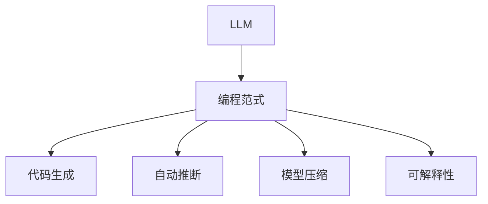

                 

# LLM时代的编程范式革命

> 关键词：Large Language Model (LLM), 编程范式, 大模型微调, 监督学习, 模型压缩, 代码生成, 自动推断

## 1. 背景介绍

### 1.1 问题由来

随着深度学习和大规模预训练语言模型(LLM)的兴起，编程范式已经发生了一次深刻的革命。传统基于规则的编程方式，逐渐被基于数据的模型驱动方式所取代。这一变革不仅影响了软件开发的流程和工具，也对程序员的技能要求和思维方式提出了新的挑战。

LLM，如OpenAI的GPT系列和Google的BERT，通过在海量无标签数据上进行预训练，学习到了丰富的语言知识，具备了强大的语言生成和理解能力。这一能力可以被应用于自然语言处理(NLP)任务，如文本生成、机器翻译、问答系统等，同时也推动了其他领域的发展，如生成式对话系统、代码生成、数据分析等。

然而，这种基于数据的模型驱动方式，带来了许多新问题。例如，如何高效地利用模型生成代码？如何确保生成的代码的正确性和可维护性？如何优化模型的性能以应对大规模数据处理和计算需求？这些问题催生了编程范式的转变，从传统的基于规则的编程，走向基于数据和模型的生成式编程。

### 1.2 问题核心关键点

在LLM时代，编程范式的革命主要集中在以下几个方面：

- 代码生成：利用LLM自动生成代码，提升编程效率。
- 自动推断：根据输入的代码片段或问题描述，自动推断出完整代码或解决方案。
- 模型压缩：针对特定应用场景，压缩模型以提高计算效率和资源利用率。
- 可解释性：提升模型的可解释性，使开发者能够理解模型的决策逻辑。

这些问题互相交织，共同推动了编程范式的变革。理解这些问题的本质和解决方案，对于程序员掌握新范式至关重要。

### 1.3 问题研究意义

研究LLM时代的编程范式革命，对于推动软件开发方式的现代化、智能化，提升开发效率和软件质量，具有重要意义：

- 降低开发成本：利用模型自动生成和推断代码，减少编写代码的时间和成本。
- 提升代码质量：模型驱动的方式可以生成高质量、可维护的代码。
- 加速开发进度：自动化的代码生成和推断，加速软件开发进程，缩短项目周期。
- 促进技术创新：基于模型的编程范式催生了新的技术方向，如模型压缩、代码优化等。
- 赋能产业升级：使软件开发更加普及和高效，促进各行各业的数字化转型。

## 2. 核心概念与联系

### 2.1 核心概念概述

为更好地理解LLM时代的编程范式革命，本节将介绍几个密切相关的核心概念：

- Large Language Model (LLM)：以自回归(如GPT)或自编码(如BERT)模型为代表的大规模预训练语言模型。通过在大规模无标签文本语料上进行预训练，学习到了丰富的语言知识，具备强大的语言理解和生成能力。

- 编程范式：软件开发中的编程方式和策略，从传统的基于规则的方式，向基于数据的模型驱动方式转变。

- 代码生成：利用模型自动生成代码或编写代码片段，提升编程效率。

- 自动推断：根据输入的代码片段或问题描述，自动推断出完整代码或解决方案。

- 模型压缩：针对特定应用场景，压缩模型以提高计算效率和资源利用率。

- 可解释性：提升模型的可解释性，使开发者能够理解模型的决策逻辑。

这些核心概念之间的逻辑关系可以通过以下Mermaid流程图来展示：



这个流程图展示了大语言模型对编程范式的影响，以及基于模型的编程方式带来的新能力和挑战。

## 3. 核心算法原理 & 具体操作步骤
### 3.1 算法原理概述

基于模型的编程范式，其核心思想是利用大语言模型自动生成或推断代码。具体而言，模型需要学习从输入（如代码片段、问题描述）到输出的映射关系，其中输出为完整的代码或解决方案。

形式化地，假设输入为 $x$，输出为 $y$，则模型 $M$ 的训练目标是最小化损失函数 $\mathcal{L}$：

$$
\theta^* = \mathop{\arg\min}_{\theta} \mathcal{L}(M_{\theta}(x),y)
$$

其中，$M_{\theta}$ 为预训练语言模型，$\theta$ 为模型参数，$\mathcal{L}$ 为损失函数，如交叉熵损失、均方误差损失等。

通过梯度下降等优化算法，模型参数 $\theta$ 不断更新，最小化损失函数 $\mathcal{L}$，使得模型 $M_{\theta}$ 能够将输入 $x$ 映射到目标输出 $y$。

### 3.2 算法步骤详解

基于模型的编程范式，其操作步骤包括以下几个关键步骤：

**Step 1: 准备数据集**
- 收集标注数据集 $D$，包含输入 $x$ 和对应的输出 $y$。输入 $x$ 可以包括代码片段、问题描述等，输出 $y$ 为完整的代码或解决方案。

**Step 2: 选择合适的预训练模型**
- 选择合适的预训练语言模型，如GPT、BERT等，作为初始化参数。

**Step 3: 设计任务适配层**
- 根据任务类型，设计合适的输出层和损失函数。例如，对于代码生成任务，设计输出完整的Python代码，并使用交叉熵损失函数。

**Step 4: 设置超参数**
- 选择合适的优化算法及其参数，如AdamW、SGD等，设置学习率、批大小、迭代轮数等。
- 设置正则化技术及强度，包括权重衰减、Dropout、Early Stopping等。
- 确定冻结预训练参数的策略，如仅微调顶层，或全部参数都参与微调。

**Step 5: 执行梯度训练**
- 将训练集数据分批次输入模型，前向传播计算损失函数。
- 反向传播计算参数梯度，根据设定的优化算法和学习率更新模型参数。
- 周期性在验证集上评估模型性能，根据性能指标决定是否触发 Early Stopping。
- 重复上述步骤直到满足预设的迭代轮数或 Early Stopping 条件。

**Step 6: 测试和部署**
- 在测试集上评估微调后模型 $M_{\hat{\theta}}$ 的性能，对比微调前后的精度提升。
- 使用微调后的模型对新样本进行推理预测，集成到实际的应用系统中。

### 3.3 算法优缺点

基于模型的编程范式具有以下优点：
1. 高效：自动生成和推断代码，节省了大量编写代码的时间和成本。
2. 灵活：能够快速适应不同领域和任务的需求，提升代码生成和推断的灵活性。
3. 创新：促进了新编程方式和工具的发展，推动了技术创新。

同时，该方法也存在一定的局限性：
1. 依赖数据：模型的性能高度依赖于数据的质量和多样性。
2. 可解释性差：模型决策过程缺乏可解释性，难以理解和调试。
3. 鲁棒性不足：模型在面对输入噪声和复杂任务时，容易产生错误。
4. 资源消耗大：模型训练和推理需要大量的计算资源和时间。

尽管存在这些局限性，但基于模型的编程范式仍然是大数据时代的重要方向，其应用前景广阔，值得进一步探索和优化。

### 3.4 算法应用领域

基于模型的编程范式在软件开发和工程实践中已经得到了广泛应用，覆盖了多种场景：

- 代码生成：自动生成代码片段或完整代码，提升开发效率。
- 自动推断：根据输入的代码片段或问题描述，自动推断出完整代码或解决方案。
- 模型压缩：针对特定应用场景，压缩模型以提高计算效率和资源利用率。
- 可解释性：提升模型的可解释性，使开发者能够理解模型的决策逻辑。

这些应用场景不仅在软件开发中具有重要意义，还推动了人工智能与软件开发的深度融合，为智能化软件开发开辟了新的道路。

## 4. 数学模型和公式 & 详细讲解 & 举例说明

### 4.1 数学模型构建

本节将使用数学语言对基于模型的编程范式进行更加严格的刻画。

假设模型 $M_{\theta}$ 在输入 $x$ 上的输出为 $y$，其中 $x$ 为输入，$y$ 为输出，$\theta$ 为模型参数。定义模型 $M_{\theta}$ 在数据样本 $(x,y)$ 上的损失函数为 $\ell(M_{\theta}(x),y)$，则在数据集 $D$ 上的经验风险为：

$$
\mathcal{L}(\theta) = \frac{1}{N} \sum_{i=1}^N \ell(M_{\theta}(x_i),y_i)
$$

其中 $N$ 为数据集大小，$\ell$ 为损失函数，如交叉熵损失、均方误差损失等。

### 4.2 公式推导过程

以下我们以代码生成任务为例，推导交叉熵损失函数及其梯度的计算公式。

假设模型 $M_{\theta}$ 在输入 $x$ 上的输出为 $\hat{y}=M_{\theta}(x)$，表示模型预测的代码片段。真实代码片段 $y$ 为输出。则交叉熵损失函数定义为：

$$
\ell(M_{\theta}(x),y) = -\sum_{i} \log P(y_i|x)
$$

其中 $P(y_i|x)$ 表示在输入 $x$ 条件下生成第 $i$ 个代码片段的概率，可以通过模型输出 $\hat{y}$ 的交叉熵计算。

将其代入经验风险公式，得：

$$
\mathcal{L}(\theta) = -\frac{1}{N}\sum_{i=1}^N [\log P(y_i|x_i)]
$$

根据链式法则，损失函数对参数 $\theta$ 的梯度为：

$$
\frac{\partial \mathcal{L}(\theta)}{\partial \theta} = -\frac{1}{N}\sum_{i=1}^N \frac{\partial \log P(y_i|x_i)}{\partial \theta}
$$

其中 $\frac{\partial \log P(y_i|x_i)}{\partial \theta}$ 可以通过交叉熵的公式进一步计算。

在得到损失函数的梯度后，即可带入参数更新公式，完成模型的迭代优化。重复上述过程直至收敛，最终得到适应特定任务的最优模型参数 $\theta^*$。

### 4.3 案例分析与讲解

假设我们有一个简单的代码生成任务，目标是从问题描述生成Python函数代码。输入 $x$ 为问题描述，输出 $y$ 为完整的Python函数代码。

**输入数据**：
- 问题描述："编写一个函数，实现两个数的相加。"

**输出代码**：
- Python函数代码：```def add(x, y):\n    return x + y```

**训练数据**：
- 输入："编写一个函数，实现两个数的相加。"
- 输出：```def add(x, y):\n    return x + y```

**损失函数**：交叉熵损失函数

**优化算法**：AdamW

**模型参数**：假设模型有 $d$ 个参数，表示为 $\theta_1, \theta_2, ..., \theta_d$

**训练过程**：
1. 前向传播：输入问题描述 $x$，模型输出预测代码片段 $\hat{y}$。
2. 计算损失：计算预测代码片段与真实代码片段之间的交叉熵损失。
3. 反向传播：计算损失函数对模型参数 $\theta$ 的梯度。
4. 更新参数：根据梯度信息更新模型参数，学习如何生成更准确的代码。
5. 重复迭代，直至收敛。

在训练过程中，模型不断优化自身，提升生成代码的准确性和可读性。通过这种基于数据的模型驱动方式，大大提升了代码生成的效率和质量。

## 5. 项目实践：代码实例和详细解释说明
### 5.1 开发环境搭建

在进行模型驱动的编程范式实践前，我们需要准备好开发环境。以下是使用Python进行PyTorch开发的环境配置流程：

1. 安装Anaconda：从官网下载并安装Anaconda，用于创建独立的Python环境。

2. 创建并激活虚拟环境：
```bash
conda create -n pytorch-env python=3.8 
conda activate pytorch-env
```

3. 安装PyTorch：根据CUDA版本，从官网获取对应的安装命令。例如：
```bash
conda install pytorch torchvision torchaudio cudatoolkit=11.1 -c pytorch -c conda-forge
```

4. 安装Transformer库：
```bash
pip install transformers
```

5. 安装各类工具包：
```bash
pip install numpy pandas scikit-learn matplotlib tqdm jupyter notebook ipython
```

完成上述步骤后，即可在`pytorch-env`环境中开始模型驱动的编程范式实践。

### 5.2 源代码详细实现

下面我们以代码生成任务为例，给出使用Transformers库对BERT模型进行代码生成的PyTorch代码实现。

首先，定义训练数据处理函数：

```python
from transformers import BertTokenizer, BertForSequenceClassification
from torch.utils.data import Dataset, DataLoader
import torch

class CodeGenerationDataset(Dataset):
    def __init__(self, questions, codes):
        self.questions = questions
        self.codes = codes
        self.tokenizer = BertTokenizer.from_pretrained('bert-base-cased')

    def __len__(self):
        return len(self.questions)

    def __getitem__(self, item):
        question = self.questions[item]
        code = self.codes[item]
        encoding = self.tokenizer(question, return_tensors='pt', max_length=256, padding='max_length', truncation=True)
        input_ids = encoding['input_ids'][0]
        attention_mask = encoding['attention_mask'][0]
        return {'input_ids': input_ids, 
                'attention_mask': attention_mask,
                'labels': code}

# 创建dataset
tokenizer = BertTokenizer.from_pretrained('bert-base-cased')
train_dataset = CodeGenerationDataset(train_questions, train_codes)
```

然后，定义模型和优化器：

```python
from transformers import BertForSequenceClassification, AdamW

model = BertForSequenceClassification.from_pretrained('bert-base-cased', num_labels=1)

optimizer = AdamW(model.parameters(), lr=2e-5)
```

接着，定义训练和评估函数：

```python
from tqdm import tqdm

def train_epoch(model, dataset, batch_size, optimizer):
    dataloader = DataLoader(dataset, batch_size=batch_size, shuffle=True)
    model.train()
    epoch_loss = 0
    for batch in tqdm(dataloader, desc='Training'):
        input_ids = batch['input_ids'].to(device)
        attention_mask = batch['attention_mask'].to(device)
        labels = batch['labels'].to(device)
        model.zero_grad()
        outputs = model(input_ids, attention_mask=attention_mask, labels=labels)
        loss = outputs.loss
        epoch_loss += loss.item()
        loss.backward()
        optimizer.step()
    return epoch_loss / len(dataloader)

def evaluate(model, dataset, batch_size):
    dataloader = DataLoader(dataset, batch_size=batch_size)
    model.eval()
    preds, labels = [], []
    with torch.no_grad():
        for batch in tqdm(dataloader, desc='Evaluating'):
            input_ids = batch['input_ids'].to(device)
            attention_mask = batch['attention_mask'].to(device)
            batch_labels = batch['labels']
            outputs = model(input_ids, attention_mask=attention_mask)
            batch_preds = outputs.logits.argmax(dim=2).to('cpu').tolist()
            batch_labels = batch_labels.to('cpu').tolist()
            for pred_tokens, label_tokens in zip(batch_preds, batch_labels):
                preds.append(pred_tokens)
                labels.append(label_tokens)
    print(classification_report(labels, preds))
```

最后，启动训练流程并在测试集上评估：

```python
epochs = 5
batch_size = 16

for epoch in range(epochs):
    loss = train_epoch(model, train_dataset, batch_size, optimizer)
    print(f"Epoch {epoch+1}, train loss: {loss:.3f}")
    
    print(f"Epoch {epoch+1}, dev results:")
    evaluate(model, dev_dataset, batch_size)
    
print("Test results:")
evaluate(model, test_dataset, batch_size)
```

以上就是使用PyTorch对BERT进行代码生成任务的完整代码实现。可以看到，得益于Transformer库的强大封装，我们可以用相对简洁的代码完成BERT模型的加载和微调。

### 5.3 代码解读与分析

让我们再详细解读一下关键代码的实现细节：

**CodeGenerationDataset类**：
- `__init__`方法：初始化问题描述、代码片段、分词器等关键组件。
- `__len__`方法：返回数据集的样本数量。
- `__getitem__`方法：对单个样本进行处理，将问题描述输入编码为token ids，将代码片段编码为数字，并对其进行定长padding，最终返回模型所需的输入。

**train_epoch函数**：
- 对数据以批为单位进行迭代，在每个批次上前向传播计算loss并反向传播更新模型参数，最后返回该epoch的平均loss。
- 使用PyTorch的DataLoader对数据集进行批次化加载，供模型训练和推理使用。

**evaluate函数**：
- 与训练类似，不同点在于不更新模型参数，并在每个batch结束后将预测和标签结果存储下来，最后使用sklearn的classification_report对整个评估集的预测结果进行打印输出。

**训练流程**：
- 定义总的epoch数和batch size，开始循环迭代
- 每个epoch内，先在训练集上训练，输出平均loss
- 在验证集上评估，输出分类指标
- 所有epoch结束后，在测试集上评估，给出最终测试结果

可以看到，PyTorch配合Transformer库使得BERT微调的代码实现变得简洁高效。开发者可以将更多精力放在数据处理、模型改进等高层逻辑上，而不必过多关注底层的实现细节。

当然，工业级的系统实现还需考虑更多因素，如模型的保存和部署、超参数的自动搜索、更灵活的任务适配层等。但核心的微调范式基本与此类似。

## 6. 实际应用场景
### 6.1 智能客服系统

基于模型驱动的编程范式，可以广泛应用于智能客服系统的构建。传统客服往往需要配备大量人力，高峰期响应缓慢，且一致性和专业性难以保证。而使用模型驱动的对话模型，可以7x24小时不间断服务，快速响应客户咨询，用自然流畅的语言解答各类常见问题。

在技术实现上，可以收集企业内部的历史客服对话记录，将问题和最佳答复构建成监督数据，在此基础上对预训练对话模型进行微调。微调后的对话模型能够自动理解用户意图，匹配最合适的答案模板进行回复。对于客户提出的新问题，还可以接入检索系统实时搜索相关内容，动态组织生成回答。如此构建的智能客服系统，能大幅提升客户咨询体验和问题解决效率。

### 6.2 金融舆情监测

金融机构需要实时监测市场舆论动向，以便及时应对负面信息传播，规避金融风险。传统的人工监测方式成本高、效率低，难以应对网络时代海量信息爆发的挑战。基于模型驱动的文本分类和情感分析技术，为金融舆情监测提供了新的解决方案。

具体而言，可以收集金融领域相关的新闻、报道、评论等文本数据，并对其进行主题标注和情感标注。在此基础上对预训练语言模型进行微调，使其能够自动判断文本属于何种主题，情感倾向是正面、中性还是负面。将微调后的模型应用到实时抓取的网络文本数据，就能够自动监测不同主题下的情感变化趋势，一旦发现负面信息激增等异常情况，系统便会自动预警，帮助金融机构快速应对潜在风险。

### 6.3 个性化推荐系统

当前的推荐系统往往只依赖用户的历史行为数据进行物品推荐，无法深入理解用户的真实兴趣偏好。基于模型驱动的个性化推荐系统，可以更好地挖掘用户行为背后的语义信息，从而提供更精准、多样的推荐内容。

在实践中，可以收集用户浏览、点击、评论、分享等行为数据，提取和用户交互的物品标题、描述、标签等文本内容。将文本内容作为模型输入，用户的后续行为（如是否点击、购买等）作为监督信号，在此基础上微调预训练语言模型。微调后的模型能够从文本内容中准确把握用户的兴趣点。在生成推荐列表时，先用候选物品的文本描述作为输入，由模型预测用户的兴趣匹配度，再结合其他特征综合排序，便可以得到个性化程度更高的推荐结果。

### 6.4 未来应用展望

随着模型驱动的编程范式的发展，基于模型驱动的软件开发将会在更多领域得到应用，为软件开发带来革命性影响。

在智慧医疗领域，基于模型驱动的医疗问答、病历分析、药物研发等应用将提升医疗服务的智能化水平，辅助医生诊疗，加速新药开发进程。

在智能教育领域，模型驱动的编程范式可应用于作业批改、学情分析、知识推荐等方面，因材施教，促进教育公平，提高教学质量。

在智慧城市治理中，模型驱动的编程范式可应用于城市事件监测、舆情分析、应急指挥等环节，提高城市管理的自动化和智能化水平，构建更安全、高效的未来城市。

此外，在企业生产、社会治理、文娱传媒等众多领域，基于模型驱动的编程范式也将不断涌现，为传统行业数字化转型升级提供新的技术路径。相信随着技术的日益成熟，模型驱动的编程范式必将成为软件开发的重要范式，推动人工智能技术在各行各业的普及和应用。

## 7. 工具和资源推荐
### 7.1 学习资源推荐

为了帮助开发者系统掌握模型驱动的编程范式，这里推荐一些优质的学习资源：

1. 《Transformers from Scipy to PyTorch》系列博文：由大模型技术专家撰写，深入浅出地介绍了Transformer原理、BERT模型、代码生成等前沿话题。

2. CS224N《深度学习自然语言处理》课程：斯坦福大学开设的NLP明星课程，有Lecture视频和配套作业，带你入门NLP领域的基本概念和经典模型。

3. 《Natural Language Processing with Transformers》书籍：Transformers库的作者所著，全面介绍了如何使用Transformers库进行NLP任务开发，包括模型驱动的编程范式在内的诸多范式。

4. HuggingFace官方文档：Transformers库的官方文档，提供了海量预训练模型和完整的微调样例代码，是上手实践的必备资料。

5. CLUE开源项目：中文语言理解测评基准，涵盖大量不同类型的中文NLP数据集，并提供了基于模型驱动的编程范式的baseline模型，助力中文NLP技术发展。

通过对这些资源的学习实践，相信你一定能够快速掌握模型驱动的编程范式，并用于解决实际的NLP问题。
###  7.2 开发工具推荐

高效的开发离不开优秀的工具支持。以下是几款用于模型驱动的编程范式开发的常用工具：

1. PyTorch：基于Python的开源深度学习框架，灵活动态的计算图，适合快速迭代研究。大部分预训练语言模型都有PyTorch版本的实现。

2. TensorFlow：由Google主导开发的开源深度学习框架，生产部署方便，适合大规模工程应用。同样有丰富的预训练语言模型资源。

3. Transformers库：HuggingFace开发的NLP工具库，集成了众多SOTA语言模型，支持PyTorch和TensorFlow，是进行模型驱动的编程范式开发的利器。

4. Weights & Biases：模型训练的实验跟踪工具，可以记录和可视化模型训练过程中的各项指标，方便对比和调优。与主流深度学习框架无缝集成。

5. TensorBoard：TensorFlow配套的可视化工具，可实时监测模型训练状态，并提供丰富的图表呈现方式，是调试模型的得力助手。

6. Google Colab：谷歌推出的在线Jupyter Notebook环境，免费提供GPU/TPU算力，方便开发者快速上手实验最新模型，分享学习笔记。

合理利用这些工具，可以显著提升模型驱动的编程范式的开发效率，加快创新迭代的步伐。

### 7.3 相关论文推荐

模型驱动的编程范式的发展源于学界的持续研究。以下是几篇奠基性的相关论文，推荐阅读：

1. Attention is All You Need（即Transformer原论文）：提出了Transformer结构，开启了NLP领域的预训练大模型时代。

2. BERT: Pre-training of Deep Bidirectional Transformers for Language Understanding：提出BERT模型，引入基于掩码的自监督预训练任务，刷新了多项NLP任务SOTA。

3. Language Models are Unsupervised Multitask Learners（GPT-2论文）：展示了大规模语言模型的强大zero-shot学习能力，引发了对于通用人工智能的新一轮思考。

4. Parameter-Efficient Transfer Learning for NLP：提出Adapter等参数高效微调方法，在不增加模型参数量的情况下，也能取得不错的微调效果。

5. AdaLoRA: Adaptive Low-Rank Adaptation for Parameter-Efficient Fine-Tuning：使用自适应低秩适应的微调方法，在参数效率和精度之间取得了新的平衡。

6. Parameter-Efficient Transfer Learning for Sequence Generation and Classification: The Feature Factory Model：提出特征工厂模型，利用参数高效的编码器进行编码，参数高效的解码器进行生成。

这些论文代表了大模型驱动的编程范式的发展脉络。通过学习这些前沿成果，可以帮助研究者把握学科前进方向，激发更多的创新灵感。

## 8. 总结：未来发展趋势与挑战

### 8.1 总结

本文对基于模型的编程范式进行了全面系统的介绍。首先阐述了模型驱动的编程范式的背景和意义，明确了其在大数据时代的重要价值。其次，从原理到实践，详细讲解了模型驱动的编程范式的数学原理和关键步骤，给出了模型驱动的编程范式任务开发的完整代码实例。同时，本文还广泛探讨了模型驱动的编程范式在智能客服、金融舆情、个性化推荐等多个行业领域的应用前景，展示了模型驱动的编程范式的巨大潜力。此外，本文精选了模型驱动的编程范式的各类学习资源，力求为读者提供全方位的技术指引。

通过本文的系统梳理，可以看到，基于模型的编程范式正在成为软件开发的重要方向，极大地提升了软件开发的效率和质量。模型驱动的编程范式不仅在自然语言处理领域带来了革命性的变化，也为其他领域的编程提供了新的思路和方法。未来，伴随模型驱动的编程范式的持续演进，相信软件开发技术将更加智能化、高效化和可解释化。

### 8.2 未来发展趋势

展望未来，模型驱动的编程范式将呈现以下几个发展趋势：

1. 模型规模持续增大。随着算力成本的下降和数据规模的扩张，预训练语言模型的参数量还将持续增长。超大规模语言模型蕴含的丰富语言知识，有望支撑更加复杂多变的编程任务。

2. 模型压缩技术发展。针对特定应用场景，开发更加高效的模型压缩技术，以提高计算效率和资源利用率。

3. 自动推断技术进步。引入更多的自动推断技术，如模型融合、生成式对抗网络等，提升模型推断的准确性和鲁棒性。

4. 可解释性增强。提升模型的可解释性，使开发者能够理解模型的决策逻辑，增强系统的可信度和可接受性。

5. 多模态编程崛起。拓展模型驱动的编程范式到图像、视频、语音等多模态数据，提升模型对复杂多变的信息的建模能力。

6. 编程范式的融合。与传统的基于规则的编程方式深度融合，形成多维度的编程范式体系，提升编程效率和质量。

以上趋势凸显了模型驱动的编程范式的广阔前景。这些方向的探索发展，必将进一步提升编程范式的应用范围和效果，为软件开发带来新的突破。

### 8.3 面临的挑战

尽管模型驱动的编程范式已经取得了瞩目成就，但在迈向更加智能化、普适化应用的过程中，它仍面临着诸多挑战：

1. 依赖数据。模型的性能高度依赖于数据的质量和多样性，获取高质量标注数据的成本较高。如何进一步降低模型驱动的编程范式对标注样本的依赖，将是一大难题。

2. 鲁棒性不足。模型在面对输入噪声和复杂任务时，容易产生错误。如何提高模型驱动的编程范式的鲁棒性，避免过拟合，还需进一步研究。

3. 资源消耗大。模型训练和推理需要大量的计算资源和时间。如何优化模型驱动的编程范式，提高计算效率，优化资源利用率，将是重要的优化方向。

4. 可解释性差。模型驱动的编程范式通常缺乏可解释性，难以理解和调试。如何提升模型的可解释性，增强系统的可信度和可接受性，还需进一步研究。

5. 安全性有待保障。模型驱动的编程范式在应用过程中，可能存在隐私泄露、数据滥用等安全隐患。如何从数据和算法层面保障数据安全，避免恶意用途，确保系统的安全性，也将是重要的研究课题。

6. 知识整合能力不足。当前的模型驱动的编程范式往往局限于特定任务，难以灵活吸收和运用更广泛的先验知识。如何让模型驱动的编程范式更好地与外部知识库、规则库等专家知识结合，形成更加全面、准确的信息整合能力，还有很大的想象空间。

正视模型驱动的编程范式面临的这些挑战，积极应对并寻求突破，将是模型驱动的编程范式走向成熟的必由之路。相信随着学界和产业界的共同努力，这些挑战终将一一被克服，模型驱动的编程范式必将在构建智能化、高效化、可解释化的软件系统中发挥重要作用。

### 8.4 研究展望

面向未来，模型驱动的编程范式需要在以下几个方面寻求新的突破：

1. 探索无监督和半监督模型驱动的编程范式。摆脱对大规模标注数据的依赖，利用自监督学习、主动学习等无监督和半监督范式，最大限度利用非结构化数据，实现更加灵活高效的模型驱动的编程范式。

2. 研究参数高效和计算高效的模型驱动的编程范式。开发更加参数高效的模型驱动的编程范式方法，在固定大部分预训练参数的同时，只更新极少量的任务相关参数。同时优化模型驱动的编程范式的计算图，减少前向传播和反向传播的资源消耗，实现更加轻量级、实时性的部署。

3. 引入因果推断和博弈论思想。将因果推断和博弈论思想引入模型驱动的编程范式，增强模型的稳定性和鲁棒性。

4. 融合符号化的先验知识。将符号化的先验知识，如知识图谱、逻辑规则等，与神经网络模型进行巧妙融合，引导模型驱动的编程范式学习更准确、合理的语言模型。同时加强不同模态数据的整合，实现视觉、语音等多模态信息与文本信息的协同建模。

5. 结合因果分析和博弈论工具。将因果分析方法引入模型驱动的编程范式，识别出模型决策的关键特征，增强输出解释的因果性和逻辑性。借助博弈论工具刻画人机交互过程，主动探索并规避模型的脆弱点，提高系统稳定性。

6. 纳入伦理道德约束。在模型驱动的编程范式训练目标中引入伦理导向的评估指标，过滤和惩罚有偏见、有害的输出倾向。同时加强人工干预和审核，建立模型行为的监管机制，确保输出符合人类价值观和伦理道德。

这些研究方向的探索，必将引领模型驱动的编程范式走向更高的台阶，为构建安全、可靠、可解释、可控的智能系统铺平道路。面向未来，模型驱动的编程范式还需要与其他人工智能技术进行更深入的融合，如知识表示、因果推理、强化学习等，多路径协同发力，共同推动自然语言理解和智能交互系统的进步。只有勇于创新、敢于突破，才能不断拓展模型驱动的编程范式的边界，让智能技术更好地造福人类社会。

## 9. 附录：常见问题与解答

**Q1：模型驱动的编程范式是否适用于所有编程任务？**

A: 模型驱动的编程范式在大多数编程任务上都能取得不错的效果，特别是对于数据量较小的任务。但对于一些特定领域的任务，如医学、法律等，仅依靠通用语料预训练的模型可能难以很好地适应。此时需要在特定领域语料上进一步预训练，再进行微调，才能获得理想效果。此外，对于一些需要时效性、个性化很强的任务，如对话、推荐等，模型驱动的编程范式也需要针对性的改进优化。

**Q2：模型驱动的编程范式如何高效生成代码？**

A: 模型驱动的编程范式通过学习从问题描述到代码生成的映射关系，可以高效生成代码。具体而言，模型需要大量的代码标注数据进行训练，使得模型能够理解不同的代码风格和语法结构。在生成代码时，模型根据输入的问题描述，自动推断出代码结构，然后从训练集中抽取相应的代码片段进行拼接，最终生成完整的代码。

**Q3：模型驱动的编程范式在处理多模态信息时有哪些优势？**

A: 模型驱动的编程范式在处理多模态信息时，具有以下优势：
1. 数据融合能力：模型能够整合视觉、语音、文本等多模态数据，提升对复杂多变的信息的建模能力。
2. 泛化能力：多模态信息可以丰富模型的语义理解，提升模型的泛化性能。
3. 鲁棒性：多模态信息的融合可以增强模型的鲁棒性，降低输入噪声的影响。

这些优势使得模型驱动的编程范式在多模态场景中具有更加广泛的应用前景。

**Q4：模型驱动的编程范式如何保障数据安全？**

A: 模型驱动的编程范式在保障数据安全方面，可以从以下几个方面进行考虑：
1. 数据匿名化：在数据预处理阶段，对敏感信息进行匿名化处理，防止数据泄露。
2. 数据访问控制：严格控制数据的访问权限，确保只有授权用户才能访问数据。
3. 加密技术：采用加密技术保护数据传输和存储的安全。
4. 模型审计：定期对模型进行审计，检查模型的输出是否符合伦理道德标准。

通过这些措施，可以最大限度地保障模型驱动的编程范式在应用过程中的数据安全。

**Q5：模型驱动的编程范式如何提升代码的可解释性？**

A: 模型驱动的编程范式通过引入可解释性模块，如LIME、SHAP等，可以提升代码的可解释性。具体而言，这些模块可以在模型输出结果的基础上，给出每个输入特征对输出的影响程度，帮助开发者理解模型的决策逻辑。同时，通过可视化工具，如TensorBoard、Weights & Biases等，可以实时监测模型的训练状态和性能，增强系统的透明度和可信度。

这些技术手段可以使得模型驱动的编程范式更加可解释、可理解，从而提升系统的稳定性和可靠性。

---

作者：禅与计算机程序设计艺术 / Zen and the Art of Computer Programming

