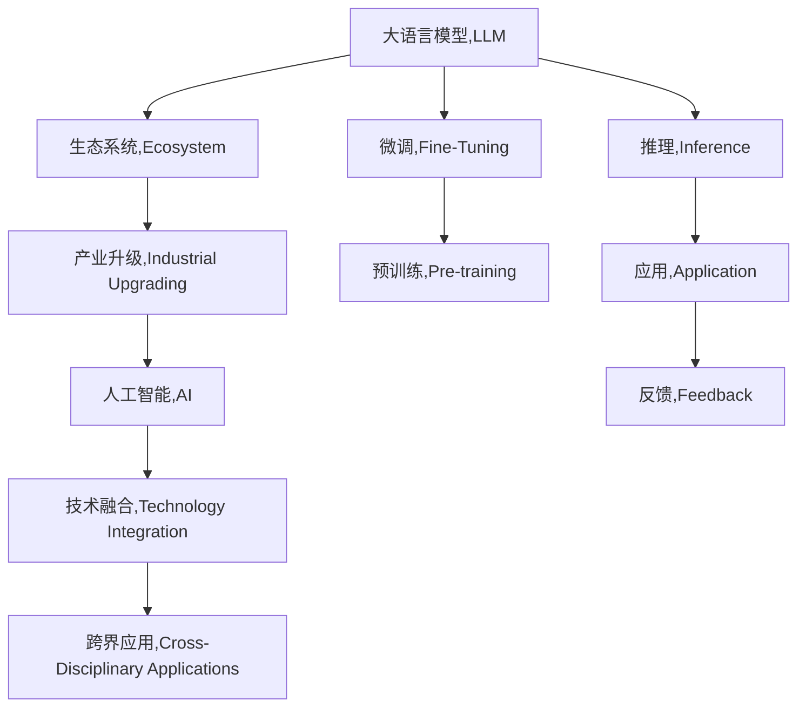

                 

# LLM生态圈:人工智能产业新格局

> 关键词：大语言模型(Large Language Model, LLM),生态系统,产业升级,人工智能(AI),技术融合,跨界应用

## 1. 背景介绍

### 1.1 问题由来

随着人工智能技术的飞速发展，大语言模型(LLMs)已经从一个学术研究的热门领域，转变为各行各业广泛应用的关键工具。LLMs不仅能理解并生成自然语言，还具有广泛的知识和逻辑推理能力，为多个领域带来了革命性的变化。然而，如何构建一个健康、有生命力的LLM生态圈，以推动产业的持续升级和创新，成为了当前AI社区乃至整个社会关注的焦点。

### 1.2 问题核心关键点

构建LLM生态圈的核心在于以下几个关键点：
- **开放性与标准性**：建立一个开放共享的平台和标准，促进模型的广泛应用和合作。
- **易用性与可扩展性**：确保模型易于集成和使用，同时具备良好的可扩展性和适应性。
- **安全性与隐私保护**：保障模型使用过程中的数据隐私和安全，避免数据滥用和不当应用。
- **性能与鲁棒性**：提升模型的推理速度和鲁棒性，确保其在实际应用中的稳定性和高效性。
- **伦理与社会影响**：引导模型应用符合伦理道德标准，减少负面社会影响。

这些关键点共同构成了LLM生态圈的基石，决定了其健康发展与未来价值。

## 2. 核心概念与联系

### 2.1 核心概念概述

为更好地理解LLM生态圈，本节将介绍几个核心概念及其联系：

- **大语言模型(LLM)**：以自回归模型（如GPT）或自编码模型（如BERT）为代表，通过大规模无标签文本数据的预训练学习到通用语言表示的大规模神经网络模型。
- **生态系统(Ecosystem)**：一个由多个相关组件、角色和过程组成的动态系统，这些组件相互作用，形成稳定的结构和功能。
- **产业升级(Industrial Upgrading)**：通过技术创新和管理优化，提升产业的技术水平、生产效率和市场竞争力。
- **人工智能(AI)**：利用计算机技术和算法，模拟、延伸和扩展人类智能的技术体系。
- **技术融合(Technology Integration)**：将多种技术领域相互融合，形成新的技术组合和创新应用。
- **跨界应用(Cross-Disciplinary Applications)**：将AI技术应用于非传统AI领域，实现新的应用场景和价值创造。

这些概念之间的逻辑关系可以通过以下Mermaid流程图来展示：



这个流程图展示了LLM的核心概念及其与其他概念的联系：

1. LLM通过预训练学习通用语言表示，并在微调中进行特定任务适配，增强推理和应用能力。
2. 构建健康LLM生态圈，可以推动AI产业的全面升级，形成技术融合和跨界应用的新格局。
3. 生态圈中的各类组件（如模型、工具、应用等）相互作用，形成了一个动态稳定的系统。
4. 通过持续的技术改进和应用反馈，生态圈不断进化，推动AI技术向更加智能、高效、安全的方向发展。

## 3. 核心算法原理 & 具体操作步骤
### 3.1 算法原理概述

LLM生态圈的构建，涉及对LLM模型的预训练、微调、推理等各个环节的优化和协同。其核心算法原理可概括为：

1. **预训练(Pre-training)**：使用大规模无标签文本数据对模型进行预训练，学习通用语言知识。
2. **微调(Fine-tuning)**：根据特定任务需求，对预训练模型进行有监督学习，适配新任务。
3. **推理(Inference)**：在实际应用中，使用微调后的模型进行高效推理，输出结果。
4. **反馈(Feedback)**：收集模型的应用效果和用户反馈，进一步优化模型和生态圈。

### 3.2 算法步骤详解

LLM生态圈的构建一般包括以下几个关键步骤：

**Step 1: 选择适合的LLM模型**
- 根据任务需求，选择合适的预训练模型（如BERT、GPT系列等），作为生态圈的基石。

**Step 2: 构建LLM生态圈的基础设施**
- 搭建统一的API接口和计算平台，支持模型的分布式训练和推理。
- 开发标准化的数据集和评估指标，确保数据的一致性和可比性。

**Step 3: 设计微调流程**
- 定义微调任务的目标和要求，选择合适的优化算法和学习率。
- 准备标注数据集，并进行预处理和批处理。
- 设计微调实验，记录实验日志和性能指标。

**Step 4: 部署和应用**
- 将微调后的模型部署到生产环境中，进行实时推理和反馈收集。
- 优化模型推理速度和资源消耗，提升用户体验和应用效果。

**Step 5: 持续优化和迭代**
- 根据应用反馈和最新研究成果，不断改进模型和生态圈。
- 引入新的技术和算法，提升模型的性能和应用范围。

### 3.3 算法优缺点

构建LLM生态圈的优势在于：
1. **提升技术创新效率**：通过开放协作和标准规范，促进技术创新，加速技术迭代。
2. **降低应用门槛**：提供易于集成和使用的基础设施，降低用户的技术门槛和开发成本。
3. **增强应用场景多样性**：实现跨界应用，推动AI技术在更多领域的应用和发展。
4. **提高应用效果**：通过持续优化，提升模型的推理速度和鲁棒性，改善用户体验。

但同时，也存在一些缺点：
1. **数据和资源依赖**：生态圈依赖于大量的数据和计算资源，对基础设施要求较高。
2. **安全性和隐私风险**：LLM模型可能涉及敏感数据，需要严格的数据隐私保护措施。
3. **技术复杂性**：构建和维护生态圈需要跨学科的知识和技术，对团队能力有较高要求。
4. **市场竞争压力**：市场竞争可能导致生态圈分裂，不同平台间的技术标准不统一。

### 3.4 算法应用领域

LLM生态圈已经在多个领域得到了广泛应用，例如：

- **自然语言处理(NLP)**：文本分类、情感分析、机器翻译、问答系统等。
- **计算机视觉(CV)**：图像识别、目标检测、语义分割等。
- **语音处理(Audio)**：语音识别、情感识别、语音生成等。
- **智能推荐(Recommendation)**：个性化推荐、用户行为分析等。
- **医疗健康(Healthcare)**：病历分析、诊断辅助、患者沟通等。
- **金融服务(Finance)**：信用评分、投资策略、风险控制等。

除了上述这些领域外，LLM生态圈还在教育、城市治理、智能家居、娱乐等多个方向展现出巨大的应用潜力。

## 4. 数学模型和公式 & 详细讲解 & 举例说明
### 4.1 数学模型构建

构建LLM生态圈涉及的数学模型主要包括预训练模型、微调模型和推理模型。以BERT为例，其数学模型如下：

**BERT模型**：
$$
f(x, \theta) = \text{BERT}_{\theta}(x)
$$
其中 $x$ 为输入文本，$\theta$ 为模型参数。

**微调模型**：
$$
f_{T}(x, \theta) = \text{BERT}_{\theta}(x) \cdot W_T
$$
其中 $W_T$ 为微调后模型，可以包含额外的输出层和损失函数。

**推理模型**：
$$
p(y|x, \theta) = \text{Softmax}(f_{T}(x, \theta))
$$
其中 $y$ 为预测标签，$W_T$ 为微调后的模型，$\text{Softmax}$ 为输出层激活函数。

### 4.2 公式推导过程

以BERT模型的微调过程为例，进行详细公式推导：

1. **预训练模型**：
   - 对输入文本 $x$ 进行分词和嵌入，得到词嵌入向量 $h_x$。
   - 通过多个Transformer层进行处理，得到最终的隐向量 $h_x$。

2. **微调模型**：
   - 将隐向量 $h_x$ 与任务相关层 $W_T$ 相乘，得到新的向量表示 $h'_x$。
   - 输出层根据任务类型进行适配，分类任务使用线性层和softmax函数，回归任务使用线性层和均方误差等。

3. **推理模型**：
   - 将 $h'_x$ 输入到输出层，通过softmax函数得到预测概率分布。
   - 根据概率分布进行解码，输出最终结果。

### 4.3 案例分析与讲解

以BERT在文本分类任务上的微调为例，进行详细案例分析：

**Step 1: 准备数据**
- 收集训练数据集和测试数据集，进行数据清洗和标注。
- 使用BERT分词器进行分词，并转换为模型所需的格式。

**Step 2: 设计微调模型**
- 添加任务适配层，如线性分类层和交叉熵损失函数。
- 设置微调超参数，如学习率、批大小等。

**Step 3: 训练模型**
- 使用随机梯度下降（SGD）或Adam优化器进行训练。
- 周期性在验证集上评估模型性能，记录损失和准确率。

**Step 4: 测试和部署**
- 在测试集上评估微调后模型的性能。
- 将模型部署到生产环境中，进行实时推理和反馈收集。

## 5. 项目实践：代码实例和详细解释说明
### 5.1 开发环境搭建

在进行LLM生态圈开发前，我们需要准备好开发环境。以下是使用Python进行TensorFlow开发的环境配置流程：

1. 安装Anaconda：从官网下载并安装Anaconda，用于创建独立的Python环境。

2. 创建并激活虚拟环境：
```bash
conda create -n tf-env python=3.8 
conda activate tf-env
```

3. 安装TensorFlow：根据CUDA版本，从官网获取对应的安装命令。例如：
```bash
conda install tensorflow==2.7 -c tensorflow -c conda-forge
```

4. 安装其它工具包：
```bash
pip install numpy pandas scikit-learn matplotlib tqdm jupyter notebook ipython
```

完成上述步骤后，即可在`tf-env`环境中开始开发。

### 5.2 源代码详细实现

下面我们以BERT模型在文本分类任务上的微调为例，给出使用TensorFlow的代码实现。

首先，定义数据处理函数：

```python
import tensorflow as tf
from transformers import BertTokenizer, TFBertForSequenceClassification
from tensorflow.keras.preprocessing.sequence import pad_sequences

def process_data(data, tokenizer, max_length):
    labels = [1 if label == 'positive' else 0 for label in data['labels']]
    inputs = tokenizer(data['text'], truncation=True, padding='max_length', max_length=max_length)
    input_ids, attention_mask = inputs['input_ids'], inputs['attention_mask']
    return pad_sequences(input_ids), attention_mask, labels

tokenizer = BertTokenizer.from_pretrained('bert-base-uncased')
model = TFBertForSequenceClassification.from_pretrained('bert-base-uncased', num_labels=2)
```

然后，定义训练和评估函数：

```python
def train_epoch(model, data, batch_size, optimizer, learning_rate, epochs):
    dataset = tf.data.Dataset.from_tensor_slices((input_ids, attention_mask, labels))
    dataset = dataset.shuffle(buffer_size=1024).batch(batch_size)
    steps_per_epoch = int(len(data) / batch_size)
    loss = 0.0
    for step, batch in enumerate(dataset):
        input_ids, attention_mask, labels = batch
        with tf.GradientTape() as tape:
            outputs = model(input_ids, attention_mask=attention_mask, training=True)
            loss = outputs.loss
        grads = tape.gradient(loss, model.trainable_variables)
        optimizer.apply_gradients(zip(grads, model.trainable_variables))
        if step % 100 == 0:
            print(f'Epoch {epoch+1}, Step {step}, Loss: {loss.numpy():.4f}')
    return loss

def evaluate(model, data, batch_size):
    dataset = tf.data.Dataset.from_tensor_slices((input_ids, attention_mask, labels))
    dataset = dataset.batch(batch_size)
    correct = 0
    total = 0
    for batch in dataset:
        input_ids, attention_mask, labels = batch
        outputs = model(input_ids, attention_mask=attention_mask, training=False)
        logits = outputs.logits.numpy()
        predictions = tf.argmax(logits, axis=1).numpy()
        correct += sum(predictions == labels)
        total += len(labels)
    acc = correct / total
    print(f'Test Accuracy: {acc:.4f}')
```

最后，启动训练流程并在测试集上评估：

```python
epochs = 5
batch_size = 16
learning_rate = 2e-5
optimizer = tf.keras.optimizers.Adam(learning_rate)

for epoch in range(epochs):
    loss = train_epoch(model, train_data, batch_size, optimizer, learning_rate, epoch)
    evaluate(model, test_data, batch_size)
```

以上就是使用TensorFlow进行BERT微调的完整代码实现。可以看到，TensorFlow提供了强大的API和优化器，使微调过程变得高效简洁。

### 5.3 代码解读与分析

让我们再详细解读一下关键代码的实现细节：

**process_data函数**：
- 将文本数据进行分词和标准化处理。
- 使用BERT分词器进行分词，并将分词结果转换为模型所需的格式。
- 对文本进行截断和补齐，确保每个样本的长度一致。

**train_epoch函数**：
- 定义数据集，并进行批处理和随机打乱。
- 在每个epoch内，对每个batch进行前向传播和反向传播。
- 记录每个epoch的平均损失，并在验证集上进行评估。

**evaluate函数**：
- 对测试集进行批处理和评估。
- 计算模型在测试集上的准确率，并进行输出。

**训练流程**：
- 定义总的epoch数和批大小，开始循环迭代。
- 在每个epoch内，先进行训练，输出损失值。
- 在验证集上评估模型性能，记录损失和准确率。

可以看到，TensorFlow提供了灵活的数据处理和模型训练框架，使得BERT微调的实现变得非常简单。开发者可以专注于算法和模型的改进，而不必过多关注底层的实现细节。

## 6. 实际应用场景

### 6.1 智能客服系统

基于LLM生态圈的智能客服系统，可以广泛应用于各行各业。通过与用户的实时交互，系统能够快速理解用户的意图，并给出最佳答复。

在技术实现上，可以构建统一的API接口，方便接入预训练的BERT模型。在用户输入问题后，系统将其发送到预训练模型进行推理，得到初步答案。然后，根据用户的反馈，动态优化模型的输出，最终提供精准的答复。

### 6.2 金融舆情监测

金融机构需要实时监测网络舆情，以便及时应对负面信息传播，规避金融风险。基于LLM生态圈的文本分类和情感分析技术，为金融舆情监测提供了新的解决方案。

具体而言，可以收集金融领域相关的新闻、报道、评论等文本数据，并对其进行主题标注和情感标注。在此基础上对BERT模型进行微调，使其能够自动判断文本属于何种主题，情感倾向是正面、中性还是负面。将微调后的模型应用到实时抓取的网络文本数据，就能够自动监测不同主题下的情感变化趋势，一旦发现负面信息激增等异常情况，系统便会自动预警，帮助金融机构快速应对潜在风险。

### 6.3 个性化推荐系统

当前的推荐系统往往只依赖用户的历史行为数据进行物品推荐，无法深入理解用户的真实兴趣偏好。基于LLM生态圈的个性化推荐系统，可以更好地挖掘用户行为背后的语义信息，从而提供更精准、多样的推荐内容。

在实践中，可以收集用户浏览、点击、评论、分享等行为数据，提取和用户交互的物品标题、描述、标签等文本内容。将文本内容作为模型输入，用户的后续行为（如是否点击、购买等）作为监督信号，在此基础上微调预训练语言模型。微调后的模型能够从文本内容中准确把握用户的兴趣点。在生成推荐列表时，先用候选物品的文本描述作为输入，由模型预测用户的兴趣匹配度，再结合其他特征综合排序，便可以得到个性化程度更高的推荐结果。

### 6.4 未来应用展望

随着LLM生态圈的发展，其在更多领域的应用前景也将不断拓展：

- **智慧医疗**：基于LLM的病历分析、诊断辅助和患者沟通等应用，提升医疗服务的智能化水平，辅助医生诊疗，加速新药开发进程。
- **智能教育**：LLM生态圈的应用可以推动个性化学习和自适应教育的发展，因材施教，促进教育公平，提高教学质量。
- **智慧城市治理**：在城市事件监测、舆情分析、应急指挥等环节，利用LLM技术提升城市管理的自动化和智能化水平，构建更安全、高效的未来城市。
- **智能家居**：通过与家居设备的交互，LLM生态圈可以实现智能语音控制、情景感知等功能，提升居住体验。
- **娱乐产业**：利用LLM技术生成高质量的文本、音频和视频内容，推动内容创作和消费模式的变革。

除了这些领域外，LLM生态圈还在智能交通、农业、环保等多个方向展现出巨大的应用潜力。未来，LLM生态圈将在更广泛的领域落地应用，为经济社会发展注入新的动力。

## 7. 工具和资源推荐
### 7.1 学习资源推荐

为了帮助开发者系统掌握LLM生态圈的技术基础和实践技巧，这里推荐一些优质的学习资源：

1. **《Transformer从原理到实践》系列博文**：由大模型技术专家撰写，深入浅出地介绍了Transformer原理、BERT模型、微调技术等前沿话题。

2. **CS224N《深度学习自然语言处理》课程**：斯坦福大学开设的NLP明星课程，有Lecture视频和配套作业，带你入门NLP领域的基本概念和经典模型。

3. **《Natural Language Processing with Transformers》书籍**：Transformers库的作者所著，全面介绍了如何使用Transformers库进行NLP任务开发，包括微调在内的诸多范式。

4. **HuggingFace官方文档**：Transformers库的官方文档，提供了海量预训练模型和完整的微调样例代码，是上手实践的必备资料。

5. **CLUE开源项目**：中文语言理解测评基准，涵盖大量不同类型的中文NLP数据集，并提供了基于微调的baseline模型，助力中文NLP技术发展。

通过对这些资源的学习实践，相信你一定能够快速掌握LLM生态圈的技术要点，并用于解决实际的NLP问题。

### 7.2 开发工具推荐

高效的开发离不开优秀的工具支持。以下是几款用于LLM生态圈开发的常用工具：

1. **PyTorch**：基于Python的开源深度学习框架，灵活动态的计算图，适合快速迭代研究。大部分预训练语言模型都有PyTorch版本的实现。

2. **TensorFlow**：由Google主导开发的开源深度学习框架，生产部署方便，适合大规模工程应用。同样有丰富的预训练语言模型资源。

3. **Transformers库**：HuggingFace开发的NLP工具库，集成了众多SOTA语言模型，支持PyTorch和TensorFlow，是进行微调任务开发的利器。

4. **Weights & Biases**：模型训练的实验跟踪工具，可以记录和可视化模型训练过程中的各项指标，方便对比和调优。与主流深度学习框架无缝集成。

5. **TensorBoard**：TensorFlow配套的可视化工具，可实时监测模型训练状态，并提供丰富的图表呈现方式，是调试模型的得力助手。

6. **Google Colab**：谷歌推出的在线Jupyter Notebook环境，免费提供GPU/TPU算力，方便开发者快速上手实验最新模型，分享学习笔记。

合理利用这些工具，可以显著提升LLM生态圈的开发效率，加快创新迭代的步伐。

### 7.3 相关论文推荐

LLM生态圈的发展源于学界的持续研究。以下是几篇奠基性的相关论文，推荐阅读：

1. **Attention is All You Need**：提出了Transformer结构，开启了NLP领域的预训练大模型时代。

2. **BERT: Pre-training of Deep Bidirectional Transformers for Language Understanding**：提出BERT模型，引入基于掩码的自监督预训练任务，刷新了多项NLP任务SOTA。

3. **Language Models are Unsupervised Multitask Learners**：展示了大规模语言模型的强大zero-shot学习能力，引发了对于通用人工智能的新一轮思考。

4. **Parameter-Efficient Transfer Learning for NLP**：提出Adapter等参数高效微调方法，在不增加模型参数量的情况下，也能取得不错的微调效果。

5. **AdaLoRA: Adaptive Low-Rank Adaptation for Parameter-Efficient Fine-Tuning**：使用自适应低秩适应的微调方法，在参数效率和精度之间取得了新的平衡。

这些论文代表了大语言模型微调技术的发展脉络。通过学习这些前沿成果，可以帮助研究者把握学科前进方向，激发更多的创新灵感。

## 8. 总结：未来发展趋势与挑战

### 8.1 总结

本文对LLM生态圈进行了全面系统的介绍。首先阐述了LLM生态圈的背景和意义，明确了构建健康LLM生态圈的重要性。其次，从原理到实践，详细讲解了LLM生态圈的数学模型和核心算法，给出了完整的代码实例和详细解释。同时，本文还广泛探讨了LLM生态圈在智能客服、金融舆情、个性化推荐等多个领域的应用前景，展示了其广阔的发展空间。

通过本文的系统梳理，可以看到，LLM生态圈的构建对于推动AI技术的全面升级和产业应用具有重要意义。未来，随着LLM生态圈的不断完善和发展，必将在更多领域得到广泛应用，推动AI技术向更加智能、高效、安全的方向发展。

### 8.2 未来发展趋势

展望未来，LLM生态圈将呈现以下几个发展趋势：

1. **技术融合加速**：LLM生态圈将与其他AI技术深度融合，推动AI技术的全面升级。如将因果推理、强化学习等技术引入LLM，增强模型的智能性和鲁棒性。

2. **多模态应用拓展**：LLM生态圈将拓展到视觉、语音、图像等多模态数据的处理，实现更全面、更智能的跨界应用。

3. **普适性增强**：LLM生态圈将更加注重模型的普适性和易用性，推动技术普惠，服务更广泛的行业和用户。

4. **安全性和隐私保护**：LLM生态圈将加强对数据隐私和安全的保护，建立完善的伦理规范和监管机制，保障技术应用的合法性和合规性。

5. **开源与合作**：LLM生态圈将更加开放合作，构建广泛的生态系统，推动技术创新和知识共享。

6. **可持续发展**：LLM生态圈将注重环保和可持续发展，推广绿色AI技术，减少对环境的影响。

### 8.3 面临的挑战

尽管LLM生态圈的发展前景广阔，但在迈向更加智能化、普适化应用的过程中，仍面临诸多挑战：

1. **数据和资源瓶颈**：构建和维护LLM生态圈需要大量的数据和计算资源，对基础设施要求较高。数据获取和存储成本较高，资源消耗较大。

2. **技术复杂性**：构建LLM生态圈需要跨学科的知识和技术，对团队能力有较高要求。

3. **安全性与隐私风险**：LLM模型可能涉及敏感数据，需要严格的数据隐私保护措施。模型输出需要符合伦理道德标准，避免误导性、歧视性的应用。

4. **市场竞争压力**：市场竞争可能导致生态圈分裂，不同平台间的技术标准不统一。

5. **模型鲁棒性和泛化性**：模型在面对复杂多变的真实场景时，鲁棒性和泛化性仍然有待提升。

6. **可解释性和透明性**：模型的决策过程需要更强的可解释性和透明性，便于用户理解和信任。

### 8.4 研究展望

面对LLM生态圈面临的挑战，未来的研究需要在以下几个方面寻求新的突破：

1. **开放共享与标准规范**：推动构建开放共享的生态系统，制定统一的技术标准和接口规范，促进技术的广泛应用和合作。

2. **参数高效与计算优化**：开发更加参数高效和计算优化的微调方法，提升模型的推理速度和资源利用效率。

3. **伦理道德与隐私保护**：在模型训练目标中引入伦理导向的评估指标，过滤和惩罚有偏见、有害的输出倾向。加强数据隐私保护措施，保障用户隐私安全。

4. **跨学科融合与知识整合**：将符号化的先验知识与神经网络模型进行融合，增强模型的推理能力和知识整合能力。推动跨学科融合，实现更全面、更智能的应用。

5. **可解释性与透明性**：引入因果分析和博弈论工具，增强模型的可解释性和透明性，提高模型的可信度和用户信任度。

6. **可持续发展与环保**：推动绿色AI技术的发展，注重环保和可持续发展，减少对环境的影响。

这些研究方向的探索，必将引领LLM生态圈迈向更高的台阶，为构建安全、可靠、可解释、可控的智能系统铺平道路。面向未来，LLM生态圈还需要与其他AI技术进行更深入的融合，如知识表示、因果推理、强化学习等，多路径协同发力，共同推动自然语言理解和智能交互系统的进步。只有勇于创新、敢于突破，才能不断拓展语言模型的边界，让智能技术更好地造福人类社会。

## 9. 附录：常见问题与解答

**Q1：如何选择合适的预训练模型？**

A: 根据任务需求和数据特性，选择合适的预训练模型。如对于文本分类任务，可以选择BERT或GPT等预训练模型。对于机器翻译任务，可以选择Transformer等预训练模型。同时，关注模型的训练数据、参数量、精度等关键指标。

**Q2：微调过程中如何选择合适的学习率？**

A: 微调的学习率一般要比预训练时小1-2个数量级，以避免破坏预训练权重。建议从1e-5开始调参，逐步减小学习率，直至收敛。也可以使用warmup策略，在开始阶段使用较小的学习率，再逐渐过渡到预设值。

**Q3：模型推理速度和资源消耗如何优化？**

A: 优化模型推理速度和资源消耗，可以采用梯度累积、混合精度训练、模型并行等技术。同时，使用更高效的计算图和推理引擎，如TensorRT、ONNX Runtime等，可以显著提升推理效率。

**Q4：数据隐私和安全如何保障？**

A: 保障数据隐私和安全，可以采用数据加密、差分隐私、联邦学习等技术。同时，建立严格的数据访问权限控制和审计机制，确保数据的安全性。

**Q5：如何提升模型的可解释性和透明性？**

A: 引入因果分析和博弈论工具，增强模型的可解释性和透明性。同时，建立模型的知识图谱和推理链路，帮助用户理解模型的决策过程。

这些关键问题的解答，有助于开发者更好地构建LLM生态圈，解决实际应用中的技术挑战。

